# Q1 피뢰기에 대한 다음 물음에 답하시오. [배점: 3점]

(1) 현재 사용되고 있는 교류용 피뢰기의 구조를 두 부분으로 구분하여 작성하시오.

[정답]

(2) 피뢰기의 정격전압에 대해 간단히 설명하시오.

[정답]

(3) 피뢰기의 제한전압에 대해 간단히 설명하시오.

[정답]

## 정답

(1) 직렬 갭과 특성요소

(2) 속류를 차단할 수 있는 교류 최고전압이다.

(3) 피뢰기 방전 중 피뢰기 단자에 남게 되는 충격전압이다.

## 부분점수

| 점수  | 세부기준                                            |
| ----- | --------------------------------------------------- |
| 3~0점 | (1), (2), (3)번 중 한 문항이 맞을 때마다 1점씩 획득 |

---

# Q2 사무실의 면적은 가로 12[m], 세로 18[m], 천장 높이 3[m], 작업면 높이 0.8[m]이다. 이 사무실에 천장 직부 형광등 기구(T5 22[W] × 2등용)를 설치하고자 할 때 다음 각 물음에 답하시오. [배점: 8점]

[조건]

작업면 요구 조도 500[lx], 천장 반사율 50[%], 벽면 반사율 50[%], 바닥 반사율 10[%]이고, 보수율 0.7, T5 22[W] 1등의 광속은 2500[lm]으로 본다.

[조명률 기준표]

| 천장   | 70[%]       | 50[%]       | 30[%]       |
| :----- | :---------- | :---------- | :---------- |
| 반사율 |             |             |             |
| 벽     | 70 50 30 20 | 70 50 30 20 | 70 50 30 20 |
| 바닥   | 10          | 10          | 10          |
| 실지수 | 조명률 [%]  | 조명률 [%]  | 조명률 [%]  |
| 1.5    | 64 55 49 43 | 58 51 45 41 | 52 46 42 38 |
| 2.0    | 69 61 55 50 | 62 56 51 47 | 57 52 48 44 |
| 2.5    | 72 66 60 55 | 65 60 56 52 | 60 55 52 48 |
| 3.0    | 74 69 64 59 | 68 63 59 55 | 62 58 55 52 |
| 4.0    | 77 73 69 65 | 71 67 64 61 | 65 62 59 56 |
| 5.0    | 79 75 72 69 | 73 70 67 64 | 67 64 62 60 |

(1) 실지수를 계산하시오.

[계산과정]

[정답]

(2) 조명률[%]을 선정하시오.

[정답]

(3) 설치 등기구의 최소 수량을 산정하시오.

[계산과정]

[정답]

(4) 형광등을 1일 10시간 연속 점등할 경우 30일 간의 최소 소비전력량을 계산하시오. (단, 형광등의 입력과 출력은 같다고 본다.)

[계산과정]

[정답]

해설) 복합 계산형 / 난이도 중

(1) 실지수 계산

[계산과정]

$$ H = 3 - 0.8 = 2.2 $$

$$ RI = \frac{12 \times 18}{2.2 \times (12 + 18)} = 3.27 $$

[정답] 3.0

(2) 63 [%]

(3) 설치 등기구의 최소수량 산정

[계산과정]

$$ N = \frac{500 \times 12 \times 18}{(2500 \times 2) \times 0.63 \times 0.7} = 48.98 $$

[정답] 49[조]

(4) 최소 소비전력량 계산

[계산과정]

$$ W = (22 \times 2) \times 49 \times 10 \times 30 \times 10^{-3} = 646.8 \text{ [kWh]} $$

[정답] 646.8 [kWh]

부분점수

| 점수  | 세부기준                                                 |
| ----- | -------------------------------------------------------- |
| 8~0점 | (1), (2), (3), (4)번 중 한 문항이 맞을 때마다 2점씩 획득 |

해설

실지수 분류 기호표

| 범위   | 4.5 이상  | 4.5~3.5   | 3.5~2.75 | 2.75~2.25 | 2.25~1.75 |
| ------ | --------- | --------- | -------- | --------- | --------- |
| 실지수 | 5.0       | 4.0       | 3.0      | 2.5       | 2.0       |
| 기호   | A         | B         | C        | D         | E         |
| 범위   | 1.75~1.38 | 1.38~1.12 | 1.12~0.9 | 0.9~0.7   | 0.7 이하  |
| 실지수 | 1.5       | 1.25      | 1.0      | 0.8       | 0.6       |
| 기호   | F         | G         | H        | I         | J         |

---

## Q3. 3상 3선식 배전선로 전압 승압

문제: 3상 3선식 3,000[V], 200[kVA]의 배전선로 전압을 3,100[V]로 승압하기 위하여 단상 변압기 3대를 그림과 같이 접속하였다. 변압기의 손실은 없다고 볼 때 이 변압기의 1, 2차 전압과 용량을 계산하시오. (배점: 5점)

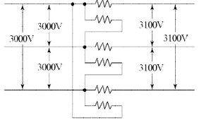

(1) 변압기 1, 2차 전압 [V]을 계산하시오.

[계산과정]

[정답]

(2) 변압기 용량 [kVA]을 계산하시오.

[계산과정]

[정답]

---

# 정답 및 해설

해설) 복합 계산형 / 난이도 중

(1) 변압기 1, 2차 전압 [V] 계산

[계산과정]

$$ V_e = \frac{3,000}{2} + \sqrt{\frac{3,100^2}{3} - \frac{3,000^2}{12}} = 66.31 [V] $$

[정답] 변압기 1차 전압: 3,000 [V], 변압기 2차 전압: 66.31 [V]

(2) 변압기 용량 [kVA] 계산

[계산과정]

$$ 자기 용량 = \frac{3 \times 66.31}{\sqrt{3} \times 3,100} \times 200 = 7.41 [kVA] $$

[정답] 7.41 [kVA]

부분점수

| 점수 | 세부기준                             |
| ---- | ------------------------------------ |
| 5점  | (1), (2)번이 모두 맞은 경우 5점 획득 |
| 3점  | (1)번만 맞은 경우 3점 획득           |
| 2점  | (2)번만 맞은 경우 2점 획득           |

해설

[변압장 Δ(델타)결선]

3대의 단권변압기를 이용하여 고·저압의 공통된 부분을 3각형이 되도록 결선한 것으로 공식은 다음과 같다.

$$ V_e = \frac{V_1}{2} + \sqrt{\frac{V_1^2}{3} - \frac{V_1^2}{12}} [V] $$

$$ 자기 용량 = \frac{3V_1I_2}{\sqrt{3}V_2} = \sqrt{3}\left(\frac{V_1}{2V_2}\right)\sqrt{1+\frac{1}{4}\left(\frac{V_1}{V_2}\right)^2} [VA] $$

---

# Q4 다음과 같은 유접점 회로를 보고 물음에 답하시오. [배점: 4점]

- 회로 시작 LOAD, 출력 OUT, 직렬 AND, 병렬 OR, b접점 NOT이다.
- 그룹 간 묶음은 AND LOAD이다.

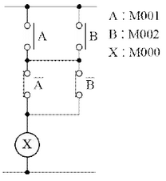

(1) 다음 미완성 PLC 래더 다이어그램을 완성하시오.

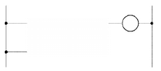

(2) 표의 빈칸 ①~⑥에 해당하는 프로그램을 직접 넣어 완성하시오.

| 차례 | 명령 | 번지 |
| ---- | ---- | ---- |
| 0    | LOAD | M001 |
| 1    | ①    | M002 |
| 2    | ②    | ③    |
| 3    | ④    | ⑤    |
| 4    | ⑥    | -    |
| 5    | OUT  | M000 |

---

## 해설) 논리회로 / 난이도 上

정답

(1) 미완성 PLC 래더 다이어그램 완성

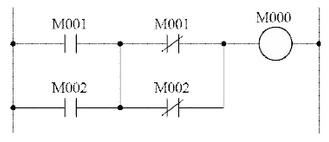

(2) 프로그램 완성

| 차례 | 명령       | 번지   |
| ---- | ---------- | ------ |
| 0    | LOAD       | M001   |
| 1    | ① OR       | M002   |
| 2    | ② LOAD NOT | ③ M001 |
| 3    | ④ OR NOT   | ⑤ M002 |
| 4    | ⑥ AND LOAD | -      |
| 5    | OUT        | M000   |

부분점수

| 점수 | 세부기준                                                       |
| ---- | -------------------------------------------------------------- |
| 4점  | (1), (2)번이 모두 맞은 경우 4점 획득                           |
| 2점  | (1)번이 맞은 경우 2점 획득                                     |
| 2점  | (2)번은 소문항 6개가 모두 맞으면 2점, 3개 이상 맞으면 1점 획득 |

---

# Q5 3상 4선식에서 역률 100[%]의 부하가 각 상과 중성선 간에 연결되어 있고, a상, b상, c상에 흐르는 전류가 각각 110[A], 86[A], 95[A]이다. 이 경우 중성선에 흐르는 전류의 크기 |I_N|를 계산하시오. [배점: 5점]

[계산과정]

## [정답]

해설) 단순 계산형 / 난이도 中

정답

[계산과정]
$$ |I_N| = |110 + 86(1\angle -120^\circ) + 95(1\angle -240^\circ)| $$
$$ = |110 + 86(-\frac{1}{2} - j\frac{\sqrt{3}}{2}) + 95(-\frac{1}{2} + j\frac{\sqrt{3}}{2})| $$
$$ = |110 - 43 - j74.48 - 47.5 + j82.27| = |19.5 + j7.79| $$
$$ = \sqrt{19.5^2 + 7.79^2} \approx 21 [A] $$

[정답] 21 [A]

부분점수

| 점수 | 세부기준                                  |
| ---- | ----------------------------------------- |
| 5점  | 계산과정과 정답이 모두 맞은 경우 5점 획득 |
| 0점  | 계산과정이나 정답에 오류가 있는 경우 0점  |

---

# Q6 다음 조건에서 축전지 용량은 몇 [Ah]인지 계산하시오. [배점: 5점]

[조건]

- 비상용 조명 부하 110[V]용 100[W] 77등, 60[W] 55등이 있다.
- 방전시간은 30분이다.
- 축전지 HS형 54 [cell], 허용 최저전압은 100[V]이다.
- 최저 축전지 온도는 5[℃]이다.
- 경년용량 저하율은 0.8, 용량환산시간 K=1.2이다.

[계산과정]

[정답]

---

# 해설) 단순 계산형 / 난이도 下

## 정답

[계산과정]

$$ I = \frac{100 \times 77 + 60 \times 55}{110} = 100 \text{ [A]} $$

$$ C = \frac{1}{0.8} \times 1.2 \times 100 = 150 \text{ [Ah]} $$

[정답] 150 [Ah]

## 부분점수

| 점수 | 세부기준                                    |
| ---- | ------------------------------------------- |
| 5점  | 계산과정과 정답에 오류가 없는 경우 5점 획득 |
| 0점  | 계산과정이나 정답에 오류가 있는 경우 0점    |

## 해설

$$ C = \frac{1}{L} KI \text{ [Ah]} $$

- C: 축전지의 용량 [Ah]
- L: 보수율(경년용량 저하율)
- K: 용량환산 시간계수
- I: 방전전류 [A]

---

## Q7 배전용 변전소에 접지공사를 하고자 한다. 접지공사에 대한 다음 물음에 답하시오. [배점: 5점]

(1) 접지목적을 3가지 작성하시오.

[정답]

1.
2.
3.

(2) 접지개소를 4가지 작성하시오.

[정답]

1.
2.
3.
4.

---

해설) 서술 암기형 / 난이도 中

(1) 접지목적 3가지 작성

[정답]

① 감전 방지, ② 기기의 손상 방지, ③ 보호 계전기의 확실한 동작

(2) 접지개소 4가지 작성

[정답]

① 일반기기 및 제어반 외함 접지
② 피뢰기 접지
③ 피뢰침 접지
④ 옥외 철구 및 경계책 접지

# 부분점수

| 점수 | 세부기준                                   |
| ---- | ------------------------------------------ |
| 5점  | (1), (2)번이 모두 맞은 경우 5점 획득       |
| 4점  | 소문항 7개 중 5~6개가 정답일 경우 4점 획득 |
| 3점  | 소문항 7개 중 3~4개가 정답일 경우 4점 획득 |
| 2점  | 소문항 7개 중 1~2개가 정답일 경우 4점 획득 |

# 접근 POINT

접지의 목적과 접지해야 하는 위치를 물어보는 문제로 단답 암기형 유형이다. 접지공사는 인체와 전기설비의 보호를 위해서 가장 기본적이며 중요한 역할을 하는 공사로 자주 출제된다.

# 해설

(1) 접지의 목적

① 감전 방지: 기기의 절연 열화나 손상 등으로 누전이 발생하면 전류가 접지선으로 흘러 기기의 대지전위 상승이 억제되고 인체의 감전 위험이 줄어든다.

② 기기의 손상 방지: 뇌전류 또는 고저압 혼촉 등에 의해 침투하는 고전압을 접지선을 통해 대지로 흘려보내 기기의 손상을 방지한다.

③ 보호계전기의 확실한 동작 확보: 접지를 하면 기준 전위(0[V])가 확실하게 되므로 계전기의 동작의 안정성을 확보할 수 있다. 지락사고 시 일정 크기 이상의 지락전류가 흐르기 때문에 지락계전기 등의 동작을 확실하게 할 수 있다.

---

# Q8 변압기와 관련된 다음 물음에 답하시오. [배점: 5점]

(1) 변압기의 호흡작용의 의미를 간단히 작성하시오.

[정답]

(2) 변압기의 호흡작용으로 인하여 발생되는 현상 및 방지대책에 대하여 각각 작성하시오.

[정답]

① 발생현상:

② 방지대책:

---

# 해설) 서술 암기형 / 난이도 중

정답

(1) 변압기의 호흡작용의 의미

[정답]

변압기의 외부의 온도와 내부에서 발생하는 열에 의해 변압기 내부의 절연유의 부피가 수축하거나 팽창하게 된다. 이러한 현상으로 변압기 외부의 공기가 변압기 내부로 출입하게 되는 것을 변압기의 호흡작용이라고 한다.

(2) 변압기의 호흡작용으로 발생하는 현상 및 방지대책

[정답]

① 발생현상: 변압기 내부에 수분 및 불순물이 혼입되어 절연유의 절연내력을 저하시키고 침전물을 발생시킨다.

② 방지대책: 변압기에 흡습 호흡기를 설치한다.

부분점수

| 점수 | 세부기준                                                     |
| ---- | ------------------------------------------------------------ |
| 5점  | (1), (2)번이 모두 맞은 경우 5점 획득                         |
| 3점  | (1)번만 맞은 경우 3점 획득                                   |
| 2점  | (2)번만 맞은 경우 2점 획득, 소문항 1개당 1점씩 부분점수 획득 |

---

# Q9 단권 변압기는 1차, 2차 양 회로에 공통된 권선 부분을 가진 변압기이다. 이러한 단권 변압기에 대한 물음에 답하시오. [배점: 7점]

(1) 단권 변압기의 장점을 3가지 작성하시오.

[정답]

1.
2.
3.

(2) 단권 변압기의 단점을 2가지 작성하시오.

[정답]

1.
2.

(3) 단권 변압기의 사용 용도를 2가지 작성하시오.

[정답]

1.
2.

---

# 정답 해설

해설) 서술 암기형 / 난이도 중

(1) 단권 변압기의 장점 3가지 작성

[정답]

1. 동손이 감소하여 효율이 좋아진다.
2. 부하용량이 등가용량에 비하여 커져 경제적이다.
3. 1권선 변압기이기 때문에 동량이 줄어들어 경제적이다.

(2) 단권 변압기의 단점을 2가지 작성

[정답]

1. 누설 임피던스가 적어 단락 전류가 크다.
2. 1차 측에 이상전압이 발생 시 2차 측에도 고전압이 걸려 위험하다.

(3) 단권 변압기의 사용용도 2가지 작성

[정답]

1. 승압 및 강압용 단권 변압기
2. 초고압 전력용 변압기

부분점수

| 점수  | 세부기준                                   |
| ----- | ------------------------------------------ |
| 7~0점 | 소문항 7 중 1문항을 맞힐 때마다 1점씩 획득 |

해설

단권 변압기

1. 1차와 2차 권선이 독립되어 있지 않고 권선의 일부를 공통 회로로 하는 변압기이다.
2. 분로권선의 전류는 1차 전류와 부하 전류의 차전류이므로 분로권선은 가늘어도 되며 그에 따라 자로가 단축되므로 재료를 절약할 수 있다.
3. 저압 측에도 고압 측과 같이 절연을 해야 하며 고압 측 전압이 높아지면 저압 측에도 고전압을 받게 되어 위험이 따른다.

---

## Q10 다음과 같은 교류 3상 3선식 선로에 연결된 3상 평형 부하가 상 c의 X 점에서 단선되었다. 이 경우 부하의 소비전력은 단선 전 소비전력에 비하여 어떻게 되는지 관계식을 이용하여 설명하시오. (단, 유도과정도 기입하시오.)

[배점: 5점]

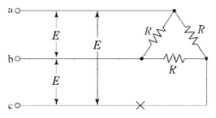

[유도과정]

[정답]

---

# 정답 해설) 복합 계산형 / 난이도 中

## [계산과정]

단상인 경우의 부하 R_L은 다음과 같다.

$$ R_L = \frac{R \times 2R}{R + 2R} = \frac{2}{3}R $$

X점이 단선되었을 경우 단상의 소비전력 P_1은 다음과 같다.

$$ P_1 = \frac{E^2}{R_L} = \frac{E^2}{\frac{2}{3}R} = \frac{3}{2}\frac{E^2}{R} $$

단선 전 3상의 소비전력 P_3 = 3\frac{E^2}{R}이다.

$$ 소비전력비 = \frac{P_1}{P_3} = \frac{\frac{3}{2}\frac{E^2}{R}}{3\frac{E^2}{R}} = \frac{1}{2} \implies P_1 = \frac{1}{2}P_3 $$

## [정답] 단선 전 소비전력에 비하여 \frac{1}{2}배가 된다.

## 부분점수

| 점수 | 세부기준                                  |
| ---- | ----------------------------------------- |
| 5점  | 유도과정과 정답이 모두 맞은 경우 5점 획득 |
| 0점  | 유도과정이나 정답에 오류가 있는 경우 0점  |

## 해설

X점이 단선되면 단상부하가 된다고 생각하고 계산하면 된다.

---

# Q11 어느 전등 수용가의 총 부하는 120 [kW]이고, 각 수용가의 수용률은 어느 곳이나 0.5이다. 이 수용가 군을 설비용량 50 [kW], 40 [kW], 30 [kW]의 3군으로 나누어 다음에 제시된 그림처럼 변압기 $T_1, T_2$ 및 $T_3로$ 공급하려고 한다. 다음 그림과 조건을 기준으로 물음에 답하시오. [배점: 8점]

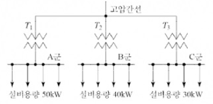

[조건]

- 각 변압기마다의 수용가 상호 간의 부등률은 $ T_1: 1.2, T_2: 1.1, T_3: 1.2 $ 이다.
- 각 변압기마다의 종합부하율은 $ T_1: 0.6, T_2: 0.5, T_3: 0.4 $ 이다.
- 각 변압기 부하 상호 간의 부등률은 1.3이라 하고, 전력 손실은 무시한다.

(1) 각 군(A군, B군, C군)의 종합 최대수용전력 [kW]을 계산하시오.

| 구분 | 계산과정 | 답  |
| ---- | -------- | --- |
| A군  |          |     |
| B군  |          |     |
| C군  |          |     |

(2) 고압 간선에 걸리는 최대부하 [kW]를 계산하시오.

[계산과정]

[정답]

(3) 각 변압기의 평균수용전력 [kW]을 계산하시오.

| 구분 | 계산 과정 | 답  |
| ---- | --------- | --- |
| A군  |           |     |
| B군  |           |     |
| C군  |           |     |

(4) 고압 간선의 종합부하율 [%]을 계산하시오.

[계산과정]

[정답]

---

해설) 복합 계산형 / 난이도 중

정답

(1) 각 군(A군, B군, C군)의 종합 최대수용전력 [kW] 계산

| 구분 | 계산과정                                | 답         |
| ---- | --------------------------------------- | ---------- |
| A군  | $$ \frac{50 \times 0.5}{1.2} = 20.83 $$ | 20.83 [kW] |
| B군  | $$ \frac{40 \times 0.5}{1.1} = 18.18 $$ | 18.18 [kW] |
| C군  | $$ \frac{30 \times 0.5}{1.2} = 12.5 $$  | 12.5 [kW]  |

(2) 고압 간선에 걸리는 최대부하[kW] 계산

[계산과정]

$$ 최대부하 = \frac{20.83 + 18.18 + 12.5}{1.3} = 39.62 [kW] $$

[정답] 39.62 [kW]

(3) 각 변압기의 평균수용전력 [kW]을 계산

| 구분 | 계산과정                      | 답        |
| ---- | ----------------------------- | --------- |
| A군  | $$ 20.83 \times 0.6 = 12.5 $$ | 12.5 [kW] |
| B군  | $$ 18.18 \times 0.5 = 9.09 $$ | 9.09 [kW] |
| C군  | $$ 12.5 \times 0.4 = 5 $$     | 5 [kW]    |

(4) 고압 간선의 종합부하율[%] 계산

[계산과정]

$$ 부하율 = \frac{12.5 + 9.09 + 5}{39.62} \times 100 = 67.11 [%] $$

[정답] 67.11 [%]

부분점수

| 점수  | 세부기준                                                 |
| ----- | -------------------------------------------------------- |
| 8~0점 | (1), (2), (3), (4)번 중 한 문항이 맞을 때마다 2점씩 획득 |

해설

합성 최대 수요 전력 = 수용설비 각각의 최대 수용전력의 합 = 설비 용량 × 수용률 / 부등률

---

# Q12 다음과 같은 콘덴서 기동형 단상 유도전동기의 정역회전 회로도를 보고 물음에 답하시오. (단, 푸쉬버튼 `start1`을 누르면 전동기는 정회전하며, `start2`를 누르면 역회전한다.) [배점: 6점]

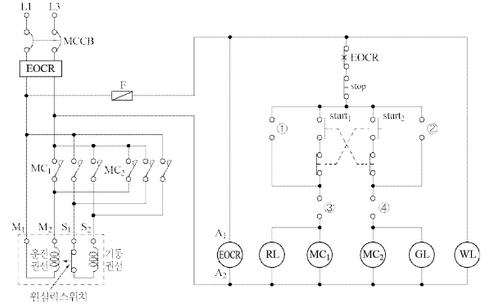

(1) ①~④ 부분의 미완성 회로를 위의 도면에 직접 완성하시오. (단, 접점기호와 명칭도 기입해야 한다.)

(2) 콘덴서 기동형 단상 유도전동기의 기동원리를 작성하시오.
[정답]

(3) WL, GL, RL은 무엇을 표시하는 표시등인지 각각 쓰시오.
[정답]
① WL:
② GL:
③ RL:

---

# 정답 해설

(해설) 도면완성+서술 암기형 / 난이도 中

(1) 미완성 회로 완성

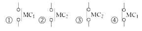

(2) 콘덴서 기동형 단상 유도전동기의 기동원리 작성

[정답]

주권선(운전권선) 전류와 보조권선(기동권선) 전류의 위상차에 의한 회전자계에 의해 기동하는 단상 유도전동기이다.

(3) 표시등의 명칭 작성

1. WL: 전원공급 표시등
2. GL: 역회전 표시등
3. RL: 정회전 표시등

부분점수

| 점수  | 세부기준                                            |
| ----- | --------------------------------------------------- |
| 6~0점 | (1), (2), (3)번 중 한 문항이 맞을 때마다 2점씩 획득 |

해설

콘덴서 전동기

1. 분상 기동형 단상 유도전동기의 한 종류이다.
2. 보조권선과 직렬로 콘덴서를 접속하여 기동 또는 운전을 하는 단상 유도 전동기이다.
3. 주권선(운전권선)에 전기적으로 π/2의 위상차가 있는 위치에 보조권선(기동권선)을 설치하여 이 보조권선에 콘덴서를 접속한 것으로 주권선(운전권선) 전류와 보조권선(기동권선) 전류에 위상차가 생겨 회전자계가 발생한다.
4. 일정 속도에 도달하면 원심력 스위치에 의해 보조권선의 회로가 차단되어 운전된다.

---

# Q13 다음에 제시된 그림은 22.9[kV] 수전설비에서 접지형 계기용 변압기 (GPT)의 미완성 결선도이다. 다음 물음에 답하시오. (단, GPT의 1차 및 2차 보호퓨즈는 생략한다.) [배점: 6점]

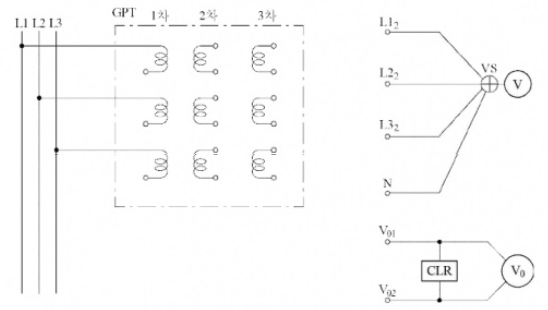

(1) GPT를 활용하여 주회로의 전압 등을 나타내는 회로를 구성하려고 할 때 활용 목적에 알맞도록 미완성 부분을 위의 도면에 직접 그리시오. (단, 접지개소를 정확하게 표기해야 한다.)

(2) GPT의 사용용도를 간단히 작성하시오.

[정답]

(3) GPT의 정격 1차 전압, 2차 전압, 3차 전압을 각각 작성하시오.

[정답]
① 1차 전압:
② 2차 전압:
③ 3차 전압:

(4) GPT의 3차 권선 각 상에 전압 110[V] 램프를 접속하였을 때, 어느 한 상에서 지락사고가 발생했다. 이 경우 램프의 점등상태는 어떻게 변하는지 작성하시오.

[정답]

---

# 정답 해설

해설: 서술 암기형 + 단답 암기형 / 난이도 上

(1) 미완성 도면 작성

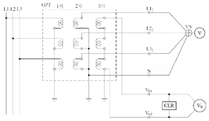

(2) GPT의 사용용도 작성

[정답] 비접지 선로의 접지 전압을 검출한다.

(3) GPT의 정격 1차 전압, 2차 전압, 3차 전압 작성

[정답]

$$ ① 1차 전압: \frac{22,900}{\sqrt{3}} [V] $$

$$ ② 2차 전압: \frac{110}{\sqrt{3}} [V] $$

$$ ③ 3차 전압: \frac{190}{3} [V] $$

(4) 램프의 점등상태 변화

[정답] 지락된 상의 램프는 소등되고, 지락되지 않은 다른 두 상의 램프는 더욱 밝아진다.

부분점수

| 점수 | 세부기준                                       |
| ---- | ---------------------------------------------- |
| 6점  | (1), (2), (3), (4)번이 모두 맞은 경우 6점 획득 |
| 2점  | (1)번만 맞은 경우 2점 획득                     |
| 2점  | (2), (4)번이 맞은 경우 각각 1점씩 획득         |
| 2점  | (3)번만 맞은 경우 2점 획득                     |

---

# Q14 380[V], 3상 유도전동기 회로의 간선 굵기와 과전류 차단기 용량을 주어진 표에 따라 설계합니다. 부하 조건은 다음과 같습니다. 간선의 최소굵기와 과전류차단기의 용량을 계산하세요.[배점 : 4점]

[조건]

1. 전선관에는 3본 이하의 전선을 넣습니다.
2. 공사방법은 B1 (PVC 절연전선)을 사용합니다.
3. 전동기 부하는 다음과 같습니다.
   - 0.75[kW]: 직입기동 (사용전류 2.53[A])
   - 1.5[kW]: 직입기동 (사용전류 4.16[A])
   - 3.7[kW]: 직입기동 (사용전류 9.22[A])
   - 3.7[kW]: 직입기동 (사용전류 9.22[A])
   - 7.5[kW]: 기동기 사용 (사용전류 17.69[A])

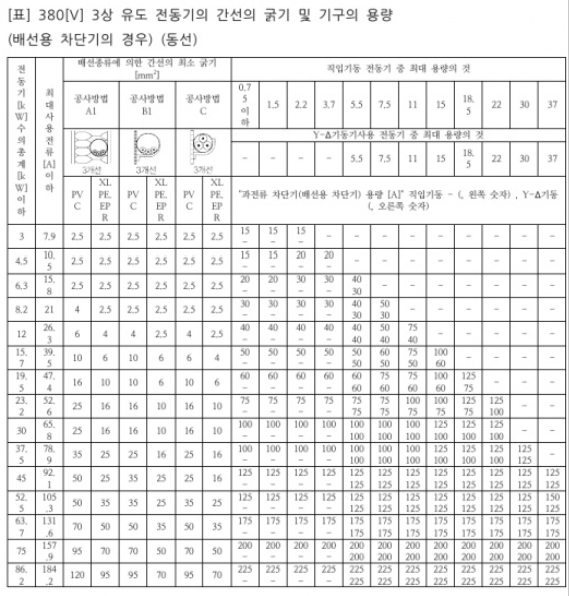

[비고]

- 비고1: 최소 전선 굵기는 1회선에 대한 것이며, 2회선 이상일 경우는 복수회로 보정계수를 적용해야 합니다.
- 비고2: 공사방법 A1은 벽 내의 전선관에 공사한 절연전선 또는 단심케이블, B1은 벽면의 전선관에 공사한 절연전선 또는 단심케이블, 공사방법 C는 벽면에 공사한 단심 또는 다심케이블을 시설하는 경우의 전선 굵기를 표시하였습니다.
- 비고3: 전동기 중 최대의 것은 동시 기동하는 경우를 포함합니다.
- 비고4: 배선용 차단기의 용량은 해당 조항에 규정되어 있는 범위에서 실용상 거의 최댓값을 표시합니다.
- 비고5: 배선용 차단기의 선정은 최대용량의 정격전류의 3배에 다른 전동기의 정격전류의 합계를 가산한 값 이하를 표시합니다.
- 비고6: 배선용 차단기를 배/분전반, 제어반 등의 내부에 시설하는 경우는 그 반 내의 온도상승에 주의합니다.

(1) 간선의 최소 굵기 [mm²]를 선정하시오.

[계산과정]

[정답]

(2) 과전류 차단기 용량 [A]을 선정하시오.

[계산과정]

[정답]

---

# 해설) 단순 계산형+자료해석형 / 난이도 下

## 정답

(1) 간선의 최소 굵기 [mm²]를 선정

[계산과정]

$$ 전동기수의 총계 = 0.75 + 1.5 + 3.7 + 3.7 + 7.5 = 17.15 [kW] $$

표에서 19.5 [kW] 칸에서 전선 10 [mm²]를 선정한다.

[정답] 10 [mm²]

(2) 과전류 차단기 용량 [A] 선정

[계산과정]

$$ 사용전류의 총계 = 2.53 + 4.16 + 9.22 + 9.22 + 17.69 = 42.82 [A] $$

표에서 최대사용전류 47.4 [A] 칸과 기동기 사용 7.5 [kW] 칸에서 과전류차단기 60 [A]를 선정한다.

[정답] 60 [A]

## 부분점수

| 점수 | 세부기준                                |
| ---- | --------------------------------------- |
| 4점  | (1), (2)번이 모두 맞은 경우 4점 획득    |
| 2점  | (1), (2)번 중 하나만 맞은 경우 2점 획득 |

## 해설

복잡한 문제처럼 보이지만 전동기 수와 사용전류의 합계를 구한 후 표에서 해당 수치에 맞는 조건을 선정하면 쉽게 풀 수 있다.

---

# Q15 다음에 제시된 수전계통을 보고 물음에 답하시오. [배점: 9점]

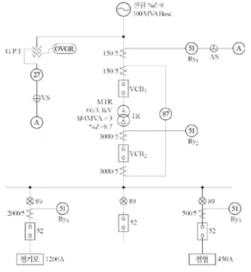

(1) 도면에 제시된 "27"과 "87" 계전기의 명칭과 용도를 설명하시오.

| 기기 | 명칭 | 용도 |
| ---- | ---- | ---- |
| 27   |      |      |
| 87   |      |      |

(2) 다음의 조건을 기준으로 과전류 계전기 $$ R*{y1}, R*{y2}, R*{y3}, R*{y4} $$ 의 탭(Tap) 설정값은 몇 [A]가 적정한지를 계산하시오.

[조건]

- R*{y1}, R*{y2}의 탭 설정값은 부하전류 160[%]에서 설정한다.
- R\*{y3}의 탭 설정값은 부하전류 150[%]에서 설정한다.
- R\*{y4}는 부하가 변동부하이므로, 탭 설정값은 부하전류 200[%]에서 설정한다.

- 과전류 계전기의 전류 탭은 2[A], 3[A], 4[A], 5[A], 6[A], 7[A], 8[A]이다.

[정답]

| 계전기        | 계산과정 | 설정값 |
| ------------- | -------- | ------ |
| $$ R\_{y1} $$ |          |        |
| $$ R\_{y2} $$ |          |        |
| $$ R\_{y3} $$ |          |        |
| $$ R\_{y4} $$ |          |        |

(3) 차단기 VCB_1의 정격전압은 몇 [kV]인지 작성하시오.

[정답]

(4) 전원 측 차단기 VCB_1의 정격용량을 계산하고, 다음의 표에서 가장 적당한 것을 선정하시오.

| 차단기의 정격표준용량[MVA] |       |       |       |
| -------------------------- | ----- | ----- | ----- |
| 1,000                      | 1,500 | 2,500 | 3,500 |

[계산과정]

[정답]

---

# 단답 암기형+서술 암기형+단순 계산형 문제 풀이

(1) "27"과 "87" 계전기의 명칭과 용도 설명

| 기기 | 명칭             | 용도                                                                     |
| ---- | ---------------- | ------------------------------------------------------------------------ |
| 27   | 부족 전압 계전기 | 상시전원 정전 시 또는 부족전압 시 동작하여 경보를 발하거나 차단기를 동작 |
| 87   | 비율 차동 계전기 | 발전기나 변압기의 내부 고장에 대한 보호용으로 사용                       |

(2) 과전류 계전기의 탭(Tap) 설정값 [A] 계산

| 계전기 | 계산과정 | 계산식                                                                                                   | 설정값 |
| ------ | -------- | -------------------------------------------------------------------------------------------------------- | ------ |
| Ry₁    | I        | $\frac{4 \times 10^6 \times 3}{\sqrt{3} \times 66 \times 10^3} \times \frac{5}{150} \times 1.6 = 5.6$    | 6 [A]  |
| Ry₂    | I        | $\frac{4 \times 10^6 \times 3}{\sqrt{3} \times 3.3 \times 10^3} \times \frac{5}{3,000} \times 1.6 = 5.6$ | 6 [A]  |
| Ry₃    | I        | $450 \times \frac{5}{500} \times 1.5 = 6.75$                                                             | 7 [A]  |
| Ry₄    | I        | $1,200 \times \frac{5}{2,000} \times 2 = 6$                                                              | 6 [A]  |

(3) 차단기 VCB₁의 정격전압

72.5 [kV]

(4) 전원 측 차단기 VCB₁의 정격용량 계산

$$ 계산과정: P_s = \frac{100}{8} \times 100 = 1,250 [MVA] $$

정답: 1,500 [MVA] 선정

(부분점수)

| 점수 | 세부기준                                                                 |
| ---- | ------------------------------------------------------------------------ |
| 9점  | (1), (2), (3), (4)번이 모두 맞은 경우 9점 획득                           |
| 1점  | (3)번만 맞은 경우 1점 획득                                               |
| 2점  | (4)번만 맞은 경우 2점 획득                                               |
| 6점  | (1), (2)번은 1문항이 맞을 때마다 3점씩 획득. 단, 오기입 1개당 1점씩 감점 |

(기준충격 절연강도)

| 차단기의 정격전압 [kV] | 사용회로의 공칭 전압 [kV] | BIL [kV] |
| ---------------------- | ------------------------- | -------- |
| 0.6                    | 0.1, 0.2, 0.4             | 45       |
| 3.6                    | 3.3                       | 60       |
| 7.2                    | 6.6                       | 150      |
| 24.0                   | 22.0                      | 350      |
| 72.5                   | 66.0                      | 750      |

(차단기 용량)

① 단락 용량은 %임피던스에 의하여 산출하며, %임피던스는 $$\%Z = \frac{P_Z}{10 V^2}$$ 이기 때문에 $$ P_s = \frac{100}{ \%Z_n} P_n $$ 으로 구한다.

② 차단기의 차단용량은 계통의 단락용량보다는 커야 하므로, 차단기의 정격용량 표에서 1,500[MVA]를 선정한다.

---

# Q16 정격출력 500[kW]의 디젤엔진 발전기를 발열량 10,000 [kcal/L]인 중유 250[L]을 사용하여 1 / 2 부하에서 운전하려고 한다. 이 경우 몇 시간 동안 운전이 가능한지 계산하시오. (단, 발전기의 열효율은 34.4[%] 이다.) [배점: 5점]

[계산과정]

[정답]

---

해설) 단순 계산형 / 난이도 下

정답

[계산과정]
$$ t = \frac{250 \times 10,000 \times 0.344}{860 \times 500 \times \frac{1}{2}} = 4 \text{ [h]} $$

[정답] 4[h]

부분점수

| 점수 | 세부기준                                    |
| ---- | ------------------------------------------- |
| 5점  | 계산과정과 정답에 오류가 없는 경우 5점 획득 |
| 0점  | 계산과정이나 정답에 오류가 있는 경우 0점    |

해설

다음과 같은 발전기의 용량 구하는 식을 활용하여 운전시간을 구할 수 있다.

$$ P = \frac{BH\eta}{860t} \text{ [kW]} $$

B: 연료[kg], H: 발열량[kcal/kg], η: 효율, t: 시간

---

# Q17 1회선당 가능 송전전력 [kW]을 still 식을 이용하여 구하시오. (단, 초고압 송전전압이 345[kV], 선로거리가 200[km]인 경우이다.) [배점: 5점]

[계산과정]

[정답]

---

해설) 단순 계산형 / 난이도 중

정답

[계산과정]
$$ P = \left[ \left( \frac{V_s}{5.5} \right)^2 - 0.6 \right] \times 100 = \left[ \left( \frac{345}{5.5} \right)^2 - 0.6 \right] \times 200 \times 100 = 381,471.07 \text{ [kW]} $$

[정답] 381,471.07 [kW]

부분점수

| 점수 | 세부기준                                      |
| ---- | --------------------------------------------- |
| 5점  | 계산과정이나 정답에 오류가 없는 경우 5점 획득 |
| 0점  | 계산과정이나 정답에 오류가 있는 경우 0점      |

해설

Still의 식(경제적인 송전전압)

다음 Still의 식을 응용하여 송전전력을 계산한다.

$$ V_s = 5.5 \sqrt{0.6l + \frac{P}{100}} \text{ [kV]} $$

$$ l: 송전 거리 [km], P: 송전전력 [kW] $$

---

# Q18 감리원은 공사 완료 후 준공검사 전에 공사업자로부터 시운전 절차를 준비토록 하여 시운전에 입회할 수 있다. 이러한 시운전을 완료한 후 성과품을 공사업자로부터 제출받아 검토한 후 발주자에게 인계하여야 할 사항(서류 등)을 5가지 작성하시오. [배점: 5점]

[정답]

1.  (답변 1)
2.  (답변 2)
3.  (답변 3)
4.  (답변 4)
5.  (답변 5)

---

# 해설) 단답 암기형 / 난이도 중

## 정답

1. 운전지침
2. 시험성적서
3. 실가동 Diagram
4. 점검항목 점검표
5. 성능시험 성적서(성능시험 보고서)

## 부분점수

| 점수  | 세부기준                              |
| ----- | ------------------------------------- |
| 5~0점 | 소문항 1개가 정답일 때마다 1점씩 획득 |

## 해설

감리원이 시운전을 완료한 후 성과품을 공사업자로부터 제출받아 검토한 후 발주자에게 인계하여야 할 사항

1. 운전개시, 가동절차 및 방법
2. 점검항목 점검표
3. 운전지침
4. 시험성적서
5. 성능시험 성적서(성능시험 보고서)
6. 기기류 단독 시운전 방법 검토 및 계획서
7. 실가동 Diagram
8. 시험구분, 방법, 사용매체 검토 및 계획서

---
