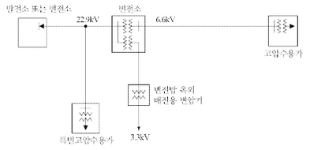
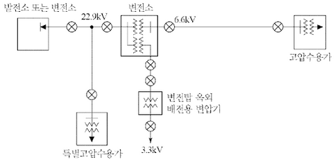
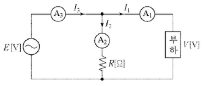
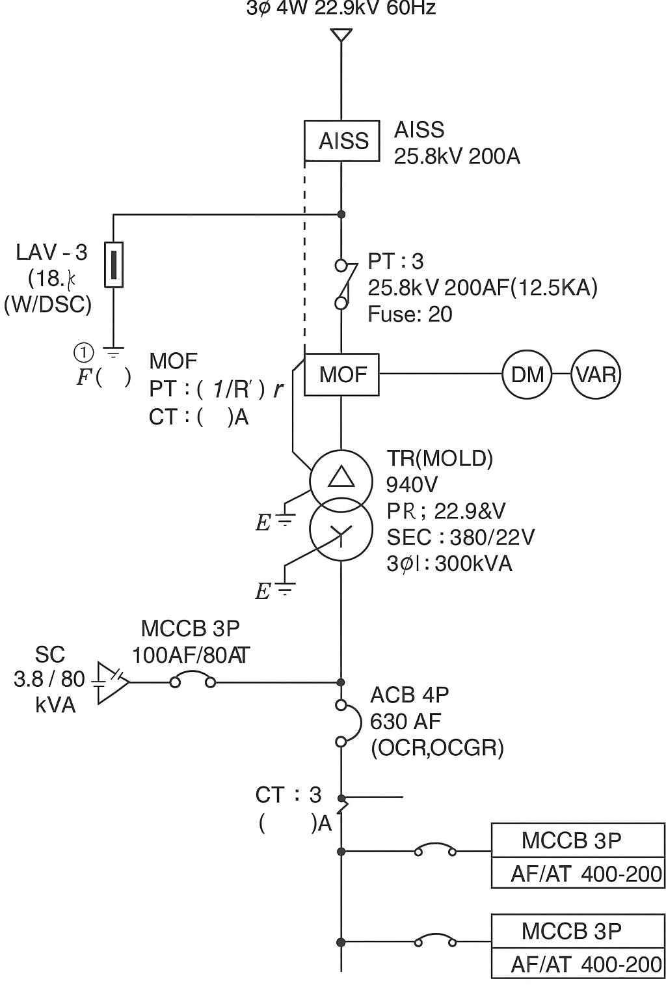
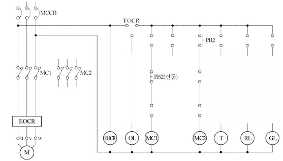
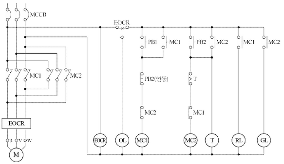
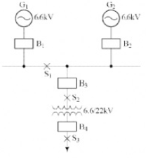
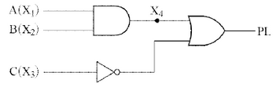

# Q1 단상 유도 전동기에 대한 물음에 답하시오. [배점: 5점]

(1) 기동기를 사용하는 이유를 작성하시오.

[정답]

(2) 기동기의 종류를 4가지 쓰시오.

[정답]

- ①
- ②
- ③
- ④

---

## 정답 해설

해설) 서술 암기형+단답 암기형 / 난이도 中

(1) 기동기를 사용하는 이유

[정답]

단상 유도 전동기는 회전자계가 생기지 않아 자기기동을 하지 못한다. 이에 따라 보조권선의 수단에 의해 회전자계를 발생시켜 기동시키기 위해 기동기를 사용한다.

(2) 기동기의 종류

[정답]

- ① 반발기동형
- ② 분상기동형
- ③ 콘덴서기동형
- ④ 세이딩 코일형

부분점수

| 점수 | 세부기준                                                                                |
| ---- | --------------------------------------------------------------------------------------- |
| 5점  | (1), (2)번이 모두 맞은 경우 5점 획득                                                    |
| 2점  | (1)번만 맞은 경우 2점 획득                                                              |
| 3점  | (2)번은 4문항이 모두 맞은 경우 3점, 2~3문항이 맞은 경우 2점, 1문항만 맞은 경우 1점 획득 |

해설

단상 유도 전동기는 반발기동형, 반발유도형, 콘덴서기동형, 콘덴서전동기, 분상기동형, 세이딩코일형, 모노사이클릭형 등이 있다.

---

# Q2 다음 내용은 전력시설물 공사감리업무 수행지침 중 감리원의 공사중지 명령과 관련된 사항이다. 빈칸에 알맞은 내용을 정답란에 작성하시오. [배점: 4점]

감리원은 시공된 공사가 품질확보 미흡 또는 중대한 위해를 발생시킬 우려가 있다고 판단되거나, 안전상 중대한 위험이 발견된 경우에는 공사 중지를 지시할 수 있으며 공사중지는 부분중지와 전면정지로 구분한다. 부분중지의 경우는 다음 각 호와 같다.

- (①)이(가) 이행되지 않는 상태에서는 다음 단계의 공정이 진행됨으로써 (②)이(가) 될 수 있다고 판단될 때
- 안전시공상 (③)이(가) 예상되어 물적, 인적 중대한 피해가 예견될 때
- 동일 공정에 있어 (④)이(가) 이행되지 않을 때
- 동일 공정에 있어 (⑤)이(가) 있었음에도 이행되지 않을 때

[정답]

1.  **품질**
2.  **결함**
3.  **문제**
4.  **하자**
5.  하자

---

# 해설) 단답 암기형 / 난이도 중

정답

1. 재시공 지시
2. 하자발생
3. 중대한 위험
4. 3회 이상 시정지시
5. 2회 이상 경고

부분점수

| 점수 | 세부기준                          |
| ---- | --------------------------------- |
| 4점  | 5문항이 모두 정답인 경우 4점 획득 |
| 3점  | 3~4문항이 정답인 경우 3점 획득    |
| 2점  | 1~2문항이 정답인 경우 2점 획득    |

해설

[감리원의 공사 중지명령의 구분]

부분중지

- 재시공 지시가 이행되지 않는 상태에서는 다음 단계의 공정이 진행됨으로써 하자발생이 될 수 있다고 판단될 때
- 안전시공상 중대한 위험이 예상되어 물적, 인적 중대한 피해가 예견될 때
- 동일 공정에 있어 3회 이상 시정지시가 이행되지 않을 때
- 동일 공정에 있어 2회 이상 경고가 있었음에도 이행되지 않을 때
- 공사업자가 고의로 공사의 추진을 지연시키거나, 공사의 부실 발생 우려가 짙은 상황에서 적절한 조치를 취하지 않은 채 공사를 계속 진행하는 경우

전면중지

- 부분중지가 이행되지 않음으로써 전체공정에 영향을 끼칠 것으로 판단될 때
- 지진·해일·폭풍 등 불가항력적인 사태가 발생하여 시공을 계속할 수 없다고 판단될 때
- 천재지변 등으로 발주자의 지시가 있을 때

---

# Q3 비상용 자가발전기를 구입하고자 한다. 다음 조건을 기준으로 자가발전기의 용량은 이론(계산)상 몇 [kVA] 이상의 것을 구입해야 하는지 계산하시오. [배점: 4점]

[조건]

- 부하는 단일부하로서 유도전동기이다.
- 기동용량이 1,800 [kVA] 이다.
- 기동 시의 전압강하는 20[%] 까지 허용한다.
- 발전기의 과도리액턴스는 26[%] 이다.

[계산과정]

[정답]

---

# 정답 해설

해설) 단순 계산형 / 난이도 下

## 계산과정

$$ 발전기 용량 [kVA] ≥ (\frac{1}{0.2} - 1) \times 0.26 \times 1800 = 1872 [kVA] $$

## 정답

1,872 [kVA]

## 부분점수

| 점수 | 세부기준                                    |
| ---- | ------------------------------------------- |
| 4점  | 계산과정과 정답에 오류가 없는 경우 4점 획득 |
| 0점  | 계산과정이나 정답에 오류가 있는 경우 0점    |

## 해설

### 자가 발전 설비의 출력 결정

#### ① 단순 부하

$ P = \frac{\sum W_i \times L}{\cos\theta} [kVA] $

$ \sum W_i$: 부하 입력 총계

- L: 부하 수용률(비상용일 경우 1.0)
- $ \cos\theta$: 발전기의 역률(통상 0.8)

#### ② 기동용량이 큰 부하가 있을 경우

$$ P [kVA] > (\frac{1}{\text{허용 전압 강하}} - 1) \times X_d \times \text{기동} [kVA] $$

$X_d$: 발전기의 과도 리액턴스 (보통 25~30%)

허용 전압강하는 보통 20~30[%]이고, 문제에서 조건으로 주어지는 경우가 많다.

---

# Q4 온도가 15[℃]인 물 4[ℓ]를 용기에 넣고 1[kW]의 전열기로 30분 동안 가열했더니 온도가 90[℃]가 되었다. 이 장치의 효율[%]을 계산하시오. (단, 증발이 없는 경우 q=0이다.) [배점: 4점]

[계산과정]

[정답]

---

## 해설) 단순 계산형 / 난이도 중

[계산과정]

$$ \eta = \frac{M(T_2 - T_1)}{860Pt} \times 100 = \frac{4(90 - 15)}{860 \times 1 \times \frac{30}{60}} \times 100 = 69.767 \approx 69.77 [%] $$

[정답] 69.77 [%]

부분점수

| 점수 | 세부기준                                    |
| ---- | ------------------------------------------- |
| 4점  | 계산과정과 정답이 모두 맞는 경우            |
| 0점  | 정답이 틀리거나 계산과정에 오류가 있는 경우 |

접근 POINT

주어진 조건을 이용하여 어떠한 수식을 적용할지를 먼저 파악한 후에 공식을 적용한다. 공식을 적용할 때 각 요소의 단위에 주의해야 한다.

공식 CHECK

$$ M(T_2 - T_1) = 860Pt\eta $$

- M: 물의 양 [l]
- T₂: 상승 후 온도
- T₁: 상승 전 온도
- P: 전열기 전력 [kW]
- t: 가열시간 [h]
- η: 효율

해설

다음은 전열기를 이용한 물을 데워 온도를 상승시키는데 필요한 에너지를 구하는 수식이다.

$$ M(T_2 - T_1) = 860Pt\eta $$

이를 변형하여 구하고자 하는 전열기의 효율을 구할 수 있다.

$$ \eta = \frac{M(T_2 - T_1)}{860Pt} \times 100 = \frac{4(90-15)}{860 \times 1 \times \frac{30}{60}} \times 100 = 69.767 \approx 69.77 [%] $$

여기서, 시간의 단위는 [h]를 사용한다는 것에 주의해야 한다.

---

# Q5 한국전기설비규정에 따라 사용전압이 154[kV]인 중성점 직접접지식 전로의 절연내력 시험을 하고자 한다. 다음 물음에 답하시오. [배점: 5점]

(1) 절연내력 시험전압 [V]을 계산하시오.
[계산과정]

[정답]

(2) 절연내력 시험방법을 쓰시오.

[정답]

---

# 정답 및 해설

해설) 단순 계산형+서술 암기형 / 난이도 하

(1) 절연내력 시험전압

[계산과정]

$$ V = 154,000 \times 0.72 = 110,880 [V] $$

[정답] 110,880 [V]

(2) 절연내력 시험방법

[정답]

절연내력 시험할 부분에 최대 사용전압에 의하여 결정되는 시험전압을 계속하여 10분간 가하여 견디어야 한다.

부분점수

| 점수 | 세부기준                             |
| ---- | ------------------------------------ |
| 5점  | (1), (2)번이 모두 맞은 경우 5점 획득 |
| 3점  | (1)번만 맞은 경우 3점 획득           |
| 2점  | (2)번만 맞은 경우 2점 획득           |

해설

[전로의 절연저항 및 절연내력(KEC 132)]

| 전로의 종류                                                                  | 접지방식 | 시험전압 (최대사용 전압의 배수) | 최저 시험전압 |
| ---------------------------------------------------------------------------- | -------- | ------------------------------- | ------------- |
| 1. 7[kV] 이하인 전로                                                         |          | 1.5배                           |               |
| 2. 7[kV] 초과 25[kV] 이하                                                    | 다중접지 | 0.92배                          |               |
| 3. 7[kV] 초과 60[kV] 이하   (2란의 것을 제외)                             |          | 1.25배                          | 10.5 [kV]     |
| 4. 60[kV] 초과(전위 변성기를 사용하여 접지하는 것을 포함)                    | 비접지   | 1.25배                          |               |
| 5. 60[kV] 초과 (전위 변성기를 사용하여 접지하는 것 및 6란과 7란의 것을 제외) | 접지식   | 1.1배                           | 75[kV]        |
| 6. 60[kV] 초과 (7란의 것을 제외)                                             | 직접접지 | 0.72배                          |               |
| 7. 170[kV] 초과 (발전소 또는 변전소 혹은 이에 준하는 장소에 시설하는 것)     | 직접접지 | 0.64배                          |               |

---

# Q6 아래에 제시된 그림을 보고 물음에 답하시오. [배점: 7점]

(1) 위의 그림에 피뢰기 시설을 의무적으로 설치해야 하는 장소에 직접 표시를 하시오.

(2) 피뢰기 설치장소를 4개소 쓰시오.

[정답]
①
②
③
④

---

# 정답 해설

해설) 단답 암기형+서술 암기형 / 난이도 中

(1) 피뢰기를 설치해야 하는 장소 표시하기

(2) 피뢰기 설치장소

[정답]

1. 발전소, 변전소 또는 이에 준하는 장소의 가공 전선 인입구 및 인출구
2. 가공 전선로에 접속하는 배전용 변압기의 고압측 및 특고압측
3. 고압 및 특고압 가공 전선로로부터 공급을 받는 수용장소의 인입구
4. 가공 전선로와 지중 전선로가 접속되는 곳

부분점수

| 점수  | 세부기준                                 |
| ----- | ---------------------------------------- |
| 7점   | (1), (2)번이 모두 맞은 경우 7점 획득     |
| 3점   | (1)번만 맞은 경우 3점 획득               |
| 4~0점 | (2)번은 한 문항이 맞을 때마다 1점씩 획득 |

---

# Q7 다음과 같은 전류계 3대를 가지고 부하전력 및 역률을 측정하려고 한다. 각 전류계의 눈금이 A_3 = 10[A], A_2 = 4[A], A_1 = 7[A] 일 때, 부하전력 및 역률을 각각 계산하시오. (단, 저항 R = 25[\Omega] 이다.) [배점: 5점] $$

(1) 부하전력 [W]을 계산하시오.

[계산과정]

[정답]

(2) 부하역률 [%]을 계산하시오.

[계산과정]

[정답]

---

# 정답 해설

해설) 단순 계산형 / 난이도 중

(1) 부하전력 [W] 계산

[계산과정]

$$ P = \frac{25}{2}(10^2 - 7^2 - 4^2) = 437.5 \text{[W]} $$

[정답] 437.5 [W]

(2) 부하역률 [%] 계산

[계산과정]

$$ \cos\theta = \frac{10^2 - 7^2 - 4^2}{2 \times 7 \times 4} = 0.625 = 62.5\% $$

[정답] 62.5 [%]

부분점수

| 점수 | 세부기준                             |
| ---- | ------------------------------------ |
| 5점  | (1), (2)번이 모두 맞은 경우 5점 획득 |
| 3점  | (1)번만 맞은 경우 3점 획득           |
| 2점  | (2)번만 맞은 경우 2점 획득           |

해설

전력을 구하는 공식은 다음과 같다.

$$ P = V A_1 \cos\theta = (A_2 R) A_1 \cos\theta \text{ [W]} $$

$$ P = R A_2 \times A_1 \times \frac{A_3^2 - A_1^2 - A_2^2}{2 A_1 A_2} = \frac{R}{2} (A_3^2 - A_1^2 - A_2^2) \text{ [W]} $$

$$ P = \frac{R}{2} (A_3^2 - A_1^2 - A_2^2) \text{ [W]} $$

---

## Q8 특고압 전로에 피뢰기 접지공사를 실시한 후, 접지저항을 보조 접지극 2개(a와 b)를 시설하여 측정하였더니 저항 값이 다음과 같았다. 다음 물음에 답하시오. [배점: 7점]

- 본 접지와 보조 접지극 a 사이의 저항: 86[Ω]
- 보조 접지극 a와 보조 접지극 b 사이의 저항: 156[Ω]
- 보조 접지극 b와 본 접지 사이의 저항: 80[Ω]

(1) 피뢰기의 접지 저항값[Ω]을 계산하시오.

[계산과정]

[정답]

(2) 접지공사의 적합 여부를 판단하고, 그 이유를 설명하시오.

① 적합여부:

② 이유:

---

# 정답

해설) 단순 계산형+서술 암기형 / 난이도 下

(1) 피뢰기의 접지 저항값[Ω] 계산

[계산과정]
$$ R_E = \frac{1}{2}(86 + 80 - 156) = 5 [\Omega] $$

[정답] 5[Ω]

(2) 접지공사의 적합 여부

① 적합여부: 적합
② 이유: 피뢰기 접지공사의 접지저항값은 10[Ω] 이하이어야 한다.

## 부분점수

| 점수 | 세부기준                                                           |
| ---- | ------------------------------------------------------------------ |
| 7점  | (1), (2)번이 모두 맞은 경우 7점 획득                               |
| 3점  | (1)번만 맞은 경우 3점 획득                                         |
| 4점  | (2)번만 맞은 경우 4점 획득, (2)번은 단 한 문항당 부분점수 2점 획득 |

## 해설

접지저항값을 계산하는 공식은 다음과 같이 유도할 수 있다.

$$ R*E + R_a = R*{Ea} ... ① $$

$$ R*a + R_b = R*{ab} ... ② $$

$$ R*b + R_E = R*{bE} ... ③ $$

위의 식을 (①+②+③) × $\frac{1}{2}$ 로 계산하면 다음 식이 성립된다.

$$ R*E + R_a + R_b = \frac{1}{2}(R*{Ea} + R*{ab} + R*{bE}) ... ④ $$

④ - ② 를 한다.

$$ R*E = \frac{1}{2}(R*{Ea} + R*{bE} - R*{ab}) $$

(그림: 원본파일명)

---

# Q9. 부하설비의 최대 수용전력이 각각 200[W], 300[W], 800[W], 1,200[W], 2,500[W]이고, 각 부하 간의 부등률이 1.14, 종합 부하역률은 90[%]이다. 이 경우 변압기 용량을 다음 표를 이용하여 선정하시오. [배점: 5점]

| 변압기 표준 용량 [kVA]                             |
| -------------------------------------------------- |
| 1 ,2, 3, 5, 7.5, 10, 15, 20, 30, 50, 100, 150, 200 |

[계산과정]

[정답]

해설) 단순 계산형 / 난이도 下

정답

[계산과정]

$T_r = \frac{200 + 300 + 800 + 1,200 + 2,500}{1.14 \times 0.9} \times 10^{-3} = 4.87 \text{ [kVA]}$

[정답] 5 [kVA]

부분점수

| 점수 | 세부기준                                    |
| ---- | ------------------------------------------- |
| 5점  | 계산과정과 정답에 오류가 없는 경우 5점 획득 |
| 0점  | 계산과정이나 정답에 오류가 있는 경우 0점    |

해설

변압기 용량은 다음식으로 계산한다.

변압기 용량 $= \frac{\text{부하 설비 용량} \times \text{수용률}}{\text{부등률} \times \text{역률}}$

---

# Q10 사용전압 380[V]인 3상 직입기동 전동기 1.5 [kW] 1대와 3.7 [kW] 2대와 3상 15[kW] 기동기 사용 전동기 1대를 간선에 연결하였다. 이 경우 간선 굵기, 간선의 과전류차단기 용량을 다음에 주어진 표를 이용하여 선정하시오. (단, 공사방법은 B1, PVC 절연전선을 사용했다.) [배점: 4점]

## 표 1: 3상 유도 전동기의 규약 전류값

| 출력 [kW] | 200[V]용 | 380[V]용 |
| --------- | -------- | -------- |
| 0.2       | 1.8      | 0.95     |
| 0.4       | 3.2      | 1.68     |
| 0.75      | 4.8      | 2.53     |
| 1.5       | 8        | 4.21     |
| 2.2       | 11.1     | 5.84     |
| 3.7       | 17.4     | 9.16     |
| 5.5       | 26       | 13.68    |
| 7.5       | 34       | 17.89    |
| 11        | 48       | 25.26    |
| 15        | 65       | 34.21    |
| 18.5      | 79       | 41.58    |
| 22        | 93       | 48.95    |
| 30        | 124      | 65.26    |
| 37        | 152      | 80       |
| 45        | 190      | 100      |
| 55        | 230      | 121      |
| 75        | 310      | 163      |
| 90        | 360      | 189.5    |
| 110       | 440      | 231.6    |
| 132       | 500      | 263      |

[비고1] 사용하는 회로의 전압이 220[V]인 경우는 200[V]인 것의 0.9배로 한다.

[비고2] 고효율 전동기는 제작자에 따라 차이가 있으므로 제작자의 기술자료를 참조한다.

---

---

# 정답

(1) 16[mm²]

(2) 100[A]

## 부분점수

| 점수  | 세부기준                         |
| ----- | -------------------------------- |
| 4~0점 | 한 문항이 맞을 때마다 2점씩 획득 |

## 해설

자료를 해석해서 푸는 문제로 문제 자체는 복잡해 보이지만 문제에 있는 조건대로 표에서 해당 내용을 찾으면 쉽게 풀 수 있는 문제이다.

$$ 전동기 용량 = 1.5 + 3.7 × 2 + 15 = 23.9 [kW] $$

$$ [표1]을 이용하여 전동기 전류 I_M을 계산한다. $$

$$ I_M = 4.21 + 9.16 × 2 + 34.21 = 56.74[A] $$

[표2]를 이용하여 B1, PVC 절연전선 란이 교차되는 곳의 전선의 굵기 16[mm²]을 선정한다.

[표2]의 전동기 [kW] 수의 총계 30[kW] 이하 부분과 기동기 사용 15[kW] 부분이 교차되는 곳의 과전류 차단기 100[A]를 선정한다.

---

# Q11 부하설비가 100[kW]이며, 뒤진 역률이 85[%]인 부하를 100[%]로 개선하려고 한다. 이때 필요한 전력용 콘덴서의 용량은 몇 [kVA]인지 계산하시오. [배점: 4점]

[계산과정]

[정답]

---

# 해설) 단순 계산형 / 난이도 중

## 정답

[계산과정]

$$ Q = 100 \times \frac{\sqrt{1 - 0.85^2}}{0.85} = 61.974 \dots \approx 61.97 \text{[kVA]} $$

[정답] 61.97 [kVA]

## 부분점수

| 점수 | 세부기준                                    |
| ---- | ------------------------------------------- |
| 4점  | 계산과정과 정답이 모두 맞은 경우            |
| 0점  | 정답이 틀리거나 계산과정에 오류가 있는 경우 |

## 접근 POINT

개선 전 역률과 개선 후 역률을 이용하여 필요한 전력용 콘덴서의 용량을 구하기 위해서는 무효전력의 차이를 통해서 구할 수 있다. 무효전력은 개선 전보다 개선 후가 작아지므로 개선 전의 무효전력에서 개선 후의 무효전력을 뺀 값으로 정해진다. 추가로 역률이 1이라면 개선 전의 무효전력을 모두 없앤 것으로 주어진 문제에서는 개선 전의 무효전력을 구하는 문제와 같다.

## 해설

무효전력은 개선 전보다 개선 후가 작아지므로 개선 전의 무효전력에서 개선 후의 무효전력을 뺀 값으로 정해진다.

주어진 문제에서는 개선 후 역률이 1이므로 $\tan\theta_2 = \frac{\sin\theta_2}{\cos\theta_2} = \frac{0}{1} = 0 $이 되어, 개선 전의 무효전력을 구하는 문제와 같아진다.

$$ Q_t = P \tan\theta_1 = P \frac{\sin\theta_1}{\cos\theta_1} = P \frac{\sqrt{1 - \cos^2\theta_1}}{\cos\theta_1} = 100 \times \frac{\sqrt{1 - 0.85^2}}{0.85} = 61.974 \dots \approx 61.97 \text{[kVA]} $$

---

# Q12 정격전류 15[A]인 전동기 두 대, 정격전류 10[A]인 전열기 한 대에 공급하는 간선이 있다. 다음 조건을 기준으로 이 옥내간선을 보호할 수 있는 과전류차단기의 정격전류의 최대값 [A]을 계산하시오. [배점: 5점]

[조건]

- 간선의 허용전류는 61[A]이다.
- 간선의 수용률은 100[%]로 한다.

## 계산과정

## 정답

61 [A]

해설) 단순 계산형 / 난이도 下

[계산과정]

$$ I_B = (15 \times 2) + 10 = 40 [A] $$

$$ I_B \le I_n \le I_Z 에서 40 \le I_n \le 61 $$

$$ I_n = 61 [A] $$

[정답] 61[A]

부분점수

| 점수 | 세부기준                                  |
| ---- | ----------------------------------------- |
| 5점  | 계산과정과 정답이 모두 맞은 경우 5점 획득 |
| 0점  | 계산과정이나 정답에 오류가 있는 경우 0점  |

해설

[도체와 과부하 보호장치 사이의 협조(KEC 212.4.1)]

과부하에 대해 케이블(전선)을 보호하는 장치의 동작특성은 다음의 조건을 충족해야 한다.

$ I_B \le I_n \le I_Z, I_Z \le 1.45 \times I_z $

$ I_B$: 회로의 설계전류(선도체를 흐르는 설계전류 또는 함유율이 높은 영상분 고조파, 특히 제3고조파가 지속적으로 흐르는 경우 중성선에 흐르는 전류이다.)

$ I_Z$: 케이블의 허용전류

$ I_n$: 보호장치의 정격전류(사용현장에 적합하게 조정된 전류의 설정 값)

$ I_z$: 보호장치가 규약시간 이내에 유효하게 동작하는 것을 보장하는 전류 과부하 보호 설계 조건도

---

# Q13 한국전기설비규정(KEC)에 따라 욕실 등 인체가 물에 젖어있는 상태에서 물을 사용하는 장소에 콘센트를 시설하는 경우에 설치해야 하는 저압 차단기의 명칭을 정확하게 쓰시오. [배점: 3점]

[정답]

---

## 해설) 단답 암기형 / 난이도 下

정답

인체감전보호용 누전차단기(전류동작형)

부분점수

| 점수 | 세부기준                               |
| ---- | -------------------------------------- |
| 3점  | 정답을 정확하게 작성한 경우 3점 획득   |
| 0점  | 정답을 정확하게 작성하지 않은 경우 0점 |

해설

[콘센트의 시설(KEC 234.5)]

욕조나 샤워시설이 있는 욕실 또는 화장실 등 인체가 물에 젖어있는 상태에서 전기를 사용하는 장소에 콘센트를 시설하는 경우에는 인체감전보호용 누전차단기(정격감도전류 15[mA] 이하, 동작시간 0.03[초] 이하의 전류동작형의 것에 한함) 또는 절연변압기(정격용량 \ 3[kVA] 이하인 것에 한함)로 보호된 전로에 접속하거나, 인체감전보호용 누전차단기가 부착된 콘센트를 시설하여야 한다.

---

# Q14 다음과 같은 수용가의 수전설비 계통도를 보고 물음에 답하시오.[배점: 16점]

(1) AISS의 명칭을 쓰고, 그 기능을 2가지 작성하시오.

[정답]
① 명칭:
② 기능:

(2) 피뢰기의 정격전압 및 공칭방전전류를 쓰고, DISC의 기능을 간단히 설명하시오.

[정답]
① 피뢰기의 정격전압:
② 공칭방전전류:
③ DISC 기능:

(3) MOF의 정격을 계산하시오.

[계산과정]

[정답]

(4) MOLD TR의 장점 및 단점을 2가지씩 작성하시오.

[정답]
장점: ①
②

단점: ①
②

(5) ACB의 명칭을 쓰시오.

[정답]

(6) CT의 정격(변류비)을 계산하시오.

[계산과정]

[정답]

---

# 단답 암기형+서술 암기형+단순 계산형 문제 풀이

## 문제 및 답

(1) AISS의 명칭과 기능 작성

[정답]

- **명칭:** 기중형 고장구간 자동개폐기
- **기능:**
  - 고장구간을 자동으로 개방하여 파급사고를 방지한다.
  - 전부하 상태에서 자동(또는 수동)으로 개방하여 과부하로부터 보호한다.

(2) 피뢰기 및 DISC 관련 문제

[정답]

- 피뢰기의 정격전압: 18[kV]
- 공칭방전전류: 2.5[kA]
- DISC 기능: 피뢰기 고장시 개방되어 피뢰기를 대지로부터 분리한다.

(3) MOF의 정격 계산

[계산과정]

$$ PT비: \frac{22,900/\sqrt{3}}{190/\sqrt{3}} $$

$$ CT비: I_4 = \frac{300 \times 10^3}{\sqrt{3} \times 22.9 \times 10^3} = 7.56 [A] $$

$$ **[정답]** 변류비 10/5 $$

(4) MOLD TR의 장점 및 단점 작성

[정답]

장점

1. 난연성이 우수하다.
2. 소형, 경량화 할 수 있다.

단점

1. 가격이 비싸다.
2. 수지층에 차폐물이 없어 운전 중 코일 표면과 접촉할 경우 위험하다.

(5) ACB의 명칭: 기중차단기

(6) CT의 정격(변류비) 계산

[계산과정]

$$ I_4 = \frac{300 \times 10^3}{\sqrt{3} \times 380} \times (1.25 \sim 1.5) = 569.75 \sim 683.70 [A] $$

$$ **[정답]** 600/5 $$

## 부분 점수

| 점수 | 세부 기준                                                    |
| ---- | ------------------------------------------------------------ |
| 16점 | (1)~(6)이 모두 맞은 경우 16점 획득                           |
| 15점 | (1), (2), (3), (4), (6)번은 한 문항이 맞을 때마다 3점씩 획득 |
| 1점  | (5)번만 맞은 경우 1점 획득                                   |

## 해설

[AISS]

1. AISS는 Air-Insulated Auto-Sectionalizing Switches의 약자로 기중 절연 자동 고장 구분 개폐기이다.
2. 22.9[kV-y] 배전선로에서 변전소의 차단기 또는 리클로저 부하 측에 부하용량 4,000 [kVA] 이하인 수용가 수전 인입점에 설치한다.

[몰드변압기]

1. 종래의 유입식 및 건식 변압기의 문제점을 해결하기 위해 코일을 에폭시 수지로 Mold한 고체절연방식의 변압기이다.
2. **장점**
   - 난연성이 우수하다.
   - 내습, 내진성이 양호하다.
   - 소형, 경량화 할 수 있다.
   - 전력손실이 적다.
   - 절연유를 사용하지 않아 유지보수가 용이하다.
3. **단점**
   - 가격이 비싸다.
   - 충격파 내전압이 낮다.
   - 수지층에 차폐물이 없어 운전 중 코일 표면과 접촉할 경우 위험하다.

---

# Q15 다음과 같은 요구사항을 만족하는 주회로 및 제어회로의 미완성 결선도를 정답란에 직접 그려서 완성하시오. (단, 접점기호와 명칭 등을 정확히 나타내시오.) [배점: 5점]

## [요구사항]

- 전원 스위치 MCCB를 투입하면 주회로 및 제어회로에 전원이 공급된다.
- 누름버튼 스위치(PB1)를 누르면 MC1이 여자되고 MC1의 보조접점에 의하여 RL이 점등되며, 전동기는 정회전한다.
- 누름버튼 스위치(PB1)를 누른 후 손을 떼어도 MC1은 자기 유지되어 전동기는 계속 정회전한다.
- 전동기 운전 중 누름버튼 스위치(PB2)를 누르면 연동에 의하여 MC1이 소자되어 전동기가 정지되고, RL은 소등된다. 이때 MC2는 자기 유지되어 전동기는 역회전(역상제동을 함)하고, 타이머가 여자되며, GL이 점등된다.
- 타이머 설정 시간 후 역회전 중인 전동기는 정지하고, GL도 소등된다. 또한, MC1과 MC2의 보조접점에 의하여 상호 인터록이 되어 동시에 동작하지 않는다.
- 전동기 운전 중 과전류가 감지되어 EOCR이 동작되면, 모든 제어회로의 전원은 차단되고 OL만 점등된다.
- EOCR을 리셋(Reset) 하면 초기상태로 복귀된다.

## [정답]

---

# 해설) 도면완성 / 난이도 상

## 부분점수

| 점수 | 세부기준                                                  |
| ---- | --------------------------------------------------------- |
| 5점  | 결선도를 정확하게 그린 경우에만 5점 획득, 부분점수는 없음 |

---

# Q16 다음과 같은 조건을 가진 발전소에서 각 차단기의 차단용량을 계산하시오. [배점: 7점]

[조건]

- 발전기 G₁: 용량 10,000[kVA], $x_{G₁}$ = 10[%]
- 발전기 G₂: 용량 20,000[kVA], $x_{G₂}$ = 14[%]
- 발전기 T: 용량 30,000[kVA], $x_T$ = 12[%]

* S₁, S₂, S₃는 단락사고 발생지점이며, 선로 측으로부터의 단락전류는 고려하지 않는다.

(1) S₁ 지점에서 단락사고가 발생하였을 때 B₁, B₂ 차단기의 차단용량 [MVA]을 계산하시오.

[계산과정]

[정답]

(2) S₂ 지점에서 단락사고가 발생하였을 때 B₃ 차단기의 차단용량 [MVA]을 계산하시오.

[계산과정]

[정답]

(3) S₃ 지점에서 단락사고가 발생하였을 때 B₄ 차단기의 차단용량 [MVA]을 계산하시오.

[계산과정]

[정답]

---

# 해설) 복합 계산형 / 난이도 上

(1) S₁지점 단락사고 발생 시 B₁, B₂ 차단기의 차단용량 계산

[계산과정]

기준용량을 변압기의 용량인 30[MVA]로 정하고 환산한다.

$$ \%Z*{G_1} = \frac{30}{10} \times 10 = 30\% , \%Z*{G_2} = \frac{30}{20} \times 14 = 21\% $$

$$ P\_{S,B_1} = \frac{100}{30} \times 30 = 100 [MVA] $$

$$ P\_{S,B_2} = \frac{100}{21} \times 30 = 142.857 \dots \approx 142.86 [MVA] $$

[정답] B₁ 차단기의 용량 = 100 [MVA], B₂ 차단기의 용량 = 142.86 [MVA]

(2) S₂지점 단락사고 발생 시 B₃ 차단기의 차단용량 계산

[계산과정]

S₂지점에서 발전기 측을 바라보면 발전기 G₁과 G₂가 병렬이다.

$$ \%Z\_{G,합성} = \frac{30 \times 21}{30 + 21} = 12.352 \dots \approx 12.35 \% $$

$$ P\_{S,B_3} = \frac{100}{12.35} \times 30 = 242.914 \dots \approx 242.91 [MVA] $$

[정답] B₃ 차단기의 용량 = 123.20 [MVA]

| 점수 | 세부기준                                      |
| ---- | --------------------------------------------- |
| 7점  | (1), (2), (3)이 모두 맞은 경우 7점 획득       |
| 3점  | (1)번만 맞은 경우 3점 획득                    |
| 4점  | (2), (3)번은 한 문항이 맞을 때마다 2점씩 획득 |

접근 POINT

차단기의 차단용량을 구하는 문제는 임피던스나 리액턴스가 비례값인 %Z(퍼센트 임피던스)나 %X(퍼센트 리액턴스)로 주어지며, 발전기나 변압기의 용량이 다르게 주어지므로 먼저 기준용량을 결정한 후 임피던스나 리액턴스를 기준용량에 맞게 환산한 후에 차단용량 계산을 하여야 한다. 일반적으로 기준용량은 변압기의 용량을 기준으로 선정한다.

공식 CHECK

$$ 비례값을 환산하는 수식: \%Z*{기준(환산)} = \frac{기준용량[MVA] \times \%Z*{자기}}{자기용량[MVA]} $$

$$ 차단용량 구하는 수식: P_S = \frac{100}{\%Z} P_n $$

$$ P_S (차단용량) = %Z(등가임피던스) \* P_n (기준용량) $$

$$ 단락비: K_S = \frac{P_S}{P_n} = \frac{I_S}{I_n} = \frac{100}{\%Z} $$

$$ 등가저항: 직렬연결 R_T = R_1 + R_2 , 병렬연결 R_T = \frac{R_1 R_2}{R_1 + R_2} $$

해설

발전소에서는 단락사고가 발생할 경우의 수에 대비하여 차단기를 설치하여야 한다. 각각의 위치에 적합한 차단기를 선정하기 위하여 차단용량을 계산하여 설계할 수 있는 능력을 묻는 문제이다.

이때, 발전기의 용량과 변압기의 용량이 다르며, 조건은 용량에 따른 비례값인 퍼센트 임피던스나 퍼센트 리액턴스가 주어지므로 가장 먼저 해야 할 것은 기준용량을 정하여 비례값을 환산하는 것이다. 일반적으로 변압기의 용량을 기준용량으로 잡아서 계산하게 된다.

---

# Q17 다음과 같은 유접점 시퀀스 회로를 무접점 시퀀스 회로로 바꾸어 작성하시오. [배점: 5점]

[정답]

※ KEC 개정으로 인해 삭제된 문제가 있어 이번 회차 총점수는 95점입니다.

---

## 해설) 도면완성 / 난이도 中

정답

부분점수

| 점수 | 세부기준                                                  |
| ---- | --------------------------------------------------------- |
| 5점  | 논리회로를 정확하게 작성한 경우 5점 획득, 부분점수는 없음 |

---
