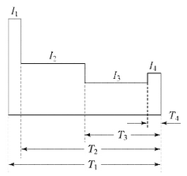
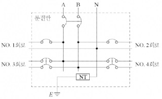
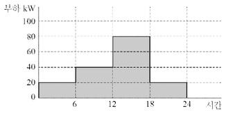
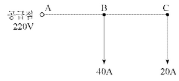
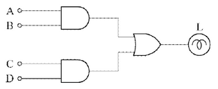
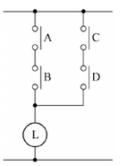
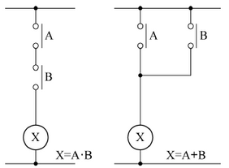
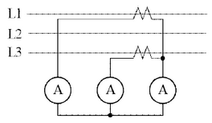
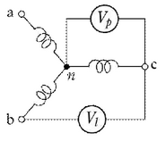

# Q1 조명의 전등효율(Lamp Efficiency)과 발광효율(Luminous Efficiency)에 대한 물음에 답하시오. [배점: 4점]

(1) 전등효율에 대해 공식과 함께 설명하시오.

[정답]

(2) 발광효율에 대해 공식과 함께 설명하시오.

[정답]

---

# 해설) 서술 암기형 / 난이도 中

## 정답

(1) **전등효율**: 전력소비 P에 대한 전발산광속 F의 비율이 전등효율 $\eta$이다.

$$ \eta = \frac{F}{P} \text{[lm/W]} $$

(2) **발광효율**: 방사속 $\phi$에 대한 광속 F의 비율을 그 광원의 발광효율 $\epsilon$이다.

$$ \epsilon = \frac{F}{\phi} \text{[lm/W]} $$

## 부분점수

| 점수 | 세부기준                                   |
| ---- | ------------------------------------------ |
| 4점  | (1), (2)번이 모두 맞은 경우 4점 획득       |
| 2점  | (1), (2)번 중 한 문항만 맞은 경우 2점 획득 |

## 해설

전등효율과 발광효율의 개념, 공식은 암기하고 있어야 한다.

---

# Q2 다음과 같은 방전 특성을 갖는 부하에 대한 축전지 용량 [Ah]을 계산하시오. [배점: 6점]

- 방전전류: $I_1 = 500[A], I_2 = 300[A], I_3 = 100[A], I_4 = 200[A] $
- 방전시간: $T_1 = 120[분], T_2 = 119.9[분], T_3 = 60[분], T_4 = 1[분] $
- 용량 환산시간: $K_1 = 2.49, K_2 = 2.49, K_3 = 1.46, K_4 = 0.57 $
- 보수율은 0.8을 적용한다.

[계산과정]

[정답]

---

# 해설) 단순 계산형 / 난이도 下

## 정답

[계산과정]

$$ C = \frac{1}{L} \left[ K_1 I_1 + K_2 (I_2 - I_1) + K_3 (I_3 - I_2) + K_4 (I_4 - I_3) \right] $$

$$ = \frac{1}{0.8} \left[ 2.49 \times 500 + 2.49(300 - 500) + 1.46(100 - 300) + 0.57(200 - 100) \right] $$

$$ = 640 \text{ [Ah]} $$

[정답] 640 [Ah]

## 부분점수

| 점수 | 세부기준                                    |
| ---- | ------------------------------------------- |
| 6점  | 계산과정과 정답에 오류가 없는 경우 6점 획득 |
| 0점  | 계산과정이나 정답에 오류가 있는 경우 0점    |

## 해설

다음과 같은 측전지 용량 계산 공식을 이용한다.

$$ C = \frac{1}{L} \left[ K_1 I_1 + K_2 (I_2 - I_1) + K_3 (I_3 - I_2) + K_4 (I_4 - I_3) \right] $$

---

# Q3 어느 공장의 구내에 있는 건물에 220/440[V] 단상 3선식을 채용하고, 변압기가 설치된 변전실에서 60[m] 떨어진 곳의 부하를 "부하 집계표"와 같이 배분하는 분전반을 시설하고자 한다. 이 건물의 전기설비에 대하여 참고 자료를 이용하여 물음에 답하시오. (단, 전압강하는 2[%]로 하여야 하고 후강 전선관으로 시설하며, 간선의 수용률은 100[%]로 한다.) [배점: 10점]

| 회로번호 (No.) | 부하 명칭 | 총 부하 [VA] | 부하 분담 [VA] | 극수 | MCCB 규격 | 비고 |
| -------------- | --------- | ------------ | -------------- | ---- | --------- | ---- |
| A선            | B선       | AF           | AT             |
| 1              | 전등1     | 4,920        | 4,920          | 1    | 30        | 20   |
| 2              | 전등2     | 3,920        | 3,920          | 1    | 30        | 20   |
| 3              | 전열기1   | 4,000        | 4,000(AB 간)   | 2    | 50        | 20   |
| 4              | 전열기2   | 2,000        | 2,000(AB 간)   | 2    | 30        | 16   |
| **합계**       |           | **14,840**   |                |      |           |      |

| 도체 단면적 [mm²] | 전선 본수 | 전선관의 최소 굵기 [mm] |
| ----------------- | --------- | ----------------------- | --- | --- | --- | --- | --- | --- | --- | --- |
| 1                 | 2         | 3                       | 4   | 5   | 6   | 7   | 8   | 9   | 10  |
| 2.5               | 16        | 16                      | 16  | 16  | 22  | 22  | 22  | 28  | 28  | 28  |
| 4                 | 16        | 16                      | 16  | 22  | 22  | 22  | 28  | 28  | 28  | 28  |
| 6                 | 16        | 16                      | 22  | 22  | 22  | 28  | 28  | 28  | 36  | 36  |
| 10                | 16        | 22                      | 22  | 28  | 28  | 36  | 36  | 36  | 36  | 36  |
| 16                | 16        | 22                      | 28  | 28  | 36  | 36  | 36  | 42  | 42  | 42  |
| 25                | 22        | 28                      | 28  | 36  | 36  | 42  | 54  | 54  | 54  | 54  |
| 35                | 22        | 36                      | 36  | 42  | 54  | 54  | 54  | 70  | 70  | 70  |
| 50                | 22        | 36                      | 54  | 54  | 70  | 70  | 70  | 82  | 82  | 82  |
| 70                | 28        | 42                      | 54  | 54  | 70  | 70  | 70  | 82  | 82  | 92  |
| 95                | 28        | 54                      | 54  | 70  | 70  | 82  | 82  | 92  | 92  | 104 |
| 120               | 36        | 54                      | 54  | 70  | 70  | 82  | 82  | 92  | 92  | 104 |
| 150               | 36        | 70                      | 70  | 82  | 92  | 92  | 104 | 104 |     |     |
| 185               | 36        | 70                      | 70  | 82  | 92  | 104 |     |     |     |     |
| 240               | 42        | 82                      | 82  | 92  | 104 |     |     |     |     |     |

[비고1] 전선의 1본수는 접지선 및 직류회로의 전선에도 적용한다.

[비고2] 이 표는 실험결과와 경험을 기초로 하여 결정한 것이다.

$$ [비고3] 이 표는 KS C IEC 60227-3의 450/740[V] 일반용 단심 비닐 절연전선을 기준한 것이다. $$

(1) 간선의 굵기 [mm²]를 계산하시오. (단, 중성선의 전압강하는 무시한다.)

[계산과정]

[정답]

(2) 간선설비에 필요한 후강 전선관의 굵기 [mm]를 계산하시오.

[계산과정]

[정답]

(3) 분전반의 복선결선도를 정답란에 직접 작성하시오.

[정답]

(4) 부하집계표를 기준으로 하여 설비불평형률 [%]을 계산하시오.

[계산과정]

[정답]

---

# 정답 해설

해설) 단순 계산형+ / 난이도 中

(1) 간선의 굵기 계산

[계산과정]

부하가 많은 쪽을 기준으로 하여 전류를 계산한다.

$$ I = \frac{4,920 + 4,000 + 2,000}{220 + 440} = 36 \text{ [A]} $$

$$ e' = 220 \times 0.02 = 4.4 \text{ [V]} $$

$$ A = \frac{17.8LI}{1,000e'} = \frac{17.8 \times 60 \times 36}{1,000 \times 4.4} = 8.74 \text{ [mm²]} $$

[정답] 표준규격 10[mm²] 선정

(2) 후강 전선관의 굵기 계산

[계산과정]

표에 의하여 10[mm²] 3본인 경우 22[mm] 후강 전선관을 선정한다.

[정답] 22 [mm]

(3) 복선결선도 완성

(4) 설비불평형률 계산

[계산과정]

$$ 설비불평형률 = \frac{4.920 - 3.920}{(4.920 + 3.920 + 4.000 + 2.000) \times \frac{1}{2}} \times 100 = 13.48 % $$

[정답] 13.48 [%]

부분점수

| 점수 | 세부기준                                         |
| ---- | ------------------------------------------------ |
| 10점 | (1)~(4)번이 모두 맞은 경우 10점 획득             |
| 4점  | (3)번이 맞은 경우 4점 획득                       |
| 6점  | (1), (2), (4)번이 맞은 경우 한 문항당 2점씩 획득 |

해설

KSC IEC 전선규격

| 전선의 공칭 단면적 [mm²] | 전선의 공칭 단면적 [mm²] | 전선의 공칭 단면적 [mm²] |
| ------------------------ | ------------------------ | ------------------------ |
| 1.5                      | 2.5                      | 4                        |
| 6                        | 10                       | 16                       |
| 25                       | 35                       | 50                       |
| 70                       | 95                       | 120                      |
| 150                      | 185                      | 240                      |
| 300                      | 400                      | 500                      |
| 630                      |                          |                          |

후강 전선관의 굵기를 계산할 경우 No.1과 No.2는 극수가 1이므로, 중성선과 전원선(A 또는 B)에 부하를 연결하고 전원선에만 차단기를 설치한다. No.3과 No.4는 극수가 2이므로, 차단기를 설치한 전원선 사이에 부하를 연결한다.

---

# Q4 각 방향에 900 [cd]의 광도를 갖는 광원을 높이 3[m]에 취부했다. 이 경우 직하로부터 30° 방향의 수평면 조도 [lx]를 계산하시오. [배점: 5점]

[계산과정]

[정답]

---

해설) 단순 계산형 / 난이도 中

정답

[계산과정]
$$ E_h = \frac{I}{r^2} \cos\theta = \frac{I}{h^2} \cos^3\theta = \frac{900}{3^2} \cos^3 30^\circ = 64.95 \text{[lx]} $$

[정답] 64.95 [lx]

부분점수

| 점수 | 세부기준                                    |
| ---- | ------------------------------------------- |
| 5점  | 계산과정과 정답에 오류가 없는 경우 5점 획득 |
| 0점  | 계산과정이나 정답에 오류가 있는 경우 0점    |

해설

수평면 조도는 다음과 같이 유도하여 구할 수 있다.

$$ E_h = \frac{I}{r^2} \cos\theta, r = \frac{h}{\cos\theta} $$

$$ E_h = \frac{I}{r^2} \cos\theta = \frac{I}{(\frac{h}{\cos\theta})^2} \cos\theta = \frac{I}{h^2} \cos^3\theta $$

---

# Q5 입력 설비용량 20[kW] 2대, 30[kW] 2대의 3상 380[V] 유도전동기 군의 부하곡선이 아래 그림과 같다. 다음 물음에 답하시오. [배점: 6점]

$$ (1) 최대수용전력 [kW]을 쓰시오. $$

[정답]

(2) 수용률 [%]을 계산하시오.

[계산과정]

[정답]

(3) 일부하율 [%]을 계산하시오.

[계산과정]

[정답]

---

# 정답 해설

해설: 단순 계산형 / 난이도 중

(1) 최대수용전력

[정답] 80 [kW]

(2) 수용률

[계산과정]

$$ 수용률 = \frac{80}{20 \times 2 + 30 \times 2} \times 100 = 80 [%] $$

[정답] 80 [%]

(3) 일부하율

[계산과정]

$$ 일부하율 = \frac{20 \times 6 + 40 \times 6 + 80 \times 6 + 20 \times 6}{80} \times \frac{24}{80} \times 100 = 50 [%] $$

[정답] 50 [%]

부분점수

| 점수  | 세부기준                                                                                  |
| ----- | ----------------------------------------------------------------------------------------- |
| 6~0점 | (1), (2), (3) 각 문제당 2점 부여, (2), (3)은 계산과정과 정답이 모두 맞은 경우만 점수 획득 |

접근 POINT

일간 부하량에 대한 그래프를 해석하는 능력을 확인하기 위해 출제된 문제로 그래프만 정확하게 해석하면 쉽게 풀 수 있다.

해설

주어진 그래프는 하루 중 시간별 부하전력 그래프다. 그래프에서 최대 수용전력을 찾을 수 있는지와 수용률 및 일부하율을 계산할 수 있는 능력을 묻는 문제이다. 기본적으로 수용률, 부하율, 수용전력, 설비용량, 평균전력 등 용어에 대하여 이해하고 있어야 하며, 각각의 용어와 관련된 의미와 값을 구하는 수식을 암기하여야 한다. 단계별로 나누어 구할 수 있지만, 이런 문제는 단계를 분리하지 않고 바로 하나의 풀이 수식 안에 포함하여 답안을 작성하는 연습을 해야 한다.

---

# Q6 그림과 같은 단상 2선식 회로에서 공급점 A의 전압이 220 [V]이고, A-B 사이의 1선 마다의 저항이 0.02 [Ω], B-C 사이의 1선 마다의 저항이 0.04 [Ω]이다. 다음 물음에 답하시오. (단, 부하의 역률은 1이다.) [배점: 5점]

(1) 40[A]를 소비하는 B점의 전압 $V_B$를 계산하시오.

[계산과정]

[정답]

(2) 20[A]를 소비하는 C점의 전압 $V_C$를 계산하시오.

[계산과정]

[정답]

---

## 해설) 단순 계산형 / 난이도 下

정답

(1) 40[A]를 소비하는 B점의 전압 $V_B$ 계산

[계산과정]

$$ V*B = V_A - 2(I_B + I_C)R*{AB} = 220 - 2 \times (40 + 20) \times 0.02 = 217.6 [V] $$

[정답] 217.6 [V]

(2) 20[A]를 소비하는 C점의 전압 $V_C$ 계산

[계산과정]

$$ V*C = V_B - 2I_C R*{BC} = 217.6 - 2 \times 20 \times 0.04 = 216 [V] $$

[정답] 216 [V]

부분점수

| 점수 | 세부기준                             |
| ---- | ------------------------------------ |
| 5점  | (1), (2)번이 모두 맞은 경우 5점 획득 |
| 3점  | (1)번만 맞은 경우 3점 획득           |
| 2점  | (2)번만 맞은 경우 2점 획득           |

---

# Q7 22.9[kV]/380-220[V] 변압기 결선은 보통 △-Y 결선방식을 사용한다. 이 결선방식에 대한 물음에 답하시오. [배점: 4점]

(1) △-Y 결선방식의 장점을 2가지 쓰시오.

[정답]
①
②

(2) △-Y 결선방식의 단점을 2가지 쓰시오.

[정답]
①
②

---

# 정답 해설

해설) 서술 암기형 / 난이도 중

(1) Δ-Y 결선방식의 장점

[정답]

① 한 쪽 Y결선의 중성점을 접지할 수 있다.

② Y결선의 상전압은 선간전압의 $\frac{1}{\sqrt{3}}$이므로 절연이 용이하다.

(2) Δ-Y 결선방식의 단점

[정답]

① 1상에 고장이 생길 경우 전원공급이 불가능해진다.

② 중성점 접지로 인한 유도장해를 초래한다.

부분점수

| 점수 | 세부기준                                   |
| ---- | ------------------------------------------ |
| 4점  | (1), (2)번이 모두 맞은 경우 4점 획득       |
| 2점  | (1), (2)번 중 한 문항이 맞은 경우 2점 획득 |

# 해설

## Y-Δ의 장점과 단점

장점

① 한 쪽 Y결선의 중성점을 접지할 수 있음

② Y결선의 상전압은 선간전압의 $\frac{1}{\sqrt{3}}$이므로 절연이 용이함

③ 1, 2차 중에 Δ결선이 있어 제3고조파의 장해가 적고, 기전력의 파형이 왜곡되지 않음

④ Y-Δ 결선은 강압용으로, Δ-Y 결선은 승압용으로 사용할 수 있어서 송전계통에서 융통성 있게 사용됨

단점

① 1, 2차 선간전압 사이에 30°의 위상차가 생김

② 1상에 고장이 생기면 전원공급이 불가능해짐

③ 중성점 접지로 인한 유도장해를 초래함

---

# Q8 교류 동기 발전기에 대한 다음 각 물음에 답하시오. [배점: 8점]

(1) 정격전압 6,000[V], 용량 5,000 [kVA]인 3상 교류 동기 발전기에서 여자전류가 300[A], 무부하 단자전압은 6,000 [V], 단락전류는 700 [A]이다. 이 발전기의 단락비를 계산하시오.

[계산과정]

[정답]

(2) 다음 ( ) 안에 알맞은 내용을 쓰시오. (단, ①~⑥의 내용은 크다(고), 적다(고), 높다(고), 낮다(고) 중 하나로 작성하시오.)

단락비가 큰 교류발전기는 일반적으로 기계의 치수가 (①), 가격이 (②), 풍손, 마찰손, 철손이 (③), 효율은 (④), 전압변동률은 (⑤), 안정도는 (⑥).

[정답]

①

②

③

④

⑤

⑥

(3) 비상용 동기 발전기의 병렬운전 조건을 4가지 쓰시오.

[정답]

①

②

③

④

---

# 정답

해설) 단순 수식형+단답 암기형 / 난이도 中

(1) 발전기의 단락비 계산

[계산과정]

$$ K_s = \frac{700}{\frac{5,000 \times 10^3}{\sqrt{3} \times 6,000}} = \frac{700}{481.13} = 1.454 \cdots \approx 1.45 $$

[정답] 1.45

(2) 단락비가 큰 기계의 특징

① 크고, ② 높고, ③ 크고, ④ 낮고, ⑤ 작고, ⑥ 높다

(3) 동기 발전기의 병렬운전 조건

① 기전력의 크기가 같을 것
② 기전력의 파형이 같을 것
③ 기전력의 주파수가 같을 것
④ 기전력의 위상이 같을 것

부분점수

| 점수 | 세부기준                                                              |
| ---- | --------------------------------------------------------------------- |
| 8점  | (1)의 계산과정과 정답이 모두 맞고, (2), (3)의 소문항이 모두 맞은 경우 |
| 4점  | 문항 (1)의 계산과정과 정답이 모두 맞는 경우                           |
| 2점  | 문항 (2)의 소문항 3개당 1점씩 부여 (0~2개 0점, 3~5개 1점, 6개 2점)    |
| 2점  | 문항 (3)의 소문항 2개당 1점씩 부여 (0~1개 0점, 2~3개 1점, 4개 2점)    |

접근 POINT

교류 동기발전기에서 3상에 대한 단락비를 계산하고, 단락비와 관련된 기기의 특징과 병렬운전 조건에 대해 묻는 문제로 단순 수식형, 단답 암기형, 서술 암기형이 복합적으로 출제된 문제이다.

해설

(1) 발전기의 단락비 계산

STEP 1. 3상 동기발전기에서 전력식을 이용하여 정격전류 계산

$$ I_n = \frac{P_n}{\sqrt{3}V} = \frac{5,000 \times 10^3}{\sqrt{3} \times 6,000} = 481.125 \cdots \approx 481.13 [A] $$

STEP 2. 구한 정격전류값과 조건에서 주어진 단락전류를 이용하여 단락비 계산

$$ K_s = \frac{I_s}{I_n} = \frac{700}{481.13} = 1.454 \cdots \approx 1.45 $$

(2) 단락비가 큰 기계의 특징

단락비가 큰 기계를 철기계라 부르며 실제로 철 성분이 많고 발전기의 틀이 철이기 때문에 기계의 크기는 커지게 된다. 기계가 커짐에 따라 가격이 비싸지며, 철손, 풍손, 마찰손도 커지게 되어 손실이 증가하게 된다. 손실이 증가함에 따라 효율은 낮아지게 된다.

단락비가 크다는 것은 기기의 동기 임피던스가 작다는 것이고 전압강하가 줄어 전압변동률이 감소하며 안정도가 높아지고 전기자 반작용도 작아져 과부하 내량이 커짐을 의미한다.

(3) 동기 발전기의 병렬운전 조건

교류 전압 파형의 순시값 수식을 통해 암기!

$$ v(t) = V_m \cos(\omega t + \theta) = V_m \cos(2\pi f t + \theta) $$

$$ v(t): 교류 전압의 순시값, V_m: 전압의 최댓값, \omega: 각주파수 $$
$$ f: 주파수, \theta: 위상 $$

전압은 전류를 흐르게 하는 힘으로 다른 용어로 기전력이라 한다. $V_m$은 기전력의 최댓값으로 크기를 의미하고, $\cos$은 정현파의 파형을 의미하고, $\omega$ 와 f는 각주파수와 주파수로 통틀어 주파수를 의미하고, $\theta$는 위상을 의미한다.

위상은 t=0(시작점)에서의 파형의 시작 위치(또는 방향)를 의미한다.

---

# Q9 다음은 전력시설물 공사감리업무 수행지침과 관련된 사항이다. ( ) 안에 들어갈 내용을 정답란에 작성하시오. [배점: 5점]

감리원은 설계도서 등에 대하여 공사계약문서 상호 간의 모순되는 사항, 현장 실정과의 부합 여부 등 현장시공을 주안으로 하여 해당 공사 시작 전에 검토하여야 하며 검토내용에는 다음 각 호의 사항 등이 포함되어야 한다.

1. 현장조건에 부합 여부
2. 시공의 (①) 여부
3. 다른 사업 또는 다른 공정과의 상호부합 여부
4. (②), 설계 설명서, 기술계산서, (③) 등의 내용에 대한 상호일치 여부
5. (④), 오류 등 불명확한 부분의 존재여부
6. 발주자가 제공한 (⑤)와 공사업자가 제출한 산출내역서의 수량 일치 여부
7. 시공 상의 예상 문제점 및 대책 등

[정답]

1.
2.
3.
4.
5.

---

# 정답 해설

해설) 단답 암기형 / 난이도 中

1. 실제가능
2. 설계도면
3. 산출내역서
4. 설계도서의 누락
5. 물량 내역서

## 부분점수

| 점수  | 세부기준                       |
| ----- | ------------------------------ |
| 5~0점 | 1문항이 맞을 때마다 1점씩 획득 |

## 해설

### 설계도서 등의 검토

1. 감리원은 설계도면, 설계설명서, 공사비 산출내역서, 기술계산서, 공사계약서의 계약내용과 해당공사의 조사 설계보고서 등의 내용을 완전히 숙지하여 새로운 방향의 공법개선 및 예산절감을 도모하도록 노력하여야 한다.

2. 감리원은 설계도서 등에 대하여 공사계약문서 상호 간의 모순되는 사항, 현장 실정과의 부합여부 등 현장 시공을 주안으로 하여 해당 공사 시작 전에 검토하여야 하며 검토내용에는 다음 각 호의 사항 등이 포함되어야 한다.

   ① 현장조건에 부합 여부
   ② 시공의 실제가능 여부
   ③ 다른 사업 또는 다른 공정과의 상호부합 여부
   ④ 설계도면, 설계설명서, 기술계산서, 산출내역서 등의 내용에 대한 상호일치 여부
   ⑤ 설계도서의 누락, 오류 등 불명확한 부분의 존재여부
   ⑥ 발주자가 제공한 물량 내역서와 공사업자가 제출한 산출내역서의 수량일치 여부
   ⑦ 시공 상의 예상 문제점 및 대책 등

---

# Q10. 에너지 절약을 위한 동력설비의 적절한 대응방안을 5가지 작성하시오. [배점: 5점]

[정답]

①

②

③

④

⑤

---

# 해설) 서술 암기형 / 난이도 中

## 정답

1. 고효율 전동기를 사용한다.
2. 역률개선용 콘덴서를 전동기별로 설치하여 부하의 역률을 개선한다.
3. 전동기 제어시스템(VVVF 시스템)을 적용한다.
4. 에너지 절약형 공조기기 System을 채택한다.
5. 군 관리 운전방식 등으로 엘리베이터를 효율적으로 관리한다.

## 부분점수

| 점수  | 세부기준                         |
| ----- | -------------------------------- |
| 5~0점 | 한 문항이 맞을 때마다 1점씩 획득 |

## 해설

자주 출제되지는 않는 문제로 일반적인 내용으로 작성해도 정답 처리된다.

---

# Q11 다음과 같은 무접점 논리회로를 유접점 시퀀스회로로 변환하여 나타내시오. [배점: 4점]

[정답]

---

# 정답

## 부분점수

작성한 유접점 시퀀스회로가 정답과 맞는 경우에만 점수를 인정받으므로 부분 점수는 없다.

## 접근 POINT

무접점 논리회로와 유접점 시퀀스회로의 변환관계를 알고 그림으로 표현할 수 있다면 시퀀스 관련 파트에서 가장 난이도가 쉬운 문제이다. 주로 무접점 논리회로나 논리식 또는 진리표가 주어지면 논리식을 간소화한 후 유접점 시퀀스회로로 변환하는 문제가 출제된다.

## 해설

논리식이나 무접점 논리회로의 AND는 유접점 논리회로에서 접점의 직렬연결로 표현되며, 논리식이나 무접점 논리회로의 OR는 유접점 논리회로에서 접점의 병렬연결로 표현된다.

---

# Q12 다음과 같이 접속된 3상 3선식 고압 수전설비의 변류기 2차 전류가 언제나 4.2[A]이었다. 이때 수전전력 [kW]을 계산하시오. (단, 이 설비에서 수전전압은 6,600 [V], 변류비는 50/5[A], 역률은 100 [%] 이다.) [배점: 5점]

[계산과정]

[정답]

---

해설) 단순 계산형 / 난이도 중

정답

[계산과정]
$$ P = \sqrt{3} V_1 I_1 \cos\theta \times 10^{-3} = \sqrt{3} \times 6600 \times \left(4.2 \times \frac{50}{5}\right) \times 1 \times 10^{-3} = 480.12 \text{ [kW]} $$

[정답] 480.12 [kW]

부분점수

| 점수 | 세부기준                                    |
| ---- | ------------------------------------------- |
| 5점  | 계산과정과 정답에 오류가 없는 경우 5점 획득 |
| 0점  | 계산과정과 정답에 오류가 있는 경우 0점      |

해설

CT의 결선은 가동접속으로, 왼쪽 전류계부터 각각 L₁상, L₂상, L₃상의 전류가 나타나므로 3상 전력 공식을 사용하여 계산한다.

---

## Q13. 다음과 같이 Y 결선된 평형 부하에 전압을 측정할 때 전압계의 지시값이 V_p = 150[V], V_l = 220[V]로 측정되었다. 다음 조건을 기준으로 물음에 답하시오. [배점: 5점]

[조건]

- 부하 측에 인가된 전압은 각상 평형 전압이다.
- 기본파와 제3고조파만 전압만이 포함되어 있다.

(1) 제3고조파 전압 [V]을 계산하시오.

[계산과정]

[정답]

(2) 전압의 왜형률 [%]을 계산하시오.

[계산과정]

[정답]

---

# 정답 해설

(1) 제3고조파 전압[V] 계산

[계산과정]

상전압 $V_p$에는 기본파와 제3고조파 전압만 존재한다.

$$ V_p = \sqrt{V_1^2 + V_3^2}, 150 = \sqrt{V_1^2 + V_3^2} $$

선간 전압 $V_L$에는 제3고조파분이 존재하지 않는다.

$$ V_L = \sqrt{3} V_1, 220 = \sqrt{3} V_1 $$

위의 두 식에서 다음 식을 유도한다.

$$ V_1 = \frac{220}{\sqrt{3}} = 127.02 [V] $$

$$ V_3 = \sqrt{150^2 - V_1^2} = \sqrt{150^2 - 127.02^2} = 79.79 [V] $$

[정답] 79.79[V]

(2) 전압의 왜형률[%] 계산

[계산과정]

$$ 왜형률 = \frac{V_3}{V_1} = \frac{79.79}{127.02} = 0.6282 = 62.82 [%] $$

[정답] 62.82[%]

부분점수

| 점수 | 세부기준                             |
| ---- | ------------------------------------ |
| 5점  | (1), (2)번이 모두 맞은 경우 5점 획득 |
| 3점  | (1)번만 맞은 경우 3점 획득           |
| 2점  | (2)번만 맞은 경우 2점 획득           |

해설

왜형률은 다음 식으로 구할 수 있다.

$$ 왜형률 = \frac{\text{전고조파의 실효값}}{\text{기본파의 실효값}} $$

---

# Q14 접지설비에서 보호도체에 대한 물음에 답하시오. [배점: 5점]

(1) 보호도체란 안전을 목적으로 설치된 전선으로서 다음 표의 단면적 이상으로 제작되어야 한다. ①~③에 알맞은 보호도체 최소 단면적의 기준을 정답란에 작성하시오.

| 선 도체의 단면적 $S$[mm²] | 보호도체의 최소 단면적 [mm²] (보호도체의 재질이 상전선과 같은 경우) |
| ------------------------- | ------------------------------------------------------------------- |
| S $\le$ 16                | ①                                                                   |
| 16 < S $\le$ 35           | ②                                                                   |
| $S > 35$                  | ③                                                                   |

[정답]

①

②

③

(2) 보호도체의 종류를 2가지 작성시오.

[정답]

①

②

---

# 해설) 단답 암기형 / 난이도 중

## 정답

(1) ① S, ② 16, ③ $\frac{S}{2}$

(2) 보호도체의 종류 작성

[정답]

① 다심케이블의 도체, ② 고정된 절연도체 또는 나도체

## 부분점수

| 점수  | 세부기준                                  |
| ----- | ----------------------------------------- |
| 5~0점 | 한 문항이 맞을 때마다 부분점수 1점씩 획득 |

## 해설

### [보호도체의 최소 단면적]

보호도체의 최소 단면적은 계산할 수도 있지만 다음과 같이 정해진 기준에 따라 산정할 수 있다.

| 선 도체의 단면적 S([mm²], 구리) | 보호도체의 최소 단면적 ([mm²], 구리) |
| ------------------------------- | ------------------------------------ |
| S ≤ 16                          | S                                    |
| 16 < S ≤ 35                     | 16a                       |
| S > 35                          | $\frac{S^a}{2}$                      |

_선도체와 다른 경우_

| 선 도체의 단면적 S([mm²], 구리) | 보호도체의 최소 단면적 ([mm²], 구리) |
| ------------------------------- | ------------------------------------ |
| S ≤ 16                          | $(k_1/k_2) \times S$                 |
| 16 < S ≤ 35                     | $(k_1/k_2) \times 16$                |
| S > 35                          | $(k_1/k_2) \times (S/2)$             |

$k_1$: 도체 및 절연의 재질에 따른 선도체에 대한 값

$k_2$: 선정된 보호도체에 대한 값

a: PEN 도체의 최소 단면적은 중성선과 동일하게 적용한다.

### [보호도체의 종류]

보호도체는 다음 중 하나 또는 복수로 구성하여야 한다.

1. 다심케이블의 도체
2. 충전도체와 같은 트렁킹에 수납된 절연도체 또는 나도체
3. 고정된 절연도체 또는 나도체
4. 금속케이블 외장, 케이블 차폐, 케이블 외장, 전선묶음(편조전선), 동심도체, 금속관

---

# Q15 다음과 같이 부하가 걸려 있을 때 부하 중심까지의 거리를 계산하시오. (배점: 4점)

- 공급점에서 30[m]의 지점에 80[A]의 부하가 걸려 있다.
- 공급점에서 45[m]의 지점에 50[A]의 부하가 걸려 있다.
- 공급점에서 60[m]의 지점에 30[A]의 부하가 걸려 있다.

[계산과정]

부하 중심까지의 거리 x는 다음과 같이 계산할 수 있다.

$$ x = \frac{\sum*{i=1}^{n} x_i I_i}{\sum*{i=1}^{n} I_i} $$

여기서, $x_i$는 각 부하의 위치, $I_i$는 각 부하의 크기이다. 이 문제의 경우,

$$ x = \frac{(30 \times 80) + (45 \times 50) + (60 \times 30)}{80 + 50 + 30} = \frac{2400 + 2250 + 1800}{160} = \frac{6450}{160} = 40.3125 \, m $$

따라서, 부하 중심까지의 거리는 약 40.31m이다.

[정답]

약 40.31m

---

해설) 단순 계산형 / 난이도 中

정답
[계산과정]
$$ L = \frac{30 \times 80 + 45 \times 50 + 60 \times 30}{80 + 50 + 30} = 40.31 \text{[m]} $$

[정답] 40.31 [m]

부분점수

| 점수 | 세부기준                                    |
| ---- | ------------------------------------------- |
| 4점  | 계산과정과 정답에 오류가 없는 경우 4점 획득 |
| 0점  | 계산과정이나 정답에 오류가 있는 경우 0점    |

해설
직선 부하에서의 부하 중심까지의 거리는 다음 식으로 구한다.

$$ L = \frac{L_1l_1 + L_2l_2 + L_3l_3}{l_1 + l_2 + l_3} $$

---

## Q16 특고압 수전설비에 대한 다음 물음에 답하시오. [배점: 6점]

(1) 동력용 변압기에 연결된 동력 부하 설비용량이 350 [kW], 부하역률은 85[%], 효율 85[%], 수용률은 60[%]라고 할 때 동력용 3상 변압기의 용량은 몇 [kVA]인지를 다음 표에서 선정하시오.

동력용 3상 변압기 표준 용량 [kVA]

| 200 | 250 | 300 | 400 | 500 | 600 |
| --- | --- | --- | --- | --- | --- |

[계산과정]

$$ P = 350kW $$
$$ \cos \phi = 0.85 $$
$$ \eta = 0.85 $$
$$ 수용률 = 0.6 $$

$$ S = \frac{P}{\eta \times \cos \phi \times 수용률} = \frac{350}{0.85 \times 0.85 \times 0.6} \approx 725 kVA $$

가장 가까운 표준 용량은 600kVA

[정답] 600 kVA

(2) 3상 농형 유도전동기에 전용 차단기를 설치할 때 전용 차단기의 정격전류 [A]를 다음 조건에 따라 계산하시오.

[조건]

- 전동기는 160 [kW]이고 정격전압은 3,300 [V]이다.
- 역률은 85 [%], 효율은 85 [%]이다.
- 차단기의 정격전류는 전동기 정격전류의 3배이다.

[계산과정]

$$ P = 160 kW $$
$$ V = 3300 V $$
$$ \cos \phi = 0.85 $$
$$ \eta = 0.85 $$

$$ I = \frac{P}{\sqrt{3} \times V \times \eta \times \cos \phi} = \frac{160 \times 10^3}{\sqrt{3} \times 3300 \times 0.85 \times 0.85} \approx 32.7 A $$

$$ 차단기의 정격전류 = 32.7 A \times 3 = 98.1 A $$

[정답] 98.1 A

---

## 해설) 단순 계산형 / 난이도 中

### 정답

(1) 3상 변압기의 용량 계산

[계산과정]

$$ 변압기 용량 T_r = \frac{350 \times 0.6}{0.85 \times 0.85} = 290.66 \text{ [kVA]} $$

[정답] 300 [kVA]

(2) 전용 차단기의 정격전류 계산

[계산과정]

$$ I = \frac{P}{\sqrt{3} V \cos \theta \cdot \eta} = \frac{160 \times 10^3}{\sqrt{3} \times 3300 \times 0.85 \times 0.85} = 38.74 \text{ [A]} $$

$$ I_r = 38.74 \times 3 = 116.22 \text{ [A]} $$

[정답] 116.22 [A]

### 부분점수

| 점수 | 세부기준                                  |
| ---- | ----------------------------------------- |
| 6점  | 계산과정과 정답이 모두 맞은 경우 6점 획득 |
| 0점  | 계산과정이나 정답에 오류가 있는 경우 0점  |

### 해설

변압기의 용량은 다음 식으로 계산할 수 있다.

$$ T_r = \frac{\text{설비용량} \times \text{수용률}}{\text{역률} \times \text{효율}} $$

유도전동기의 전류를 계산할 때 차단기 정격전류는 전동기 정격전류의 3배를 적용하는 것에 주의해야 한다.

---

# Q17 전동기의 진동과 소음과 관련된 다음 물음에 답하시오. [배점: 8점]

(1) 전동기에서 진동이 발생하는 원인을 5가지 쓰시오.

[정답]
①
②
③
④
⑤

(2) 전동기 소음을 크게 3가지로 분류하고 각각에 대하여 간단히 설명하시오.

[정답]
①
②
③

---

## 정답 해설) 서술 암기형 / 난이도 상

(1) 진동이 발생하는 원인

1. 기계적인 언밸런스 발생
2. 베어링의 불량
3. 전동기의 설치 불량
4. 전동기와 부하 기계와의 직결 불량
5. 부하 기계로부터 직접 발생하는 영향

(2) 전동기 소음의 분류

1. **기계적 소음**: 진동, 브러쉬의 습동, 베어링 등에 기인하는 소음이다.
2. **전자적 소음**: 철심이 주기적인 자력, 전자력에 의해 진동하며 발생되는 소음이다.
3. **통풍소음**: 팬, 회전자의 에어덕트 등 팬 작용으로 발생되는 소음이다.

| 점수  | 세부기준                                |
| ----- | --------------------------------------- |
| 8~0점 | 8문항 중 1문항이 맞을 때마다 1점씩 획득 |

전동기의 진동의 원인별 분류

| 기계적 원인                                   | 전자적 원인                          |
| --------------------------------------------- | ------------------------------------ |
| ① 기계적 언밸런스(회전자의 정적, 동적 불평형) | ① 회전자의 편심                      |
| ② 베어링 불량                                 | ② 회전자 철심의 자기적 성질의 불균형 |
| ③ 전동기의 설치 불량                          | ③ 고조파 자계에 의한 자기력의 불평형 |
| ④ 부하 기계와의 직결 불량                     |                                      |
| ⑤ 부하 기계로부터 오는 영향                   |                                      |

---

# Q18 3상 농형 유도전동기의 기동방식 중 리액터 기동방식에 대하여 설명하시오. [배점: 5점]

[정답]

---

# 해설) 서술 암기형 / 난이도 中

정답

기동 시 유도전동기에 직렬로 리액터를 설치하여 전동기에 인가되는 전압을 감압시켜 기동하는 방법이다.

부분점수

| 점수 | 세부기준                             |
| ---- | ------------------------------------ |
| 5점  | 정답을 정확하게 작성한 경우 5점 획득 |
| 0점  | 작성한 내용에 오류가 있는 경우 0점   |

해설

농형 유도 전동기의 기동법

농형 유도 전동기의 기동토크 T_s는 전압의 제곱에 비례한다.

→ 단자전압을 감소시키면 전류는 감소하고 기동토크도 감소

① **전전압 기동법**: 전동기에 별도로 기동장치를 사용하지 않고 직접 정격전압을 인가하여 기동하는 방법이다.

② **Y-△ 기동 방법**: 기동 시 고정자 권선을 Y로 접속하여 기동함으로써 기동전류를 감소시키고 운전속도에 가까워지면 권선을 △로 변경하여 운전하는 방식(△ 기동 시에 비해 기동전류는 1/3, 기동토크도 1/3로 감소)

③ **리액터 기동 방법**: 전동기의 1차 측에 직렬로 철심이 든 리액터를 설치하고 그 리액턴스의 값을 조정하여 전동기에 인가되는 전압을 제어함으로써 기동전류 및 토크를 제어하는 방식이다.

④ **기동보상기법**: 3상 단권변압기를 이용하여 전동기에 인가되는 기동전압을 감소시키는 방법이다.

---
