# Q1 다음 조건과 같은 조건의 양수 펌프용 전동기의 소요 전력 [kW]을 계산하시오. [배점: 3점]

[조건]

- 양수량은 15[m³/min], 양정은 20[m]이다.
- K=1.1, 펌프 효율은 80[%]이다.

[계산과정]

[정답]

---

## 해설) 단순 계산형 / 난이도 下

정답

[계산과정]

$$ P = \frac{KQH}{6.12\eta} = \frac{1.1 \times 15 \times 20}{6.12 \times 0.8} = 67.4 \text{ [kW]} $$

[정답] 67.4 [kW]

부분점수

| 점수 | 세부기준                                  |
| ---- | ----------------------------------------- |
| 3점  | 계산과정과 정답이 모두 맞은 경우 3점 획득 |
| 0점  | 계산과정과 정답에 오류가 있는 경우 0점    |

해설

펌프용 전동기의 출력은 다음 식으로 구한다.

$$ P = \frac{KQH}{6.12\eta} \text{ [kW]} $$

- K: 손실계수(여유계수)
- Q: 양수량 [m³/min]
- H: 총 양정 [m]
- η: 효율

---

# Q2. Y-△ 기동방식에 대한 다음 각 물음에 답하시오. (단, 전자접촉기 MC1은 Y용, MC2는 △용이다.) [배점: 6점]

(1) 그림과 같은 주회로 부분에 대한 미완성 부분의 결선도를 완성하시오.

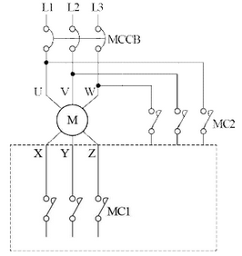

(2) Y-△ 기동 시와 전전압 기동 시의 기동전류를 비교하여 설명하시오. (단, 수치를 제시하면서 설명하시오.)

[정답]

(3) 전동기를 운전할 때 실제로 Y-△ 기동·운전을 한다고 가정하면서 기동순서를 상세하게 설명하시오. (단, 동시투입 여부를 포함하여 설명하시오.)

[정답]

---

## 해설) 도면완성+서술 암기형 / 난이도 중

정답

(1) 결선도 완성

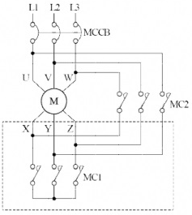

(2) Y-Δ 기동전류는 전전압 기동전류의 $\frac{1}{3}$ 배이다.

(3) MCCB를 투입하고 MC1을 단락시켜 Y결선으로 기동한 후, 타이머 설정 시간이 지나면 MC1은 개방되고 MC2는 단락되어 Δ결선으로 운전한다. 이때, MC1과 MC2는 동시투입이 되지 않도록 인터록 회로로 구성한다.

부분점수

| 점수  | 세부기준                                                                      |
| ----- | ----------------------------------------------------------------------------- |
| 6점   | 결선도를 정확하게 작성하고, (2), (3)번 답을 핵심키워드를 포함하여 작성한 경우 |
| 2~0점 | (1) 문항의 연결선이 모두 정답인 경우에만 2점 획득                             |
| 2~0점 | (2) 문항의 핵심 키워드가 모두 포함되었을 경우에만 2점 획득                    |
| 2~0점 | (3) 문항의 핵심 키워드가 모두 포함되었을 경우에만 2점 획득                    |

서술형 핵심 KEYWORD

(2) 전전압, 기동전류, $\frac{1}{3}$

(3) MC1 단락, Y결선 기동, MC1 개방, MC2 단락, Δ결선 운전, 인터록

접근 POINT

전동기의 대표적인 기동방식인 Y-Δ 기동방식에 대한 결선방법, 전전압기동과의 기동전류 비교와 실제 기동순서에 대하여 알고 있는지 물어보는 문제이다.

해설

전동기의 대표적인 기동방식인 Y-Δ 기동방식은 전전압기동방식보다 기동전류가 $\frac{1}{3}$ 배가 되어 기동시에는 Y결선으로 적은 전류로 큰 기동토크를 얻어 전동기를 돌리다가 어느 정도 안정된 속도가 되면 타이머 동작으로 Δ결선으로 변경되어 충분한 전류로 전동기를 힘있게 동작시키는 방식이다.

결선 방법은 MC2 위와 아래의 결선순서가 MC2의 위(1-2-3)를 기준으로 MC2 아래의 결선이 왼쪽부터 1-3-2 순서대로 연결하고 MC1의 아래를 모두 연결하면 Y-Δ 결선이 완성된다. MC1 동작시 Y결선으로 기동모드, MC1 동작시 Δ결선으로 전동기 운전모드가 된다.

이 둘이 동시에 동작되면 안되므로 제어회로를 MC1과 MC2가 인터록회로(Inter-Lock)가 되도록 구성한다.

---

# Q3 발주자는 전력시설물 공사감리업무 수행지침에 따라 외부적 사업환경의 변동, 사업추진 기본계획의 조정, 민원에 따른 노선변경, 공법변경, 그 밖의 시설물 추가 등으로 설계변경이 필요한 경우에는 다음의 서류를 첨부하여 반드시 서면으로 책임 감리원에게 설계변경을 하도록 지시하여야 한다. 이 경우 첨부하여야 하는 서류를 5가지 쓰시오. (단, 그 밖에 필요한 서류는 제외한다.) [배점: 5점]

[정답]

①

②

③

④

⑤

---

# 정답 해설

해설) 단순 암기형 / 난이도 중

(1) 설계변경 개요서

(2) 설계변경 도면

(3) 설계설명서

(4) 계산서

(5) 수량산출 조서

## 부분점수

| 점수  | 세부기준                                   |
| ----- | ------------------------------------------ |
| 5~0점 | 소문항 5개 중 정답 1개당 부분점수 1점 획득 |

## 접근 POINT

전력시설물 공사감리업무 수행지침에서 발주자가 여러 가지 사유로 설계변경 시 책임 감리원에게 설계변경을 서면으로 지시할 때 필요한 첨부 서류를 묻는 문제이다.

전력시설물 공사감리업무 수행 시 착공, 공사 시행, 품질관리, 시공, 안전관리, 사고처리, 환경관리, 설계변경 및 계약금액 조정, 기성 및 준공검사, 시설물 인수인계, 유지관리 및 하자보수와 관련된 서류들과 업무 흐름 및 기한 등을 알고 있는지 물어보고 있는 문제들이 자주 출제되고 있다.

## 해설

전력시설물 공사감리업무 수행지침상 설계변경에 따른 계약금액 조정 업무 처리절차

발주자는 외부적 사업환경의 변동, 사업추진 기본계획의 조정, 민원에 따른 노선변경, 공법 변경, 그 밖의 시설물 추가 등으로 설계변경이 필요한 경우에는 다음 각 호의 서류를 첨부하여 반드시 서면으로 책임감리원에게 설계변경을 하도록 지시하여야 한다. 다만, 발주자가 설계변경 도서를 작성할 수 없을 경우에는 설계변경개요서만 첨부하여 설계변경 지시를 할 수 있다.

1. 설계변경 개요서
2. 설계변경 도면, 설계설명서, 계산서 등
3. 수량산출 조서
4. 그 밖에 필요한 서류

---

# Q4 다음 단선 결선도를 보고 ①~⑤에 들어갈 기기에 대하여 표준심벌을 그린 후 약호, 명칭, 용도 또는 역할을 표의 빈칸에 작성하시오. [배점: 10점]

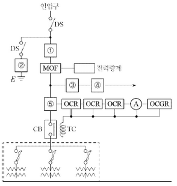

| 번호 | 심벌 | 약호 | 명칭 | 용도 및 역할 |
| ---- | ---- | ---- | ---- | ------------ |
| ①    |      |      |      |              |
| ②    |      |      |      |              |
| ③    |      |      |      |              |
| ④    |      |      |      |              |
| ⑤    |      |      |      |              |

---

## 해설) 단답 암기형+서술 암기형 / 난이도 中

정답

| 번호 | 심벌                      | 약호 | 명칭          | 용도 및 역할                                                                                |
| ---- | ------------------------- | ---- | ------------- | ------------------------------------------------------------------------------------------- |
| ①    | [그림](./2017_2/08_1.png) | PF   | 전력용 퓨즈   | 단락전류 및 고장전류를 차단한다.                                                            |
| ②    | [그림](./2017_2/08_2.png) | LA   | 피뢰기        | 이상 전압 침입 시 이를 대지로 방전시키며 속류를 차단한다.                                   |
| ③    | [그림](./2017_2/08_3.png) | COS  | 컷아웃 스위치 | 계기용 변압기 및 부하 측에 고장 발생시 이를 고압회로로부터 분리하여 사고의 확대를 방지한다. |
| ④    | [그림](./2017_2/08_4.png) | PT   | 계기용 변압기 | 고전압을 저전압(정격 110[V])로 변성한다.                                                    |
| ⑤    | [그림](./2017_2/08_5.png) | CT   | 변류기        | 대전류를 소전류(정격 5[A])로 변성한다.                                                      |

부분점수

| 점수  | 세부기준                                 |
| ----- | ---------------------------------------- |
| 10점  | 표를 모두 정확하게 작성한 경우 10점 획득 |
| 9~0점 | 오기입 1개당 1점씩 감점                  |

---

# Q5 154 [kV] 중성점 직접 접지계통에서 접지계수가 0.75이고, 여유도가 1.1인 경우 전력용 피뢰기의 정격전압을 계산한 후 주어진 표에서 선정하시오. [배점: 5점]

피뢰기의 정격 전압 (표준값[kV])
| 126 | 144 | 154 | 168 | 182 | 196 |
| --- | --- | --- | --- | --- | --- |

[계산과정]

[정답]

---

해설) 단순 계산형 / 난이도 下

정답

[계산과정]
$$ V_n = \alpha \cdot \beta \cdot V_m = 0.75 \times 1.1 \times 170 = 140.25 \text{ [kV]} $$

[정답] 144 [kV] 선정

부분점수

| 점수 | 세부기준                                    |
| ---- | ------------------------------------------- |
| 5점  | 계산과정과 정답에 오류가 없는 경우 5점 획득 |
| 0점  | 계산과정이나 정답에 오류가 있는 경우 0점    |

해설

피뢰기의 정격전압 [kV] = 접지계수 × 여유도 × 계통의 최고 전압 [kV]

---

# Q6 배전선로의 전압 조정기를 3가지 작성하시오. [배점: 3점]

[정답]

①

②

③

---

# 해설) 단순 암기형 / 난이도 中

## 정답

1. 자동 전압 조정기(SVR, IR)
2. 고정 승압기
3. 병렬 콘덴서

## 부분점수

| 점수    | 세부기준                         |
| ------- | -------------------------------- |
| 3점~0점 | 한 문항이 맞을 때마다 1점씩 획득 |

## 해설

배전 선로에서 사용하는 전압조정기의 종류

1. 자동 전압 조정기(SVR, IR) : SVR, IR의 두 종류가 있으나 현재 우리나라에서는 SVR만을 사용한다.
2. 고정 승압기 : 일반적으로 사용하지 않는다.
3. 직렬 콘덴서 : 특별한 경우 외에는 사용하지 않는다.
4. 병렬 콘덴서 : 선로의 무효전력을 흡수해서 전압강하 방지를 위해 사용한다.

---

# Q7 어떤 사무실의 가로의 길이가 10[m], 세로의 길이가 30[m], 높이 3.85[m]이다. 이 사무실에 40[W] 형광등 1개의 광속이 2,500[lm]인 2등용 형광등 기구를 시설하여 400[lx]의 평균 조도를 얻고자 할 때 다음 물음에 답하시오. (단, 조명율은 60[%], 감광보상율은 1.3, 책상면에서 천장까지의 높이는 3[m]이다.) [배점: 5점]

(1) 실지수를 계산하시오.

[계산과정]

[정답]

(2) 형광등 기구수를 계산하시오.

[계산과정]

[정답]

---

# 정답 해설

해설) 단순 계산형 / 난이도 중

(1) 실지수 계산

[계산과정]

$$ 실지수 = \frac{XY}{H(X+Y)} = \frac{10 \times 30}{3 \times (10 + 30)} = 2.5 $$

[정답] 2.5

(2) 형광등 기구수 계산

[계산과정]

$$ N = \frac{AED}{FU} = \frac{10 \times 30 \times 400 \times 1.3}{2500 \times 2 \times 0.6} = 52[등] $$

[정답] 52[등]

부분점수

| 점수 | 세부기준                             |
| ---- | ------------------------------------ |
| 5점  | (1), (2)번이 모두 맞은 경우 5점 획득 |
| 3점  | (1)번만 맞은 경우 3점 획득           |
| 2점  | (2)번만 맞은 경우 2점 획득           |

해설

실지수 계산

$$ 실지수 = \frac{XY}{H(X+Y)} $$

X: 가로 길이[m], Y: 세로 길이[m], H: 작업면에서 천장까지의 높이[m]

형광등 기구수 계산

$$ N = \frac{AED}{FU} $$

A: 가로 길이[m], E: 세로 길이[m], D: 조도[lx], F 광속[lm], U: 조명률[%]

---

# Q8 3상 4선식 22.9 [kV] 수전설비의 부하전류가 30[A]일 때 60/5[A]의 변류기를 통하여 과전류 계전기를 시설하였다. 만약 120[%]의 과부하에서 차단시키려면 트립 전류치를 몇 [A]로 설정하여야 하는지 계산하시오. [배점: 4점]

[계산과정]

$$ 변류기 비율: 60/5 A = 12 A/A $$

정격 전류: 30 A

과부하율: 120%

$$ 트립 전류 (I\_{trip}): 정격전류 × 변류기비 × 과부하율 $$

$$ I\_{trip} = 30 \text{ A} \times 12 \times 1.2 = 432 \text{ A} $$

따라서 트립 전류치는 432 A로 설정해야 한다.

[정답] 432 A

---

해설) 단순 계산형 / 난이도 下

정답

[계산과정]
$$ I_t = 30 \times \frac{5}{60} \times 1.2 = 3 [A] $$

[정답] 3[A]로 설정한다.

부분점수

| 점수 | 세부기준                                  |
| ---- | ----------------------------------------- |
| 4점  | 계산과정과 정답이 모두 맞은 경우 4점 획득 |
| 0점  | 계산과정이나 정답에 오류가 있는 경우 0점  |

해설

OCR(과전류 계전기)의 탭 전류
2[A], 3[A], 4[A], 5[A], 6[A], 7[A], 8[A], 10[A], 12[A]

---

# Q9 콘덴서 회로에서 고조파를 감소시키기 위한 직렬리액터 회로에 대한 질문에 답하시오. [배점: 5점]

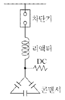

(1) 제5고조파를 감소시키기 위한 리액터의 용량은 콘덴서의 몇 [%] 이상이어야 하는지 작성하시오.

[정답]

(2) 설계 시 주파수 변동이나 경제성을 고려하여 리액터의 용량은 콘덴서의 몇 [%] 정도를 표준으로 하고 있는지 작성하시오.

[정답]

(3) 제3고조파를 감소시키기 위한 리액터의 용량은 콘덴서의 몇 [%] 이상이어야 하는지 작성하시오.

[정답]

---

## 해설) 단답 암기형+단순 계산형 / 난이도 中

정답
(1) 4[%]

(2) 6[%]

(3) 11[%]

부분점수

| 점수 | 세부기준                                  |
| ---- | ----------------------------------------- |
| 5점  | (1), (2), (3)번이 모두 맞은 경우 5점 획득 |
| 3점  | 3문항 중 2문항이 맞은 경우 3점 획득       |
| 2점  | 3문항 중 1문항이 맞은 경우 2점 획득       |

해설

직렬 리액터의 용량은 제5고조파 공진조건을 이용하여 계산할 수 있다.

$$ 5\omega L = \frac{1}{5\omega C} 에서 \omega L = \frac{1}{25} \times \frac{1}{\omega C} = 0.04 \times \frac{1}{\omega C} $$

계산 결과 직렬 리액터의 용량은 콘덴서 용량의 4[%]이다. 직렬 리액터의 용량은 계산상으로는 콘덴서 용량의 4[%] 이상이 되도 되지만 주파수 변동 등을 고려하여 실제로는 6[%]인 것이 사용된다.

리액터 용량은 다음과 같이 계산할 수 있다.

$$ 3\omega L = \frac{1}{3\omega C} 에서 \omega L = \frac{1}{9} \times \frac{1}{\omega C} = 0.11 \times \frac{1}{\omega C} 가 된다. $$

직렬 리액터의 용량은 콘덴서 용량의 11[%]이다.

---

# Q10 다음 그림은 누름버튼 스위치 PB_1, PB_2, PB_3를 ON 조작하여 기계 A, B, C를 운전하는 시퀀스 회로도이다. 이 회로를 타임차트 1~3의 요구사항과 같이 병렬 우선순위 회로로 고쳐서 작성하시오. [배점: 6점]

- $R_1, R_2, R_3$는 계전기이며, 이 계전기의 보조 a접점 또는 b접점을 추가 또는 삭제하여 작성한다.

- 불필요한 접점을 사용하지 않도록 하며, 보조접점에는 접점명을 기입한다.

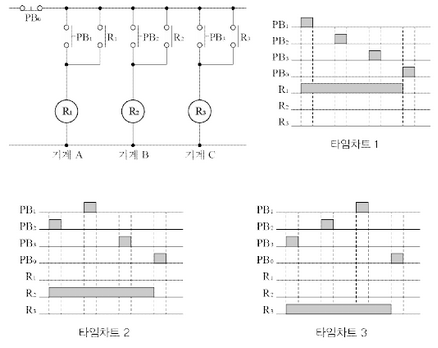

[정답]

병렬 우선순위 회로

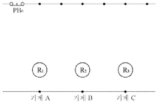

---

## 해설) 도면완성 / 난이도 상

정답

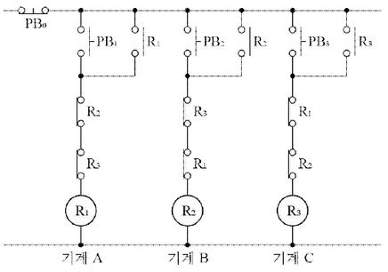

부분점수

| 점수 | 세부기준                               |
| ---- | -------------------------------------- |
| 6점  | 회로도를 정확하게 작성한 경우 6점 획득 |
| 0점  | 회로도에 오류가 있는 경우 0점          |

---

---

# Q11 다음 표의 수용가 (A, B, C) 사이의 부등률을 1.1로 한다면 합성 최대전력은 몇 [kW]인지 계산하시오. [배점: 3점]

| 수용가 | 설비용량 [kW] | 수용률 [%] |
| ------ | ------------- | ---------- |
| A      | 300           | 80         |
| B      | 200           | 60         |
| C      | 100           | 80         |

[계산과정]

$$ 수용가 A의 최대전력: 300kW \times \frac{80}{100} = 240kW $$
$$ 수용가 B의 최대전력: 200kW \times \frac{60}{100} = 120kW $$
$$ 수용가 C의 최대전력: 100kW \times \frac{80}{100} = 80kW $$

$$ 합성 최대전력(P): P = P_A + P_B + P_C = 240kW + 120kW + 80kW = 440kW $$

$$ 부등률을 고려한 합성 최대전력: P\_{합성} = P_A + P_B \times \frac{1}{1.1} + P_C \times \frac{1}{1.1^2} $$

$$ P\_{합성} = 240kW + 120kW \times \frac{1}{1.1} + 80kW \times \frac{1}{1.1^2} \approx 240kW + 109.09kW + 66.12kW \approx 415.21kW $$

따라서, 부등률을 1.1로 고려한 합성 최대전력은 약 415.21 kW 입니다.

[정답] 약 415.21 kW

---

해설) 단순 계산형 / 난이도 下

정답

[계산과정]
$$ 합성 최대 전력 = \frac{300 \times 0.8 + 200 \times 0.6 + 100 \times 0.8}{1.1} = 400 [kW] $$

[정답] 400 [kW]

부분점수

| 점수 | 세부기준                                  |
| ---- | ----------------------------------------- |
| 3점  | 계산과정과 정답이 모두 맞은 경우 3점 획득 |
| 0점  | 계산과정이나 정답에 오류가 있는 경우 0점  |

해설
$$ 합성 최대 전력 = \frac{\text{개별 최대 수용 전력의 합}}{\text{부등률}} = \frac{\text{설비용량 × 수용률}}{\text{부등률}} $$

---

# Q12 다음과 같은 조건의 변전소를 보고 물음에 답하시오. [배점: 12점]

- 변압기 상호 간의 부등률이 1.3이고, 부하의 역률이 90[%]이다.
- STr의 %임피던스가 4.5[%], Tr1, Tr2, Tr3의 %임피던스가 각각 10[%], 154[kV], BUS의 %임피던스가 0.4[%]이다.

[부하 표]

| 부하 | 용량       | 수용률 | 부등률 |
| ---- | ---------- | ------ | ------ |
| A    | 5,000 [kW] | 80[%]  | 1.2    |
| B    | 3,000 [kW] | 84[%]  | 1.2    |
| C    | 7,000 [kW] | 92[%]  | 1.2    |

[도면]

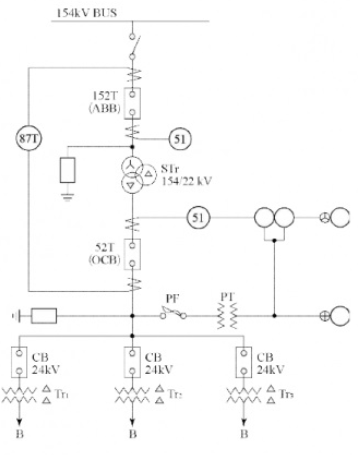

[참고표]

- 152T ABB 용량표 [MVA]
- 52T OCB 용량표 [MVA]
- 154[kV] 변압기 용량표 [kVA]
- 22[kV] 변압기 용량표 [kVA]

(1) 변압기 Tr1, Tr2, Tr3의 용량 [kVA]을 계산하시오.

[계산과정]

- 변압기 Tr1:
- 변압기 Tr2:
- 변압기 Tr3:

[정답]

| 변압기 Tr1 | 변압기 Tr2 | 변압기 Tr3 |
| --------------------- | --------------------- | --------------------- |

(2) 변압기 STr의 용량 [kVA]을 계산하시오.

[계산과정]

[정답]

(3) 차단기 152T의 용량 [MVA]을 계산하시오.

[계산과정]

[정답]

(4) 차단기 52T의 용량 [MVA]을 계산하시오.

[계산과정]

[정답]

(5) 약호 87T의 우리말 명칭을 쓰고 그 역할을 쓰시오.

[정답]

- 명칭 :
- 역할 :

(6) 약호 51의 우리말 명칭을 쓰고 그 역할을 쓰시오.

[정답]

- 명칭 :
- 역할 :

---

---

# 해설) 복합 계산형+단답 암기형+서술 암기형 / 난이도 上

(1) 변압기 Tr₁, Tr₂, Tr₃의 용량 계산

[계산과정]

$$ T\_{r1} = \frac{5,000 \times 0.8}{1.2 \times 0.9} = 3,703.7 \text{ [kVA]} $$

$$ T\_{r2} = \frac{3,000 \times 0.84}{1.2 \times 0.9} = 2,333.33 \text{ [kVA]} $$

$$ T\_{r3} = \frac{7,000 \times 0.92}{1.2 \times 0.9} = 5,962.96 \text{ [kVA]} $$

[정답]

| $$          | 변압기 T\_{r1} | 변압기 T\_{r2} | 변압기 T\_{r3} | $$  |
| ----------- | -------------- | -------------- | -------------- | --- |
| 4,000 [kVA] | 3,000 [kVA]    | 6,000 [kVA]    |

(2) 변압기 STr의 용량 계산

[계산과정]

$$ STr = \frac{3,703.7 + 2,333.33 + 5,962.96}{1.3} = 9,230.76 \text{ [kVA]} $$

표에서 10,000 [kVA]를 선정한다.

[정답] 10,000 [kVA]

(3) 차단기 152T의 용량 계산

[계산과정]

$$ P_s = \frac{100}{0.4} \times 10 = 2,500 \text{ [MVA]} $$

표에서 3,000 [MVA]를 선정한다.

[정답] 3,000 [MVA]

(4) 차단기 52T의 용량 계산

[계산과정]

$$ P_s = \frac{100}{0.4 + 4.5} \times 10 = 204.08 \text{ [MVA]} $$

표에서 300 [MVA]를 선정한다.

[정답] 300 [MVA]

(5) 약호 87T의 우리말 명칭과 역할

명칭: 주변압기 차동 계전기

역할: 발전기나 변압기의 내부 고장 보호

(6) 약호 51의 우리말 명칭과 역할

명칭: 과전류 계전기

역할: 정정값 이상의 전류가 흘렀을 때 동작하여 경보를 발하거나 차단기를 동작

부분점수

| 점수 | 세부기준                                      |
| ---- | --------------------------------------------- |
| 12점 | (1)~(6)번이 모두 맞은 경우 12점 획득          |
| 2점  | (1)~(6)번 중 한 문항이 맞을 때마다 2점씩 획득 |

---

# Q13. 17년 2회 서술형 4점

정격전류가 320[A]이고, 역률 0.85인 3상 유도전동기가 있다. 다음 제시한 자료에 의하여 전압강하를 구하시오. [배점: 4점]

[참고자료]

- 전선의 편도 길이: 150[m]
- 사용하는 전선의 특징
  - R = 0.18 [$\Omega$/km]
  - $\omega$ L = 0.102 [$\Omega$/km]
  - $\omega$ C는 무시한다.

[계산과정]

[정답]

---

# 정답 해설

(난이도: 중)

[계산 과정]

$$ 1선당 저항 R = 0.18 \times 150 \times 10^{-3} = 0.027 \, [\Omega] $$

$$ 1선당 리액턴스 X_L = \omega L = 0.102 \times 150 \times 10^{-3} = 0.0153 \, [\Omega] $$

$$ 전압강하 e = \sqrt{3} \times 320 \times (0.027 \times 0.85 + 0.0153 \times \sqrt{1 - 0.85^2}) = 17.187 \dots \approx 17.19 \, [V] $$

[정답] 17.19 [V]

부분 점수

| 점수 | 세부 기준                                    |
| ---- | -------------------------------------------- |
| 4점  | 계산 과정과 정답이 모두 맞은 경우            |
| 0점  | 정답이 틀리거나 계산 과정에 오류가 있는 경우 |

접근 POINT

3상에서 전압 강하에 대한 기본적인 수식을 암기하고 적용할 수 있는 능력을 확인하는 문제입니다. 추가적으로 참고 자료에 [km]당 저항 및 리액턴스와 거리를 주고 저항과 리액턴스 값을 계산하게 하였으며, 역률을 주고 무효율을 계산하도록 한 것입니다.

공식 CHECK

- 3상 전력: $ P_n = \sqrt{3} V_n I_n \cos\theta $
- 전류: $ I\*n = \frac{P_n}{\sqrt{3} V_n \cos\theta} $
- 3상에서 전압 강하: $e = \sqrt{3} I\*n (R \cos\theta + X \sin\theta) = \frac{P_n}{V_n} (R + X \tan\theta) $
- 역률: $\cos\theta $
- 삼각 함수의 항등식: $\cos^2\theta + \sin^2\theta = 1$
- 무효율: $\sin\theta = \sqrt{1 - \cos^2\theta}$

해설

STEP 1. 참고 자료를 이용하여 1선당 저항과 리액턴스를 계산

- 1선당 저항: $R = 0.18 \times 150 \times 10^{-3} = 0.027 \, [\Omega] $
- 1선당 리액턴스: $X_L = \omega L = 0.102 \times 150 \times 10^{-3} = 0.0153 \, [\Omega] $

STEP 2. 3상 전압 강하 수식을 이용하여 전압 강하 계산

- 전압 강하: $e = \sqrt{3} I_n (R \cos\theta + X \sin\theta) $
$$ e = \sqrt{3} \times 320 \times (0.027 \times 0.85 + 0.0153 \times \sqrt{1 - 0.85^2}) = 17.187 \dots \approx 17.19 \, [V] $$

---

# Q14 전력설비 점검 시 보호계전 계통이 오동작하게 되는 원인을 3가지 쓰시오. [배점: 3점]

[정답]

①

②

③

---

## 해설) 서술 암기형 / 난이도 중

정답

1. 보호 계전기의 허용범위를 초과한 온도에서 사용한 경우
2. 높은 습도에 의한 절연성능 저하 및 부식이 된 경우
3. 진동이나 충격이 가해진 경우

부분점수

| 점수    | 세부기준                         |
| ------- | -------------------------------- |
| 3점~0점 | 한 문항이 맞을 때마다 1점씩 획득 |

해설

[보호 계전기의 오동작을 발생시키는 원인]

1. 진동이나 충격이 가해진 경우
2. 보호 계전기의 허용 범위를 초과한 온도가 가해진 경우
3. 높은 습도에 의한 절연성능 저하 및 부식이 일어난 경우
4. 진해에 따른 마찰저항 및 접촉저항이 증가한 경우
5. 유해가스에 의한 금속부위가 부식된 경우
6. 허용 범위를 초과한 제어전원의 과도한 전압 변동이 일어난 경우

---

# Q15 다음 그림은 전위 강하법에 의한 접지저항 측정방법이다. E, P, C는 모두 일직선상에 있다고 보고 다음 물음에 답하시오. (단, E는 반지름 *r*인 반구 모양 전극(측정대상)이다.) [배점: 5점]

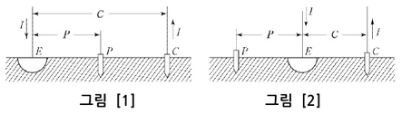

(1) 그림 [1]과 그림 [2]의 측정방법 중 접지저항 값이 참값에 더 가까운 측정방법을 쓰시오.

[정답]

(2) 반구 모양 접지전극의 접지저항을 측정할 때 E-C 간 거리의 몇 [%]인 곳에 전위 전극을 설치하면 정확한 접지저항 값을 얻을 수 있는지 쓰시오.

[정답]

---

# 해설) 단답 암기형+단순 계산형 / 난이도 중

정답

(1) 그림 [1]
(2) 61.8 [%]

부분점수

| 점수 | 세부기준                             |
| ---- | ------------------------------------ |
| 5점  | (1), (2)번이 모두 맞은 경우 5점 획득 |
| 3점  | (2)번만 맞은 경우 3점 획득           |
| 2점  | (1)번만 맞은 경우 2점 획득           |

해설

그림 [2]와 같이 전극이 배치되어 있으면 참값을 구할 수 있는 P 전극의 위치가 존재하지 않는다.

---

# Q16. 1선 지락고장 시 접지계통별 고장전류의 경로를 표 안에 직접 작성하시오. [배점: 5점]

[정답]

| 접지계통        | 고장전류 경로 |
| --------------- | ------------- |
| 단일 접지계통   |               |
| 중성점 접지계통 |               |
| 다중 접지계통   |               |

---

해설) 단답 암기형 / 난이도 중

정답

| 접지계통        | 경로                                              |
| --------------- | ------------------------------------------------- |
| 단일 접지계통   | 선로-지락점-대지-접지점-중성점-선로               |
| 중성점 접지계통 | 선로-지락점-대지-접지점-중성점-선로               |
| 다중 접지계통   | 선로-지락점-대지-다중 접지극의 접지점-중성점-선로 |

부분점수

| 점수 | 세부기준                                           |
| ---- | -------------------------------------------------- |
| 5점  | 표를 정확하게 작성한 경우 5점 획득                 |
| 3점  | 세 부분 중 두 부분만 정확하게 작성한 경우 3점 획득 |
| 2점  | 세 부분 중 한 부분만 정확하게 작성한 경우 2점 획득 |

---

# Q17 알칼리 축전지의 정격용량이 100 [Ah]이고, 상시부하가 5 [kW], 표준전압이 100 [V]인 부동충전방식이 있다. 다음 물음에 답하시오. [배점: 5점]

(1) 이 부동충전방식의 충전기 2차 전류는 몇 [A]인지 계산하시오.

[계산과정]

[정답]

(2) 부동충전방식의 회로도를 전원, 축전지, 부하, 충전기(정류기) 등을 이용하여 답란에 작성하시오. (단, 심벌은 일반적인 심벌로 표현하되 심벌 부근에 심벌에 따른 명칭을 작성한다.)

[정답]

---

# 정답 해설

해설: 단순 계산형 + 도면 완성 / 난이도 중

(1) 충전기 2차 전류 계산

[계산 과정]

$$ I = \frac{100}{5} + \frac{5 \times 10^3}{100} = 70 [A] $$

[정답] 70[A]

(2) 부동 충전 방식의 회로도 작성

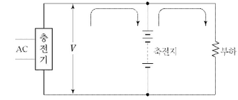

부분 점수

| 점수 | 세부 기준                            |
| ---- | ------------------------------------ |
| 5점  | (1), (2)번이 모두 맞은 경우 5점 획득 |
| 3점  | (2)번이 맞은 경우 3점 획득           |
| 2점  | (1)번이 맞은 경우 2점 획득           |

해설

정격 방전율

- 연축전지: 10[h]
- 알칼리 축전지: 5[h]

$$ 충전기 2차 전류 [A] = \frac{\text{축전지 정격용량 [Ah]} + \frac{\text{상시 부하용량 [VA]}}{\text{표준 전압 [V]}}}{\text{정격 방전율 [h]}} $$

---

# Q18 다음과 같은 문제가 발생하는 고조파 전류를 방지하기 위한 대책을 3가지 작성시오. [배점: 5점]

고조파 전류는 각종 선로나 간선에 에너지 절약 기기나 무정전전원장치 등이 증가되면서 선로에 발생하여 전원의 질을 떨어뜨리고 과열 및 이상 상태를 발생시키는 원인이 되고 있다.

[정답]

①

②

③

---

# 정답 해설

(서술 암기형 / 난이도 중)

1. 전력변환 장치의 Pulse 수를 크게 한다.
2. 고조파 필터를 사용한다.
3. 전력용 콘덴서에 직렬 리액터를 설치한다.

## 부분 점수

| 점수 | 세부 기준                         |
| ---- | --------------------------------- |
| 5점  | 3문항이 모두 정답인 경우 5점 획득 |
| 3점  | 2문항이 정답인 경우 3점 획득      |
| 2점  | 1문항이 정답인 경우 2점 획득      |

## 해설

### 고조파 전류의 발생 원인

1. 전기로, 아크로
2. 전력용 콘덴서 등
3. 전기용접기 등의 사용
4. 송전 선로의 코로나
5. Converter, Inverter, Chopper 등의 전력 변환장치의 사용

### 고조파 전류의 대책

1. 전력변환 장치의 Pulse 수를 크게 한다.
2. 고조파 필터를 사용하여 제거한다.
3. 전력용 콘덴서에는 직렬 리액터를 설치한다.
4. 선로의 코로나 방지를 위하여 복도체, 다도체를 사용한다.
5. 변압기 결선에서 $\Delta$ 결선을 채용하여 고조파 순환회로를 구성하여 외부에 고조파가 나타나지 않도록 한다.

---

# Q19 다음 논리회로를 보고 물음에 답하시오. [배점: 6점]

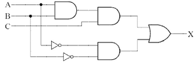

(1) 위의 논리회로를 논리식으로 표현하시오.

[정답]

(2) 위의 논리회로의 동작 상태에 대한 타임차트를 완성하시오.

[정답]

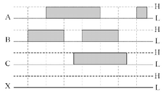

(3) 다음과 같은 진리표를 완성하시오. (단, L은 Low고, H는 High다.)

[정답]

| A   | B   | C   | X   |
| --- | --- | --- | --- |
| L   | L   | L   |     |
| L   | L   | H   |     |
| L   | H   | L   |     |
| L   | H   | H   |     |
| H   | L   | L   |     |
| H   | L   | H   |     |
| H   | H   | L   |     |
| H   | H   | H   |     |

---

# 해설) 논리회로+도면완성 / 난이도 中

## 정답

$$ (1) X = ABC + \overline{AB} $$

(2) 타임차트 완성

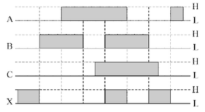

(3) 진리표 완성

| A   | B   | C   | X   |
| --- | --- | --- | --- |
| L   | L   | L   | H   |
| L   | L   | H   | H   |
| L   | H   | L   | L   |
| L   | H   | H   | L   |
| H   | L   | L   | L   |
| H   | L   | H   | L   |
| H   | H   | L   | L   |
| H   | H   | H   | H   |

## 부분점수

| 점수 | 세부기준                                            |
| ---- | --------------------------------------------------- |
| 6점  | (1), (2), (3)번이 모두 맞은 경우 6점 획득           |
| 2점  | (1), (2), (3)번 중 한 문항이 맞을 때마다 2점씩 획득 |

---
