# Q1 다음 기기의 명칭을 쓰시오. [배점: 4점]

(1) 가공 배전선로 사고의 대부분은 조류 및 수목에 의한 접촉, 강풍, 낙뢰 등에 의한 플래시 오버 사고로서 이런 사고 발생 시 신속하게 고장 구간을 차단하고 사고점의 아크를 소멸시킨 후 즉시 재투입이 가능한 개폐 장치이다.

[정답]

(2) 보안상 책임 분계점에서 보수 점검 시 전로를 개폐하기 위하여 시설하는 것으로 반드시 무부하 상태에서 개방하여야 한다. 근래에는 ASS를 사용하며, 66[kV] 이상의 경우에는 이를 사용한다.

[정답]

---

## 해설) 단답 암기형 / 난이도 下

정답

(1) 리클로저
(2) 선로개폐기

부분점수

| 점수 | 세부기준                                  |
| ---- | ----------------------------------------- |
| 4점  | (1), (2)번이 모두 맞는 경우 4점 획득      |
| 2점  | (1), (2)번 중 하나만 정답인 경우 2점 획득 |

해설

[리클로저]

- 가공 배전선로 사고의 대부분은 조류나 나무 등에 의한 접촉, 강풍, 낙뢰 등에 의한 플래시오버 사고이다.
- 사고가 발생하였을 때 신속하게 고장구간을 차단하고 사고점의 아크(Arc)를 소멸시킨 후 즉시 재투입을 할 수 있는 개폐장치가 리클로저이다.

[선로 개폐기]

- 보안상 책임 분계점에서 보수 점검 시 전로를 개폐하기 위하여 시설하는 것으로 반드시 무부하 상태에서 개방하여야 하며, 단로기와 비슷한 용도로 사용한다.
- 최근에는 선로개폐기(LS) 대신에 자동고장 구분개폐기(ASS)를 사용하며, 22.9[kV-Y] 계통에서는 사용하지 않고 66[kV] 이상의 경우에 사용한다.

---

# Q2 다음과 같은 평형 3상 회로에 변류비가 100/5인 변류기 2개를 그림과 같이 접속하였을 때 전류계에 4[A]의 전류가 흘렀다. 1차 전류의 크기는 몇 [A]인지 계산하시오. [배점: 5점]

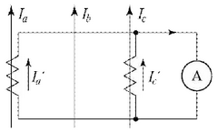

[계산과정]

변류기의 변류비는 1차 전류와 2차 전류의 비율을 나타냅니다. 문제에서 변류비는 100/5이므로, 1차 전류를 $I_1$, 2차 전류를 $I_2$라고 하면 다음과 같은 관계가 성립합니다.

$$ \frac{I_1}{I_2} = \frac{100}{5} = 20 $$

전류계에 측정된 전류는 2차 전류 $I_2$이므로, $I_2 $= 4[A]입니다. 따라서 1차 전류 $I_1$는 다음과 같이 계산할 수 있습니다.

$$ I_1 = 20 \times I_2 = 20 \times 4[A] = 80[A] $$

따라서 1차 전류의 크기는 80[A]입니다.

[정답] 80[A]

---

해설) 단순 계산형 / 난이도 下

정답

[계산과정]
$$ I_a' = I_c' = I = 4 [A] $$
$$ I_a = aI_a' = \frac{100}{5} \times 4 = 80 [A] $$

[정답] 80 [A]

부분점수

| 점수 | 세부기준                                    |
| ---- | ------------------------------------------- |
| 5점  | 계산과정과 정답에 오류가 없는 경우 5점 획득 |
| 0점  | 계산과정이나 정답에 오류가 있는 경우 0점    |

해설

$$ 가동결선이므로 I_a' = I_c' = I = 4 [A] 이다. $$

---

# Q3 다음과 같은 3상 유도 전동기의 역상 제동 시퀀스 회로를 보고 물음에 답하시오. (단, 플러깅 릴레이 Sp는 전동기가 회전하면 접점이 닫히고, 속도가 0에 가까우면 열리도록 설계되었다.) [배점: 7점]

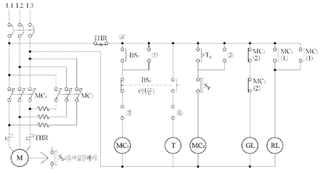

(1) 위의 회로의 ①~④에 알맞은 접점과 기호를 작성하시오.

[정답]

①

②

③

④

(2) 위의 회로에 있는 $MC_1, MC_2$의 동작과정을 설명하시오.
[정답]

(3) 보조 릴레이 T와 저항 r에 대하여 그 용도 및 역할을 설명하시오.
[정답]

---

# 정답

## [정답]

해설) 도면완성+시퀀스 동작설명 / 난이도 上

(1)

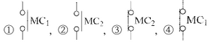

(2) 동작과정

① BS₁으로 MC₁을 여자시켜 전동기를 직입 기동한다. (자기 유지)
② BS₂을 눌러 MC₁이 소자되면 전동기는 전원에서 분리되나 회전자 관성모멘트로 인하여 회전은 계속한다.
③ 이때 BS₂의 연동접점으로 T가 MC₁소자 즉시 여자되며, BS₂를 누르고 있는 상태에서 설정 시간 후 MC₂가 여자되어 전동기는 역회전하려고 한다. (자기 유지)
④ 전동기의 속도가 급격히 감소하여 0에 가까워지면 플러깅 릴레이에 의하여 전동기는 전원에서 완전히 분리되어 급정지한다. (플러깅 제동)

(3)

- T: 시간 지연 릴레이를 사용하여 제동시 과전류를 방지하는 시간적인 여유를 주기 위함
- r: 역상 제동시 저항의 전압 강하로 전압을 줄이고 제동력을 제한함

## 부분점수

| 점수  | 세부기준                                                           |
| ----- | ------------------------------------------------------------------ |
| 7점   | (1), (2), (3)번이 모두 정답인 경우                                 |
| 2~0점 | 문항 (1)의 소문항 2개당 1점씩 획득 (0~1개 0점, 2~3개 1점, 4개 2점) |
| 3점   | 문항 (2)번이 정답인 경우                                           |
| 2점   | 문항 (3)번이 정답인 경우                                           |

---

---

# Q4 다음에 제시된 그림은 3상 4선식 전력량계의 결선도이다. PT와 CT를 사용하여 미완성 부분의 결선도를 직접 완성하시오. [배점: 4점]

[정답]

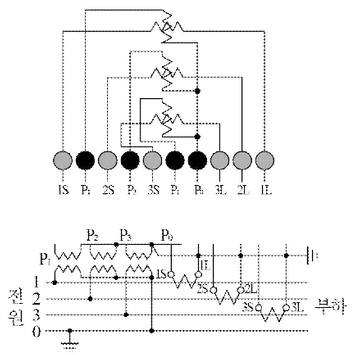

---

## 해설) 도면완성 / 난이도 中

정답

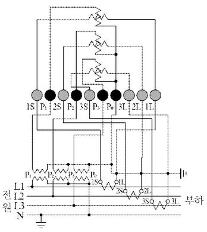

부분점수

| 점수 | 세부기준                               |
| ---- | -------------------------------------- |
| 4점  | 결선도를 정확하게 작성한 경우 4점 획득 |
| 0점  | 결선도에 오류가 있는 경우 0점          |

---

---

# Q5 다음은 컴퓨터 등의 중요한 부하에 대한 무정전 전원공급을 위한 그림이다. “(가)~(마)”에 적당한 전기 시설물의 명칭을 쓰시오. [배점: 4점]

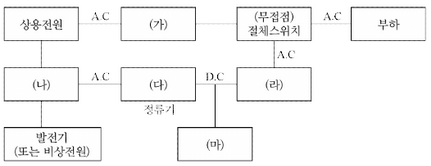

[정답]

| (가)     | (나)                       | (다)   | (라)   | (마)                   |
| -------- | -------------------------- | ------ | ------ | ---------------------- |
| 상용전원 | UPS(무정전 전원 공급 장치) | 정류기 | 배터리 | 발전기(또는 비상 전원) |

---

# 해설) 단순 암기형 / 난이도 중

## 정답

(가) 자동전압조정기(AVR)
(나) 절체용 개폐기
(다) 정류기(컨버터)
(라) 인버터
(마) 축전지

## 부분점수

| 점수 | 세부기준                        |
| ---- | ------------------------------- |
| 4점  | 5개가 모두 정답인 경우 4점 획득 |
| 3점  | 4개가 정답인 경우 3점 획득      |
| 2점  | 2~3개가 정답인 경우 2점 획득    |
| 1점  | 1개가 정답인 경우 1점 획득      |

---

# Q6 수전전압이 6,000 [V]인 2[km] 3상 3선식 선로에 1,000 [kW] (역률 0.8) 부하가 연결되어 있다. 다음 물음에 답하시오. (단, 1선당 저항은 0.3[Ω/km], 1선당 리액턴스는 0.4[Ω/km]이다.) [배점: 6점]

(1) 선로의 전압강하를 계산하시오.

[계산과정]

[정답]

(2) 선로의 전압강하율을 계산하시오.

[계산과정]

[정답]

(3) 선로의 전력손실을 계산하시오.

[계산과정]

[정답]

---

# 정답 해설

## 해설) 복합 계산형 / 난이도 상

(1) 선로의 전압강하 계산

$$ [계산과정] e = \frac{1,000 \times 10^3}{6,000} \times (0.3 \times 2 + 0.4 \times 2 \times \frac{0.6}{0.8}) = 200 [V] $$

[정답] 200 [V]

(2) 선로의 전압강하율 계산

$$ [계산과정] e = \frac{200}{6,000} \times 100 [%] = 3.333... \cong 3.33 [%] $$

[정답] 3.33 [%]

(3) 선로의 전력손실 계산

$$ [계산과정] P_l = \frac{(1,000 \times 10^3)^2 \times (0.3 \times 2)}{6,000^2 \times 0.8^2} \times 10^{-3} = 26.041... \cong 26.04 [kW] $$

[정답] 26.04 [kW]

## 부분점수

| 점수  | 세부기준                                                                 |
| ----- | ------------------------------------------------------------------------ |
| 6~0점 | 소문항 (1), (2), (3)의 계산과정과 정답이 모두 맞은 경우 1개당 2점씩 획득 |

## 접근 POINT

송전선로 설계시 3상3선식 선로의 전압강하, 전압강하율, 전력손실을 계산하는 문제로, 각각의 수식을 암기하고 주어진 조건을 적용하여 산정할 수 있는 능력이 있는지 묻는 문제이다. 공식 암기만이 아니라 기본 수식에서 변형되는 과정도 한번 정리해 둔다면 수식이 기억나지 않을 때 찾아서 사용할 수 있다.

## 공식 CHECK

3상3선식 선로의 전압강하, 전압강하율, 전력손실을 구하는 수식과 변형과정은 다음과 같다.

전압강하

$$ e = \sqrt{3} I (R \cos \theta + X \sin \theta) = \sqrt{3} \frac{P}{\sqrt{3} V_r \cos \theta} (R \cos \theta + X \sin \theta) = \frac{P}{V_r} (R + X \tan \theta) [V] $$

전압강하율

$$ e = \frac{e}{V_r} \times 100 [%] $$

전력손실

$$ P_l = 3I^2 R = 3 \times \left( \frac{P}{\sqrt{3} V_r \cos \theta} \right)^2 R = \frac{P^2}{V_r^2 \cos^2 \theta} R [W] $$

여기서, 3상 유효전력과 전류는 다음과 같다.

$$ P = \sqrt{3} V_l I \cos \theta [W], I = \frac{P}{\sqrt{3} V \cos \theta} [A] $$

## 해설

(1) 선로의 전압강하 계산

$$ e = \frac{P}{V_r} (R + X \tan \theta) = \frac{P}{V_r} (R + X \frac{\sin \theta}{\cos \theta}) = \frac{1,000 \times 10^3}{6,000} \times [(0.3 \times 2) + (0.4 \times 2) \times \frac{0.6}{0.8}] = 200 [V] $$

(2) 선로의 전압강하율 계산

$$ e = \frac{e}{V_r} \times 100 = \frac{200}{6,000} \times 100 = 3.333... \cong 3.33 [%] $$

(3) 선로의 전력손실 계산

$$ P_l = \frac{P^2}{V_r^2 \cos^2 \theta} R = \frac{(1,000 \times 10^3)^2}{6,000^2 \times 0.8^2} \times (0.3 \times 2) \times 10^{-3} = 26.041... \cong 26.04 [kW] $$

---

# Q7 전압이 30[V], 저항이 4[Ω], 유도 리액턴스가 3[Ω]일 때 콘덴서를 병렬로 연결하여 종합역률 1로 만들려고 한다. 이때 병렬연결하는 용량성 리액턴스는 몇 [Ω]인지 계산하시오. [배점: 5점]

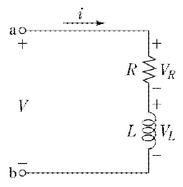

[계산과정]

총 임피던스 Z는 다음과 같이 표현할 수 있습니다.

$$ Z = R + jX_L - jX_C $$

여기서, R은 저항, $X_L$은 유도 리액턴스, $X_C$는 용량성 리액턴스입니다.

종합역률이 1이므로, 허수부가 0이어야 합니다. 따라서,

$$ X_L - X_C = 0 $$

$$ X_C = X_L = 3[\Omega] $$

따라서 병렬연결하는 용량성 리액턴스는 3[Ω]입니다.

[정답] 3[Ω]

---

해설) 단순 계산형 / 난이도 下

정답
[계산과정]
$$ X_c = \frac{1}{\omega C} = \frac{R^2 + (\omega L)^2}{\omega L} = \frac{4^2 + 3^2}{3} = 8.33 [\Omega] $$

[정답] 8.33 [Ω]

부분점수

| 점수 | 세부기준                                  |
| ---- | ----------------------------------------- |
| 5점  | 계산과정과 정답이 모두 맞은 경우 5점 획득 |
| 0점  | 계산과정과 정답에 오류가 있는 경우 0점    |

해설
병렬공진 조건에서 합성 어드미턴스는 다음 식으로 구할 수 있다.

$$ Y = Y_1 + Y_2 = \frac{1}{R + j\omega L} + j\omega C = \frac{R}{R^2 + (\omega L)^2} + j(\omega C - \frac{\omega L}{R^2 + (\omega L)^2}) $$

이때 종합역률이 1이 되려면 저항만의 회로(공진회로)가 되어야 하므로, 합성 어드미턴스의 허수부는 0이 된다.

$$ \omega C - \frac{\omega L}{R^2 + (\omega L)^2} = 0 \to \omega C = \frac{\omega L}{R^2 + (\omega L)^2} $$

$$ X_c = \frac{1}{\omega C} = \frac{R^2 + (\omega L)^2}{\omega L} $$

---

# Q8 다음과 같이 점광원으로부터 원뿔 밑면까지의 거리가 4[m]이고, 밑면의 반지름이 3[m]인 원형면이 있다. 이때 평균조도가 100[lx]라면 이 점광원의 평균광도[cd]를 계산하시오. [배점: 5점]

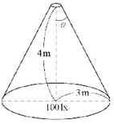

계산과정

원뿔의 밑면 면적 A는 다음과 같다.

$$ A = \pi r^2 = \pi (3m)^2 = 9\pi [m^2] $$

점광원의 평균광도 I는 다음과 같이 계산할 수 있다.

$$ E = \frac{I}{r^2} \cos\theta $$

여기서 E는 조도, r은 광원으로부터 면까지의 거리, $\theta$는 광원과 면 사이의 각도이다. 문제에서 주어진 조도는 평균조도이므로, 평균조도 공식을 사용한다. 원형 면에 수직으로 빛이 입사하는 경우를 가정하면 $\cos\theta = 1$ 이다. 따라서 평균조도 E는 다음과 같다.

$$ E = \frac{I}{r^2} $$

주어진 값을 대입하면,

$$ 100[lx] = \frac{I}{(4m)^2} $$

$$ I = 100[lx] \times (4m)^2 = 1600[cd] $$

따라서 점광원의 평균광도는 1600[cd]이다.

정답: 1600 cd

---

해설) 단순 계산형 / 난이도 중

정답

[계산과정]

$$ \cos \alpha = \frac{4}{\sqrt{4^2 + 3^2}} = 0.8 $$

$$ I = \frac{100 \times 3^2}{2 \times (1 - 0.8)} = 2250 \text{ [cd]} $$

[정답] 2250 [cd]

부분점수

| 점수 | 세부기준                                    |
| ---- | ------------------------------------------- |
| 5점  | 계산과정과 정답에 오류가 없는 경우 5점 획득 |
| 0점  | 계산과정과 정답에 오류가 있는 경우 0점      |

해설

조도를 구하는 식은 다음과 같다.

$$ E = \frac{I}{r^2} \frac{2(1 - \cos \alpha)}{} $$

이 식을 이용하여 평균광도를 계산한다.

$$ I = \frac{E \times r^2}{2(1 - \cos \alpha)} = \frac{100 \times 3^2}{2 \times (1 - 0.8)} = 2250 \text{ [cd]} $$

---

# Q9 다음은 변압기의 절연내력 시험전압에 대한 내용이다. ①~⑦ 구분란의 알맞은 시험전압을 작성하시오. [배점: 7점]

| 구분 | 종류(최대사용전압을 기준으로)                                                                                                                                                                                   | 시험 전압                     |
| ---- | --------------------------------------------------------------------------------------------------------------------------------------------------------------------------------------------------------------- | ----------------------------- | --- |
| ①    | 최대사용전압 7[kV] 이하인 권선 (단, 시험 전압이 500[V] 미만으로 되는 경우에는 500[V])                                                                                                                           | 최대사용전압 × ( **1** ) 배   |
| ②    | 7[kV]를 넘고 25[kV] 이하의 권선으로서 중성선 다중 접지식에 접속되는 것                                                                                                                                          | 최대사용전압 × ( **1** ) 배   | $$  |
| ③    | 7[kV]를 넘고 60[kV] 이하의 권선(중성선 다중 접지 제외) (단, 시험 전압이 10,500[V] 미만으로 되는 경우에는 10,500[V])                                                                                             | 최대사용전압 × ( **1** ) 배   |
| ④    | 60[kV]를 넘는 권선으로서 중성점 비접지식 전로에 접속되는 것                                                                                                                                                     | 최대사용전압 × ( **1.1** ) 배 |
| ⑤    | 60[kV]를 넘는 권선으로서 중성점 접지식 전로에 접속하고 또한 성형 결선의 권선의 경우에는 그 중성점에 T좌 권선과 주좌 권선의 접속점에 피뢰기를 시설하는 것 (단, 시험 전압이 75[kV] 미만으로 되는 경우에는 75[kV]) | 최대사용전압 × ( **1.1** ) 배 |
| ⑥    | 60[kV]를 넘는 권선으로서 중성점 직접 접지식 전로에 접속하는 것, 다만 170[kV]를 초과하는 권선에는 그 중성점에 피뢰기를 시설하는 것                                                                               | 최대사용전압 × ( **1.1** ) 배 |
| ⑦    | 170[kV]를 넘는 권선으로서 중성점 직접 접지식 전로에 접속하고 또는 그 중성점을 직접 접지하는 것                                                                                                                  | 최대사용전압 × ( **1.1** ) 배 |
| 예시 | 기타의 권선                                                                                                                                                                                                     | 최대사용전압 × (1.1) 배       |

[정답]

---

해설) 단답 암기형 / 난이도 중

정답
① 1.5, ② 0.92, ③ 1.25, ④ 1.25, ⑤ 1.1, ⑥ 0.72, ⑦ 0.64

부분점수

| 점수    | 세부기준                         |
| ------- | -------------------------------- |
| 7점~0점 | 한 문항을 맞힐 때마다 1점씩 획득 |

---

# Q10 전압과 역률이 일정하다고 가정할 때 전력손실이 2배가 되려면 전력은 몇 [%] 증가해야 하는지 계산하시오. [배점: 5점]

[계산과정]

[정답]

---

## 해설) 단순 계산형 / 난이도 下

정답

[계산과정]

$$ 전력 증가율 = (\sqrt{2} - 1) \times 100 = 41.42 [%] $$

[정답] 41.42 [%]

부분점수

| 점수 | 세부기준                                      |
| ---- | --------------------------------------------- |
| 5점  | 계산과정이나 정답에 오류가 없는 경우 5점 획득 |
| 0점  | 계산과정이나 정답에 오류가 있는 경우 0점      |

해설

전력손실을 P_l이라고 하고, 전력을 P라고 한다. 이때 전압과 역률이 일정하다고 하면 다음 식이 성립한다.

$$ P_l = \frac{P^2 R}{V^2 \cos^2 \theta} \to P_l \propto P^2 $$

전력손실이 2배가 될 때의 전력을 P'이라고 하면 다음과 같은 관계가 성립되고 이를 이용하여 전력 증가율을 계산할 수 있다.

$$ P' \propto \sqrt{2}P_l \to \sqrt{2}P^2 = \sqrt{2}P $$

$$ 전력 증가율 = \frac{P'-P}{P} \times 100 = \frac{\sqrt{2}P - P}{P} \times 100 = (\sqrt{2} - 1) \times 100 = 41.42 [%] $$

---

# Q11 중성점 직접 접지 계통에 인접한 통신선의 전자 유도 장해 경감에 관한 대책을 경제성이 높은 것부터 작성하시오. [배점: 6점]

(1) 근본적인 대책을 작성하시오.

[정답]

(2) 전력선 측 대책을 3가지 작성하시오.

[정답]

①

②

③

(3) 통신선 측 대책을 3가지 작성하시오.

[정답]

①

②

③

---

# 해설) 서술 암기형 / 난이도 上

## 정답

(1) 근본적인 대책: 전자 유도 전압을 억제시킨다.

(2) 전력선 측 대책

[정답]

① 차폐선을 설치한다.
② 지중전선로 방식을 채용한다.
③ 고속도 지락 보호 계전 방식을 채용한다.

(3) 통신선 측 대책

[정답]

① 절연 변압기를 설치하여 구간을 분리한다.
② 연피케이블을 사용한다.
③ 배류 코일을 설치한다.

## 부분점수

| 점수 | 세부기준                                         |
| ---- | ------------------------------------------------ |
| 6점  | (1), (2), (3)번이 모두 정답인 경우 6점 획득      |
| 2점  | (1), (2), (3)번 중 하나만 맞을 때마다 2점씩 획득 |

---

# Q12 사용전압이 380[V]인 3상 직입기동 전동기 1.5[kW] 1대, 3.7[kW] 2대와 3상 15[kW] 기동기 사용 전동기 1대 및 3상 전열기 3[kW]를 간선에 연결하였다. 공사방법은 A1, PVC 절연전선을 사용한다. 다음 표를 이용하여 간선 굵기와 과전류 차단기 용량을 계산하시오.

[표 1] 3상 유도 전동기의 규약 전류값

| 출력 [kW] | 200[V]용 | 380[V]용 |
| --------- | -------- | -------- |
| 0.2       | 1.8      | 0.95     |
| 0.4       | 3.2      | 1.68     |
| 0.75      | 4.8      | 2.53     |
| 1.5       | 8.0      | 4.21     |
| 2.2       | 11.1     | 5.84     |
| 3.7       | 17.4     | 9.16     |
| 5.5       | 26       | 13.68    |
| 7.5       | 34       | 17.89    |
| 11        | 48       | 25.26    |
| 15        | 65       | 34.21    |
| 18.5      | 79       | 41.58    |
| 22        | 93       | 48.95    |
| 30        | 124      | 65.26    |
| 37        | 152      | 80       |
| 45        | 190      | 100      |
| 55        | 230      | 121      |
| 75        | 310      | 163      |
| 90        | 360      | 189.5    |
| 110       | 440      | 231.6    |
| 132       | 500      | 263      |

[비고 1] 사용하는 회로의 전압이 220[V]인 경우는 200[V]인 것의 0.9배로 한다.

[비고 2] 고효율 전동기는 제작자에 따라 차이가 있으므로 제작자의 기술자료를 참조한다.

[표 2] 380[V] 3상 유도전동기의 간선 굵기 및 기구의 용량(배선용 차단기의 경우)
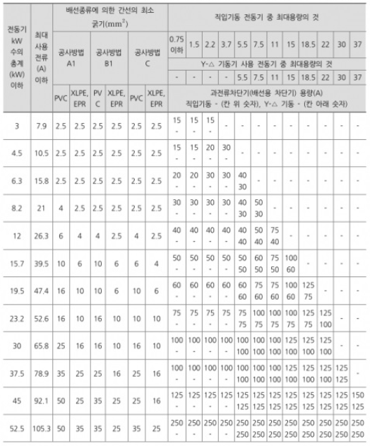

[비고 1] 최소 전선 굵기는 1회선에 대한 것이며, 2회선 이상일 경우는 부록 500-2의 복수회로 보정계수를 적용하여야 한다.

[비고 2] 공사방법 A1은 벽 내의 전선관에 공사한 절연전선 또는 단심케이블, B1은 벽면의 전선관에 공사한 절연전선 또는 단심케이블, 공사방법 C는 벽면에 공사한 단심 또는 다심케이블을 시설하는 경우의 전선 굵기를 표시하였다.

[비고 3] "전동기 중 최대의 것"에는 동시 기동하는 경우를 포함한다.

[비고 4] 배선용차단기의 용량은 해당 조항에 규정되어 있는 범위에서 실용상 거의 최대값을 표시한다.

[비고 5] 배선용차단기의 선정은 최대용량의 정격전류의 3배에 다른 전동기의 정격전류의 합계를 가산한 값 이하를 표시한다.

[비고 6] 배선용차단기를 배·분전반, 제어반 등의 내부에 시설하는 경우는 그 반 내의 온도상승에 주의한다.

(1) 간선의 굵기 [mm²]를 계산하시오.

[계산과정] (표1과 표2를 참고하여 계산과정을 상세히 기술해야 합니다. 문제에서 주어진 정보와 표를 바탕으로 전동기의 규약전류를 합산하고, 공사방법 A1, PVC 절연전선을 고려하여 적절한 간선 굵기를 [표2]에서 찾아야 합니다.)

[정답]

(2) 차단기 용량 [A]을 계산하시오.

[계산과정] (표1을 참고하여 각 전동기와 전열기의 규약 전류를 구하고, 이를 합산합니다. [비고5]에 따라 최대용량의 정격전류의 3배에 다른 전동기의 정격전류 합계를 더한 값 이하의 차단기 용량을 선택해야 합니다.)

[정답]

---

# 해설) 복합 계산형 / 난이도 上

(1) 간선의 굵기[mm²] 계산

[계산과정]
$$ 전동기 출력 합계 [kW] = 1.5 + (3.7 × 2) + 15 = 23.9 [kW] $$

$$ 총 부하전류 [A] = 4.21 + (9.16 × 2) + 34.21 + \frac{3000}{\sqrt{3} \times 380} = 61.298 [A] $$

전동기 총계, 최대 사용전류, 공사 방법(A1), 전선 종류(PVC)를 고려

→ 간선의 굵기 25[mm²] 선정

[정답] 25[mm²]

(2) 차단기 용량[A] 계산

[계산과정]
전동기 총계 30[kW] 행과 기동기(15[kW], Y-△ 기동 전동기)

열이 교차하는 과전류 차단기의 용량은 100[A]이다.

[정답] 100[A]

| 점수 | 세부기준                                             |
| ---- | ---------------------------------------------------- |
| 5점  | 문항 (1), (2)의 계산과정 및 정답이 모두 맞은 경우    |
| 3점  | 문항 (1)의 계산과정과 정답이 모두 맞은 경우 3점 획득 |
| 2점  | 문항 (2)만 맞은 경우 2점 획득                        |

접근 POINT

주어진 조건을 적용하여 표를 해석하여 푸는 문제로 모든 조건을 동시에 만족시키는 지점은 표의 교차점이다.

해설

[표2] 해석을 위해 첫 두 항목, 전동기 출력 총계[kW]와 최대 사용전류[A]를 구한다. 유도전동기 전류는 규약전류표를 활용하고, 전열기는 별도로 주어지지 않았으므로 $I = \frac{P}{\sqrt{3}V}$ 를 적용한다.

3상 유도전동기의 기동법은 크게 전전압 기동(직입 기동)과 감전압 기동(Y-△ 기동, 리액터 기동, 기동보상기법)으로 나뉘는데, 5[kW] '기동기 사용 전동기'를 표에서 'Y-△ 기동'으로 해석해야 함에 주의한다. 별도의 역률 조건이 없으므로, 역률은 1로 간주하고 풀이한다.

관련 이론

3상 농형 유도전동기의 기동법

① 전 전압 기동(직입 기동): 정격출력 5[kW] 이하의 소형 전동기에 정격전압을 직접 인가하는 방법이다.

② Y-△ 기동법: 고정자의 권선을 기동시는 Y결선하여 기동하고, 기동 후 운전 시에는 △결선으로 변경하는 기동법이다. 출력 5~15[kW] 정도의 중용량 전동기에 주로 사용된다.

③ 리액터 기동법: 전동기의 1차 측에 직렬로 리액터를 접속하여, 기동 시 전압강하에 의해 기동전류를 제한하는 방법이다.

④ 기동 보상기법: 기동 시 1차 측에 단권변압기를 접속하고 기동전압을 감소하므로 기동전류를 제한하는 기동법으로 20[kW] 이상 대용량 전동기에 사용된다.

---

# Q13 어느 변압기의 1일 부하곡선이 다음과 같을 때 물음에 답하시오. (단, 변압기의 전부하 동손은 130[W], 철손은 100[W]이다.) [배점: 5점]

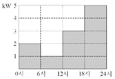

(1) 1일 중의 사용 전력량은 몇 [kWh]인지 계산하시오.

[계산과정]

[정답]

(2) 1일 중의 전손실 전력량은 몇 [kWh]인지 계산하시오.

[계산과정]

[정답]

(3) 1일 중 전일효율은 몇 [%]인지 계산하시오.

[계산과정]

[정답]

---

## 정답 해설

해설) 복합 계산형 / 난이도 中

(1) 1일 중의 사용 전력량

[계산과정]

$$ W = 2 \times 6 + 1 \times 6 + 3 \times 6 + 5 \times 6 = 66 \text{ [kWh]} $$

[정답] 66 [kWh]

(2) 1일 중의 전손실 전력량

[계산과정]

$$ P_c = \left[ \left( \frac{2}{5} \right)^2 \times 0.13 + \left( \frac{1}{5} \right)^2 \times 0.13 + \left( \frac{3}{5} \right)^2 \times 0.13 + \left( \frac{5}{5} \right)^2 \times 0.13 \right] \times 6 = 1.22 \text{ [kWh]} $$

$$ P_l = 0.1 \times 24 = 2.4 \text{ [kWh]} $$

$$ \therefore P\_{L} = P_l + P_c = 2.4 + 1.22 = 3.62 \text{ [kWh]} $$

[정답] 3.62 [kWh]

(3) 1일 중 전일효율 계산

[계산과정]

$ 효율 \eta = \frac{\text{출력}}{\text{출력 + 손실}} \times 100 \% = \frac{66}{66 + 3.62} \times 100 = 94.8 \% $

[정답] 94.8 [%]

부분점수

| 점수 | 세부기준                                  |
| ---- | ----------------------------------------- |
| 5점  | (1), (2), (3)번이 모두 맞은 경우 5점 획득 |
| 1점  | (1)번만 맞은 경우 1점 획득                |
| 4점  | (2), (3)번이 맞은 경우 한 문항당 2점 획득 |

---

# Q14 다음과 같은 고압 전동기 100[HP] 미만을 사용하는 고압 수전설비의 결선도를 보고 각 물음에 답하시오. [배점: 10점]

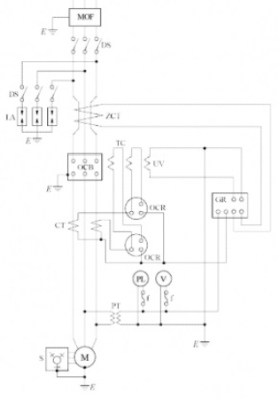

(1) 다음 표의 명칭과 역할 부분을 직접 채워 완성하시오.

| 번호 | 약호 | 명칭 | 역할 |
| ---- | ---- | ---- | ---- |
| ①    | MOF  |      |      |
| ②    | LA   |      |      |
| ③    | ZCT  |      |      |
| ④    | OCB  |      |      |
| ⑤    | OCR  |      |      |
| ⑥    | GR   |      |      |

(2) 위의 도면에서 생략할 수 있는 부분을 쓰시오.

[정답]

(3) 전력용 콘덴서에 고조파 전류가 흐를 때 사용하는 기기를 쓰시오.

[정답]

---

# 정답 해설

(1) 표 완성하기

| 번호 | 약호 | 명칭                      | 역할                                                                          |
| ---- | ---- | ------------------------- | ----------------------------------------------------------------------------- |
| ①    | MOF  | 전력 수급용 계기용 변성기 | 고전압·대전류를 변압, 변류하여 전력량계에 공급한다.                           |
| ②    | LA   | 피뢰기                    | 이상 전압이 내습하면 이를 대지로 방전하고, 속류를 차단한다.                   |
| ③    | ZCT  | 영상 변류기               | 지락 사고 시 영상 전류를 검출한다.                                            |
| ④    | OCB  | 유입 차단기               | 단락 및 과부하, 지락 사고 등 사고 전류 차단 및 부하 전류를 개폐하기 위한 장치 |
| ⑤    | OCR  | 과전류 계전기             | 정정값 이상의 전류가 흐르면 동작되는 계전기                                   |
| ⑥    | GR   | 지락 계전기               | 지락 사고 발생시 동작하는 계전기                                              |

(2) LA용 DS

(3) 직렬 리액터

부분점수

| 점수 | 세부기준                                                    |
| ---- | ----------------------------------------------------------- |
| 10점 | (1), (2), (3)번이 모두 맞은 경우 10점 획득                  |
| 8점  | (1)번 표가 모두 맞은 경우 8점 획득, 오기입 1개당 1점씩 감점 |
| 2점  | (2), (3)번은 한 문제를 맞힐 때마다 1점씩 획득               |

---

# Q15 다음은 비접지 선로의 접지전압을 검출하기 위하여 [Y-Y-개방△] 결선을 한 GPT입니다. 다음 물음에 답하시오. [배점: 5점]

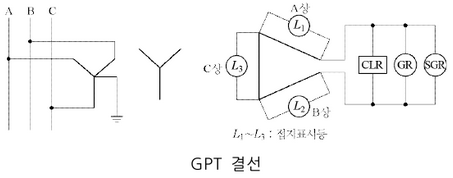

$$ (1) A상 고장 시(완전 지락 시), 2차 접지표시등 L_1, L_2, L_3의 점멸과 밝기를 비교하여 쓰시오. $$

[정답]

(2) 1선 지락 사고 시 건전상(사고가 안 난 상)의 대지 전위의 변화를 간단히 설명하시오.

[정답]

(3) CLR, SGR의 정확한 명칭을 우리말로 쓰시오.

[정답]

- CLR:
- SGR:

---

# 해설) 서술 암기형 / 난이도 중

## 정답

(1) L₁: 소등, L₂: 점등(더욱 밝아짐), L₃: 점등(더욱 밝아짐)

$$ (2) 평상 시 건전상의 대지전위는 \frac{110}{\sqrt{3}}[V]이나, 1선 지락 사고시에는 전위가 \sqrt{3}배로 증가하여 110[V]가 된다. $$

(3) [정답] ① CLR: 한류저항기, ② SGR: 선택 지락계전기

## 부분점수

| 점수  | 세부기준                                              |
| ----- | ----------------------------------------------------- |
| 5점   | (1), (2), (3)번이 모두 정답인 경우                    |
| 1~0점 | (1) 문항의 L₁, L₂, L₃의 모두 정답인 경우에만 1점 획득 |
| 2~0점 | (2) 문항이 정답인 경우 2점 획득                       |
| 2~0점 | (3) 소문항 2개 중 각 1개당 부분 점수 1점 획득         |

## 접근 POINT

비접지 선로의 접지저항을 검출하기 위한 GPT(접지형 계기용 변압기)의 구조와 동작 원리 및 명칭을 묻는 문제로 단순한 암기를 통해 학습해야 한다.

(2) 문제에 대한 건전 상 대지전위와 1선 지락 사고 시의 전위의 차이를 기억한다면 (1) 문제에 대한 것은 전압이 상승하여 램프로 흘러 들어가는 전류가 많아져 밝기가 밝아진다는 것이 자연스럽게 이해될 것이다.

## 해설

GPT(Ground Potential Transformer)는 접지형 계기용 변압기로, 비접지 계통에서 지락 사고 시 영상 전압($V_0$)을 검출하고, OVGR(Over Voltage Ground Relay)를 동작시키는 역할을 한다.

2차 측 권선들은 Open-△형으로 결선되고 한류저항(CLR, Current Limiting Resistor)이 붙어있는 형태를 가지고 있다.

CLR: Current Limiting Resister (한류저항기)

GR: Ground Relay (지락 계전기)

SGR: Selective Ground Relay (선택 지락 계전기)

---

# Q16 다음과 같은 릴레이 인터록 회로를 보고 물음에 답하시오. [배점: 6점]

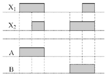

(1) 이 회로를 논리회로로 고쳐 완성하시오.

[정답]

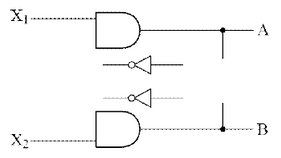

(2) 위의 회로를 논리식으로 쓰고 진리표를 완성하시오.

[정답]

논리식 : $A = X_1, B = X_2 $

- 진리표 :

| $$  | X_1 | X_2 | A   | B   | $$  |
| --- | --- | --- | --- | --- | --- |
| 0   | 0   | 0   | 0   |
| 0   | 1   | 0   | 1   |
| 1   | 0   | 1   | 0   |

---

# 논리회로 문제

## 해설) 도면완성 + 논리회로 / 난이도 중

### (1) 논리회로 완성

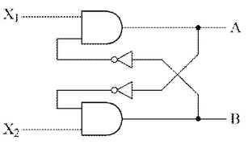

### (2) 논리식과 진리표 완성

논리식:

$$ A = X_1 \cdot \overline{B}, B = X_2 \cdot \overline{A} $$

진리표:

| $$  | X_1 | X_2 | A   | B   | $$  |
| --- | --- | --- | --- | --- | --- |
| 0   | 0   | 0   | 0   |
| 0   | 1   | 0   | 1   |
| 1   | 0   | 1   | 0   |

### 부분점수

| 점수 | 세부기준                                |
| ---- | --------------------------------------- |
| 6점  | (1), (2)번이 모두 맞는 경우 6점 획득    |
| 3점  | (1), (2)번 중 하나만 맞는 경우 3점 획득 |

---

# Q17 그림과 같이 기자재가 주어졌을 경우 물음에 답하시오. [배점: 6점]

(1) 전압 전류계법으로 저항값을 측정하기 위한 회로를 완성하시오.

[정답]

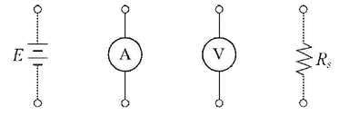

$$ **(2) 저항 R_s에 대한 식을 쓰시오.** $$

[정답]

---

# 해설) 도면완성+단답 암기형 / 난이도 中

## 정답

(1) 회로 완성

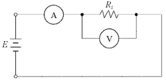

(2) $R_s = \frac{V}{A}$

## 부분점수

| 점수 | 세부기준                             |
| ---- | ------------------------------------ |
| 6점  | (1), (2)번이 모두 맞은 경우 6점 획득 |
| 4점  | (1)번이 맞은 경우 4점 획득           |
| 2점  | (2)번이 맞은 경우 2점 획득           |

## 해설

전압 전류계법은 저항에 전류를 흘리면 전압강하가 생기는 것을 이용하여 저항값을 측정하는 방법이다.

---

# Q18 일상생활에서 많이 사용하는 주택 및 아파트에 설치하는 콘센트의 수는 사람들의 생활 수준 및 생활방식 등이 다르기 때문에 일률적으로 규정하기 어렵다. 이에 따라 내선규정에서는 아래의 표와 같이 규모별로 표준적인 콘센트 수와 바람직한 콘센트 수를 규정하고 있다. 표의 빈칸에 알맞은 내용을 쓰시오. [배점: 5점]

| 방의 크기[mm²] | 표준적인 설치 수 |
| -------------- | ---------------- |
| 5 미만         | ①                |
| 5~10 미만      | ②                |
| 10~15 미만     | ③                |
| 15~20 미만     | ④                |
| 부엌           | ⑤                |

[비고 1] 콘센트 구수에 관계 없이 1개로 본다.

[비고 2] 콘센트 2구 이상 콘센트를 설치하는 것이 바람직하다.

[비고 3] 대형 전기 기계 기구 전용 콘센트 및 환풍기, 전기 시계 등을 벽에 붙이는 전용 콘센트는 위 표에 포함되어 있지 않다.

[비고 4] 다용도실이나 세면장에는 방수형 콘센트를 시설하는 것이 바람직하다.

[정답]

①

②

③

④

⑤

---

## 해설) 단답 암기형 / 난이도 下

정답

① 1, ② 2, ③ 3, ④ 3, ⑤ 2

부분점수

| 점수 | 세부기준                       |
| ---- | ------------------------------ |
| 5점  | 1문항을 맞힐 때마다 1점씩 획득 |

해설

내선규정 3315-6 주택의 콘센트 수

| 방의 크기[mm²] | 표준적인 설치 수 | 바람직한 설치 수 |
| -------------- | ---------------- | ---------------- |
| 5 미만         | 1                | 2                |
| 5 ~ 10 미만    | 2                | 3                |
| 10 ~ 15 미만   | 3                | 4                |
| 15 ~ 20 미만   | 3                | 5                |
| 부엌           | 2                | 4                |

[비고 1] 콘센트 구수(數)에 관계없이 1개로 본다.

[비고 2] 콘센트 2구 이상 콘센트를 설치하는 것이 바람직하다.

[비고 3] 대형 전기 기계 기구의 전용 콘센트 및 환풍기, 전기 시계 등을 벽에 붙이는 전용 콘센트는 위 표에 포함되어 있지 않다.

[비고 4] 다용도실이나 세면장에는 방수형 콘센트를 시설하는 것이 바람직하다.

---
