# Q1 전기공사업자는 전력시설물 공사감리업무 수행지침에서 정하는 바에 따라 해당 공사현장에서 공사업무 수행상 비치하고 기록, 보관하여야 하는 서식이 있다. 이 서식을 5가지 쓰시오. [배점: 5점]

[정답]

①

②

③

④

⑤

---

# 정답 해설

해설) 단답 암기형 / 난이도 중

1. 하도급 현황
2. 주요인력 및 장비투입 현황
3. 작업계획서
4. 기자재 공급원 승인현황
5. 주간공정계획 및 실적보고서

## 부분점수

| 점수  | 세부기준                         |
| ----- | -------------------------------- |
| 5~0점 | 한 문항을 맞힐 때마다 1점씩 획득 |

## 해설

일반 행정업무 (전력시설물 공사감리업무 수행지침 제16조)

공사업자는 다음 각 호의 서식 중 해당 공사현장에서 공사업무 수행상 필요한 서식을 비치하고 기록 · 보관하여야 한다.

1. 하도급 현황
2. 주요인력 및 장비투입 현황
3. 작업계획서
4. 기자재 공급원 승인현황
5. 주간공정계획 및 실적보고서
6. 안전관리비 사용실적 현황
7. 각종 측정 기록표

---

# Q2. 송전계통에서 가공전선로의 이상전압을 방지할 수 있는 대책을 3가지 쓰시오. [배점: 6점]

[정답]

①

②

③

---

# 해설) 단답 암기형 / 난이도 中

## 정답

1. 피뢰기 설치
2. 가공지선 설치
3. 매설지선 설치

## 부분점수

| 점수  | 세부기준                         |
| ----- | -------------------------------- |
| 6~0점 | 한 문항이 맞을 때마다 2점씩 획득 |

## 해설

피뢰기: 이상전압 내습 시 대지로 방전하여 속류를 차단하여 기기를 보호한다.

가공지선: 직격뢰와 유도뢰를 차폐하고, 통신선 유도 장해를 경감한다.

매설지선: 탑각 접지저항을 낮추어 역섬락을 방지한다.

중성점 접지: 지락 시 건전상의 전압상승을 1.3배 이하로 경감하고, 보호계전기를 확실하게 동작시킨다.

---

# Q3 전기기기에서 사용하는 전력퓨즈의 역할을 쓰시오. [배점: 4점]

---

## 정답

해설) 서술 암기형 / 난이도 下

정답

부하전류는 안전하게 통전하고, 과전류 시 용단되어 전로나 기기를 보호한다.

부분점수

| 점수 | 세부기준                             |
| ---- | ------------------------------------ |
| 4점  | 역할을 정확하게 작성한 경우 4점 획득 |
| 0점  | 역할을 잘못 작성한 경우 0점          |

해설

전력퓨즈는 부하전류는 통전시키고, 어떤 일정값 이상의 과전류는 차단하는 역할을 한다.

---

# Q4 건축물의 전기설비 중 간선을 설계할 때 고려해야 하는 사항을 5가지 쓰시오. [배점: 5점]

[정답]

①

②

③

④

⑤

---

# 정답 해설

해설) 서술 암기형 / 난이도 중

1. 전기방식 및 배선방식
2. 장래 증축 계획 유무
3. 수평, 수직 간선의 경로상의 관통부
4. 간선 경로에 대한 위치와 공간
5. 점검구 및 유지보수 공간

## 부분점수

| 점수  | 세부기준                         |
| ----- | -------------------------------- |
| 5~0점 | 한 문항을 맞힐 때마다 1점씩 획득 |

## 해설

### 간선 설계 시 고려사항

시공주(발주처)와 협의해야 할 사항

1. 전기방식, 배선방식
2. 장래 증축 계획 유무
3. 부하의 사용 상태나 수용률, 효율, 역률 등의 각종 Factor

건축 분야와 협의해야 할 사항

1. 간선 경로에 대한 위치와 공간
2. 수평, 수직 간선의 경로상의 관통부
3. 점검구 및 유지보수 공간

기계 분야와 협의해야 할 사항

1. 설비동력의 전기방식, 정격용량, 운전시간, 효율, 역률 및 기동방식 등의 제원
2. 전기 간선이 설비 배관 및 덕트와 함께 시설되는 경우 상호 간섭 및 점검구 사항
3. 동력제어방식, 제어반 위치, 공종별 시공범위 사항

---

# Q5 다음은 TN 계통의 TN-C-S 방식의 저압 배전선로의 접지계통도이다. 미완성된 결선도를 직접 완성하시오. [배점: 5점]

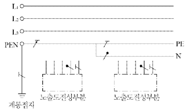

---

---

해설) 도면완성 / 난이도 中

정답

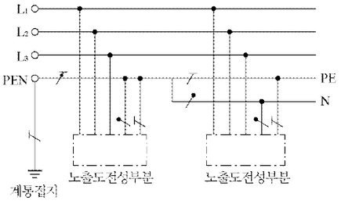

부분점수

| 점수 | 세부기준                               |
| ---- | -------------------------------------- |
| 5점  | 결선도를 정확하게 작성한 경우 5점 획득 |
| 0점  | 결선도에 오류가 있는 경우 0점          |

해설

[한국전기설비규정 203.2] TN 계통

1. TN-S: 계통 전체에 대해 별도의 중성선 또는 PE 도체를 사용한다.
2. TN-C: 계통 전체에 대해 중성선과 보호 도체의 기능을 동일 도체로 겸용한 PEN 도체를 사용한다.
3. TN-C-S: 계통의 일부분에서 PEN 도체를 사용하거나, 중성선과 별도의 PE 도체를 사용한다.

---

# Q6 그림은 PB-ON 스위치를 ON한 후 일정시간이 지난 다음에 전동기 M이 작동되는 회로이다. 다음과 같이 수정하고자 할 때 이 회로를 어떻게 수정해야 하는지 수정하여 주어진 미완성 도면을 완성하시오. (단, 전자 접촉기 MC의 보조 a, b접점 각각 1개씩만을 추가한다.) [배점: 5점]

타이머는 입력신호를 소멸했을 때 열려서 이탈되는 형식인데, 전동기가 회전하면 릴레이가 복귀되어 타이머에 입력신호가 소멸되고 전동기는 계속 회전할 수 있도록 하고자 한다.

[정답]

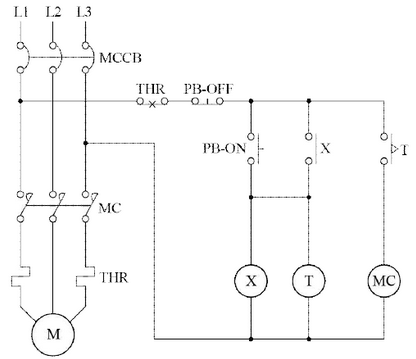

---

# 해설) 도면완성+시퀀스 / 난이도 上

계통

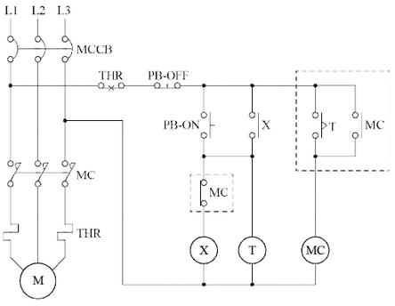

부분점수

| 점수 | 세부기준                               |
| ---- | -------------------------------------- |
| 5점  | 결선도를 정확하게 작성한 경우 5점 획득 |
| 0점  | 결선도에 오류가 있는 경우 0점          |

해설

타이머를 복구시키기 위해 MC에 자기유지 접점을 두고, 타이머는 MC-b 접점으로 끊어야 한다.

---

# Q7 다음과 같은 유접점 시퀀스 회로를 무접점 시퀀스 회로로 바꾸어 정답란에 작성하시오. [배점: 5점]

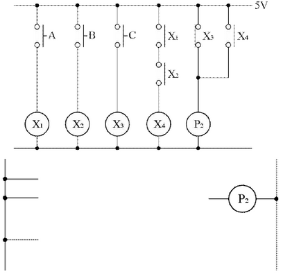

[정답] (무접점 시퀀스 회로 그림)

---

# 논리회로 설계 및 채점 기준

## 정답

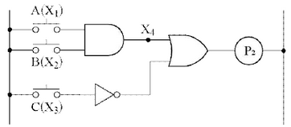

## 부분 점수

| 점수 | 세부 기준                                |
| ---- | ---------------------------------------- |
| 5점  | 논리회로를 정확하게 작성한 경우 5점 획득 |
| 0점  | 논리회로에 오류가 있는 경우 0점          |

---

# Q8 다음은 옥내 배선도의 일부를 표시한 것이다. ㉠, ㉡ 전등은 스위치 A로, ㉢, ㉣ 전등은 스위치 B로 점멸되도록 설계하고자 할 때 각 배선에 필요한 최소 전선 가닥수를 정답란에 표기하시오. [배점: 5점]

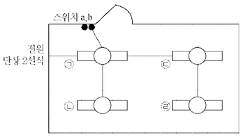

---

해설) 도면완성 / 난이도 中

정답

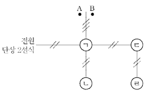

부분점수

| 점수  | 세부기준                              |
| ----- | ------------------------------------- |
| 5~0점 | 1개가 맞을 때마다 1점씩 부분점수 획득 |

해설

스위치에서 ㄱ쪽으로 가는 배선에는 ㄷ, ㄹ 스위치와 관련된 배선도 포함되어 있으므로 3가닥이 필요하다.

---

# Q9 CT 및 PT에 대한 다음 각 물음에 답하시오. [배점: 7점]

(1) CT는 운전 중에 개방하여서는 안 되는 이유를 쓰시오.

[정답]

(2) PT의 2차 측 정격전압과 CT의 2차 측 정격전류는 일반적으로 얼마로 하여야 하는지 쓰시오.

[정답]

(3) 고압 3상 간선의 전압 및 전류를 측정하기 위하여 PT와 CT를 설치할 때, 다음 그림의 결선도를 답안지에 완성하시오. (단, 퓨즈와 접지가 필요한 곳에는 표시를 하고, 퓨즈는 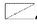, PT는 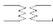, CT는 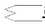 로 표현하시오.)

[정답]

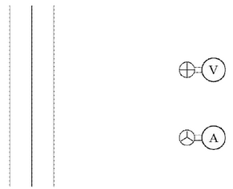

---

## 해설) 단답 암기형+도면작성 / 난이도 中

(1) CT(계기용 변류기)의 2차측 절연보호

(2) PT(계기용 변압기)의 2차측 전압: 110[V], CT의 2차측 전류: 5[A]

(3) PT, CT 결선도

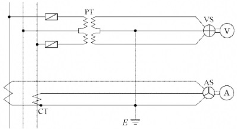

부분점수

| 점수  | 세부기준                                              |
| ----- | ----------------------------------------------------- |
| 7점   | (1)~(3)번이 모두 정답일 경우 7점 획득                 |
| 2~0점 | (1) 문항의 설명이 정답일 경우 2점 획득                |
| 2~0점 | (2) 문항의 모두 정답일 경우 2점 획득                  |
| 3~0점 | (3) 문항의 도면작성이 정답과 일치하는 경우만 2점 획득 |

접근 POINT

PT(계기용 변압기)와 CT(계기용 변류기)의 기본적인 특성 및 동작시 주의사항을 적고 결선도를 작성하는 암기 유형의 문제로 전기설비의 공사 및 시설관리 현장에서 주의할 사항을 반영하고 있다.

해설

[CT(계기용 변류기)를 운전 중에 개방하면 안 되는 이유]

시설관리 현장에서 CT에 연결된 전류계의 고장으로 교체해야 하는 경우 전류계가 연결된 단자를 단락시킨 후 교체를 한다. 이유는 단자를 단락시키지 않고 전류계를 분리하는 경우 CT의 2차측이 개방(Open) 상태가 되면서 흐르던 전류가 0이 되면서 순간적으로 고전압이 유기되어 CT의 2차 측의 절연이 파괴되기 때문이다.

변압기의 역할은 전력은 1차 측과 2차 측에서 변성이 없이 같고 전압과 전류가 변성되는데, 전류가 0이 되면 전압은 아주 큰 값을 가져야 전력에 변함이 없는 것처럼 보이기 때문이다. 또한, 절연파괴는 고전압일 때 이루어진다. 따라서 CT의 2차 측을 개방하면 안 되는 이유는 2차측에 고전압이 유기되어 절연이 파괴될 수 있기 때문이다.

CT의 2차 측을 단락시키는 것은 절연 파괴를 방지하는 것으로 절연을 보호하는 것과 같기에 정답을 "2차 측 절연 보호"라 작성한다.

[결선도 작성 순서]

① 1단계: PT(계기용 변압기)는 전압계 쪽에 선간전압을 측정하기 위해 중앙 2선을 기준으로 2개의 PT를 연결하며, 퓨즈는 1선과 3선에서 PT로 들어오는 곳에 위치시킨다. CT(계기용 변류기)는 전류계 쪽에 기준이 되는 2선이 아닌 1선과 3선에 연결한다.

② 2단계: PT의 기준이 되는 중앙 2선과 CT의 아랫부분을 연결하고 접지를 하여 기준을 잡는다.

③ 3단계: PT의 3선을 VS와 CT의 3선을 AS와 연결하면 된다.

---

# Q10 수전전압 6,600[V], 가공전선로의 %임피던스가 58.5[%]일 때, 수전점의 3상 단락전류가 8,000[A]인 경우 기준용량을 구하고, 수전용 차단기의 차단용량을 다음 표에서 선정하시오. [배점: 6점]

차단기의 정격용량 [MVA]

| 10  | 20  | 30  | 50  | 75  | 100 | 150 | 250 | 300 | 400 | 500 |
| --- | --- | --- | --- | --- | --- | --- | --- | --- | --- | --- |

(1) 기준용량 [MVA]를 계산하시오.

[계산과정]

[정답]

(2) 차단용량 [MVA]를 계산하시오.

[계산과정]

[정답]

---

# 해설) 복합 계산형 / 난이도 중

## 정답

(1) 기준용량[MVA] 계산

[계산과정]

$$ I_n = \frac{\%Z}{100} I_s = \frac{58.5}{100} \times 8,000 = 4,680 [A] $$

$$ P_n = \sqrt{3} V_n I_n = \sqrt{3} \times 6,600 [V] \times 4,680 [A] \times 10^{-6} = 53.5 [MVA] $$

[정답] 53.5[MVA]

(2) 차단용량[MVA] 계산

[계산과정]

$$ P_s = \sqrt{3} V_s I_s = \sqrt{3} \times 7,200 [V] \times 8,000 [A] \times 10^{-6} = 99.77 [MVA] $$

[정답] 100[MVA] 선정

## 부분점수

| 점수 | 세부기준                                |
| ---- | --------------------------------------- |
| 6점  | (1), (2)번이 모두 맞은 경우 6점 획득    |
| 3점  | (1), (2)번 중 하나만 맞은 경우 3점 획득 |

## 해설

차단용량은 다음 식으로 구한다.

$$ 차단용량 = \sqrt{3} \times 정격전압 \times 정격차단전류 $$

정격차단전류 > 단락전류

---

# Q11 그림과 같은 단상 3선식 배전선의 a, b, c 각 선간에 각각 부하가 접속되어 있다. 전선의 저항은 3선이 같고, 모두 0.06 [$\Omega$]이다. ab, bc, ca 간의 전압을 계산하시오. (단, 부하의 역률은 변압기의 2차 전압에 대한 것으로 하고, 또 선로의 리액턴스는 무시한다.) [배점: 6점]

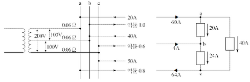

[계산과정]

[정답]

---

## 해설) 단순 계산형 / 난이도 下

정답

[계산과정]

$$ V\_{ab} = 100 - (60 \times 0.06 - 4 \times 0.06) = 96.64 [V] $$

$$ V\_{bc} = 100 - (4 \times 0.06 + 64 \times 0.06) = 95.92 [V] $$

$$ V\_{ca} = 200 - (60 \times 0.06 + 64 \times 0.06) = 192.56 [V] $$

[정답]

$$ V*{ab} = 96.64 [V], V*{bc} = 95.92 [V], V\_{ca} = 192.56 [V] $$

부분점수

| 점수 | 세부기준                                   |
| ---- | ------------------------------------------ |
| 6점  | 결과값 3개 중 1개가 맞을 때마다 2점씩 획득 |

해설

$ e = I(Rcos\theta + Xsin\theta) = R \times Icos\theta + X \times Isin\theta$ 식을 사용하면 되는데 문제에서 선로의 리액턴스를 무시(X = 0) 한다고 했다.

결국 $e = R \times Icos\theta$ 즉, 상전류의 실수부$(Icos\theta)$만 계산하면 된다.

---

# Q12 권수비 30인 단상변압기의 1차에 6.6[kV]를 가했을 경우 물음에 답하시오. (단, 변압기의 손실은 무시한다.) [배점: 6점]

(1) 2차 전압 [V]을 계산하시오.

[계산과정]

[정답]

(2) 2차에 50[kW], 뒤진 역률 80[%]의 부하를 걸었을 때 2차 및 1차 전류 [A]를 계산하시오.

[계산과정]

[정답]

(3) 1차 입력 전력 [kVA]을 계산하시오.

[계산과정]

[정답]

---

# 정답 해설

(1) 2차 전압 [V] 계산

[계산과정]

$ 2차 전압 V_2 = \frac{1}{a}V_1 = \frac{1}{30} \times (6.6 \times 10^3) = 220[V] $

[정답] 220[V]

(2) 2차 및 1차 전류 [A] 계산

[계산과정]

$ P = V_2I_2cos\theta $

$ I_2 = \frac{P}{V_2cos\theta} = \frac{50 \times 10^3}{220 \times 0.8} = 284.09[A] $

$ I_1 = \frac{1}{a}I_2 = \frac{1}{30} \times 284.09 = 9.47[A] $

[정답] 2차 전류 $I_2 = 284.09[A]$, $1차 전류 I_1 = 9.47[A] $

(3) 1차 입력 전력 [kVA] 계산

[계산과정]

$$ P_1 = V_1I_1 = 6.6[kV] \times 9.47[A] = 62.5[kVA] $$

[정답] 62.5[kVA]

부분점수

| 점수 | 세부기준                                            |
| ---- | --------------------------------------------------- |
| 6점  | (1), (2), (3)번이 모두 맞은 경우 6점 획득           |
| 2점  | (1), (2), (3)번 중 한 문항이 맞을 때마다 2점씩 획득 |

해설

권수비 a를 다음 식으로 구해 공식에 적용한다.

$$ a = \frac{n_1}{n_2} = \frac{V_1}{V_2} = \frac{I_2}{I_1} = \sqrt{\frac{Z_1}{Z_2}} $$

---

# Q13 고압 자가용 수용가의 부하는 역률 1.0의 부하 50[kW]와 역률 0.8(지상)의 부하 100[kW]이다. 이 부하에 공급하는 변압기에 대한 물음에 답하시오. [배점: 6점]

(1) Δ 결선하였을 경우 필요한 변압기 1대당 최저용량 [kVA]을 선정하시오.

변압기 표준용량 [kVA]: 10, 15, 20, 30, 50, 75, 100, 150, 200, 300, 500, 750, 1000

[계산과정]

(계산과정은 문제의 조건을 바탕으로 계산하여 작성해야 합니다.)

예시:

- 역률 1.0인 50kW 부하의 피상전력: $S_1 = \frac{P_1}{\cos\phi_1} = \frac{50kW}{1.0} = 50kVA $
- 역률 0.8인 100kW 부하의 피상전력: $S_2 = \frac{P_2}{\cos\phi_2} = \frac{100kW}{0.8} = 125kVA $
- 총 피상전력: $S_{total} = S_1 + S_2 = 50kVA + 125kVA = 175kVA $$
- Δ결선 시, 3상 변압기 용량은 단상 변압기 용량의 3배이므로, 필요한 단상 변압기 용량은 $175kVA/3 \approx 58.33kVA $
- 표준 용량 중 가장 가까운 값: 75kVA

[정답] 75kVA

(2) 1대 고장으로 V 결선하였을 경우 과부하율 [%]을 계산하시오.

[계산과정]

[정답]

(3) Δ결선 시의 변압기 동손($W_Δ$)과 V결선 시의 변압기 동손($W_V$)의 비율 $\frac{W_Δ}{W_V}$ [%]을 계산하시오. (단, 변압기는 단상 변압기를 사용하고, 부하는 변압기 V결선 시 과부하 시키지 않는 것으로 한다.)

[계산과정]

[정답]

---

해설) 복합 계산형 / 난이도 中

정답

(1) 변압기 1대당 최저용량[kVA] 계산

[계산과정]

$ P = 50 + 100 = 150 [kW] $

$ P_r = \frac{50}{1} \times 0 + \frac{100}{0.8} \times 0.6 = 75 [kVar] $

$ P_a = \sqrt{150^2 + 75^2} = 167.71 [kVA] $

$ \Delta$ 결선 시 변압기 1대당 용량 $P_1 = \frac{P_a}{3} = \frac{167.71}{3} = 55.90 [kVA] $

[정답] 75[kVA] 선정

(2) V 결선하였을 경우 과부하율[%] 계산

[계산과정]

$$ P_V = \frac{P_a}{\sqrt{3}} = \frac{167.71}{\sqrt{3}} [kVA] $$

$$ P_1 = \frac{P_V}{\sqrt{3}} = \frac{167.71}{\sqrt{3}} = 96.83 [kVA] $$

$$ 과부하율 = \frac{P_1}{P_r} \times 100 = \frac{96.83}{75} \times 100 = 129.11 [\%] $$

[정답] 129.11[%]

(3) V결선 시의 변압기 동손(W△)의 비율 계산

[계산과정]

$$ 동손비율 = \frac{W\_\Delta}{W_V} \times 100 = \frac{I_V^2 R}{2I_V^2 R} \times 100 = 50 [\%] $$

[정답] 50[%]

부분점수

| 점수 | 세부기준                                        |
| ---- | ----------------------------------------------- |
| 6점  | (1), (2), (3)번이 모두 맞은 경우 6점 획득       |
| 2점  | (1), (2), (3)번 중 한 문항이 맞은 경우 2점 획득 |

해설

다음 공식을 활용하여 순차적으로 계산한다.

유효전력 $P = P_a \cos\theta $

무효전력 $Q = P_a \sin\theta = \frac{P}{\cos\theta} \times \sin\theta $

피상전력 $P_a = \sqrt{P^2 + Q^2} $

---

# Q14 다음과 같은 22.9[kV-Y] 간이 수전설비에 대한 단선 결선도를 보고 물음에 답하시오. [배점: 13점]

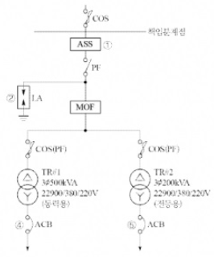

(1) 수변전실의 형태를 Cubicle Type로 할 경우 고압반(HV) 4면과 저압반(LV) 2면으로 구성되어 있다. 이때 수용되는 수배전반과 기기의 명칭을 쓰시오.

[정답]

- 고압반:
- 저압반:

(2) 도면에 표시된 ①, ②, ③ 기기의 최대 설계전압과 정격전류를 쓰시오.

[정답]

(3) ④, ⑤ 차단기의 용량(AF, AT)을 구하여 산정하시오.

④ ACB
[계산과정]

[정답]

⑤ MCCB
[계산과정]

[정답]

---

# 단답 암기형+단순 계산형 문제 해설

(1) 수배전반과 기기의 명칭

- 고압반 4면: 피뢰기, 전력 수급용 계기용 변성기, 컷아웃 스위치, 전력 퓨즈, 전등용 변압기, 동력용 변압기
- 저압반 2면: ACB(기중 차단기), MCCB(배선용 차단기)

(2) ①, ②, ③ 기기의 최대 설계전압과 정격전류

① **ASS(자동고장 구분 개폐기)**
_ 최대 설계전압: 25.8 [kV]
_ 정격전류: 200 [A]

② **LA(피뢰기)**
_ 최대 설계전압: 18 [kV]
_ 정격전류: 2,500 [A]

③ **COS(컷 아웃 스위치)**
_ 최대 설계전압: 25 [kV]
_ 정격전류: 100 [AF], 8 [A]

(3) 차단기의 용량 계산

① **ACB**
[계산과정]
$$ I_L = \frac{500 \times 10^3}{\sqrt{3} \times 380} = 759.67 \text{ [A]} $$
[정답] AF: 800 [A], AT: 800 [A]

② **MCCB**
[계산과정]
$$ I_L = \frac{200 \times 10^3}{\sqrt{3} \times 380} = 303.87 \text{ [A]} $$
[정답] AF: 400 [A], AT: 350 [A]

부분점수

| 점수 | 세부기준                                                    |
| ---- | ----------------------------------------------------------- |
| 13점 | (1), (2), (3)번이 모두 맞은 경우 13점 획득                  |
| 6점  | (2)번이 모두 맞은 경우 6점 획득, 각 소문항 1개당 2점씩 획득 |
| 3점  | (1)번이 모두 맞은 경우 3점 획득                             |
| 4점  | (3)번이 모두 맞은 경우 4점 획득, 각 소문항 1개당 2점씩 획득 |

해설

ASS, AISS

① 정격전압: 25.8 [kV], 정격전류: 200 [A], 정격차단전류: 900 [A], 정격LOCK전류: 800 [A] ±10 [%]

② ASS는 옥외용 설비이므로 수변전실 내에 설치되지 않는다.

③ 옥내용 개폐기: AISS(기중절연형 자동고장 구분 개폐기)

COS(특고압)

① 구성: COS, COS커버, 브라켓, 내오손결합애자, 퓨즈링크

② 정격전압: 25.8 [kV], AF: 100 [A]

③ 정격전류: 1, 3, 5, 6, 8, 12, 15, 20, 25, 30, 40, 50, 80, 100 [A]

④ 1차 측 전류 $ I_L = \frac{200 \text{ [kVA]}}{\sqrt{3} \times 22.9 \text{ [kV]}} = 5.04 \text{ [A]} $

---

# Q15 한 건물에 단상 3선식 110/220[V]을 채용하고 있다. 변압기가 설치된 수전실로부터 50[m] 되는 곳에 부하 집계표와 같은 분전반을 시설하고자 할 때 조건과 전선의 허용전류표를 이용하여 물음에 답하시오. [배점: 11점]

[조건]

- 전압 변동률은 2[%] 이하가 되도록 한다.
- 전압 강하율은 2[%] 이하가 되도록 한다. (단, 중성선에서의 전압강하는 무시한다.)
- 후강 전선관 공사로 한다.
- 3선 모두 같은 선으로 한다.
- 부하의 수용률은 100[%]로 적용한다.
- 후강 전선관 내 전선의 점유율은 48[%] 이내를 유지한다.

[전선의 허용전류표]

| 단면적[mm²] | 허용전류[A] | 전선관 3본 이하 수용 시[A] | 피복 포함 단면적[mm²] |
| ----------- | ----------- | -------------------------- | --------------------- |
| 6           | 54          | 48                         | 32                    |
| 10          | 75          | 66                         | 43                    |
| 16          | 100         | 88                         | 58                    |
| 25          | 133         | 117                        | 88                    |
| 35          | 64          | 144                        | 104                   |
| 50          | 198         | 175                        | 163                   |

[부하 집계표]

| 회로 번호 | 부하 명칭 | 부하[VA]  | 부하 분담[VA] |           | MCCB 크기 |     |     | 비고 |
| --------- | --------- | --------- | ------------- | --------- | --------- | --- | --- | ---- |
|           |           |           | A             | B         | 극수      | AF  | AT  |      |
| 1         | 전등      | 2,400     | 1,200         | 1,200     | 2         | 50  | 16  |      |
| 2         | "         | 1,400     | 700           | 700       | 2         | 50  | 16  |      |
| 3         | 콘센트    | 1,000     | 1,000         | -         | 2         | 50  | 20  |      |
| 4         | "         | 1,400     | 1,400         | -         | 2         | 50  | 20  |      |
| 5         | "         | 600       | -             | 600       | 2         | 50  | 20  |      |
| 6         | "         | 1,000     | -             | 1,000     | 2         | 50  | 20  |      |
| 7         | 팬코일    | 700       | 700           | -         | 2         | 30  | 16  |      |
| 8         | "         | 700       | -             | 700       | 2         | 30  | 16  |      |
|           | **합계**  | **9,200** | **5,000**     | **4,200** |           |     |     |      |

(1) 간선의 공칭 단면적 [mm²]을 계산하시오.

[계산과정]

[정답]

(2) 후강 전선관의 굵기 [mm²]를 계산하시오.

[계산과정]

[정답]

(3) 간선보호용 과전류차단기의 용량(AF, AT)을 계산하시오.

[계산과정]

[정답]

(4) 분전반의 복선 결선도를 완성하시오.

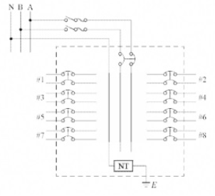

(5) 설비 불평형률은 몇 [%]인지 계산하시오.

[계산과정]

[정답]

※ KEC 적용으로 한 문제 삭제되어 이번 회차는 총 95점입니다.

---

15번 해설) 단순 계산형+복합 계산형+도면완성 / 난이도 上

정답

(1) 간선의 공칭 단면적 [mm²] 계산

[계산과정]

$$ I_A = \frac{5,000}{110} = 45.45[A] $$

$$ I_B = \frac{4,200}{110} = 38.18[A] $$

둘 중 큰 값인 45.45[A]를 기준으로 공칭 단면적을 계산한다.

$$ A = \frac{17.8 \times 50 \times 45.45}{1,000 \times 110 \times 0.02} = 18.39[mm^2] $$

[정답] 25[mm²]

(2) 후강 전선관의 굵기 [mm²]를 계산

[계산과정]

[전선의 허용전류표]에서 25[mm²] 전선의 피복 포함 단면적이 88[mm²]이므로 전선의 총 단면적은 다음과 같다.

$$ A = 88 \times 3 = 264[mm^2] $$

추강 전선관 내 전선의 점유율은 48[%] 이내가 되어야 한다.

$$ A = \frac{1}{4}\pi d^2 \times 0.48 \ge 264 $$

$$ d = \sqrt{\frac{264 \times 4}{0.48 \times \pi}} = 26.46[mm] $$

[정답] 28[mm]

(3) 간선보호용 과전류차단기의 용량(AF, AT) 계산

[계산과정]

설계전류 $I_B$ = 45.45[A] 이고 공칭단면적 25[mm²] 전선의 허용전류 $I_Z$ = 117[A] 이다.

$I_B \le I_u \le I_Z$ 의 조건을 만족하는 정격전류 $I_u$ = 100[A] 의 과전류차단기를 선정한다.

[정답] AF: 100[A], AT: 100[A]

(4) 분전반의 복선 결선도 완성

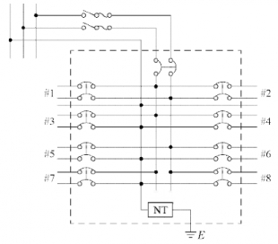

(5) 설비 불평형률[%] 계산

[계산과정]

$$ A 부하설비용량 = 1,000 + 1,400 + 7,000 = 3,100[VA] $$
$$ B 부하설비용량 = 600 + 1,000 + 700 = 2,300[VA] $$

$$ \therefore 설비 불평형률 = \frac{3,100 - 2,300}{\frac{1}{2}(5,000 + 4,200)} \times 100 = 17.39 [\%] $$

[정답] 17.39[%]

부분점수

| 점수 | 세부기준                                              |
| ---- | ----------------------------------------------------- |
| 11점 | (1)~(5)가 모두 맞은 경우 11점 획득                    |
| 5점  | (4)번이 맞은 경우 5점 획득                            |
| 6점  | (1), (2), (3), (5)번은 1문항을 맞을 때마다 2점씩 획득 |

해설

KSC IEC 전선규격

| 전선의 공칭 단면적 [mm²] | 전선의 공칭 단면적 [mm²] | 전선의 공칭 단면적 [mm²] |
| ------------------------ | ------------------------ | ------------------------ |
| 1.5                      | 2.5                      | 4                        |
| 6                        | 10                       | 16                       |
| 25                       | 35                       | 50                       |
| 70                       | 95                       | 120                      |
| 150                      | 185                      | 240                      |
| 300                      | 400                      | 500                      |
| 630                      |                          |                          |

전선의 단면적 및 전압강하 공식

| 전기방식                              | 전압강하                                          | 단면적                      |
| ------------------------------------- | ------------------------------------------------- | --------------------------- |
| 단상 3선식 직류 3선식 3상 4선식 | $IR = e = \frac{17.81LI}{1,000A}$   e = 상전압 | $A = \frac{17.8LI}{1,000e}$ |
| 단상 2선식 직류 2선식              | $2IR = e = \frac{35.6LI}{1,000A}$                 | $A = \frac{35.6LI}{1,000e}$ |
| 3상 3선식                             | $\sqrt{3}IR = e = \frac{30.8LI}{1,000e}$          | $A = \frac{30.8LI}{1,000e}$ |

---
