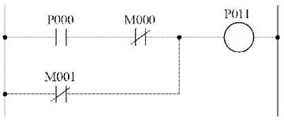
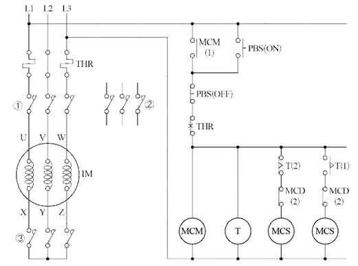
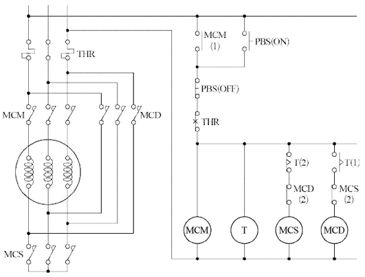
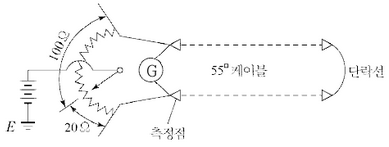
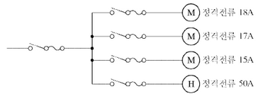
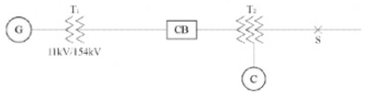
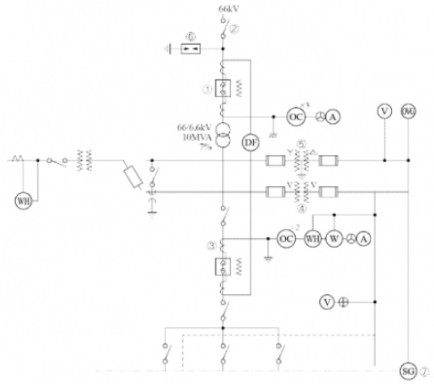

# Q1 부하의 최대 수요전력을 억제할 수 있는 방법을 3가지 작성하시오.[배점: 6점]

[정답]
①

②

③

---

해설) 서술 암기형 / 난이도 中

정답

1. 부하의 피크 컷을 제어한다.
2. 부하의 피크 시프트를 제어한다.
3. 설비부하의 프로그램을 제어한다.

부분점수

| 점수  | 세부기준                         |
| ----- | -------------------------------- |
| 6~0점 | 한 문항이 맞을 때마다 2점씩 획득 |

해설

다양한 답이 나올 수 있는 문제이다. 자가용 발전설비의 가동에 의한 피크 제어방식을 사용하는 것도 정답이 될 수 있다.

---

# Q2 다음 표에 있는 절연내력 시험전압을 계산하여 정답란에 작성하시오.[배점: 5점]

| 공칭전압 [V] | 최대사용전압 [V]        | 절연내력 시험전압 [V] |
| ------------ | ----------------------- | --------------------- |
| 6,600        | 6,900(비접지)           | ①                     |
| 13,200       | 13,800(중성점 다중접지) | ②                     |
| 22,900       | 24,000(중성점 다중접지) | ③                     |

[계산과정]

①

②

③

[정답]

①

②

③

---

## 정답 해설

해설) 단순 계산형 / 난이도 下

[계산과정]

$ ① 6,900 \times 1.5 = 10,350 [V] $

$ ② 13,800 \times 0.92 = 12,696 [V] $

$ ③ 24,000 \times 0.92 = 22,080 [V] $

[정답]

① 10,350 [V]

② 12,696 [V]

③ 22,080 [V]

부분점수

| 점수 | 세부기준                          |
| ---- | --------------------------------- |
| 5점  | 3문항이 모두 정답인 경우 5점 획득 |
| 3점  | 2문항이 정답인 경우 3점 획득      |
| 1점  | 1문항이 정답인 경우 1점 획득      |

해설

절연내력 시험전압(최대 사용전압의 배수)

| 접지방식        | 최대 사용전압 | 시험 전압 배수 | 최저 시험전압 |
| --------------- | ------------- | -------------- | ------------- |
| 비접지          | 7[kV] 이하    | 1.5배          |               |
|                 | 7[kV] 초과    | 1.25배         | 10,500[V]     |
| 중성점 비접지   | 60[kV] 이하   | 1.25배         |               |
|                 | 60[kV] 초과   | 1.25배         |               |
| 중성점 접지     | 60[kV] 초과   | 1.1배          | 75,000[V]     |
| 중성점 직접접지 | 60[kV] 초과   | 0.72배         |               |
|                 | 170[kV] 이하  |                |               |
|                 | 170[kV] 초과  | 0.64배         |               |
| 중성점 다중접지 | 7[kV] 초과    | 0.92배         |               |
|                 | 25[kV] 이하   |                |               |

※ 전로에 케이블을 사용하는 경우에는 직류로 시험할 수 있으며, 시험 전압은 교류의 경우의 2배가 된다

---

# Q3 조명방식 중 조명기구를 배광 기준으로 5가지로 분류하여 쓰시오.[배점 5점]

정답:

1.
2.
3.
4.
5.

---

# 해설) 단순 암기형 / 난이도 中

정답

1. 직접조명
2. 반직접조명
3. 전반확산조명
4. 반간접조명
5. 간접조명

부분점수

| 점수  | 세부기준                         |
| ----- | -------------------------------- |
| 5~0점 | 한 문항이 맞을 때마다 1점씩 획득 |

해설

[조명기구의 배광에 의한 분류]

| 종류          | 내용                                                                                                                           |
| ------------- | ------------------------------------------------------------------------------------------------------------------------------ |
| 직접조명      | 빛을 직접 대상물에 비추는 방식이다.                                                                                            |
| 반직접 조명   | 빛의 약 60% 정도는 아래로 향하여 직접 표면을 비추고 나머지 빛은 천정 면을 향하여 반사시키는 방식이다.                          |
| 전반확산 조명 | 하향광속으로 직접 작업 면에 직사시키고 상향광속의 반사광으로 작업면의 조도를 증가시키는 방식이다.                              |
| 반간접 조명   | 직접조명과 간접조명의 단점을 보완한 것으로 발산광속 중 상향 광속이 약 60~90[%], 하향 광속이 약 10~40[%]로 조정한 조명방식이다. |
| 간접 조명     | 상향광속이 90~100[%]가 되고 하향광속은 10[%] 정도로 대부분의 발산광속을 윗 방향으로 확산시키는 방식이다.                       |

---

# Q4 다음은 상용전원과 예비전원을 운전할 경우에 유의하여야 할 사항이다. ( )안에 들어갈 내용을 정답란에 기입하시오. [배점: 4점]

상용전원과 예비전원 사이에는 병렬운전을 하지 않아야 하므로 수전용 차단기와 발전용 차단기 사이에는 전기적 또는 기계적 (①)을 시설해야 하며 (②)를 사용해야 한다.

[정답]
1
2

---

# 해설) 단순 암기형 / 난이도 下

## 정답

1. 인터록
2. 자동전환 개폐기

## 부분점수

| 점수 | 세부기준                                  |
| ---- | ----------------------------------------- |
| 4점  | 두 문항이 모두 정답인 경우 4점 획득       |
| 2점  | 두 문항 중 한 문항이 정답인 경우 2점 획득 |

## 해설

[비상용 예비전원의 시설(KEC 244.2.1)]

상용전원의 정전으로 비상용전원이 대체되는 경우에는 상용전원과 병렬운전이 되지 않도록 다음 중 하나 또는 그 이상의 조합으로 격리조치를 하여야 한다.

1. 조작기구 또는 절환 개폐장치의 제어회로 사이의 전기적, 기계적 또는 전기기계적 연동
2. 단일 이동식 열쇠를 갖춘 잠금 계통
3. 차단-중립-투입의 3단계 절환 개폐장치
4. 적절한 연동 기능을 갖춘 자동 절환 개폐장치
5. 동등한 동작을 보장하는 기타 수단

---

# Q5. 변압기 중성점 접지(계통접지)의 목적을 3가지 작성하시오. [배점: 5점]

[정답]

①

②

③

---

# 정답 해설

해설) 서술 암기형 / 난이도 중

① 전로의 보호장치의 확실한 동작을 확보한다.

② 이상전압을 억제한다.

③ 대지전압을 저하시킨다.

## 부분 점수

| 점수 | 세부 기준                         |
| ---- | --------------------------------- |
| 5점  | 3문항이 모두 정답인 경우 5점 획득 |
| 3점  | 2문항이 정답인 경우 3점 획득      |
| 2점  | 1문항이 정답인 경우 2점 획득      |

## 해설

[한국전기설비규정 322.5] 전로의 중성점의 접지

1.  전로의 보호장치의 확실한 동작의 확보, 이상전압의 억제 및 대지 전압의 저하를 위하여 특히 필요한 경우에 전로의 중성점에 접지공사를 할 경우 접지도체는 공칭단면적 16 $ [mm^2] $이상의 연동선으로서 고장 시 흐르는 전류가 안전하게 통할 수 있는 것을 사용하고 또한 손상을 받을 우려가 없도록 시설할 것 $$

2.  저압전로에 시설하는 보호장치의 확실한 동작을 확보하기 위하여 특히 필요한 경우에 전로의 중성점에 접지공사를 할 경우 접지도체는 공칭단면적 6 $ [mm^2]$ 이상의 연동선으로서 고장 시 흐르는 전류가 안전하게 통할 수 있는 것을 사용하여야 한다.

3.  변압기의 안정권선이나 유휴권선 또는 접지공사를 할 때에는 규정에 의하여 접지공사를 하여야 한다. 특히, 필요할 경우에 그 권선에 접지공사를 할 때에는 규정에 의하여 접지공사를 하여야 한다.

    ① 선로의 보호 장치의 확실한 동작의 확보: 지락고장 시 접지계전기의 확실한 동작

    ② 이상전압의 억제: 뇌, 아크 지락, 기타에 의한 이상전압의 경감 및 발생 억제

    ③ 대지전압의 저하: 지락고장 시 건전상의 대지 전위상승을 억제, 전선로 및 기기의 절연레벨을 경감

---

# Q6 다음과 같은 PLC 프로그램을 보고 다음의 물음에 답하시오.[배점: 6점]

① S: 입력 a 접점 (신호)

② SN : 입력 b 접점 (신호)

③ A: AND a 접점

④ AN: AND b 접점

⑤ O: OR a 접점

⑥ ON: OR b 접점

⑦ W: 출력

| 스텝 | 명령어 | 번지 |
| ---- | ------ | ---- |
| 0    | S      | P000 |
| 1    | AN     | M000 |
| 2    | ON     | M001 |
| 3    | W      | P011 |

(1) 위의 조건을 기준으로 PLC 래더 다이어그램을 작성하시오.
[정답]

(2) 위의 조건을 기준으로 출력의 논리식을 작성하시오.
[정답]

---

해설) 도면완성+논리회로 / 난이도 中

정답

(2) $P*{011} = P*{000} \cdot \overline{M*{000} + M*{001}} $

부분점수

| 점수 | 세부기준                                |
| ---- | --------------------------------------- |
| 6점  | (1), (2)번이 모두 맞은 경우 6점 획득    |
| 3점  | (1), (2)번 중 하나만 맞은 경우 3점 획득 |

---

# Q7 다음에 제시된 도면은 3상 농형 유도전동기 IM의 Y-△ 기동 운전 제어의 미완성 회로도이다. 다음 물음에 답하시오. [배점: 8점]

(1) ①~③에 해당되는 전자접촉기 접점의 약호를 쓰시오.

[정답]

①  
②  
③

(2) 전자접촉기 MCS는 운전 중에는 어떤 상태로 있는지 쓰시오.

[정답]

(3) 미완성 회로도의 주회로 부분에 Y-△기동 운전 결선도를 작성하시오.

[정답]

---

## 해설) 시퀀스 동작 + 도면완성 / 난이도 상

정답

(1) ① MCM, ② MCD, ③ MCS

(2) 복구(무여자) 상태로 있다.

(3) 결선도 완성

부분점수

| 점수 | 세부기준                                      |
| ---- | --------------------------------------------- |
| 8점  | (1), (2), (3)번이 모두 맞은 경우 8점 획득     |
| 4점  | (3)번이 맞은 경우 4점 획득                    |
| 4점  | (1), (2)번은 한 문항이 맞을 때마다 2점씩 획득 |

---

# Q8 다음과 같은 인텔리전트 빌딩(Intelligent building)의 전산시스템을 유지하기 위하여 비상전원으로 사용되고 있는 UPS에 대한 물음에 답하시오.[배점: 6점]

인텔리전트 빌딩(Intelligent building)은 빌딩 자동화시스템, 사무자동화시스템, 정보통신시스템, 건축환경을 총 망라한 건설과 유지관리의 경제성을 추구하는 빌딩이다.

(1) UPS를 우리말로 쓰시오.

[정답] 무정전 전원 장치

(2) UPS에서 AC→DC부와 DC→AC부로 변환하는 부분의 명칭을 각각 무엇이라고 하는지 쓰시오.

[정답]
① AC→DC 변환부: 정류기
② DC→AC 변환부: 인버터

(3) UPS가 동작되면 전력공급을 위한 축전지가 필요하다. 이때의 축전지 용량을 구하는 공식을 쓰시오. (단, 기호를 사용할 경우, 기호에 대한 의미도 함께 작성하시오.)

[정답] 질문의 맥락으로 보아, 축전지 용량을 구하는 공식은 특정한 하나의 공식으로 한정할 수 없으며, 문제 상황에 따라 다양한 공식이 적용될 수 있습니다. 예를 들어, 부하의 전력 소모량과 백업 시간을 고려하여 축전지 용량을 계산할 수 있습니다. 다만, 질문에서 공식과 기호에 대한 설명을 요구했으므로, 아래와 같이 표현할 수 있습니다.

$$ 용량 (Ah) = \frac{부하전력 (W) \times 백업시간 (h)}{방전종료전압 (V)} $$

여기서,

- Ah: 축전지 용량 (암페어아워)
- W: 부하의 전력 소모량 (와트)
- h: 필요한 백업 시간 (시간)
- V: 방전 종료 전압 (볼트)

---

# 해설) 단답 암기형+단순 계산형 / 난이도 中

정답

(1) 무정전 전원 공급 장치

(2) ① AC → DC 변환부: 컨버터
② DC → AC 변환부: 인버터

(3) $C = \frac{1}{L}KI [Ah] $

- C: 축전기의 용량 [Ah]
- L: 보수율
- K: 용량환산 시간계수
- I: 방전 전류 [A]

부분점수

| 점수  | 세부기준                                            |
| ----- | --------------------------------------------------- |
| 6~0점 | (1), (2), (3)번 중 한 문항이 맞을 때마다 2점씩 획득 |

---

# Q9 다음에 제시된 논리식을 간단히 하시오. [배점: 4점]

(1) $Z = (A + B + C)A $

[정답]

(2) $Z = \overline{A}C + BC + AB + \overline{B}C $

[정답]

---

# 정답 해설

해설) 단순 계산형+논리회로 / 난이도 下

(1) 논리식 간소화

[계산과정]

$ Z = (A+B+C)A = AA + AB + AC = A + AB + AC = A(1+B+C) $

$ = A \cdot 1 = A $

[정답] $Z = A $

(2) 논리식 간소화

[계산과정]

$ Z = \overline{A}C + BC + AB + \overline{B}C = AB + C(\overline{A} + B + \overline{B}) = AB + C $

[정답] $Z = AB + C $

부분점수

| 점수 | 세부기준                                                               |
| ---- | ---------------------------------------------------------------------- |
| 4점  | (1), (2) 문항이 모두 맞은 경우 4점 획득                                |
| 2점  | (1), (2) 문항에 대한 계산과정과 정답이 모두 맞았을 때 1문항당 2점 획득 |

접근 POINT

논리식을 최소화하는 문제로 수식을 직접 이용하는 문제와 카르노맵을 이용하는 문제가 있다.

공식 CHECK

$$ A + 0 = A, A + 1 = 1, A + \overline{A} = 1, A \cdot 0 = 0 $$

$$ A \cdot 1 = A, A \cdot A = A, A \cdot \overline{A} = 0 $$

$$ A \cdot (B + C) = AB + AC $$

$$ \overline{A} + B = \overline{A} \cdot \overline{B}, \overline{A} \cdot \overline{B} = \overline{A+B} $$

$$ \overline{\overline{A}} = A $$

해설

$$ **(1)** 논리식을 전개 후 논리식의 기본공식 AA = A임을 이용하고, 다시 공통인 A로 묶으면 1 + A = 1임을 이용하면 된다. $$

$$ **(2)** 논리식을 가장 많은 항이 공통인 C로 묶은 후 논리식의 기본공식 A + \overline{A} = 1임을 이용하면 된다. $$

---

# Q10 불평형 3상 전압이 $V_a = 7.3 \angle 12.5^\circ [V], V_b = 0.4 \angle -100^\circ [V], V_c = 4.4 \angle 154^\circ [V]$일 때 영상분, 정상분, 역상분을 계산하시오. [배점: 6점]

(1) 영상분 전압($V_0$[V])을 계산하시오.
[계산과정]

[정답]

(2) 정상분 전압($V_1$[V])을 계산하시오.
[계산과정]

[정답]

(3) 역상분 전압($V_2$[V])을 계산하시오.
[계산과정]

[정답]

---

## 해설) 복합 계산형 / 난이도 上

정답

(1) 영상분 전압

[계산과정]

$$ V_0 = \frac{1}{3}(V_a + V_b + V_c) $$

$$ = \frac{1}{3} \times (7.3\angle 12.5^\circ + 0.4\angle -100^\circ + 4.4\angle 154^\circ) $$

$$ = 1.03 + j1.04 [V] = 1.46\angle 45.28^\circ [V] $$

[정답] $1.46\angle 45.28^\circ [V] $

(2) 정상분 전압

[계산과정]

$$ V_1 = \frac{1}{3}(V_a + aV_b + a^2V_c) $$

$$ = \frac{1}{3} \times (7.3\angle 12.5^\circ + 1\angle 120^\circ \times 0.4\angle -100^\circ + 1\angle 240^\circ \times 4.4\angle 154^\circ) $$

$$ = 3.72 + j1.39 [V] = 3.97\angle 20.49^\circ [V] $$

[정답] $3.97\angle 20.49^\circ [V] $

(3) 역상분 전압

[계산과정]

$$ V_2 = \frac{1}{3}(V_a + a^2V_b + aV_c) $$

$$ = \frac{1}{3} \times (7.3\angle 12.5^\circ + 1\angle 240^\circ \times 0.4\angle -100^\circ + 1\angle 120^\circ \times 4.4\angle 154^\circ) $$

$$ = 2.38 - j0.85 [V] = 2.53\angle -19.65^\circ [V] $$

[정답] $2.53\angle -19.65^\circ [V] $

부분점수

| 점수  | 세부기준                                                                                                    |
| ----- | ----------------------------------------------------------------------------------------------------------- |
| 6~0점 | 소문항 1개당 2점씩 부분 점수 부여. 각 소문항은 계산과정과 답이 모두 맞아야 2점 획득, 오류가 있으면 0점 처리 |

접근 POINT

필기 유형이지만 최근 5년간 2회 출제되었으므로 대칭분의 공식을 정확히 암기하고, 대칭분의 의미도 이해해야 한다.

해설

$$ 상전압(V_a, V_b, V_c)과 영상전압(V_0), 정상전압(V_1), 역상전압(V_2)의 관계 행렬 $$

$$ \begin{pmatrix} V_a \\ V_b \\ V_c \end{pmatrix} = \begin{pmatrix} 1 & 1 & 1 \\ 1 & a & a^2 \\ 1 & a^2 & a \end{pmatrix} \begin{pmatrix} V_0 \\ V_1 \\ V_2 \end{pmatrix}, \begin{pmatrix} V_0 \\ V_1 \\ V_2 \end{pmatrix} = \frac{1}{3}\begin{pmatrix} 1 & 1 & 1 \\ 1 & a^2 & a \\ 1 & a & a^2 \end{pmatrix} \begin{pmatrix} V_a \\ V_b \\ V_c \end{pmatrix} $$

$$ 여기서, 1 + a + a^2 = 0, a^3 = 1, $$

$$ a = 1\angle 120^\circ = -\frac{1}{2} + j\frac{\sqrt{3}}{2}, a^2 = 1\angle 240^\circ = -\frac{1}{2} - j\frac{\sqrt{3}}{2} $$

---

# Q11 어느 건물의 부하는 하루에 240 [kW]로 5시간, 100 [kW]로 8시간, 75 [kW]로 나머지 시간을 사용하고, 이에 따른 수전설비를 450 [kVA]로 하였다. 다음 물음에 답하시오. (단, 부하의 평균역률은 0.8이다.) [배점: 6점]

(1) 이 건물의 수용률 [%]을 계산하시오.

[계산과정]

하루 총 시간: 24시간

240 kW 사용 시간: 5시간
100 kW 사용 시간: 8시간
$$ 75 kW 사용 시간: 24 - 5 - 8 = 11시간 $$

총 부하량 = (240 kW × 5시간) + (100 kW × 8시간) + (75 kW × 11시간) = 1200 kWh + 800 kWh + 825 kWh = 2825 kWh

평균 부하 = 총 부하량 / 총 시간 = 2825 kWh / 24시간 = 117.71 kW

수용률 = (평균 부하 / 수전설비 용량) × 100% = (117.71 kW / 450 kVA × 0.8) × 100% ≈ 32.7%

[정답] 약 32.7%

(2) 이 건물의 일부하율 [%]을 계산하시오.

[계산과정]

최대 부하 = 240 kW

일부하율 = (평균 부하 / 최대 부하) × 100% = (117.71 kW / 240 kW) × 100% ≈ 49.0%

[정답] 약 49.0%

---

# 정답 해설

(해설) 복합 계산형 / 난이도 中

(1) 건물의 수용률 [%] 계산

[계산과정]

$$ 수용률 = \frac{\text{최대 수용 전력}}{\text{설비 용량}} \times 100 = \frac{240}{450 \times 0.8} \times 100 = 66.67 [%] $$

[정답] 66.67 [%]

(2) 건물의 일부하율 [%] 계산

[계산과정]

$$ 부하율 = \frac{\text{평균 전력}}{\text{최대 수용 전력}} \times 100 = \frac{240 \times 5 + 100 \times 8 + 75 \times 11}{240 \times 24} \times 100 = 49.05 [%] $$

[정답] 49.05 [%]

부분 점수

| 점수 | 세부 기준                                    |
| ---- | -------------------------------------------- |
| 6점  | (1), (2)번이 모두 정답인 경우 6점 획득       |
| 3점  | (1), (2)번 중 한 문항이 정답인 경우 3점 획득 |

해설

[수용률 (Demand Factor)]

수용설비가 동시에 사용되는 정도를 나타내며 주상 변압기 등의 적정 공급 설비 용량을 파악하기 위하여 사용한다.

$$ 수용률 = \frac{\text{최대 수요 전력 [kW]}}{\text{부하 설비 합계 [kW]}} \times 100 [%] $$

[부하율]

공급설비가 어느 정도 유효하게 사용되는가를 나타내며 부하율이 클수록 공급 설비가 유효하게 사용된다.

$$ 부하율 = \frac{\text{평균 수요 전력 [kW]}}{\text{최대 수요 전력 [kW]}} \times 100 [%] $$

---

# Q12 50[mm²] (0.3195 [Ω/km]), 전장 3.6[km]인 3심 전력 케이블의 어떤 중간지점에서 1선 지락사고가 발생하여 전기적 사고점 탐지법의 하나인 머레이 루프법으로 측정하였다. 그 결과 다음과 같은 상태에서 평형이 되었을 때 측정점에서 사고지점까지의 거리를 계산하시오. [배점: 5점]

## 계산과정

## 정답

(계산과정을 통해 구해야 하는 값입니다.)

---

해설) 단순 계산형 / 난이도 중

정답
[계산과정]
$$ 20 \times (2L - x) = 100 \times x $$
$$ x = \frac{40L}{120} = \frac{40 \times 3.6}{120} = 1.2 [km] $$

[정답] 1.2[km]

부분점수

| 점수 | 세부기준                                  |
| ---- | ----------------------------------------- |
| 5점  | 계산과정과 정답이 모두 맞은 경우 5점 획득 |
| 0점  | 계산과정이나 정답에 오류가 있는 경우 0점  |

해설
휘스톤 브리지 등가회로를 이용한다.
$$ 저항 R = \rho \frac{L}{A} [\Omega] 에서 전선의 단면적이 동일하다면 R \propto L(길이)로 가정하고 계산할 수 있다. $$

---

# Q13 200[kVA]인 단상변압기 2대를 V결선하여 부하를 걸었다. 이 때 계약 수전설비에 의한 계약 최대전력을 계산하시오. (단, 계산 값은 소수 첫째 자리에서 반올림한다.) [배점: 4점]

[계산과정]

[정답]

---

# 해설) 단순 계산형 / 난이도 下

## 정답

[계산과정]

$$ P = (200 + 200) \times 0.866 = 346.4 \, [kVA] $$

[정답] 346 [kVA]

## 부분점수

| 점수 | 세부기준                               |
| ---- | -------------------------------------- |
| 4점  | 계산과정과 정답에 오류가 없는 경우 4점 |
| 0점  | 계산과정과 정답에 오류가 있는 경우 0점 |

## 해설

계약 수전설비에 의한 계약 최대전력의 결정은 계약 수전설비(변압기) 표시용량의 합계로 한다. 다만, 3상공급을 위하여 단상변압기를 결합하여 사용한 경우의 계약 최대전력은 다음과 같이 결정한다.

1. △ 또는 Y결선의 경우: 결선된 단상변압기 용량의 합계
2. 동일 용량의 변압기를 V결선한 경우: 결선된 단상변압기 용량 합계의 86.6[%]
3. 서로 다른 용량의 변압기를 V결선한 경우

$$ 계약 최대 전력 = (A - B) + (B \times 2 \times 0.866) $$

큰 용량의 변압기(A), 작은 용량의 변압기(B)

---

# Q14 다음과 같이 전열기 ⊕와 전동기 ⓜ이 간선에 접속되어 있을 때 간선의 허용전류 $I_L$을 몇 [A]인지 계산하시오. (단, 전동기의 역률은 모두 80[%]이다.) [배점: 4점]

[계산과정]

[정답]

 

---

# 해설) 복합 계산형 / 난이도 中

## 정답

[계산과정]

$$ I_H = 50[A] $$

$$ I_M = 15 + 18 + 17 = 50[A] $$

$$ I_B = I_H + I_M = 50 + 50 = 100[A] $$

$$ I_B \le I_z \le I_2 의 조건을 만족해야 한다. $$

간선의 최소 허용전류는 100[A]가 되어야 한다.

[정답] 100[A]

## 부분점수

| 점수 | 세부기준                                      |
| ---- | --------------------------------------------- |
| 4점  | 계산과정이나 정답에 오류가 없는 경우 4점 획득 |
| 0점  | 계산과정이나 정답에 오류가 있는 경우 0점      |

## 해설

[한국전기설비규정 212.4] 과부하전류에 대한 보호

과부하에 대해 케이블(전선)을 보호하는 장치의 동작 특성은 다음의 조건을 충족해야 한다.

$$ I_B \le I_z \le I_2 \le 1.45 \times I_z $$

$$ _ I_B: 회로의 설계전류(선도체를 흐르는 설계전류 또는 함유율이 높은 영상분 고조파, 특히 제3고조파가 지속적으로 흐르는 경우 중성선에 흐르는 전류이다.) $$
$$ _ I*z: 케이블의 허용전류 $$
$$ * I: 보호장치의 정격전류(사용현장에 적합하게 조정된 전류의 설정 값) $$
$$ \_ I_2: 보호장치가 규약시간 이내에 유효하게 동작하는 것을 보장하는 전류 $$

---

# Q15 그림과 같은 송전계통 S점에서 3상 단락사고가 발생하였다. 주어진 도면과 조건을 참고하여 다음 각 물음에 답하시오. [배점: 14점]

[조건]

| 번호 | 기기명     | 용량                                                  | 전압                                    | %X                                                                                                  |
| ---- | ---------- | ----------------------------------------------------- | --------------------------------------- | --------------------------------------------------------------------------------------------------- |
| 1    | 발전기(G)  | 50,000[kVA]                                           | 11[kV]                                  | 25                                                                                                  |
| 2    | 변압기(T₁) | 50,000[kVA]                                           | 11/154[kV]                              | 10                                                                                                  |
| 3    | 송전선     |                                                       | 154[kV]                                 | 8 (10,000[kVA] 기준)                                                                                |
| 4    | 변압기(T₂) | 1차 25,000[kVA] 2차 30,000[kVA] 3차 10,000[kVA] | 1차 154[kV] 2차 77[kV] 3차 11[kV] | 12 (25,000[kVA] 기준, 1차~2차) 16 (25,000[kVA] 기준, 2차~3차) 9.5 (10,000[kVA] 기준, 3차~1차) |
| 5    | 조상기(C)  | 10,000[kVA]                                           | 11[kV]                                  | 15                                                                                                  |

(1) 변압기(T₂)의 각각의 %리액턴스를 기준용량 10[MVA]로 환산하시오.

[계산과정]

[정답]

(2) 변압기(T₂)의 1차(P), 2차(T), 3차(S)의 %리액턴스를 계산하시오.

[계산과정]

[정답]

(3) 발전기에서 고장점까지 10[MVA] 기준, 합성 %리액턴스를 계산하시오.

[계산과정]

[정답]

(4) 고장점에서 단락용량은 몇 [MVA]인지 계산하시오.

[계산과정]

[정답]

(5) 고장점의 단락전류는 몇 [A]인지 계산하시오.

[계산과정]

[정답]

---

# 해설) 복합 계산형 / 난이도 上

## 정답

(1) 변압기(T₂)의 각각의 %리액턴스를 기준용량 10[MVA]로 환산

[계산과정]

- 1차~2차: $\%X\_{p-r} = \frac{10}{25} \times 12 = 4.8 \% $
- 2차~3차: $\%X\_{T-S} = \frac{10}{25} \times 16 = 6.4 \% $
- 3차~1차: $\%X\_{S-p} = \frac{10}{10} \times 9.5 = 9.5 \% $

[정답]

- 1차~2차: $\%X_{p-r} = 4.8 \%$
- 2차~3차: $\%X_{T-S} = 6.4 \%$
- 3차~1차: $\%X_{S-p} = 9.5 \%$

(2) 변압기(T₂)의 1차(P), 2차(T), 3차(S)의 %리액턴스 계산

[계산과정]

- 1차: $\%X_P = \frac{4.8 + 9.5 - 6.4}{2} = 3.95 \%$
- 2차: $\%X_T = \frac{6.4 + 4.8 - 9.5}{2} = 0.85 \%$
- 3차: $\%X_S = \frac{6.4 + 9.5 - 4.8}{2} = 5.55 \%$

[정답]

$$ \%X_P = 3.95 \ [%], \ \%X_T = 0.85 \ [%], \ \%X_S = 5.55 \ [%] $$

(3) 발전기에서 고장점까지 10[MVA] 기준, 합성 %리액턴스 계산

[계산과정]

① 기준용량 10[MVA] %리액턴스 환산

- 발전기: $\%X_G = \frac{10}{50} \times 25 = 5 \% $
- 변압기(T₁): $\%X_T = \frac{10}{50} \times 10 = 2 \% $
- 송전선: $\%X_L = \frac{10}{10} \times 8 = 8 \% $
- 변압기(T₁): $\%X_T = \frac{10}{50} \times 10 = 2 \% $
- 송전선: $\%X_L = \frac{10}{10} \times 8 = 8 \% $
- 조상기: $\%X_C = \frac{10}{10} \times 15 = 15 \% $

② 합성 %리액턴스

- 발전기~변압기 1차: $\%X_1 = 5 + 2 + 8 + 3.95 = 18.95 \% $
- 조상기~변압기 3차: $\%X_3 = 15 + 5.55 = 20.55 \% $
- 합성 $\%X = \frac{18.95 + 20.55}{18.95 + 20.55} + 0.85 = 10.71 \% $

[정답] 10.71 [%]

(4) 고장점에서 단락용량 [MVA] 계산

[계산과정]

$$ P_S = \frac{100}{\%X} P = \frac{100}{10.71} \times 10 = 93.37 \ [MVA] $$

[정답] 93.37 [MVA]

(5) 고장점의 단락전류 [A] 계산

[계산과정]

$$ I_S = \frac{100}{\%X} I_N = \frac{100}{10.71} \times \frac{10 \times 10^6}{\sqrt{3} \times 77 \times 10^3} = 700.1 \ [A] $$

[정답] 700.1 [A]

## 부분점수

| 점수 | 세부기준                                     |
| ---- | -------------------------------------------- |
| 14점 | (1)~(5)가 모두 맞은 경우 14점 획득           |
| 12점 | (1)~(4)번은 한 문항을 맞을 때마다 3점씩 획득 |
| 2점  | (5)번 문항이 맞은 경우 2점 획득              |

## 해설

- 기준용량
  $$ \%Z(\text{기준용량}) = \frac{\text{기준용량}}{\text{자기용량}} \times \%Z(\text{자기용량}) $$
$$ _ \%X*P = \frac{\%X*{S-P} + \%X*{P-T} - \%X*{T-S}}{2} $$
$$ _ \%X*T = \frac{\%X*{P-T} + \%X*{T-S} - \%X*{S-P}}{2} $$
$$ \* \%X*S = \frac{\%X*{S-P} + \%X*{T-S} - \%X*{P-T}}{2} $$

---

# Q16 다음 도면은 어떤 배전용 변전소의 단선결선도이다. 주어진 조건을 기준으로 하여 다음 물음에 답하시오. [배점: 12점]

[조건]

1. 주변압기의 정격은 1차 정격전압 66[kV], 2차 정격전압 6.6[kV], 정격용량은 3상 10[MVA]이다.
2. 주변압기의 1차측 (즉, 1차모선)에서 본 전원 측 등가 임피던스는 100[MVA] 기준으로 16[%]이고, 변압기의 내부 임피던스는 자기 용량 기준으로 7[%]이다.
3. 또한 각 Feeder에 연결된 부하는 거의 동일하다.
4. 차단기의 정격차단용량, 정격전류, 단로기의 정격전류, 변류기의 1차 정격전류 표준은 다음 표와 같다.

| 정격전압 [kV] | 공칭전압 [kV] | 정격차단용량 [MVA] | 정격전류 [A]           | 정격차단시간 [Hz] |
| ------------- | ------------- | ------------------ | ---------------------- | ----------------- |
| 7.2           | 6.6           | 25                 | 200                    | 5                 |
|               |               | 50                 | 400, 600               | 5                 |
|               |               | 100                | 400, 600, 800, 1,200   | 5                 |
|               |               | 150                | 400, 600, 800, 1,200   | 5                 |
|               |               | 200                | 600, 800, 1,200        | 5                 |
|               |               | 250                | 600, 800, 1,200, 2,000 | 5                 |
| 72            | 66            | 1,000              | 600, 800               | 3                 |
|               |               | 1,500              | 600, 800, 1,200        | 3                 |
|               |               | 2,500              | 600, 800, 1,200        | 3                 |
|               |               | 3,500              | 800, 1,200             | 3                 |

- 단로기(또는 선로 개폐기) 정격전류의 표준 규격
  - 72.5[kV] : 600[A], 1,200[A]
  - 7.2[kV] 이하 : 400[A], 600[A], 1,200[A], 2,000[A]
- CT 1차 정격전류 표준 규격 (단위: [A])
  - 50, 75, 100, 150, 200, 300, 400, 600, 800, 1,200, 1,500, 2,000
- CT 2차 정격전류는 5[A], PT의 2차 정격전압은 110[V]이다.

(1) 차단기 ①에 대한 정격차단용량과 정격전류를 계산하시오.

[계산과정]

[정답]

(2) 선로 개폐기 ②에 대한 정격전류를 계산하시오.

[계산과정]

[정답]

(3) 변류기 ③에 대한 1차 정격전류를 계산하시오.

[계산과정]

[정답]

(4) PT ④에 대한 1차 정격전압은 얼마인지 쓰시오.

[정답]

(5) ⑤로 표시된 기기의 명칭은 무엇인지 쓰시오.

[정답]

(6) 피뢰기 ⑥에 대한 정격전압은 얼마인지 쓰시오.

[정답]

(7) ⑦의 역할을 간단히 설명하시오.

[정답]

---

# 정답 및 해설

(1) 차단기 ①에 대한 정격차단용량과 정격전류 계산

[계산과정]

$$ P_s = \frac{100}{\%Z_n} P_n = \frac{100}{16} \times 100 = 625 \text{[MVA]} $$

$$ I_n = \frac{P}{\sqrt{3}V} = \frac{10 \times 10^3}{\sqrt{3} \times 66} = 87.48 \text{[A]} $$

정격차단용량과 정격전류는 각각 표에서 1,000[MVA], 600[A]를 선정한다.

[정답] 정격차단용량 1,000[MVA], 정격전류 600[A]

(2) 선로 개폐기 ②에 대한 정격전류 계산

[계산과정]

$$ I_n = \frac{P}{\sqrt{3}V} = \frac{10 \times 10^3}{\sqrt{3} \times 66} = 87.48 \text{[A]} $$

조건에 따라 600[A]를 선정한다.

[정답] 600[A]

(3) 변류기 ③에 대한 1차 정격전류 계산

[계산과정]

$$ I\_{2n} = \frac{P}{\sqrt{3}V} = \frac{10 \times 10^3}{\sqrt{3} \times 6.6} = 874.77 \text{[A]} $$

위에서 구한 값에 여유배수를 적용한다.

$$ I\_{2n} \times (1.25 \sim 1.5) = 874.77 \times (1.25 \sim 1.5) = 1,093.46 \sim 1,312.16 \text{[A]} $$

조건에 따라 1,200[A]를 선정한다.

[정답] 1,200[A]

(4) 6,600[V]

(5) 접지형 계기용 변성기

(6) 72[kV]

(7) 다회선 배전 선로에서 지락사고 시 고장회선을 선택하여 차단한다.

## 부분점수

| 점수 | 세부기준                                      |
| ---- | --------------------------------------------- |
| 12점 | (1)~(7)이 모두 맞은 경우 12점 획득            |
| 6점  | (1), (2)번은 한 문항을 맞을 때마다 3점씩 획득 |
| 2점  | (3)문항이 맞은 경우 2점 획득                  |
| 4점  | (4)~(7)은 한 문항을 맞을 때마다 1점씩 획득    |

## 해설

피뢰기의 정격전압은 다음에 정해진 기준에 따른다.

| 전력계통 |                     | 피뢰기의 정격전압[kV] |
| -------- | ------------------- | --------------------- | -------- |
| 전압[kV] | 중성점 접지방식     | 변전소                | 배전선로 |
| 345      | 유효접지            | 288                   |          |
| 154      | 유효접지            | 144                   |          |
| 66       | PC 접지 또는 비접지 | 72                    |          |
| 22       | PC 접지 또는 비접지 | 24                    |          |
| 22.9     | 3상 4선 다중접지    | 21                    | 18       |

[주] 전압 22.9[kV-Y] 이하의 배전선로에서 수전하는 설비의 피뢰기 정격전압[kV]은 배전선로용을 적용한다.

---
