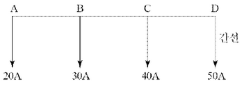
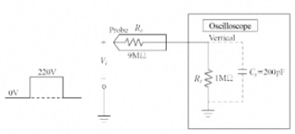
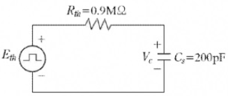
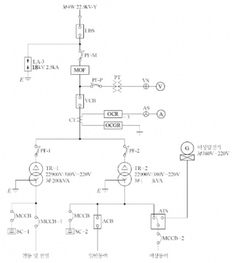
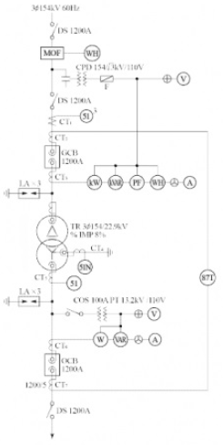

# Q1 ALTS의 명칭과 사용 용도를 각각 작성하시오. [배점: 4점]

[정답]

① 명칭:

② 사용 용도:

---

# 해설) 단순 알기형 / 난이도 下

## 경험

① 명칭: 자동부하 전환 개폐기

② 사용용도: 사전에 이중전원을 확보하여 주전원이 정전되거나 가동치 이하로 전압이 떨어질 경우 예비전원으로 자동으로 전환 시킴으로써 수용가에 안정된 전원을 공급하도록 한다.

## 부분점수

| 점수 | 세부기준                             |
| ---- | ------------------------------------ |
| 4점  | 두 문항이 모두 정답인 경우 4점       |
| 2점  | 두 문항 중 한 문항이 정답인 경우 2점 |

## 해설

ALTS는 Auto Load Transfer Switch의 약자로 자동부하 전환 개폐기라고 하며 병렬 동작 같이 감자기 정전이 되었을 때 문제가 발생할 수 있는 장소에 설치한다.

---

# Q2 변압기의 모선방식을 3가지로 구분하여 쓰시오. [배점: 5점]

[정답]
①
②
③

---

# 해설) 단순 암기형 / 난이도 下

## 정답

1. 단일모선
2. 환상모선
3. 이중모선

## 부분점수

| 점수 | 세부기준                          |
| ---- | --------------------------------- |
| 5점  | 3문항이 모두 정답인 경우 5점 획득 |
| 3점  | 2문항이 정답인 경우 3점 획득      |
| 2점  | 1문항이 정답인 경우 2점 획득      |

## 해설

### 변압기의 모선방식

1. **단일모선**: 가장 단순한 모선 방식으로 경제적이다.
2. **복모선**: 통상 2중 모선을 사용하며, 기기의 점검 · 보수 및 계통 운용이 단일모선에 비해 쉬워진다.
3. **환상모선**: 모선의 부분 정전, 차단기의 점검 · 보수 등이 편리하다.

---

# Q3 가공전선로와 비교한 지중전선로의 장점과 단점을 각각 4가지씩 작성하시오. [배점: 8점]

(1) 장점을 4가지 작성하시오.

[정답]

1.
2.
3.
4.

(2) 단점을 4가지 작성하시오.

[정답]

1.
2.
3.
4.

---

# 정답 해설

(해설) 서술 암기형 / 난이도 중

(1) 장점 4가지

1. 유도장해가 적다.
2. 도시 미관에 좋은 영향을 준다.
3. 동일 루트에 다회선이 가능하다.
4. 충전부가 절연되어 있어 안정성이 확보된다.

(2) 단점 4가지

1. 건설 비용이 고가이고, 건설 시간이 많이 든다.
2. 고장점 발견이 어렵고 복구에 많은 시간이 소요된다.
3. 설비의 구조상 신규 수요에 대한 탄력성이 결여된다.
4. 선로의 냉각 장해로 송전 용량이 가공 전선로에 비해 낮다.

## 부분 점수

| 점수  | 세부 기준                        |
| ----- | -------------------------------- |
| 8~0점 | 한 문항이 맞을 때마다 1점씩 획득 |

## 해설

| 구분 | 지중 전선로                                                                                                                                                                                                           | 가공 전선로                                                                                                                                                                          |
| ---- | --------------------------------------------------------------------------------------------------------------------------------------------------------------------------------------------------------------------- | ------------------------------------------------------------------------------------------------------------------------------------------------------------------------------------ |
| 장점 | ・외부 기상 여건 등의 영향이 거의 없다. ・차폐 케이블 사용으로 유도 장해가 경감된다. ・충전부의 절연으로 안전성이 확보된다. ・지하 시설로 설비 보안 유지가 용이하다. ・쾌적한 도심 환경을 조성할 수 있다. | ・지중 설비에 비해 공사비가 저렴하다. ・고장점 발견과 복구가 용이하다. ・발생열의 냉각이 수월해 송전 용량이 높은 편이다. ・신규 수요에 신속하게 대처할 수 있다.             |
| 단점 | ・건설 비용이 고가이다. ・외상 사고, 접속 소 시공 불량에 의한 영구 사고가 발생한다. ・고장점 발견이 어렵고 복구가 어렵다. ・발생열의 구조적 냉각 장해로 송전 용량이 가공 전선로에 비해 낮다.                 | ・전력선 접촉이나 기상 조건에 따라 정전 빈도가 높다. ・유도 장해가 발생한다. ・충전부의 노출로 적정 이격 거리의 확보가 필요하다. ・지상 노출로 설비의 보안 유지가 곤란하다. |

---

# Q4 다음 그림에서 각 지점 간의 저항은 동일하다고 가정하고 간선 AD 사이에 전원을 공급하려고 한다. 이 경우 전력 손실이 최소가 되는 지점을 계산하시오. [배점: 5점]

[계산과정]

[정답]

---

# 정답 해설) 복합 계산형 / 난이도 中

## [계산과정]

각 지점을 급전점으로 하였을 경우 전력손실은 키르히호프의 제1법칙(KCL)을 사용하여 다음과 같이 구할 수 있다.

문제의 조건에 따라 $R_{AB} = R_{BC} = R_{CD} = R$이다.

A점: $P_A = (30 + 40 + 50)^2 R_{AB} + (40 + 50)^2 R_{BC} + (50)^2 R_{CD} = 25,000R$ [W]

B점: $P_B = (20)^2 R_{AB} + (40 + 50)^2 R_{BC} + (50)^2 R_{CD} = 11,000R$ [W]

C점: $P_C = (20)^2 R_{AB} + (20 + 30)^2 R_{BC} + (50)^2 R_{CD} = 5,400R$ [W]

D점: $P_D = (20)^2 R_{AB} + (20 + 30)^2 R_{BC} + (20 + 30 + 40)^2 R_{CD} = 11,000R$ [W]

## [정답] C 점

## 부분점수

| 점수 | 세부기준                                  |
| ---- | ----------------------------------------- |
| 5점  | 계산과정과 정답이 모두 맞은 경우 5점 획득 |
| 0점  | 계산과정이나 정답에 오류가 있는 경우 0점  |

## 해설

다음의 전력손실식을 이용하여 각 점의 전력손실을 구한 후 전력손실이 가장 작은 지점을 답으로 고르면 된다.

$$ P_i = I^2R $$

---

# Q5 교류용 적산전력계에 대한 다음 물음에 답하시오. [배점: 7점]

(1) 잠동(Creeping) 현상에 대하여 설명하고 잠동현상을 막기 위한 방법을 2가지 작성하시오.

[정답]

① 잠동현상:

② 잠동현상을 방지하기 위한 방법:

(2) 적산전력계가 구비해야 할 성능상 특성을 3가지 쓰시오. (단, 전기적, 기계적인 특성으로 작성하시오.)

[정답]

①

②

③

---

# 정답 해설

해설) 서술 암기형 / 난이도 中

(1) 잠동현상

① **잠동현상**: 무부하 상태에서 정격 주파수 및 정격 전압의 110[%]를 인가하였을 경우 계기의 원판이 1회전 이상 회전하는 현상이다.

② 방지 대책

- 원판에 작은 철편을 붙인다.
- 원판에 작은 구멍을 뚫는다.

(2) 적산전력계가 구비해야 할 성능상 특성

[정답]

① 기계적 강도가 커야 한다.

② 과부하 내량이 커야 한다.

③ 온도나 주파수 변화에 보상이 되어야 한다.

## 부분점수

| 점수  | 세부기준                                                                    |
| ----- | --------------------------------------------------------------------------- |
| 7점   | (1), (2)번이 모두 맞은 경우 7점 획득                                        |
| 4~0점 | (1)번이 모두 맞은 경우 4점 획득, 단, 두 소문항 중 하나만 맞은 경우 2점 획득 |
| 3점   | (2)번의 소문항 1개가 맞을 때마다 1점씩 획득                                 |

---

# Q6 다음은 가공 송전선로의 코로나 임계전압을 나타낸 식이다. 이 식을 보고 다음 각 물음에 답하시오. [배점: 6점]

$$ E_0 = 24.3m_1 m_0 \delta d \log{\frac{D}{r}} [kV] $$

(1) 기온 t[°C]에서의 기압을 b[mmHg]라고 할 때 $\delta = \frac{0.386b}{273+t}$ 로 나타낼 수 있다. 이때 $\delta$는 무엇을 의미하는지 쓰시오.

[정답]

(2) $m_1$이 날씨에 의한 계수라고 할 때 $m_0$는 무엇에 의한 계수인지 쓰시오.

[정답]

(3) 코로나에 의한 장해의 종류를 2가지 쓰시오.

[정답]

①

②

(4) 코로나 발생을 방지하기 위한 주요 대책을 2가지 쓰시오.

[정답]

①

②

---

# 정답 및 해설

해설: 단순 이론형 + 서술 암기형 / 난이도 中

(1) 상대 공기밀도

(2) 전선표면의 상태계수

(3) 코로나에 의한 장해의 종류

[정답]
① 전력이 손실된다.
② 통신선 유도장해가 발생된다.

(4) 코로나 발생을 방지하기 위한 주요 대책

[정답]
① 굵은 전선을 사용한다.
② 복도체를 사용한다.

## 부분점수

| 점수 | 세부기준                                                                     |
| ---- | ---------------------------------------------------------------------------- |
| 6점  | (1)~(4)번이 모두 맞은 경우 6점 획득                                          |
| 4점  | (3), (4)번이 맞은 경우 각각 2점씩 획득, 단, 소문항 1개당 1점씩 부분점수 획득 |
| 2점  | (1), (2)번은 한 문항이 맞을 때마다 1점씩 획득                                |

## 해설

[코로나 임계전압 공식]

$E_0 = 24.3 m_0 m_1 \delta log_{10} \frac{D}{r}$ [kV]

- $m_0$: 전선표면의 상태계수

- $m_1$: 날씨에 관계하는 계수 (맑은 날 1.0, 우천 시 0.8)

- $\delta$: 상대 공기밀도

- d: 전선의 지름[cm]

- r: 전선의 반지름[cm]

- D: 전선의 등가 선간거리[cm]

---

# Q7 정격출력 500[kW]의 디젤엔진 발전기를 발열량 10,000[kcal/L]인 증유 250[L]를 사용하여 $\frac{1}{2}$ 부하에서 운전하려고 한다. 이 경우 몇 시간 동안 운전이 가능한지 계산하시오. (단, 발전기의 열효율은 34.4[%]로 한다.)

[배점: 5점]

[계산과정]

[정답]

---

해설) 단순 계산형 / 난이도 下

정답

[계산과정]

$$ t = \frac{0.344 \times 250 \times 10,000}{860 \times 500 \times \frac{1}{2}} = 4 [h] $$

[정답] 4시간

부분점수

| 점수 | 세부기준                             |
| ---- | ------------------------------------ |
| 5점  | 계산과정과 답이 모두 맞으면 5점 획득 |
| 0점  | 계산과정과 답에 오류가 있으면 0점    |

접근 POINT

화력 발전에서 연료의 열효율에 관한 문제로 효율 공식으로부터 소요시간을 구할 수 있다. 줄의 법칙 (1[J] = 0.24[cal])에 의한 에너지와 열량의 변환 공식 1[kWh] = 860[kcal]를 적용한다.

해설

발전기 열효율

$$ \eta = \frac{\text{출력}}{\text{입력}} = \frac{860Pt}{BH} \times 100 [%] $$

$$ B: 연료량[L/h], H: 열량 [kcal/L], P: 출력 [kW], t: 시간[h] $$

발전기 입력 = 투입 연료량[kcal], 발전기 출력 = 발생 전력량[kW]

이때 1[kWh] = 860[kcal] 적용한다.

$$ 1[kWh] = 1[kW] \times 3600[s] = 3600[kJ] = 864[kcal], $$

(1[Ws] = 1[J], 1[J] = 0.24[cal])

---

# Q8 전기설비와 관련된 다음 용어에 대한 물음에 답하시오. [배점: 6점]

(1) 중성선의 용어의 정의를 쓰시오.

[정답]

(2) 분기회로의 용어의 정의를 쓰시오.

[정답]

(3) 등전위본딩의 용어의 정의를 쓰시오.

[정답]

---

## 정답

해설) 서술 암기형 / 난이도 中

(1) 중성선: 다선식 전로에서 전원의 중성극에 접속된 전선이다.

(2) 분기회로: 간선에서 분기하여 분기 과전류차단기를 거쳐서 부하에 이르는 사이에 설치되는 배선이다.

(3) 등전위본딩: 등전위를 형성하기 위해 전선 간을 전기적으로 접속하는 것이다.

## 부분점수

| 점수 | 세부기준                                     |
| ---- | -------------------------------------------- |
| 6점  | (1), (2), (3)번이 모두 맞은 경우 6점 획득    |
| 2점  | (1), (2), (3)번 중 하나만 맞은 경우 2점 획득 |

---

# Q9 어느 건물의 부하는 하루에 240[kW]로 5시간, 100[kW]로 8시간, 75[kW]로 나머지 시간을 사용하고 이에 따른 수전설비를 450[kVA]로 하였다. 다음 물음에 답하시오. (단, 부하의 평균역률은 0.8이다.) [배점: 5점]

(1) 이 건물의 수용률[%]을 계산하시오.

[계산과정]

[정답]

(2) 이 건물의 일 부하율[%]을 계산하시오.

[계산과정]

[정답]

---

# 정답 해설

해설) 복합 계산형 / 난이도 중

(1) 건물의 수용률 [%] 계산

[계산과정]

$$ 수용률 = \frac{최대 수용 전력}{설비 용량} \times 100 = \frac{240}{450 \times 0.8} \times 100 = 66.67 [\%] $$

[정답] 66.67 [%]

(2) 건물의 일부하율 [%] 계산

[계산과정]

$$ 부하율 = \frac{평균 전력}{최대 수용 전력} \times 100 = \frac{240 \times 5 + 100 \times 8 + 75 \times 11}{240 \times 24} \times 100 = 49.05 [\%] $$

[정답] 49.05 [%]

부분 점수

| 점수 | 세부 기준                              |
| ---- | -------------------------------------- |
| 5점  | (1), (2)번이 모두 정답인 경우 5점 획득 |
| 3점  | (1)번만 정답인 경우 3점 획득           |
| 2점  | (2)번만 정답인 경우 2점 획득           |

해설

[수용률 (Demand Factor)]

수용설비가 동시에 사용되는 정도를 나타내며 주상 변압기 등의 적정 공급 설비 용량을 파악하기 위하여 사용한다.

$$ 수용률 = \frac{최대 수요 전력 [kW]}{부하 설비 합계 [kW]} \times 100 [\%] $$

[부하율]

공급설비가 어느 정도 유효하게 사용되는가를 나타내며 부하율이 클수록 공급 설비가 유효하게 사용된다.

$$ 부하율 = \frac{평균 수요 전력 [kW]}{최대 수요 전력 [kW]} \times 100 [\%] $$

---

# Q10 22.8[kV], 1000[kVA] 폐쇄형 큐비클식 수변전 설비가 설치된 변전실과 관련된 물음에 답하시오. [배점: 5점]

(1) 변전실의 유효높이는 몇 [m] 이상으로 하여야 하는지 쓰시오.

[정답]

(2) 추정계수가 1.4일 때 변전실의 추정 면적은 몇 [$m^2$]인지 계산하시오.

[계산과정]

[정답]

---

# 정답 및 해설

해설: 단답형 암기 및 단순 계산 문제 (난이도 하)

(1) 4.5[m]

(2) 변전실의 추정 면적 [m²] 계산

[계산 과정]

$$ 면적 A = 1.4 \times 1000^{0.7} = 176.25 [m^2] $$

[정답] 176.25[m²]

부분 점수

| 점수 | 세부 기준                            |
| ---- | ------------------------------------ |
| 5점  | (1), (2)번이 모두 맞은 경우 5점 획득 |
| 3점  | (2)번만 맞은 경우 3점 획득           |
| 2점  | (1)번만 맞은 경우 2점 획득           |

해설

1. 변전실 면적에 영향을 주는 요소

   ① 수전전압 및 수전방식

   ② 변전설비 변압방식, 변압기 용량, 수량 및 형식

   ③ 설치기기와 큐비클의 종류 및 시방

   ④ 기기의 배치방법 및 유지보수 필요면적

   ⑤ 건축물의 구조적 여건

2. 변전실 면적 산정 방법

$$ A = k \cdot (\text{변압기 용량 [kVA]})^{0.7} $$

- A: 변전실 추정 면적 [m²]
- k: 추정계수

3. 변전실의 높이

   폐쇄형 큐비클식 수변전 설비가 설치된 변전실인 경우로서 특고압 수전 또는 변전 기기가 설치되는 경우 4,500[mm] 이상, 고압의 경우 3,000[mm] 이상의 유효 높이로 한다.

---

# Q11 다음에 주어진 표는 어떤 부하 데이터의 예를 나타낸 것이다. 이 부하 데이터를 수용할 수 있는 발전기 용량을 계산하시오. [배점: 6점]

| 부하의 종류    | 출력 [kW] | 역률 [%] | 효율 [%] | 입력 [kVA] | 입력 [kW] |
| -------------- | --------- | -------- | -------- | ---------- | --------- |
| 유도 전동기    | 37×6      | 87       | 81       | 52.5×6     | 45.7×6    |
| 전동/전열기 등 | 11        | 84       | 77       | 17         | 14.3      |
| 합계           | 30        | 100      |          | 30         | 30        |

(1) 전부하 정상 운전 시의 정격용량은 몇 [kVA] 인지 계산하시오.

[계산과정]

[정답]

(2) 이 경우에 필요한 엔진출력은 몇 [PS] 인지 계산하시오. (단, 효율은 92[%]이다.)

[계산과정]

[정답]

---

# 해설) 단순 계산형 / 난이도 下

## 정답

(1) 전부하 정상 운전 시의 정격용량[kVA] 계산

[계산과정]

$$ P = \frac{45.7 \times 6 + 14.3 + 30}{0.88} = 361.93 [kVA] $$

[정답] 361.93[kVA]

(2) 필요한 엔진출력[PS] 계산

[계산과정]

$$ P = \frac{45.7 \times 6 + 14.3 + 30}{0.92} \times 1.36 = 470.83 [PS] $$

[정답] 470.83[PS]

## 부분점수

| 점수 | 세부기준                                |
| ---- | --------------------------------------- |
| 6점  | (1), (2)번이 모두 맞은 경우 6점 획득    |
| 3점  | (1), (2)번 중 하나만 맞은 경우 3점 획득 |

## 해설

$$ 기관 출력 = \frac{발전기 출력}{발전기 효율} $$

$$ 발전기 출력 = \frac{전동기 출력}{전동기 효율} $$

국내에서는 PS(Pferde-Starke: 말의 힘이란 뜻의 독일어) 단위를 사용합니다. 즉, 75kg의 물건을 1초 동안에 1m를 들어 올리는 힘을 말합니다.

HP(Horse Power)는 영국에서 만들어진 단위로 HP가 PS보다 1.3% 큰 값입니다.

1[PS] = 75[kg·m/sec]

1[HP] = 1.013[PS]

1[HP] = 746[W] => 1[kW] = 1.34[HP]

1[PS] = 735.5[W] => 1[kW] = 1.36[PS]

---

# Q12 **문제:** 공칭전압 140[kV]의 송전선에서 4단자 정수는 $A = 0.9, B = j70.7, C = j0.52 \times 10^{-3}, D = 0.9$이다. 무부하 시 송전단에 154[kV]를 인가하였을 경우 다음 물음에 답하시오. (배점: 7점)

(1) 수전단 전압[kV]과 송전단 전류[A]를 계산하시오.

① 수전단 전압

[계산과정]

[정답]

② 송전단 전류

[계산과정]

[정답]

(2) 수전단 전압을 140[kV]로 유지하기 위하여 수전단에서 필요로 하는 무효전력 Q는 몇 [kVA]인지 계산하시오.

[계산과정]

[정답]

---

# 정답

## 해설) 복합 계산형 / 난이도 上

(1) 수전단 전압[kV]과 송전단 전류[A] 계산

① 수전단 전압

[계산과정] $E_1 = AE_s + BI_s, V_s = \sqrt{3}E_s, V_r = \sqrt{3}E_r $

$ V_r = AV_s + \sqrt{3}BI_s$, 무부하 시 수전단 전류 $I_r = 0$이므로 $V_r = AV_s$ 이다.

따라서 수전단 전압 $V_r = \frac{V_s}{A} = \frac{154}{0.9} \approx 171.11[kV] $

[정답] 171.11[kV]

② 송전단 전류

[계산과정] $I_s = CE_r + DI_r, V_r = \sqrt{3}E_r $

$ I_s = C\frac{V_r}{\sqrt{3}} + DI_r$, 무부하 시 수전단 전류 I_r = 0이므로

$$ I_s = C\frac{V_r}{\sqrt{3}} = (0.52 \times 10^{-3}) \times \frac{171.11 \times 10^3}{\sqrt{3}} \approx 51.37[A] $$

[정답] 51.37[A]

(2) 수전단에서 필요로 하는 무효전력 Q[kVA] 계산

[계산과정] $E_1 = AE_s + BI_s, V_s = \sqrt{3}E_s, V_r = \sqrt{3}E_r, V_r = AV_s + \sqrt{3}BI_s $

여기서 수전단 전압을 $V_r$ = 140[kV]로 유지하기 위한 무효전력을 구하므로 수전단 전류의 값은 다음과 같다.

$$ I_r = \frac{V_s - AV_r}{\sqrt{3}B} = \frac{(154 \times 10^3) - 0.9 \times (140 \times 10^3)}{\sqrt{3} \times 70.7} = -j228.65[A] $$

$$ Q = \sqrt{3}V_rI_r \times 10^{-3} = \sqrt{3} \times 140[kV] \times 228.65[A] = 55,444.68[kVA] $$

[정답] 55,444.68[kVA]

## 부분점수

| 점수 | 세부기준                                                                               |
| ---- | -------------------------------------------------------------------------------------- |
| 7점  | (1), (2)번이 모두 맞은 경우 7점 획득                                                   |
| 4점  | (1)번이 모두 맞은 경우 4점 획득, (1)번 소문항 중 한 문항만 맞은 경우 부분점수 2점 획득 |
| 3점  | (2)번이 맞은 경우 3점 획득                                                             |

## 해설

4단자 정수

$\begin{bmatrix} V_s \\ I_s \end{bmatrix} = \begin{bmatrix} A & B \\ C & D \end{bmatrix} \begin{bmatrix} V_r \\ I_r \end{bmatrix} 와 V_s = \sqrt{3}E_s, V_r = \sqrt{3}E_r$ 에서 적용하면

$ \begin{bmatrix} V_s/\sqrt{3} \\ I_s \end{bmatrix} = \begin{bmatrix} A & B \\ C & D \end{bmatrix} \begin{bmatrix} V_r/\sqrt{3} \\ I_r \end{bmatrix} ∴ V_r = AV_s + \sqrt{3}BI_s, I_s = C\frac{V_r}{\sqrt{3}} + DI_r $이 나온다.

(여기서, $E_s$:송전단 전압, $I_s$:송전단 전류, $E_r$:수전단 전압, $I_r$:수전단 전류)

무부하시 수전단 쪽은 개방(OPEN)이 되어 수전단 전류 $I_r$ = 0[A]가 된다.

---

# Q13 Oscilloscope의 감쇄 Probe는 입력전압의 크기를 10배의 배율로 감소시키도록 설계되어 있다. 다음 물음에 답하시오. (단, 그림에서 Oscilloscope의 입력 임피던스 $R_i$는 1[MΩ]이고, Probe의 내부 저항 $R_p$는 9[MΩ]이다.) [배점: 9점]

(1) Probe의 입력전압이 $V_i$ = 220[V]라면 Oscilloscope에 나타나는 전압 $V_o$는 몇 [V]인지 계산하시오.

[계산과정]
전압 분배 법칙을 이용하여 $V_o$를 계산합니다.
$$ V_o = V_i \times \frac{R_i}{R_i + R_p} = 220V \times \frac{1M\Omega}{1M\Omega + 9M\Omega} = 220V \times \frac{1}{10} = 22V $$

[정답] 22V

(2) Oscilloscope의 내부저항 $R_i$ = 1[MΩ]과 $C_s$ = 200[pF]의 콘덴서가 병렬로 연결되어 있을 때 콘덴서 $C_s$에 대한 테브난의 등가회로가 다음과 같다. 이 때 시정수 $\tau$와 $V_i$ = 220[V]일 때의 테브난의 등가전압($E_{th}$)을 계산하시오.

[계산과정]
테브난 등가회로에서 시정수는 다음과 같이 계산됩니다.
$$ \tau = R*{th} C_s $$
$ R*{th}$는 $R_i$와 $R_p$의 병렬 연결 저항이므로,
$$ R*{th} = \frac{R_i R_p}{R_i + R_p} = \frac{1M\Omega \times 9M\Omega}{1M\Omega + 9M\Omega} = 0.9 M\Omega $$
따라서, 시정수 $\tau$는 다음과 같습니다. 
$$ \tau = R*{th} C*s = 0.9 M\Omega \times 200 pF = 0.9 \times 10^6 \Omega \times 200 \times 10^{-12} F = 1.8 \times 10^{-4} s = 0.18 ms $$
테브난 등가전압 $E*{th}$는 다음과 같이 계산됩니다. 
$$ E\_{th} = V_i \times \frac{R_i}{R_i + R_p} = 220V \times \frac{1M\Omega}{1M\Omega + 9M\Omega} = 22V $$

$$ [정답] \tau = 0.18 ms, E\_{th} = 22V $$

(3) 인가 주파수가 10[kHz]일 때 주기는 몇 [ms]인지 계산하시오.

[계산과정]
주기 T는 주파수 f의 역수입니다.
$$ T = \frac{1}{f} = \frac{1}{10kHz} = \frac{1}{10 \times 10^3 Hz} = 10^{-4} s = 0.1 ms $$

[정답] 0.1 ms

---

해설) 복합 계산형 / 난이도 중

정답

(1) Oscilloscope에 나타나는 전압 $V_o$[V] 계산

[계산과정]

$$ V_o = \frac{R_s}{R_o + R_s} \times V_i = \frac{1}{9+1} \times 220 = 22 [V] $$

[정답] 22[V]

(2) 테브난의 등가전압($E_{th}$) 계산

[계산과정]

$$ \tau = R\_{th}C_s = 0.9 \times 10^6 \times 200 \times 10^{-12} = 180 \times 10^{-6} [sec] = 180 [\mu s] $$

$$ E\_{th} = \frac{R_s}{R_o + R_s} \times V_i = \frac{1}{9+1} \times 220 = 22 [V] $$

$$ [정답] \tau = 180 [\mu s], E\_{th} = 22 [V] $$

(3) 주기 [ms] 계산

[계산과정]

$$ T = \frac{1}{f} = \frac{1}{10 \times 10^3} = 0.1 \times 10^{-3} [sec] = 0.1 [ms] $$

[정답] 0.1 [ms]

| 점수  | 세부기준                                            |
| ----- | --------------------------------------------------- |
| 9~0점 | (1), (2), (3)번 중 한 문항이 맞을 때마다 3점씩 획득 |

---

# Q14 다음과 같은 364W 22.9[kV] 수전설비 단선결선도를 보고 물음에 답하시오. [배점: 12점]

(1) 단선결선도에서 LA로 표기된 부분에 대한 물음에 답하시오.

① LA의 우리말 명칭을 쓰시오.

[정답]

② LA의 기능 및 역할에 대해 설명하시오.

[정답]

③ LA가 갖추어야 할 성능 조건을 4가지 쓰시오.

[정답]

(2) 다음에 제시된 수전설비 단선결선도의 부하집계 및 입력환산표를 완성하시오. (단, 입력환산[kVA]의 계산 값은 소수 둘째 자리에서 반올림하여 기입한다.)

| 구분         | 설비용량 [kW] | 효율 [%] | 역률 [%] | 입력환산 [kVA] |
| ------------ | ------------- | -------- | -------- | -------------- |
| 전등 및 전열 | 350           | 100      | 80       | 438            |
| 일반동력     | 635           | 85       | 90       | 747            |
| 비상동력     |               |          |          |                |
| 유도전동기1  | 7.5 × 2 = 15  | 85       | 90       | 20             |
| 유도전동기2  | 11            | 85       | 90       | 13             |
| 유도전동기3  | 15            | 85       | 90       | 18             |
| 비상조명     | 8             | 100      | 90       | 9              |
| **소계**     | **-**         | **-**    | **-**    | **1228**       |

(3) TR-2의 적정용량은 몇 [kVA]인지 단선결선도와 "(2)"항의 부하 집계 표를 참고하여 계산하시오.

[참고사항]

- 일반동력군과 비상동력군 간의 부등률은 1.3이다.
- 변압기 용량은 15[%] 정도의 여유를 갖는다.
- 변압기의 표준 규격 [kVA]는 200, 300, 400, 500, 600이다.

[계산과정] (답변 없음)

[정답] (답변 없음)

(4) 다음 참고사항을 기준으로 단선결선도에서 TR-2의 2차측 중성점 접지공사의 접지도체의 굵기 [mm²]를 계산하시오.

[참고사항]

- 접지도체는 GV전선을 사용하고 표준굵기 [mm²]는 6, 10, 16, 25, 35, 50, 70 중에서 선정한다.
- GV전선의 표준굵기 [mm²]의 선정은 전기기기의 선정 및 설치-접지설비 및 보호도체(KS C IEC 60364-5-54)에 따른다.
- 과전류차단기를 통해 흐를 수 있는 예상 고장전류는 변압기 2차 정격전류의 20배이다.
- 도체, 절연물, 그 밖의 부분의 재질 및 초기온도와 최종온도에 따라 정해지는 계수는 143(구리도체)으로 한다.
- 변압기 2차의 과전류차단기는 고장전류에서 0.1초에 차단된다.

[계산과정] (답변 없음)

[정답] (답변 없음)

---

# 정답

해설) 복합 이론형 / 난이도 中

(1) LA로 표기된 부분에 대한 문제

① 명칭 : 피뢰기

② 기능 및 역할

- 기능: 이상전압 내습 시 즉시 방전하여 전압 상승을 억제하고, 이상전압이 없어지면 방전을 정지하여 송전 상태로 되돌아가게 한다.
- 역할: 이상전압으로부터 전력기기를 보호한다.

③ 성능조건

- 방전내량이 크고, 제한전압이 낮아야 한다.
- 충격 방전개시전압이 낮아야 한다.
- 상용주파 방전개시전압이 높아야 한다.
- 속류 차단능력이 커야 한다.

(2) 부하집계 및 입력환산표 완성

| 구분         | 설비용량[kW] | 효율[%] | 역률[%] | 입력환산 [kVA] |
| ------------ | ------------ | ------- | ------- | -------------- |
| 전등 및 전열 | 350          | 100     | 80      | 437.5          |
| 일반동력     | 635          | 85      | 90      | 830.1          |
| 유도전동기1  | 7.5 × 2      | 85      | 90      | 19.6           |
| 유도전동기2  | 11           | 85      | 90      | 14.4           |
| 유도전동기3  | 15           | 85      | 90      | 19.6           |
| 비상조명     | 8            | 100     | 90      | 8.9            |
| **소계**     | -            | -       | -       | 62.5           |

(3) TR-2의 적정용량[kVA] 계산

[계산과정]
일반동력: 830.1[kVA]
비상동력: 62.5[kVA]

$$ TR-2 = \frac{830.1 \times 0.45 + 62.5 \times 1}{1.3} \times 1.15 = 385.73 [kVA] $$

[정답] 400[kVA]

(4) 접지도체의 굵기[mm²] 계산

[계산과정]
$$ I_2 = \frac{P}{\sqrt{3}V} = \frac{400 \times 10^3}{\sqrt{3} \times 380} = 607.74 [A] $$

조건에서 예상 고장전류는 변압기 2차 정격전류의 20배라고 했다.

$$ I = 20 \times I_2 = 20 \times 607.74 = 12,154.8 [A] $$

$$ S = \sqrt{\frac{I^2 t}{k}} = \sqrt{\frac{12,154.8^2 \times 0.1}{143}} = 26.88 [mm^2] $$

[정답] 35[mm²] 선정

부분점수

| 점수 | 세부기준                                                 |
| ---- | -------------------------------------------------------- |
| 12점 | (1), (2), (3), (4)번이 모두 맞은 경우 12점 획득          |
| 3점  | (1), (2), (3), (4)번 중 한 문항이 맞을 때마다 3점씩 획득 |

해설

$$ 입력환산 = \frac{설비용량}{효율 \times 역률} $$

$$ TR-2 = \frac{\sum(설비용량 \times 수용률)}{부등률} \times 여유율 $$

변압기 용량을 계산할 때에는 조건에 따라 15[%]의 여유를 갖게 해야 하므로 1.15를 곱해야 하는 것을 주의해야 한다.

보호도체(KEC 142.3.2)

보호도체의 단면적은 다음의 계산값 이상이어야 한다.

$$ S = \sqrt{\frac{I^2 t}{k}} $$

- S: 단면적[mm²],
- I: 보호장치를 통해 흐를 수 있는 예상 고장전류의 실효값[A]
- t: 자동차단을 위한 보호장치의 동작시간[sec]
- k: 보호도체, 절연, 기타 부위의 재질 및 초기온도와 최종온도에 따라 정해지는 계수

---

# Q15 다음에 제시된 도면은 어느 154[kV] 수용가의 수전설비 단선 결선도의 일부분이다. 다음 각 물음에 답하시오. [배점: 10점]

(1) 변압기 2차 부하 설비용량이 51[MW], 수용률이 70[%], 부하 역률이 90[%]일 때 도면의 변압기 용량은 몇 [MVA]가 되는지 계산하시오.

[계산과정]
$$ S = \frac{P}{\cos \theta \times \eta} $$
$$ S = \frac{51 [MW]}{0.9 \times 0.7} \approx 80.95 [MVA] $$

[정답] 80.95 MVA

(2) 변압기 1차 측 DS의 정격전압은 몇 [kV]인지 작성하시오.

[정답] 154 kV

(3) CT의 비는 얼마인지를 계산하고 표에서 선정하시오.

| 1차 정격전류 [A] | 200 | 400 | 600 | 800 | 1200 | 1500 |
| ---------------- | --- | --- | --- | --- | ---- | ---- |
| 2차 정격전류 [A] |     |     |     |     |      | 5    |

[계산과정]

[정답]

(4) GCB 내에 사용되는 가스는 주로 어떤 가스가 사용되는지 그 가스의 명칭을 쓰시오.

[정답]

(5) OCB의 정격 차단전류가 23[kA]일 때 이 차단기의 차단용량은 몇 [MVA]인지 계산하시오.

[계산과정]

[정답]

(6) 과전류 계전기의 정격부담이 9[VA]일 때 이 계전기의 임피던스는 몇 [Ω]인지 계산하시오.

[계산과정]

[정답]

(7) CT 1차 전류가 600[A]일 때 CT의 2차에서 비율 차동 계전기의 단자에 흐르는 전류는 몇 [A]인지 계산하시오.

[계산과정]

[정답]

---

# 정답 및 해설

해설: 단순 계산형 + 단답 암기형 / 난이도 중

(1) 변압기 용량 계산

[계산과정]

$$ 변압기 용량 = 51 \times \frac{0.7}{0.9} = 39.666... \cong 39.67 \text{[MVA]} $$

[정답] 39.67 [MVA]

(2) 변압기 1차측 DS의 정격전압

[정답] 170 [kV]

(3) CT비 계산 및 선정

[계산과정]

$$ CT_1 \text{의 1차 전류} = \frac{39.67 \times 10^6}{\sqrt{3} \times 154 \times 10^3} \times (1.25 \sim 1.5) = 185.904 \sim 223.085 \text{[A]} $$

[정답] CT의 정격 표에서 계산 결과의 범위 사이에 있는 200/5 선정

(4) GCB에 사용되는 가스의 명칭

$$ [정답] SF_6 (육불화황) $$

(5) 차단기의 차단용량 계산

[계산과정]

$$ P_s = \sqrt{3} \times V_s \times I_s \text{[MVA]} = \sqrt{3} \times 25.8 \times 23 = 1,027.798... \cong 1,027.80 \text{[MVA]} $$

[정답] 1,027.80 [MVA]

(6) 계전기 임피던스 계산

[계산과정]

$$ Z = \frac{P}{I^2} = \frac{9}{5^2} = 0.36 \text{[Ω]} $$

[정답] 0.36 [Ω]

(7) 2차 비율차동기 단자에 흐르는 전류 계산

[계산과정]

$$ 전류계 지시값 = 600 \times \frac{5}{1200} \times \sqrt{3} = 4.333... \cong 4.33 \text{[A]} $$

[정답] 4.33 [A]

## 부분 점수

| 점수    | 세부 기준                                                                                             |
| ------- | ----------------------------------------------------------------------------------------------------- |
| 10점    | (1)~(7)번이 모두 맞는 경우 10점 획득                                                                  |
| 2점~0점 | (2), (4) 문항 2개 중 정답 1개당 부분 점수 1점 획득                                                    |
| 2점~0점 | (7) 문항은 계산과정과 정답이 맞는 경우 2점 획득                                                       |
| 6점~0점 | (1), (3) 문항 2개는 계산과정과 정답이 모두 맞는 1개당 부분 점수 2점씩, (5), (6) 문항 2개는 1점씩 획득 |

## 접근 POINT

수변전 설비에서 사용되는 변압기의 용량, 차단기의 용량, 정격부담 시 임피던스, CT비, 차동기에 흐르는 전류를 계산할 수 있는지와 공칭전압별 정격전압 및 차단기의 특성을 암기하고 있는지를 물어보는 문제이다.

## 해설 (세부 계산 과정)

(1) 변압기 용량 계산

$$ 변압기 용량 = 설비 용량 [MW] × 수용률 / 역률 = 51 \times \frac{0.7}{0.9} = 39.666... \cong 39.67 \text{[MVA]} $$

(2) 변압기 1차측 DS의 정격전압: 공칭전압 154 [kV]의 정격전압은 170 [kV]

(3) CT₁비 계산 및 선정

$$ CT*1 \text{의 1차 전류} = \frac{P*{T_1}}{\sqrt{3}V_n} = \frac{39.67 \times 10^6}{\sqrt{3} \times 154 \times 10^3} = 148.723... \cong 148.72 \text{[A]} $$

여유도를 적용한다.

$$ 148.72 \times (1.25 \sim 1.5) = 185.9 \sim 223.08 \text{[A]} $$

(단, k = 1.25 ~ 1.5: 변압기의 여자 돌입전류를 감안한 여유도)

CT의 정격 표에서 200/5 선정한다.

(4) GCB에 사용되는 가스의 명칭: $SF_6$ (육불화황)

(5) 차단기의 차단용량 계산

차단기의 정격전압은 변압기 2차측의 공칭전압 22.9 [kV]의 정격전압 25.8 [kV]을 사용한다.

$$ P_s = \sqrt{3} \times V_s \times I_s \text{[MVA]} = \sqrt{3} \times 25.8 \times 23 = 1,027.798... \cong 1,027.80 \text{[MVA]} $$

(6) 계전기 임피던스 계산

$$ P = I^2 Z 에서 Z = \frac{P}{I^2} = \frac{9}{5^2} = 0.36 \text{[Ω]} $$

(7) 2차 비율 차동 계전기 단자에 흐르는 전류 계산

2차 비율 차동 계전기 단자에 흐르는 전류는 전류계로 흘러 들어가 전류계가 지시하는 값과 같다.

$$ 전류계 지시값 = I_t \times \frac{1}{CT비} \times \sqrt{3} = 600 \times \frac{5}{1200} \times \sqrt{3} = 4.333... \cong 4.33 \text{[A]} $$

---
