# Q1 진공차단기의 특징을 3가지 작성하시오. [배점: 6점]

[정답]

①

②

③

---

# 해설) 서술 암기형 / 난이도 중

정답

1. 절연유가 필요 없어 화재의 우려가 없다.
2. 차단 성능이 우수하다.
3. 소형이고 경량이다.

부분점수

| 점수    | 세부기준                                  |
| ------- | ----------------------------------------- |
| 6점~0점 | 한 문항이 맞을 때마다 부분점수 2점씩 획득 |

해설

진공차단기(VCB)

1. **개념**: 고진공 속에서 전자의 고속도 확산 원리를 이용한 차단기이다.

2. 장점

   - 차단시간이 짧고, 차단성능이 주파수의 영향을 받지 않는다.
   - 접점 소모가 작고, 개폐기 수명이 길다.
   - 소형 · 경량으로 다단 적재가 가능하다.
   - 완전 밀봉형이므로 안전하며 소음도 적다.
   - 화재의 위험성이 없다.

3. **단점**
   - 아크 제단현상으로 인해 개폐서지가 발생한다.
   - 진공도의 열화판정이 곤란하다.

---

# Q2 스폿 네트워크(Spot Network) 수전방식에 대한 물음에 답하시오. [배점: 6점]

(1) 스폿 네트워크(Spot Network) 방식이란 무엇인지 쓰시오. [정답]

(2) 스폿 네트워크(Spot Network) 방식의 특징을 4가지 쓰시오. [정답]

1.
2.
3.
4.

---

# 정답

해설) 서술 암기형 / 난이도 中

(1) 하나의 수용장소에 대하여 2회선 이상의 22.9 [kV-Y] 배전선로로 공급하고 각각의 배전선로로 시설된 수전용 네트워크 변압기의 2차 측을 상시 병렬로 운전하는 방식이다.

(2) 스폿 네트워크(Spot Network) 방식의 특징

① 무정전 전력공급이 가능하다.

② 전압변동률이 낮다.

③ 공급신뢰도가 높다.

④ 부하증가에 대한 적응성이 좋다.

## 부분점수

| 점수 | 세부기준                                 |
| ---- | ---------------------------------------- |
| 6점  | (1), (2)번이 모두 맞은 경우 6점 획득     |
| 2점  | (1)번이 맞은 경우 2점 획득               |
| 4점  | (2)번은 한 문항이 맞을 때마다 1점씩 획득 |

# 해설

스폿 네트워크(Spot Network)

① 하나의 수용장소에 대하여 2회선 이상의 22.9 [kV-Y] 배전선로로 공급하며 각각의 배전선로마다 시설된 수전용 변압기의 2차 측을 항상 병렬로 운전함.

② 네트워크 변압기 용량[kVA] = $\frac{\text{최대수요전력 [kVA]} \times 100}{\text{최대 회선 수 - 1} \times \text{과부하율 [\%]}} $

③ 특징

- 무정전 전원 공급이 가능하다.
- 기기 이용률이 증가한다.
- 전압 변동률이 낮다.
- 전력손실이 감소한다.
- 부하 증설에 따른 적응성이 우수하다.

---

# Q3 다음 수용가 설비의 인입구로부터 기기까지의 전압강하표의 빈칸에 알맞은 말을 작성하시오. (단, 사용자의 배선설비는 100[m] 이하이고 과도 과전압, 비정상적인 사용으로 인한 전압변동은 고려하지 않는다.) [배점: 4점]

| 설비유형                       | 조명 [%] | 기타 [%] |
| ------------------------------ | -------- | -------- |
| A: 저압으로 수전하는 경우      | ①        | ②        |
| B: 고압 이상으로 수전하는 경우 | ③        | ④        |

[정답]

①

②

③

④

---

## 해설) 단답 암기형 / 난이도 下

정답

1. 3
2. 5
3. 6
4. 8

부분점수

| 점수 | 세부기준                       |
| ---- | ------------------------------ |
| 4점  | 1문항을 맞힐 때마다 1점씩 획득 |

해설

[한국전기설비규정 232.3.9] 수용가 설비에서의 전압강하

다른 조건을 고려하지 않는다면 수용가 설비의 인입구로부터 기기까지의 전압강하는 다음의 표의 값 이하이어야 한다.

| 설비의 유형 | 조명[%] | 기타[%] |
| ----------- | ------- | ------- |
| 저압        | 3       | 5       |
| 고압 이상\* | 6       | 8       |

\* 가능한 한 최종회로 내의 전압강하가 저압 유형의 값을 넘지 않도록 하는 것이 바람직하다.

사용자의 배선설비가 100[m]를 넘는 부분의 전압강하는 미터 당 0.005[%] 증가할 수 있으나 이러한 증가분은 0.5[%]를 넘지 않아야 한다.

다음의 경우에는 표보다 더 큰 전압강하를 허용할 수 있다.

- 기동 시간 중의 전동기
- 돌입전류가 큰 기타 기기

---

# Q4 태양광 발전에 대한 다음 물음에 답하시오. [배점: 6점]

(1) 태양광 발전의 장점을 4가지 쓰시오.

[정답]

①

②

③

④

(2) 태양광 발전의 단점을 2가지 쓰시오.

[정답]

①

②

---

# 정답 해설

해설) 서술 암기형 / 난이도 중

(1) 태양광 발전의 장점 4가지

1. 규모에 상관없이 발전 효율이 일정하다.
2. 태양광이 비추는 곳이라면 어디에서나 설치할 수 있고, 보수가 용이하다.
3. 자원이 무궁하며 반영구적이다.
4. 확산광(산란광)도 이용할 수 있다.

(2) 태양광 발전의 단점 2가지

1. 태양광의 에너지밀도가 낮다.
2. 비가 오거나 흐린 날씨에는 발전능력이 저하된다.

부분점수

| 점수  | 세부기준                                        |
| ----- | ----------------------------------------------- |
| 6~0점 | 소문항 6개 중 정답 1개 문항당 부분점수 1점 획득 |

접근 POINT

재생에너지에 해당하는 태양광발전시스템의 장단점을 묻는 문제로 태양광 발전과 다른 재생에너지의 장단점을 함께 정리하여 암기해야 한다. 최근에는 태양광에너지 발전량을 계산하는 문제도 출제되고 있다.

해설

(1) 태양광 발전의 장점

1. 규모에 상관없이 발전 효율이 일정하다. (양자효과에 의한 발전)
2. 태양광이 비추는 곳이라면 어디에서나 설치할 수 있고, 보수가 용이하다.
3. 자원이 무궁하며 반영구적이다.
4. 태양에너지는 무공해 에너지다.
5. 직사광선이 아닌 확산광(산란광)도 사용할 수 있다.
6. 소규모 전력의 경우, 송전선 없이 사용장소에서 발전이 가능하다.

(2) 태양광 발전의 단점

1. 태양광의 에너지밀도가 낮다. (대전력을 얻기 위해 넓은 수광면적 필요)
2. 비가 오거나 흐린 날씨에는 발전능력(출력)이 저하한다.
3. 위도와 계절에 따라 일조량도가 변한다.
4. 밤에 발전이 안되며, 단독 사용시 밤에 사용할 에너지 저장장치가 필요하다.
5. 직류전력이 발생되기 때문에 교류시스템에서 사용하려면 변환장치가 필요하다.

---

# Q5 다음은 3상 유도전동기의 기동 회로를 무접점 회로로 나타낸 것입니다. 다음 물음에 답하시오. [배점: 6점]

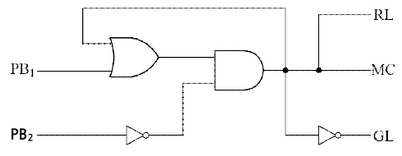

(1) 다음 회로도를 직접 완성하시오.

[정답]

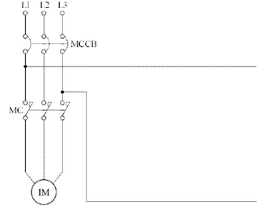

(2) MC, GL, RL에 대한 각각의 논리식을 쓰시오.

[정답]

---

# 정답 해설) 도면완성 / 난이도 中

(1) 회로도 완성

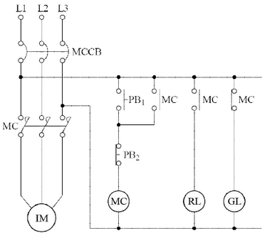

(2) 논리식 완성

[정답]

① $MC = (PB_1 + MC) \cdot \overline{PB_2} $

② $RL = (PB_1 + BC) \cdot \overline{PB_2} = MC $

③ $GL = (PB_1 + MC) \cdot \overline{PB_2} = MC $

부분점수

| 점수  | 세부기준                                             |
| ----- | ---------------------------------------------------- |
| 6점   | (1), (2)번이 모두 맞은 경우 6점 획득                 |
| 3점   | (1)번이 정답과 모두 일치하는 경우 3점 획득           |
| 3~0점 | (2)번의 총 3개의 소문항 중 맞은 한 문항당 1점씩 획득 |

---

# Q6 정격출력이 11[kW], 역률이 0.8, 효율이 0.85의 3상 유도전동기를 단상 변압기 2대로 V결선하여 운전하려고 한다. 이 경우 단상 변압기 1대의 용량은 몇 [kVA] 이상의 것을 선정하여야 하는지 계산 후 선정하시오. (단, 단상 변압기 표준용량[kVA]은 3, 5, 7.5, 10, 15, 20이다.) [배점: 4점]

[계산과정]

단상 변압기 1대의 용량을 $S_1$[kVA]라 하면, 2대를 사용하므로 총 용량은 $2S_1$[kVA]이다. 3상 유도전동기의 입력전력 $P_{in}$은 다음과 같다.

$$ P*{in} = \frac{P*{out}}{\eta} = \frac{11}{0.85} \approx 12.94[kW] $$

3상 유도전동기의 피상전력 $S_{3\phi}$는 다음과 같다.

$$ S*{3\phi} = \frac{P*{in}}{pf} = \frac{12.94}{0.8} \approx 16.17[kVA] $$

V결선 시 단상 변압기 1대의 피상전력은 3상 피상전력의 1/2이므로,

$$ S*1 = \frac{S*{3\phi}}{2} = \frac{16.17}{2} \approx 8.085[kVA] $$

따라서 단상 변압기 1대의 용량은 8.085[kVA] 이상이어야 한다. 주어진 표준 용량 중 8.085[kVA]보다 큰 값은 10[kVA]이다.

[정답] 10[kVA]

---

## 해설) 단순 계산형 / 난이도 下

정답

[계산과정]

V결선 시 변압기 용량은 다음과 같다.

$$ 변압기 용량 = \frac{11 \times 1}{1 \times 0.85 \times 0.8} = 16.18 [kVA] $$

단상 변압기 2대를 V결선 했을 경우의 출력은 다음과 같다.

$ P_V = \sqrt{3} P_1 = 16.18$ [kVA] 이 식에서 단상 변압기 1대의 용량($P_1$)을 구한다.

$$ P_1 = \frac{16.18}{\sqrt{3}} = 9.34 $$

변압기 표준용량은 10[kVA]로 선정한다.

[정답] 10[kVA] 선정

부분점수

| 점수 | 세부기준                                  |
| ---- | ----------------------------------------- |
| 4점  | 계산과정과 정답이 모두 맞은 경우 4점 획득 |
| 0점  | 계산과정이나 정답에 오류가 있는 경우 0점  |

해설

$$ 변압기 출력[kVA] = 유도전동기 입력[kW] = \frac{\text{유도전동기 입력[kVA]}}{\text{역률} \times \text{효율}} $$

V결선 시 변압기 용량은 단상 변압기 용량의 $\sqrt{3}$ 배인 것을 주의해야 한다.

---

# Q7 다음의 주어진 논리회로의 출력을 입력변수로 나타내고, 이 식을 AND, OR, NOT 소자만의 논리회로로 변환하여 논리식과 논리회로를 그리시오.

[배점: 4점]

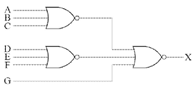

(1) 논리식을 쓰시오.
[정답]

(2) 논리회로를 작성하시오.
[정답]

---

해설) 논리회로 / 난이도 中

정답

$$ (1) X = \overline{(A+B+C) + (D+E+F) + G} = (A+B+C) \cdot (D+E+F) \cdot \overline{G} $$

(2) 논리회로 작성

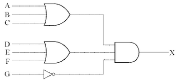

부분점수

| 점수 | 세부기준                                   |
| ---- | ------------------------------------------ |
| 4점  | (1), (2)번이 모두 맞은 경우 4점 획득       |
| 2점  | (1), (2)번 중 한 문항만 맞은 경우 2점 획득 |

---

# Q8 3상 3선식 1회선 배전선로의 말단에 늦은 역률 80[%]인 평형 3상의 집중부하가 있다. 변전소 인출구 전압이 6,600 [V]인 경우 부하의 단자전압을 6,000 [V] 이하로 떨어뜨리지 않기 위해 부하전력은 몇 [kW]로 해야 하는지 계산하시오. (단, 세부기준은 다음 조건을 따른다.) [배점: 4점]

[조건]

- 전선 1가닥당 저항은 1.4 [Ω], 리액턴스는 1.8 [Ω]이다.
- 기타의 선로정수는 무시한다.

[계산과정]

[정답]

---

## 해설) 단순 계산형 / 난이도 중

정답

[계산과정]

$$ e = V_s - V_r = 6,600 - 6,000 = 600 [V] $$

$$ P = \frac{e V_r}{R + X \tan\theta} = \frac{(6,600 - 6,000) \times 6,000}{1.4 + 1.8 \times \frac{0.6}{0.8}} \times 10^{-3} = 1,309.09 [kW] $$

[정답] 1,309.09 [kW]

부분점수

| 점수 | 세부기준                                    |
| ---- | ------------------------------------------- |
| 4점  | 계산과정과 정답에 오류가 없는 경우 4점 획득 |
| 0점  | 계산과정과 정답에 오류가 있는 경우 0점      |

해설

전압강하 공식: $e = \frac{P}{V_r}(R + X \tan\theta) $

전력구하는 식으로 변형하면: $P = \frac{e V_r}{R + X \tan\theta} $

---

# Q9 그림과 같이 완전 확산형의 조명기구가 설치되어 있다. 조명기구의 전광속은 18,500[lm]일 때 다음 물음에 답하시오. [배점: 6점]

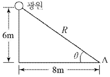

(1) 광원의 광도 [cd]를 계산하시오.

[계산과정]

완전 확산 광원이므로, 광도는 전광속을 4 $\pi$ 로 나눈 값과 같습니다.

$$ I = \frac{\Phi}{4\pi} = \frac{18500}{4\pi} \approx 1472 \, cd $$

[정답] 약 1472 cd

(2) A점에서의 수평면 조도 [lx]를 계산하시오.

[계산과정]

A점과 광원 사이의 거리 R은 피타고라스 정리에 의해 다음과 같이 계산됩니다.

$$ R = \sqrt{6^2 + 8^2} = \sqrt{36 + 64} = \sqrt{100} = 10 \, m $$

조도 E는 다음 공식으로 계산됩니다.

$$ E = \frac{I \cos\theta}{R^2} $$

여기서 $\theta$는 광원에서 A점까지의 선과 수직면 사이의 각도입니다. 그림에서 $\cos\theta = \frac{6}{10} = 0.6$ 입니다.

따라서, A점에서의 수평면 조도는 다음과 같습니다.

$$ E = \frac{1472 \times 0.6}{10^2} = \frac{883.2}{100} = 8.832 \, lx $$

[정답] 약 8.83 lx

---

# 정답

해설) 복합 계산형 / 난이도 中

(1) 광원의 광도[cd] 계산

[계산과정]

$$ I = \frac{F}{\omega} = \frac{18,500}{4\pi} = 1,472.18 \text{[cd]} $$

[정답] 1,472.18[cd]

(2) A점에서의 수평면 조도[lx] 계산

[계산과정]

$$ E_h = \frac{I}{R^2} \cos(90^\circ - \theta) = \frac{1,472.18}{(\sqrt{6^2 + 8^2})^2} \times \frac{6}{\sqrt{6^2 + 8^2}} = 8.83 \text{[lx]} $$

[정답] 8.83[lx]

## 부분점수

| 점수 | 세부기준                                   |
| ---- | ------------------------------------------ |
| 6점  | (1), (2)번이 모두 맞은 경우 6점 획득       |
| 3점  | (1), (2)번 중 한 문항만 맞은 경우 3점 획득 |

## 해설

광원의 크기보다 10배 이상의 거리에서 광도나 조도를 계산할 때에는 광원을 점광원으로 보고 계산해도 된다.

---

# Q10 다음과 같은 부하에 전력을 공급하기 위한 변압기 용량은 몇 [kVA]로 하여야 하는지 변압기 표준용량에서 선정하시오. [배점: 4점]

조건:

- 종합부하의 역률: 90[%]
- 각 부하군 간의 부등률: 1.35
- 변압기는 최대부하의 15[%] 정도의 여유도를 갖는 용량으로 한다.
- 변압기 표준용량 [kVA]: 100, 150, 200, 300, 500

부하 정보:

| 부하명   | 전등전력 | 일반동력 | 하절기 냉방동력 | 동절기 난방동력 |
| -------- | -------- | -------- | --------------- | --------------- |
| 설비용량 | 100 [kW] | 250 [kW] | 140 [kW]        | 60 [kW]         |
| 수용률   | 70 [%]   | 50 [%]   | 80 [%]          | 60 [%]          |

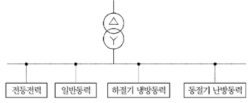

계산과정:

1. 각 부하의 수용률을 고려한 부하량 계산:

- 전등전력: 100[kW] $\times$ 0.7 = 70[kW]
- 일반동력: 250[kW] $\times$ 0.5 = 125[kW]
- 하절기 냉방동력: 140[kW] $\times$ 0.8 = 112[kW]
- 동절기 난방동력: 60[kW] $\times$ 0.6 = 36[kW]

2.  최대 부하량 계산: 70[kW] + 125[kW] + max(112[kW], 36[kW]) = 70 + 125 + 112 = 307[kW]

3.  부등률을 고려한 종합 부하량 계산: 307[kW] $\times$ 1.35 = 414.45[kW]

4.  역률을 고려한 피상전력 계산: 414.45[kW] / 0.9 = 460.5[kVA]

5.  여유도를 고려한 변압기 용량 계산: 460.5[kVA] $\times$ (1 + 0.15) = 529.575[kVA]

6.  표준 용량에서 가장 가까운 값 선택: 500[kVA]

정답: 500 [kVA]

---

# 정답 해설

(난이도: 중) 단순 수식형 문제입니다.

## 계산 과정

변압기의 용량 ($Q_T$)는 다음과 같이 계산됩니다.

$$ Q_T \text{(변압기의 용량)} \ge \frac{(100 \times 0.7 + 250 \times 0.5 + 140 \times 0.8)}{1.35 \times 0.9} \times (1 + 0.15) $$

$$ Q_T = 290.576 \approx 290.58 \text{ [kVA]} $$

## 정답

300[kVA] 선정

## 부분 점수

| 점수 | 세부 기준                                    |
| ---- | -------------------------------------------- |
| 4점  | 계산 과정과 정답이 모두 맞는 경우            |
| 0점  | 정답이 틀리거나 계산 과정에 오류가 있는 경우 |

## 접근 POINT

이 문제는 변압기의 표준 용량 선정 문제입니다. 합성 최대 전력을 구한 후, 그보다 큰 용량을 선택하면 됩니다. 합성 최대 전력은 설비 용량에 수용률을 곱하고, 부등률과 역률로 나눈 후 여유도를 포함하여 계산할 수 있습니다. 이 문제에서는 계절성 설비인 냉방 동력과 난방 동력 중 큰 값만을 계산하면 됩니다.

## 공식 CHECK

$$ 변압기의 용량 \ge 합성 최대 전력 $$

$$ \frac{\sum(\text{설비용량}[kW] \times \text{수용률})}{\text{부등률} \times \text{역률}} \times (1 + \text{여유도}) \text{[kVA]} $$

## 해설

주어진 공식을 통해 구하면 됩니다. 주의할 점은 여유도는 100%에 추가되는 값이므로, 계산할 때는 $(1 + \text{여유도}[\%] / 100)$으로 계산해야 합니다. 이 문제의 경우 여유도는 15%이므로 1.15를 사용하여 계산하면 됩니다.

---

# Q11 다음 그림과 같이 접지저항을 측정하고자 한다. 다음 각 물음에 답하시오. [배점: 6점]

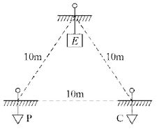

(1) 접지저항을 측정하기 위하여 사용되는 계기 및 측정방법의 명칭을 쓰시오.

[정답]

① 측정 계기:

② 측정방법의 명칭:

(2) 그림과 같이 본 접지 E에 제1보조접지 P, 제2보조접지 C를 설치하여 본 접지 E의 접지 저항값을 측정하려고 한다. 본 접지 E의 접지저항은 몇 [Ω] 인지 계산하시오. (단, 본 접지와 P 사이의 저항값은 86[Ω], 본 접지와 C 사이의 접지 저항값은 92[Ω], P와 C 사이의 접지 저항값은 160[Ω]이다.)
[계산과정]
[정답]

---

# 정답 해설

해설: 단답 암기형+단순 계산형 / 난이도 下

(1) 계기 및 측정방법의 명칭

[정답]

① 측정계기: 어스테스터(접지저항 측정기)

② 측정방법의 명칭: 콜라우시 브리지에 의한 3극 접지저항 측정법

(2) 본 접지 E의 접지저항 [Ω]

[계산과정] $R_E = \frac{1}{2} \times (86 + 92 - 160) = 9 [\Omega] $

[정답] 9[Ω]

부분점수

| 점수 | 세부기준                              |
| ---- | ------------------------------------- |
| 6점  | (1), (2)가 모두 정답인 경우 6점 획득  |
| 3점  | (1), (2) 중 한 문항만 맞으면 3점 획득 |

접근 POINT

응용되어 출제되지 않으므로 기본 개념과 공식을 숙지하면 풀 수 있는 문제이다.

해설

콜라우시 브리지법(접지저항 측정법)

접지저항을 측정하고자 할 경우 두 개의 10[m] 이상 이격된 보조전극을 활용하여 측정하는 방법이다.

① $R*a + R_b = R*{ab} $

② $R*b + R_c = R*{bc} $

③ $R*c + R_a = R*{ca} $

①+②+③을 한다.

$$ 2(R*a + R_b + R_c) = (R*{ab} + R*{bc} + R*{ca}) 에서 $$

$$ 2(R*a + R*{bc}) = (R*{ab} + R*{bc} + R*{ca}) 이 되며, 정리하면 R_a = \frac{1}{2}(R*{ab} + R*{ca} - R*{bc}) $$

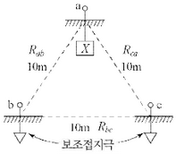

---

---

# Q12 다음 그림과 같은 3상 3선식 배전선로를 보고 물음에 답하시오. (단, 전선 1가닥의 저항은 0.5[Ω/km]라고 한다.) [배점: 6점]

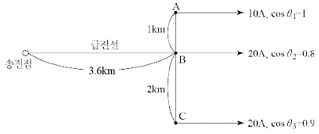

(1) 급전선에 흐르는 전류는 몇 [A]인지 계산하시오.

[계산과정]

[정답]

(2) 전체 선로손실은 몇 [kW]인지 계산하시오.

[계산과정]

[정답]

---

# 정답 해설) 복합 계산형 / 난이도 上

(1) 급전선에 흐르는 전류 [A]

[계산과정]

$$ I = 10 + 20(0.8 - j0.6) + 20(0.9 - j\sqrt{1 - 0.9^2}) $$

$$ = 44 - j20.72 = 48.63\angle{-25.22^\circ} $$

[정답] 48.63 [A]

(2) 전체 선로손실 [kW]

[계산과정]

$$ P_t = 3 \times 48.63^2 \times (0.5 \times 3.6) + 3 \times 10^2 \times (0.5 \times 1) + 3 \times 20^2 \times (0.5 \times 2) $$

$$ = 14,120.34 [W] = 14.12 [kW] $$

[정답] 14.12 [kW]

부분점수

| 점수 | 세부기준                                                    |
| ---- | ----------------------------------------------------------- |
| 6점  | 문항 (1), (2)의 계산과정과 답이 모두 맞은 경우 6점 획득     |
| 3점  | 문항 (1) 또는 (2) 하나의 계산과정과 답이 맞은 경우 3점 획득 |

접근 POINT

역률이 다른 전류나 전력을 합성할 때는 유효분과 무효분으로 나누어서 합성해야 한다.

해설

급전선에는 세 전류의 합성전류가 흐른다.

역률 $\cos\theta$인 지상전류 표현식은 다음과 같다.

$$ I = I(\cos\theta - j\sin\theta) = I(\cos\theta - j\sqrt{1 - \cos^2\theta}) [A] $$

선로 손실식은 다음과 같다.

$$ P_t = 3I^2R = 3\left(\frac{P}{\sqrt{3}V\cos\theta}\right)^2 R = 3\frac{P^2R}{3V^2\cos^2\theta} = \frac{P^2R}{V^2\cos^2\theta} $$

---

# Q13 부하의 역률과 관련된 다음 물음에 답하시오. [배점: 6점]

(1) 역률을 개선하는 원리를 간단히 설명하시오.

[정답]

(2) 부하설비의 역률이 저하하는 경우 수용가가 볼 수 있는 손해를 두 가지 쓰시오.

[정답]

①

②

(3) 어느 공장의 3상 부하가 30[kW]이고, 역률이 65[%]이다. 이것의 역률을 90[%]로 개선하려면 전력용 콘덴서 몇 [kVA]가 필요한지 계산하시오.

[계산과정]

[정답]

---

# 역률 개선

## 정답 및 해설

해설) 서술 암기형+단답 암기형+단순 계산형 / 난이도 중

(1) 유도성 부하를 사용하면 지상 전류가 흐르고 역률이 저하되는데, 이것을 개선하기 위해 부하에 병렬로 콘덴서(용량성)를 설치하여 진상 전류를 흘려 줌으로써 무효전력을 감소시켜 역률을 개선한다.

(2) ① 전력손실 증대, ② 전기요금 증가

(3) 전력용 콘덴서의 용량 계산

[계산과정]

$$ Q_c = 30 \times \left( \frac{\sqrt{1 - 0.65^2}}{0.65} - \frac{\sqrt{1 - 0.9^2}}{0.9} \right) = 20.544 \dots \approx 20.54 [kVA] $$

[정답] 20.54 [kVA]

## 부분점수

| 점수 | 세부기준                                             |
| ---- | ---------------------------------------------------- |
| 6점  | (1), (2), (3)번이 계산과정을 포함하여 모두 맞은 경우 |
| 2점  | (1), (2), (3)번 중 한 문항만 맞으면 2점 획득         |

## 서술형 핵심 KEYWORD

다음 핵심 KEYWORD가 포함되어야 정답 처리된다.

(1) 유도성 부하, 지상 전류, 병렬(진상용, 전력용)콘덴서, 진상 전류, 무효전력 감소

(2) 전력손실, 전기요금

## 접근 POINT

역률 개선의 원리와 개선함으로써 얻어지는 이점이 무엇인지를 아는가를 묻는 문제이며, 실제로 개선 전 역률과 개선 후 역률을 이용하여 필요한 전력용 콘덴서의 용량을 구하기 위해서는 무효전력의 차이를 통해서 구할 수 있다.

## 공식 CHECK

전력용 콘덴서의 용량은 개선 전 무효전력 $Q_1$ 과 개선 후 무효전력 $Q_2$ 의 차

$$ Q_c = Q_1 - Q_2 = P(\tan\theta_1 - \tan\theta_2) = P \left( \frac{\sin\theta_1}{\cos\theta_1} - \frac{\sin\theta_2}{\cos\theta_2} \right) $$

$ Q_c: 전력용 콘덴서의 용량[kVA], P: 부하설비 용량[kW], $
$ \cos\theta_1: 개선 전 역률, \sin\theta_1: 개선 전 무효율, $
$ \cos\theta_2: 개선 후 역률, \sin\theta_2: 개선 후 무효율 $

## 해설

### [역률 개선 원리]

일반적으로 우리가 전기를 이용하여 일을 얻는 대부분의 기기들은 전동기를 사용하며, 전동기는 철심에 코일을 감아서 만들어지므로 유도성 부하(L, 리액터, 코일)이다. 유도성 부하에는 위상이 뒤쳐진 지상 전류가 흐르고 이에 따른 지상 무효전력으로 인해 역률이 저하된다. 이것을 개선하기 위해 부하에 병렬로 콘덴서(용량성)를 설치하여 진상 전류를 흐르게 하고 진상 무효전력을 공급하여 지상 무효전력을 감소시킴으로써 역률을 개선하는 것이다.

전력에는 피상전력 $P_a$[VA], 유효전력 P[W], 무효전력 $P_r$ 또는 Q[var] 3가지가 있는데, 복소수의 개념이 적용되어, $P_a = P + jQ, |P_a| = \sqrt{P^2 + Q^2}$ 가 되며, 직각삼각형을 이용하여 관계를 나타낸다.

$$ 유효전력 P = P_a \cos\theta, 무효전력 Q = P_a \sin\theta, 역률 \cos\theta = \frac{P}{P_a}, 무효율 \sin\theta = \frac{Q}{P_a} $$

### [부하 역률 저하시 수용가의 손해]

피상전력은 한전에서 수용가에 공급하는 전력이며, 유효전력은 수용가에서 실제 일하는 전력이다. 전기요금은 수용가에서 사용한 유효전력량[kWh]에 대한 요금을 내게 되는데, 한전은 수용가의 수변전설비의 역률을 주기적으로 측정하여 시설에서 평균적으로 유지해야 하는 역률의 범위를 지정하고 있다. 만약에 평균보다 월등히 높은 역률을 유지한다면 전기요금에 대한 할인을 낮은 역률을 유지한다면 전기요금에 대한 할증을 적용한다.

일반적인 건물들은 시설관리를 통하여 적당한 역률만을 유지하고 있다. 결국 역률이 저하되는 것은 전력손실이 증대되는 효과와 더불어 적정값보다 낮은 역률이 된다면 전기요금에 대한 할증을 받아 전기요금이 증대된다.

### [전력용 콘덴서의 용량 계산]

무효전력은 개선 전보다 개선 후가 작아지므로 개선 전의 무효전력에서 개선 후의 무효전력을 뺀 값으로 정해진다.

$$ Q_c = P(\tan\theta_1 - \tan\theta_2) = P \left( \frac{\sqrt{1 - \cos^2\theta_1}}{\cos\theta_1} - \frac{\sqrt{1 - \cos^2\theta_2}}{\cos\theta_2} \right) $$

---

# Q14 그림과 같은 3상 3선식 220[V]의 수전회로가 있다. 다음 조건을 기준으로 물음에 답하시오. [배점: 5점]

[조건]

- ④는 전열 부하이고, ⓜ은 역률 0.8의 전동기이다.
- 전열 부하의 역률은 1로 본다.

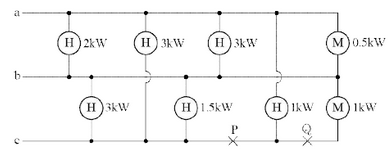

(1) 저압 수전의 3상 3선식 선로인 경우에 설비 불평형률은 몇 [%] 이하로 하여야 하는지 쓰시오.

[정답]

(2) 그림의 설비 불평형률은 몇 [%] 인지 계산하시오. (단, P, Q점은 단선이 아닌 것으로 계산한다.)

[계산과정]

[정답]

(3) P, Q점에서 단선이 되었다면 설비 불평형률은 몇 [%]가 되겠는가?

[계산과정]

---

# 해설) 단순 계산형 / 난이도 下

## 정답

(1) 30[%]

(2) 그림의 설비 불평형률[%] 계산

[계산과정]

$$ 설비 불평형률 = \frac{5.75 - 4}{(5.63 + 5.75 + 4) \times \frac{1}{3}} \times 100 [%] = 34.14 [%] $$

[정답] 34.14[%]

(3) 단선 시 설비 불평형률[%] 계산

[계산과정]

$$ 설비 불평형률 = \frac{5.63 - 3}{(5.63 + 4.5 + 3) \times \frac{1}{3}} \times 100 [%] = 60.09 [%] $$

[정답] 60.09[%]

## 부분점수

| 점수 | 세부기준                                      |
| ---- | --------------------------------------------- |
| 5점  | (1), (2), (3)번이 모두 맞은 경우 5점 획득     |
| 4점  | (2), (3)번은 한 문항이 맞을 때마다 2점씩 획득 |
| 1점  | (1)번이 맞은 경우 1점 획득                    |

## 해설

(1) 3상 3선식의 경우 설비불평형률은 30[%] 이하가 되도록 하여야 한다.

(2) 그림의 설비 불평형률[%] 계산

$$ P*{ab} = \frac{2+3}{1} + \frac{3+0.5}{1} = 5.63 [kVA], P*{bc} = \frac{3}{1} + \frac{1.5}{1} + \frac{1}{0.8} = 5.75 [kVA] $$

$ P*{ca} = \frac{3}{1} + \frac{1}{1} = 4 [kVA]$ 단상부하 최대 $P*{bc}$ 와 최소 $P_{ca}$ 의 차를 분자에 이용

(3) P, Q점에서 단선 후 변경된 회로의 불평형률[%] 계산

$$ P*{ab} = \frac{2+3}{1} + \frac{3+0.5}{1} = 5.63 [kVA] P*{bc} = \frac{3}{1} + \frac{1.5}{1} = 4.5 [kVA] $$

$ P*{ca}$ = 3 [kVA] 단상부하 최대 $P*{ab}$ 와 최소 $P_{ca}$ 의 차를 분자에 이용

---

# Q15 다음은 수전설비 계통도의 도면을 보고 물음에 답하시오. [배점: 12점]

(1) 다음 계통도를 완성하시오.

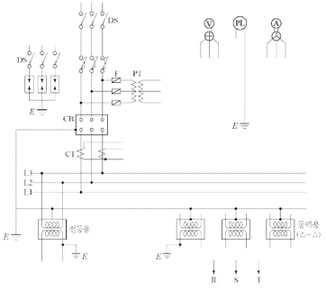

(2) 통전 중에 있는 변류기 2차 측 기기를 교체하고자 할 때 가장 먼저 취하여야 할 조치사항과 그 이유를 쓰시오.

[정답]

- **조치사항:**
- 이유:

(3) 인입 개폐기 DS로 많이 쓰는 기기의 명칭과 약호를 쓰시오.

- **명칭:**
- 약호:

(4) CB를 진공차단기(VCB)로 적용하고 몰드변압기를 사용하는 경우 보호기기와 설치 위치를 쓰시오.

- **적용하여야 하는 보호기기:**
- 보호기기 설치 위치:

---

# 정답 해설

(1) 계통도 완성

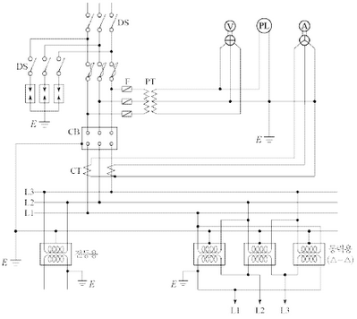

(2) 변류기 2차 측 기기를 교체할 경우

- **조치사항:** 2차 측을 단락한다.
- **이유:** 2차 측을 개방하면 1차 측의 부하전류가 모두 여자전류가 되어 변류기 2차 측의 고전압을 유기하여 절연파괴로 이어지기 때문이다.

(3) 인입 개폐기 DS로 많이 쓰는 기기의 명칭과 약호

- **명칭:** 자동 고장 구분 개폐기
- **약호:** ASS

(4) 몰드변압기를 사용하는 경우 보호기기와 설치위치

- **적용하여야 하는 보호기기:** 서지흡수기
- **보호기기 설치 위치:** 진공차단기의 후단과 몰드변압기의 1차 측 사이

부분점수

| 점수 | 세부기준                                                 |
| ---- | -------------------------------------------------------- |
| 12점 | (1), (2), (3), (4)번이 모두 맞은 경우 12점 획득          |
| 3점  | (1), (2), (3), (4)번 중 한 문항이 맞을 때마다 3점씩 획득 |

---

# Q16 다음은 통상적인 단락, 지락 보호에 쓰이는 방식으로서 주 보호와 후비 보호의 기능을 지니고 있는 도면이다. 다음 물음에 답하시오. [배점: 15점]

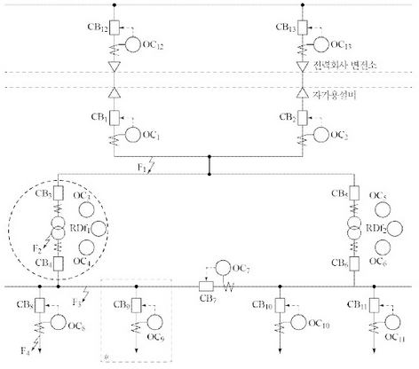

(1) 사고점이 $F_1, F_2, F_3, F_4$ 라고 할 때 주 보호와 후비 보호에 대한 다음 표의 ( ) 안을 채우시오.

| 사고점 | 주 보호                       | 후비 보호                     |
| ------ | ----------------------------- | ----------------------------- |
| $F_1$  | $OC_1 + CB_1 And OC_2 + CB_2$ | $OC_1 + CB_1 And OC_2 + CB_2$ |
| $F_2$  | $OC_3 + CB_3 And OC_4 + CB_4$ | $OC_1 + CB_1 And OC_2 + CB_2$ |
| $F_3$  | $OC_4 + CB_4 And OC_7 + CB_7$ | $OC_3 + CB_3 And OC_6 + CB_6$ |
| $F_4$  | $OC_8 + CB_8$                 | $OC_4 + CB_4 And OC_7 + CB_7$ |

[정답]
①~④ (표에 기입)

(2) 그림은 도면의 \*표 부분을 좀 더 상세하게 나타낸 도면이다. 각 부분 ①~④에 대한 명칭을 쓰고, 보호 기능 구성상 ⑤~⑦의 부분을 검출부, 판정부, 동작부로 나누어 작성하시오.

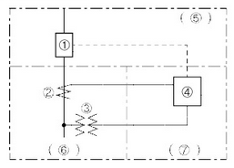

[정답]

① ( )

② ( )

③ ( )

④ ( )

⑤ 검출부

⑥ 판정부

⑦ 동작부

(3) 답란의 그림 $F_2$ 사고와 관련된 검출부, 판정부, 동작부의 도면을 완성하시오. 단, 질문 “(2)”의 도면을 참고하시오.

[정답]

(4) 자가용 전기설비에 발전시설이 구비되어 있을 경우 자가용 수용가에 설치되어야 할 계전기를 세 가지 쓰시오.

[정답]

① ( )

② ( )

③ ( )

---

# 정답 및 해설

해설: 단답 암기형 + 도면 완성 / 난이도 상

(1) 괄호 넣기

[정답]

① $OC*{12} + CB*{12} And OC*{13} + CB*{13} $

② $RDF_1 + OC_4 + CB_4 And OC_3 + CB_3 $

(2) 명칭 작성

[정답]

① 교류 차단기, ② 변류기, ③ 계기용 변압기, ④ 과전류 계전기, ⑤ 동작부, ⑥ 검출부, ⑦ 판정부

(3) 도면 완성

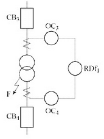

(4) 수용가에 설치해야 할 계전기

[정답]

① 과전류 계전기

② 과전압 계전기

③ 부족전압 계전기

④ 주파수 계전기

⑤ 비율차동 계전기

## 부분 점수

| 점수  | 세부 기준                                                               |
| ----- | ----------------------------------------------------------------------- |
| 15점  | (1)~(4)번이 모두 맞은 경우 15점 획득                                    |
| 4~0점 | 문항 (1)의 소문항 ①, ② 정답 하나당 부분점수 2점씩 부여                  |
| 5~0점 | 문항 (2)의 정답 개수가 1~2개면 1점, 3~4개면 2점, 5~6개면 4점, 7개면 5점 |
| 3점   | 문항 (3)의 단선도가 정답이면 3점, 오류가 있으면 0점                     |
| 3~0점 | 문항 (4)의 정답 개수당 1점씩 부분점수 획득                              |

## 접근 POINT

주보호와 후비보호의 개념에 관한 문제이다.

주보호는 사고 발생 시 가장 먼저 고장을 제거하는 시스템으로서 사고점과 전원측 사이에 위치한 가장 인접한 계전기와 차단기가 수행한다. 후비보호는 주보호가 차단에 실패하였을 때 일정 시간 경과 후 고장을 제거할 수 있는 백업(Back-up) 시스템을 의미하고 이는 보호협조의 원리가 된다.

## 해설

[보호계전기의 목적]

① 전력 공급 신뢰도 향상, ② 고장 파급 방지, ③ 사고복구 신속화

[보호계전 시스템의 구성]

① 검출부: 전력계통의 전압, 전류의 전기적 상태를 검출하는 역할 (CT, PT를 이용하여 검출)

② 판정부: 검출부에서 검출한 전기적 상태를 통해 계통의 이상여부 판정

③ 동작부: 판정부의 신호에 의해 사고구간을 분리 및 제거

[주보호와 후비 보호]

① 주보호의 정의: 사고 발생 시 고장구간을 최소범위로 한정하고 제거하기 위한 1차적 보호 방식

② 후비보호의 정의: 주보호가 실패했을 경우 또는 보호할 수 없을 경우에 일정한 시간을 두고 동작하는 백업 계전 방식

---
