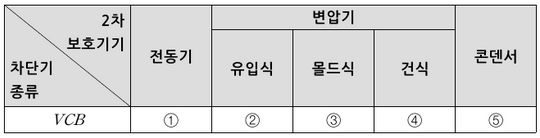
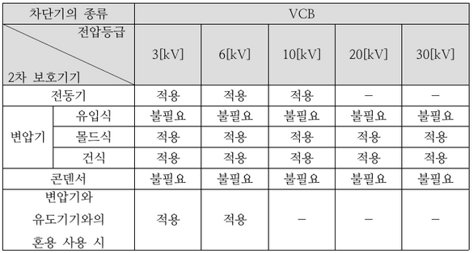
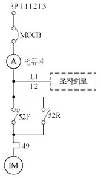
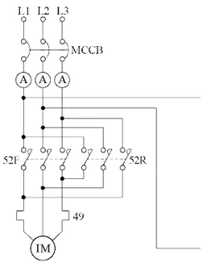
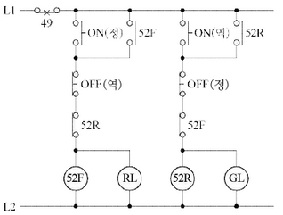
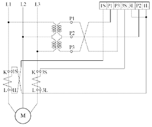
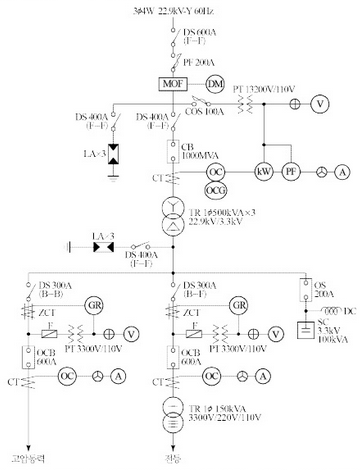
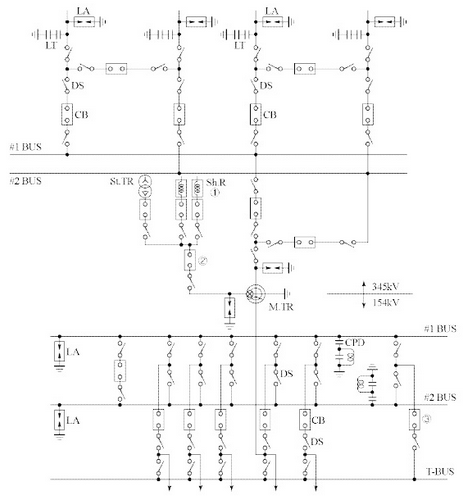
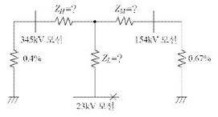

# Q1 계전기의 동작에 필요한 지락 시의 영상전류 검출방법 3가지[배점: 5점]

[정답]

①

②

③

---

# 해설) 단답 암기형 / 난이도 下

## 정답

1. Y결선의 잔류 회로 이용법
2. 영상 변류기 이용법
3. 3권선 CT 이용법

## 부분점수

| 점수 | 세부기준                        |
| ---- | ------------------------------- |
| 5점  | 3개가 모두 정답인 경우 5점 획득 |
| 3점  | 2개가 정답인 경우 3점 획득      |
| 1점  | 1개가 정답인 경우 1점 획득      |

## 해설

지락 시의 영상 전류 검출방법 구분

1. 비접지 계통: ZCT
2. 저항접지, 직접접지, 다중접지 계통

- Y 결선의 잔류 회로 이용법
- 3권선 CT 이용법(영상분로방식)
- 중성선 CT에 의한 검출법

---

# Q2 다음은 분전반 설치에 관한 내용이다. ( ) 안에 들어갈 내용을 번호대로 정답란에 작성하시오. [배점: 6점]

1. 공급범위

(1) 분전반은 각 층마다 설치한다.

(2) 분전반은 분기회로의 길이의 최대 (①) [m] 이하가 되도록 설계하며, 사무실 용도인 경우 하나의 분전반에 담당하는 면적은 일반적으로 1,000[m³] 내외로 한다.

2. 예비회로

(1) 1개 분전반 또는 개폐기함 내에 설치할 수 있는 과전류 장치는 예비회로 (10[%] ~ 20[%])를 포함하여 42개 이하(주개폐기 제외)로 한다.

(2) 회로가 많은 경우는 2개 분전반으로 분리하거나 (②) 으로 한다. 다만, 2극, 3극 배선용 차단기는 과전류 장치 소자 수량의 합계로 계산한다.

3. 분전반의 설치 높이

(1) 일반적으로 분전반 상단을 기준으로 하여 바닥 위 (③) [m]로 한다.

(2) 크기가 작은 경우는 분전반의 중간을 기준 하여 바닥 위 (④) [m]로 하거나 하단을 기준하여 바닥 위 (⑤) [m] 정도로 한다.

4. 안전성 확보

(1) 분전반과 분전반은 도어의 열림 반경 이상으로 이격한다.

(2) 2개 이상의 전원이 하나의 분전반에 수용되는 경우에는 각각의 전원 사이에 해당하는 분전반과 동일한 재질로 (⑥)을 설치해야 한다.

[정답]

①

②

③

④

⑤

⑥

---

해설) 단답 암기형 / 난이도 下

정답

① 30

② 자립형

③ 1.8

④ 1.4

⑤ 1

⑥ 격벽

부분점수

| 점수    | 세부기준                         |
| ------- | -------------------------------- |
| 6점~0점 | 한 문항을 맞힐 때마다 1점씩 획득 |

---

# Q3 다음은 서지보호기의 시설 적용을 나타낸 표이다. 빈 칸에 알맞은 말을 쓰시오. (단, 전압 등급은 10[kV] 이하이고, 빈칸에 들어갈 말은 적용 또는 불필요 중 하나로 작성한다.) [배점: 5점]

[정답]

①

②

③

④

⑤

---

# 해설) 단답 암기형 / 난이도 중

정답

1. 적용
2. 불필요
3. 적용
4. 적용
5. 불필요

부분점수

| 점수    | 세부기준                         |
| ------- | -------------------------------- |
| 5점~0점 | 한 문항을 맞힐 때마다 1점씩 획득 |

해설

차단기의 종류 및 전압등급에 따른 2차 보호기기 적용 여부는 아래 표와 같습니다.

---

# Q4 가공전선로와 비교한 지중전선로의 장점과 단점을 각각 3가지씩 쓰시오. [배점: 6점]

(1) 장점을 3가지 작성하시오.

[정답]

1.
2.
3.

(2) 단점을 3가지 작성하시오.

[정답]

1.
2.
3.

---

# 정답 해설

해설) 단답 암기형 / 난이도 下

(1) 지중 전선로의 장점

[정답]

1. 다수의 회선을 같은 루트에 시설이 가능하다.
2. 지하시설로 설비 보안 유지가 용이하다.
3. 비바람이나 낙뢰 등 기상 조건에 영향을 받지 않는다.
4. 유도장해가 경감된다.

(2) 지중 전선로의 단점

[정답]

1. 같은 굵기의 도체로는 송전용량이 작다.
2. 고장점 발견이 어렵고, 복구가 어렵다.
3. 설비 구성상 신규 수용에 대한 탄력성이 결여된다.
4. 건설비가 아주 비싸다. (비경제적임)

부분점수

| 점수  | 세부기준                                                         |
| ----- | ---------------------------------------------------------------- |
| 6점   | (1),(2)번이 모두 맞는 경우 6점 획득                              |
| 3~0점 | (1),(2)번 문항당 총 4개 중 정답 4개 3점, 3~2개 2점, 1개 1점 획득 |

접근 POINT

지중선의 장점과 단점을 가공선과 비교하여 적는 단순 암기형 문제이다. 가공선보다는 지중선의 장단점을 묻는 문제가 출제빈도가 높으나 2가지를 비교 정리하며 학습해야 한다.

해설

가공 전선로의 특성

| 구분     | 가공전선로                                  |
| -------- | ------------------------------------------- |
| 계통구성 | 수지상방식, 연계방식, 예비선 절체방식       |
| 공급능력 | 동일 경로 4회선 이상 곤란, 전력공급한계     |
| 건설비   | 지중설비에 비해 경제적                      |
| 건설기간 | 단기간                                      |
| 외부영향 | 기상 조건에 따라 전력선 접촉사고 가능       |
| 고장형태 | 수목 접촉 등 순간 및 영구 사고              |
| 고장복구 | 고장점 발견과 복구가 용이                   |
| 유지보수 | 설비의 지상 노출로 보수 업무 많음           |
| 유도장해 | 유도 장해 발생                              |
| 송전용량 | 발생열의 냉각이 수월해 송전용량 높음        |
| 안전도   | 충전부의 노출로 적정 이격거리 확보가 필요함 |
| 설비보안 | 지상 노출로 설비 보안 유지 곤란             |
| 환경미화 | 도심 환경 저해 요인                         |
| 신규수용 | 신규 수요에 신속 대처 가능                  |
| 이미지   | 전통적 전력 설비, 위험설비                  |

---

# Q5 감리원은 전력시설물 공사감리업무 수행지침에 의해 설계도서 등에 대하여 공사계약문에서 상호 간의 모순되는 사항, 현장 실정과의 부합 여부 등 현장 시공을 주안으로 하여 해당 공사 시작 전에 검토하여야 한다. 이때 검토내용에 포함되어야 하는 사항을 3가지 쓰시오. [배점: 5점]

[정답]

1.
2.
3.

---

# 정답 해설

(해설) 서술 암기형 / 난이도 중

1. 현장 조건에 부합 여부
2. 시공의 실제 가능 여부
3. 다른 사업 또는 다른 공정과의 상호부합 여부

## 부분 점수

| 점수 | 세부 기준                         |
| ---- | --------------------------------- |
| 5점  | 3문항이 모두 정답인 경우 5점 획득 |
| 3점  | 2문항이 정답인 경우 3점 획득      |
| 2점  | 1문항이 정답인 경우 2점 획득      |

## 해설

[전력시설물 공사감리업무 수행지침] 제8조 설계도서 등의 검토

감리원은 설계도서 등에 대하여 공사계약문서 상호 간의 모순되는 사항, 현장 실정과의 부합 여부 등 현장 시공을 주안으로 하여 해당 공사 시작 전에 검토하여야 하며 검토 내용에는 다음 각 호의 사항 등이 포함되어야 한다.

1. 현장 조건에 부합 여부
2. 시공의 실제 가능 여부
3. 다른 사업 또는 다른 공정과의 상호부합 여부
4. 설계도면, 설계설명서, 기술계산서, 산출 내역서 등의 내용에 대한 상호 일치 여부
5. 설계도서의 누락, 오류 등 불명확한 부분의 존재 여부
6. 발주자가 제공한 물량 내역서와 공사업자가 제출한 산출 내역서의 수량 일치 여부
7. 시공상의 예상 문제점 및 대책

---

# Q6 다음 도면은 유도전동기 IM의 정회전 및 역회전 운전과 관련된 단선 결선도이다. 이 도면을 보고 다음 물음에 답하시오. (단, 52F는 정회전용 전자 접촉기이고, 52R은 역회전용 전자 접촉기이다.) [배점: 8점]

(1) 주어진 단선 결선도를 이용하여 3선 결선도를 그리시오. (단, 점선 내의 조작 회로는 제외한다.)

[정답]

---

## 정답 해설) 도면완성 / 난이도 中

(1) 3선 결선도 작성

(2) 조작회로 작성

| 점수 | 세부기준                                |
| ---- | --------------------------------------- |
| 8점  | (1), (2)번이 모두 맞은 경우 8점 획득    |
| 4점  | (1), (2)번 중 하나만 맞은 경우 4점 획득 |

---

# Q7 CT의 비오차와 관련된 다음 물음에 답하시오. [배점: 5점]

(1) 비오차에 대하여 간단히 설명하시오.

[정답]

(2) 비오차 관계식을 쓰시오. (단, $\epsilon$: 비오차(%), $K_n$: 공칭 변류비, K: 실제 변류비이다.)

[정답]

---

해설) 서술 암기형+단답 암기형 / 난이도 下

정답

(1) 비오차는 공칭변류비와 측정변류비 사이에서 얻어진 백분율 오차로, CT가 얼마나 정밀한지는 나타내는 용어이다.

(2) $\epsilon = \frac{K_n - K}{K} \times 100[\%] $

부분점수

| 점수 | 세부기준                                |
| ---- | --------------------------------------- |
| 5점  | (1), (2) 문항이 모두 맞은 경우 5점 획득 |
| 3점  | (1)번만 맞은 경우 3점 획득              |
| 2점  | (2)번만 맞은 경우 2점 획득              |

해설

$$ 비오차 = \frac{공칭변류비 - 측정변류비}{측정변류비} \times 100[\%] $$

---

# Q8 고압 수전의 수용가에서 3상 4선식 교류 380[V], 50[kVA] 부하가 수용가 설비의 인입구로부터 기기까지 270[m] 거리만큼 떨어져 설치되어 있다. 바람직한 허용 전압강하는 얼마이며, 이 경우 배전용 케이블의 최소 굵기는 얼마로 하여야 하는지 선정하시오. (단, 케이블은 IEC 규격 6, 10, 16, 25, 35, 50 [mm^2]에 의한다.) [배점: 5점]

(1) 허용 전압강하 [V]를 계산하시오.

[계산과정]

[정답]

(2) 케이블의 굵기 [$mm^2$]를 계산하여 선정하시오.

[계산과정]

[정답]

---

# 정답 및 해설

(1) 허용 전압강하 계산

[계산과정]

$$ e = 380 \times 0.055 = 20.9 [V] $$

[정답] 20.9 [V]

(2) 케이블의 굵기 계산

[계산과정]

부하전류 I 계산

$$ I = \frac{50 \times 10^3}{\sqrt{3} \times 380} = 75.967 [A] $$

전선 굵기 A 계산

$$ A = \frac{17.8 \times 270 \times 75.967}{1000 \times 220 \times 0.055} = 30.173 [mm^2] \to 35 [mm^2] 선정 $$

[정답] 35 [mm²]

## 부분점수

| 점수 | 세부기준                                                         |
| ---- | ---------------------------------------------------------------- |
| 5점  | (1), (2)번이 모두 정답인 경우 5점 획득                           |
| 2점  | 문항 (1)의 계산과정과 답이 모두 맞는 경우 2점, 오류가 있으면 0점 |
| 3점  | 문항 (2)의 계산과정과 답이 모두 맞는 경우 3점, 오류가 있으면 0점 |

## 접근 POINT

전기 방식에 맞는 전압강하 계산식을 적용해야 한다. 이때 주의해야 할 점은 3상 4선식이나 단상 3선식에서 전압강하를 고려할 때는 상전압(e = 220 [V])을 적용해야 한다.

## 해설

[송·수전단 전압강하식]

$$ \Delta e = E_s - E_r = K_D I (R \cos \theta + X \sin \theta) \times L [V] $$

$K_D$: 배전방식에 따른 계수

(단상 2선식: 2, 3상 3선식: $\sqrt{3}$, 단상 3선식, 3상 4선식: 1)

L: 전선 1본의 길이 [m], I: 부하전류 [A],

A: 전선의 단면적 [mm²]

[저압 배선 전압강하 계산식]

$$ \Delta e = \frac{K \times I \times L}{1000 \times A} [V] $$

K: 전압강하 계수

(단상 2선식: 35.6, 3상 3선식: 30.8, 단상 3선식, 3상 4선식: 17.8)

L: 전선 1본의 길이 [m], I: 부하전류 [A],

A: 전선의 단면적 [mm²]

전압강하 계산식은 저압 배선에서 쓰이는 식이다.

원식 $E_s - E_r = \sqrt{3} I (R \cos \theta + X \sin \theta)$ 에서 저압 배선은 구리선을 사용하고 역률은 1이라고 생각한다. 따라서 전압강하식은 $E_s - E_r = \sqrt{3} IR$ 이 된다.

$ R = \rho \frac{l}{A}$ 에서 $\rho = \frac{1}{58} \times \frac{100}{97} = \frac{17.8}{1000} [\Omega/mm^2] $

즉 $R = \frac{17.8}{1000} \times \frac{l}{A} $가 된다.

전기 방식별로 표로 정리하면 아래와 같다.

| 전기방식   | 전압강하 [V]               | 전선단면적                 |
| ---------- | -------------------------- | -------------------------- |
| 단상 3선식 | $e = \frac{17.8LI}{1000A}$ | $A = \frac{17.8LI}{1000e}$ |
| 3상 4선식  | $e = \frac{17.8LI}{1000A}$ | $A = \frac{17.8LI}{1000e}$ |
| 단상 2선식 | $e = \frac{35.6LI}{1000A}$ | $A = \frac{35.6LI}{1000e}$ |
| 직류 2선식 | $e = \frac{30.8LI}{1000A}$ | $A = \frac{30.8LI}{1000e}$ |
| 3상 3선식  | $e = \frac{30.8LI}{1000A}$ | $A = \frac{30.8LI}{1000e}$ |

※ 3상 4선식의 전선 굵기 계산 시 유의점은 다음과 같다. $A = \frac{17.8LI}{1000e}$ 에서 e는 항상 상전압 (220[V])을 적용한다.

[수용가 설비의 전압강하 (KEC 232.3.9)]

380[V] 저압으로 수전하므로 전압강하 5[%]를 적용한다.

100[m]를 넘는 전압강하 증가분은 다음과 같다.

$ \Delta e = 170 \times 0.055 = 0.85$ [%] 로서, 0.5[%]를 초과하므로 증가분은 0.5[%]를 적용한다.

· 총 전압강하 = 5[%] + 0.5[%] = 5.5[%]

| 설비의 유형                     | 조명 [%] | 기타 [%] |
| ------------------------------- | -------- | -------- |
| A - 저압으로 수전하는 경우      | 3        | 5        |
| B - 고압 이상으로 수전하는 경우 | 6        | 8        |

가능한 한 최종회로 내의 전압강하가 A 유형의 값을 넘지 않도록 하는 것이 바람직하다.

사용자의 배선설비가 100m를 넘는 부분의 전압강하는 미터당 0.005%를 증가할 수 있으나 이러한 증가분은 0.5%를 넘지 않아야 한다.

---

# Q9 전압이 22,900[V], 주파수가 60[Hz], 1회선의 3상 지중 송전선로가 있다. 이 경우 3상 무부하 충전전류[A]와 충전용량[kVA]을 계산하시오. (단, 송전선의 선로길이는 7[km], 케이블 1선당 작용 정전용량은 0.4[µF/km]이다.) [배점: 6점]

(1) 충전전류[A]를 계산하시오.

[계산과정]

[정답]

(2) 충전용량[kVA]를 계산하시오.

[계산과정]

[정답]

---

# 정답 해설) 단순 계산형 / 난이도 下

## (1) 충전전류[A] 계산

[계산과정]

$$ I_c = \omega CE = 2\pi f C \frac{V}{\sqrt{3}} = 2 \times \pi \times 60 \times (0.4 \times 10^{-6} \times 7) \times \frac{22,900}{\sqrt{3}} \approx 13.96 [A] $$

[정답] 13.96[A]

## (2) 충전용량[kVA] 계산

[계산과정]

$$ Q = 3\omega CE^2 = \omega CV^2 = 2\pi \times 60 \times (0.4 \times 10^{-6} \times 7) \times 22,900^2 \times 10^{-3} \approx 553.55 [kVA] $$

[정답] 553.55[kVA]

## 부분점수

| 점수 | 세부기준                                |
| ---- | --------------------------------------- |
| 6점  | (1), (2)번이 모두 맞은 경우 6점 획득    |
| 3점  | (1), (2)번 중 하나만 맞은 경우 3점 획득 |

## 해설

기본공식만 알면 풀 수 있는 문제로 다음 공식을 암기해야 한다.

[충전전류 공식]

$ I_c = \omega CE = 2\pi f C \times \frac{V}{\sqrt{3}}$ [A] (3상)

[충전용량 공식]

$$ Q_c = 3\omega CE^2 = \sqrt{3} VI_c = \sqrt{3} V (\omega CE) = \sqrt{3} V \times (2\pi f C \times \frac{V}{\sqrt{3}}) = 2\pi f CV^2 [VA] $$

---

# Q10 고압 동력 부하의 사용 전력량을 측정하려고 한다. CT 및 PT 부착 3상 적산 전력량계를 그림과 같이 오결선(1S와 1L 및 P1과 P3가 바뀜)하였고, 어느 기간 동안 사용 전력량이 3,000[kWh] 이었다. 그 기간 동안의 실제 사용 전력량은 몇 [kWh]이 되는지 계산하시오. (단, 부하 역률은 0.8이다.) [배점: 5점]

[계산과정]

[정답]

---

# 정답 해설

해설) 복합 계산형 / 난이도 中

## [계산과정]

정상 결선 시 유효전력량은 다음과 같다.

$W = Pt = \sqrt{3} V_L I_L \cos\theta $

오결선 시 유효전력량은 다음과 같다.

$W' = P't = 2V_L I_L \sin\theta = 3,000 [kWh] $

$$ \frac{V_L I_L t}{2 \times \sin\theta} = \frac{3000}{2 \times 0.6} = 2,500 [kWh] (\sin\theta = \sqrt{1 - \cos^2\theta} = \sqrt{1 - 0.8^2} = 0.6) $$

$$ \therefore W = Pt = \sqrt{3} V_L I_L \cos\theta = \sqrt{3} \times 2,500 \times 0.8 \approx 3,464.10 [kWh] $$

## [정답] 3,464.10 [kWh]

## 부분점수

| 점수 | 세부기준                                  |
| ---- | ----------------------------------------- |
| 5점  | 계산과정과 정답이 모두 맞은 경우 5점 획득 |
| 0점  | 계산과정이나 정답에 오류가 있는 경우 0점  |

## 해설

다음과 같은 방법으로 풀 수도 있다.

$W' = W_1 + W_2 = 2V_L I_L \sin\theta$ 이다.

$$ V_L I_L = \frac{W_1 + W_2}{2\sin\theta} = \frac{3000}{2 \times 0.6} = 1500 $$

실제 사용 전력량은 다음과 같이 구할 수 있다.

$$ W = \sqrt{3} V_L I_L \cos\theta = \sqrt{3} \times \frac{1500}{0.6} \times 0.8 = 3,464.10 [kWh] $$

---

# Q11 변압기가 $\frac{3300}{\sqrt{3}} / \frac{110}{\sqrt{3}}$ [V]인 GPT의 오픈델타(Open-\Delta) 결선에서 1상이 완전 지락이 되었다. 이 경우 나타나는 영상전압은 몇 [V]인지 계산하시오.

[배점: 4점]

[계산과정]

[정답]

---

해설) 단순 계산형 / 난이도 下

정답

[계산과정]

오픈-△(델타) 결선에서 어느 한 상이 완전 지락사고가 발생하면 3배의 영상전압이 나타난다.

영상 전압 $3V_0 = 3 \times \frac{110}{\sqrt{3}} = 110\sqrt{3} \approx 190.53$ [V]

[정답] $100\sqrt{3} 또는 190.53[V] $

부분점수

| 점수 | 세부기준                                  |
| ---- | ----------------------------------------- |
| 4점  | 계산과정과 정답이 모두 맞은 경우 4점 획득 |
| 0점  | 계산과정이나 정답에 오류가 있는 경우 0점  |

해설

1선 지락 시 GPT 2차 측에 나타나는 전압은 정상상태에서 GPT 2차 측에 나타나는 전압($\frac{110}{\sqrt{3}}$)의 3배 전압이 나타나게 된다. 만약 어느 한 상에서 완전 지락사고가 발생했다면 오픈-△(델타) 결선에는 다음과 같이 3배의 영상전압이 나타난다.

$$ V_0 + V_0 + V_0 = 3V_0 $$

---

서술형 7점

# Q12 다음과 같은 축전지에 대한 물음에 답하시오. [배점: 7점]

(1) 축전지의 과방전 및 방치상태, 가벼운 설페이션(Sulfation) 현상 등이 생겼을 때, 기능 회복을 위해 실시하는 충전 방식은 무엇인지 쓰시오.

[정답]

(2) 연축전지의 공칭 전압은 2.0 [V/cell] 이다. 알칼리 축전지의 공칭전압은 몇 [V/cell]인지 쓰시오.

[정답]

(3) 부하의 최저전압이 직류 115 [V] 이고, 축전지와 부하 사이의 전압강하가 5[V]일 때 직렬로 접속된 축전지의 수가 55개라면 축전지 한 조(cell) 당 최저전압은 몇 [V] 인지 계산하시오.

[계산과정]

[정답]

(4) 묽은 황산의 농도는 표준이고, 액면이 저하하여 극판이 노출되어 있는 경우 어떤 조치를 하여야 하는지 쓰시오.

[정답]

---

# 해설) 단말 알기능+단순 계산형 / 나이토 中

경험

(1) 회복충전 (또는 균형충전)

(2) 1.2[V]

(3) 충전지 한 조(cell)당 최적전압[V] 계산

[계산과정]

$$ 하용 최적 전압 = \frac{115 + 5}{5} = 2.18[V] $$

[결합] 2.18[V/cell]

(4) 균은 완산 또는 중류수를 보충하여 국면이 노출되지 않도록 한다.

부분점수

| 점수  | 세부기준                                             |
| ----- | ---------------------------------------------------- |
| 7점   | (1), (2), (3), (4)번이 모두 정답인 경우 7점 획득     |
| 2~0점 | (1), (2)번이 정답일 경우 한 문항마다 1점씩 획득      |
| 3점   | (3) 문항의 계산과정과 정답이 모두 맞는 경우 3점 획득 |
| 2점   | (4) 문항이 정답인 경우 2점 획득                      |

해설

하용 최적전압 = 부하의 하용 최적전압 + 충전지와 부하 사이의 전압강하 +셀수

[회복충전]

정류 충전법에 의하여 약한 전류로 40~50시간 충전시킨 후 방전시키고, 다시 충전시킨 후 방전시킨다. 이와 같은 동작을 여러 번 반복하면 본래의 출력용량을 회복하게 되는데 이러한 충전방법을 회복충전이라고 한다.

[연속전지와 알칼리 충전지의 비교]

| 구분                          | 연속전지    | 알칼리 충전지 |
| ----------------------------- | ----------- | ------------- |
| 공칭전압                      | 2.0[V/cell] | 1.2[V/cell]   |
| 과충, 방전에 대한 전기적 강도 | 약하다      | 강하다        |
| 수명                          | 짧다        | 길다          |

---

# Q13 차도 폭이 20[m]인 도로에 250[W] 메탈할라이드 램프와 10[m] 등주(폴)를 양 측에 대칭배열로 설치하여 조도를 22.5[lx]로 유지하고자 한다. 다음 조건을 기준으로 물음에 답하시오. [배점: 6점]

- 조명률: 0.5
- 감광보상률: 1.5
- 250[W] 메탈할라이드 램프의 광속: 20,000[lm]

(1) 등주간격을 계산하시오.

[계산과정]

[정답]

(2) 운전자의 눈부심 방지를 위하여 등기구를 컷-오프(Cut-off)형으로 선정할 경우 이 도로의 등주간격을 계산하시오.

[계산과정]

[정답]

(3) 보수율을 계산하시오.

[계산과정]

[정답]

---

# 정답 및 해설

해설: 복합 계산형 / 난이도 상

(1) 등주간격 계산

- **계산과정**:

$$ S = \frac{2 \times 20,000 \times 0.5 \times 1}{22.5 \times 20 \times 1.5} = 29.629 \dots \approx 29.63 [m] $$

- **정답**: 29.63[m]

(2) 등기구를 컷-오프(Cut-off)형(마주보기 배열)로 선정할 경우 등주간격 계산

- **계산과정**:

$$ S \le 3 \times 10 = 30 [m] $$

- **정답**: 30[m] 이하

(3) 보수율 계산

- **계산과정**:

$$ 보수율 = \frac{1}{1.5} = 0.666 \dots \approx 0.67 $$

- **정답**: 0.67

부분점수

| 점수  | 세부기준                                                                 |
| ----- | ------------------------------------------------------------------------ |
| 6~0점 | 소문항 (1), (2), (3)의 계산과정과 정답이 모두 맞는 경우 1문항당 2점 획득 |

접근 POINT

조명과 관련된 문제로서 도로에 가로등을 설치하는 경우에 설계 능력이 있는지를 물어보는 문제이다. 기본적인 조명공식을 암기하고 도로에 적용할 때 추가되는 내용들을 관련지어 암기하여 문제를 해결하면 된다.

공식 CHECK

- **광속[Luminous Flux: F [lm] (루멘)]**: 방사속 중에서 사람의 눈이 시감하게 하는 것
- **광도[Luminous intensity: I [cd](칸델라)]**: 발산광속의 입체각 밀도 $I = \frac{F}{\omega}$
- **휘도(Illuminance)**: 광도의 밀도, 눈부심의 정도
- **조도[Illumination, E [lx] (룩스)]**: 어떤 면에 광속의 밀도, 반사체의 밝기 $E = \frac{F}{A}$

입체각: $\omega = 2\pi(1 - \cos\theta)$

$ I = \frac{F}{\omega} = \frac{F}{2\pi(1 - \cos\theta)}, F = 2\pi(1 - \cos\theta)I, E = \frac{F}{A} = \frac{2\pi(1 - \cos\theta)I}{\pi r^2}$

- **조명률**: 작업면에 도달한 광속의 비율 U = $ \frac{F_s}{F} $
(여기서, U: 조명률, $F_s$: 조명 목적면에 도달한 광속, F: 램프의 발산광속)

* **실지수(Room Index)**: $RI = \frac{XY}{H(X+Y)} $
  (X: 방의 가로길이, Y: 방의 세로길이, H: 광원으로부터 작업면까지 높이)

- **평균조도 계산식: ZCM(Zonal Cavit Method)법**
  $$ FUN = EAD, D = \frac{1}{M}, N = \frac{EAD}{FU} = \frac{EA}{FUM}, E = \frac{FUNM}{AD} = \frac{FUNM}{A} $$

  (E[lx]: 평균조도, F[lm]: 램프 1개당 광속, N[개]: 램프 개수, U: 조명률, M: 보수율, D(Depreciation factor): 감광보상률, A: 방의 면적)

광원의 최대간격: $S \le \frac{1}{2}H$

등과 벽사이 간격: $S \le \frac{1}{2}H$, 만약, 벽측 사용할 경우에는 $S \le \frac{1}{3}H$

(1) 등주간격 계산

양측 대칭배열이므로 조명면적 $A = \frac{1}{2}BS$를 적용한다.

$$ FUN = EAD, FUN = \frac{EBSD}{2}, S = \frac{2FU}{EBD} $$

$$ S = \frac{2 \times 20,000 \times 0.5}{22.5 \times 20 \times 1.5} = 29.629 \dots \approx 29.63 [m] $$

(2) 등기구를 컷-오프(Cut-off)형으로 선정할 경우 등주 간격 계산

등기구가 컷오프형(마주보기 배열)인 경우 등주의 간격은 3H 이하이다.

$$ S \le 3H = 3 \times 10 = 30 [m] $$

(3) 보수율 계산

보수율(M) = $\frac{1}{감광보상률(D)}$ 로 보수율과 감광보상률은 역수관계이다.

$$ M = \frac{1}{D} = \frac{1}{1.5} = 0.666 \dots \approx 0.67 $$

---

# Q14 다음은 어느 수용가의 수변전 설비도이다. 설비도를 보고 다음 각 물음에 알맞은 답을 쓰시오. [배점: 14점]

(1) 22.9[kV] 측의 DS의 정격전압을 쓰시오. (단, 계산과정을 생략하고 답만 쓰시오.)

[정답]

(2) MOF의 역할을 쓰시오.

[정답]

(3) PF의 역할을 쓰시오.

[정답]

(4) 22.9[kV]의 LA 정격전압을 쓰시오.

[정답]

(5) MOF에 연결되어 있는 DM의 명칭을 쓰시오.

[정답]

(6) 하나의 전압계로 3상의 상전압이나 선간전압을 측정할 수 있는 스위치를 약호로 쓰시오.

[정답]

(7) 하나의 전류계로 3상의 전류를 측정할 수 있는 스위치를 약호로 쓰시오.

[정답]

(8) CB의 역할을 간단히 설명하시오.

[정답]

(9) 3.3[kV] 측의 ZCT의 역할을 간단히 설명하시오.

[정답]

(10) ZCT에 연결되어 있는 GR의 역할을 간단히 설명하시오.

[정답]

(11) SC의 역할을 간단히 설명하시오.

[정답]

(12) OS의 명칭을 쓰시오.

[정답]

(13) 3.3[kV] 측의 CB에서 600[A]는 무엇을 의미하는지 쓰시오.

[정답]

---

# 단답 암기형+서술 암기형 문제 풀이

## 정답 및 해설

(1) 25.8[kV]

(2) 전력량을 적산하기 위해 고전압을 저전압으로, 대전류를 소전류로 변성

(3) 부하전류는 안전하게 통전시키며, 단락전류를 차단하여 전로나 기기를 보호

(4) 18[kV]

(5) 최대 수요 전력량계

(6) VS

(7) AS

(8) 부하전류의 개폐 및 고장전류의 차단

(9) 지락사고 시 지락(영상)전류를 검출

(10) 영상전류에 의해 동작하며, 임계치 이상이 되면 차단기 동작신호 출력

(11) 진상 무효전력을 공급하여 부하의 역률 개선

(12) 유입개폐기

(13) 차단기의 정격전류

## 부분점수

| 점수     | 세부기준                                                       |
| -------- | -------------------------------------------------------------- |
| 14점     | (1)~(13)번이 모두 맞은 경우 14점 획득                          |
| 2점      | (10)번이 맞은 경우 2점 획득                                    |
| 12점~0점 | (10)번을 제외하고 나머지 문항은 1문항이 맞을 때마다 1점씩 획득 |

## 서술형 핵심 KEYWORD

(2) 전력량 적산, 고전압, 저전압, 대전류, 소전류

(3) 단락전류, 고장전류

(8) 사고전류 차단, 부하전류 개폐

(9) 지락사고, 영상전류

(10) 영상전류, 차단기 동작신호 출력

## 접근 POINT

정격전압, 명칭, 약호를 묻는 문제는 내용을 이해하기보다는 암기를 통해 정확한 답을 써야 하고, 기기 역할을 묻는 문제는 핵심 KEYWORD를 포함하여 정답을 작성하는 연습을 해야 한다.

## 수변전 설비의 명칭, 약호 및 역할

| 명칭                     | 약호 | 역할                                                                                                                                                                                         |
| ------------------------ | ---- | -------------------------------------------------------------------------------------------------------------------------------------------------------------------------------------------- |
| 케이블 헤드              | CH   | 가공전선과 케이블의 단말(종단) 접속                                                                                                                                                          |
| 단로기                   | DS   | 무부하 전류의 개폐, 회로의 접속 변경, 기기를 전로로부터 개방                                                                                                                                 |
| 피뢰기                   | LA   | 뇌전류를 대지로 방전시키고 속류 차단                                                                                                                                                         |
| 전력퓨즈                 | PF   | 단락전류의 차단 및 부하전류의 통전                                                                                                                                                           |
| 컷아웃스위치             | COS  | 기계 기구(변압기)를 과전류로부터 보호                                                                                                                                                        |
| 교류 차단기              | CB   | 부하전류의 개폐 및 고장전류의 차단                                                                                                                                                           |
| 트립코일                 | TC   | 보호계전기 신호에 의해 차단기 개로                                                                                                                                                           |
| 전력수급용 계기용 변성기 | MOF  | 전력량을 적산하기 위해 고전압을 저전압으로, 대전류를 소전류로 변성                                                                                                                           |
| 계기용 변류기            | CT   | 대전류를 소전류로 변성                                                                                                                                                                       |
| 계기용 변압기            | PT   | 고전압을 저전압으로 변성                                                                                                                                                                     |
| 영상 변류기              | ZCT  | 지락(영상)전류의 검출                                                                                                                                                                        |
| 접지 계전기              | GR   | 영상전류에 의해 동작하며, 차단기 트립코일 여자                                                                                                                                               |
| 과전류계전기             | OCR  | 과전류에 의해 동작하며, 차단기 트립코일 여자                                                                                                                                                 |
| 전압계용 전환 개폐기     | VS   | 1대의 전압계로 3상 전압을 측정하기 위하여 사용하는 전환 개폐기                                                                                                                               |
| 전류계용 전환 개폐기     | AS   | 1대의 전류계로 3상 전류를 측정하기 위하여 사용하는 전환 개폐기                                                                                                                               |
| 전력용 콘덴서            | SC   | 진상 무효전력을 공급하여 역률 개선                                                                                                                                                           |
| 직렬 리액터              | SR   | 제5고조파 제거                                                                                                                                                                               |
| 라인 스위치              | LS   | 3상 동시 개폐, 충전전류 개폐 가능, 부하전류는 개폐 불가능                                                                                                                                    |
| 고장구간자동개폐기       | ASS  | 부하상태에서 동작, 과부하 보호기능                                                                                                                                                           |
| 자동부하전환개폐기       | ALTS | 낙뢰가 빈번한 지역, 공단선로, 수용가 선로 등 이중전원을 확보하여 주전원 정전시 또는 전압이 기준값 이하로 떨어질 경우 예비전원으로 자동 절환되어 수용가가 계속 일정한 전원공급을 받을 수 있음 |

---

# Q15 다음 도면은 345[kV] 변전소의 단선도와 변전소에 사용되는 주요 제원을 나타낸 것이다. 다음 각 물음에 답하시오. [배점: 13점]

[주변압기]

단권 변압기

345[kV]/154[kV]/23[kV](Y-Y-Δ)

166.7 [MVA] × 3대 ≒ 500 [MVA]

OLTC부 %임피던스(500[MVA] 기준)

1차~2차: 10[%]

1차~3차: 78[%]

2차~3차: 67[%]

[차단기]

362[kV] GCB 25 [GVA] 4,000[A]~2,000[A]

170[kV] GCB 15[GVA] 4,000[A]~2,000[A]

25.8 [kV] VCB () [MVA] 2,500 [A] ~1,200 [A]

[단로기]

362[kV] DS 4,000 [A]~2,000[A]

170[kV] DS 4,000[A]~2,000[A]

25.8 [kV] DS 2,500[A]~1,200 [A]

[피뢰기]

288[kV] LA 10[kA]

144[kV] LA 10[kA]

21 [kV] LA 10[kA]

[분로 리액터]

23[kV] Sh.R 30[Mvar]

[주모선]

$$ A1 - Tube 200φ $$

(1) 도면의 345[kV] 측 모선방식은 어떤 방식인지 쓰시오.

[정답]

(2) 도면에서 ①번 기기의 설치목적을 쓰시오.

[정답]

(3) 도면에 주어진 제원을 참조하여 주변압기에 대한 등가 %임피던스 $(Z*{H}, Z*{M}, Z_{L})$를 구하고, ②번 23[kV] VCB의 차단용량을 계산하시오. (단, 다음 그림의 임피던스 회로는 기준용량 100[MVA]이다.)

[계산과정]

[정답]

(4) 도면의 345[kV] GCB에 내장된 계전기용 BCT의 오차 계급은 C800이다. 이때 부담은 몇 [VA]인지 구하시오.

[계산과정]

[정답]

(5) 도면에서 ③번 기기의 설치목적을 쓰시오.
[정답]

(6) 주변압기 1Bank(단상 × 3대)를 증설하여 병렬운전을 하고자 한다. 이때 병렬운전을 할 수 있는 조건을 4가지 쓰시오.

[정답]
①
②
③
④

---

# 단답 암기형+서술 암기형+복합 계산형

(1) 2중 모선 방식

(2) 페란티 현상 방지

(3) 등가 %임피던스와 VCB 차단용량 계산

① 등가 %임피던스

[계산과정]

500[MVA] 기준 %임피던스로 변환한다.

1차~2차 $Z*{HM} = 10$ [%], 2차~3차 $Z*{ML}$ = 67 [%], 1차~3차 $Z_{HL}$ = 78 [%]

100[MVA] 기준으로 환산한다.

$ Z*{HM} = 10 \times \frac{100}{500} = 2 [\%], Z*{ML} = 67 \times \frac{100}{500} = 13.4 [\%], Z\_{HL} = 78 \times \frac{100}{500} = 15.6 [\%] $

등가 임피던스는

$$ \%Z*H = \frac{1}{2}(Z*{HM} + Z*{HL} - Z*{ML}) = \frac{1}{2}(2 + 15.6 - 13.4) = 2.1 [\%] $$

$$ \%Z*M = \frac{1}{2}(Z*{HM} + Z*{ML} - Z*{HL}) = \frac{1}{2}(2 + 13.4 - 15.6) = -0.1 [\%] $$

$$ \%Z*L = \frac{1}{2}(Z*{ML} + Z*{HL} - Z*{HM}) = \frac{1}{2}(13.4 + 15.6 - 2) = 13.5 [\%] $$

[정답] $\%Z_H: 2.1[\%], \%Z_M: -0.1[\%], \%Z_L: 13.5[\%] $

② 23 [kV] VCB 차단용량

[계산과정]

23[kV] VCB 설치점까지 전체 임피던스를 계산한다.

$$ \%Z = (2.1 + 0.4) \times (-0.1 + 0.67) + 13.5 = 13.96 [\%] $$

$$ 단락전류 I_s = \frac{100}{13.96} \times \sqrt{\frac{100}{3 \times 23}} [kA] = 17.98 [kA] (: 100 [MVA] 기준) $$

$$ 차단용량 = \sqrt{3} \times 25.8 [kV] \times 17.98 [kA] = 803.47 [MVA] $$

[정답] 차단용량 : 803.47[MVA]

(4) 오차계급이 C800일 때 부담 계산

[계산과정]

오차 계급이 C800일 때, 임피던스는 8[Ω]이고, CT 2차 측 전류는 5[A]이다.

$$ I_Z = 5^2 \times 8 = 200 [VA] $$

[정답] 200[VA]

(5) 선로 점검 시 무정전으로 점검하기 위해 사용한다.

(6) 변압기 병렬운전 조건

[정답]

① 극성 및 권수비가 같을 것

② 1, 2차 정격 전압이 같을 것

③ %임피던스강하가 같을 것

④ 변압기 내부 저항과 리액턴스의 비가 같을 것

부분점수

| 점수 | 세부기준                                                                                    |
| ---- | ------------------------------------------------------------------------------------------- |
| 13점 | (1)~(6)이 모두 맞은 경우 13점 획득                                                          |
| 6점  | (3)번이 모두 맞은 경우 6점 획득, 등가 임피던스와 VCB 차단용량 중 한 개만 맞은 경우 3점 획득 |
| 3점  | (6)번이 모두 맞은 경우 3점 획득, 1~2개가 정답인 경우 1점, 3개가 정답인 경우 2점 획득        |
| 4점  | (1), (2), (4), (5)은 1문제를 맞힐 때마다 1점씩 획득                                         |

해설

단락비 $K = \frac{I_s}{I_n} = \frac{100}{\%Z} = \frac{P_s}{P_n}$,

단락전류 $I_s = \frac{100}{\%Z} \times I_n [A] $

차단기의 차단용량 $P\_{CB} = \sqrt{3} V_s I_s [VA] $

---
