# Q1 가스절연 변전소의 특징을 5가지 쓰시오. (단, 경제적이거나 비용에 관한 답은 제외한다.) [배점: 5점]

[정답]

①

②

③

④

⑤

---

# 해설) 서술 암기형 / 난이도 중

## 정답

1. 절연 매질로 SF6 가스를 사용한다.
2. 설치 면적이 작다.
3. 밀폐구조로 감전 사고가 적다.
4. 기후의 영향을 받지 않는다.
5. 사고 시 위치 파악이 어렵다.

## 부분점수

| 점수    | 세부기준                         |
| ------- | -------------------------------- |
| 5점~0점 | 한 문항이 맞을 때마다 1점씩 획득 |

---

# Q2 내선규정에 따라 다음의 설치장소별 적용조건에 따른 피뢰기의 공칭 방전전류 [A]를 쓰시오. [배점: 6점]

(1) 다음과 같은 조건을 가진 변전소

- 154[kV] 이상의 계통
- 66[kV] 및 그 이하의 계통에서 뱅크용량이 3,000[kVA]를 초과하거나 특히 중요한 곳
- 장거리 송전선 케이블(배전선로 인출용 단거리 케이블은 제외)
- 배전선로 인출 측(배전 간선 인출용 장거리 케이블은 제외)

[정답]

(2) 변전소로 66[kV] 및 그 이하 계통에서 Bank 용량이 3,000[kVA] 이하인 곳

[정답]

(3) 배전선로

[정답]

---

# 해설) 단답 암기형 / 난이도 下

정답

(1) 10,000[A]

(2) 5,000[A]

(3) 2,500[A]

부분점수

| 점수 | 세부기준                                          |
| ---- | ------------------------------------------------- |
| 6점  | (1), (2), (3)번이 모두 맞은 경우 6점 획득         |
| 2점  | (1), (2), (3)번 중 한 문항이 맞을 때마다 2점 획득 |

해설

| 공칭 방전전류 | 설치장소 | 조건                                                                                                                                                                                                                                         |
| ------------- | -------- | -------------------------------------------------------------------------------------------------------------------------------------------------------------------------------------------------------------------------------------------- |
| 10,000[A]     | 변전소   | ・154[kV] 이상의 계통   ・66[kV] 및 그 이하의 계통에서 뱅크용량이 3,000[kVA]를 초과하거나 특히 중요한 곳   ・장거리 송전선 케이블(배전선로 인출용 단거리 케이블은 제외)   ・배전선로 인출 측(배전 간선 인출용 장거리 케이블은 제외) |
| 5,000[A]      | 변전소   | 66[kV] 및 그 이하에서 Bank 용량이 3,000[kVA] 이하인 곳                                                                                                                                                                                       |
| 2,500[A]      | 선로     | 배전선로                                                                                                                                                                                                                                     |

---

# Q3 다음에 제시된 그림은 변압기의 단락시험 회로이다. 빈칸에 알맞은 답을 쓰시오. [배점: 8점]

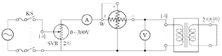

(1) KS 투입 전 유도 전압 조정기의 핸들은 ①에 위치시켜야 한다.

[정답]
①

(2) 시험용 변압기의 2차 측을 단락한 상태에서 슬라이닥스를 조정하여 1차 측 단락전류가 ②와 같게 흐를 때의 1차측 단자전압을 임피던스 전압이라고 한다. 이때 교류 전력계의 지시값을 ③이라고 한다.

[정답]
②

(3) %임피던스 $= \frac{\text{교류 전압계의 지시값}}{(4)} \times 100 $

[정답]
④

---

# 해설) 단답 암기형 / 난이도 下

## 정답

(1) 0[V]

(2) 1차 정격전류

(3) 임피던스 와트

(4) 1차 정격전압

## 부분점수

| 점수 | 세부기준                                               |
| ---- | ------------------------------------------------------ |
| 8점  | (1), (2), (3), (4)번이 모두 맞은 경우 8점 획득         |
| 2점  | (1), (2), (3), (4)번 중 한 문항이 맞을 때마다 2점 획득 |

---

# Q4 다음과 같은 PLC 프로그램을 보고 물음에 답하시오. [배점: 6점]

① LOAD: 입력 A접점(신호)

② LOAD NOT: 입력 B접점(신호)

③ AND: AND A 접점

④ AND NOT: AND B 접점

⑤ OR: OR A 접점

⑥ OR NOT: OR B 접점

⑦ OB: 병렬접속점

⑧ OUT: 출력

| STEP | 명령    | 번지 |
| ---- | ------- | ---- |
| 0    | LOAD    | P000 |
| 1    | OR      | P010 |
| 2    | AND NOT | P001 |
| 3    | AND NOT | P002 |
| 4    | OUT     | P010 |

(1) 미완성 PLC 래더 다이어그램을 직접 완성하시오.

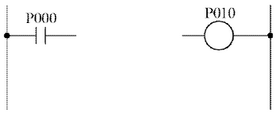

(2) 무접점 논리회로로 바꾸어 그리시오.

---

# 해설) 도면 작성 / 난이도 中

## 정답

(1) 미완성 PLC 래더 다이어그램 완성

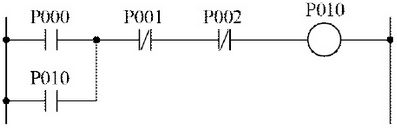

(2) 무접점 논리회로

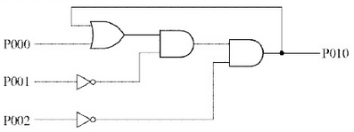

## 부분점수

| 점수 | 세부기준                                     |
| ---- | -------------------------------------------- |
| 6점  | (1), (2) 문항이 모두 정답인 경우 6점 획득    |
| 3점  | (1), (2)번 중 한 문항만 정답일 경우 3점 획득 |

## 접근 POINT

시퀀스 제어회로 관련 PLC 프로그램 언어와 래더 다이어그램을 이용하여 무접점 논리회로로 변환하는 문제이다. 반대로 무접점 논리회로를 PLC 래더 다이어그램이나 프로그램 언어로도 변환이 가능하도록 연습해야 한다.

## 해설

PLC(Programmable Logic Controller) 프로그램을 "래더 다이어그램"으로 변환

LOAD P000: 처음 입력으로 P000의 a접점을 연결한다.

OR P010: 앞의 입력에 병렬로 P010의 a접점을 연결한다.

AND NOT P001: 앞의 입력에 직렬로 P001의 b접점을 연결한다.

AND NOT P002: 앞의 입력에 직렬로 P002의 b접점을 연결한다.

OUT P010: 앞의 입력에 직렬로 출력 P010을 연결한다.

PLC(Programmable Logic Controller) 프로그램을 "무접점 논리회로"로 변환

1단계: (1)에서 구한 PLC 래더도를 논리식으로 변환

$$ P010 = (P000 + P010) \cdot \overline{P001} \cdot \overline{P002} $$

2단계: 1단계에서 구한 논리식을 논리회로로 변환한다. 여기서 주의할 점은 출력 P010이 입력으로도 사용되었는데 이것은 출력이 다시 입력으로 피드백(Feedback)된 것이다.

---

# Q5 그림은 고압 전동기 100[HP] 미만을 사용하는 고압 수전 설비 결선도이다. 이 그림을 보고 다음 각 물음에 답하시오. [배점: 13점]

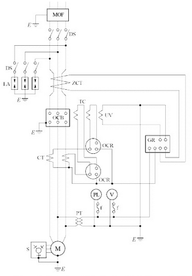

(1) 계전기용 변류기는 차단기의 전원 측에 설치하는 것이 바람직한 이유를 쓰시오.
[정답]

(2) 본 도면에서 생략할 수 있는 부분을 쓰시오.
[정답]

(3) 진상 콘덴서에 연결하는 방전코일의 설치목적을 쓰시오.
[정답]

(4) 도면에서 다음의 명칭을 각각 쓰시오.
[정답]

- ZCT:
- TC:

---

## 정답

해설) 단순 암기형 / 난이도 中

(1) 보호범위를 넓히기 위해서이다.

(2) LA용 DS

(3) 콘덴서에 축적된 잔류전하를 방전하다.

(4) 도면에서 명칭 쓰기

- ZCT : 영상변류기
- TC : 트립코일

## 부분점수

| 점수    | 세부기준                                            |
| ------- | --------------------------------------------------- |
| 13점    | (1), (2), (3), (4)번이 모두 맞은 경우 13점 획득     |
| 3점     | (1)번이 맞으면 3점 획득                             |
| 3점     | (2)번이 맞으면 3점 획득                             |
| 3점     | (3)번이 맞으면 3점 획득                             |
| 4점~2점 | (4)번이 모두 맞으면 4점 획득, 1개만 맞으면 2점 획득 |

---

# Q6 다음과 같이 50[kW], 30[kW], 15[kW], 25[kW] 부하설비에 수용률이 각각 50[%], 65[%], 75[%], 60[%]로 할 경우 변압기 용량은 몇 [kVA]가 필요한지 다음 표준용량 표에서 선정하시오. (단, 부등률은 1.2, 종합 부하 역률은 80[%]이다.) [배점: 5점]

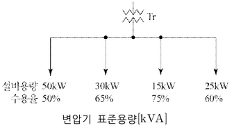

변압기 표준용량 [kVA]

| 25  | 30  | 50  | 75  | 100 | 150 |
| --- | --- | --- | --- | --- | --- |

[계산과정]

[정답]

---

해설) 단순 계산형 / 난이도 下

정답

[계산과정]

$$ 변압기 용량 ≥ 합성 최대 전력 = \frac{\text{설비용량} \times \text{수용률}}{\text{부등률} \times \text{역률}} [kVA] $$

$$ 변압기 용량 = \frac{50 \times 0.5 + 30 \times 0.65 + 15 \times 0.75 + 25 \times 0.6}{1.2 \times 0.8} = 73.69 $$

[정답] 75[kVA] 선정

부분점수

| 점수 | 세부기준                                  |
| ---- | ----------------------------------------- |
| 5점  | 계산과정과 정답이 모두 맞은 경우 5점 획득 |
| 0점  | 계산과정이나 정답에 오류가 있는 경우 0점  |

---

# Q7 차단기 정격사항에 대하여 주어진 표의 빈칸에 알맞은 답을 쓰시오.[배점: 6점]

| 계통의 공칭전압 [kV] | 정격전압 [kV] | 정격차단시간 [Cycle] |
| -------------------- | ------------- | -------------------- |
| 22.9                 | ①             | ④                    |
| 154                  | ②             | ⑤                    |
| 345                  | ③             | ⑥                    |

[정답]

---

## 해설) 단답 암기형 / 난이도 下

정답

① 25.8, ② 170, ③ 362, ④ 5, ⑤ 3, ⑥ 3

부분점수

| 점수    | 세부기준                       |
| ------- | ------------------------------ |
| 6점~0점 | 1문항이 맞을 때마다 1점씩 획득 |

해설

| 계통의 공칭전압[kV] | 6.6 | 22.9 | 66   | 154 | 345 |
| ------------------- | --- | ---- | ---- | --- | --- |
| 정격전압[kV]        | 7.2 | 25.8 | 72.5 | 170 | 382 |
| 정격차단시간[Cycle] | 5   | 5    | 5    | 3   | 3   |

---

# Q8 선로의 길이가 30[km]인 3상 3선식 2회선 송전선로가 있다. 수전단에 30[kV], 6,000[kW], 역률 0.8의 3상 부하에 공급할 경우 송전손실을 10[%] 이하로 하기 위해서는 전선의 굵기를 얼마로 하여야 하는지 다음 조건을 기준으로 계산하시오. [배점: 5점]

[조건]

- 사용전선의 고유저항은 1/55 [$\Omega \cdot mm^2/m$]이다.

* 전선의 굵기는 2.5, 4, 6, 16, 25, 35, 70, 90[mm²] 이다.

[계산과정]

[정답]

---

해설) 복합 계산형 / 난이도 중

정답

[계산과정]

$$ P_i = 6,000 \times 0.1 \times \frac{1}{2} = 300 \text{ [kW]} $$

$$ R = \frac{P_i V^2 \cos^2 \theta}{p^2} = \frac{(300 \times 10^3) \times (30 \times 10^3)^2 \times 0.8^2}{(3000 \times 10^3)^2} = 19.2 \text{ [Ω]} $$

$$ \therefore A = \frac{1}{55} \times \frac{30 \times 10^3}{19.2} = 28.41 \text{ [mm²]} $$

[정답] 35[mm²] 선정

부분점수

| 점수 | 세부기준                                  |
| ---- | ----------------------------------------- |
| 5점  | 계산과정과 정답이 모두 맞은 경우 5점 획득 |
| 0점  | 계산과정이나 정답에 오류가 있는 경우 0점  |

해설

문제에서 주어진 고유저항의 단위가 [Ω·mm²/m]이기 때문에 전선의 길이는 [m]로, 전선의 단면적은 [mm²] 단위로 계산하여야 하는 것을 주의해야 한다.

1회선당 전력손실 = 2회선의 전력손실 $\times \frac{1}{2} $

---

# Q9 단자전압이 3,000[V]인 선로에 3,000/210[V]인 승압기 2대를 결선하여 40[kW], 역률 0.75인 3상 부하에 전력을 공급하려고 한다. 이때 승압기 1대의 용량은 몇 [kVA]를 사용하여야 하는지 계산하시오. [배점: 5점]

[계산과정]

3상 부하의 피상전력 S는 다음과 같이 계산됩니다.

$$ S = \frac{P}{cos\theta} = \frac{40kW}{0.75} = \frac{160}{3} kVA $$

승압기 2대를 병렬로 연결하면, 각 승압기의 피상전력은 전체 피상전력의 절반이 됩니다. 따라서, 1대의 승압기 용량은 다음과 같습니다.

$$ S\_{single} = \frac{S}{2} = \frac{160}{6} kVA \approx 26.67 kVA $$

따라서, 1대의 승압기는 약 26.67 kVA의 용량을 사용해야 합니다.

[정답] 약 26.67 kVA

---

# 정답 해설

해설) 단순 계산형 / 난이도 中

[계산과정]

승압된 전압 계산

$$ V_h = (1 + \frac{1}{a})V_l = (1 + \frac{1}{3000}) \times 3000 = 3210 [V] $$

자기 용량 = $부하용량 \times \frac{2(V_h - V_l)}{\sqrt{3} V_h} = \frac{40}{0.75} \times \frac{2}{\sqrt{3}} \times \frac{3210 - 3000}{3210} = 4.03 [kVA] $

승압기 1대의 용량 = $\frac{4.03}{2}$ = 2.02 [kVA]

[정답] 2.02[kVA]

부분점수

| 점수 | 세부기준                                  |
| ---- | ----------------------------------------- |
| 5점  | 계산과정과 정답이 모두 맞은 경우 5점 획득 |
| 0점  | 계산과정이나 정답에 오류가 있는 경우 0점  |

해설

단권변압기 V결선(승압용)

변압기 1대의 등가용량: $P_1 = el_2 = (V_2 - V_1)I_2 $

변압기 2대의 등가용량: $P_2 = 2P_1 = 2el_2 = 2(V_2 - V_1)I_2$

3상 부하용량:$ P = \sqrt{3}V_2I_2$

자기용량 =$ \frac{2(V_2 - V_1)I_2}{\sqrt{3}V_2I_2} = \frac{2}{\sqrt{3}} \frac{V_2 - V_1}{V_2} $

---

# Q10 반사율 $\rho$, 투과율 $\tau$, 반지름 r인 완전 확산성 구형 글로브의 중심의 광도 I의 점광원을 켰다고 가정한다. 이때 광속발산도 [$r_lx$]의 계산식을 쓰시오. [배점: 4점]

[정답]

---

# 해설) 단순 계산형 / 난이도 下

## 정답

[정답]

광속 발산도 $R = \frac{I\tau}{r^2(1-\rho)}$ [rlx]

## 부분점수

| 점수 | 세부기준                          |
| ---- | --------------------------------- |
| 4점  | 공식을 정확하게 작성하면 4점 획득 |
| 0점  | 공식에 오류가 있으면 0점          |

## 해설

조도 $E = \frac{I}{r^2} [lx] $

글로브 효율 $\eta = \frac{\tau}{1-\rho}$

I: 광도, $\rho$: 반사율, $\tau$: 투과율, r: 반지름

위 공식을 이용하여 글로브에서의 광속발산도는 다음과 같이 구할 수 있다.

$$ R = \eta E = \frac{\tau}{1-\rho} \cdot \frac{I}{r^2} = \frac{\tau I}{r^2(1-\rho)} [rlx] $$

()

---

# Q11 제3고조파의 유입으로 인한 사고를 방지하기 위하여 콘덴서 회로에 콘덴서 용량의 11[%]인 직렬 리액터를 설치하였다. 이 경우에 콘덴서의 정격전류(정상시 전류)가 10 [A]라면 콘덴서 투입 시의 전류는 몇 [A]가 되는지 계산하시오. [배점: 4점]

[계산과정]

콘덴서의 정격전류(정상시 전류)를 $I_{nom}$ 이라고 하고, 직렬 리액터를 설치한 후의 전류를 I 라고 하자. 직렬 리액터의 용량이 콘덴서 용량의 11%이므로, 리액터의 임피던스는 콘덴서 임피던스의 11%라고 볼 수 있다. 따라서, 전류는 다음과 같이 계산할 수 있다.

$$ I = \frac{I\_{nom}}{\sqrt{1 + (0.11)^2}} = \frac{10}{\sqrt{1 + 0.0121}} \approx \frac{10}{\sqrt{1.0121}} \approx 9.94 [A] $$

따라서, 콘덴서 투입 시의 전류는 약 9.94 [A]가 된다.

[정답]

9.94 [A]

(그림이 없음)

---

# 해설) 단순 계산형 / 난이도 下

## 정답

[계산과정]

콘덴서 투입 시 돌입전류 계산

$$ I = I_c \times \left( 1 + \sqrt{\frac{X_c}{X_L}} \right) = 10 \times \left( 1 + \sqrt{\frac{1}{0.11}} \right) = 40.15 [A] $$

[정답] 40.15[A]

## 부분점수

| 점수 | 세부기준                                 |
| ---- | ---------------------------------------- |
| 4점  | 계산과정과 정답에 오류가 없으면 4점 획득 |
| 0점  | 계산과정과 정답에 오류가 있으면 0점      |

---

# Q12 피뢰기 접지공사를 실시한 후, 접지저항을 보조 접지극 2개 (a와 b)를 시설하여 측정하였다. 그 결과 본 접지와 보조 접지극 a 사이의 저항은 86[Ω], 보조 접지극 a와 보조 접지극 b 사이의 저항은 156[Ω], 보조 접지극 b와 본 접지 사이의 저항은 80[Ω] 이었다. 다음 각 물음에 답하시오. [배점: 6점]

(1) 피뢰기의 접지저항 값[Ω]을 계산하시오.
[계산과정]

[정답]

(2) 접지 공사의 적합 여부를 판단하고, 그 이유를 설명하시오.
[적합여부]

[이유]

---

## 정답 해설

해설) 단순 계산형 + 단답 암기형 / 난이도 中

(1) 피뢰기의 접지저항 값 계산

[계산과정]

$$ R_E = \frac{1}{2} \times (86 + 80 - 156) = 5 [\Omega] $$

[정답] 5[Ω]

(2) 접지공사의 적합 여부 판단

[적합여부] 적합

[이유] 고압 및 특고압에 시설하는 피뢰기의 접지저항은 10[Ω] 이하여야 한다.

### 부분점수

| 점수 | 세부기준                                     |
| ---- | -------------------------------------------- |
| 6점  | (1), (2)번이 모두 정답인 경우 6점 획득       |
| 3점  | (1), (2)번 중 한 문제만 정답인 경우 3점 획득 |

### 해설

$ R*E + R_a = R*{Ea}$ ... ①

$ R*a + R_b = R*{ab}$ ... ②

$ R*b + R_E = R*{bE}$ ... ③

$ (① + ② + ③) × \frac{1}{2}$ 로 계산하면 다음 식이 성립된다.

$$ R*E + R_a + R_b = \frac{1}{2}(R*{Ea} + R*{ab} + R*{bE}) $$

④ - ② 하면 다음 식이 성립된다.

$$ R*E = \frac{1}{2}(R*{Ea} + R*{bE} - R*{ab}) = \frac{1}{2}(86 + 80 - 156) = 5 [\Omega] $$

---

# Q13 어떤 상가 건물의 설비부하가 역률 0.6인 동력 부하 30 [kW], 역률 1인 전열기 24 [kW] 이다. 이때 변압기 용량은 최소 몇 [kVA] 이상이어야 하는지 계산하시오. [배점: 4점]

변압기 표준 용량 [kVA]

| 30  | 50  | 75  | 100 | 150 | 200 | 300 |
| --- | --- | --- | --- | --- | --- | --- |

[계산과정]

[정답]

---

# 정답 해설

해설: 단순 계산형 / 난이도 중

[계산과정]

- 총 유효전력 = 전동기 유효전력 + 전열기 유효전력 = 30[kW] + 24[kW] = 54[kW]
- 총 무효전력 = 전동기 무효전력 = 30[kW] × $\frac{0.8}{0.6}$ = 40[kVar]
- 전체 피상전력 $(P_z) = \sqrt{54^2 + 40^2}$ = 67.2[kVA]
- 표준 용량표에서 75[kVA] 선정

[정답] 75[kVA]

부분점수

| 점수 | 세부기준                                  |
| ---- | ----------------------------------------- |
| 4점  | 계산과정과 정답이 모두 맞은 경우 4점 획득 |
| 0점  | 계산과정과 정답 중 오류가 있는 경우       |

접근 POINT

변압기 용량은 피상전력 [VA]로 표시한다. 따라서 각 부하의 유효전력 [W]과 무효전력 [Var]을 구하여 벡터합으로 부하 피상전력을 구한다.

해설

전열기의 역률이 주어지지 않는 경우 역률은 1로 계산한다. (순수 저항 부하로 간주) 따라서 전체 무효전력 = 전동기의 무효전력이다.

무효전력 = 유효전력 × tanθ = 유효전력 × $\frac{\sqrt{1 - cos^2\theta}}{cos\theta}$ (θ: 역률각)

변압기 용량은 계산값을 초과하는 가장 작은 값으로 표에서 선정한다.

---

# Q14 주어진 조건을 참조하여 다음 각 물음에 답하시오. [배점: 6점]

[조건]

차단기 명판(Name plate)에 BIL 150 [kV], 정격 차단전류 20 [kA], 차단 시간 8사이클, 솔레노이드(Solenoid)형이라고 기재되어 있다. (단, BIL은 절연계급 20호 이상의 비유효 접지계에서 계산하는 것으로 한다.)

(1) BIL이란 무엇인지 쓰시오.

[정답]

(2) 이 차단기의 정격전압은 몇 [kV]인지 계산하시오.

[계산과정]

[정답]

(3) 이 차단기의 정격차단용량은 몇 [MVA]인지 계산하시오.

[계산과정]

[정답]

---

# 정답 해설: 복합 계산형 (난이도 중)

(1) 기준 충격 절연 강도

(2) 차단기의 정격 전압 계산

[계산 과정]

$BIL = \text{절연계급} \times 5 + 50 [kV]$ 에서

$$ \text{절연계급} = \frac{BIL - 50}{5}, \text{절연계급} = \frac{\text{공칭전압}}{1.1} $$

$\text{공칭전압} [kV] = \text{절연계급} \times 1.1$ 이다.

$$ 차단기의 정격전압 V_n = \frac{BIL - 50}{5} \times 1.1 \times \frac{1.2}{1.1} = \frac{150 - 50}{50} \times 1.1 \times \frac{1.2}{1.1} = 24 [kV] $$

[정답] 24 [kV]

(3) 차단기의 정격 차단 용량 계산

[계산 과정]

정격 차단 용량

$$ P_s = \sqrt{3} V_n I_n = \sqrt{3} \times 24 \times 20 = 831.38 [MVA] $$

[정답] 831.38 [MVA]

## 부분 점수

| 점수 | 세부 기준                                         |
| ---- | ------------------------------------------------- |
| 6점  | (1), (2), (3)번이 모두 맞은 경우 6점 획득         |
| 2점  | (1), (2), (3)번 중 한 문제를 맞힐 때마다 2점 획득 |

## 해설

기준 충격 절연 강도 BIL (Basic Impulse Insulation Level)란 기기나 설비 등의 절연이 그 기기에 가해질 것으로 예상하는 충격 전압에 견디는 강도이다. 이 값은 뇌 임펄스 내전압 시험값으로서 절연 레벨의 기준을 정하는 데 적용된다.

$$ BIL = \text{절연계급} \times 5 + 50 [kV] $$

절연 계급은 기기나 설비 등의 절연 강도 계급, 전기 기기의 절연 강도를 표시하는 계급이다.

$$ \text{절연계급} = \frac{\text{공칭전압} [kV]}{1.1} $$

공칭 전압 (Nominal Voltage): 전선로를 대표하는 선간 전압

정격 전압 (Rated Voltage): 기계 기구 선로 등에서 정상적인 동작 상태를 유지할 수 있는 전압

| 차단기의 정격 전압 [kV] | 사용 회로의 공칭 전압 [kV] | BIL [kV] |
| ----------------------- | -------------------------- | -------- |
| 0.6                     | 0.1, 0.2, 0.4              | 45       |
| 3.6                     | 3.3                        | 60       |
| 7.2                     | 6.6                        | 150      |
| 24.0                    | 22.0                       | 350      |
| 72.5                    | 66.0                       | 750      |
| 170                     | 154.0                      |          |

$$ \text{정격전압} = \text{공칭전압} \times \frac{1.2}{1.1} $$

[과전류 차단기 용량]

$$ \text{기준용량} = \sqrt{3} \times \text{공칭전압} \times \text{정격전류} $$

$$ \text{단락용량} = \sqrt{3} \times \text{공칭전압} \times \text{단락전류} = \frac{100}{ \%Z} P_n $$

$$ \text{차단용량} = \sqrt{3} \times \text{정격전압} \times \text{정격차단전류} (여기서, 정격차단전류 ≥ 단락전류) $$

---

# Q15 전압 1.0183[V]를 측정하는데 측정값이 1.0092[V] 이었다. 이 경우의 다음 각 수치를 각각 계산하시오. (단, 정답은 소수점 이하 넷째 자리까지 기입한다.) [배점: 4점]

(1) 오차를 계산하시오.

[계산과정]

오차 = 측정값 - 참값 = 1.0092[V] - 1.0183[V] = -0.0091[V]

[정답] -0.0091[V]

(2) 오차율을 계산하시오.

[계산과정]

$$ 오차율 = \frac{\text{오차}}{\text{참값}} \times 100\% = \frac{-0.0091}{1.0183} \times 100\% \approx -0.893\% $$

[정답] -0.893%

(3) 보정(값)을 계산하시오.

[계산과정]

보정값 = 참값 - 측정값 = 1.0183[V] - 1.0092[V] = 0.0091[V]

[정답] 0.0091[V]

(4) 보정률을 계산하시오.

[계산과정]

$$ 보정률 = \frac{\text{보정값}}{\text{측정값}} \times 100\% = \frac{0.0091}{1.0092} \times 100\% \approx 0.901\% $$

[정답] 0.901%

---

정답 해설) 복합 계산형 / 난이도 下

(1) 오차 계산

[계산과정]

$$ 오차 = 측정값 - 참값 = 1.0092 - 1.0183 = -0.0091 $$

[정답] -0.0091

(2) 오차율 계산

[계산과정]

$$ 오차율 = \frac{오차}{참값} = \frac{-0.0091}{1.0183} = -0.0089 $$

[정답] -0.0089

(3) 보정(값) 계산

[계산과정]

$$ 보정(값) = 참값 - 측정값 = 1.0183 - 1.0092 = 0.0091 $$

[정답] 0.0091

(4) 보정률 계산

[계산과정]

$$ 보정률 = \frac{참값 - 측정값}{측정값} = \frac{0.0091}{1.0092} = 0.0090 $$

[정답] 0.0090

부분점수

| 점수 | 세부기준                       |
| ---- | ------------------------------ |
| 4점  | 1문항을 맞힐 때마다 1점씩 획득 |

해설

다음 공식만 알고 있으면 쉽게 풀 수 있는 문제이다.

참값 = 오차 - 측정값

$$ 오차율 = \frac{측정값 - 참값}{참값} \times 100 [%] $$

보정값 = 참값 - 측정값

$$ 보정률 = \frac{참값 - 측정값}{측정값} \times 100 [%] $$

---

# Q16 다음 그림은 리액터 기동 정지 조작 회로의 미완성 도면이다. 이 도면에 대하여 다음 물음에 답하시오. [배점: 13점]

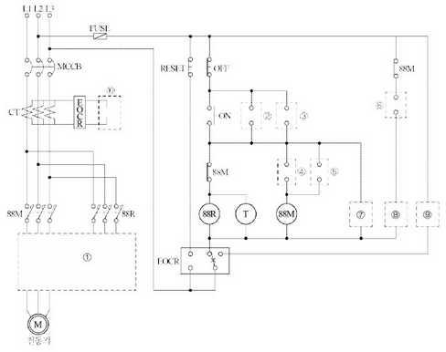

(1) ① 부분의 미완성 주회로를 회로도에 직접 그리시오.

[정답]
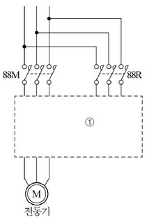

(2) 제어회로에서 ②, ③, ④, ⑤, ⑥ 부분의 접점을 완성하고 그 기호를 쓰시오.

[정답]
| 구분 | ② | ③ | ④ | ⑤ | ⑥ |
|---|---|---|---|---|---|
| 접점 및 기호 | | | | | |

(3) ⑦, ⑧, ⑨, ⑩ 부분에 들어갈 LAMP와 계기의 그림기호를 그리시오.

| 구분     | ⑦   | ⑧   | ⑨   | ⑩   |
| -------- | --- | --- | --- | --- |
| 그림기호 |     |     |     |     |

예시) 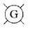: 정지, 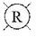: 기동 및 운전, 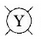: 과부하로 인한 정지

(4) 직입 기동 시 기동전류가 정격전류의 6배가 되는 전동기를 65[%] 탭에서 리액터 기동한 경우 기동전류는 약 몇 배 정도가 되는지 계산하시오.

[계산과정]

[정답]

(5) 직입 기동 시 기동토크가 정격토크의 2배였다고 하면 65[%] 탭에서 리액터 기동한 경우 기동토크는 약 몇 배 정도가 되는지 계산하시오.

[계산과정]

[정답]

---

---

# 해설) 시퀀스 / 난이도 上

## 정답

(1) 미완성 회로도 완성

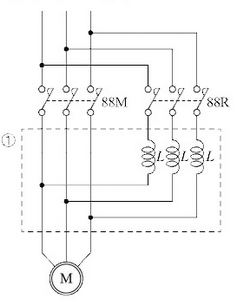

(2) 제어회로의 접점 완성

| 구분         | ②                          | ③                          | ④                          | ⑤                          | ⑥                          |
| ------------ | -------------------------- | -------------------------- | -------------------------- | -------------------------- | -------------------------- |
| 접점 및 기호 | 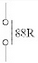 | 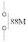 | 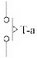 | 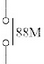 | 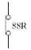 |

(3) LAMP와 계기의 그림기호

| 구분     | ⑦                          | ⑧                          | ⑨                          | ⑩                           |
| -------- | -------------------------- | -------------------------- | -------------------------- | --------------------------- |
| 그림기호 | 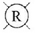 | 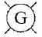 |  |  |

(4) 기동전류 계산

[계산과정]
정격전류를 I\*n 이라 하면 직입기동 시 기동전류 I = $6I_n$

65[%]탭으로 기동하면 기동전류는 전압에 비례해서 $I*{ss}' = 0.65 \times 6I_n = 3.9I_n$ 이 된다.

[정답] $3.9I_n $

(5) 기동토크 계산

[계산과정]
정격토크를 $\tau_n$ 이라 하면 직입기동시 기동토크 $\tau_s = 2\tau_n$

토크는 전압의 제곱에 비례한다.

$$ \tau_s' = (0.65)^2 \times 2\tau_n = 0.85\tau_n $$

$$ [정답] 0.85\tau_n $$

## 부분점수

| 점수  | 세부기준                                                                 |
| ----- | ------------------------------------------------------------------------ |
| 13점  | (1)~(5)번이 모두 맞은 경우 13점 획득                                     |
| 5점   | 문항 (1)의 주회로가 정답이면 4점, 오류가 있으면 0점                      |
| 3~0점 | 문항 (2)의 소문항 5개 중 정답이 0~1개면 0점, 2~3개면 2점, 5개면 3점 부여 |
| 3~0점 | 문항 (3)의 소문항 4개 중 정답이 0~1개면 0점, 2~3개면 2점, 4개면 3점 부여 |
| 2점   | 문항 (4), (5)의 계산과정과 답이 맞으면 각각 1점씩 획득                   |

## 접근 POINT

기동을 위해 PB-ON 시에 88R 계전기가 여자되어 먼저 작동하고 타이머의 설정 시간 후 88M 계전기가 동작하므로 기동용 리액터는 88R 쪽에 직렬로 설치한다. 농형 유도전동기의 경우 권선형 유도전동기처럼 외부 저항을 연결할 수 없기 때문에 전압을 줄여서(감전압) 기동특성을 제어한다. 이때 기동전류는 인가전압에 비례($I_{ss} \propto V$)하고, 기동토크는 인가전압의 제곱에 비례($\tau_s \propto V^2$)한다.

## 해설

[3상 유도전동기 기동법]

① 농형: 직입 기동, Y-△ 기동, 리액터 기동, 기동 보상기법
② 권선형: 2차 저항 기동법, 게르게스 기동법

[리액터 기동법]

① 동작 원리

- 기동시 S1이 투입되면 리액터는 모터와 직렬로 연결되어 기동되며 기동완료(t 초)후 S2가 투입되어 전부하 전류로 운전된다.
- 기동이 완료되고 운전상태에 돌입하면 리액터에는 전류가 흐르지 않는다
  ② 15kW 이상의 대용량 농형 유도전동기에 적용된다.
  ③ 기동 시 모터 앞 단의 리액터와 전동기 내부의 리액터가 직렬로 접속되어 전압 분배가 이루어진다.
  ④ 전 전압의 50%, 65%, 80% 인가되도록 탭을 설정한다.

[그림](./2019_3/32_11.png)

---

$$
$$
