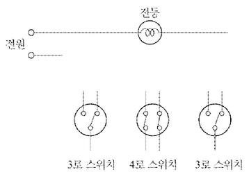
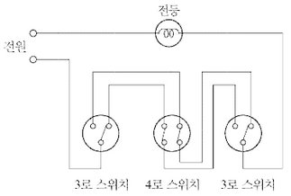
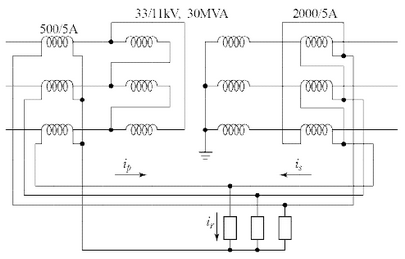
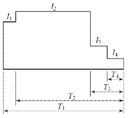
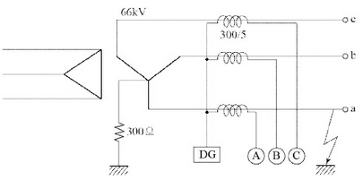
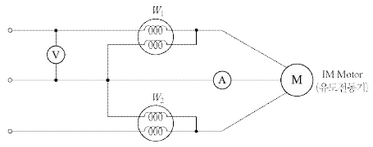
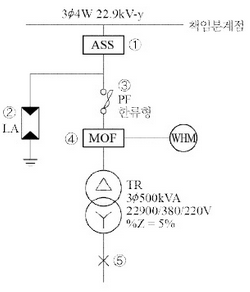
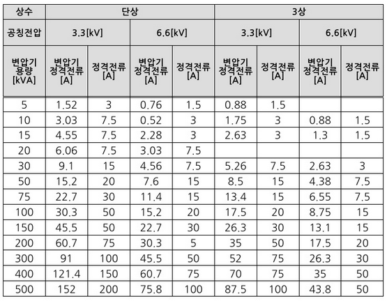
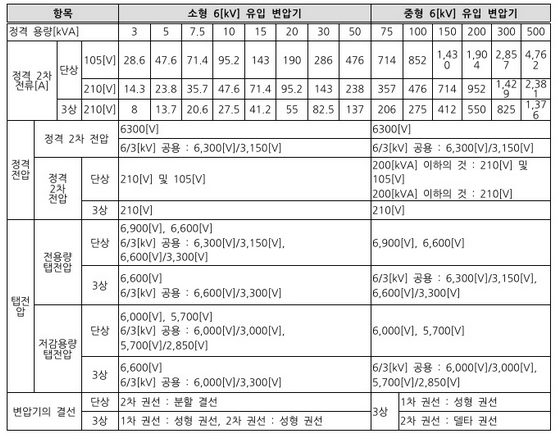
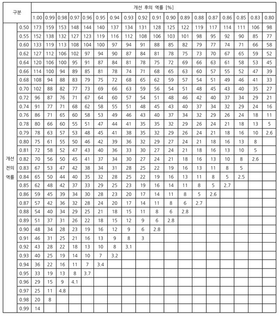

# Q1 피뢰기를 시설하여야 하는 장소를 3군데 작성하시오. (단, 한국전기설비 규정(KEC)에 의한다.) [배점: 5점]

[정답]

①

②

③

---

# 정답

해설) 서술 암기형 / 난이도 중

1. 발전소, 변전소 또는 이에 준하는 장소의 가공전선 인입구 및 인출구
2. 고압 및 특고압 가공전선로로부터 공급을 받는 수용장소의 인입구
3. 특고압 가공전선로에 접속하는 배전용 변압기의 고압측 및 특고압 측

## 부분점수

| 점수 | 세부기준                                    |
| ---- | ------------------------------------------- |
| 5점  | 소문항 총 3개 모두 정답인 경우 5점 획득     |
| 3점  | 소문항 총 3개 중 2개가 정답인 경우 3점 획득 |
| 1점  | 소문항 총 3개 중 1개가 정답인 경우 1점 획득 |

## 해설

[한국전기설비규정 341.13 피뢰기의 시설]

가. 고압 및 특고압의 전로 중 다음에 열거하는 곳 또는 이에 근접한 곳에는 피뢰기를 시설하여야 한다.

1. 발전소, 변전소 또는 이에 준하는 장소의 가공전선 인입구 및 인출구
2. 특고압 가공전선로에 접속하는 배전용 변압기의 고압측 및 특고압 측
3. 고압 및 특고압 가공전선로로부터 공급을 받는 수용장소의 인입구
4. 가공전선로와 지중전선로가 접속되는 곳

---

# Q2 가공전선로의 ACSR에 댐퍼(Damper)를 설치하는 이유를 간단히 작성하시오. [배점: 4점]

[정답]

---

# 해설) 서술 암기형 / 난이도 下

## 정답

가공전선의 진동을 방지한다.

## 부분점수

| 점수 | 세부기준               |
| ---- | ---------------------- |
| 4점  | 정답이 맞으면 4점 획득 |

## 해설

[가공전선의 진동 방지 대책]

- **댐퍼 (Damper):** 바람이 불면 가공전선의 주변에 와류가 발생하여 상하로 진동이 발생하게 되는데, 이와 같은 진동을 억제하기 위해 댐퍼를 설치한다. 댐퍼의 종류로는 스톡브릿지 댐퍼, 토셔널 댐퍼, 아머로드 댐퍼 또는 베이츠 댐퍼가 있다.

- **아머로드 (Armor rod):** 지지점 부근의 전선을 보강하기 위해 사용된다.

---

# Q3 다음에서 설명하는 건축화 조명방식의 이름을 쓰시오. [배점: 3점]

설계자가 크기, 형상 등 전체적인 조화를 생각하여 형광등 기구를 벽면 상방 모서리에 숨겨서 설치하는 방식으로, 기구로부터 빛이 직접 벽면을 조명하는 건축화 조명방식이다.

[정답]

---

# 정답: 코오니스 조명(Cornice light)

## 해설

### 부분점수

| 점수 | 세부기준               |
| ---- | ---------------------- |
| 3점  | 정답이 맞으면 3점 획득 |

### [건축화 조명방식의 종류]

1. **천장면 이용방식**: 매입형광등, 라인라이트, 다운라이트, 핀홀라이트, 코퍼라이트, 광천장조명, 루버천장조명, 코오브조명
2. **벽면 이용방식**: 코너조명, 코오니스조명, 밸런스조명, 광창조명

### [조명과 관련된 용어 설명]

1. **다운라이트**: 천장에 작은 구멍을 뚫고 조명기구 매입하여 빛의 빔 방향을 아래로 조명한다.
2. **코브(Cove) 라이트**: 천장이나 벽면 상부에 광원을 간접 조명화하여 천장면에 반사시켜 조명하는 것으로 효율은 나쁘지만 부드럽고 안정된 조명이다. 눈부심 없고, 조도분포가 일정해 그림자가 없다.
3. **코너(Coner) 조명**: 천장과 벽면 사이에 조명기구를 배치하여 천정과 벽면을 동시에 조명하는 방법이다.
4. **코오니스(Cornice) 조명**: 직접 형광등기구를 벽면 위쪽에 설치하고, 목재나 금속판으로 광원을 숨기며, 직접광은 벽면을 조명하는 방식이다.
5. **밸런스(Valance) 조명**: 벽에 형광등기구를 설치해 목재, 금속판 및 투과율이 낮은 재료로 광원을 숨기며, 직접광은 아래쪽으로는 벽이나 커튼을 위쪽으로는 천장을 비추는 분위기 조명 방식이다.
6. **광창조명**: 지하실이나 자연광이 들어가지 않는 방에서 낮 동안 창문에서 채광되고 있는 청명한 느낌의 조명방식이다. 인공창의 뒷면에 형광등을 배치한다.

---

# Q4 다음 그림을 3개소에서 점멸하도록 하기 위하여 3로 스위치 2개, 4로 스위치 1개를 조합하는 경우의 배선도를 완성하시오. [배점: 5점]

[정답]

---

# 해설) 도면 완성형 / 난이도 中

## 정답

## 부분점수

| 점수 | 세부기준                                                     |
| ---- | ------------------------------------------------------------ |
| 5점  | 완성 도면이 정답과 같은 경우에만 5점 획득, 오류가 있으면 0점 |

## 해설

3로 스위치는 1개의 전등을 2개의 장소에 설치된 스위치를 통해 점등을 하고자 할 때 필요하다. 대표적인 예는 긴 복도 양쪽에 3로 스위치를 설치하여 한쪽의 스위치에서 전등을 켜고 복도를 지난 후 다른 쪽의 스위치에서 전등을 끌 수 있도록 설계된 스위치이다. 만약에 3개 이상의 장소에 설치된 스위치를 통해 1개의 전등을 점멸하고자 할 때 3로 스위치는 양 끝에 2개가 필요하고 나머지 장소에는 4로 스위치를 설치하면 된다.

[3로, 4로 스위치 필요 개수]

- 2개 장소의 스위치에서 1개의 등을 점등, 소등 : 3로 SW 2개
- 3개 장소의 스위치에서 1개의 등을 점등, 소등 : 3로 SW 2개, 4로 SW 1개
- 4개 장소의 스위치에서 1개의 등을 점등, 소등 : 3로 SW 2개, 4로 SW 2개
- 5개 장소의 스위치에서 1개의 등을 점등, 소등 : 3로 SW 2개, 4로 SW 3개

---

# Q5 100/5 변류기 1차에 250[A]가 흐르고 있다. 이때 2차 측에 실제 10[A]가 흐르는 경우 변류기의 비오차[%]를 계산하시오. [배점: 4점]

[계산과정]

변류기의 비는 100/5 = 20 이다.

이론적으로 2차측에 흘러야 하는 전류는 다음과 같다.

$$ I\_{2(theory)} = \frac{250[A]}{20} = 12.5[A] $$

실제 2차측 전류는 10[A] 이므로 비오차는 다음과 같이 계산된다.

$$ 비오차 = \frac{|12.5 - 10|}{12.5} \times 100\% = \frac{2.5}{12.5} \times 100\% = 20\% $$

[정답] 20%

---

---

해설) 단순 계산형 / 난이도 中

정답

[계산과정]

$$ 비오차 = \frac{\text{공칭 변류비} - \text{실제 변류비}}{\text{실제 변류비}} \times 100 [%] $$

$$ 비오차 = \frac{\frac{100}{5} - \frac{250}{10}}{\frac{250}{10}} \times 100 = -20 [%] $$

[정답] -20 [%]

부분점수

| 점수 | 세부기준                                                  |
| ---- | --------------------------------------------------------- |
| 4점  | 계산과정과 정답이 모두 맞으면 4점 획득, 오류가 있으면 0점 |

해설

비오차: 측정 시의 실제 변류비와 공칭 변류비 사이의 오차

$$ 비오차 = \frac{\text{공칭 변류비} - \text{실제 변류비}}{\text{실제 변류비}} \times 100 [%] $$

---

# Q6 아래에 제시된 것과 같이 3상 Δ-Y결선 30[MVA], 33/11[kV] 변압기가 차동계전기에 의하여 보호되고 있다. 고장전류가 정격전류의 200[%] 이상에서 동작하는 계전기의 전류(i_r)의 정정값을 계산하시오. (단, 변압기 1차측 및 2차측 CT의 변류비는 각각 500/5[A], 2000/5[A]이다.) [배점: 6점]

[계산과정]

[정답]

---

# 해설) 복합 계산형 / 난이도 中

## 정답

### [계산과정]

$$ i_p = I_p \times CT비 = \frac{P}{\sqrt{3}V_p cos\theta} \times CT비 = \frac{30 \times 10^6}{\sqrt{3} \times 33 \times 10^3 \times 1} \times \frac{5}{500} \approx 5.25 [A] $$

$$ i_s = \sqrt{3}I_s \times CT비 = \sqrt{3} \times \frac{P}{\sqrt{3}V_s cos\theta} \times CT비 = \sqrt{3} \times \frac{30 \times 10^6}{\sqrt{3} \times 11 \times 10^3 \times 1} \times \frac{5}{2000} \approx 6.82 [A] $$

계전기가 정격전류의 200[%]에서 동작하므로 전류의 정정값은

$$ i_r = (i_s - i_p) \times 2 = (6.82 - 5.25) \times 2 = 3.14 [A] $$

### [정답] 3.14[A]

## 부분점수

| 점수 | 세부기준                                                  |
| ---- | --------------------------------------------------------- |
| 6점  | 계산과정과 정답이 모두 맞으면 6점 획득, 오류가 있으면 0점 |

## 해설

비율차동계전기 2차 측 (Y-Δ) 전류 중 $i_s$는 Δ결선으로 상전류의 $\sqrt{3}$배를 한다.

[1단계] 1차 측 Δ → Y

$$ 변압기 1차 전류 I_p = \frac{P}{\sqrt{3}V_p cos\theta} = \frac{30 \times 10^6}{\sqrt{3} \times 33 \times 10^3 \times 1} \approx 524.86 [A] $$

$$ 계전기 전류 i_p = I_p \times 변류비 = 524.86 \times \frac{5}{500} \approx 5.25 [A] $$

[2단계] 2차 측 Y → Δ

$$ 변압기 2차 전류 I_s = \frac{P}{\sqrt{3}V_s cos\theta} = \frac{30 \times 10^6}{\sqrt{3} \times 11 \times 10^3 \times 1} \approx 1574.59 [A] $$

$$ 계전기 전류 i_s = I_s \times 변류비 \times \sqrt{3} = 1574.59 \times \frac{5}{2000} \times \sqrt{3} \approx 6.82 [A] $$

[3단계] 계전기 정정값은 정격전류 차이값의 200[%]에서 동작하므로

$$ \therefore i_r = (i_s - i_p) \times 2 = (6.82 - 5.25) \times 2 = 3.14 [A] $$

()

---

# Q7 소선의 직경이 3.2 [mm] 인 37가닥 연선의 외경은 몇 [mm] 인지 계산하시오. [배점: 5점]

[계산과정]

[정답]

---

## 해설) 단순 계산형 / 난이도 下

정답

[계산과정]

총 소선 수 N = 37 가닥이므로 중심선을 뺀 층수 n = 3이다.

연선의 외경 D = (2 $\times$ 3 + 1) $\times$ 3.2 = 22.4[mm]

[정답] 22.4[mm]

부분점수

| 점수 | 세부기준                                                  |
| ---- | --------------------------------------------------------- |
| 5점  | 계산과정과 정답이 모두 맞으면 5점 획득, 오류가 있으면 0점 |

해설

소선의 가닥 수 N = 3n(n+1) + 1 (여기서, n은 중심선을 뺀 층수이다.)

예를 들면 n=2일 때, N=19, n=3일 때 N=37, n=4일 때 N=61이다.

연선의 외경 D = (2n+1)d (여기서 n:층수, d: 소선의 지름이다.)

연선의 외경을 구할 때 2n+1인 것은 중심 소선 양쪽에 n층이 있기 때문이다.

---

# Q8 다음과 같은 조건에서 실지수를 계산하시오. [배점: 4점]

- 크기가 가로 8[m], 세로 10[m], 높이 4.8[m]이다.

- 작업면 높이는 0.8[m]이다.

[계산과정]

[정답]

---

## 해설) 단순 계산형 / 난이도 下

정답

[계산과정]

$$ 실지수 \frac{8 \times 10}{(4.8 - 0.8) \times (8 + 10)} \approx 1.11 $$

[정답] 1.11

부분점수

| 점수 | 세부기준                                                  |
| ---- | --------------------------------------------------------- |
| 4점  | 계산과정과 정답이 모두 맞으면 4점 획득, 오류가 있으면 0점 |

해설

$$ 실지수 (Room Index) RI = \frac{X \cdot Y}{H(X + Y)} $$

(여기서, H: 천장과 작업면까지 거리, X: 공간의 가로 길이, Y: 세로 길이)

---

# Q9 500[kVA] 단상 변압기 3대를 △-△ 결선하여 사용하고, 예비 변압기로서 단상 500[kVA] 1대를 보유한 변전소가 있다. 이 변전소에서 갑작스러운 부하의 증가로 예비 변압기도 사용하여 최대 몇 [kVA] 부하에 응할 수 있는지 계산하시오. [배점: 4점]

[계산과정]

[정답]

---

# 해설) 단순 계산형 / 난이도 中

## 정답

[계산과정]

변압기 4대로 V 결선 2뱅크(Bank) 출력

$$ P_m = 2P_v = 2 \times (\sqrt{3} \times P_1) = 2 \times (\sqrt{3} \times 500) \approx 1732.05 \text{ [kVA]} $$

[정답] 1,732.05 [kVA]

## 부분점수

| 점수 | 세부기준                                                  |
| ---- | --------------------------------------------------------- |
| 4점  | 계산과정과 정답이 모두 맞으면 4점 획득, 오류가 있으면 0점 |

## 해설

[단상 변압기 2대로 V결선 시 3상 출력]

$$ P_v = \sqrt{3} P_1 (단상 변압기 1대 용량) $$

[변압기 4대로 V 결선 2뱅크(Bank) 출력]

$$ P_m = 2P_v = 2 \times (\sqrt{3}P_1) = 2\sqrt{3}P_1 \text{ [VA]} $$

---

# Q10 다음에 제시된 그림과 같은 방전특성을 갖는 부하에 필요한 축전지 용량은 몇 [Ah]인지 계산하시오. [배점: 6점]

$$ 방전전류: I_1 = 200[A], I_2 = 300[A], I_3 = 150[A], I_4 = 100[A] $$
$$ 방전시간: T_1 = 130분, T_2 = 120분, T_3 = 40분, T_4 = 5분 $$
$$ \* 용량 환산시간: K_1 = 2.45, K_2 = 2.45, K_3 = 1.46, K_4 = 0.45 $$

- 보수율: 0.7

[계산과정]

[정답]

---

해설) 단순 계산형 / 난이도 下

정답

[계산과정]

$$ C = \frac{\{2.45 \times 200 + 2.45 \times (300 - 200) + 1.46 \times (150 - 300) + 0.45 \times (100 - 150)\}}{0.7} = 705 \text{ [Ah]} $$

[정답] 705 [Ah]

부분점수

| 점수 | 세부기준                                                  |
| ---- | --------------------------------------------------------- |
| 6점  | 계산과정과 정답이 모두 맞으면 6점 획득, 오류가 있으면 0점 |

해설

[1단계] 방전 특성곡선의 면적 KI 계산

$$ KI = I_2 \times K_1 - \{(I_2 - I_1) \times (K_1 - K_2)\} - \{(I_2 - I_3) \times (K_3 - K_4)\} - \{(I_3 - I_4) \times (K_4)\} $$

$$ = K_1I_1 + K_2(I_2 - I_1) + K_3(I_3 - I_2) + K_4(I_4 - I_3) $$

[2단계] 축전지 용량 C: 방전 특성 곡선의 면적을 계산하여 보수율로 나눈다.

$$ C = \frac{1}{L}KI = \frac{1}{\text{보수율}} \times \text{용량 환산 시간} \times \text{방전 전류 [Ah]} $$

$$ C = \frac{1}{L}KI = \frac{K_1I_1 + K_2(I_2 - I_1) + K_3(I_3 - I_2) + K_4(I_4 - I_3)}{L} \text{ [Ah]} $$

---

# Q11 계기용 변류기(CT)의 선정 시에 열적 과전류 강도 관계식과 기계적 과전류 강도를 함께 고려해야 한다. 이때 열적 과전류 강도와 기계적 과전류 강도의 관계식을 쓰시오. [배점: 6점]

(1) 열적 과전류 강도 관계식을 쓰시오. (단, S: 통전시간에 대한 열적 과전류 강도[A], $S_n$: 정격 과전류 강도[A], t: 통전시간)

[정답]

(2) 기계적 과전류 강도 관계식을 쓰시오. (단, $S_m$: 기계적 과전류 강도[A], $I_n$: CT 1차 정격 전류[A], $I_s$: 최대 고장 전류(단락 전류)[A])

[정답]

---

# 해설) 단답 암기형 / 난이도 중

## 정답

(1) S = $\frac{S_n}{\sqrt{t}} $

(2) $S_m$ = 2.5S

## 부분점수

| 점수 | 세부기준                                               |
| ---- | ------------------------------------------------------ |
| 6점  | 소문항 (1), (2) 총 2문제가 모두 정답인 경우 6점 획득   |
| 3점  | 소문항 (1), (2) 총 2문제 중 1개가 정답인 경우 3점 획득 |

## 해설

[KSC 1701] 계기용 변성기(전력 수급용)

열적 단시간 전류 $S = \frac{S_n}{\sqrt{t}} $

(여기서, S: 통전시간 *t*초에서의 단시간 전류 강도, S*n: 정격 단시간 전류 강도, t*: 통전시간[초])

## 용어 설명

- 열적 과전류 강도: CT에 손상을 주지 않으면서 1초간 1차 측에 흘릴 수 있는 최대 전류를 말한다.
- 기계적 과전류 강도: CT가 전기자기력에 의해 전기적으로나 기계적으로 손상이 되지 않은 1차 측 전류의 파형의 최댓값(파고치)을 의미하며, 기계적 과전류 강도는 열적 과전류 강도의 약 2.5배 정도이다.
- 기계적 단시간 전류: 변류기에서 기계적 단시간 전류는 정격 단시간 전류(1차 전류 실효값)의 2.5배 정도의 초기 최대 순시값에 견디어야 한다.

---

# Q12 다음 그림은 변류기를 영상 접속시켜 그 잔류회로에 지락 계전기(DG)를 삽입시킨 것을 나타낸 것이다. 선로전압은 66[kV], 중성점에 300[Ω]의 저항접지로 하였고, 변류기의 변류비는 300/5 [A]이다. 송전전력 20,000[kW], 역률 0.8(지상)일 때 A상에 완전 지락사고가 발생했다. 이 경우 다음 물음에 답하시오. (단, 작용 정전용량, 인덕턴스 등 선로정수는 무시한다.) [배점: 8점]

(1) 지락 계전기 DG에 흐르는 전류는 몇 [A]인지 계산하시오.

[계산과정]

[정답]

(2) A상 전류계 Ⓐ에 흐르는 전류는 몇 [A]인지 계산하시오.

[계산과정]

[정답]

(3) B상 전류계 Ⓑ에 흐르는 전류는 몇 [A]인지 계산하시오.

[계산과정]

[정답]

(4) C상 전류계 Ⓒ에 흐르는 전류는 몇 [A]인지 계산하시오.

[계산과정]

[정답]

---

# 계산과정

## 해설) 복합 계산형 / 난이도 上

(1) 지락 계전기에 흐르는 전류 계산

[계산과정]

$$ 지락전류 I\_{g} = \frac{E}{R} = \frac{66000/\sqrt{3}}{300} \approx 127.02 \text{ [A]} $$

$$ 지락 계전기 전류 I\_{DG} = 127.02 \times \frac{5}{300} \approx 2.12 \text{ [A]} $$

[정답] 2.12[A]

(2) A상 전류계에 흐르는 전류 계산

[계산과정]

사고 시 A상에 흐르는 전류 $I_A = 지락전류 + 부하전류 = I_g + I_a $

$$ |I_A| = |127.02 + \frac{20000}{\sqrt{3} \times 66 \times 0.8} \times (0.8 - j0.6)| = |301.97 + j131.22| \approx 329.25 \text{ [A]} $$

전류계 Ⓐ에 흐르는 전류$ I_A = 329.25 \times \frac{5}{300} \approx 5.49 \text{ [A]} $

[정답] 5.49[A]

(3) B상 전류계에 흐르는 전류 계산

[계산과정]

사고 시 B상에 흐르는 전류 $I_B = I_b = \frac{P}{\sqrt{3} V \cos\theta} = \frac{20000}{\sqrt{3} \times 66 \times 0.8} \approx 218.69 \text{ [A]} $

전류계 Ⓑ에 흐르는 전류$ I_B = 218.69 \times \frac{5}{300} \approx 3.64 \text{ [A]} $

[정답] 3.64[A]

(4) C상 전류계에 흐르는 전류 계산

[계산과정]

사고 시 C상에 흐르는 전류 $I_C = I_c = \frac{P}{\sqrt{3} V \cos\theta} = \frac{20000}{\sqrt{3} \times 66 \times 0.8} \approx 218.69 \text{ [A]} $

전류계 Ⓒ에 흐르는 전류 $I_C = 218.69 \times \frac{5}{300} \approx 3.64 \text{ [A]}$

[정답] 3.64[A]

## 부분점수

| 점수 | 세부기준                                                         |
| ---- | ---------------------------------------------------------------- |
| 8점  | 소문항 (1)~(4) 총 4문항이 모두 계산과정과 정답이 맞으면 8점 획득 |
| 2점  | 소문항 총 4문항 중 계산과정과 정답이 맞은 1개당 2점씩 획득       |

## 해설

a상 지락사고시 건전상 b, c에는 부하 전류만 흐르고 고장상 a에는 지락전류 $I_g$와 부하전류 $I_a$가 함께 흐른다. 즉, $I_A = I_g + I_a$ 가 된다.

중성점 저항 접지방식이므로 지락전류는 유효분 전류가 된다.

| 구분 | 정상상태              | A상 사고 시             |
| ---- | --------------------- | ----------------------- |
| A상  | $I_a$                 | $I_g + I_a $            |
| B상  | $I_b$                 | $I_b$                   |
| C상  | $I_c$                 | $I_c$                   |
| DG   | $I_a + I_b + I_c = 0$ | $I_a + I_b + I_c = I_g$ |

지락전류 $I_g$는 선로의 커패시턴스 성분으로 인해 진상전류이나 문제에서 주어진 조건은 선로정수를 무시해도 되므로 동상전류인 것으로 간주하고 계산한다.

---

# Q13 다음과 같이 건물의 보수공사를 하려고 한다. 전체 공사비를 계산하시오. [배점: 5점]

- 32[W] × 2 매입 하면(下面) 개방형 형광등 30등을 32[W] × 3 매입 루버 형으로 교체한다.
- 20[W] × 2 펜던트형 개방형 형광등 20등을 20[W] × 2 직부 하면 개방형으로 교체한다.
- 철거되는 20[W] × 2 펜던트 하면 개방형 등기구는 재사용한다.
- 천장 구멍 뚫기 및 취부테 설치와 등기구 보강 작업은 계산하지 않으며, 공구손료 등을 제외한 직접 노무비만 구한다.
- 인공계산은 소수점 셋째 자리까지 구하고, 내선전공의 노임은 225,408 [원]으로 한다.

## [표] 형광등기구 설치

| 종별            | 직부형 | 펜던트형 | 매입 및 반매입형 |
| --------------- | ------ | -------- | ---------------- |
| 10[W] 이하 × 1  | 0.123  | 0.150    | 0.182            |
| 20[W] 이하 × 1  | 0.141  | 0.168    | 0.214            |
| 20[W] 이하 × 2  | 0.177  | 0.215    | 0.273            |
| 20[W] 이하 × 3  | 0.223  | -        | 0.335            |
| 20[W] 이하 × 4  | 0.323  | -        | 0.489            |
| 30[W] 이하 × 1  | 0.150  | 0.177    | 0.227            |
| 30[W] 이하 × 2  | 0.189  | -        | 0.310            |
| 40[W] 이하 × 1  | 0.223  | 0.268    | 0.340            |
| 40[W] 이하 × 2  | 0.277  | 0.332    | 0.415            |
| 40[W] 이하 × 3  | 0.359  | 0.432    | 0.545            |
| 40[W] 이하 × 4  | 0.468  | -        | 0.710            |
| 110[W] 이하 × 1 | 0.414  | 0.495    | 0.627            |
| 110[W] 이하 × 2 | 0.505  | 0.601    | 0.764            |

## [해설]

1. 하면(下面) 개방형 기준. 루버 또는 아크릴 커버 형일 경우 해당 등기구 설치 품의 110[%]이다.
2. 등기구 조립·설치, 결선, 지지금구류 설치, 장내 소운반 및 잔재 정리를 포함한다.
3. 매입 또는 반매입 등기구의 천장 구멍 뚫기 및 취부테 설치 별도 가산한다.
4. 매입 및 반매입 등기구에 등기구 보강대를 별도로 설치할 경우 이 품의 20[%] 별도 계상한다.
5. 광천장 방식은 직부형 품을 적용한다.
6. 방폭형은 200[%]이다.
7. 높이 1.5[m] 이하의 Pole형 등기구는 직부형 품의 150[%] 적용한다. (기초대 설치 별도)
8. 공동주택 및 교실 등과 같이 동일 반복 공정으로 비교적 쉬운 공사의 경우는 90[%]이다.
9. 형광등 안정기 교환은 해당 등기구 시설품의 110[%], 다만 펜던트형은 90[%]이다.
10. 아크릴간판의 형광등 안정기 교환은 매입형 등기구 설치품의 120[%]이다.
11. 형광램프만 교체 시 해당 등기구 1등용 설치품의 10[%]이다.
12. T-5(28[W]) 및 FPL(36[W], 55[W])는 FL 40[W] 기준품을 적용한다.
13. 펜던트형은 파이프 펜던트형 기준, 체인 펜던트는 90[%]이다.
14. 등의 증가 시 매 증가 1등에 대하여 직부형은 0.005[인], 매입 및 반매입형은 0.008[인] 가산한다.
15. 고조도 반사판 청소 시 형별 관계없이 내선전공 20[W] 이하: 0.03, 40[W] 이하: 0.05 가산
16. 철거 시 30[%], 재사용 철거 시 50[%]이다.

## [계산과정]

## [정답]

()

---

# 정답 해설

해설) 복합 계산형 / 난이도 중

## 계산 과정

[1단계] 철거 공량

32[W] × 2 매입하면 개방형 형광등 30[등]: 0.415 $\times$ 30 $\times$ 0.3 = 3.735[인]

20[W] × 2 펜던트 개방형 형광등 20[등]: 0.215 $\times$ 20 $\times$ 0.3 = 2.15[인]

[2단계] 설치 공량

32[W] × 3 매입 루버형 형광등 30[등]: 0.545 $\times$ 30 $\times$ 1.1 = 17.985[인]

20[W] × 2 직부 하면 개방형 형광등 20[등]: 0.177 $\times$ 20 = 3.54[인]

[3단계] 철거 및 설치 인공 총계: 3.735 + 2.15 + 17.985 + 3.54 = 27.41[인]

[4단계] 직접 노무비: 27.41 $\times$ 225,408 = 6,178,433[원]

[정답] 6,178,433[원]

## 부분 점수

| 점수 | 세부 기준                                                  |
| ---- | ---------------------------------------------------------- |
| 5점  | 계산 과정과 정답이 모두 맞으면 5점 획득, 오류가 있으면 0점 |

## 해설

주어진 조건과 표를 이용하여 전등의 철거 및 설치 공사에 소요되는 직접 노무비를 계산하는 능력을 확인하는 문제이다. 먼저 등의 종류별 철거 및 설치 공량을 계산하여 철거 및 설치 인공 총계를 계산한 후 내선 전공 노임을 곱하여 최종 직접 노무비를 계산하면 된다.

---

# Q14 다음은 평형 3상 회로로 운전하는 유도전동기이다. 이 회로에 다음과 같이 2개의 전력계 $W_1, W_2$, 전압계 V, 전류계 A를 접속한 후의 지시값을 계산하시오. (단, $W_1$ = 2.9 [kW], $W_2$ = 6 [kW], V = 200 [V], I = 30 [A] 이다.)

(1) 이 유도전동기의 역률은 몇 [%]인지 계산하시오.

[계산과정]

[정답]

(2) 역률을 90[%]로 개선시키려면 전력용 콘덴서는 몇 [kVA]가 필요한지 계산하시오.

[계산과정]

[정답]

(3) 이 유도전동기로 매분 20[m]의 속도로 물체를 권상한다면 몇 [ton]까지 가능한지 계산하시오. (단, 종합효율은 80[%]로 한다.)

[계산과정]

[정답]

---

---

# 정답 해설

(1) 유도전동기의 역률 계산

[계산과정]

$$ 전력: P = W_1 + W_2 = 2.9 + 6 = 8.9 \, [kW] $$
$$ 피상전력: P_a = \sqrt{3}VI = \sqrt{3} \times 200 \times 30 \approx 10.39 \, [kVA] $$
$$ \* 역률: \cos\theta = \frac{8.9}{10.39} \times 100 \approx 85.66 \, [\%] $$

[정답]: 85.66 [%]

(2) 역률 개선용 전력용 콘덴서의 용량 계산

[계산과정]

$$ Q = P(\tan\theta_1 - \tan\theta_2) = (2.9 + 6) \times \left( \sqrt{\frac{1 - 0.8566^2}{0.8566}} - \sqrt{\frac{1 - 0.9^2}{0.9}} \right) \approx 1.05 \, [kVA] $$

[정답]: 1.05 [kVA]

(3) 권상 가능한 무게 계산

[계산과정]

권상용 전동기의 용량: $P = \frac{KWv}{6.12\eta} \, [kW] $

권상 하중: $W = \frac{8.9 \times 6.12 \times 0.8}{1 \times 20} \approx 2.18 \, [ton] $

[정답]: 2.18 [ton]

부분점수

| 점수 | 세부기준                                                          |
| ---- | ----------------------------------------------------------------- |
| 9점  | 소문항 (1)~(3) 총 3문항 모두 계산과정과 정답이 맞는 경우 9점 획득 |
| 3점  | 소문항 총 3문항 중 계산과정과 정답이 맞는 1문항당 3점씩 획득      |

해설

[2전력계법에서의 전력과 역률 계산]

$$ 유효전력: P = W_1 + W_2 \, [W] $$
$$ 무효전력: Q = \sqrt{3}|W*1 - W_2| \, [Var] $$
$$ * 피상전력: P*a = \frac{\sqrt{3}VI}{\sqrt{2\sqrt{W_1^2 + W_2^2 - W_1W_2}}} \, [VA] $$
$$ * \cos\theta = \frac{P}{P_a} = \frac{W_1 + W_2}{\sqrt{2\sqrt{W_1^2 + W_2^2 - W_1W_2}}} 또는 \cos\theta = \frac{\text{유효 전력}}{\text{피상 전력}} = \frac{W_1 + W_2}{\sqrt{3}VI} $$

전압계, 전류계가 있는 경우 직접 피상전력을 계산하여 역률을 구하고, 전력계만 있는 경우 전력량 값에 의한 계산된 피상전력으로 역률을 구하면 된다.

역률 개선용 콘덴서의 용량: $Q = P(\tan\theta_1 - \tan\theta_2) $

권상기 소요 동력: $P = \frac{KWv}{6.12\eta} \, [kW] $

(여기서, K: 여유 계수, W: 권상 하중 [ton], v: 권상 속도 [m/분], \eta: 권상기 효율)

---

# Q15 다음과 같은 수전설비 계통도의 미완성 도면을 보고 물음에 답하시오.[배점: 14점]

(1) 도면에 표시된 ① ASS의 최대 과전류 LOCK 전류값과 그 의미를 작성하시오.

[정답]

① 최대 과전류 LOCK 전류 [A]:

② 과전류 LOCK 기능의 의미:

(2) 도면에 표시된 ② 피뢰기의 정격전압과 제1보호 대상을 작성하시오.

[정답]

① 피뢰기 정격전압 [kV]:

② 제1보호 대상:

(3) 도면에 표시된 ③ 한류형 퓨즈의 단점 2가지를 작성하시오.

[정답]

①

②

(4) 도면에 표시된 ④ MOF 과전류 강도 기준에 대한 아래 설명에서 빈칸에 해당되는 내용을 정답란에 작성하시오.

MOF의 과전류 강도는 기기 설치점에서 단락전류에 의해 계산 적용하되, 22.9[kV] 급으로서 60[A] 이하의 MOF 최소 과전류 강도는 전기사업자 규격에 의한 (①) 배로 하고, 계산한 값이 75배 이상인 경우 (②) 배를 적용하며, 60[A] 초과 시 MOF의 과전류 강도는 (③) 배로 적용한다.

[정답]

①

②

③

(5) 도면에 표시된 ⑤ 변압기 2차 F점에서의 3상 단락 전류와 선간(2상) 단락 전류를 계산하시오. (단, 변압기 임피던스만 고려하고 기타 정수는 무시한다.)

[계산과정]

[정답]

---

# 단답 암기형+서술 암기형+단순 계산형 / 난이도 중

(1) ASS의 최대 과전류 LOCK 전류 및 기능의 의미

① 최대 과전류 LOCK 전류 값: 880[A]

② 기능의 의미: LOCK 전류 이상값으로 고장이 발생하면 ASS가 LOCK되어 차단되지 않고 후비보호장치인 리클로져나 주차단기의 차단에 의해 고장 전류가 제거된 후 무전압 상태에서 ASS 차단된다.

(2) 피뢰기의 정격전압과 제1보호 대상

① 피뢰기 정격전압: 18[kV]

② 제1보호 대상: 전력용 변압기

(3) 한류형 퓨즈의 단점

① 재투입이 불가능하다.

② 차단 시 과전압이 발생된다.

(4) MOF 과전류 강도 기준에 대한 규정

75, 150, 40

(5) 3상 단락전류와 선간 단락전류 계산

[계산과정]

[1단계] 3상 단락전류$ I\_{3s}$

$$ I\_{3s} = \frac{100}{\%Z_u} \times \frac{P}{\sqrt{3}V} = \frac{100}{5} \times \frac{500 \times 10^3}{\sqrt{3} \times 380} \approx 15,193.43[A] $$

**[2단계] 선간(2상) 단락전류 $I_{2s}$**

$$ I*{2s} = I*{3s} \times \frac{\sqrt{3}}{2} = 15,193.43 \times \frac{\sqrt{3}}{2} \approx 13,157.90[A] $$

**[정답]** $I*{3s} = 15,193.43[A], I*{2s} = 13,157.90[A]$

부분점수

| 점수  | 세부기준                                                          |
| ----- | ----------------------------------------------------------------- |
| 14점  | 소문항 (1)~(5) 모두 계산과정과 정답이 맞으면 14점 획득            |
| 9~0점 | 소문항 (1)~(4)의 총 9개의 답안 중 정답과 맞는 1개당 1점 획득      |
| 5점   | 소문항 (5)의 계산과정과 정답이 맞으면 5점 획득, 오류가 있으면 0점 |

해설

[ASS 정격표]

| 종류                 | 기준 값        |
| -------------------- | -------------- |
| 정격전압             | 25.8 [kV]      |
| 정격전류             | 200 [A]        |
| 정격주파수           | 60 [Hz]        |
| 정격단기간전류(순시) | 15 [kA]        |
| 정격투입전류         | 15 [kA]        |
| 정격차단전류         | 900 [A]        |
| 과전류 LOCK 전류     | 800 [A] (±10%) |

(여기서, 최대 LOCK 전류 값: 880[A]이다.)

[배전선로에서 리클로저(Recloser)와의 협조] (설명 생략)

[피뢰기의 정격전압] (설명 생략)

| 전력계통 전압 [kV]     | 피뢰기 정격전압 [kV] |
| ---------------------- | -------------------- |
| 345(유효 접지)         | 288                  |
| 154(유효 접지)         | 144                  |
| 66(PC접지 또는 비접지) | 72                   |
| 22(PC접지 또는 비접지) | 24                   |
| 220/2차 고저항 접지    | 21                   |

[전력용 퓨즈(PF: Power Fuse)의 특징] (설명 생략)

| 장점                                                                                                                                                                                                                                           | 단점                                                                                                                                                                                                                                                                                                     |
| ---------------------------------------------------------------------------------------------------------------------------------------------------------------------------------------------------------------------------------------------- | -------------------------------------------------------------------------------------------------------------------------------------------------------------------------------------------------------------------------------------------------------------------------------------------------------- |
| 소형 및 경량이다.   가격이 경제적이다.   릴레이와 변성기가 필요 없다.   차단시 무방출 무음(한류형 퓨즈)이다.   고속도 차단이 가능하다.   보수가 용이하다.   한류 효과가 우수하다.   소형이기 때문에 장치 전체가 소형이다. | 재투입을 할 수 없다.   과전류에서 용단될 수 있다.   동작시간-전류 특성을 계전기처럼 마음대로 조정하는 것이 불가능하다.   최소차단전류 영역이 있다.   비보호 영역이 있어 사용 중에 열화동작에 의해 결상 우려가 있다.   차단 순간 과전압이 발생(한류형)한다.   후비보호가 완벽하지 않다. |

[변압기 사고시 전류 계산식(발전기 기본식 응용)] (설명 생략)

---

# Q16 3층 사무실용 건물에 3상 3선식의 6,000[V]를 200[V]로 강압하여 수전하는 설비이다. 각종 부하 설비가 표와 같을 때 참고자료를 이용하여 다음 질문에 답하시오. [배점: 12점]

## [표1] 동력 부하 설비

| 사용 목적                 | 용량 [kW] | 대수 | 상용동력 [kW] | 하계동력 [kW] | 동계동력 [kW] |
| ------------------------- | --------- | ---- | ------------- | ------------- | ------------- |
| **난방 관계**             |           |      |               |               |               |
| 보일러 펌프               | 6.0       | 1    | 6.0           |               |               |
| 오일 기어 펌프            | 0.4       | 1    | 0.4           |               |               |
| 온수 순환 펌프            | 3.0       | 1    | 3.0           |               |               |
| **공기 조화 관계**        |           |      |               |               |               |
| 1, 2, 3층 패키지 콤프레셔 | 7.5       | 6    | 45.0          |               |               |
| 콤프레셔 팬               | 5.5       | 3    | 16.5          |               |               |
| 냉각수 펌프               | 5.5       | 1    | 5.5           |               |               |
| 쿨링 타워                 | 1.5       | 1    | 1.5           |               |               |
| **급수/배수 관계**        |           |      |               |               |               |
| 양수 펌프                 | 3.0       | 1    | 3.0           |               |               |
| **기타**                  |           |      |               |               |               |
| 소화 펌프                 | 5.5       | 1    | 5.5           |               |               |
| 셔터                      | 0.4       | 2    | 0.8           |               |               |
| **합계**                  |           |      | 25.8          | 52.0          | 9.4           |

## [표2] 동력 부하 설비

| 사용 목적           | 와트 [W] | 수량 | 합계 [VA] | 총 용량 [VA] | 비고          |
| ------------------- | -------- | ---- | --------- | ------------ | ------------- |
| **전등 관계**       |          |      |           |              |               |
| 수은등 A            | 200      | 4    | 260       | 1,040        | 200[V] 고역률 |
| 수은등 B            | 100      | 8    | 140       | 1,120        | 200[V] 고역률 |
| 형광등              | 40       | 820  | 55        | 45,100       | 200[V] 고역률 |
| 백열전등            | 60       | 10   | 60        | 600          |               |
| **콘센트 관계**     |          |      |           |              |               |
| 일반 콘센트         | 80       |      | 150       | 12,000       | 2P 15[A]      |
| 환기팬용 콘센트     | 8        |      | 55        | 440          |               |
| 히터용 콘센트       | 1,500    | 2    |           | 3,000        |               |
| 복사기용 콘센트     |          | 4    |           | 3,600        |               |
| 텔레타이프용 콘센트 |          | 2    |           | 2,400        |               |
| 룸 쿨러용 콘센트    |          | 6    |           | 7,200        |               |
| **기타**            |          |      |           |              |               |
| 전화 교환용 정류기  | 1        |      | 800       | 800          |               |
| **계**              |          |      |           | 77,300       |               |

## [참고자료1] 단상/3상 변압기 용량표 (부분)

(1) 동계난방 때 온수 순환 펌프는 상시 운전하고, 보일러용과 오일기어 펌프의 수용률이 60[%]일 때 난방동력 수용 부하는 몇 [kW]인지 계산하시오.

[계산과정]

[정답]

## [참고자료2] 배전용 변압기 정격 (부분)

(2) 동력 부하의 역률이 전부 80[%]라고 한다면 피상전력은 각각 몇 [kVA]인지 계산하시오. (단, 상용동력, 하계동력, 동계동력 별로 각각 계산하시오.)

| 구분     | 계산과정 | 답  |
| -------- | -------- | --- |
| 상용동력 |          |     |
| 하계동력 |          |     |
| 동계동력 |          |     |

(3) 총 전기설비용량은 몇 [kVA]를 기준으로 하여야 하는지 계산하시오.

[계산과정]

[정답]

## [참고자료3] 역률 개선용 콘덴서 용량 계산표

(4) 전등의 수용률은 70[%], 콘센트 설비의 수용률은 50[%]라고 한다면 몇 [kVA]의 단상 변압기에 연결하여야 하는지 계산하시오. (단, 교환용 정류기는 100[%] 수용률로 계산한 결과에 포함시키며 변압기 예비율은 무시한다.)

[계산과정]

[정답]

(5) 동력설비 부하의 수용률이 모두 60[%]라면 동력 부하용 3상 변압기의 용량은 몇 [kVA]인지 계산하시오. (단, 동력 부하의 역률은 80[%]로 하며 변압기의 예비율은 무시한다.)

[계산과정]

[정답]

(6) 상기 건물에 시설된 변압기 총 용량은 몇 [kVA]인지 계산하시오.

[계산과정]

[정답]

(7) 단상 변압기와 3상 변압기의 1차 측의 전력퓨즈의 정격전류는 각각 몇 [A]의 것을 선택하여야 하는지 계산하시오.

[정답] 생략

(8) 선정된 동력용 변압기 용량에서 역률을 95[%]로 개선하려면 콘덴서 용량은 몇 [kVA]인지 계산하시오.

[계산과정]

[정답]

---

## 해설) 복합 계산형 / 난이도 中上

(1) 난방동력 수용 부하

[계산과정]
온수 순환 펌프는 상시 운전이므로 수용률 100[%]로 계산
$$ 수용부하 = 3.0 × 1 + (6.0 + 0.4) × 0.6 = 6.84 [kW] $$

[정답] 6.84 [kW]

(2) 동력부하의 역률 80[%]일 때 각각의 피상전력 계산

| 구분     | 계산 과정                       | 답          |
| -------- | ------------------------------- | ----------- |
| 상용동력 | $\frac{25.8}{0.8}$ = 32.25[kVA] | 32.25 [kVA] |
| 하계동력 | $\frac{52.0}{0.8}$ = 65[kVA]    | 65 [kVA]    |
| 동계동력 | $\frac{9.4}{0.8}$ = 11.75[kVA]  | 11.75 [kVA] |

(3) 총 전기설비용량의 기준 계산

[계산과정] 총 전기설비의 용량 = 동력 부하 + 조명 및 콘센트 부하

총 부하 설비 = (32.25 + 65) + 77.3 = 174.55 [kVA]

[정답] 174.55 [kVA]

(4) 전등 및 콘센트의 단상 변압기 용량 계산

[계산과정]

전등 부하: (1.04 + 1.12 + 45.1 + 0.6) × 0.7 = 33.502 [kVA]

콘센트 부하: (12.0 + 0.44 + 3.0 + 3.6 + 2.4 + 7.2) × 0.5 = 14.32 [kVA]

기타(정류기) 부하: 0.8 [kVA]

단상 변압기의 용량: 33.502 + 14.32 + 0.8 = 48.622 계산된 값보다 커야한다.

[정답] 50 [kVA] 선정

(5) 동력설비의 3상 변압기의 용량 계산

[계산과정]

(2)번에서 기준 동력 부하(상용동력 + 하계동력과 동계동력 중 큰 값) = 97.25 [kVA]

동력설비의 수용 부하: 97.25 × 0.6 = 58.35 [kVA] 계산된 값보다 커야한다.

[정답] 75 [kVA] 선정

(6) 건물에 시설된 변압기의 총 용량 계산

[계산과정] 변압기의 총 용량 = 단상 변압기의 용량 + 3상 변압기의 용량
$$ 50 + 75 = 125 [kVA] $$

[정답] 125 [kVA]

(7) 변압기별 1차 측 전력퓨즈의 정격 전류 계산

[참고자료1]의 표에서 (단상 6.6 [kV])과 (정격 전류 15[A])의 교차점
[참고자료1]의 표에서 (3상 6.6 [kV])과 (정격 전류 7.5[A])의 교차점

[정답] ① 단상 변압기: 15 [A], ② 3상 변압기: 7.5 [A]

(8) 역률 개선용 전력용 콘덴서의 용량 계산

[계산과정]
[참고자료3]에서 (개선 전 역률 0.8)과 (개선 후 역률 0.95)의 교차점
$$ 콘덴서 용량 [kVA] = 부하 [kW] × k_g = 부하 [kVA] × 개선전역률 × k_g $$
$$ = 75 × 0.8 × 0.42 = 25.2 [kVA] $$

[정답] 25.2 [kVA]

부분점수

| 점수  | 세부기준                                                             |
| ----- | -------------------------------------------------------------------- |
| 12점  | 소문항 (1)~(8) 모두 계산과정과 정답이 맞은 경우 12점 획득            |
| 5~0점 | 소문항 (1), (3), (5), (6), (8) 총 5개 중 정답이 맞은 1개당 1점 획득  |
| 2~0점 | 소문항 (4)의 계산과정과 정답이 맞은 경우 2점 획득, 오류가 있으면 0점 |
| 2~0점 | 소문항 (7)의 답안 총 2개 중 정답이 맞은 1개당 1점 획득               |
| 3~0점 | 소문항 (2)의 답안 총 3개 중 계산과정과 정답이 맞은 1개당 1점 획득    |

해설

동력 부하 = 상용 부하 + (하계, 동계 중 큰 부하) = 상용 부하 + 하계 부하 (일반적)

총 부하설비 = 동력 부하 + 조명 및 콘센트 부하

단상 변압기의 용량 ≥ 전등부하 + 콘센트 부하 + 기타(정류기) 부하

3상 변압기의 용량 ≥ 동력설비의 수용률을 적용한 부하

역률 개선용 전력용 콘덴서의 용량 = 부하용량 [kW] × $k_g$(개선전/후의 비율)

---
