# Q1 퓨즈의 정격사항에 관련된 표의 빈칸에 알맞은 말을 정답란에 작성하시오. [배점: 5점]

| 계통전압 [kV] | 정격전압 [kV] | 최대 설계전압 [kV] |
| ------------- | ------------- | ------------------ |
| 6.6           | 15            | 8.25               |
| 13.2          | 15            | 25.8               |
| 22 또는 22.9  | 69            | 25.8               |
| 66            | 69            | 169                |
| 154           | 169           | 169                |

[정답]

① 15

② 25.8

③ 69

④ 169

⑤ 169

---

해설) 단답 암기형 / 난이도 下

정답

① 7.5

② 15.5

③ 23

④ 72.5

⑤ 161

부분점수

| 점수  | 세부기준                               |
| ----- | -------------------------------------- |
| 5~0점 | 소문항 총 5문항 중 정답 1개당 1점 획득 |

해설

[공칭전압과 정격전압 정리표]

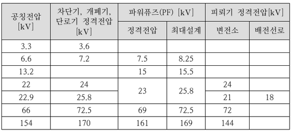

---

# Q2 다음에 해당하는 금속관 부품의 특징에 해당하는 설명을 읽고 부품명을 각각 작성하시오. [배점: 8점]

(1) 관과 박스를 접속할 경우 파이프 나사를 죄어 고정시키는데 사용되며 6각형과 기어형이 있다.

[정답]

(2) 전선 관단에 끼우고 전선을 넣거나 빼는 데 있어서 전선의 피복을 보호하여 전선이 손상되지 않게 하는 것으로 금속제와 합성수지제의 2종류가 있다.

[정답]

(3) 금속관 상호 접속 또는 관과 노멀 밴드와의 접속에 사용되며 내면에 나사가 있으며 관의 양측을 돌리어 사용할 수 없는 경우 유니온 커플링을 사용한다.

[정답]

(4) 노출 배관에서 금속관을 고정시키는 데 사용되며 합성수지 전선관, 가요 전선관, 케이블 공사에도 사용된다.

[정답]

(5) 배관의 직각 굴곡에 사용하며 양단에 나사가 나있어 관과의 접속에는 커플링을 사용한다.

[정답]

(6) 금속관을 아웃렛 박스의 노크아웃에 취부할 때 노크아웃의 구멍이 관의 구멍보다 클 때 사용된다.

[정답]

(7) 매입형의 스위치나 콘센트를 고정하는 데 사용되며 1개용, 2개용, 3개용 등이 있다.

[정답]

(8) 전선관 공사에 있어 전등 기구나 점멸기 또는 콘센트의 고정, 접속함으로 사용되며 4각 및 8각이 있다.

[정답]

---

# 해설) 단답 암기형 / 난이도 下

## 정답

(1) 로크너트 (Lock nut)

(2) 부싱 (Bushing)

(3) 커플링 (Coupling)

(4) 새들 (Saddle)

(5) 노멀밴드 (Normal band)

(6) 링 리듀우서 (Ring reducer)

(7) 스위치 박스 (Switch BOX)

(8) 아웃렛 박스 (Outlet BOX)

## 부분점수

| 점수 | 세부기준                                        |
| ---- | ----------------------------------------------- |
| 8점  | 소문항 (1)~(8)의 모두 정답과 같은 경우 8점 획득 |
| 1점  | 소문항 총 8문항 중 정답과 맞는 1개당 1점 획득   |

---

# Q3 다음에 제시된 단상 유도전동기의 역회전 방법에 대한 특징에 해당하는 것을 [보기]에서 찾아 기호를 작성하시오. [배점: 5점]

[보기]

① 역회전이 불가능하다.

② 2개의 브러시 위치를 반대로 한다.

③ 전원에 대해 주권선이나 기동권선 중 어느 한 쪽만 반대로 한다.

(1) 분상 기동형: ( )

[정답]

(2) 반발 기동형: ( )

[정답]

(3) 셰이딩 코일형: ( )

[정답]

---

# 해설) 단답 암기형 / 난이도 下

## 정답

(1) 3
(2) 2
(3) 1

## 부분점수

| 점수 | 세부기준                                                   |
| ---- | ---------------------------------------------------------- |
| 5점  | 소문항 (1)~(3)의 모두 정답과 같은 경우 5점 획득            |
| 3점  | 소문항 (1)~(3) 총 3문항 중 2개가 정답과 같은 경우 3점 획득 |
| 1점  | 소문항 (1)~(3) 총 3문항 중 1개가 정답과 같은 경우 1점 획득 |

## 해설

[단상 유도전동기의 역회전 방법]

- **셰이딩 코일형**: 한 방향으로만 회전 가능(역회전 불가), 역률과 효율이 나쁨
- **반발 기동형**: 브러시 위치를 이동하여 회전자 권선을 단락, 브러시가 포함
- **분상형**: 주권선, 보조권선 중 1개의 극성을 바꿔 90°의 위상차로 기동(일반적)

---

# Q4 현장에서 적용되고 있는 차단기의 약호와 그 한글명칭을 다음 각 물음에 맞도록 3가지씩 작성하시오. [배점: 5점]

(1) 특고압용 차단기에 대한 약호와 한글명칭을 작성하시오.

| 차단기의 약호 | 한글 명칭 |
| ------------- | --------- |
| ①             |           |
| ②             |           |
| ③             |           |

(2) 저압용 차단기에 대한 약호와 한글명칭을 작성하시오.

| 차단기의 약호 | 한글 명칭 |
| ------------- | --------- |
| ①             |           |
| ②             |           |
| ③             |           |

---

# 정답 및 해설

해설) 단답 암기형 / 난이도 下

(1) 특고압용 차단기의 약호와 한글명칭

1. VCB: 진공차단기
2. OCB: 유입차단기
3. ABB: 공기차단기

(2) 저압용 차단기의 약호와 한글명칭

1. ACB: 기중차단기
2. ELB: 누전차단기
3. MCCB: 배선용차단기

## 부분점수

| 점수  | 세부기준                                                                                          |
| ----- | ------------------------------------------------------------------------------------------------- |
| 5점   | 총 6문항이 모두 정답인 경우 5점 획득                                                              |
| 4~0점 | 총 6문항 중 5개가 정답이면 4점, 4개가 정답이면 3점, 2~3개가 정답이면 2점, 1개가 정답이면 1점 획득 |

## 해설: 차단기의 종류

| 종류         | 약어                                 | 소호 원리                                           |
| ------------ | ------------------------------------ | --------------------------------------------------- |
| 가스차단기   | GCB (Gas Circuit Breaker)            | 가스(SF6)를 흡수하여 차단                |
| 공기차단기   | ABB (Air Blast circuit Breaker)      | 압축공기를 아크에 불어넣음                          |
| 유입차단기   | OCB (Oil Circuit Breaker)            | 아크에 의한 절연유 분해 가스의 흡부력 사용          |
| 진공차단기   | VCB (Vacuum Circuit Breaker)         | 고진공 속에서 전자의 고속도 확산을 이용하여 차단    |
| 자기차단기   | MBB (Magnetic Blast circuit Breaker) | 전자력을 이용하여 아크를 소호실로 유도하여 냉각차단 |
| 기중차단기   | ACB (Air Circuit Breaker)            | 대기 중에 아크를 길게 하여 소호실에서 냉각차단      |
| 누전차단기   | ELB (Earth Leakage circuit Breaker)  | 부하측 누전 발생시 지락 전류를 검출하여 회로 차단   |
| 배선용차단기 | MCCB (Moled Case Circuit Breaker)    | 사고로 인한 과전류 발생시 제한값 이상일 때 동작     |

---

# Q5 다음은 전력시설물 공사감리업무 수행지침에 따른 착공신고서 검토와 보고에 대한 내용이다. 빈칸에 들어갈 내용을 답란에 적으시오. (단, 전력시설물 공사감리업무 수행지침에 표현된 문구를 활용하여 작성해야 정답처리된다.) [배점: 5점]

[책임감리 현장참여자 업무지침서] 제11조 (착공신고서 검토 및 보고)

감리원은 건설공사가 착공된 경우에는 시공자로부터 다음 각호의 서류가 포함된 착공신고서를 제출받아 적정성 여부를 검토하여 7일 이내에 발주청에 보고하여야 한다.

1. 현장기술자 지정신고서(현장관리조직, 현장대리인, 안전관리자, 품질관리자)
2. (①)
3. (②) 또는 품질시험계획서
4. 공사 도급 계약서 사본 및 산출내역서
5. 착공 전 사진
6. 현장기술자 경력 사항 확인서 및 자격증 사본
7. (③)
8. 노무동원 및 장비투입 계획서
9. 기타 발주청이 지정한 사항

[정답]

①

②

③

---

# 정답 해설

(해설) 단답 암기형 / 난이도 中

1. 건설공사 공정예정표
2. 품질관리계획서
3. 안전관리계획서

## 부분점수

| 점수 | 세부기준                                    |
| ---- | ------------------------------------------- |
| 5점  | 소문항 총 3개가 모두 정답인 경우 5점 획득   |
| 3점  | 소문항 총 3개 중 2개가 정답인 경우 3점 획득 |
| 1점  | 소문항 총 3개 중 1개가 정답인 경우 1점 획득 |

## 해설

[책임감리 현장참여자 업무지침서] 제11조 (착공신고서 검토 및 보고)

감리원은 건설공사가 착공된 경우에는 시공자로부터 다음 각호의 서류가 포함된 착공신고서를 제출받아 적정성 여부를 검토하여 7일 이내에 발주청에 보고하여야 한다.

1. 현장기술자 지정신고서(현장관리조직, 현장대리인, 안전관리자, 품질관리자)
2. 건설공사 공정예정표
3. 품질관리계획서 또는 품질시험계획서
4. 공사 도급 계약서 사본 및 산출내역서
5. 착공 전 사진
6. 현장기술자 경력 사항 확인서 및 자격증 사본
7. 안전관리계획서
8. 노무동원 및 장비투입 계획서
9. 기타 발주청이 지정한 사항

---

# Q6 다음은 도면의 3상 유도전동기 Y-△ 기동에 대한 시퀀스 도면이다. 회로 변경, 접점 추가, 접점 제거 및 변경 등을 통해 다음 조건에 맞게 동작하도록 도면의 잘못된 부분을 고치시오. (단, 전자 접촉기, 접점 등의 명칭을 시퀀스 도면을 수정하면서 정확하게 표현하시오.) [배점: 6점]

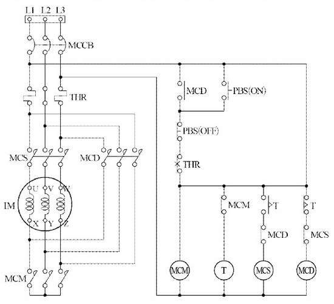

[조건]

1. 푸시버튼 스위치 PBS(ON)를 누르면 전자 접촉기 MCM과 전자 접촉기 MCS, 타이머 T가 동작하며, 전동기 IM이 Y결선으로 기동하고, 푸시버튼 스위치 PBS(ON)을 놓아도 자기 유지에 의하여 동작이 유지된다.
2. 타이머 설정 시간 후 전자 접촉기 MCS와 타이머 T가 소자되고, 전자 접촉기 MCD가 동작하며, 전동기 IM이 △결선으로 운전한다.
3. 전자 접촉기 MCS와 전자 접촉기 MCD는 서로 동시에 투입되지 않도록 한다.
4. 푸시버튼 스위치 PBS(OFF)를 누르면 모든 동작이 정지한다.
5. 전동기 운전 중 전동기 IM이 과부하로 과전류가 흐르면 열동계전기 THR에 의해 모든 동작이 정지한다.

---

## 해설) 도면완성 / 난이도 中

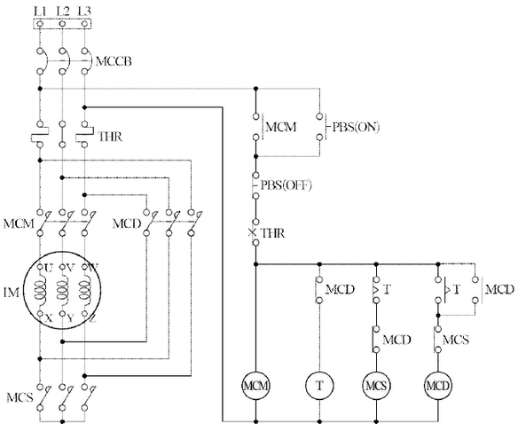

부분점수

| 점수 | 세부기준                                                    |
| ---- | ----------------------------------------------------------- |
| 6점  | 주회로와 보조회로가 모두 정답과 같으면 6점 획득             |
| 3점  | 주회로가 정답과 같으면 3점 획득, 오류가 있으면 0점          |
| 3점  | 변경된 보조회로가 정답과 같으면 3점 획득, 오류가 있으면 0점 |

해설

주회로는 Y-Δ 제어회로가 되도록 연결한다. 보조회로의 변경부분은 자기유지는 MCM으로 되도록 변경하며, MCD는 타이머 T가 소자되어도 자기유지가 되도록 MCD의 a접점을 타이머의 한시 a접점에 병렬로 연결해야 한다.

---

# Q7 너비가 30[m]인 도로의 양쪽으로 30[m] 간격으로 지그재그 식으로 등주를 배치하여 도로 위의 평균 조도를 6[lx]가 되도록 하려고 한다. 각 등주에 사용되는 수은등의 용량[W]을 계산한 후 수은등 규격표에서 찾아 쓰시오. (단, 노면의 광속이용률은 32[%], 유지율은 80[%]이다.) [배점: 5점]

### 수은등 규격표

| 크기 [W] | 전류 [A] | 전광속 [lx]     |
| -------- | -------- | --------------- |
| 100      | 1.0      | 3,200 ~ 4,000   |
| 200      | 1.9      | 7,700 ~ 8,500   |
| 300      | 2.1      | 10,000 ~ 11,000 |
| 400      | 2.5      | 13,000 ~ 14,000 |
| 500      | 3.7      | 18,000 ~ 20,000 |

### 계산과정

### 정답

---

## 정답 해설

해설) 단순 계산형 / 난이도 중

[계산과정]

$$ F = \frac{EAD}{UN} = \frac{6 \times \left( \frac{1}{2} \times 30 \times 30 \right) \times \left( \frac{1}{0.8} \right)}{0.32 \times 1} \approx 10,546.88 [lm] $$

수은등 규격표에서 전광속 참고하여 선정

[정답] 300[W] 선정

부분점수

| 점수 | 세부기준                                                  |
| ---- | --------------------------------------------------------- |
| 5점  | 계산과정과 정답이 모두 맞으면 5점 획득, 오류가 있으면 0점 |

해설

$$ 조명방정식 FUN = EAD $$

(여기서, F(광속), U(조명률), N(등기구 수), E(조도), A(면적), D(감광보상률)이다.)

$$ 유지율, 보수율 M = \frac{1}{D} (D: 감광보상률) $$

도로 조명 각 타입별 면적의 적용 방법

① 도로 양쪽 지그재그 배열 조명면적 $A = \frac{1}{2}BS[m^2] $

② 도로 양쪽 대칭 배열 조명면적 $A = \frac{1}{2}BS[m^2] $

③ 도로 중앙 배열 조명면적 $A = BS[m^2] $

④ 도로 편도 배열 조명면적 $A = BS[m^2] $

---

# Q8 고압 선로에서의 지락고장 검출 및 경보장치를 그림과 같이 시설하였다. A선에 지락고장이 발생하였을 때 다음 각 질문에 답하시오. (단, 전원이 인가되고 경보벨의 스위치는 닫혀있는 상태라고 한다.) [배점: 6점]

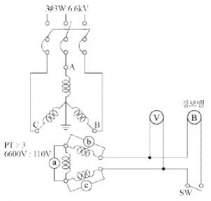

(1) 1차 측 A, B, C 선의 대지전압은 각각 몇 [V]인지 계산하시오.

① B선의 대지전압

[계산과정]

[정답]

② C선의 대지전압

[계산과정]

[정답]

(2) 2차측 Ⓐ, Ⓑ, Ⓒ의 전구전압과 전압계 Ⓓ의 지시전압, 경보벨 Ⓔ에 걸리는 전압은 몇 [V]인지 계산하시오.

① Ⓑ 전구의 전압

[계산과정]

[정답]

② Ⓒ 전구의 전압

[계산과정]

[정답]

③ 전압계 Ⓓ의 지시전압

[계산과정]

[정답]

④ 경보벨 Ⓔ에 걸리는 전압

[계산과정]

[정답]

---

---

# 정답

해설) 단순 계산형 / 난이도 中

**(1) 1선 지락 시 지락되지 않은 상은 대지전위가 $\sqrt{3}$배 상승한다.**

① B선의 대지전압
$$ [계산과정] \frac{6600}{\sqrt{3}} \times \sqrt{3} = 6600 [V] $$
[정답] 6600[V]

② C선의 대지전압
$$ [계산과정] \frac{6600}{\sqrt{3}} \times \sqrt{3} = 6600 [V] $$
[정답] 6600[V]

(2) 전구의 전압과 전압계의 지시전압 및 경보벨에 걸리는 전압 계산

① 전구의 전압
$$ [계산과정] \frac{110}{\sqrt{3}} \times \sqrt{3} = 110 [V] $$
[정답] 110[V]

② 전구의 전압
$$ [계산과정] \frac{110}{\sqrt{3}} \times \sqrt{3} = 110 [V] $$
[정답] 110[V]

③ 전압계의 지시전압 (선간전압)
$$ [계산과정] 110 \times \sqrt{3} = 190.53 [V] $$
[정답] 190.53[V]

④ 경보벨에 걸리는 전압 (선간전압)
$$ [계산과정] 110 \times \sqrt{3} = 190.53 [V] $$
[정답] 190.53[V]

## 부분점수

| 점수  | 세부기준                                                       |
| ----- | -------------------------------------------------------------- |
| 6점   | 소문항 (1), (2)가 모두 계산과정과 정답이 맞으면 6점 획득       |
| 3~0점 | 소문항 (1), (2) 중 한 문항만 계산과정과 정답이 맞으면 3점 획득 |

## 해설

(1) 지락이 발생되기 이전의 정상상태

$$ 권수비 a = \frac{n_1}{n_2} = \frac{E_1}{E_2} = \frac{6600}{110} = 60 $$

⑥의 전압은 Y결선이므로 각 권선과 중성선에 상전압이 인가된다.
$$ 상전압은 선간전압의 \frac{1}{\sqrt{3}}배가 된다. $$

$$ E_2 = \frac{E_1}{a} = \frac{110}{60} \times \frac{6600}{\sqrt{3}} = \frac{110}{\sqrt{3}} [V] $$

(2) A상의 지락이 발생한 경우

지락이 없는 건전상(B상, C상)에는 선간전압(6600[V])이 인가된다.

$$ E_2 = \frac{E_1}{a} = \frac{110}{60} \times 6600 = 110 [V] $$

전압계는 B상과 C상에 대한 선간전압이 되므로

$$ V = \sqrt{3} \times E_2 = \sqrt{3} \times 110 = 190.53 [V] $$

---

# Q9 다음과 그림에서 제시된 송전계통 S점에서 3상 단락사고가 발생하였다. 도면과 조건을 참고하여 변압기 ($T_2$)의 % 리액턴스를 100 [MVA] 기준으로 환산하고 1차(P), 2차(S), 3차(T) 각각의 100 [MVA] 기준 % 리액턴스를 각각 계산하시오. [배점: 5점]

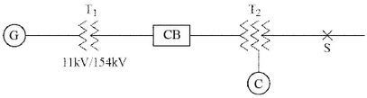

| 번호 | 기기명     | 용량                                                  | 전압                         | %X                                                                                          |
| ---- | ---------- | ----------------------------------------------------- | ---------------------------- | ------------------------------------------------------------------------------------------- |
| 1    | 발전기 G   | 50,000[kVA]                                           | 11 [kV]                      | 30                                                                                          |
| 2    | 변압기 T_1 | 50,000[kVA]                                           | 11/154[kV]                   | 12                                                                                          |
| 3    | 송전선     |                                                       | 154[kV]                      | 10(10,000[kVA]기준) 12(25,000[kVA]기준)                                                  |
| 4    | 변압기 T_2 | 1차 25,000[kVA] 2차 25,000[kVA] 3차 10,000[kVA] | 154[kV] 77[kV] 11 [kV] | 15(25,000[kVA]기준) 1차~2차 15(25,000[kVA]기준) 2차~3차 10.8(10,000[kVA]기준) 3차~1차 |
| 5    | 조상기 C   | 10,000[kVA]                                           | 11 [kV]                      | 20                                                                                          |

[계산과정]

[정답]

① $\%X_P$ =

② $\%X_S$ =

③ $\%X_T$ =

---

## 정답 해설: 복합 계산형 / 난이도 상

[계산과정]

100[MVA] 기준이므로

1차와 2차 사이의 %리액턴스: $`\%X_{p-s} = \frac{100}{25} \times 12 = 48 [\%]` $

2차와 3차 사이의 %리액턴스: $`\%X_{s-t} = \frac{100}{25} \times 15 = 60 [\%]` $

3차와 1차 사이의 %리액턴스: $`\%X_{t-p} = \frac{100}{10} \times 10.8 = 108 [\%]` $

3권선 변압기의 각각의 %리액턴스 계산은 다음과 같다.

1차 %리액턴스: $`\%X_p = \frac{48 + 108 - 60}{2} = 48 [\%]` $

2차 %리액턴스: $`\%X_s = \frac{48 + 60 - 108}{2} = 0 [\%]` $

3차 %리액턴스: $`\%X_t = \frac{60 + 108 - 48}{2} = 60 [\%]` $

**[정답]** 1차 $`\%X_p = 48 [\%]`$, 2차 $`\%X_s = 0 [\%]`$, 3차 $`\%X_t = 60 [\%]` $

부분점수

| 점수 | 세부기준                                                 |
| ---- | -------------------------------------------------------- |
| 5점  | 소문항 3개가 모두 계산과정과 정답이 맞는 경우 5점 획득   |
| 3점  | 소문항 3개 중 2개가 계산과정과 정답이 맞는 경우 3점 획득 |
| 1점  | 소문항 3개 중 1개가 계산과정과 정답이 맞는 경우 1점 획득 |

해설

$$ `\%Z(\text{기준용량}) = \frac{\text{기준용량} \times \%Z(\text{자기용량})}{\text{자기용량}}` $$

$$ `\%X_p = \frac{\%X_{p-s} + \%X_{t-p} - \%X_{s-t}}{2}` $$

$$ `\%X_s = \frac{\%X_{p-s} + \%X_{s-t} - \%X_{t-p}}{2}` $$

$$ `\%X_t = \frac{\%X_{s-t} + \%X_{t-p} - \%X_{p-s}}{2}` $$

---

# Q10 수전전압이 6,600[V], 가공전선로의 %임피던스가 60.5[%]일 때 수전점의 3상 단락전류가 7,000[A]이다. 다음 물음에 답하시오. [배점: 6점]

| 차단기의 정격 용량 [MVA] |
| ------------------------ | --- | --- | --- | --- | --- | --- | --- | --- | --- | --- |
| 10                       | 20  | 30  | 50  | 75  | 100 | 150 | 250 | 300 | 400 | 500 |

(1) 기준용량 [MVA]을 계산하시오.

[계산과정]

[정답]

(2) (1)의 기준용량을 이용하여 차단기의 정격용량 [MVA]을 표에서 선정하시오.

[계산과정]

[정답]

---

---

# 해설) 복합 계산형 / 난이도 中

## 정답

(1) 기준용량

[계산과정]

$$ 단락 전류 I_s = \frac{100}{\%Z} I_n 에서 $$

$$ 정격 전류 I_n = \frac{\%Z}{100} I_s = \frac{60.5}{100} \times 7,000 = 4,235 \text{ [A]} $$

$$ P_n = \sqrt{3} V I_n = \sqrt{3} \times 6,600 \times 4,235 \times 10^{-6} = 48.41 \text{ [MVA]} $$

[정답] 48.41 [MVA]

(2) 정격 용량

[계산과정]

차단기의 단락용량

$$ P_s = \frac{100}{\%Z} P_n = \frac{100}{60.5} \times 48.41 = 80.02 \text{ [MVA]} $$

정격 차단용량은 단락용량보다 커야하므로 표에서 100[MVA] 선정함

[정답] 100 [MVA] 선정

## 부분점수

| 점수 | 세부기준                                                      |
| ---- | ------------------------------------------------------------- |
| 6점  | 소문항 (1), (2) 모두 계산과정과 정답이 맞은 경우 6점 획득     |
| 3점  | 소문항 총 2문항 중 1개의 계산과정과 정답이 맞은 경우 2점 획득 |

## 해설

$$ 단락비 K_s = \frac{I_s}{I_n} = \frac{100}{\%Z} \frac{P_s}{P_n}, 3상 정격전력 P_n = \sqrt{3} V_n I_n \text{ [VA]} $$

---

# Q11 다음 설명을 참고로 하여 아래 그림의 (나) 지락점에서 지락이 발생한 경우 물음에 답하시오. [배점: 6점]

- 옥내배선의 시설에 있어서 인입구 부근에 전기 저항값이 3[Ω] 이하의 값을 유지하는 수도관 또는 철골이 있는 경우에는 이것을 접지극으로 사용하여 이를 접지공사한 저압전로의 중성선 또는 접지측 전선에 추가 접지할 수 있다.
- 추가접지의 목적은 저압전로에 침입하는 뇌격이나 고·저압 혼촉으로 인한 이상전압으로 옥내배선의 전위상승을 억제하는 역할을 한다.
- 또한 추가접지를 하면 지락사고 시에 단락전류를 증가시킴으로써 과전류 차단기의 동작을 확실하게 할 수 있다.

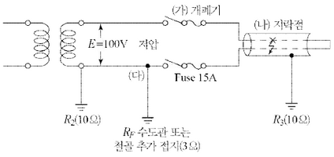

(1) 추가접지가 없는 경우의 지락전류 [A]를 계산하시오.

[계산과정]

[정답]

(2) 추가접지가 있는 경우의 지락전류 [A]를 계산하시오.

[계산과정]

[정답]

---

해설) 단순 계산형 / 난이도 중

정답

(1) 추가 접지가 없는 경우의 지락전류 계산

[계산과정]

$$ I\_{g,1} = \frac{E}{R_2 + R_3} = \frac{100}{10 + 10} = 5 [A] $$

[정답] 5 [A]

(2) 추가 접지가 있는 경우의 지락전류 계산

[계산과정]

추가 접지는 R₂에 병렬로 저항을 연결한 것과 같으므로

$$ I\_{g,2} = \frac{E}{R_2 / R_p + R_3} = \frac{100}{\frac{10 \times 3}{10 + 3} + 10} = 8.125 \approx 8.13 [A] $$

[정답] 8.13 [A]

부분점수

| 점수 | 세부기준                                                             |
| ---- | -------------------------------------------------------------------- |
| 6점  | 소문항 (1), (2)의 계산과정과 정답이 모두 맞은 경우 6점 획득          |
| 3점  | 소문항 (1), (2) 중 2개 중 1개만 계산과정과 정답이 맞은 경우 3점 획득 |

해설

추가 접지가 없는 경우는 2개의 저항 R₂와 R₃가 직렬로 연결된 회로에 전압이 걸린 것과 같으므로 등가회로로 생각하여 전류를 구하면 된다. 또한, 추가 접지가 있는 경우는 추가 접지 Rp와 R₂가 병렬로 연결된 형태의 등가회로가 구성된다.

---

# Q12 부동충전방식의 충전기 2차 충전전류 [A]를 연축전지와 알칼리 축전지로 구분하여 각각 계산하시오. (단, 축전지의 용량이 200 [Ah]이고, 상시부하가 10 [kW], 표준전압이 100 [V]이다.) [배점: 4점]

**(1) 연축전지의 2차 충전전류 [A]를 계산하시오.**

[계산과정]

[정답]

**(2) 알칼리 축전지의 2차 충전전류 [A]를 계산하시오.**

[계산과정]

[정답]

---

# 정답 및 해설

해설: 단순 계산형 / 난이도 하

(1) 연축전지

[계산과정]

$$ I_2 = \frac{200}{10} + \frac{10 \times 10^3}{100} = 20 + 100 = 120 [A] $$

[정답] 120[A]

(2) 알칼리 축전지

[계산과정]

$$ I_2 = \frac{200}{5} + \frac{10 \times 10^3}{100} = 40 + 100 = 140 [A] $$

[정답] 140[A]

부분 점수

| 점수 | 세부 기준                                                            |
| ---- | -------------------------------------------------------------------- |
| 4점  | 소문항 (1), (2) 모두 계산과정과 정답이 맞는 경우 4점 획득            |
| 2점  | 소문항 (1), (2) 총 2개 중 1개가 계산과정과 정답이 맞는 경우 2점 획득 |

해설

[부동 충전 방식]

충전기가 축전지의 자기 방전을 보충함과 동시에 상용 부하에 대한 전력 공급을 담당하도록 하되, 일시적인 대전류는 축전지로 하여금 부담하게 하는 방식

[부동 충전 방식의 2차 충전 전류 계산식]

$$ I_2 = \frac{\text{축전지 정격 용량 [Ah]} + \text{상시 부하 용량 [VA]}}{\text{정격 방전율 [h]} \times \text{표준 전압 [V]}} $$

[축전지의 종류에 따른 정격 방전율]

- 연축전지 : 10[h]
- 알칼리 축전지 : 5[h]

---

# Q13 한 배전선이 최대 전류가 흐를 때 손실전력이 100[kW]이다. 이 배전선의 부하율이 60[%]인 경우 손실계수를 이용하여 평균 손실전력 [kW]을 계산하시오. (단, 손실계수를 구하는데 사용되는 \alpha = 0.2이다.) [배점: 5점]

[계산과정]

[정답]

---

## 해설) 단순 계산형 / 난이도 중

정답

[계산과정]

$$ 손실계수는 H = aF + (1 - a)F^2 = 0.2 \times 0.6 + (1 - 0.2) \times 0.6^2 = 0.408 이고, $$

$$ 평균 손실 전력 = 최대 전력 손실 × 손실 계수 = 100 \times 0.408 = 40.8 [kW] $$

[정답] 40.8 [kW]

부분점수

| 점수 | 세부기준                                                     |
| ---- | ------------------------------------------------------------ |
| 5점  | 계산과정과 정답이 모두 맞은 경우 5점 획득, 오류가 있으면 0점 |

해설

$$ 손실계수는 H = aF + (1 - a)F^2 (여기서, F는 부하율)이고, $$

평균 손실전력은 다음과 같다.

평균 손실 전력 = 최대 전력 손실 × 손실 계수

---

# Q14 다음은 어느 변전소에서의 일부하 곡선을 나타낸 것이다. 3개의 부하 A, B, C의 수용가에 있을 때 다음 물음에 답하시오. (단, 부하 A, B, C의 역률은 각각 100[%], 80[%], 60[%]이다.) [배점: 10점]

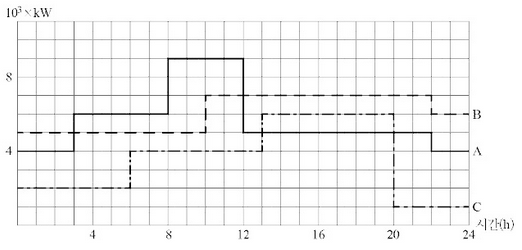

(1) 합성 최대 전력 [kW]을 계산하시오.

[계산과정]

[정답]

(2) 종합 부하율 [%]을 계산하시오.

[계산과정]

[정답]

(3) 부등률을 계산하시오.

[계산과정]

[정답]

(4) 최대 부하 시의 종합역률 [%]을 계산하시오.

[계산과정]

[정답]

(5) 수용가 A에 관한 다음 물음에 답하시오.

① 첨두부하(Peak Load)는 몇 [kW]인지 계산하시오.

[정답]

② 첨두부하가 지속되는 시간은 몇 시부터 몇 시까지인지 적으시오.

[정답]

---

## 정답 및 해설

해설: 복합 계산형 / 난이도 중

(1) 합성 최대 전력 계산

- **계산과정:** P = (9 + 7 + 4) $\times 10^3$ = 20,000 [kW]

* **정답:** 20,000 [kW]

(2) 종합 부하율 계산

- **계산과정:**
  $$ 수용가 A의 1일간 사용전력량: (4 \times 3 + 6 \times 5 + 9 \times 4 + 5 \times 10 + 4 \times 2) \times 10^3 = 136 \times 10^3 \, [kWh] $$
$$ 수용가 B의 1일간 사용전력량: (5 \times 10 + 7 \times 12 + 6 \times 2) \times 10^3 = 146 \times 10^3 \, [kWh] $$
$$ 수용가 C의 1일간 사용전력량: (2 \times 6 + 4 \times 7 + 1 \times 4) \times 10^3 = 86 \times 10^3 \, [kWh] $$
$$ 총 사용 전력량: (136 + 146 + 86) \times 10^3 = 368 \times 10^3 \, [kWh] $$
$$ \* 종합 부하율: \frac{(136 + 146 + 86) \times 10^3}{20,000 \times 24} \times 100 = 76.67 \, [\%] $$
- **정답:** 76.67 [%]

(3) 부등률 계산

- **계산과정:** 부등률 = $\frac{9,000 + 7,000 + 6,000}{20,000} = 1.1 $

* **정답:** 1.1

(4) 최대 부하시 종합역률 계산

- **계산과정:**
  _ 최대 부하 (10시에서 12시 사이)에서의 역률
  $$ _ 유효전력: P = 20,000 \, [kW] (1번 답) $$
$$ _ 무효전력: Q = Q_A + Q_B + Q_C = 0 + 7,000 \times 0.8 + 4,000 \times 0.6 = 10,583.33 \, [kVar] $$
$$ _ 역률: \cos \theta = \frac{20,000}{\sqrt{20,000^2 + 10,583.33^2}} \times 100 = 88.39 \, [\%] $$
- **정답:** 88.39 [%]

(5) 첨두부하시 역률과 지속 시간대

1. 9000 [kW]
2. 8시부터 12시까지

 

| 점수 | 세부 기준                                                     |
| ---- | ------------------------------------------------------------- |
| 10점 | 소문항 (1)~(5) 모두 계산과정과 정답이 맞는 경우 10점 획득     |
| 2점  | 소문항 총 5개 중 1개의 계산과정과 정답이 맞는 경우 2점씩 획득 |

 

해설

$$ 종합 부하율 = \frac{\text{평균 전력}}{\text{합성 최대 전력}} \times 100 = \frac{\text{1일간 총 사용 전력량}}{24 \times \text{합성 최대 전력}} \times 100 $$
$$ 부등률 = \frac{\text{각 수용가의 최대 전력합}}{\text{합성 최대 전력}} $$
$$ \* \cos \theta = \frac{P}{\sqrt{P^2 + Q^2}} \times 100 \, [\%] $$

---

# Q15 3.7[kW]와 7.5[kW]의 직입기동 3상 농형 유도전동기 및 22[kW]의 3상 권선형 유도기동기 등 3대를 그림과 같이 접속하였다. 다음 조건을 기준으로 물음에 답하시오. [배점: 7점]

- 공사방법으로 B1으로 XLPE 절연 전선을 사용하였다.
- 정격전압은 200[V]이고 간선 및 분기회로에 사용되는 전선 도체의 재질 및 종류는 같다.

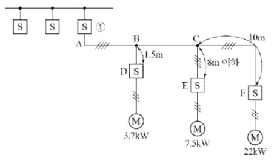

(1) 간선에 사용되는 과전류 차단기와 개폐기 ①의 최소용량은 몇 [A]인지 계산하시오.

[선정과정]

[정답]

(2) 간선의 최소 굵기는 몇 [mm²]인지 계산하시오.

[계산과정]

[정답]

(3) C와 E 사이의 분기회로에 사용되는 전선의 최소 굵기는 몇 [mm²]인지 선정하시오.

[선정과정]

[정답]

(4) C와 F 사이의 분기회로에 사용되는 전선의 최소 굵기는 몇 [mm²]인지 선정하시오.

[선정과정]

[정답]

[표1] 200[V] 3상 유도전동기의 간선의 굵기 및 기구의 용량

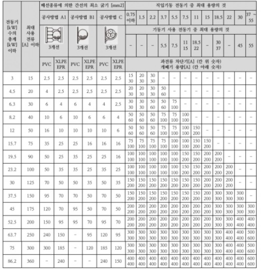

[주]

1. 최소 전선 굵기는 1회선에 대한 것이다.

2. 공사방법 A1은 벽 내의 전선관에 공사한 절연전선 또는 단심케이블, B1은 벽면의 전선관에 공사한 절연전선 또는 단심케이블, 공사방법 C는 벽면에 공사한 단심 또는 다심케이블을 시설하는 경우의 전선 굵기를 표시하였다.

3. 「전동기 중 최대의 것」에는 동시 기동하는 경우를 포함한다.

4. 배선용차단기의 용량은 해당 조항에 규정되어 있는 범위에서 실용상 거의 최대값을 표시한다.

5. 배선용차단기의 선정은 최대용량의 정격전류의 3배에 다른 전동기의 정격전류의 합계를 가산한 값 이하를 표시한다.

6. 배선용차단기를 배·분전반, 제어반 등의 내부에 시설하는 경우는 그 반 내의 온도상승에 주의한다.

[표2] 200[V] 3상 유도전동기 1대인 경우의 분기회로 (B종 퓨즈의 경우)

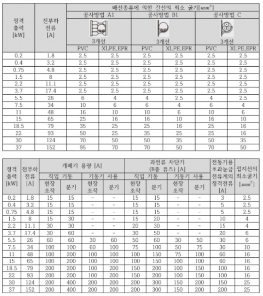

[비고] 1. 최소 전선의 굵기는 1회선에 대한 것이며, 2회선 이상일 경우는 복수회로 보정계수를 적용하여야 한다. 2. 공사방법 A1은 벽 내의 전선관에 공사한 절연전선 또는 단심케이블, B1은 벽면의 전선관에 공사한 절연전선 또는 단심케이블, 공사방법 C는 벽면에 공사한 단심 또는 다심케이블을 시설하는 경우의 전선 굵기를 표시하였다. 3. 전동기 2대 이상을 동일 회로로 할 경우는 간선의 표를 적용할 것.

---

# 정답 해설

해설) 단순 계산형+도표 사용 / 난이도 中

(1) 과전류 차단기와 개폐기 ①의 최소 용량[A]

- **[선정과정]** 전동기 총계 = 3.7 + 7.5 + 22 = 33.2[kW], 기동기 용량 = 22[kW]이다.

- **[표1]**에서 전동기 총계 37.5[kW] 난과 기동기 사용 22[kW]의 교차하는 칸에서
- 과전류 차단기 용량: 150[A], 개폐기 용량: 200[A] 선정

(2) 간선의 최소 굵기[mm²]

**[계산과정]** 전동기 총계 = 3.7 + 7.5 + 22 = 33.2[kW]이므로

- **[표1]**에서 전동기 수의 총계 37.5[kW] 난에서
- 공사 방법으로 B1으로 XLPE 절연 전선을 사용한 50[mm²] 선정
- **[정답]** 50[mm²]

(3) C와 E 사이의 분기회로에 사용되는 전선의 최소 굵기[mm²]

- **[선정과정]** [표2]의 7.5[kW]와 B1, XLPE에서 4[mm²] 선정
- **[전선의 굵기]:** 4[mm²] 선정

(4) C와 F 사이의 분기회로에 사용되는 전선의 최소 굵기[mm²]

- **[선정과정]** [표2]의 22[kW]와 B1, XLPE에서 25[mm²] 선정
- **[전선의 굵기]:** 25[mm²] 선정

부분점수

| 점수  | 세부기준                                                                           |
| ----- | ---------------------------------------------------------------------------------- |
| 7점   | 소문항 (1)~(4)이 모두 정답이면 7점 획득                                            |
| 6~0점 | 총 4개의 소문항 중 3개만 정답이면 6점, 2개만 정답이면 4점, 1개만 정답이면 2점 획득 |

해설

주어진 표를 활용하기 위한 기본적인 능력을 가지고 있으면 문제해결이 가능하므로 관련된 2~3개 문제를 풀어보면서 표에서 찾는 연습을 하면 된다.

---

# Q16 다음 계통도를 보고 물음에 답하시오. (단, 기준 BASE는 100[MVA]로 지정하고 소수점 다섯째 자리에서 반올림하여 답을 작성한다.) [배점: 12점]

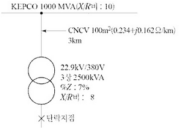

(1) 전원 측 임피던스(%Z, %R, %X)를 계산하시오.

[계산과정]

[정답]

1. %Z =
2. %R =
3. %X =

**(2) 케이블 임피던스($\%Z_L$)를 계산하시오.**

[계산과정]

**(3) 변압기 임피던스($\%Z_T, \%R_T, \%X_T$)를 계산하시오.**

[계산과정]

[정답]

1.  $\%Z_T =$
2.  $\%R_T =$
3.  $\%X_T = $

(4) 합성 임피던스를 계산하시오.

[계산과정]

[정답]

(5) 단락전류를 계산하시오.

[계산과정]

[정답]

---

---

# 해설) 복합 계산형 / 난이도 上

## 정답

(1) 전원측 %임피던스, %저항, %리액턴스 계산

[계산과정]

1. %임피던스

$$ \%Z = \frac{P_n}{P_s} \times 100 = \frac{100}{1000} \times 100 [%] = 10 [\%] $$

2. %저항, %리액턴스 계산

$$ \frac{\%X}{\%R} = 10 이므로, \%X = 10\%R $$

$$ \%Z = \sqrt{\%X^2 + \%R^2} = \sqrt{(10\%R)^2 + \%R^2} = 10 $$

$$ \%R^2 = \frac{100}{101} \implies \%R \approx 0.9950 [%] (: 소수점 다섯째자리에서 반올림) $$

$$ \%X = 10\%R \approx 9.9504 [\%] $$

[정답] ① %Z = 10[%], ② %R = 0.9950 [%], ③ %X = 9.9504 [%]

(2) 케이블 %임피던스 계산

[계산과정]

$$ \%R_L = \frac{P R_L}{10 V^2} = \frac{(100 \times 10^3) \times (0.234 \times 3)}{10 \times 22.9^2} \approx 13.3865 [\%] $$

$$ \%X_L = \frac{P X_L}{10 V^2} = \frac{(100 \times 10^3) \times (0.162 \times 3)}{10 \times 22.9^2} \approx 9.2676 [\%] $$

$$ \%Z_L = \sqrt{13.3865^2 + 9.2676^2} \approx 16.2815 [\%] $$

[정답] 16.2815 [%]

(3) 변압기 %임피던스, %저항, %리액턴스 계산

[계산과정]

$$ \%Z_T = 7 \times \frac{100 \times 10^3}{2500} = 280 [\%] , \frac{X_T}{R_T} = 8 , \%X_T = 8\%R_T 이므로 $$

$$ \%Z_T = \sqrt{\%X_T^2 + \%R_T^2} = \sqrt{64\%R_T^2 + \%R_T^2} = \sqrt{65}\%R_T $$

$$ \%R_T = \frac{280}{\sqrt{65}} \approx 34.7297 [\%] , \%X_T = 8\%R_T = 277.8878 [\%] $$

[정답] ① %ZT = 280 [%], ② %RT = 34.7297 [%], ③ %XT = 277.8878 [%]

(4) 합성 임피던스 계산

[계산과정]

$$ \%R = \%R + \%R_L + \%R_T = 0.9950 + 13.3865 + 34.7297 = 49.1112 [\%] $$

$$ \%X = \%X + \%X_L + \%X_T = 9.9504 + 9.2676 + 277.8878 = 297.1058 [\%] $$

$$ \%Z = \sqrt{\%R^2 + \%X^2} = \sqrt{49.1112^2 + 297.1058^2} \approx 301.1375 [\%] $$

[정답] 301.1375 [%]

(5) 단락전류 계산

[계산과정]

$$ I_s = \frac{100}{\%Z} I_n = \frac{100}{\%Z} \times \frac{P}{\sqrt{3} V} = \frac{100}{301.1375} \times \frac{100 \times 10^6}{\sqrt{3} \times 380} \approx 50,453.4578 [A] $$

[정답] 50,453.4578 [A]

## 부분점수

| 점수 | 세부기준                                                            |
| ---- | ------------------------------------------------------------------- |
| 12점 | 소문항 (1)~(5) 모두 계산과정과 정답이 맞은 경우 12점 획득           |
| 3점  | 소문항 (1), (3)은 계산과정과 정답이 맞은 경우 1문제당 3점 획득      |
| 2점  | 소문항 (2), (4), (5)는 계산과정과 정답이 맞은 경우 1문제당 2점 획득 |

## 해설

$$ 단락비 K_s = \frac{I_s}{I_n} = \frac{100}{\%Z} = \frac{P_s}{P_n} $$

$$ 변형하면 \%Z = \frac{100 P_n}{P_s} , P_s = \frac{100 \times P_n}{\%Z} $$

%저항, %리액턴스, %임피던스 계산식

$$ \%R = \frac{P R}{10 V^2} [\%] , \%X = \frac{P X}{10 V^2} [\%] (여기서, P[kW], V[kV]이다.) $$

$$ \%Z = \sqrt{\%R^2 + \%X^2} $$

---
