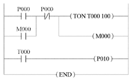
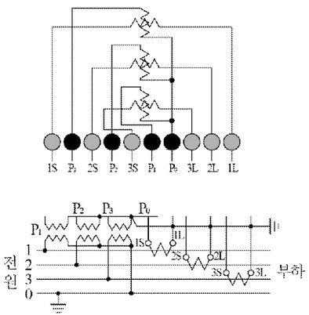
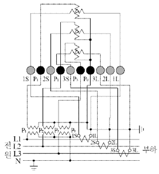
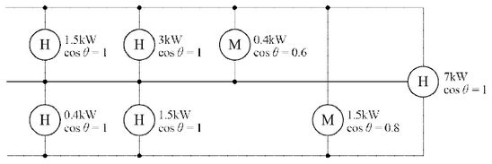
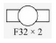
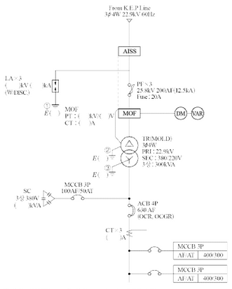
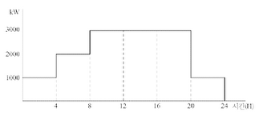

# Q1 전력계통의 발전기, 변압기 등의 증설이나 송전선의 신·증설로 인하여 단락·지락전류가 증가하여 송·변전기기에의 손상이 증대되고, 부근에 있는 통신선의 유도장해가 증가하는 등의 문제점이 예상된다. 따라서, 이러한 문제점을 해결하기 위하여 전력계통의 단락용량의 경감대책을 세워야 한다. 이 대책을 3가지만 쓰시오. [배점: 6점]

[정답]

①

②

③

---

# 해설) 단답 암기형 / 난이도 중

정답

1. 고 임피던스 기기를 채택한다.
2. 모선 계통을 분리 운용한다.
3. 한류 리액터를 설치한다.

부분점수

| 점수 | 세부기준                             |
| ---- | ------------------------------------ |
| 6점  | 소문항 ①~③ 모두 정답인 경우 6점 획득 |
| 2점  | 소문항 총 3개 중 정답 1개당 2점 획득 |

해설

그 외에 정답으로 인정이 가능한 것은 다음과 같다.

4. 계통전압의 격상
5. 직류 연계
6. 고장 전류 제한기 사용

[단락용량 경감 대책 또는 단락전류 억제 대책]

1. 고 임피던스 기기를 채택 = %임피던스를 증가
2. 모선 계통의 분리 = 단락전류의 크기 감소
3. 한류 리액터 = 선로에 연결하여 계통의 임피던스 증가
4. 캐스케이드 보호 방식 = 주회로 차단기로 후비보호(단락용량>차단용량)
5. 계통연계기 사용 = 사고 시 높은 임피던스로 단락전류 억제
6. 직류 계통연계 = 단락전류의 대부분은 무효성분이므로 직류사용으로 억제
7. 상위 전압계급 도입 = 계통 전압을 증가시켜 단락전류 감소

---

# Q2 다음은 PLC 래더 다이어그램의 프로그램이다. 프로그램을 참고하여 아래의 빈칸을 채우시오. (단, 입력: LOAD, 직렬: AND, 직렬반전: AND NOT, 병렬: OR, 병렬반전: OR NOT, 출력: OUT) [배점: 4점]

| STEP | 명령어 | 번지 |
| ---- | ------ | ---- |
| 0    | LOAD   | P000 |
| 1    | ①      | ①    |
| 2    | ②      | ②    |
| 3    | TON    | T000 |
| 4    | DATA   | 100  |
| 5    | ③      | ③    |
| 6    | ④      | ④    |
| 7    | OUT    | P010 |
| 8    | END    |      |

[정답]

① 명령어:

번지:

② 명령어:

번지:

③ 명령어:

번지:

④ 명령어:

번지:

---

# 해설) 단순 암기형 / 난이도 중

## 정답

| 명령어  | 번지 |
| ------- | ---- |
| OR      | M000 |
| AND NOT | P001 |
| OUT     | M000 |
| LOAD    | T000 |

## 부분 점수

| 점수 | 세부 기준                                     |
| ---- | --------------------------------------------- |
| 4점  | 소문항 ①~④의 총 4개 모두 정답일 경우 4점 획득 |
| 1점  | 소문항 총 4개 중 정답 1개당 1점 획득          |

## 해설

| STEP | 명령어  | 번지 |
| ---- | ------- | ---- |
| 0    | LOAD    | P000 |
| 1    | OR      | M000 |
| 2    | AND NOT | P001 |
| 3    | TON     | T000 |
| 4    | DATA    | 100  |
| 5    | OUT     | M000 |
| 6    | LOAD    | T000 |
| 7    | OUT     | P010 |
| 8    | END     |      |

PLC 래더도 작성시 순서를 기억하자.

1. 먼저 왼쪽 전원선과 오른쪽 끝의 전원선이 있으며, 왼쪽 전원선에는 입력 신호를 오른쪽 끝의 전원선에는 출력이 연결됨을 알아야 한다.
2. 래더도 작성시 LOAD 명령어를 통해 왼쪽 전원선에 처음 연결을 하고, 아래 병렬 연결은 OR 명령어, 오른쪽 직렬 연결은 AND 명령어를 사용한다. TON 명령어로 타이머 번지수를 지정하고 DATA 명령어로 한시값을 입력한다. 여기서 1초에 10의 값을 사용하므로 100은 10초를 의미한다. OUT 명령어로 출력을 지정하고 여기서는 내부 접점인 M000을 사용했으며, 자기 유지 회로에도 사용되었다.
3. 다시 LOAD 명령어를 통해 왼쪽 전원선에 처음 연결하고, 타이머가 10초 후에 접점이 ON 되었을 때 OUT 명령어로 최종 출력 P010 접점에 전류를 흐르게 한다.

---

# Q3 방폭형 전동기에 대해 설명하고 방폭 구조의 종류를 3가지 쓰시오.

(1) 방폭형 전동기

[정답]

(2) 방폭 구조의 종류 3가지

[정답]

1.
2.
3.

---

## 정답

해설) 서술 암기형+단답 암기형 / 난이도 下

(1) 방폭형 전동기란 지정된 가스 또는 분진에 의한 폭발성 위험 장소에서 전동기의 사용이 적합하도록 구조 및 기타에 관하여 특별히 설계된 전동기이다.

(2) 방폭 구조의 종류 3가지

1. 내압 방폭 구조
2. 압력 방폭 구조
3. 유입 방폭 구조

부분점수

| 점수  | 세부기준                                          |
| ----- | ------------------------------------------------- |
| 5점   | 소문항 (1), (2)가 모두 정답인 경우 5점 획득       |
| 2점   | 소문항 (1)이 정답인 경우 2점 획득                 |
| 3~0점 | 소문항 (2)의 총 3가지 답안 중 정답 1개당 1점 획득 |

해설

[방폭구조의 기호]

| 방폭구조의 종류 | 구분              | 기호 |
| --------------- | ----------------- | ---- |
|                 | 내압 방폭구조     | d    |
|                 | 유입 방폭구조     | o    |
|                 | 압력 방폭구조     | p    |
|                 | 안전증 방폭구조   | e    |
|                 | 본질안전 방폭구조 | i    |
|                 | 특수 방폭구조     | s    |

---

# Q4 답안지의 그림은 3상 4선식 전력량계의 결선도를 나타낸 것이다. PT와 CT를 사용하여 미완성 부분의 결선도를 완성하시오. [배점: 5점]

---

---

## 해설) 도면 완성형 / 난이도 中

정답

부분점수

| 점수 | 세부기준                                            |
| ---- | --------------------------------------------------- |
| 5점  | 도면이 정답과 같은 경우 5점 획득, 오류가 있으면 0점 |

해설

먼저 왼쪽 PT와 오른쪽 CT를 구분할 수 있어야 하고, PT쪽에 P0~P3가 연결되고, CT쪽에 1S~3S와 1L~3L이 연결되어야 한다. 그리고 전원의 L1, L2, L3에 숫자가 동일하게 연결되도록 연결하며, 마지막으로 PT의 오른쪽 P0와 CT쪽 오른쪽 1L~3L을 중성점이 되도록 연결하고 모두 접지하여야 한다.

---

# Q5 전력시설물 공사감리업무 시행지침에서 정하는 감리원은 해당 공사완료 후 준공검사 전에 사전 시운전 종이 필요한 부분에 대하여는 공사업자에게 시운전을 위한 계획을 수립하여 시운전 30일 이내에 제출하도록 하고, 이를 검토하여 발주자에게 제출하여야 한다. 이때, 시운전 계획수립 시 포함되어야 하는 사항을 3가지만 쓰시오. (단, 반드시 전력시설물 공사감리업무 시행지침에 표현된 내용으로 쓰시오.) [배점: 5점]

[정답]

①

②

③

---

# 해설) 단답 암기형 / 난이도 下

## 정답

1. 시운전 일정
2. 시운전 항목 및 종류
3. 시운전 절차

## 부분점수

| 점수 | 세부기준                                    |
| ---- | ------------------------------------------- |
| 5점  | 소문항 총 3개가 모두 정답인 경우 5점 획득   |
| 3점  | 소문항 총 3개 중 2개가 정답인 경우 3점 획득 |
| 1점  | 소문항 총 3개 중 1개가 정답인 경우 1점 획득 |

## 해설

전력시설물 공사감리업무 시행지침 제59조 [준공검사 등의 절차]

1. 시운전 일정
2. 시운전 항목 및 종류
3. 시운전 절차
4. 시험장비 확보 및 보정
5. 기계·기구 사용계획
6. 운전 요원 및 검사 요원 선임계획

---

# Q6 조명에 사용되는 광원의 발광원리 3가지만 쓰시오. [배점: 5점]

[정답]

①

②

③

---

# 해설) 서술 암기형 / 난이도 중

## 정답

1. 온도복사에 의한 백열발광
2. 루미네선스에 의한 방전발광
3. 일렉트로 루미네선스에 의한 전계발광

## 부분점수

| 점수 | 세부기준                                    |
| ---- | ------------------------------------------- |
| 5점  | 소문항 총 3개가 모두 정답인 경우 5점 획득   |
| 3점  | 소문항 총 3개 중 2개가 정답인 경우 3점 획득 |
| 1점  | 소문항 총 3개 중 1개가 정답인 경우 1점 획득 |

## 해설

[발광원리에 따른 광원의 분류]

- **주광**
- 온도복사에 의한 백열발광
  - (예: ① 백열 전구, ② 특수 전구, ③ 할로겐 전구)
- 온도복사(화학반응)에 의한 연소발광 (예: 섬광전구)
- 루미네선스에 의한 방전발광
- 일렉트로 루미네선스에 의한 전계발광 - EL등, 발광다이오드
- 유도방사에 의한 레이저 발광 - 레이저

---

# Q7 60[W] 전구 8개를 점등하는 수용가가 있다. 정액제 요금은 60[W] 1등당 1개월(30일) 205원이며, 종량제 요금은 기본요금 100원에 1[kWh]당 10원이 추가된다. 전구값은 수용가가 부담할 때, 정액제 요금과 같은 비용을 종량제 요금으로 지불하기 위한 일당 평균 점등시간은 몇 시간인지 계산하시오. (단, 전구값은 1개 65원, 수명 1,000[h]이고 정액제의 경우는 수용가가 전구값은 부담하지 않는다.) [배점: 5점]

## 계산 과정

먼저, 정액제 요금의 총 비용을 계산한다.

전구 8개에 대한 월 요금: 8 $\times$ 205 = 1640 원

다음으로, 종량제 요금에서 전구값을 고려해야 한다.

전구 8개의 총 비용: 8 $\times$ 65 = 520 원

전구 수명: 1000시간

전구 8개의 총 수명: 8$ \times$ 1000 = 8000 시간

전구의 하루 평균 사용 시간: 8000 / 30 = 800/3 시간

하루 사용 전력량: $60 \times 8 \times t$ [Wh] (t: 하루 점등 시간)

종량제 요금은 다음과 같이 계산된다.

총 비용 = 기본요금 + 사용량 요금 + 전구 비용

$$ 1640 = 100 + 10 \times \frac{60 \times 8 \times t}{1000} + 520 $$

$$ 1640 - 100 - 520 = \frac{480t}{1000} \times 10 $$

$$ 1020 = 4.8t $$

$$ t = \frac{1020}{4.8} = \frac{10200}{48} = \frac{850}{4} = 212.5 시간 $$

따라서, 일당 평균 점등시간은 212.5 시간이다. 하지만 이는 하루 24시간보다 훨씬 크므로 계산에 오류가 있다. 문제의 조건이 명확하지 않다. 전구 수명을 고려하는 부분이 애매하다. 전구를 매달 갈아끼우는 것으로 간주하고 다시 계산해 보면,

전구를 30일 동안 사용하려면, 8개 전구를 각각 30일/1000h = 0.03일마다 갈아 끼워야한다. 따라서 30일 동안 소모되는 전구의 개수는 8개 \* (30일/0.03일) = 8000개가 된다.

이 경우, 종량제의 총 비용은 다음과 같이 계산된다.

$$ 1640 = 100 + 10 \times \frac{60 \times 8 \times t}{1000} + 8000 \times 65 $$

이는 매우 큰 값이므로 계산에 오류가 있는 것으로 추정된다. 문제에서 전구 수명에 대한 고려가 명확하지 않아 추가 정보가 필요하다.

## 정답

계산과정에서 보듯, 문제의 조건이 모호하여 정확한 답을 구할 수 없다. 추가적인 설명 또는 조건이 필요하다. 그림은 없다.

---

# 정답 해설

해설: 복합 계산형 / 난이도 중

[계산과정]

① 정액제 요금 = 205 × 8 = 1,640 [원]

② 종량제 요금 = 기본요금 + 사용량에 대한 요금 + 전구값

기본요금: 100 [원], H: 1개월간 총 점등시간

사용량에 대한 요금: $\frac{60}{1,000} \times 8 \times 10 \times H$ = 4.8H[원]

시간 당 전구 값: $\frac{8 \times 65}{1,000}$ = 0.52[원/h]

③ 정액제 요금 = 종량제 요금: 1640 = 100 + 4.8H + 0.52H

1개월간 총 점등시간 $H = \frac{1,640 - 100}{4.8 + 0.52} = \frac{1,540}{5.32} = 289.473 \approx 289.47$[h]

따라서, 1일 점등시간 $h = \frac{H}{30} = \frac{289.47}{30} = 9.649 \approx 9.65$[h]

[정답]: 9.65[h]

부분점수

| 점수 | 세부기준                                                |
| ---- | ------------------------------------------------------- |
| 5점  | 계산과정과 정답이 모두 맞는 경우 5점, 오류가 있으면 0점 |

해설

정액제 요금제는 1등당 1개월(30일) 요금으로 징수하는 방법이며, 종량제 요금제는 기본요금에 사용 시간에 대한 요금과 시간당 전구값을 반영하여 계산한 금액이다. 이 문제에서는 정액제 요금제와 종량제 요금제가 같은 금액일 때 종량제에서 1일간 최대 사용 시간을 계산해보는 문제로 만약에 실제 점등시간이 이 계산값보다 크다면 정액제 요금제가 유리하고, 작다면 종량제 요금제가 유리함을 알 수 있다.

---

# Q8 초고압 송전전압이 345 [kV], 선로 거리가 200 [km]인 경우 1회선 당 가능 송전전력 [kW]을 Still 식을 이용하여 구하시오. [배점: 5점]

[계산과정]

[정답]

---

해설) 단순 계산형 / 난이도 中

정답

[계산과정]

$$ V_s = 5.5\sqrt{0.6l + \frac{P}{100}} 이므로 $$

$$ 송전전력 P = \left[ \left( \frac{V_s}{5.5} \right)^2 - 0.6l \right] \times 100 = \left[ \left( \frac{345}{5.5} \right)^2 - 0.6 \times 200 \right] \times 100 $$

$$ = 381,471.07 \text{ [kW]} $$

[정답] 381,471.07 [kW]

부분점수

| 점수 | 세부기준                                                |
| ---- | ------------------------------------------------------- |
| 5점  | 계산과정과 정답이 모두 맞은 경우 5점, 오류가 있으면 0점 |

해설

Still의 식(경제적인 송전전압)

$$ V_s = 5.5\sqrt{0.6l + \frac{P}{100}} \text{ [kV]} 변형하면 P = \left[ \left( \frac{V_s}{5.5} \right)^2 - 0.6l \right] \times 100 \text{ [kW]} $$

여기서, l: 송전 거리 [km], P: 송전 용량 [kW]

---

# Q9 다음 그림처럼 3상 3선식 220[V]에 전열기 부하와 전동기 부하가 접속된 경우의 설비 불평형률을 계산하시오. (단, Ⓗ는 전열 부하이고, ⓜ은 전동기 부하이다.) [배점: 5점]

[계산과정]

[정답]

---

## 정답 해설

해설) 복합 계산형 / 난이도 中

[계산과정]

$$ 불평형률 = \frac{(1.5 + 3 + \frac{0.4}{0.6}) - (0.4 + 0.5)}{(1.5 + 3 + \frac{0.4}{0.6}) + (0.4 + 0.5) + \frac{1.5}{0.8} + 7} \times \frac{1}{3} \times 100 = 85.67[\%] $$

[정답] 85.67[%]

### 부분점수

| 점수 | 세부기준                                                |
| ---- | ------------------------------------------------------- |
| 5점  | 계산과정과 정답이 모두 맞은 경우 5점, 오류가 있으면 0점 |

### 해설

3상 3선식의 경우

설비불평형률 = 각 선간 접속되는 단상 부하의 최대와 최소의 차 / 총 부하 설비용량 × $\frac{1}{3}$ × 100[%]

$$ P\_{12} = 1.5 + 3 + \frac{0.4}{0.6} = 5.167 [kVA] $$

$$ P\_{23} = 0.4 + 0.5 = 0.9 [kVA] $$

$$ P\_{31} = \frac{1.5}{0.8} = 1.875 [kVA] $$

$$ P\_{123} = 7 [kVA] $$

---

# Q10 어떤 건축물의 전기실에서 180[m] 거리에 있는 기계실에 3상 4선식 380/220[V]로 전원을 공급하고 있다. 참고자료를 활용하여 다음 물음에 답하시오. [배점: 7점]

[부하 조건표]

| 부하명   | 규격               | 대수 | 역률X효율 | 수용률 [%] |
| -------- | ------------------ | ---- | --------- | ---------- |
| 급수펌프 | 3상 380[V] 7.5[kW] | 4    | 0.7       | 70         |
| 소방펌프 | 3상 380[V] 20[kW]  | 2    | 0.7       | 70         |
| 히터     | 단상 220[V] 10[kW] | 3    | 1         | 50         |

※ 단, 모든 기기의 효율은 100[%]로 가정한다.

[KEC 공칭 단면적]

2.5, 4, 6, 10, 16, 25, 35, 50, 70, 95, 120, 150[mm²]

(1) 간선의 허용전류 [A]를 계산하시오.

[계산과정]

[정답]

(2) 간선의 굵기 [mm²]를 선정하시오. (단, 간선의 허용 전압강하는 3[%]이며, 공칭 단면적에서 선정한다.)

[계산과정]

[정답]

---

# 해설) 복합 계산형 / 난이도 上

## 정답

[정답]

(1) 간선의 허용전류 [A]

1. 전동기 전류

$$ 급수펌프 I_1 = \frac{(7.5 \times 10^3) \times 0.7 \times 4}{\sqrt{3} \times 380 \times 0.7 \times 1} \times (0.7 + j\sqrt{1 - 0.7^2}) \approx 31.91 + j32.55 $$
$$ 소방펌프 I_2 = \frac{(20 \times 10^3) \times 0.7 \times 2}{\sqrt{3} \times 380 \times 0.7 \times 1} \times (0.7 + j\sqrt{1 - 0.7^2}) \approx 42.54 + j43.40 $$
$$ \* 히터 I_H = \frac{(10 \times 10^3) \times 0.5 \times 1}{220 \times 1 \times 1} \approx 22.73 $$

2. 간선의 허용전류

$$ I_B = \sqrt{유효분^2 + 무효분^2} = \sqrt{(74.45 + 22.73)^2 + (75.95 + 0)^2} \approx 123.34 [A] 이므로 $$

$$ ... 케이블의 허용전류 I_z \ge 123.34 [A] $$

[정답] 123.34 [A]

(2) 간선의 굵기 [mm²]

[계산과정]

$$ A = \frac{17.8LI}{1000e} = \frac{17.8 \times 180 \times 123.34}{1000 \times (\frac{380}{\sqrt{3}} \times 0.03)} \approx 59.88 [mm^2] 계산값 이상의 전선 선정 $$

[정답] 70 [mm²] 선정

## 부분점수

| 점수 | 세부기준                                                          |
| ---- | ----------------------------------------------------------------- |
| 7점  | 소문항 (1), (2)번 모두 계산과정과 정답이 맞으면 7점 획득          |
| 4점  | 소문항 (1)의 계산과정과 정답이 맞으면 4점 획득, 오류가 있으면 0점 |
| 3점  | 소문항 (2)의 계산과정과 정답이 맞으면 3점 획득, 오류가 있으면 0점 |

## 해설

[간선의 허용전류]

$$ _ 급수펌프 I_1 = \frac{(7.5 \times 10^3) \times 0.7 \times 4}{\sqrt{3} \times 380 \times 0.7 \times 1} \times (0.7 + j\sqrt{1 - 0.7^2}) \approx 31.91 + j32.55 $$
$$ _ 소방펌프 I_2 = \frac{(20 \times 10^3) \times 0.7 \times 2}{\sqrt{3} \times 380 \times 0.7 \times 1} \times (0.7 + j\sqrt{1 - 0.7^2}) \approx 42.54 + j43.40 $$
$$ \* 히터 I_H = \frac{(10 \times 10^3) \times 0.5 \times 1}{220 \times 1 \times 1} \approx 22.73 $$

간선의 허용전류

$ I_B = \sqrt{유효분^2 + 무효분^2} = \sqrt{(31.91 + 42.54 + 22.73)^2 + (32.55 + 43.40 + 0)^2} \approx 123.34$ [A] 이므로

케이블의 허용전류 $I_z \ge 123.34$ [A]

[간선의 굵기 [mm²]]

$$ A = \frac{17.8LI}{1000e} = \frac{17.8 \times 180 \times 123.34}{1000 \times (\frac{380}{\sqrt{3}} \times 0.03)} \approx 59.88 [mm^2] $$

계산값 이상의 전선의 굵기 70 [mm²] 선정

[도체와 과부하 보호장치 사이의 협조 (KEC 212.4.1)]

과부하에 대해 케이블(전선)을 보호하는 장치의 동작특성은 다음의 조건을 충족해야 한다. $I_B \le I_n \le I_z, I_z \le 1.45 \times I_B $

$I_B$: 회로의 설계전류(선도체를 흐르는 설계전류 또는 함유율이 높은 영상분 고조파, 특히 제3고조파가 지속적으로 흐르는 경우 중성선에 흐르는 전류이다.)

I\*z: 케이블의 허용전류

- I\*n: 보호장치의 정격전류(사용현장에 적합하게 조정된 전류의 설정 값)

- I: 보호장치가 규약시간 이내에 유효하게 동작하는 것을 보장하는 전류

---

# Q11 변류기(CT)에 관한 다음 각 질문에 답하여라. [배점: 6점]

(1) Y-△로 결선한 주변압기의 보호로 비율 차동계전기를 사용한다면 CT의 결선은 어떻게 하여야 하는지를 설명하여라.

[정답]

(2) 통전 중에 있는 변류기 2차 측에 접속된 기기를 교체하고자 할 때 가장 먼저 취하여야 할 사항을 적어라.

[정답]

**(3) 수전 전압이 22.9 [kV], 수전설비의 부하전류가 40[A]이다. 60/5[A]의 변류기를 통하여 과부하 계전기를 시설하였다. 120[%]의 과부하에서 차단기를 차단시킨다면 과부하 계전기의 전류값은 몇 [A]로 설정해야 하는지 계산하여 구하여라.**

[계산과정]

[정답]

---

# 정답 및 해설

해설: 단답 암기형 + 단순 계산형 / 난이도 下

(1) 1-Y 결선

(2) 2차측 단락

(3) 과부하 계전기의 전류값 [A]

## 계산과정

과부하 계전기의 전류 탭 (I) = 부하전류 × $\frac{1}{\text{변류비}}$ × 설정값

$$ I = 40 \times \frac{5}{60} \times 1.2 = 4[A] $$

과전류 계전기의 탭: 2[A], 3[A], 4[A], 5[A], 6[A], 7[A], 8[A], 10[A], 12[A]

[정답] 4[A]

## 부분점수

| 점수 | 세부기준                                                      |
| ---- | ------------------------------------------------------------- |
| 6점  | 소문항 (1), (2), (3)번 모두 계산과정과 정답이 맞으면 6점 획득 |
| 2점  | 소문항 총 3개 중 정답 1개당 2점 획득                          |

## 해설

(1) 변압기 1차측 전류와 2차측 전류간의 위상차를 없애기 위해 변류기 결선 방법은 변압기 결선방법과 반대로 하여야 한다.

(2) CT의 사용 중 2차측을 개방하면 1차측 부하전류가 모두 여자전류가 되어 2차측에 고전압이 유기되어 절연파괴의 위험을 초래하게 되므로, 먼저 2차측을 단락시킨 후 기기를 교체하여야 한다.

(3) OCR(과전류 계전기)의 탭 전류

과부하 계전기의 전류 탭 (I) = 부하전류 × $\frac{1}{\text{변류비}}$ × 설정값

---

# Q12 가로 10[m], 세로 14[m], 천장 높이 2.75[m], 작업면 높이 0.75[m]인 사무실에 천장 직부 형광등 F32×2를 설치하려고 한다. 다음 물음에 답하시오. [배점: 8점]

(1) 이 사무실의 실지수는 얼마인지 계산하시오.

[계산과정]

[정답]

(2) F32×2의 심벌을 그리시오.

[정답]

(3) 이 사무실의 작업면 조도를 250 [lx], 천장 반사율 70[%], 벽 반사율 50[%], 바닥 반사율 10[%], 32 [W] 형광등 1등의 광속 3200 [lm], 보수율 70[%], 조명율 50[%]로 한다면 이 사무실에 필요한 형광등 기구 수는 몇 등인지 계산하시오.

[계산과정]

[정답]

---

---

## 정답 해설

해설) 단순 계산형+단답 암기형 / 난이도 中

(1) 실지수

[계산과정]

$$ 실지수 (R_I) = \frac{XY}{H(X+Y)} = \frac{10 \times 14}{(2.75 - 0.75) \times (10 + 14)} = 2.92 $$

[정답] 2.92

(2)

(3) 형광등 기구 수

[계산과정]

$$ FUN = EAD 에서 $$

$$ N = \frac{EAD}{FU} = \frac{250 \times (10 \times 14) \times \frac{1}{0.7}}{(3200 \times 2) \times 0.5} = 15.625 $$

[정답] 16[등]

부분점수

| 점수  | 세부기준                                                |
| ----- | ------------------------------------------------------- |
| 8점   | 소문항 (1)~(3) 모두 계산과정과 정답이 맞으면 8점 획득   |
| 6~0점 | 소문항 (1), (3)의 계산과정과 정답이 맞은 1개당 3점 획득 |
| 2점   | 소문항 (2)의 심벌이 정답과 맞으면 2점 획득              |

해설

$$ 실지수 R_I = \frac{XY}{H(X+Y)} $$

$$ 조명 관계식 FUN = EAD $$

(여기서, F: 광속[lm], U: 조명률[%], N: 등 수, E: 조도[lx], A: 면적[m²], D: 감광보상률 =$ \frac{1}{보수율(M)}$)

---

# Q13 다음 그림은 어느 수용가의 수전설비 계통도이다. 다음 각 물음에 답하시오. [배점: 16점]

(1) AISS의 명칭을 쓰고 기능을 2가지 쓰시오.

[정답]

- 명칭: (답변 필요)
- 기능:
  1. (답변 필요)
  2. (답변 필요)

(2) 피뢰기의 정격전압 및 공칭 방전전류를 쓰고 그림에서의 DISC 기능을 간단히 설명하시오.

[정답]

- 규격: 정격전압 (답변 필요) [kV], 공칭 방전전류 (답변 필요) [kA]
- DISC의 기능: (답변 필요)

(3) MOF의 정격을 구하시오. (단, CT의 여유율은 1.25배로 한다.)

[계산과정] (답변 필요)

[정답] (답변 필요)

(4) MOLD TR의 장점 및 단점을 '경제적인 부분 및 유지 보수에 관한 내용을 제외하고' 각각 2가지만 쓰시오.

[정답]

- 장점:
  1. (답변 필요)
  2. (답변 필요)
- 단점:
  1. (답변 필요)
  2. (답변 필요)

(5) ①~③의 접지 종별을 쓰시오.

[정답]

1. (답변 필요)
2. (답변 필요)
3. (답변 필요)

(6) CT의 정격(변류비)을 구하시오. (단, CT의 여유율은 1.25배로 한다.)

[계산과정] (답변 필요)

[정답] (답변 필요)

---

## 단답 암기형+단순 계산형 문제 풀이

해설) 단답 암기형+단순 계산형 / 난이도 中

(1) 명칭: (기중형) 고장 구간 자동 개폐기

기능:

① 고장 구간을 자동으로 개방하여 파급 사고를 방지

② 전부하 상태에서 자동(또는 수동)으로 개방할 수 있어 과부하 보호

(2)

① **피뢰기의 정격전압:** 18[kV], **공칭 방전전류:** 2.5[kA]

② **DISC 기능:** 피뢰기 고장 시 DISC가 개방됨으로써 피뢰기를 대지로부터 분리시키는 기능

(3)

① **PT비:** $\frac{22900/\sqrt{3}}{190/\sqrt{3}} $

② **CT비:** $I_s = \frac{300 \times 10^3}{\sqrt{3} \times 22.9 \times 10^3} = 7.56$[A] 따라서, 변류비 10/5 선정

(4)

[장점]

① 난연성이 우수하다.

② 전력손실이 적다.

[단점]

① 충격파 내전압이 낮다.

② 수지층에 차폐물이 없으므로 운전 중 코일 표면과 접촉하면 위험

(5)

① 피뢰시스템 접지

② 보호접지

③ 계통접지(중성점 접지)

(6)

[계산과정]

$$ I_s = \frac{300 \times 10^3}{\sqrt{3} \times 380} \times (1.25 \sim 1.5) = 569.75 \sim 683.70[A] $$

**[정답]** 600/5

부분점수

| 점수  | 세부기준                                                  |
| ----- | --------------------------------------------------------- |
| 16점  | 소문항 (1)~(6)의 계산과정과 정답이 모두 맞으면 16점       |
| 3~0점 | 소문항 (1)의 ①번이 정답이면 1점, ②번이 정답이면 2점 획득  |
| 2점   | 소문항 (2), (4)의 정답이면 1개당 2점 획득                 |
| 3점   | 소문항 (3), (6)의 계산과정과 정답이 맞으면 1개당 3점 획득 |
| 3~0점 | 소문항 (5)의 총 3개의 답안 중 정답 1개당 1점 획득         |

(1) AISS (Air-Insulated Auto-Sectionalizing Switches): 기중 절연 자동 고장 구분 개폐기

설치방법: 22.9[kV-y] 배전선로에서 변전소의 차단기 또는 리클로저 부하측에 부하용량 4,000[kVA](특수부하 2,000[kVA])이하인 수용가 수전 인입점에 설치

(4) 몰드변압기는 코일을 에폭시 수지로 몰딩한 고체절연방식의 변압기이다.

[장점]

① 난연성이 우수하다.

② 내습, 내진성이 양호하다.

③ 소형, 경량화할 수 있다.

④ 전력손실이 적다.

⑤ 절연유를 사용하지 않으므로 유지보수가 용이하다.

⑥ 단시간 과부하 내량이 높다.

[단점]

① 가격이 비싸다.

② 충격파 내전압이 낮다.

③ 수지층에 차폐물이 없으므로 운전 중 코일 표면과 접촉하면 위험하다.

---

# Q14 다음과 같은 아파트 단지를 계획하고 있다. 주어진 규모 및 참고자료를 이용하여 다음 각 질문에 답하시오. (배점: 11점)

## 규모

| $$  | 동별 | 세대당 면적 (m^2) | 세대 수 | $$  |
| --- | ---- | ----------------- | ------- | --- |
| 1동 | 50   | 50                |
|     | 70   | 40                |
|     | 90   | 30                |
|     | 110  | 30                |
| 2동 | 50   | 60                |
|     | 70   | 20                |
|     | 90   | 40                |
|     | 110  | 30                |

계단, 복도, 지하실 등의 공용면적: $1동 - 1700 m^2, 2동 - 1700 m^2$

## 조건

- 면적 (m^2)당 상정 부하: 아파트 - 30 [VA/m^2], 공용부분 - 7 [VA/m^2]

* 세대당 추가로 가산하여야 할 상정 부하:
  - $80m^2$ 이하의 세대: 750 [VA]
  - $150m^2$ 이하의 세대: 1000 [VA]
* 아파트 동별 수용률:
  - 70세대 이하: 65%
  - 100세대 이하: 60%
  - 150세대 이하: 55%
  - 200세대 이하: 50%
* 공용부분의 수용률: 100%
* 피상전력을 기준으로 하며, 역률은 1이다.
* 변전실의 변압기는 단상변압기 3대로 구성한다.
* 동간 부등률: 1.4

사용 설비에 의한 계약 전력은 사용 설비의 개별 입력의 한계에 대하여 다음 표의 계약 전력 환산율을 곱한 것으로 한다.

| 구분                   | 계약 전력 환산율 | 비고                                                                       |
| ---------------------- | ---------------- | -------------------------------------------------------------------------- |
| 처음 75 kW에 대하여    | 100%             |                                                                            |
| 다음 75 kW에 대하여    | 85%              | 계산의 합계치 단수가 1kW 미만일 경우 소수점 이하 첫째 자리에서 반올림한다. |
| 다음 75 kW에 대하여    | 75%              |                                                                            |
| 다음 75 kW에 대하여    | 65%              |                                                                            |
| 300 kW 초과분에 대하여 | 60%              |                                                                            |

(1) 1동의 상정 부하는 몇 [VA]인지 계산하시오.

(2) 2동의 수용(사용) 부하는 몇 [VA]인지 계산하시오.

(3) 이 단지의 변압기는 단상 몇 [kVA] 용 변압기 3대를 설치하여야 하는지 계산하시오. (단, 변압기 용량은 10%의 여유율을 보이며 단상변압기의 표준용량은 75, 100, 150, 200, 300 [kVA] 등이다.)

(4) 한국전력공사와 변압기 설비에 의하여 계약한다면 몇 [kW]로 계약하여야 하는지 계산하시오.

(5) 한국전력공사와 사용 설비에 의하여 계약한다면 몇 [kW]로 계약하여야 하는지 계산하시오.

---

# 해설) 복합 계산형 / 난이도 상

(1) 1동의 상정 부하 [VA]

[계산과정]

상정 부하 = (바닥 면적 × [m²]당 상정 부하) + 가산 부하

| 세대당 면적 | 면적 당 상정부하 [VA/m²] | 가산 부하 [VA] | 세대 수 | 상정 부하 [VA]                     |
| ----------- | ------------------------ | -------------- | ------- | ---------------------------------- |
| 50 [m²]     | 30                       | 750            | 50      | [(50 × 30) + 750] × 50 = 112,500   |
| 70 [m²]     | 30                       | 750            | 40      | [(70 × 30) + 750] × 40 = 114,000   |
| 90 [m²]     | 30                       | 1000           | 30      | [(90 × 30) + 1000] × 30 = 111,000  |
| 110 [m²]    | 30                       | 1000           | 30      | [(110 × 30) + 1000] × 30 = 129,000 |
| **합계**    |                          |                |         | **466,500 [VA]**                   |

공용 면적까지 고려한 상정 부하 = 466,500 + 1,700 × 7 = 478,400 [VA]

[정답] 478,400 [VA]

(2) 2동의 상정 부하 [VA]

[계산과정]

| 세대당 면적 [m²] | 면적 당 상정부하 [VA/m²] | 가산 부하 [VA] | 세대 수 | 상정 부하 [VA]                     |
| ---------------- | ------------------------ | -------------- | ------- | ---------------------------------- |
| 50               | 30                       | 750            | 60      | [(50 × 30) + 750] × 60 = 135,000   |
| 70               | 30                       | 750            | 20      | [(70 × 30) + 750] × 20 = 57,000    |
| 90               | 30                       | 1000           | 40      | [(90 × 30) + 1000] × 40 = 148,000  |
| 110              | 30                       | 1000           | 30      | [(110 × 30) + 1000] × 30 = 129,000 |
| **합계**         |                          |                |         | **469,000 [VA]**                   |

공용 면적까지 고려한 수용 부하 = 469,000 × 0.55 + 1,700 × 7 = 269,850 [VA]

[정답] 269,850 [VA]

(3) 표준용량 선정

[계산과정]

변압기 용량 ≥ 합성 최대 전력 $= \frac{\text{최대 수용 전력}}{\text{부등률}} = \frac{\text{설비 용량 × 수용률}}{\text{부등률}} $

$$ = \frac{466,500 \times 0.55 + 1,700 \times 7 + 469,000 \times 0.55 + 1,700 \times 7}{1.4} \times 10^{-3} \approx 384.52 [kVA] $$

변압기 용량 = $\frac{384.52}{3} \times 1.11 \approx 140.99$ [kVA]

따라서, 표준용량 150 [kVA]를 선정한다.

[정답] 150 [kVA]

(4) 변압기 계약용량 계산

[계산과정]

$$ 변압기 150 [kVA] 3대 이므로 150 × 3 = 450 [kW]로 계약한다. $$

[정답] 450 [kW]

(5) 계약전력 계산

[계산과정]

1. 전체 상정부하

공용 면적까지 고려한 2동의 상정 부하 = 469,000 + 1,700 × 7 = 480,900 [VA]

전체 상정부하 = (478,400 + 480,900) × $10^{-3}$ = 959.3 [kVA]

2. 사용 설비에 의한 계약 전력 계산

   959.3 = 75 + 75 + 75 + 75 + 659.3 이므로

계약전력 = 75 × 1 + 75 × 0.85 + 75 × 0.75 + 75 × 0.65 + 659.3 × 0.6 = 639.33 [kW]

[정답] 640 [kW]

부분점수

| 점수  | 세부기준                                                           |
| ----- | ------------------------------------------------------------------ |
| 11점  | 소문항 (1)~(5)의 계산과정과 정답이 모두 맞으면 11점 획득           |
| 8~0점 | 소문항 (1), (2), (4), (5) 중 계산과정과 정답이 맞는 1개당 2점 획득 |
| 3점   | 소문항 (3)의 계산과정과 정답이 맞으면 3점 획득                     |

해설

상정 부하 = (바닥 면적 × [m²]당 상정 부하) + 가산 부하

변압기 용량 ≥ 합성 최대 전력 = $\frac{\text{최대 수용 전력}}{\text{부등률}} = \frac{\text{설비 용량 × 수용률}}{\text{부등률}} $

---

# Q15 다음 그림은 3상 6000[V] 전용 수전 T/L(ACSR 240[mm²])의 1선당 저항 0.2[Ω/km], 길이는 1000[m]로 수전하는 일부하곡선이다. 다음의 물음에 답하시오. (단, 수용가의 부하 역률은 0.9이다.) [배점: 7점]

(1) 부하율

[계산과정]

[정답]

(2) 손실 계수

[계산과정]

[정답]

(3) 1일 손실 전력량

[계산과정]

[정답]

---

# 정답 해설) 복합계산형 / 난이도 上

(1) 부하율

[계산과정]

$$ 1. 평균 수용 전력 = \frac{(1000 \times 4 + 2000 \times 4 + 3000 \times 12 + 1000 \times 4)}{24} \approx 2166.67 \text{ [kW]} $$

2. 최대 수용 전력 = 3000 [kW] (8~20시 사이)

3. 부하율 = $\frac{\text{평균 수용 전력 [kW]}}{\text{합성 최대 수용 전력 [kW]}} \times 100$ [%] = $\frac{2166.67}{3000} \times 100 = 72.22$ [%]

[정답] 72.22 [%]

(2) 손실 계수

[계산과정]

1000[kW] 부하전류를 I, 1선당 저항을 R이라 하면 1일 동안의 전력손실 $P_t$는

$$ P_t = 3I^2R \times 4 + 3 \times (2I)^2R \times 4 + 3 \times (3I)^2R \times 12 + 3I^2R \times 4 $$

$$ = 3I^2R (4 + 16 + 108 + 4) = 3I^2R \times 132 $$

$$ 평균 전력손실 = \frac{3I^2R \times 132}{24} = 3I^2R \times 5.5 $$

$$ 최대 전력손실 = 3 \times (3I)^2R = 3I^2R \times 9 $$

$$ 손실계수 H = \frac{\text{평균 손실전력}}{\text{최대 손실전력}} \times 100 = \frac{3I^2R \times 5.5}{3I^2R \times 9} \times 100 = 61.11 [\%] $$

[정답] 61.11 [%]

(3) 1일 손실 전력량

[계산과정]

$$ 1일 손실 전력량 = 3 \times \left( \frac{1000}{\sqrt{3} \times 6.6 \times 0.9} \right)^2 \times 0.2 \times 132 \times 10^{-3} = 748.22 \text{ [kWh]} $$

[정답] 748.22 [kWh]

부분점수

| 점수  | 세부기준                                                |
| ----- | ------------------------------------------------------- |
| 7점   | 소문항 (1)~(3) 모두 계산과정과 정답이 맞으면 7점 획득   |
| 4~0점 | 소문항 (1), (3)의 계산과정과 정답이 맞는 1개당 2점 획득 |
| 3점   | 소문항 (2)의 계산과정과 정답이 맞으면 3점 획득          |

해설

$$ 부하율 = \frac{\text{평균 수용 전력}}{\text{합성 최대 수용 전력}} \times 100 [\%] $$

$$ 손실계수 H = \frac{\text{평균 손실전력}}{\text{최대 손실전력}} \times 100 [\%] $$

---
