# Q1 다음은 저압전로의 절연성능에 관한 표이다. 다음 빈칸을 완성하시오. [배점: 6점]

| 전로의 사용전압 [V] | DC 시험전압 [V] | 절연저항 [MΩ] |
| ------------------- | --------------- | ------------- |
| SELV 및 PELV        | ①               | ②             |
| FELV, 500 [V] 이하  | ③               | ④             |
| 500 [V] 초과        | ⑤               | ⑥             |

[정답]

---

## 해설) 단답 암기형 / 난이도 下

정답

① 250, ② 0.5, ③ 500, ④ 1.0, ⑤ 1,000, ⑥ 1.0

부분점수

| 점수  | 세부기준                                 |
| ----- | ---------------------------------------- |
| 6~0점 | 소문항 총 6개 중 정답 1개마다 1점씩 획득 |

접근 POINT

전기설비기술기준 제52조 저압전로의 절연성능 규정에서 전로의 사용전압별 DC시험전압과 절연저항을 묻는 문제로 규정을 암기하여 표의 빈칸을 채우는 문제이다.

해설

전기설비기술기준 제52조 (저압전로의 절연성능)

전기사용 장소의 사용전압이 저압인 전로의 전선 상호간 및 전로와 대지 사이의 절연저항은 개폐기 또는 과전류차단기로 구분할 수 있는 전로마다 다음 표에서 정한 값 이상이어야 한다. 다만, 전선 상호간의 절연저항은 기계기구를 쉽게 분리가 곤란한 분기회로의 경우 기기 접속 전에 측정할 수 있다. 또한, 측정 시 영향을 주거나 손상을 받을 수 있는 SPD 또는 기타 기기 등은 측정 전에 분리시켜야 하고, 부득이하게 분리가 어려운 경우에는 시험전압을 250V DC로 낮추어 측정할 수 있지만 절연저항 값은 1MΩ 이상이어야 한다.

| 전로의 사용전압 [V] | DC시험전압 [V] | 절연저항 [MΩ] |
| ------------------- | -------------- | ------------- |
| SELV 및 PELV        | 250            | 0.5           |
| FELV, 500V 이하     | 500            | 1.0           |
| 500V 초과           | 1,000          | 1.0           |

[주] 특별저압(extra low voltage: 2차 전압이 AC 50V, DC 120V 이하)으로 SELV(비접지회로 구성) 및 PELV(접지회로 구성)은 1차와 2차가 전기적으로 절연된 회로, FELV는 1차와 2차가 전기적으로 절연되지 않은 회로

---

# Q2 다음 조명에 대한 각 물음에 답하시오. [배점: 4점]

(1) 어느 광원의 광색이 어느 온도의 흑체의 광색과 같을 때 그 흑체의 온도를 무엇이라고 하는지 쓰시오.

[정답]

(2) 빛의 분광 특성이 색의 보임에 미치는 효과를 말하며, 동일한 색을 가진 것이라도 조명하는 빛에 따라 다르게 보이는 특성을 무엇이라고 하는지 쓰시오.

[정답]

---

# 정답 해설

해설) 단답 암기형 / 난이도 下

(1) 색온도

(2) 연색성

## 부분점수

| 점수 | 세부기준                                 |
| ---- | ---------------------------------------- |
| 4점  | (1), (2)번이 모두 맞는 경우 4점 획득     |
| 2점  | (1), (2)번 중 1문항만 맞는 경우 2점 획득 |

## 접근 POINT

조명에서 색온도와 연색성에 대한 정의가 어떻게 되는지를 묻는 단답 암기형 문제이다.

## 해설

### [조명에서의 온도]

일반적으로 온도가 낮은 물체에서 방사하는 빛은 붉고, 온도가 높아질수록 흰색으로, 더욱 온도가 높아질수록 푸른색을 띠게 된다.

- **색온도**: 어떤 광원의 광색이 어느 온도의 흑체의 광색과 같을 때, 그 흑체의 온도를 이 광원의 색온도라고 한다.
- **휘도 온도**: 휘도가 같을 때의 흑체의 온도이다.
- **진온도**: 온도 복사체의 실제 온도이다.
- **복사온도**: 전체 복사속이 같을 때의 흑체의 온도이다.

여기서 온도가 높은 순서는 "색온도 > 진온도 > 휘도온도 > 복사온도"이다.

### [조명의 연색성]

물체는 분광분포가 다른 광원을 비추면 각각 다른 색으로 보이는데, 조명에 의한 물체의 색깔을 결정하는 광원의 성질을 연색성이라 한다.

여기서 연색성이 우수한 순서는 "크세논등 > 백색 형광등 > 형광 수은등 > 나트륨등"이다.

---

# Q3 다음 보기는 지중 케이블의 사고점 측정법과 절연의 건전도를 측정하는 방법이다. 보기의 방법을 사고점 측정법과 절연 측정법으로 구분하여 쓰시오. [배점: 4점]

| 번호 | 방법              | 종류          |
| ---- | ----------------- | ------------- |
| ①    | Megger법          | 절연 측정법   |
| ②    | Tan δ 측정법      | 사고점 측정법 |
| ③    | 부분 방전 측정법  | 절연 측정법   |
| ④    | Murray Loop법     | 사고점 측정법 |
| ⑤    | Capacity Bridge법 | 절연 측정법   |
| ⑥    | Pulse Rader법     | 사고점 측정법 |

(1) 사고점 측정법의 번호를 쓰시오.

[정답] ②, ④, ⑥

(2) 절연 측정법의 번호를 쓰시오.

[정답] ①, ③, ⑤

---

# 정답 해설

해설) 단답 암기형 / 난이도 下

사고점 측정법: ④, ⑤, ⑥

절연 측정법: ①, ②, ③

## 부분점수

| 점수 | 세부기준                                |
| ---- | --------------------------------------- |
| 4점  | (1), (2)번이 모두 맞은 경우 4점 획득    |
| 2점  | (1), (2)번 중 하나만 맞은 경우 2점 획득 |

## 해설

### 지중 케이블의 고장점 측정법

- Murray Loop법: 1선 지락사고 및 선간 단락사고 시 측정한다.
- 정전 브리지법(Capacity bridge): 단선 사고 시 측정한다.
- 펄스 측정법(Pulse radar): 3선 단락 및 지락사고 시 측정한다.

### 사고점 측정법

- 머레이 루프법: 휘스톤 브리지의 원리를 이용, 1선 지락 사고 및 선간 단락사고 시 측정. 단선사고는 적용이 불가하다.
- 정전 브리지법(정전 용량법): 건전상과 고장 시의 정전용량 비교, 단선 사고 시 고장점을 측정한다.
- 펄스 레이더법: 사고 케이블에 펄스파를 송출하여 반사파를 검출, 3상 동시 사고(지락, 단락, 단선) 시 고장점을 측정한다.
- 음향검출법: 방전에 수반하는 음파 또는 초음파 등을 탐지, 1[m] 이상 깊이에 서는 사용이 곤란하다.
- 수색코일법: 케이블에 600[Hz]의 전류를 흘려 지상에서 수색코일을 통해 검출한다.

### 절연 감시법

- 매거법: 절연저항을 측정한다.
  - 손실 탄젠트법(유전 정전법): 절연물에 교류전압을 인가하여 충전전류 / 와 전류의 관계를 가지고 손실($tan\delta$)을 계산한다.
- 부분방전 측정법: 부분방전에 의한 전류 펄스, 음향(초음파) 등을 검출한다.

---

# Q4 다음은 한국전기설비규정에서 정하는 수용가 설비에서의 전압강하에 관한 내용입니다. 다른 조건을 고려하지 않는다면 수용가 설비의 인입구로부터 기기까지의 전압강하는 아래에 제시된 표의 값 이하로 하여야 합니다. 다음 물음에 답하시오. [배점: 6점]

(1) 다음 전압강하에 대한 표의 빈칸을 채워 완성하시오.

| 설비의 유형                      | 조명 [%] | 기타 [%] |
| -------------------------------- | -------- | -------- |
| A: 저압으로 수전하는 경우        | ①        | ②        |
| B: 고압 이상으로 수전하는 경우\* | ③        | ④        |

- 가능한 한 최종회로 내의 전압강하가 A 유형의 값을 넘지 않도록 하는 것이 바람직하다. 사용자의 배선설비가 100[m]를 넘는 부분의 전압강하는 미터 당 0.005[%] 증가할 수 있으나 이러한 증가분은 0.5[%]를 넘지 않아야 한다.

[정답]

①

②

③

④

(2) 표의 값보다 더 큰 전압강하를 허용할 수 있는 경우 2가지를 쓰시오.

[정답]

1.
2.

---

# 정답 해설

(해설) 단답 암기형 / 난이도 중

(1) ① 3, ② 5, ③ 6, ④ 8

(2) 표보다 큰 전압강하를 허용할 수 있는 경우

① 기동 시간 중의 전동기

② 돌입 전류가 큰 기타 기기

## 부분점수

| 점수  | 세부기준                                                |
| ----- | ------------------------------------------------------- |
| 6점   | (1), (2)번이 모두 맞은 경우 6점 획득                    |
| 6~0점 | (1), (2)번 소문항 6문항 중 1개가 맞을 때마다 1점씩 획득 |

## 해설

[KEC 232.3.5 수용가 설비에서의 전압강하]

수용가 설비의 인입구로부터 기기까지의 전압강하는 다음에 제시한 표의 값 이하여야 한다.

| 설비의 유형                     | 조명[%] | 기타[%] |
| ------------------------------- | ------- | ------- |
| A-저압으로 수전하는 경우        | 3       | 5       |
| B-고압 이상으로 수전하는 경우\* | 6       | 8       |

- 가능한 한 최종회로 내의 전압강하가 A유형의 값을 넘지 않도록 하는 것이 바람직하다.

* 사용자의 배선설비가 100[m]를 넘는 부분의 전압강하는 미터 당 0.005[%] 증가할 수 있으나 이러한 증가분은 0.5[%]를 넘지 않아야 한다.

다음의 경우에는 표보다 더 큰 전압강하를 허용할 수 있다.

1. 기동시간 중의 전동기
2. 돌입전류가 큰 기타 기기

---

# Q5 접지저항의 결정요인인 접지저항 요소 3가지를 쓰시오. [배점: 5점]

[정답]

①

②

③

---

# 해설) 단답 암기형 / 난이도 中

정답

1. 접지도체 및 접지전극 자체의 저항
2. 접지전극과 토양 사이의 접촉저항
3. 접지전극 주위의 토양의 저항

부분점수

| 점수 | 세부기준                          |
| ---- | --------------------------------- |
| 5점  | ①~③번이 모두 맞은 경우 5점 획득   |
| 3점  | ①~③번 중 2개가 맞은 경우 3점 획득 |
| 1점  | ①~③번 중 1개가 맞은 경우 1점 획득 |

해설

접지저항에는 다음 3종류의 저항이 포함된다.

1. 접지도체, 접지전극 도체저항
2. 접지전극의 표면과 이것에 접하는 토양 사이의 접촉저항
3. 접지전극 주위의 토양이 나타내는 저항

---

# Q6 보조 릴레이 A, B, C의 계전기로 출력(H 레벨)이 생기는 유접점 회로와 무접점 회로를 그리시오. (단, 보조 릴레이의 접점을 모두 a 접점만을 사용하도록 한다.) [배점: 6점]

**(1) A와 B를 같이 ON하거나 C를 ON할 때 X_1이 출력되는 경우**

① 유접점 회로를 그리시오.

[정답]

② 무접점 회로를 그리시오.

[정답]

**(2) A를 ON하고 B 또는 C를 ON할 때 X_2이 출력되는 경우**

① 유접점 회로를 그리시오.

[정답]

② 무접점 회로를 그리시오.

[정답]

---

# 논리회로 문제 해설

## 문제

(1)

① 유접점 회로

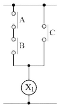

② 무접점 회로

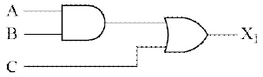

(2)

① 유접점 회로

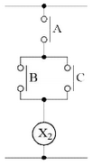

② 무접점 회로

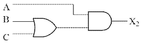

## 부분점수

| 점수 | 세부기준                                |
| ---- | --------------------------------------- |
| 6점  | (1), (2)번이 모두 맞은 경우 6점 획득    |
| 3점  | (1), (2)번 중 하나만 맞은 경우 3점 획득 |

## 해설: 논리식 유도

- **X₁ 출력**: A와 B를 같이 ON하거나 C를 ON할 때 X₁ 출력 이는 `(A AND B를 ON) OR (C를 ON)` 과 같습니다. 따라서 논리식은 다음과 같습니다.

$$ (AB) + C = X_1 $$

- **X₂ 출력**: A를 ON하고 B 또는 C를 ON할 때 X₂ 출력. 이는 `(A를 ON) AND (B OR C를 ON)` 과 같습니다. 따라서 논리식은 다음과 같습니다.

$$ A(B+C) = X_2 $$

---

# Q7 다음 고압 배전선의 구성과 관련된 미완성 환상(루프)식 배전 간선의 단선도를 완성하시오. [배점: 4점]

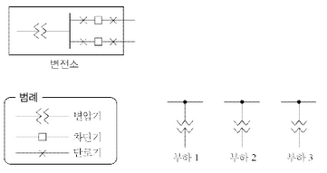

---

# 해설) 논리회로 / 난이도 中

## 정답

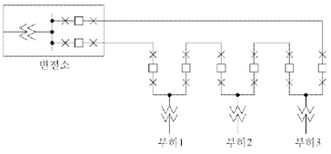

## 부분점수

| 점수 | 세부기준                             |
| ---- | ------------------------------------ |
| 4점  | 단선도를 정확하게 그린 경우 4점 획득 |
| 0점  | 단선도에 오류가 있는 경우 0점        |

## 해설

### 환상식(loop system)

루프 배선의 이점은 선로의 도중에 고장 발생 시, 고장개소의 분리조작이 용이하여 그 부분을 빨리 분리시킬 수 있고 전류의 통로에 융통성이 있으므로 전력 손실과 전압강하가 적다.

### 순수 환상 방식

1. 동일 변전소 동일 뱅크에서 2회선으로 상시 공급(설비 구성 고가)한다.
2. 선로 고장 시 고장 구간 양측의 계전기를 통해 차단기를 동작한다.
3. 건전 선로에 의한 수용가 무정전 공급이 가능하다.

### 개방 환상 방식

1. 동일 변전소 동일 뱅크 또는 변전소나 뱅크를 달리하여 양 계통을 연계하고 선로 부하 중심을 상시 개방 운전한다.
2. 선로 고장 시 고장점 탐색 및 개폐기 조작 방식에 따라 정전시간이 좌우된다.

---

# Q8 용량 10[kV], 철손 120[W], 전부하 동손 200[W]인 단상 변압기 2대를 V결선하여 부하를 걸었을 때, 전부하 효율은 몇 [%]인지 계산하시오. (단, 부하의 역률은 $\frac{1}{2}$이다.) [배점: 5점]

[계산과정]

[정답]

---

# 해설) 단순 계산형 / 난이도 중

## 정답

[계산과정]

$$ \eta = \frac{\sqrt{3}V_2I_2\cos\theta_2}{\sqrt{3}V_2I_2\cos\theta_2 + 2P_i + 2m^2P_c} \times 100 $$

$$ = \frac{\sqrt{3 \times 10 \times 0.5}}{(\sqrt{3 \times 10 \times 0.5}) + (2 \times 0.12) + (2 \times 1^2 \times 0.2)} \times 100 \approx 93.12 [\%] $$

[정답] 93.12 [%]

## 부분점수

| 점수 | 세부기준                                  |
| ---- | ----------------------------------------- |
| 5점  | 계산과정과 정답이 모두 맞은 경우 5점 획득 |
| 0점  | 계산과정이나 정답에 오류가 있는 경우 0점  |

## 해설

단상 변압기 2대를 V결선하였으므로, 철손과 동손은 1대 분량의 2배를 하여야 한다.

## 변압기 효율

$$ \eta = \frac{\text{출력}}{\text{출력 + 손실}} \times 100 = \frac{\sqrt{3}P_o\cos\theta}{\sqrt{3}P_a\cos\theta + 2P_i + 2m^2P_c} \times 100 [%] $$

- 동손(부하손): 부하율의 제곱에 비례한다.
- 철손(무부하손): 부하율과 무관하다.

---

# Q9 어떤 회로의 전압을 측정했더니 103 [V] 이었다. 보정율이 -0.8[%]일 경우 회로의 전압 [V]을 계산하시오. [배점: 5점]

[계산과정]

측정 전압: 103 V
보정율: -0.8%

보정된 전압은 다음과 같이 계산할 수 있습니다.

$$ V*{보정} = V*{측정} \times (1 + 보정율) $$

$$ V\_{보정} = 103 \times (1 - 0.008) = 103 \times 0.992 = 102.176 V $$

따라서 보정된 회로의 전압은 102.176 V 입니다.

[정답] 102.176 V

---

해설) 단순 계산형 / 난이도 下

정답

[계산과정]

$$ \% 보정 = \frac{보정값}{측정값} \times 100 = \frac{참값 - 측정값}{측정값} \times 100 = \frac{103 - 103}{103} \times 100 = -0.8 $$

$$ \therefore 참값 = \frac{-0.8}{100} \times 103 + 103 = 102.18 [V] $$

[정답] 102.18[V]

부분점수

| 점수 | 세부기준                                  |
| ---- | ----------------------------------------- |
| 5점  | 계산과정과 정답이 모두 맞은 경우 5점 획득 |
| 0점  | 계산과정이나 정답에 오류가 있는 경우 0점  |

해설

① 오차 = 측정값 - 참값

$$ ② 오차율 = \frac{오차}{참값} \times 100 = \frac{측정값 - 참값}{참값} \times 100 [%] $$

③ 보정값 = 참값 - 측정값

$$ ④ 보정률 = \frac{보정값}{측정값} \times 100 = \frac{참값 - 측정값}{측정값} \times 100 [%] $$

---

# Q10 지름이 20[cm]의 구형 외구의 광속발산도가 2,000 [rlx] 이다. 이 외구의 중심에 있는 균등 점광원의 광도 [cd]를 계산하시오. (단, 외구의 투과율은 90[%]이다.) [배점: 5점]

[계산과정]

[정답]

---

해설) 단순 계산형 / 난이도 중

정답

[계산과정]

$$ 광도 I = R \times \frac{r^2}{\tau} \times (1 - \rho) = \frac{2000 \times \left( \frac{10 \times 10^{-2}}{2} \right) \times (1 - 0)}{0.9} \approx 22.22 [cd] $$

[정답] 22.22 [cd]

부분점수

| 점수 | 세부기준                                  |
| ---- | ----------------------------------------- |
| 5점  | 계산과정과 정답이 모두 맞은 경우 5점 획득 |
| 0점  | 계산과정이나 정답에 오류가 있는 경우 0점  |

해설

$$ 반지름은 r = \frac{d}{2} [m] 이고, $$

$$ 광속발산도 R = \tau \cdot \frac{I}{r^2} 또는 R = \frac{F}{S} \times \eta = \frac{4\pi r^2}{4\pi r^2} \times \frac{\tau}{1 - \rho} = \frac{I}{r^2} \times \frac{\tau}{1 - \rho} [rlx] $$

$$ 광도는 I = R \times \frac{r^2}{\tau} [cd] 이고, 투과면에서의 광속발산도 R = \tau E = \tau \cdot \frac{I}{r^2} [rlx] $$

$$ (여기서, r: 구의 반지름, I: 광도(완전 확산성 구형 글로브 중심의 점광원), \eta: 글로브 효율, \tau: 투과율, \rho: 반사율이다.) $$

---

# Q11 4[L]의 물을 15[℃]에서 90[℃]까지 온도를 높이는 데 1[kW]의 전열기로 25분간 가열하였다. 이 전열기의 효율 [%]을 계산하시오. (단, 물의 비열은 1[kcal/kg · ℃]이다.) [배점: 5점]

[계산과정]

[정답]

---

해설) 단순 계산형 / 난이도 下

정답

[계산과정]

$$ 전열기의 용량 P = \frac{mCT}{860 \cdot t \cdot \eta} [kW] $$

$$ 전열기의 효율 \eta = \frac{mC(T_2 - T_1)}{860 \cdot t \cdot P} = \frac{4 \times 1 \times (90 - 15)}{860 \times \frac{25}{60} \times \frac{1}{2}} = 0.8372 = 83.72 [%] $$

[정답] 83.72[%]

부분점수

| 점수 | 세부기준                                  |
| ---- | ----------------------------------------- |
| 5점  | 계산과정과 정답이 모두 맞은 경우 5점 획득 |
| 0점  | 계산과정이나 정답에 오류가 있는 경우 0점  |

해설

P = $\frac{mCT}{860 \cdot t \cdot \eta}$ [kW]

m: 질량 [kg], C: 비열[kcal/kg $\cdot$ °C], T: 온도차[°C]

t: 시간[hour], $\eta$: 전열기의 효율[%]

---

# Q12 3상 4선식에서 역률 100[%]의 부하가 각 상과 중성선 간에 연결되어 있다. 각 상에 흐르는 전류 $I_a, I_b, I_c$가 각각 10[A], 8[A], 9[A]이다. 이때 중성선에 흐르는 전류의 절댓값을 계산하시오. (단, 각 상 전류의 위상차는 120°이다.) [배점: 5점]

[계산과정]

[정답]

()

---

## 정답 해설

해설) 단순 계산형 / 난이도 중

[계산 과정]

중성선에 흐르는 전류

$$ I_n = I_a + I_b + I_c = 10\angle0^\circ + 8\angle-120^\circ + 9\angle-240^\circ = \sqrt{3}\angle30^\circ $$

$$ **[정답]** \sqrt{3} [A] 또는 1.73 [A] $$

부분 점수

| 점수 | 세부 기준                                  |
| ---- | ------------------------------------------ |
| 5점  | 계산 과정과 정답이 모두 맞는 경우 5점 획득 |
| 0점  | 계산 과정이나 정답에 오류가 있는 경우 0점  |

접근 POINT

3상 4선식 중성선에 흐르는 전류는 3상 전류의 전류 합(벡터합)이다. 만약 3상이 대칭이면 중성선에 흐르는 전류는 '0'이 되고, 불평형 또는 고장 시에는 중성선에는 전류가 흐르게 되어 통신선 유도 장해 등이 나타나게 된다.

해설

3상 4선식에서 중성선에 흐르는 전류: 각 상 전류의 합

$$ I_n = I_a + I_b + I_c 각 상 전류 = 기본파 + 제3고조파(영상분) $$

중성선에 흐르는 전류 = 각 상 불평형에 의한 전류 + 각 상에 포함된 고조파 전류(기본파는 3상 대칭으로 상쇄됨)

제3고조파 전류는 중성선에 3배 크기로 확대되어 나타남 → 통신선 유도 장해, 중성선 과열

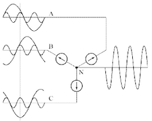

계산 과정에서 C상 전류 $9\angle-240^\circ$를 $9\angle120^\circ$로 바꿔서 계산해도 된다.

---

# Q13 Y결선된 평형부하의 전압을 측정한 결과 전압계의 지시값이 상전압은 $V_p$ = 150[V], 선간전압은 $V_l$ = 220[V] 이었다. 다음 각 물음에 답하시오. (단, 부하 측에 인가된 전압은 각 상의 평형전압이고 기본파와 제3고조파분 전압만이 포함되어 있다.) [배점: 5점]

(1) 제3고조파 전압 [V]을 계산하시오.

[계산과정]

[정답]

(2) 전압의 왜형률 [%]을 계산하시오.

[계산과정]

[정답]

---

# 정답

해설) 복합 계산형 / 난이도 상

[계산과정]

(1) 제3고조파 전압 [V]

상전압 $V_ρ$에는 기본파와 제3고조파 전압만 존재하므로

$$ V_ρ = \sqrt{V_1^2 + V_3^2}, 150 = \sqrt{V_1^2 + V_3^2} ① $$

선간전압 $V_L$에는 제3고조파분이 존재하지 않으므로

$$ V_L = \sqrt{3}V_1, 220 = \sqrt{3}V_1 ② $$

식 ①, ②에서

$$ V_1 = \frac{220}{\sqrt{3}} = 127.02 [V] $$

$$ \therefore V_3 = \sqrt{150^2 - V_1^2} = \sqrt{150^2 - 127.02^2} = 79.79 [V] $$

[정답] 79.79 [V]

(2) 전압의 왜형률 [%]

[계산과정]

$$ 왜형률 = \frac{\text{제3고조파 실효값}}{\text{기본파 실효값}} \times 100 = \frac{V_3}{V_1} \times 100 = \frac{79.79}{127.02} \times 100 = 62.82 [\%] $$

[정답] 62.82 [%]

부분점수

| 점수 | 세부기준                             |
| ---- | ------------------------------------ |
| 5점  | (1), (2)번이 모두 맞은 경우 5점 획득 |
| 3점  | (1)번만 맞은 경우 3점 획득           |
| 2점  | (2)번만 맞은 경우 2점 획득           |

해설

제3고조파 전압을 구한 후 그 값을 이용하여 전압의 왜형률을 계산한다.

$$ 상전압과 고조파의 관계식 V_ρ = \sqrt{V_1^2 + V_3^2} $$

$$ 왜형률 = \frac{\text{제3고조파 실효값}}{\text{기본파 실효값}} \times 100 [\%] $$

---

# Q14 특성임피던스가 $Z_0$ = 600 [\Omega]이고 거리가 L [km]인 무손실 장거리 송전선로의 전파속도가 v = 300,000 [km/sec]이며, 주파수는 60 [Hz]이다. 수전단에 부하 $Z_L$을 접속한 경우 다음 물음에 답하시오.

[배점: 8점]

**(1) 1[km]당 인덕턴스 L [H/km]와 정전용량 C [F/km]을 계산하시오.**

[계산과정]

[정답]

**(2) 파장 [m]을 계산하시오.**

[계산과정]

[정답]

(3) 송전단에서 부하 측으로 본 합성 임피던스를 계산하시오.

[계산과정]

[정답]

---

# 정답

해설) 복합 계산형 / 난이도 上

(1) 인덕턴스 L[H/km]와 정전용량 C[F/km]

[계산과정]

전파속도 $v = \frac{1}{\sqrt{LC}}$ 이고, 특성임피던스 $Z_0 = \sqrt{\frac{L}{C}}$ 이므로

- 인덕턴스 $L = \frac{Z_0}{v} = \frac{600}{3 \times 10^5} = 2 \times 10^{-3}$ [H/km]

- 정전용량 $C = \frac{1}{v Z_0} = \frac{1}{(3 \times 10^5) \times 600} = 5.55 \times 10^{-9} $[F/km]

[정답] $L = 2 \times 10^{-3}$ [H/km], $C = 5.55 \times 10^{-9}$ [F/km]

(2) 파장[m]

[계산과정]

$$ v = f\lambda \rightarrow \lambda = \frac{v}{f} = \frac{300000 \times 10^3}{60} = 5 \times 10^6 \text{ [m]} $$

[정답] $5 \times 10^6 $ [m]

(3) 송전단에서 부하 측으로 본 합성 임피던스[Ω]

[계산과정]

$Z_l = Z_0 $일 때 반사계수$ \Gamma = \frac{Z_l - Z_0}{Z_l + Z_0} = 0 $이므로 송전단에서 본 임피던스는 $Z_0$ 와 같다.

[정답] 600 [Ω]

부분점수

| 점수 | 세부기준                                    |
| ---- | ------------------------------------------- |
| 8점  | (1), (2), (3)번이 모두 맞은 경우 8점 획득   |
| 4점  | (1)번만 맞은 경우 4점 획득                  |
| 2점  | (2), (3)번은 한 문제가 맞을 때마다 2점 획득 |

해설

무손실 선로에서의 특성 임피던스 계산

$$ Z*0 = \sqrt{\frac{L}{C}} = 138 \log*{10} \frac{D}{r} = 600 \text{ [Ω]} $$

$$ \log\_{10} \frac{D}{r} = \frac{600}{138} $$

인덕턴스

$$ L = 0.05 + 0.4605 \log\_{10} \frac{D}{r} = 0.05 + 0.4605 \times \frac{600}{138} = 2.05 \text{ [mH/km]} = 2.05 \times 10^{-3} \text{ [H/km]} $$

커패시터

$$ C = \frac{0.02413}{\log\_{10} \frac{D}{r}} = \frac{0.02413}{\frac{600}{138}} = 5.55 \times 10^{-3} \text{ [µF/km]} = 5.55 \times 10^{-9} \text{ [F/km]} $$

특성임피던스

$$ Z_0 = \sqrt{\frac{Z}{Y}} = \sqrt{\frac{r + j\omega L}{g + j\omega C}} $$

무손실 선로인 경우 r = g = 0 이므로

$$ Z*0 = \sqrt{\frac{L}{C}} = \sqrt{\frac{0.4605 \log*{10} \frac{D}{r} \times 10^{-3}}{0.02413 \times 10^{-6}}} = 138 \log\_{10} \frac{D}{r} \text{ [Ω]} $$

인덕턴스와 정전용량

$$ 인덕턴스 L = 0.05 + 0.4605 \log*{10} \frac{D}{r} \approx 0.4605 \log*{10} \frac{D}{r} = 0.4605 \times \frac{Z_0}{138} \text{ [mH/km]} $$

$$ 정전용량 C = \frac{0.02413}{\log\_{10} \frac{D}{r}} = \frac{0.02413}{\frac{Z_0}{138}} \text{ [µF/km]} $$

---

# Q15 수전단 전압이 3,000 [V]인 3상 3선식 배전선로의 수전단에 역률이 0.8(지상)되는 520 [kW]의 부하가 접속되어 있다. 이 부하에 동일한 역률의 부하 80 [kW]를 추가하여 600 [kW]로 증가시키되 부하와 병렬로 콘덴서를 설치하여 수전단 전압 및 선로전류를 변하지 않게 유지하고자 한다. 이때 필요한 소요 콘덴서 용량 및 부하 증가 전후의 송전단 전압을 계산하시오. (단, 전선의 1선당 저항 및 리액턴스는 각각 1.78[Ω], 1.17[Ω]이다.) [배점: 9점]

(1) 이 경우 필요한 전력용 콘덴서 용량은 몇 [kVA]인가?

[계산과정]

(2) 부하 증가 전의 송전단 전압은 몇 [V]인가?

[계산과정]

(3) 부하 증가 후의 송전단 전압은 몇 [V]인가?

[계산과정]

---

# 정답 해설

(1) 전력용 콘덴서 용량 [kVA]

[계산과정]

$$ 부하 용량 P_1 = 520 = \sqrt{3}V_r I \cos\theta_1, P_2 = 600 = \sqrt{3}V_r I \cos\theta_2 $$

수전단 전압($V_r$) 및 선로전류(I)는 일정하다.

$$ V_r I = \frac{P_1}{\sqrt{3}\cos\theta_1} = \frac{P_2}{\sqrt{3}\cos\theta_2} 에서 \cos\theta_2 = \frac{P_2}{P_1}\cos\theta_1 = \frac{600}{520} \times 0.8 = 0.92 $$

커패시터의 용량

$$ Q_c = P_2(\tan\theta_1 - \tan\theta_2) = 600 \times \left( \frac{0.6}{0.8} - \frac{\sqrt{1 - 0.92^2}}{0.92} \right) = 194.40[kVA] $$

[정답] 194.40 [kVA]

(2) 부하 증가 전의 송전단 전압 [V]

[계산과정]

$$ V\_{s1} = V_r + \frac{P_1}{V_r}(R + X\tan\theta_1) $$

$$ = 3000 + \frac{520 \times 10^3}{3000} (1.78 + 1.17 \times \frac{0.6}{0.8}) = 3460.64[V] $$

$$ \because 520[kW] = 520 \times 10^3[W] $$

[정답] 3460.63 [V]

(3) 부하 증가 후의 송전단 전압 [V]

[계산과정]

$$ V\_{s2} = V_r + \frac{P_2}{V_r}(R + X\tan\theta_2) $$

$$ = 3000 + \frac{600 \times 10^3}{3000} (1.78 + 1.17 \times \frac{\sqrt{1 - 0.92^2}}{0.92}) = 3455.68[V] $$

$$ \because 520[kW] = 520 \times 10^3[W] $$

[정답] 3455.68 [V]

부분점수

| 점수 | 세부기준                                       |
| ---- | ---------------------------------------------- |
| 9점  | (1), (2), (3)번이 모두 맞은 경우 9점 획득      |
| 3점  | (1), (2), (3)번 중 하나 맞을 때마다 3점씩 획득 |

해설

아래 관계식을 적용하여 차례대로 풀이한다.

부하 용량 $P = \sqrt{3}V_r I \cos\theta [W] V_r I = \frac{P}{\sqrt{3}\cos\theta} $

전력용 콘덴서 용량 $Q_c = P(\tan\theta_1 - \tan\theta_2) $

송전단 전압 $V_s = V_r + \frac{P}{V_r}(R + X\tan\theta) $

---

# Q16 인텔리전트 빌딩에 대한 등급별 추정 전원 용량에 대한 다음 표를 이용하여 각 물음에 답하시오.

표 1. 등급별 추정 전원 용량 [VA/m²]

| 내용            | 0등급   | 1등급   | 2등급   | 3등급   |
| --------------- | ------- | ------- | ------- | ------- |
| 조명            | 32      | 22      | 22      | 29      |
| 콘센트          | -       | 13      | 5       | 5       |
| 사무자동화 기기 | -       | -       | 34      | 36      |
| 일반 동력       | 38      | 45      | 45      | 45      |
| 냉방 동력       | 40      | 43      | 43      | 43      |
| 사무자동화 동력 | -       | 2       | 8       | 8       |
| **합계**        | **110** | **125** | **157** | **166** |

(1) 연면적 10,000 [m²]인 인텔리전트 2등급 사무실 빌딩의 전력설비 용량을 표 1을 이용하여 계산하시오.

(2) (1)에서 조명, 콘센트, 사무자동화 기기의 적정 수용률은 0.7, 일반 동력 및 사무자동화 동력의 적정 수용률은 0.5, 냉방 동력의 적정 수용률은 0.8이고, 주변압기 부등률은 1.2로 적용한다. 2단 강압방식으로 채택할 경우 변압기의 용량에 따른 변전설비의 용량을 계산하시오. (단, 조명, 콘센트, 사무자동화 기기를 3상 변압기 1대로, 일반 동력 및 사무자동화 동력을 3상 변압기 1대로, 냉방 동력을 3상 변압기 1대로 구성하고 상기 부하에 대한 주변압기를 1대 사용하도록 하며, 변압기 용량은 다음 표에서 정한다.)

표 2. 3상 변압기 용량표 [kVA]

| 75  | 100 | 150 | 200 | 250 | 300 | 400 | 500 | 750 | 1,000 |
| --- | --- | --- | --- | --- | --- | --- | --- | --- | ----- |

(3) 주변압기부터 각 부하에 이르는 변전설비의 단선 계통도를 간단하게 그리시오.

---

# 해설) 순차적 문제 해결형 / 난이도 上

## 정답

(1) 면적을 적용한 부하용량 계산

| 부하내용        | 면적을 적용한 부하용량 [kVA]                                              |
| --------------- | ------------------------------------------------------------------------- |
| 조명            | 계산: $22 \times 10,000 \times 10^{-3} = 220$[kVA]   답: 220[kVA]      |
| 콘센트          | 계산: $5 \times 10,000 \times 10^{-3} = 50$[kVA]   답: 50[kVA]         |
| 사무자동화 기기 | 계산: $34 \times 10,000 \times 10^{-3} = 340$[kVA]   답: 340[kVA]      |
| 일반동력        | 계산: $45 \times 10,000 \times 10^{-3} = 450$[kVA]   답: 450[kVA]      |
| 냉방동력        | 계산: $43 \times 10,000 \times 10^{-3} = 430$[kVA]   답: 430[kVA]      |
| 사무자동화 동력 | 계산: $8 \times 10,000 \times 10^{-3} = 80$[kVA]   답: 80[kVA]         |
| **합계**        | 계산: $157 \times 10,000 \times 10^{-3} = 1,570$[kVA]   답: 1,570[kVA] |

(2) 변전설비의 용량 계산

① 조명, 콘센트, 사무자동화 기기

[계산과정]
$$ Tr_1 = (220 + 50 + 340) \times 0.7 = 427 [kVA] $$
[정답] 500[kVA] 선정

② 일반동력, 사무자동화 동력

[계산과정]
$$ Tr_2 = (450 + 80) \times 0.5 = 265 [kVA] $$
[정답] 300[kVA] 선정

③ 냉방동력

[계산과정]
$$ Tr_3 = 430 \times 0.8 = 344 [kVA] $$
[정답] 400[kVA] 선정

④ 주변압기 용량

[계산과정]
$$ \frac{427 + 265 + 344}{1.2} = 863.333 [kVA] $$
[정답] 1,000[kVA] 선정

(3) 변전설비의 단선 계통도

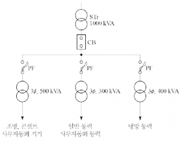

부분점수

| 점수  | 세부기준                                            |
| ----- | --------------------------------------------------- |
| 11점  | (1)~(3)이 모두 맞은 경우 11점 획득                  |
| 4~0점 | 문항 (1)의 표에서 정답 2열 당 1점씩 부분점수 부여   |
| 4~0점 | 문항 (2)의 소문항 하나 당 1점씩 부여                |
| 3점   | 문항 (3)의 단선도가 정답이면 3점, 오류가 있으면 0점 |

접근 POINT

부하용량(설비용량)과 수용률을 통해서 변압기 용량을 산출하는 문제이다. 2단 강압 방식(주변압기 + 2차 변압기)으로서 부등률은 주변압기 용량 산출 시 적용한다.

해설

[수용률]

① 표현식: $\frac{최대수요전력}{설비용량의 합계} \times 100[\%] $

② 의미: 부하가 동시에 사용되는 정도 → 설비용량의 합계와 최대수요전력이 차이가 나는 이유는 전 부하가 동시에 사용되는 경우는 거의 없기 때문이다.

[부등률]

① 표현식: $\frac{최대수요전력의 합}{합성최대전력} $

② 의미: 최대수요 전력의 발생 시기의 분산

[변압기 용량 [kVA]]

$$ \frac{설비용량 \times 수용률 \times 여유도}{역률 \times 부등률 \times 효율} 에서 변압기 용량은 피상전력 [kVA]으로 나타낸다. $$

[2단 강압 방식(대규모 건축물, 큰 부하전류에서 사용)]

① 부하증설 및 변동에 대한 대처가 빠르다.
② 여러 종류의 전압 사용이 용이하다.
③ 대용량 부하에 대응이 쉽다.
④ 변전실 면적이 크고 공사비가 증가한다.
⑤ 전력손실이 크다.

---

# Q17 다음 결선도는 하루 중 설정시간 동안 운전(수동 및 자동)하는 Y-△ 배기팬의 MOTOR 결선도 및 조작회로이다. 다음 물음에 답하시오. [배점: 7점]

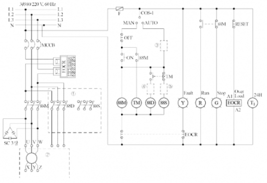

(1) 위의 결선도의 ①, ② 부분의 누락된 회로를 직접 완성하시오.

(2) 위의 결선도의 ③, ④, ⑤ 부분의 미완성 부분의 접점을 그리고 그 접점 기호를 표기하시오.

[정답]

(3) ③∼⑤ 의 접점 명칭을 작성하시오.

[정답]

(4) 완성된 결선도를 기준으로 Time chart를 완성하시오.

[정답]
| 시간 | ON | OFF | 88M | 88S | 88D | Run |
|---|---|---|---|---|---|---|
| t_1 | □ | | | | | |
| t_2 | | □ | | | | |
| t_3 | | □ | | | | |
| t_4 | | □ | | | | |
| t_5 | □ | | | | | |

(□는 해당 시간대의 신호 상태를 나타내는 기호입니다. 실제 그림을 참고하여 채워넣어야 합니다.)

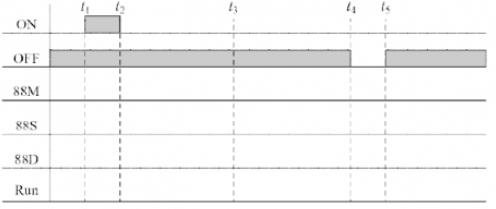

---

# 해설) 도면 작성 / 난이도 상

## 정답

(1) 결선도 완성

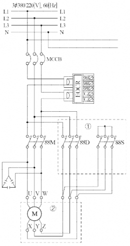

(2) ③ 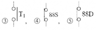

(3) 한시동작 순시복귀 a접점

(4) Time chart 완성

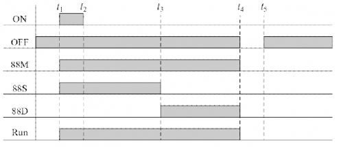

## 부분점수

| 점수 | 세부기준                                               |
| ---- | ------------------------------------------------------ |
| 7점  | (1)~(4)이 모두 맞은 경우 7점 획득                      |
| 2점  | (1) 결선도를 전부 맞게 그린 경우 2점 획득              |
| 2점  | (2)번이 모두 맞은 경우 2점, 1~2개가 맞은 경우 1점 획득 |
| 1점  | (3)번이 맞은 경우 1점 획득                             |
| 2점  | (4)번이 맞은 경우 2점 획득                             |

## 해설

(1) 소문항은 순차적으로 문제를 해결한다.

① 오른쪽 제어회로에서 PB1을 누를 경우 동작하는 MC는 88M과 88S로 88M은 콘덴서가 연결되어 있으므로 88S가 Y결선측(기동)이며, 타이머 시간이 경과 후 동작하는 MC는 88D로 Δ결선측(운전)이다. (주회로)

② 제어회로 쪽에서 자동(Auto) 모드로 동작하기 위해서는 타이머 T1의 a 접점을 사용해야 하고, 88S와 88D는 동시에 동작하면 상간단락이 일어나므로 인터록(Inter-lock)회로로 구성하기 위해 상대방의 전원 앞에 자신의 b접점을 연결한다.

(2) 소문항은 PB-ON의 누름으로 동작을 시작하여 88M은 초기화 전까지 동작하며, 88S가 먼저 동작 후 TM의 설정된 시간이 지나면 88D가 동작한다. PB-OFF의 동작으로 초기화하는 타임차트를 작성한다.

---
