# Q1 케이블 배선의 시설 가능 여부를 시설장소에 따라 답안지 표의 빈칸에 O, X로 표시하시오. [배점: 5점]

## [정답]

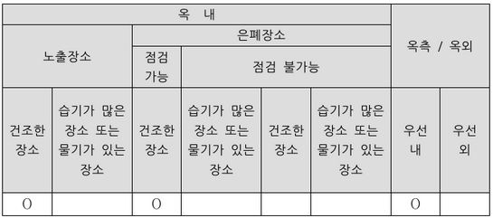

---

## 해설) 단답 암기형 / 난이도 중

### 정답

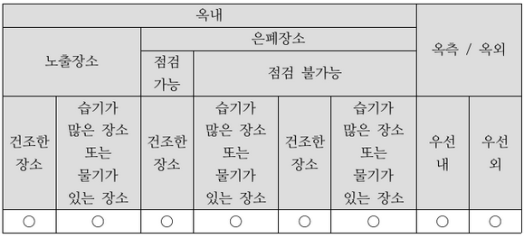

### 부분점수

| 점수  | 세부기준                           |
| ----- | ---------------------------------- |
| 5~0점 | 빈칸 총 5개 중 정답 1개당 1점 획득 |

### 해설

모두 시설 가능한 배선: 금속관 배선, 합성수지관(CD관 제외), 비닐 피복 2종 가요전선관, 케이블 배선, 케이블 트레이 배선

---

# Q2 다음 PLC 래더 다이어그램을 이용하여 논리회로를 그리시오. (단, 입력 2개, 출력 1개로 이루어진 AND, OR, NOT 게이트를 조합하여 표현한다.) [배점: 4점]

[정답]

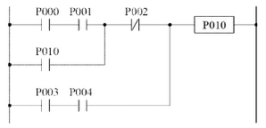

---

## 해설) 논리회로 / 난이도 中

정답

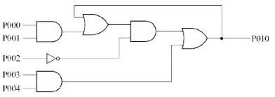

부분점수

| 점수 | 세부기준                                                  |
| ---- | --------------------------------------------------------- |
| 4점  | 논리 회로도가 정답과 모두 맞은 경우 4점 획득              |
| 0점  | 논리 회로도가 정답과 다른 곳이 있으면 0점 (부분점수 없음) |

해설

문제의 PLC 래더도를 논리식으로 바꾸면 다음과 같다.

$$ P010 = (((P000 \cdot P001) + P010) \cdot P002) + P003 \cdot P004 $$

---

# Q3 전기안전관리자는 다음의 계측장비를 주기적으로 교정하고 또한 안전장구의 성능을 적정하게 유지할 수 있도록 시험하여야 한다. 다음 표의 권장 교정 및 시험주기는 몇 년인지 작성하시오. [배점: 5점]

| 구분                              | 권장 교정주기(년) |
| --------------------------------- | ----------------- |
| 계전기 시험기                     | ①                 |
| 적외선 열화상 카메라              | ②                 |
| 회로시험기                        | ③                 |
| 절연저항 측정기 (500[V], 100[MΩ]) | ④                 |
| 클램프 미터                       | ⑤                 |

[정답]

①

②

③

④

⑤

---

## 해설) 단답 암기형 / 난이도 下

### 정답

| 구분                              | 권장 교정주기(년) |
| --------------------------------- | ----------------- |
| 계전기 시험기                     | 1                 |
| 적외선 열화상 카메라              | 1                 |
| 회로시험기                        | 1                 |
| 절연저항 측정기 (500[V], 100[MΩ]) | 1                 |
| 클램프 미터                       | 1                 |

### 부분점수

| 점수 | 세부기준                                       |
| ---- | ---------------------------------------------- |
| 5점  | 소문항 총 5개가 정답과 모두 맞은 경우 5점 획득 |
| 1점  | 소문항 총 5개 중 정답 1개당 부분 점수 1점 획득 |

### 해설

[전기안전관리자의 직무에 관한 고시] 제9조 (계측장비 교정 등)

전기안전관리자는 전기설비의 유지·운용 업무를 위해 다음의 계측장비를 주기적으로 교정하고 또한 안전장구의 성능을 적정하게 유지할 수 있도록 시험을 하여야 한다.

| 구분                                | 권장 교정주기(년) |
| ----------------------------------- | ----------------- |
| 계전기 시험기                       | 1                 |
| 절연내력 시험기                     | 1                 |
| 절연유 내압 시험기                  | 1                 |
| 적외선 열화상 카메라                | 1                 |
| 전원품질분석기                      | 1                 |
| 절연저항 측정기 (500[V], 100[MΩ])   | 1                 |
| 절연저항 측정기 (1000[V], 2000[MΩ]) | 1                 |
| 회로시험기                          | 1                 |
| 접지저항 측정기                     | 1                 |
| 클램프 미터                         | 1                 |
| 특고압 COS(컷아웃스위치) 조작봉     | 1                 |
| 저압검전기                          | 1                 |
| 고압·특고압 검전기                  | 1                 |
| 절연장화                            | 1                 |
| 절연안전모                          | 1                 |

---

# Q4 설계감리업무 수행지침에 따라 설계감리원은 필요한 경우 다음 각 호의 문서를 비치하고, 그 세부 양식은 발주자의 승인을 받아 설계감리과정을 기록하여야 하며, 설계감리 완료와 동시에 발주자에게 제출하여야 한다. 다음 보기 중 비치하지 않아도 되는 문서 3가지를 고르시오. [배점: 5점]

[보기]

- 공사 기성 신청서
- 공사 예정 공정표
- 근무상황부
- 설계감리 검토의견 및 조치 결과서
- 설계감리 주요 검토 결과
- 설계도서 검토의견서
- 설계도서(내역서, 수량산출 및 도면)를 검토한 근거서류
- 설계수행계획서
- 설계자와 협의 사항 기록부
- 해당 용역 관련 수발신 공문서 및 서류

[정답]

- ①
- ②
- ③

---

# 해설) 단답 암기형 / 난이도 중

정답

1. 공사 기성 신청서
2. 공사 예정 공정표
3. 설계수행계획서

부분점수

| 점수  | 세부기준                                       |
| ----- | ---------------------------------------------- |
| 5점   | 소문항 총 3개가 정답과 모두 맞은 경우 5점 획득 |
| 4~0점 | 소문항 총 3개 중 정답 1개 2점, 2개 4점 획득    |

해설

산업통상자원부 [설계감리업무 수행지침] 제8조 (설계용역의 관리)

설계감리원은 필요한 경우 다음 각 호의 문서를 비치하고, 그 세부양식은 발주자의 승인을 받아 설계감리과정을 기록하여야 하며, 설계감리 완료와 동시에 발주자에게 제출하여야 하며, 필요한 경우 전자매체(CD-ROM)로 제출할 수 있다.

- 설계도서 검토의견서
- 설계감리 지시부
- 설계자와 협의사항 기록부
- 설계감리일지
- 근무상황부
- 설계관리 주요검토결과
- 설계감리 기록부
- 설계감리 추진현황
- 설계도서 검토의견 및 조치결과서
- 해당 용역관련 수·발신 공문서 및 서류
- 설계도서(내역서, 수량산출 및 도면)를 검토한 근거서류
- 그 밖에 발주자가 요구하는 서류

---

# Q5 다음은 △-Y 결선방식의 주변압기 보호에 사용되는 비율 차동계전기를 간략화한 회로도이다. 주변압기 1차 및 2차 측 변류기(CT)의 미결선된 2차 회로를 직접 완성하시오. (단, 접지가 필요한 곳에 접지 기호를 함께 그리시오.) [배점: 5점]

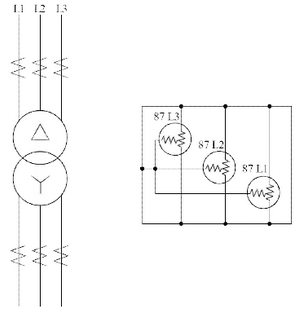

위 그림은 △-Y 결선방식 주변압기 보호 회로의 일부를 보여줍니다. 1차측과 2차측의 CT 2차측 회로를 완성하고 접지가 필요한 부분에 접지 기호를 추가해야 합니다. 정답은 그림에 제시된 회로도를 참고하여 완성해야 합니다.

---

# 해설) 도면작성 / 난이도 中

## 부분점수

| 점수    | 세부기준                                                  |
| ------- | --------------------------------------------------------- |
| 5점~0점 | 도면작성 문제는 동작 또는 오동작으로 정답일 때만 5점 획득 |

## 접근 POINT

변압기에 사용되는 비율차동기의 결선방식에 대한 도면을 완성할 수 있는지를 확인하는 문제이다. 여기서는 변압기의 결선방법과 비율차동기의 결선방법이 다르다는 것을 알고, 결선방법에 맞게 CT를 연결할 수 있어야 한다.

## 해설

### 비율차동계전기

① 용도: 발전기나 변압기의 내부 고장에 대한 보호 목적으로 사용한다.

② 동작원리: 정상 상태에서는 1, 2차측 변류기의 2차 전류의 크기가 같아 동작 코일에 전류가 흐르지 않지만, 내부고장으로 변류기의 2차 전류의 크기가 달라지면 동작코일에 전류가 흘러 보호계전기가 동작한다.

③ 비율차동계전기의 결선방법: 변압기의 결선이 Y-$\Delta$면 비율차동계전기의 결선은 $\Delta$-Y로, 변압기의 결선이 $\Delta$-Y면 비율차동계전기의 결선은 Y-$\Delta$로 변압기의 결선방법과 반대로 결선한다.

④ 차동계전기 고유번호 정리

- 87: 전류차동계전기(비율차동계전기)
- 87B: 모선보호 차동계전기
- 87G: 발전기용 차동계전기
- 87T: 주변압기 차동계전기

---

# Q6 다음에서 설명하는 동작사항을 참고하여 주회로 및 제어회로의 미완성 결선도를 완성하시오. (단, 아래의 범례를 참고하여 접점기호와 명칭을 정확히 표시하시오.) [배점: 5점]

[동작사항]

1. PB₀을 누르면 MC₁, 여자되고 T₁ 여자되며, GL 점등되고, 전동기 M₁이 동작한다.
2. PB₀을 누른 후 손을 떼어도 MC₁은 자기유지 되어 전동기 M₁은 동작을 유지한다.
3. t₁초 후
   - MC₂, T₂, FR이 여자된다.
   - MC₂의 보조접점에 의하여 RL이 점등되며, FR의 b접점에 의해 YL이 점등되고 전동기 M₂가 동작한다.
   - FR의 설정 시간 간격으로 YL과 BZ가 교대로 동작한다.
   - MC₁과 T₁이 소자되어 GL이 소등되고 M₁은 정지한다.
   - T₁이 소자되어도 MC₂는 자기유지 되어 전동기 M₂는 동작을 유지한다.
4. t₂초 후 MC₂, T₂, FR이 소자되어 RL, YL이 소등되고 BZ가 정지하며 전동기 M₂가 정지한다.
5. 운전 중 PB₀을 누르면 모든 전동기는 정지한다.
6. EOCR이 동작하면 모든 회로가 차단되며 WL만 점등된다.
7. EOCR을 리셋(Reset)하면 초기 상태로 복귀된다.

[범례]

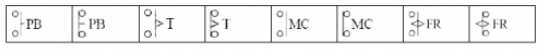

[미완성 결선도]

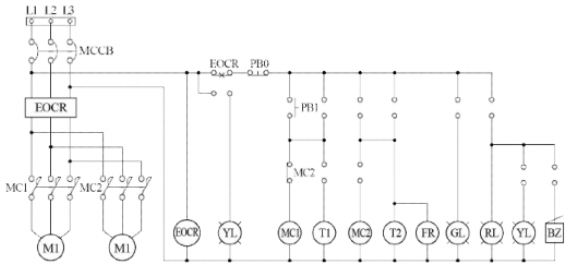

[정답]

---

# 해설) 도면작성 / 난이도 中

## 정답

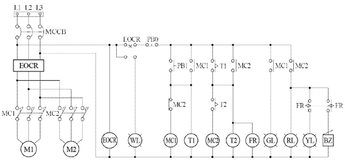

## 부분점수

| 점수    | 세부기준                                                  |
| ------- | --------------------------------------------------------- |
| 5점~0점 | 도면작성 문제는 동작 또는 오동작으로 정답일 때만 5점 획득 |

## 해설

[동작사항]을 이용한 도면을 완성하는 순서

1. MC1 자기유지회로 구성, MC1 여자시 GR 점등 => MC1의 a접점
2. t1초 후에 MC2, T2, FR 여자 => T1의 한시 a접점
3. MC2 여자시 MC1 소자 => MC2의 b접점, RL 점등 => MC2의 a접점
4. FR에 의해 YL 점등, 설정시간 간격으로 BZ와 교대동작 => FR의 a, b접점
5. t2초 후에 MC2, T2, FR 소자 => T2의 한시 b접점

---

# Q7 전동기 부하를 사용하는 곳의 역률을 개선하기 위하여 회로에 병렬로 역률 개선용 저압 콘덴서를 설치(Y결선)하여 전동기의 역률을 개선하려고 한다. 이때 역률을 90% 이상으로 유지하려고 할 경우 다음 물음에 답하시오. [배점: 5점]

(1) 정격전압 380 [V], 정격출력 18.5 [kW], 역률 70 [%]인 전동기의 역률을 90 [%]로 개선하고자 하는 경우, 필요한 3상 콘덴서의 용량 [kVA]을 계산하시오.

[계산과정]

[정답]

(2) 물음 (1)에서 구한 3상 콘덴서의 용량 [kVA]을 [µF]로 환산한 용량으로 계산하시오. (단, 정격주파수는 60 [Hz]로 계산한다.)

[계산과정]

[정답]

---

# 정답 해설

해설) 복합 계산형 / 난이도 중

(1) 3상 콘덴서의 용량 [kVA]

[계산과정]

$$ Q_c = 18.5 \times \left( \frac{\sqrt{1 - 0.7^2}}{0.7} - \frac{\sqrt{1 - 0.9^2}}{0.9} \right) \cong 9.91 \text{ [kVA]} $$

[정답] 9.91 [kVA]

(2) 3상 콘덴서의 용량 [kVA]를 [µF]로 환산한 용량

[계산과정]

$$ C = \frac{Q}{\omega V^2} = \frac{Q}{(2\pi f) \times V^2} = \frac{9.91 \times 10^3}{(2\pi \times 60) \times 380^2} \cong 182.04 \text{ [µF]} $$

[정답] 182.04 [µF]

부분점수

| 점수 | 세부기준                                                           |
| ---- | ------------------------------------------------------------------ |
| 5점  | 소문항 (1), (2) 총 2개의 계산과정과 정답이 모두 맞은 경우 5점 획득 |
| 2점  | 소문항 (1)의 계산과정과 정답이 모두 맞으면 2점 획득                |
| 3점  | 소문항 (2)의 계산과정과 정답이 모두 맞으면 3점 획득                |

해설

[전력용 콘덴서의 용량 계산식]

$$ Q = P(\tan\delta_1 - \tan\delta_2) = P \left( \frac{\sqrt{1 - \cos^2\delta_1}}{\cos\delta_1} - \frac{\sqrt{1 - \cos^2\delta_2}}{\cos\delta_2} \right) \text{ [VA]} $$

[커패시터의 용량]

△결선: $Q\_\Delta = 3 \times 2\pi f CE^2 = 3 \times 2\pi f CV^2 \text{ [VA]} $

Y결선: $Q_Y = 3 \times 2\pi f CE^2 = 3 \times 2\pi f C \left( \frac{V}{\sqrt{3}} \right)^2 = 2\pi f CV^2 \text{ [VA]} $

C: 전선 1선당 정전용량 [F], E: 상 전압 [V], V: 선간전압 (V), f: 주파수 [Hz]

---

# Q8 송전단 전압이 3,300 [V]인 변전소로부터 3 [km] 떨어진 곳까지 지중 송전으로 역률 0.8(지상) 1,000 [kW]의 3상 동력 부하에 전력을 공급한다. 이때 케이블의 허용전류(또는 안전전류) 범위 내에서 수전단 전압을 3,150 [V]로 유지하려고 할 경우 적정한 케이블을 선정하시오. (단, 도체(동선)의 고유저항은 $1.818 \times 10^{-2} [\Omega \cdot mm^2/m]$로 하고 케이블의 정전용량 및 리액턴스 등은 무시한다.) [배점: 5점]

[계산과정]

[정답]

---

# 정답 해설

해설: 복합계산형 / 난이도 中

## [계산과정]

$$ e = V_s - V_r = 3,300 - 3,150 = 150, R = \frac{e \times V_r}{P} = \frac{150 \times 3,150}{1000 \times 10^3} \approx 0.48 $$

$$ S = \rho \frac{l}{R} = (1.818 \times 10^{-2}) \times \frac{3}{0.48} \approx 113.63 [mm^2] $$

[정답] 120[mm²]을 선정

## 부분점수

| 점수 | 세부기준                                |
| ---- | --------------------------------------- |
| 5점  | 계산과정과 답이 모두 맞은 경우 5점 획득 |
| 0점  | 계산과정과 답 중 오류가 있으면 0점      |

## 해설

① **전압 강하**: $e = V_s - V_r = \frac{P}{V_r}(R + X \tan\theta) = \frac{P}{V_r}R$ (조건: 리액턴스 = 0(무시))

② **전선의 저항**: $e = \frac{P}{V_r}(R) \rightarrow R = \frac{e \times V_r}{P} $

③ **전선의 굵기**: $R = \rho \frac{l}{S} 에서 전선의 단면적은 S = \rho \frac{l}{R}$ 이다.

④ 전선의 규격

---

# Q9 냉각탑 플랫폼 위의 일직선 상 양쪽에 다음과 같이 자립형 등기구가 하나씩 설치되어 있다. 냉각탑 팬 모터 중앙의 수평면 조도 [lx]를 계산하시오. [배점: 5점]

[조건]

- 광원의 높이: 2.5[m]
- 플랫폼 크기: 가로 8[m], 세로 3[m]
- 광원에서 중앙 방향으로의 광도: 270[cd]

[냉각탑 팬]

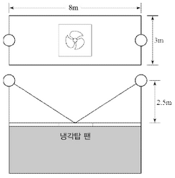

[계산과정]

[정답]

---

# 해설) 단순 계산형 / 난이도 下

## 정답

[계산과정]

조명 1개의 수평면 조도 : $E\_{h0} = \frac{I}{r^2} \cos\theta = \frac{270}{\sqrt{4^2 + 2.5^2}} \times \frac{2.5}{\sqrt{4^2 + 2.5^2}} \approx 6.42 $

중앙에서 수평면 조도(양쪽 조명) : $E*h = 2 \times E*{h0} = 2 \times 6.42 = 12.84 [lx] $

[정답] 12.84 [lx]

## 부분점수

| 점수 | 세부기준                                |
| ---- | --------------------------------------- |
| 5점  | 계산과정과 답이 모두 맞은 경우 5점 획득 |
| 0점  | 계산과정과 답 중 오류가 있으면 0점      |

## 해설

$$ 수평면 조도 E_h = \frac{I}{r^2} \cos\theta $$

$$ 수직면 조도 E_v = \frac{I}{r^2} \sin\theta $$

---

# Q10 한국전기설비규정에 따라 공칭전압이 154 [kV]인 중성점 직접접지식 전로의 절연내력을 시험하려고 한다. 시험전압과 시험방법에 대한 다음 각 물음에 답하시오. [배점: 5점]

(1) 절연내력 시험전압 [V]을 계산하시오. (단, 최대사용전압은 정격전압으로 한다.)
[계산과정]

[정답]

(2) 절연내력 시험방법을 설명하시오.

[정답]

---

# 정답 해설

해설) 단순 계산형+단답 암기형 / 난이도 下

(1) 절연내력 시험 전압

[계산과정]

공칭전압 154[kV]의 정격전압은 170[kV]이다.

중성점 직접 접지식 최대 사용전압의 범위가 60[kV] 초과 170[kV]이하 조건

$$ 170 \times 0.72 = 122.4 $$

[정답] 122.4[kV]

(2) 절연내력 시험 방법

122.4[kV]의 전압을 전로와 대지 사이에 연속하여 10분간 가한다.

부분점수

| 점수 | 세부기준                                                           |
| ---- | ------------------------------------------------------------------ |
| 5점  | 소문항 (1), (2) 총 2개의 계산과정과 정답이 모두 맞은 경우 5점 획득 |
| 3점  | 소문항 (1)의 계산과정과 정답이 모두 맞으면 3점 획득                |
| 2점  | 소문항 (2)의 정답이 맞으면 2점 획득                                |

해설

[154[kV] 케이블 전압 [IEC60840], [KS C3405]]

- 정격전압 $U_0$: 도체와 금속 시스 또는 도체와 대지 사이의 전압 = 87[kV]

* 공칭전압 U: 도체와 도체 사이 전압 = 154[kV]

  - 최고전압 $U_m$: 정상 사용 상태에서 언제 어디서나 유지될 수 있는 최고전압 = 170[kV]

[한국전기설비규정 132] 전로의 절연저항 및 절연내력

| 접지방식        | 최대 사용 전압           | 시험전압배수 | 최저시험전압 |
| --------------- | ------------------------ | ------------ | ------------ |
| 비접지          | 7[kV] 이하               | 1.5배        |              |
|                 | 7[kV] 초과 60[kV] 이하   | 1.25배       | 10,500[V]    |
| 중성점 비접지   | 60[kV] 초과              | 1.25배       |              |
| 중성점 접지     | 60[kV] 초과              | 1.1배        | 75[V]        |
| 중성점 직접접지 | 60[kV] 초과 170[kV] 이하 | 0.72배       |              |
|                 | 170[kV] 초과             | 0.64배       |              |
| 중성점 다중접지 | 7[kV] 초과 25[kV] 이하   | 0.92배       |              |

---

# Q11 선간전압이 200[V], 역률이 100[%], 효율이 100[%], 용량이 200[kVA]인 6펄스 3상 UPS에서 전원을 공급할 때 기본파 전류와 제5고조파 전류를 계산하시오. (단, 제5고조파 저감계수 $K_5$ = 0.5이다.) [배점: 5점]

(1) 기본파 전류 계산

[계산과정]

[정답]

(2) 제5고조파 전류 계산

[계산과정]

[정답]

---

# 정답

해설) 단순 계산형 / 난이도 下

(1) 기본파 전류

[계산과정]

$I_1 = \frac{P}{\sqrt{3} V_1} = \frac{200 \times 10^3}{\sqrt{3} \times 200} \doteq 577.35$

[정답] 577.35[A]

(2) 제5고조파 전류

[계산과정]

$I_5 = \frac{K_5 I_1}{5} = \frac{0.5 \times 577.35}{5} \doteq 57.74 $

[정답] 57.74[A]

## 부분점수

| 점수 | 세부기준                                                           |
| ---- | ------------------------------------------------------------------ |
| 5점  | 소문항 (1), (2) 총 2개의 계산과정과 정답이 모두 맞은 경우 5점 획득 |
| 2점  | 소문항 (1)의 계산과정과 정답이 모두 맞으면 2점 획득                |
| 3점  | 소문항 (2)의 계산과정과 정답이 모두 맞으면 3점 획득                |

## 해설

[3상 전력과 선전류 계산식]

$ P = \sqrt{3} V_L I_L \cos\theta = 3V_p I_p \cos\theta$ 에서 선전류 $I_L = \frac{P}{\sqrt{3} V_L \cos\theta} = \frac{P}{\sqrt{3} V_L \cos\theta} $

[UPS 시스템의 구성]

축전기, 정류기, 인버터로 구성

[6스텝(펄스) 3상 인버터의 전압]

① 구형파 형태의 전압으로 공급

② 6스텝의 고조파: $6n \pm 1 = 1, 5, 7, 11, 13, \dots $일 때, 푸리에 급수로 전개 시 홀수차 고조파만 존재한다.

[제고조파의 출력전압]

$$ 선간전압 v_L(t) = \sum \frac{2\sqrt{3}V_d}{\pi} \left( \frac{1}{n} \sin(n\omega t \pm 30^\circ) \right) $$

$$ 상전압 v_p(t) = \sum \frac{2V_d}{\pi} \left( \frac{1}{n} \sin(n\omega t) \right) $$

---

# Q12 어느 자가용 전기설비의 4상 고장 전류가 8[kA]이고 CT비가 50/5[A]일 때 변류기의 정격 과전류 강도(표준)는 얼마인지 계산하시오. (단, 사고 발생 후 0.2초 이내에 한전 차단기가 동작하는 것으로 한다.) [배점: 5점]

[계산과정]

변류기의 2차측 전류 $I_s$는 다음과 같이 계산됩니다.

$$ I_s = \frac{5}{50} \times 8000 = 800[A] $$

따라서, 변류기의 정격 과전류 강도는 800[A] 입니다.

[정답] 800[A]

()

---

## 정답 해설

(해설) 단순 계산형 / 난이도 下

[계산과정]

$S_n = S \times \sqrt{t} = \frac{8000}{50} \times \sqrt{0.2} \approx 71.55 $계산값보다 커야 한다.

[정답] 75배를 선정한다.

부분점수

| 점수 | 세부기준                                |
| ---- | --------------------------------------- |
| 5점  | 계산과정과 답이 모두 맞은 경우 5점 획득 |
| 0점  | 계산과정과 답 중 오류가 있으면 0점      |

해설

[KS C 1707] 계기용 변성기(전력 수급용)

1. 열적 단시간 전류 강도 S

$$ S = \frac{S_n}{\sqrt{t}} $$

- S: 통전시간 t초에서의 단시간 전류 강도

  - $S_n$: 정격 단시간 전류 강도, t: 통전시간[초]

$$ **[정격 단시간 전류 S_n 의 보증 단시간 전류]** $$

| 정격 단시간 전류 강도 | 보증 단시간 전류     |
| --------------------- | -------------------- |
| 40                    | 정격 1차전류의 40배  |
| 75                    | 정격 1차전류의 75배  |
| 150                   | 정격 1차전류의 100배 |
| 300                   | 정격 1차전류의 300배 |

---

# Q13 55[m㎡] (0.3195[Ω/km]) 전장 3.6[km]인 3심 전력 케이블의 어떤 중간지점에서 1선 지락사고가 발생했다. 전기적 사고점 탐지법의 하나인 머레이 루프법으로 측정한 결과, 그림과 같은 상태에서 평형이 되었다. 아래 물음에 답하시오. [배점: 5점]

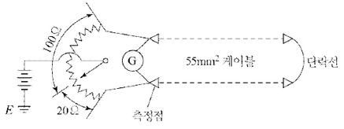

[계산과정]

[정답]

---

# 정답 해설) 단순 계산형 / 난이도 下

[계산과정]

$$ l = \frac{2 \times 20 \times 3.6}{20 + 100} = 1.2 [km] $$

[정답] 1.2[km]

부분점수

| 점수 | 세부기준                                |
| ---- | --------------------------------------- |
| 5점  | 계산과정과 답이 모두 맞은 경우 5점 획득 |
| 0점  | 계산과정과 답 중 오류가 있으면 0점      |

접근 POINT

머레이 루프법은 케이블의 저항을 통해 휘트스톤 브리지의 원리를 이용하여 사고 점까지 거리를 측정하는 방법으로서, 저항을 통하여 측정하므로 정밀도가 매우 높다. (오차 1[%] 내외)

해설

머레이 루프법의 원리 (휘트스톤 브리지)

"브리지 회로가 평형 검류계 G에 전류가 흐르지 않음"이고 아래 조건 만족할 때

$$ R_1 \times R_4 = R_2 \times R_3 $$

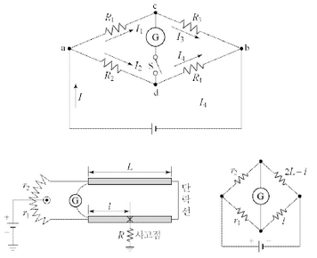

$ r_2 \times l = r_1 \times (2L - l) $이 성립되므로, 정리하면 $l = \frac{2r_1}{r_1 + r_2} \times L $이다.

---

# Q14 자동차단시간을 위한 보호장치의 동작시간이 0.5초이며, 예상 고장전류 실효값이 25 [kA]인 경우 보호도체의 최소 단면적을 계산하시오. (단, 보호도체, 절연, 기타 부위의 재질 및 초기온도와 최종온도에 따라 정해지는 계수는 159이며, 동선을 사용한다.) [배점: 5점]

[계산과정]

[정답]

---

## 해설) 단순 계산형 / 난이도 下

정답

[계산과정]

$$ 단면적 S = \frac{\sqrt{tI_s}}{k} = \frac{\sqrt{0.5 \times 25000}}{159} \approx 111.18 [mm^2] $$

[정답] 120[mm²]을 선정한다.

부분점수

| 점수 | 세부기준                                |
| ---- | --------------------------------------- |
| 5점  | 계산과정과 답이 모두 맞은 경우 5점 획득 |
| 0점  | 계산과정과 답 중 오류가 있으면 0점      |

해설

[한국전기설비규정 142.3.2] 보호도체

차단시간이 5초 이하인 경우에만 다음 계산식을 적용한다.

단면적 $S = \sqrt{\frac{I_s^2 t}{k}} $

$I_s$: 예상 고장전류[A] (실효값)

t: 보호장치 동작시간[s]

k: 보호도체, 절연, 기타 부위의 재질 및 초기온도와 최종온도에 따라 정해지는 계수(한국산업규격 KS C IEC 60364-5-54 부록 A)

[KEC 전선 공칭 단면적]

| 2.5 | 4   | 6   | 10  | 16  | 25  | 35  | 50  | 70  | 95  |
| --- | --- | --- | --- | --- | --- | --- | --- | --- | --- |
| 120 | 150 | 185 | 200 | 200 | 300 | 400 | 500 | 500 | 630 |

---

# Q15 어느 수용가에서 자가용 디젤 발전기 설비를 계획하고 있다. 발전기 용량 산출에 필요한 부하의 종류 및 특성이 다음과 같을 때 주어진 조건과 참고 자료를 이용하여 전부하 운전을 하는 데 필요한 발전기 용량 (kVA)을 표의 빈칸을 채우면서 선정하시오. (단, 수용률을 적용한 용량(kVA)을 구할 때는 유효분과 무효분을 나누어 복소수 형태로 기입한다.) [배점: 8점]

[조건]

- 전동기 기동 시에 필요한 용량은 무시한다.
- 수용률 적용(동력): 최대 입력 전동기 1대에 대하여 100[%], 2대는 80[%], 전등 및 기타는 100[%]를 적용한다.
- 전등 및 기타의 역률과 효율은 100[%]를 적용한다.
- 자가용 디젤 발전기 용량 [kVA]은 50, 100, 150, 200, 300, 400, 500에서 선정한다.

[참고자료]

| 정격출력 (kW) | 극수 | 동기속도 (rpm) | 효율 (%) | 역률 (pf) (%) | 무부하전류 (A) (각상의 평균치) | 전부하전류 (A) (각상의 평균치) | 전부하 슬립 (s) (%) |
| ------------- | ---- | -------------- | -------- | ------------- | ------------------------------ | ------------------------------ | ------------------- |
| 0.75          |      |                | 71.5     | 70.0          | 2.5                            | 3.8                            | 8.0                 |
| 1.5           |      |                | 78.0     | 75.0          | 3.9                            | 6.6                            | 7.5                 |
| 2.2           |      |                | 81.0     | 77.0          | 5.0                            | 9.1                            | 7.0                 |
| 3.7           |      |                | 83.0     | 78.0          | 8.2                            | 14.6                           | 6.5                 |
| 5.5           |      |                | 85.0     | 77.0          | 11.8                           | 21.8                           | 6.0                 |
| 7.5           |      |                | 86.0     | 78.0          | 14.5                           | 29.1                           | 6.0                 |
| 11            | 4    | 1800           | 87.0     | 79.0          | 20.9                           | 40.9                           | 6.0                 |
| 15            |      |                | 88.0     | 79.5          | 26.4                           | 55.5                           | 5.5                 |
| 22            |      |                | 89.0     | 80.5          | 36.4                           | 78.2                           | 5.5                 |
| 30            |      |                | 89.5     | 81.5          | 47.3                           | 105.5                          | 5.5                 |
| 37            |      |                | 90.0     | 81.5          | 56.4                           | 129.1                          | 5.5                 |
| 0.75          |      |                | 70.0     | 63.0          | 3.1                            | 4.4                            | 8.5                 |
| 1.5           |      |                | 76.0     | 96.0          | 4.7                            | 7.3                            | 8.0                 |
| 2.2           |      |                | 79.5     | 71.0          | 6.2                            | 10.1                           | 7.0                 |
| 3.7           |      |                | 82.5     | 73.0          | 9.1                            | 15.8                           | 6.5                 |
| 5.5           |      |                | 84.5     | 72.0          | 136.0                          | 23.6                           | 6.0                 |
| 7.5           | 6    | 1200           | 85.5     | 73.0          | 17.3                           | 30.9                           | 6.0                 |
| 11            |      |                | 86.5     | 74.5          | 23.6                           | 43.6                           | 6.0                 |
| 15            |      |                | 87.5     | 75.5          | 30.0                           | 58.2                           | 6.0                 |
| 18.5          |      |                | 88.0     | 76.0          | 37.3                           | 71.8                           | 5.5                 |
| 22            |      |                | 88.5     | 77.0          | 40.0                           | 82.7                           | 5.5                 |
| 30            |      |                | 89.0     | 78.0          | 50.9                           | 111.8                          | 5.5                 |
| 37            |      |                | 90.0     | 78.5          | 60.9                           | 136.4                          | 5.5                 |

[부하자료]

| 부하의 종류 | 출력 (kW) | 극수 (극) | 대수 (대) | 적용 부하   | 기동방법    |
| ----------- | --------- | --------- | --------- | ----------- | ----------- |
| 전동기      | 37        | 6         | 1         | 소화전 램프 | 리액터 기동 |
|             | 22        | 6         | 2         | 급수 펌프   | 리액터 기동 |
|             | 11        | 6         | 2         | 배풍기      | Y-△기동     |
|             | 5.5       | 4         | 1         | 배수 펌프   | 직입 기동   |
| 전등, 기타  | 50        |           |           | 비상 조명   |             |

(1) 부하 용량을 계산하여 다음 표의 빈칸을 채우시오.

(2) 위 표의 수용률 적용 용량에서 부하의 유효전력, 무효전력, 피상전력을 계산하고 발전기 용량을 선정하시오.

[계산과정]

[정답]

① 부하의 유효전력:

② 무효전력:

③ 피상전력:

④ 발전기의 용량 선정:

---

## 해설) 순차적 문제 해결형 / 난이도 中

정답

(1) 부하용량 계산

| 부하의 종류 | 출력 [kW] | 극수 | 역률 [%] | 효율 [%] | 입력 [kVA] | 수용률 [%] | 수용률 적용 용량 [kVA] |
| ----------- | --------- | ---- | -------- | -------- | ---------- | ---------- | ---------------------- |
| 37x1        | 37        | 6    | 78.5     | 90       | 52.37      | 100        | 41.11+j32.44           |
| 22x2        | 22        | 6    | 77.0     | 88.5     | 64.57      | 80         | 39.78+j32.96           |
| 11x2        | 11        | 6    | 74.5     | 86.5     | 34.14      | 80         | 20.35+j18.22           |
| 5.5x1       | 5.5       | 4    | 77.0     | 85       | 8.4        | 100        | 6.47+j5.36             |
| 전등        | 50        | -    | 100      | 100      | 50         | 100        | 50                     |
| **합계**    | -         | -    | -        | -        | -          | -          | **157.71+j88.98**      |

(2) 부하의 유효, 무효, 피상전력 계산 및 발전기 용량 선정

[계산과정]

유효전력 합계: P = 41.11 + 39.78 + 20.35 + 6.47 + 50 = 157.71 , [kW]

무효전력 합계: Q = 32.44 + 32.96 + 18.22 + 5.36 = 88.98 , [kVar]

- 피상전력:$ P_a = \sqrt{157.71^2 + 88.98^2}$ = 181.08 , [kVA]

조건에서 표준용량 200[kVA]를 선정한다.

[정답] 200[kVA]

부분점수

| 점수 | 세부기준                                                                                                     |
| ---- | ------------------------------------------------------------------------------------------------------------ |
| 8점  | 문항 (1), (2)가 모두 정답인 경우 6점 획득                                                                    |
| 4점  | 문항 (1)의 표에서 '수용률 적용값' 6개 중 정답의 개수가 0~1개는 0점, 2~3개는 1점, 4~5개는 2점, 6개는 4점 부여 |
| 4점  | 문항 (2)의 계산과정과 답이 모두 맞으면 4점, 계산 과정과 답에 오류가 있으면 0점                               |

접근 POINT

꼼꼼한 분석이 요구되는 자료해석형 문제이다. 문제의 조건에서 "발전기 용량은 유효분과 무효분을 고려하여 산정하라."고 하였으므로, 유효분과 무효분을 각각 구한 후 피상전력을 구한다. 유사한 문제 중 위의 조건이 없는 문제는 유효분과 무효분으로 나눠서 풀지 않아도 무방하다.

해설

$$ 효율 = \frac{출력[kVA]}{입력[kVA]} = \frac{출력[kW]}{역률 \times 입력[kVA]} 이므로, $$

$$ 입력[kVA] = \frac{출력[kW]}{역률 \times 효율} $$

수용률을 적용한 용량[kVA] = 설비용량[kVA] × 수용률

$$ 피상전력 P_a = \sqrt{P^2 + Q^2} \, [kVA] $$

$$ 유효전력 P = P_a \times cos\theta $$

$$ 무효전력 Q = P_a \times sin\theta = P_a \times \sqrt{1 - cos^2\theta} $$

---

# Q16 그림과 주어진 조건 및 참고표를 이용하여 3상 단락용량, 3상 단락 전류, 차단기의 차단용량 등을 계산하시오. [배점: 8점]

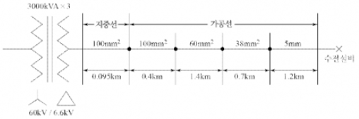

[조건]

- 변압기 1차 측에서 본 1상당의 합성 %리액턴스: 1.5[%] (기준용량 10,000[kVA])
- 변압기 %리액턴스: 7.4[%] (기준용량 9,000[kVA])

[표 1] 가공전선로(경동선) %임피던스

| 배선방식        | 선의 굵기 [mm²] | %r [%/km] | %x [%/km] |
| --------------- | --------------- | --------- | --------- |
| 3상 3선 3[kV]   | 100             | 16.5      | 29.3      |
|                 | 80              | 21.1      | 30.6      |
|                 | 60              | 27.9      | 214.0     |
|                 | 50              | 34.8      | 32.0      |
|                 | 38              | 44.8      | 32.9      |
|                 | 30              | 57.2      | 33.6      |
|                 | 22              | 75.7      | 344.0     |
|                 | 14              | 119.2     | 35.7      |
|                 | 5               | 83.1      | 35.1      |
|                 | 4               | 127.8     | 36.4      |
| 3상 3선 6[kV]   | 100             | 4.1       | 7.5       |
|                 | 80              | 5.3       | 7.7       |
|                 | 60              | 7.0       | 7.9       |
|                 | 50              | 8.7       | 8.0       |
|                 | 38              | 11.2      | 8.2       |
|                 | 30              | 18.9      | 8.4       |
|                 | 22              | 29.9      | 8.6       |
|                 | 14              | 29.9      | 8.7       |
|                 | 5               | 20.8      | 8.8       |
|                 | 4               | 32.5      | 9.1       |
| 3상 4선 5.2[kV] | 100             | 5.5       | 10.2      |
|                 | 80              | 7.0       | 10.5      |
|                 | 60              | 9.3       | 10.7      |
|                 | 50              | 11.6      | 10.9      |
|                 | 38              | 14.9      | 11.2      |
|                 | 30              | 19.1      | 11.5      |
|                 | 22              | 25.2      | 11.8      |
|                 | 14              | 39.8      | 12.2      |
|                 | 5               | 27.7      | 12.0      |
|                 | 4               | 43.3      | 12.4      |

[표 2] 지중케이블 전로의 %임피던스

| 배선방식        | 선의 굵기 [mm²] | %r [%/km] | %x [%/km] |
| --------------- | --------------- | --------- | --------- |
| 3상 3선 3[kV]   | 250             | 6.6       | 5.5       |
|                 | 200             | 8.2       | 5.6       |
|                 | 150             | 13.7      | 5.8       |
|                 | 125             | 13.4      | 5.9       |
|                 | 100             | 16.8      | 6.0       |
|                 | 80              | 20.9      | 6.2       |
|                 | 60              | 27.6      | 6.5       |
|                 | 50              | 32.7      | 6.6       |
|                 | 38              | 43.4      | 6.8       |
|                 | 30              | 55.9      | 7.1       |
|                 | 22              | 118.5     | 8.3       |
| 3상 3선 6[kV]   | 250             | 1.6       | 1.5       |
|                 | 200             | 2.0       | 1.5       |
|                 | 150             | 2.7       | 1.6       |
|                 | 125             | 3.4       | 1.6       |
|                 | 100             | 4.2       | 1.7       |
|                 | 80              | 5.2       | 1.8       |
|                 | 60              | 6.9       | 1.9       |
|                 | 50              | 8.2       | 1.9       |
|                 | 38              | 8.6       | 1.9       |
|                 | 30              | 14.0      | 2.0       |
|                 | 22              | 29.6      | 2.0       |
| 3상 4선 5.2[kV] | 250             | 2.2       | 2.0       |
|                 | 200             | 2.7       | 2.0       |
|                 | 150             | 3.6       | 2.1       |
|                 | 125             | 4.5       | 2.2       |
|                 | 100             | 5.6       | 2.3       |
|                 | 80              | 7.0       | 2.3       |
|                 | 60              | 9.2       | 2.4       |
|                 | 50              | 14.5      | 2.6       |
|                 | 38              | 14.5      | 2.6       |
|                 | 30              | 18.6      | 2.7       |

(1) 수전설비에서의 합성 %임피던스를 계산하시오.

[계산과정]

[정답]

(2) 수전설비에서의 3상 단락용량을 계산하시오.

[계산과정]

[정답]

(3) 수전설비에서의 3상 단락전류를 계산하시오.

[계산과정]

[정답]

(4) 수전설비에서의 정격차단용량을 계산하고, 표에서 적당한 용량을 찾아 선정하시오.

[계산과정]

[정답]

참고: 문제의 그림과 표의 내용을 정확히 반영하여 계산과정과 정답을 작성해야 합니다. 제공된 정보만으로는 정확한 계산이 불가능하며, 전력 시스템 공학 지식이 필요합니다.

---

# 정답 해설

해설) 복합 계산형 / 난이도 상

(1) 합성 %임피던스

[계산과정]

① 기준용량 10000 [kVA]의 변압기 %임피던스

$$ 변압기\ \%X_1 = \frac{10000}{9000} \times j7.4 \approx j8.22 [\%] $$

② 지중선 임피던스 %Z₁

[표3] (3상 3선 6[kV]), (100[mm²]) 참고하면

$$ \%Z_1 = \%r + j\%x = (0.095 \times 4.2) + j(0.095 \times 1.7) \approx 0.399 + j0.1615 [\%] $$

③ 가공선 임피던스 %Z₂

[표2] (3상 3선 6[kV]), (100, 60, 38[mm²], 5[mm]) 참고하면

$$ 100[mm^2] \rightarrow \%r + j\%x = 0.4 \times (4.1 + j7.5) = 1.64 + j3 $$

$$ 60[mm^2] \rightarrow \%r + j\%x = 1.4 \times (7 + j7.9) = 9.8 + j11.06 $$

$$ 38[mm^2] \rightarrow \%r + j\%x = 0.7 \times (11.2 + j8.2) = 7.84 + j5.74 $$

$$ 5[mm^2] \rightarrow \%r + j\%x = 1.2 \times (20.8 + j8.8) = 24.96 + j10.56 $$

$$ \therefore 전체\ 합계\ \%Z_2 = 44.24 + j30.36 [\%] $$

④ 합성 임피던스

$$ \%Z = \%발전기 + \%Z_1 + \%Z_2 $$

$$ = (j1.5) + (j8.22) + (0.399 + j0.615) + (44.24 + j30.36) = 44.639 + j40.2415 $$

$$ | \%Z | = \sqrt{44.639^2 + 40.2415^2} \approx 60.10 $$

[정답] 60.10[%]

(2) 3상 단락용량

[계산과정]

$$ 단락용량\ P_s = \frac{100}{\%Z} \times P_n = \frac{100}{60.1} \times 10000 [kVA] \approx 16.64 [MVA] $$

[정답] 16.64[MVA]

(3) 3상 단락전류

[계산과정]

$$ 단락전류\ I_s = \frac{100}{\%Z} \times I_n = \frac{100}{60.1} \times \left( \frac{10,000}{\sqrt{3} \times 6.6} \times 10^{-3} \right) \approx 1.46 [kA] $$

[정답] 1.46[kA]

(4) 정격차단용량

[계산과정]

$$ 차단용량 = \sqrt{3} \times 정격전압 \times 정격 차단 전류 $$

$$ = \sqrt{3} \times (6.6 \times \frac{1.2}{1.1}) \times 1.46 \approx 18.15 [표1] (정격전압 7,200[V]) 참고하면 $$

[정답] 25[MVA] 선정

부분점수

| 점수 | 세부기준                                                          |
| ---- | ----------------------------------------------------------------- |
| 8점  | 소문항 (1)~(4) 총 4개의 계산과정과 정답이 모두 맞은 경우 8점 획득 |
| 2점  | 소문항 총 4개 중 계산과정과 정답이 모두 맞는 1개당 2점 획득       |

해설

주어진 자료를 해석해서 순차적으로 문제를 풀어야 한다.

---

# Q17 가로 32m, 세로 20m인 건물의 직접 조명에서 LED 형광등 160[W], 효율 123[lm/W]의 평균 조도를 500[lx]로 하려고 한다. 주어진 조건과 참고 자료를 기준으로 다음 물음에 답하시오. (배점: 15점)

[조건]

- 천장 반사율: 75%
- 벽면 반사율: 50%
- 작업면으로부터 광원 높이: 6m
- 감광 보상률 보수 상태: 양호
- 배광: 직접 조명
- 조명 기구: 금속 반사갓 직부형
  - 벽을 이용하지 않는 경우 등과 벽 사이의 간격(S) ≤ 0.5H

[참고자료 1] 실지수 분류 기호

| 기호 | 실지수 | 범위      |
| ---- | ------ | --------- |
| A    | 5      | 4.5 이상  |
| B    | 4      | 4.5~3.5   |
| C    | 3      | 3.5~2.75  |
| D    | 2.5    | 2.75~2.25 |
| E    | 2      | 2.25~1.75 |
| F    | 1.5    | 1.75~1.38 |
| G    | 1.25   | 1.38~1.12 |
| H    | 1      | 1.12~0.9  |
| I    | 0.8    | 0.9~0.7   |
| J    | 0.6    | 0.7 이하  |

[참고자료 2] 실지수 도표

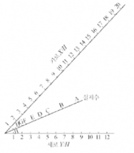

[참고자료 3] 조명률 표

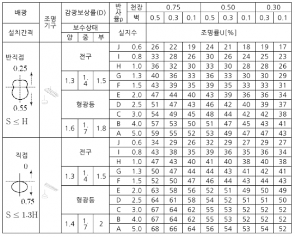

(1) 실지수를 계산하고 [참고자료 1]에서 실지수 분류 기호를 선정하시오.

(계산과정)

(정답)

(2) 실지수 그림을 이용하여 실지수 분류 기호를 선정하시오.

(계산과정)

(정답)

(3) 조명률 표를 이용하여 조명률을 계산하시오.

(정답)

(4) 필요한 등 수를 계산하시오.

(계산과정)

(정답)

(5) 16[A] 분기 회로 수는 몇 회로인지 계산하시오. (단, 전압은 220[V]이다.)

(계산과정)

(정답)

(6) 등과 등 사이의 최대 거리와 등과 벽 사이의 최대 거리를 구하시오.

① 등과 등 사이의 최대 거리는 얼마인지 계산하시오.

(계산과정)

(정답)

② 등과 벽 사이의 최대 거리는 얼마인지 계산하시오. (단, 벽면을 사용하지 않는 것으로 한다.)

(계산과정)

(정답)

(7) 그림의 명칭을 쓰시오.

(정답)

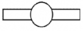

---

# 해설) 자료해석형 / 난이도 중

## 정답

(1) 실지수 계산 및 실지수 분류 기호 선정

[계산과정]

$$ RI = \frac{20 \times 32}{6 \times (20 + 32)} = 2.051 $$

표에서 범위 2.25~1.74에 해당하는 E 선정

[정답] E

(2) 실지수 그림을 이용하여 실지수 선정

[정답] E

$H = \frac{32}{6} = 5.33, H = \frac{20}{6} = 3.33 $두 점을 직선으로 연결하여 가장 가까운 기호를 실지수 분류기호로 선정한다.

(3) 조명률 표를 이용하여 조명률 구하기

[정답] 표에서 직접조명 방식, 천장 반사율 75[%], 벽면 반사율이 50[%], 실지수 E에 해당하는 조명률 63[%]를 선택한다.

(4) 필요한 등수 계산

[계산과정]

문제 조건에서 직접조명, 형광등, 보수상태 양호에 해당하는 감광보상률을 표에서 D=1.4 선택

$$ N = \frac{500 \times (32 \times 20) \times 1.4}{(123 \times 160) \times 0.63} = 36.133 $$

[정답] 37등

(5) 분기회로 수 계산

[계산과정]

$$ 분기회로 수 = \frac{160 \times 37}{220 \times 16} = 1.681 $$

[정답] 2회로

(6) 벽 사이의 최대거리

[정답] ① $S \le 1.3 \times 6 = 7.8[m], ② S \le 0.5 \times 6 = 3[m] $

(7) 그림의 명칭

[정답] 형광등

## 부분점수

| 점수 | 세부기준                                                                                                                            |
| ---- | ----------------------------------------------------------------------------------------------------------------------------------- |
| 15점 | (1)~(7)이 모두 정답인 경우 10점 획득                                                                                                |
| 4점  | 문항 (1)의 계산과정과 답이 모두 맞은 경우 4점, 오류가 있으면 0점                                                                    |
| 2점  | 문항 (2)의 답이 맞으면 2점, 오답이면 0점                                                                                            |
| 2점  | 문항 (3)의 답이 맞으면 2점, 오답이면 0점                                                                                            |
| 3점  | 문항 (4)의 계산과정과 답이 모두 맞은 경우 3점, 오류가 있으면 0점                                                                    |
| 1점  | 문항 (5)의 계산과정과 답이 모두 맞은 경우 2점, 오류가 있으면 0점                                                                    |
| 2점  | 문항 (6)의 ①번의 계산과정과 답이 모두 맞은 경우 1점, 오류가 있으면 0점, ②번의 계산과정과 답이 모두 맞은 경우 1점, 오류가 있으면 0점 |
| 1점  | 문항 (7)이 정답이면 1점, 오답이면 0점                                                                                               |

## 접근 POINT

실지수와 조명 방정식을 이용해 조명을 설계하는 자료해석형 문제이다. 실지수 공식은 반드시 암기하고, 조명 방정식 FUN=EAD를 통해 조명률을 구한다.

## 해설

실지수(RI: Room Index)

① 조명률을 구하기 위해 알아야 할 하나의 지표이다.

② 공식

$$ 실지수 (RI) = \frac{\text{방의 가로길이} \times \text{방의 세로길이}}{\text{등 높이} \times (\text{방의 가로길이} + \text{방의 세로길이})} = \frac{X \times Y}{H(X+Y)} $$

③ 실지수를 통하여 표에서 조명률(U)을 구한다.

④ 등기구 수 구한다.

$$ 등기구 수 N = \frac{EAD}{FU} $$

⑤ 구한 N값을 이용하여 전체 등기구의 전력 [W]=[VA]를 구한 후, 분기회로 수를 구한다.

$$ 분기회로 수 N = \frac{P[VA]}{\text{전압}[V] \times \text{전류}[A]} $$

⑥ 등 간격을 구한다

등기구 간의 간격: $S \le 1.5H$

- 벽과 등기구 간의 간격

  - 벽면을 사용하지 않을 경우: $S \le \frac{H}{2}$

  - 벽면을 사용할 경우: $S \le \frac{H}{3}$

---
