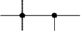
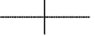
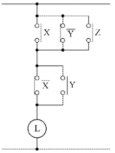
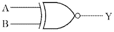
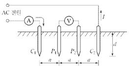
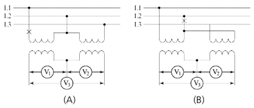
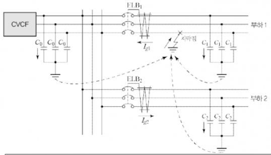
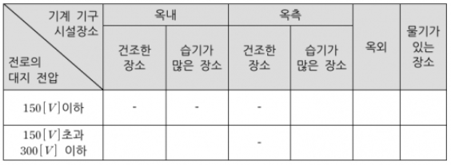
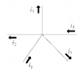

# Q1. 한국전기설비규정에 따라 과전류 차단기의 시설이 제한되는 장소 3가지를 쓰시오. [배점: 5점]

[정답]

①

②

③

---

# 정답 해설

(해설) 서술 암기형 / 난이도 하

① 접지공사의 접지도체

② 다선식 전로의 중성선

③ 저압 가공전선로의 접지측 전선

## 부분점수

| 점수 | 세부기준                     |
| ---- | ---------------------------- |
| 5점  | ①, ②, ③번을 모두 맞은 경우   |
| 3점  | ①, ②, ③번 중 2개만 맞은 경우 |
| 1점  | ①, ②, ③번 중 1개만 맞은 경우 |

## 서술형 핵심 KEYWORD

다음 핵심 KEYWORD가 포함되어야 정답 처리된다.

접지도체, 중성선, 저압 가공전선로, 접지측 전선

## 접근 POINT

"KEC 341.11 과전류 차단기의 시설제한 규정"에 대한 내용을 물어보는 문제로서 핵심 키워드인 접지도체, 중성선, 접지측 전선을 먼저 암기한 후, 추가적으로 수식해 주는 접지공사, 다선식 전로, 저압 가공전선로의 조건을 암기해야 한다.

## 해설

KEC 341.11 과전류차단기의 시설 제한

접지공사의 접지도체, 다선식 전로의 중성선 및 322.1의 1부터 3까지의 규정에 의하여 전로의 일부에 접지공사를 한 저압 가공전선로의 접지측 전선에는 과전류차단기를 시설하여서는 안 된다.

과전류 차단기는 과전류가 발생했을 때 동작하여 고장전류를 차단하는 기능을 한다.

접지도체와 중성선, 접지측 전선은 기기와 선로를 보호하기 위해 빠르게 과전류를 대지로 내보내는 통로이므로 그곳에 과전류 차단기를 설치하게 되면 과전류가 빠져나가지 못하고 기기나 선로에 남아 고장의 원인이 된다.

---

# Q2 다음 논리식을 조건에 따라 유접점 회로로 그리시오. [배점: 4점]

[조건]

- 각 접점에 식별 문자를 표기한다.
- 접속점, 비접속점 표기는 아래 표와 같게 한다.

접속점 표기 방식

| 접속                       | 비접속                     |
| -------------------------- | -------------------------- |
|  |  |

[논리식]

$$ L = (\bar{X} + Y + Z) \cdot (\bar{X} + Y) $$

[정답]

---

## 해설) 단답 암기형+도면 작성 / 난이도 하

부분점수

도면을 정확하게 그려야 4점을 획득하고 부분점수는 없다.

접근 POINT

논리식을 유접점 시퀀스회로로 변형할 수 있는 능력이 있는지 확인하는 문제다.

해설

논리식을 유접점 시퀀스회로로 변형하는 문제로써 논리식의 AND는 직렬로, OR는 병렬로 표현되는 것만 알면 그릴 수 있는 문제다. 난이도를 높이기 위해 논리식을 간소화한 후 유접점 시퀀스회로로 변형하는 문제가 출제되는데, 이번 문제는 논리식이 간소화된 상태로 주어졌기 때문에 추가로 간소화하지 않아도 되는 가장 기본적인 유형의 문제이다.

---

# Q3 측정범위 1[mA], 내부저항 20[kΩ]의 전류계로 5[mA]까지 측정하고자 한다. 몇 [Ω]의 분류기를 사용하여야 하는지 계산하시오. [배점: 4점]

[계산과정]

[정답]

---

# 해설) 단순 계산형 / 난이도 하

## 정답

[계산과정]

$$ R_s = \frac{r}{(m-1)} = \frac{20 \times 10^3}{(\frac{5}{1} - 1)} = 5,000 [\Omega] $$

[정답] 5,000 [Ω]

## 부분점수

| 점수 | 세부기준                                                     |
| ---- | ------------------------------------------------------------ |
| 4점  | 계산과정과 정답이 모두 맞은 경우 4점 획득, 오류가 있으면 0점 |

## 해설

분류기는 전류계와 병렬로 접속하므로 전류분배 공식은 $I = I_0 \left( \frac{R_s}{r + R_s} \right)$ [A] 이고,

분류기의 배율은 $m = \frac{I_0}{I} = \frac{r + R_s}{R_s} = \frac{r}{R_s} + 1$ 이다.

분류기의 저항은 $R_s = \frac{r}{m - 1}$ 이다.

(여기서 $I_0$: 측정할 전류값[A], I: 전류계 측정 전류값[A], R_s: 분류기의 저항[Ω], r: 전류계의 내부저항[Ω] 이다.)

---

# Q4 감리자의 지시 등이 서로 일치하지 아니하는 경우에 있어 계약으로 그 적용의 우선순위가 정해지지 아니했을 때, 설계도서 해석의 우선순위를 바르게 배열하시오. (단, 높은 순서에서 낮은 순서대로 쓰시오.)

[배점: 5점]

- 전문시방서
- 감리자의 지시사항
- 공사시방서
- 표준시방서
- 산출내역서
- 승인된 시공 상세도면
- 설계도면

[정답]

①

②

③

④

⑤

⑥

⑦

---

# 정답 해설

해설) 단답 암기형 / 난이도 중

1. 공사시방서
2. 설계도면
3. 전문시방서
4. 표준시방서
5. 산출내역서
6. 승인된 시공 상세도면
7. 감리자의 지시사항

## 부분점수

| 점수  | 세부기준                                                       |
| ----- | -------------------------------------------------------------- |
| 5점   | 소문항 ①~⑦이 모두 맞은 경우 5점 획득                           |
| 1~4점 | 소문항 총 7개 중 정답이 1개 1점, 2개 2점, 3~4개 3점, 5~6개 4점 |

## 해설

**[건설교통부고시] 제 2003-11호 설계도서 작성기준**

설계도서 해석의 우선순위

설계도서·법령해석·감리자의 지시 등이 서로 일치하지 아니하는 경우에 있어 계약으로 그 적용의 우선순위를 정하지 아니한 때에는 다음의 순서를 원칙으로 한다.

1. 공사시방서
2. 설계도면
3. 전문시방서
4. 표준시방서
5. 산출내역서
6. 승인된 시공 상세도면
7. 관계법령의 유권해석
8. 감리자의 지시사항

---

# Q5 다음 그림과 같은 논리회로를 보고 물음에 답하시오. [배점: 6점]

(1) 명칭을 쓰시오.

[정답]

(2) 논리식을 쓰시오.

[정답] Y = A + B

(3) 진리표를 완성하시오.

| A   | B   | Y   |
| --- | --- | --- |
| 0   | 0   | 0   |
| 0   | 1   | 1   |
| 1   | 0   | 1   |
| 1   | 1   | 1   |

---

# 해설) 논리회로 / 난이도 하

정답

(1) 배타적 부정 논리합 (XNOR Gate)

(2) $Y = \overline{A} \cdot \overline{B} + A \cdot B = A \oplus B = A \odot B$

(3) 진리표 완성

| A   | B   | Y   |
| --- | --- | --- |
| 0   | 0   | 1   |
| 0   | 1   | 0   |
| 1   | 0   | 0   |
| 1   | 1   | 1   |

부분점수

| 점수  | 세부기준                                           |
| ----- | -------------------------------------------------- |
| 6점   | 소문항 (1), (2), (3)이 모두 맞은 경우 6점 획득     |
| 2~4점 | 소문항 (1), (2), (3) 중 3개 중 정답 1개당 2점 획득 |

해설

배타적 부정 논리합 = Exclusive NOR = XNOR

특징: 입력이 같으면 출력을 발생한다.

논리식: $Y = \overline{A} \cdot \overline{B} + A \cdot B = A \oplus B = A \odot B $

---

# Q6 전압 22.9[kV], 주파수 60[Hz], 1회선의 3상 지중 송전선로의 3상 무부하 충전전류 및 충전용량을 구하시오. (단, 송전선로의 길이는 7[km], 케이블 1선당 작용 정전용량은 0.4 [µF/km]이다.) [배점: 6점]

(1) 충전전류를 계산하시오.

[계산과정]

[정답]

(2) 충전용량을 계산하시오.

[계산과정]

[정답]

---

# 해설) 단순 수식형 / 난이도 중

(1) 충전전류 계산

[계산과정]

$$ I_c = 2\pi \times 60 \times 0.4 \times 10^{-6} \times 7 \times \frac{22,900}{\sqrt{3}} = 13.956 \dots \approx 13.96 [A] $$

[정답] 13.96 [A]

(2) 충전용량 계산

[계산과정]

$$ Q_c = 2\pi \times 60 \times 0.4 \times 10^{-6} \times 7 \times 22,900^2 \times 10^{-3} = 553.554 \dots \approx 553.55 [kVA] $$

[정답] 553.55 [kVA]

## 부분점수

| 점수 | 세부기준                                                      |
| ---- | ------------------------------------------------------------- |
| 6점  | 소문항 (1), (2)의 계산과정과 정답이 모두 맞은 경우 6점 획득   |
| 3점  | 소문항 중 2개 중 계산과정과 정답이 모두 맞은 1문제당 3점 획득 |

## 접근 POINT

3상 지중 송전선로의 충전전류와 충전용량을 구하는 문제로서 주어진 조건은 선로의 전압, 주파수, 선로길이, 1선당 작용 정전용량이다. 주의할 사항은 충전전류는 1선당 흐르는 전류이고, 충전용량은 3선 모두에 충전되는 용량을 구해야 한다는 것이다.

## 공식 CHECK

$$ 1선당 충전전류(3상) I_c = \frac{E}{X_c} = \omega CE = \omega C \frac{V}{\sqrt{3}} = 2\pi f C \frac{V}{\sqrt{3}} [A] $$

$$ I_c: 1선당 충전전류, E: 상전압, V: 선간전압, X_c: 용량성 리액턴스, \omega: 각주파수, f: 주파수 $$

$$ 충전용량(3상) Q = 3EL_c = 3E \frac{E}{X_c} = 3\omega CE^2 = 3\omega C \left(\frac{V}{\sqrt{3}}\right)^2 = \omega CV^2 = 2\pi f CV^2 [VA] $$

## 해설

(1) 충전전류 계산

충전전류를 계산하기 위해 필요한 정보는 주파수, 정전용량, 상전압이 있으면 된다.

문제에서 주어진 전압은 선간전압 V이다. 문제가 3상이므로 선간전압 V와 상전압 E의 관계를 확실히 이해해야 한다. 상전압은 전원의 전압으로 여기서는 발전기가 만든 1상당 전압이라고 보면 된다.

선간전압은 1상 상전압 E를 Y결선하여 3상으로 만든 후 3가닥의 송전선로를 통하여 부하로 공급되는 전압이다. 달리 말하면 부하에 공급되는 전압으로 $V = \sqrt{3}E$가 된다. 따라서 상전압은 $E = \frac{V}{\sqrt{3}}$가 된다.

전류를 구하는데 상전압이 필요한 이유는 실제로 전원이 전류를 공급하고 있기 때문에 전원에 해당하는 전압값으로 전류를 구해야 하기 때문이다. 그리고 충전전류는 3상 3선 중 1가닥 전송선로에 흐르는 전류를 의미하므로 3상 3가닥이니 추가적으로 3을 곱하지 않도록 주의하자. 또한, 조건에서 [km]당 정전용량이 주어지고, 거리가 주어지므로 순수한 정전용량을 구하려면 1선당 작용 정전용량에 거리를 곱하면 된다.

$$ C[µC] = C_l [µC/km] \times l [km] $$

$$ I_c = \frac{E}{X_c} = \frac{1}{\omega C} = \omega CE = 2\pi f C \frac{V}{\sqrt{3}} = 2\pi \times 60 \times (0.4 \times 10^{-6} \times 7) \times \frac{22,900}{\sqrt{3}} = 13.956 \dots \approx 13.96 [A] $$

---

# Q7 대지 고유 저항률 400[Ω·m]일 때 직경 19[mm], 길이 2,400[mm]인 접지봉을 전부 매입했다. 이때 접지저항(대지저항) 값 [Ω]은 얼마인지 계산하시오. [배점: 5점]

[계산과정]

[정답]

---

해설) 단순 계산형 / 난이도 중

정답

[계산과정]

$$ R = \frac{400}{2\pi \times 2.4} \times \ln{\frac{2 \times 2.4}{2 \times 0.019}} = 165.125 [\Omega] $$

[정답] 165.13[Ω]

부분점수

| 점수 | 세부기준                                |
| ---- | --------------------------------------- |
| 5점  | 계산과정과 답이 모두 맞은 경우 5점 획득 |
| 0점  | 계산과정과 답 중 오류가 있으면 0점      |

접근 POINT

3전극법에 의한 대지저항 측정 공식을 적용하는 단순 암기형 문제이다.

해설

[대지저항률 측정법(Wenner의 4전극법)]

① 개념도

C(전류 보조전극) 단자에 교류전원을 인가하여 전류를 측정한다. P(전위 보조전극) 단자 사이의 전위차를 측정하고, a 값을 변경하면서 대지저항을 측정한다.

② 대지 저항률 계산

$$ \rho = 2\pi aR = 40\pi dR = 40\pi d \frac{V}{I} [\Omega m], R = \frac{V}{I} $$

[3전극법에 의한 접지봉의 저항 계산]

$$ R = \frac{\rho}{2\pi l} \ln{\frac{2l}{r}} $$

---

# Q8 154[kV] 중성점 직접 접지계통에서 접지계수가 0.75이고 여유도가 1.1이다. 이 경우 피뢰기의 정격전압 [kV]을 주어진 표에서 선정하시오.

[배점: 5점]

[표] 피뢰기의 정격전압 [kV]

| 126 | 144 | 165 | 168 | 182 | 196 |
| --- | --- | --- | --- | --- | --- |

[계산과정]

[정답]

---

# 해설) 단순 계산형 / 난이도 하

## 정답

[계산과정]

$$ V_n = 0.75 \times 0.11 \times 180 = 140.24 [kV] $$

[정답] 144 [kV]

## 부분점수

| 점수 | 세부기준                                |
| ---- | --------------------------------------- |
| 5점  | 계산과정과 답이 모두 맞은 경우 5점 획득 |
| 0점  | 계산과정과 답 중 오류가 있으면 0점      |

## 해설

[피뢰기의 정격전압]

계산식: $\alpha \cdot \beta \cdot V_m $[kV]

여기서, $\alpha$: 접지 계수, $\beta$: 여유도, $V_m$: 계통의 최고 전압 [kV]

[계통별 정격전압]

| 전력계통 전압 [kV]     | 피뢰기 정격전압 [kV] |
| ---------------------- | -------------------- |
| 345(유효 접지)         | 288                  |
| 156(유효 접지)         | 144                  |
| 66(PC접지 또는 비접지) | 72                   |
| 22(PC접지 또는 비접지) | 24                   |
| 22.9(3상 4선 다중접지) | 21 (배전선로: 18)    |

---

# Q9 최대 수요전력이 5,000[kW], 부하 역률이 0.9, 네트워크(Network) 수전 회선수가 4회선이다. 네트워크 변압기의 과부하율이 130[%]인 경우 네트워크 변압기 용량은 몇 [kVA] 이상이어야 하는지 계산하시오.[배점: 5점]

[계산과정]

$$ P = 5000 kW $$
$$ cos\phi = 0.9 $$
$$ n = 4 (회선수) $$
$$ K = 1.3 (과부하율) $$

$$ 변압기 용량 S[kVA] = \frac{P}{cos\phi} \times n \times K = \frac{5000}{0.9} \times 4 \times 1.3 = 28888.89 kVA $$

따라서 네트워크 변압기 용량은 28888.89 kVA 이상이어야 한다.

[정답] 28889 kVA (소수점 첫째 자리에서 반올림)

---

## 해설) 단순 계산형 / 난이도 上

정답

[계산과정]

$$ 변압기 \; 용량 = \frac{(\frac{5,000}{0.9})}{4-1} \times \frac{100}{130} = 1,424.501 [kVA] $$

[정답] 1,424.50[kVA]

부분점수

| 점수 | 세부기준                                |
| ---- | --------------------------------------- |
| 5점  | 계산과정과 답이 모두 맞은 경우 5점 획득 |
| 0점  | 계산과정과 답 중 오류가 있으면 0점      |

접근 POINT

네트워크 변압기 용량을 계산하는 문제는 출제비중은 낮으나 고난도의 문제이다. 공식을 암기하고, 도심부 고밀도 부하에 적용하는 스폿 네트워크 공급방식의 특징도 함께 정리해야 한다.

해설

스폿 네트워크 방식

① 정의

- 저압 배전계통 구성방식의 하나로 저압 네트워크방식을 간소화한 방식이다.
- 도심부의 고층 빌딩과 같이 부하밀도가 높은 지역에 있는 대용량 집중부하에 공급하는 것이다.

② 특징

- 무정전 공급이 가능하여 공급 신뢰도가 높다.
- 선로의 이용률이 높고, 부하증가에 대한 적응성이 좋다.
- 변압기 2차 측의 병렬운전으로 전압변동이 적다.
- 시설 투자비가 과다하고 특별한 보호장치가 필요하다.

③ 변압기 용량

$$ 용량[kVA] = \frac{최대수요전력[kVA]}{공급회선수 - 1} \times 과부하율 $$

$$ (과부하율 = \frac{최대수요전력[kVA]}{변압기 \; 용량 \times (공급 \; 회선수 - 1)} \times 100) $$

---

# Q10 불평형 3상 전압이 $V_a = 7.3 \angle 12.5^\circ [V], V_b = 0.4 \angle -100^\circ [V], V_c = 4.4 \angle 154^\circ [V]$일 때 영상분, 정상분, 역상분을 계산하시오. [배점: 6점]

**(1) 영상분 전압 ($V_0$[V])을 계산하시오.**

[계산과정]

[정답]

**(2) 정상분 전압 ($V_1$[V])을 계산하시오.**

[계산과정]

[정답]

**(3) 역상분 전압 ($V_2$[V])을 계산하시오.**

[계산과정]

[정답]

---

# 정답 해설

## 해설) 복합 계산형 / 난이도 상

(1) 영상분 전압

[계산과정]

$$ V_0 = \frac{1}{3}(V_a + V_b + V_c) $$

$$ = \frac{1}{3}(7.3\angle 12.5^\circ + 0.4\angle -100^\circ + 4.4\angle 154^\circ) $$

$$ = 1.03 + j1.04 \, [V] = 1.47\angle 45.11^\circ [V] $$

**[정답]** $1.47\angle 45.11^\circ $ [V]

(2) 정상분 전압

[계산과정]

$$ V_1 = \frac{1}{3}(V_a + aV_b + a^2V_c) $$

$$ = \frac{1}{3}(7.3\angle 12.5^\circ + 1\angle 120^\circ \times 0.4\angle -100^\circ + 1\angle 240^\circ \times 4.4\angle 154^\circ) $$

$$ = 3.72 + j1.39 \, [V] = 3.97\angle 20.54^\circ \, [V] $$

**[정답]** $3.97\angle 20.54^\circ $ [V]

(3) 역상분 전압

[계산과정]

$$ V_2 = \frac{1}{3}(V_a + a^2V_b + aV_c) $$

$$ = \frac{1}{3}(7.3\angle 12.5^\circ + 1\angle 240^\circ \times 0.4\angle -100^\circ + 1\angle 120^\circ \times 4.4\angle 154^\circ) $$

$$ = 2.38 - j0.85 \, [V] = 2.52\angle -19.7^\circ \, [V] $$

$$ **[정답]** 2.52\angle -19.7^\circ \, [V] $$

## 부분점수

| 점수  | 세부기준                                                                                                    |
| ----- | ----------------------------------------------------------------------------------------------------------- |
| 6~0점 | 소문항 1개당 2점씩 부분 점수 부여. 각 소문항은 계산과정과 답이 모두 맞아야 2점 획득, 오류가 있으면 0점 처리 |

## 접근 POINT

필기 유형이지만 최근 5년간 2회 출제되었으므로 대칭분의 공식을 정확히 암기하고, 대칭분의 의미도 이해해야 한다.

## 해설

상전압($V_a, V_b, V_c$)과 영상전압($V_0$), 정상전압($V_1$), 역상전압($V_2$)의 관계 행렬

$$ \begin{pmatrix} V_a \\ V_b \\ V_c \end{pmatrix} = \begin{pmatrix} 1 & 1 & 1 \\ 1 & a^2 & a \\ 1 & a & a^2 \end{pmatrix} \begin{pmatrix} V_0 \\ V_1 \\ V_2 \end{pmatrix} = \frac{1}{3} \begin{pmatrix} 1 & 1 & 1 \\ 1 & a^2 & a \\ 1 & a & a^2 \end{pmatrix} \begin{pmatrix} V_a \\ V_b \\ V_c \end{pmatrix} $$

$$ 여기서, 1 + a + a^2 = 0, a^3 = 1, $$

$$ a = 1\angle 120^\circ = -\frac{1}{2} + j\frac{\sqrt{3}}{2}, a^2 = 1\angle 240^\circ = -\frac{1}{2} - j\frac{\sqrt{3}}{2} $$

---

# Q11 전력용 커패시터를 필요에 의해 주파수 50[Hz]에서 60[Hz]로 증가하였을 때 전류는 몇 [%]가 증가 혹은 감소하는지 계산하시오. [배점: 4점]

[계산과정]

(계산과정을 기술하는 부분)

[정답]

(정답을 기술하는 부분)

---

# 해설) 단순 계산형 / 난이도 下

## 정답

[계산과정]

$$ I*{60[Hz]} = \frac{60}{50} I*{50[Hz]} = 1.2 I\_{50[Hz]} $$

[정답] 20[%] 증가

## 부분점수

| 점수 | 세부기준                                |
| ---- | --------------------------------------- |
| 4점  | 계산과정과 답이 모두 맞은 경우 4점 획득 |
| 0점  | 계산과정과 답 중 오류가 있으면 0점      |

## 해설

용량성 전류 관계식

$$ I = \frac{X}{X_C} = \frac{V}{\frac{1}{2\pi f C}} = 2\pi f CV $$

$\therefore I \propto f$

주파수 비교

$$ I*{60[Hz]} = \frac{60}{50} I*{50[Hz]} = 1.2 I*{50[Hz]} = I*{50[Hz]} + 0.2 I\_{50[Hz]} $$

$ \therefore$ 0.2 = 20 [%] 증가

---

# Q12 용량이 500[kVA]인 변압기에 역률 60[%]인 부하 500[kVA]가 접속되어 있다. 전력용 고압 콘덴서를 설치하여 역률을 90[%]로 개선하였다면 증설할 수 있는 변압기의 부하는 몇 [kW]인지 계산하시오. (단, 증설 예정 부하의 역률도 90[%]이다.)

계산 과정:

- 초기 상태:

  - 변압기 용량: $S_{변압기} = 500$ kVA

  - 부하 용량: S\*{부하} = 500 kVA

  * 역률: $\cos\phi*1$ = 0.6

  * 부하의 유효전력: $P*1 = S*{부하} \times \cos\phi_1 = 500 \times 0.6 $= 300 kW

- 콘덴서 설치 후:

  - 역률 개선: $\cos\phi_2 = 0.9 $

  - 개선 후 부하의 유효전력: $P*2 = S*{부하} \times \cos\phi_2 = 500 \times 0.9 = 450$ kW

  * 증가된 유효전력: $\Delta P = P_2 - P_1 = 450 - 300 = 150 $ kW

- 증설 가능 부하:

  - 증설 예정 부하의 역률: $\cos\phi_3 = 0.9 $

  - 증설 가능 무효전력: $Q\*3 = P_3 \times \tan(\arccos(0.9)) $

  * 변압기의 허용가능한 추가 유효전력: P*추가 = (S*{변압기} - S*{부하}) \times \cos\phi*2 P\*추가 = (500 - 500)\times 0.9 = 0 kVA $$ \* 따라서 추가로 허용 가능한 부하는 0kVA 이다.

  - 변압기의 허용가능한 총 유효전력: $P*{총} = S*{변압기} \times \cos\phi_2 = 500 \times 0.9 = 450$ kW

  - 증설 가능 유효전력: $P*{증설} = P*{총} - P_1 = 450 - 300 = 150$ kW

- 따라서, 증설할 수 있는 변압기의 부하는 150 kW이다.

정답: 150 kW

---

## 해설) 단순 계산형 / 난이도 下

정답

[계산과정]

변압기 부하

$$ P = P_a (\cos\theta_2 - \cos\theta_1) = 500 \times (0.9 - 0.6) = 150 [kW] $$

[정답] 150[kW]

부분점수

| 점수 | 세부기준                                |
| ---- | --------------------------------------- |
| 4점  | 계산과정과 답이 모두 맞은 경우 4점 획득 |
| 0점  | 계산과정과 답 중 오류가 있으면 0점      |

해설

피상전력을 $P_a$, 유효전력을 P, 개선 전 역률을 $\cos\theta_1$, 개선 후 역률을 $\cos\theta_2$ 라고 할 때 역률개선에 따른 유효전력의 증가분은 다음과 같다.

$$ \Delta P = P_a \cos\theta_2 - P_a \cos\theta_1 = P_a (\cos\theta_2 - \cos\theta_1) $$

---

# Q13 다음 부하에 대한 발전기의 최소용량 [kVA]를 아래의 식을 이용하여 계산하시오. (단, 전동기 [kW]당 입력 환산계수(a)는 1.45, 전동기의 기동 계수(c)는 2, 발전기의 허용 전압강하 계수(k)는 1.45이다.) [배점: 5점]

[발전기 용량 산정식]

$$ PG = \{\Sigma P_m + (\Sigma P_m - P_1) \times a + (P_1 \times a \times c)\} \times k $$

여기서,

PG: 발전기 용량

$\Sigma P*m$: 전동기 부하 용량 합계 [kW]

- P\*1: 전동기 부하 중 가동용량이 가장 큰 전동기 부하용량 [kW]

a: 전동기의 [kW]당 입력 [kVA] 용량계수

c: 전동기의 기동계수

k: 발전기의 허용 전압강하 계수

[부하목록]

| 번호 | 부하 종류    | 부하 용량     |
| ---- | ------------ | ------------- |
| 1    | 유도전동기   | 37 [kW] × 1대 |
| 2    | 유도전동기   | 10 [kW] × 5대 |
| 3    | 전등 및 전열 | 30 [kVA]      |

[계산과정]

[정답]

---

# 해설) 자료 해석형 / 난이도 중

## 정답

### [계산과정]

$$ PG \ge [30 + (87 - 37) \times 1.45 + (37 \times 1.45 \times 2) \times 1.45] $$

$$ = 304.21 [kVA] $$

### [정답] 304.21 [kVA]

## 부분점수

| 점수 | 세부기준                                |
| ---- | --------------------------------------- |
| 5점  | 계산과정과 답이 모두 맞은 경우 5점 획득 |
| 0점  | 계산과정과 답 중 오류가 있으면 0점      |

## 해설

주어진 자료를 해석해서 풀어야 하는 문제이다.

---

# Q14 권수비가 20인 단상변압기의 전부하 2차 전압은 115[V], 전압변동률 2[%]이다. 이 때 1차 단자전압을 계산하시오. [배점: 5점]

[계산과정]

전압변동률은 다음과 같이 정의됩니다.

$$ \text{전압변동률} = \frac{V*{2,무부하} - V*{2,부하}}{V\_{2,부하}} \times 100\% $$

여기서, V*{2,부하}는 부하 상태에서의 2차 전압이고, V*{2,무부하}는 무부하 상태에서의 2차 전압입니다. 문제에서 주어진 값을 이용하여 V\_{2,무부하}를 구하면 다음과 같습니다.

$$ 2\% = \frac{V\_{2,무부하} - 115}{115} \times 100\% $$

$$ 0.02 = \frac{V\_{2,무부하} - 115}{115} $$

$$ V\_{2,무부하} = 115 \times (1 + 0.02) = 117.3 [V] $$

단상변압기의 권수비는 다음과 같이 정의됩니다.

$$ a = \frac{N_1}{N_2} = \frac{V_1}{V_2} $$

여기서 $N_1과 N_2는$ 각각 1차 및 2차 권선수이고, $V_1과 V_2는 $각각 1차 및 2차 전압입니다. 문제에서 권수비가 20이라고 주어졌으므로, a = 20입니다. 따라서 1차 단자전압 $V_1$은 다음과 같이 계산할 수 있습니다.

$$ V_1 = a \times V_2 = 20 \times 117.3 = 2346 [V] $$

따라서 1차 단자전압은 2346[V] 입니다.

[정답]

2346 V

---

---

해설) 단순 계산형 / 난이도 下

정답

[계산과정]

$$ 전압변동률 \epsilon = \frac{V*2 - V*{2n}}{V\_{2n}} = 0.02 = \frac{V_2 - 115}{115} $$

$$ V_2 = 115 \times 0.02 + 115 = 117.3 [V] $$

$$ 권수비 a = \frac{V_1}{V_2} = 20 $$

$$ V_1 = 20 \times 117.3 = 2,346 [V] $$

[정답] 2,346 [V]

부분점수

| 점수 | 세부기준                                |
| ---- | --------------------------------------- |
| 5점  | 계산과정과 답이 모두 맞은 경우 5점 획득 |
| 0점  | 계산과정과 답 중 오류가 있으면 0점      |

해설

$$ 전압변동률(\epsilon, Voltage Regulation) 공식을 활용한다. $$

$$ \epsilon = \frac{V_0 - V_n}{V_n} \times 100 $$

(여기서, $V_0$: 무부하 단자전압, $V_n$: 정격 단자전압이다.)

---

# Q15 다음은 어느 제조공장의 부하목록이다. 부하 중심거리공식을 활용하여 부하 중심위치 (X, Y)를 구하시오. (단, X는 x축 좌표, Y는 y축 좌표를 의미하고 주어지지 않은 조건은 무시한다.) [배점: 5점]

| 번호 | 분류       | 소비전력량 | 위치($x$축) | 위치($y$축) |
| ---- | ---------- | ---------- | ----------- | ----------- |
| 1    | 물류저장소 | 120 [kWh]  | 4 [m]       | 4 [m]       |
| 2    | 유틸리티   | 60 [kWh]   | 9 [m]       | 3 [m]       |
| 3    | 사무실     | 20 [kWh]   | 9 [m]       | 9 [m]       |
| 4    | 생산설비   | 320 [kWh]  | 6 [m]       | 12 [m]      |

[계산과정]

[정답]

---

해설) 단순 계산형 / 난이도 中

정답

[계산과정]

$$ X = \frac{(120 \times 4) + (60 \times 9) + (20 \times 9) + (320 \times 6)}{120 + 60 + 20 + 320} = 6 [m] $$

$$ Y = \frac{(120 \times 4) + (60 \times 3) + (20 \times 9) + (320 \times 12)}{120 + 60 + 20 + 320} = 9 [m] $$

[정답] (6, 9)[m]

부분점수

| 점수 | 세부기준                                |
| ---- | --------------------------------------- |
| 5점  | 계산과정과 답이 모두 맞은 경우 5점 획득 |
| 0점  | 계산과정과 답 중 오류가 있으면 0점      |

해설

부하 중심점까지의 거리 공식을 활용한다.

$$ L = \frac{\sum L \times I}{\sum I} = \frac{I_1L_1 + I_2L_2 + I_3L_3}{I_1 + I_2 + I_3} $$

---

# Q16 다음과 같은 380[V] 선로에서 계기용 변압기의 PT비는 380/110[V]이다. 각 물음에 답하시오. [배점: 6점]

(1) 그림 (A)의 X지점에서 단선사고가 발생하였을 때 $V_1, V_2, V_3$의 지시값을 각각 구하시오.

[계산과정]

[정답]

(2) 그림 (B)의 X지점에서 단선사고가 발생하였을 때 $V_1, V_2, V_3$의 지시값을 각각 구하시오.

[계산과정]

[정답]

---

# 정답

해설) 복합 계산형 / 난이도 中

**(1) 그림 (A)의 X지점에서 단선사고가 발생하였을 때 $V_1, V_2, V_3$의 지시값**

[계산과정]

$$ V_1 = 0[V], V_2 = 380 \times \frac{110}{380} = 110[V] $$

$$ V_3 = V_1 + V_2 = 0 + 110 = 110[V] $$

**[정답]** $V_1$ = 0[V], $V_2$ = 110[V], $V_3$ = 110[V]

**(2) 그림 (B)의 X지점에서 단선사고가 발생하였을 때 $V_1, V_2, V_3$의 지시값**

[계산과정]

$$ V_1 = 190 \times \frac{110}{380} = 55[V], V_2 = 190 \times \frac{110}{380} = 55[V] $$

$$ V_3 = V_1 - V_2 = 55 - 55 = 0[V] $$

**[정답]** $V_1$ = 0[V], $V_2$ = 55[V], $V_3$ = 0[V]

부분점수

| 점수 | 세부기준                                                      |
| ---- | ------------------------------------------------------------- |
| 6점  | 소문항 (1), (2)의 계산과정과 정답이 모두 맞은 경우 6점 획득   |
| 3점  | 소문항 총 2개 중 계산과정과 정답이 모두 맞은 1문제당 3점 획득 |

해설

(1) 그림 (A)의 X지점에서 단선사고가 발생한 경우

1차측 L1, L2 선간의 전압을 $V_{12}$라고 하면 X점에서 단선이 되었다.

$$ V\_{12} = 0[V] $$

$$ \therefore V_1 = 0[V] $$

1차측 L2, L3 선간의 전압을 V*{23}라고 하면 V*{23} = 380[V]

$$ \therefore V*2 = \frac{1}{P T \pi} \times V*{23} = \frac{110}{380} \times V\_{23} = \frac{110}{380} \times 380 = 110[V] $$

$ V_1과 V_2는 $직렬연결이므로 전압계 $V_3$는 다음과 같이 구할 수 있다.

$$ \therefore V_3 = (V_1 + V_2) = 0 + 110 = 110[V] $$

(2) 그림 (B)의 X지점에서 단선사고가 발생한 경우

1차측 L1, L3 선간의 전압을 $V_{31}$라고 한다.

$$ V\_{31} = 380[V] $$

$V_{31}$에는 권수가 같은 두 개의 권선이 직렬로 연결되어 있으므로 각각의 권선에 유도되는 전압은 다음과 같다.

$$ E = \frac{V\_{31}}{2} = \frac{380}{2} = 190[V] $$

$$ \therefore V_1 = V_2 = \frac{1}{P T \pi} E = \frac{110}{380} \times 190 = 55[V] $$

$ V_1과 V_2$는 전압의 방향이 반대이다.

$$ \therefore V_3 = V_1 + V_2 = 55 + (-55) = 0[V] $$

---

# Q17 다음은 누전차단기를 적용하는 것으로 CVCF 출력단의 접지용 콘덴서 C*0 = 5 [\mu F]이고, 부하 측 라인필터의 대지 정전용량 $C_1 = C_2 = 0.1 [\mu F]$, 누전차단기 ELB에서 부하 1까지의 케이블의 대지 정전용량 $C*{L1} = 0.2 [\mu F]$, ELB에서 부하 2까지의 케이블 대지 정전용량 $C_{L2} = 0.2 [\mu F]$이다. 다음 각 질문에 답하시오. (단, 지락 저항은 무시하며, 사용 전압은 220 [V], 주파수가 60 [Hz]인 경우이다.) [배점: 11점]

[조건]

1. ELB₁에 흐르는 지락 전류 $I_{g1} = 3 \times 2 \times f \times C \times E$에 의하여 계산한다. $$

2. 누전차단기는 지락 시 지락 전류의 $\frac{1}{3}$에 동작 가능하여야 하며, 부동작 전류는 건전 피더에 흐르는 지락전류의 2배 이상의 것으로 한다.

3. 누전차단기의 시설 구분에 대한 표시기호는 다음과 같다.

- ○: 누전차단기를 시설할 것

- △: 주택에 기계 기구를 시설하는 경우에는 누전차단기를 시설할 것

- □: 주택 내 또는 도로에 접한 면에 룸 에어컨디셔너, 아이스박스, 진열장, 자동판매기 등 전동기를 부품으로 한 기계 기구를 시설하는 경우에는 누전차단기를 시설하는 것이 바람직하다.

※ 사람이 조작하고자 하는 기계 기구를 시설한 장소보다 전기적인 조건이 나쁜 장소에서 접촉할 우려가 있는 경우에는 전기적 조건이 나쁜 장소에 시설된 것으로 취급한다.

(1) 도면의 CVCF는 무엇인지 우리말로 그 명칭을 쓰시오.

[정답]

**(2) 건전 피더(Feeder) ELB₂에 흐르는 지락전류 $I_{g2}$는 몇 [mA]인지 계산하시오.**

[계산과정]

[정답]

(3) 누전차단기가 불필요한 동작을 하지 않기 위한 정격 감도전류의 범위를 계산하시오.

[계산과정]

[정답]

(4) 누전차단기의 시설 예에 대한 표의 빈칸에 ○, △, □로 표현하시오.

---

# 정답 해설

해설) 복합 이론형 / 난이도 上

(1) CVCF의 명칭

[정답] 정전압 정주파수 공급장치

(2) 지락전류 계산

[계산과정]

$$ I_g = 3 \times 2 \times \pi \times 60 \times (0.1 + 0.2) \times 10^{-6} \times \frac{220}{\sqrt{3}} = 0.043095 [A] = 43.1 [mA] $$

[정답] 43.1[mA]

(3) 정격 감도전류의 범위

[계산과정]

$$ 동작전류 = 3 \times 2 \times \pi \times 60 \times (5 + 0.1 + 0.2) \times 10^{-6} \times \frac{220}{\sqrt{3}} \times 10^3 = 761.36 [mA] $$

$$ 부동작전류 = 2 × (건전피더 전류) = 2 × 43.1 = 86.2 [mA] $$

∴ 정격 감도전류의 범위는 $(2 \times 43.1) \sim (761.36 \times \frac{1}{3}) = 86.2 \sim 253.79$ [mA]

(4) 누전차단기의 시설 예

[정답]

| 구분                   | 건조한 장소 | 습기가 많은 장소 | 건조한 장소 | 습기가 많은 장소 | 옥외 | 습기가 있는 장소 |
| ---------------------- | ----------- | ---------------- | ----------- | ---------------- | ---- | ---------------- |
| 150[V]이하             | -           | -                | -           | ☐                | ☐    | ○                |
| 150[V] 초과 300[V]이하 | Δ           | ○                | -           | ○                | ○    | ○                |

부분점수

| 점수 | 세부기준                                                                                           |
| ---- | -------------------------------------------------------------------------------------------------- |
| 11점 | (1)~(4)번이 모두 정답인 경우 11점 획득                                                             |
| 2점  | 문항 (1)이 정답이면 2점 획득                                                                       |
| 2점  | 문항 (2)의 계산과정과 답이 모두 맞은 경우 3점 획득                                                 |
| 4점  | 문항 (3)의 계산과정과 답이 모두 맞은 경우 4점 획득, 동작전류와 부동작 전류 중 정답 하나당 2점 획득 |
| 3점  | 문항 (4)의 표가 정답이면 3점, 오기입 1개당 1점씩 감점                                              |

접근 POINT

누전차단기의 정격 감도전류는 부동작 전류~동작 전류이다. 이 값은 지락 고장시 고장 피더와 건전 피더의 ZCT에 흐르는 전류를 통해서 구한다.

누전차단기의 시설장소는 내선규정에 명시되어 있다.

해설

누전차단기 원리: 키르히호프 제1법칙

$$ i_1 - i_2 + i_3 + i_4 - i_5 = 0 $$

$$ \sum 유입전류 = \sum 유출전류 $$

---

# Q18 154[kV] 계통 변전소에 다음과 같은 정격전압 및 용량을 가진 3권선 변압기가 설치되어 있다. 아래 문제에 답하시오. (단, 기타 주어지지 않은 조건은 고려하지 않는다.) [배점: 9점]

가. 1차 전압: 154[kV], 2차 전압: 66[kV], 3차 전압: 23[kV]
나. 1차 용량: 100[MVA], 2차 용량: 100[MVA], 3차 용량: 50[MVA]
다. $\%X*{12}$ = 9% (100[MVA] 기준), $\%X*{23}$ = 3% (50[MVA] 기준), $\%X_{31}$ = 8.5% (50[MVA] 기준)

(1) 각 권선의 % 리액턴스를 100[MVA] 기준으로 계산하시오.

[계산과정]

[정답]

① $\%X_1$ =

② $\%X_2$ =

③ $\%X_3$ =

(2) 1차 입력이 100[MVA] (역률 0.9 lead)이고 3차에 50[MVA]의 전력용 커패시터가 접속되어 있을 때, 2차 출력 [MVA] 및 그 역률 [%]을 각각 계산하시오.

[계산과정]

[정답]

① 2차 출력:

② 역률:

(3) (2)번과 같은 조건에서 1차 전압이 154[kV]일 때, 2차 및 3차 전압 [kV]을 각각 계산하시오.

[계산과정]

[정답]

① 2차 전압:

② 3차 전압:

---

# 해설) 복합 계산형 / 난이도 上

## 정답

(1) 100[MVA]를 기준으로 한 각 권선의 %리액턴스 계산

[계산과정]

$ \%X\_{12, 100[MVA]} = \frac{100}{100} \times 9 $= 9 [%]

$ \%X\_{23, 100[MVA]} = \frac{100}{50} \times 3 $= 6 [%]

$ \%X\_{31, 100[MVA]} = \frac{100}{50} \times 8.5 $= 17 [%]

$ \%X_1 = \frac{9 + 17 - 6}{2} $= 10 [%]

$ \%X_2 = \frac{9 + 6 - 17}{2} $= -1 [%]

$ \%X_3 = \frac{6 + 17 - 9}{2} $= 7 [%]

[정답]

① %X₁ = 10[%], ② %X₂ = -1[%], ③ %X₃ = 7[%]

(2) 2차 출력 및 역률 계산

[계산과정]

1차 피상전력(진상) = 2차 피상전력 + 3차 피상전력(진상)

$$ (100 \times 0.9) - (100 \times \sqrt{1 - 0.9^2}) = 2차 피상전력 - j50 $$

$$ 2차 피상전력 = 90 + j(50 - 43.588) = 90 + j6.412 $$

$$ |P_2| = \sqrt{90^2 + 6.412^2} = 90.228 \approx 90.23 [MVA] $$

$$ 2차 역률: \cos\theta = \frac{90}{90.23} \times 100 = 99.745 \approx 99.75 [\%] $$

[정답]

① 2차 출력: 90.23 [MVA], ② 2차 역률: 99.75[%]

(3) 위 (2)번 문항의 조건에서 1차 전압이 154[kV]일 때, 2차, 3차 전압 계산

[계산과정]

$$ 1차측 전압변동률 \epsilon_1 = (-10) \times \sqrt{1 - 0.9^2} \times \frac{100}{100} = -4.359 [\%] $$

$$ 2차측 전압변동률 \epsilon_2 = (+1) \times \sqrt{1 - (0.9975)^2} \times \frac{90.23}{100} = -0.064 [\%] $$

$$ 3차측 전압변동률 \epsilon_3 = (-7) \times 1 \times \frac{50}{100} = -3.5 [\%] $$

$$ \epsilon\_{12} = \epsilon_1 + \epsilon_2 = -4.423 [\%] $$

$$ \epsilon\_{13} = \epsilon_1 + \epsilon_3 = -7.859 [\%] $$

$$ V*2 = 66(1 - \epsilon*{12}) = 66(1 - (-0.04423)) = 68.919 \approx 68.92 [kV] $$

$$ V*3 = 23(1 - \epsilon*{13}) = 23(1 - (-0.07859)) = 24.807 \approx 24.81 [kV] $$

[정답]

① 2차 전압: 68.92 [kV], ② 3차 전압: 24.81 [kV]

## 부분점수

| 점수 | 세부기준                                                            |
| ---- | ------------------------------------------------------------------- |
| 9점  | (1)~(3)번 계산과정과 정답이 모두 맞는 경우 9점 획득                 |
| 3점  | (1)번의 답안 총 3개 중 계산과정과 정답이 맞는 1개당 1점 획득        |
| 3점  | (2)번의 답안 총 2개 중 계산과정과 정답이 맞는 1개 2점, 2개 3점 획득 |
| 3점  | (3)번의 답안 총 2개 중 계산과정과 정답이 맞는 1개 2점, 2개 3점 획득 |

## 접근 POINT

3권선 변압기에서 1차, 2차, 3차측 전압, 용량 및 상호 %리액턴스가 주어진 경우에 각 권선의 %리액턴스 값을 계산할 수 있는지와 1차측 입력과 역률이 주어진 경우에 2차측 출력과 역률을 계산할 수 있는지, 또한 구해진 각 권선의 %리액턴스 및 역률과 전압변동률의 관계를 통하여 실제 출력되는 2차측과 3차측 전압을 계산할 수 있는지를 물어보는 복합 계산형 문제이다.

## 공식 CHECK

$$ \%Z*{기준} = \frac{기준용량 [MVA]}{자기용량 [MVA]} \times \%Z*{자기} $$

$$ \%Z*{자기} = \frac{기준용량 [MVA]}{자기용량 [MVA]} \times \%Z*{기준} $$

$$ \%X*1 = \frac{\%X*{12} + \%X*{31} - \%X*{23}}{2} $$

$$ \%X*2 = \frac{\%X*{12} + \%X*{23} - \%X*{31}}{2} $$

$$ \%X*3 = \frac{\%X*{23} + \%X*{31} - \%X*{12}}{2} $$

1차 피상전력 = 2차 피상전력 + 3차 피상전력

$$ 전압변동률 \epsilon = \frac{E_0 - E}{E_0} \times 100 = \frac{IR}{E_n} \times 100 \times \cos\theta \pm \frac{IX}{E_n} \times 100 \times \sin\theta = p\cos\theta \pm q\sin\theta [\%] $$

(여기서, $\%R = p, \%X = q$이다.) 만약, p = 0라면 $\epsilon = \pm q\sin\theta [\%]$ (..+(진상), -(지상))

$$ 상호 전압변동률 \epsilon*{12} = \epsilon_1 + \epsilon_2, \epsilon*{13} = \epsilon_1 + \epsilon_3 $$

## 해설

(1)에서 구한 %X₁, %X₂, %X₃와 (2)에서 구한 역률을 이용하여 (3)의 2차 전압과 3차 전압을 구할 수 있는 복합 계산형 문제로서 %임피던스를 변형하는 것과 3권선 변압기의 각 권선별 관계 및 전압변동률에 대한 수식들을 정확히 사용할 수 있는 능력을 가질 수 있도록 암기하고 학습해야 한다.

---
