# Q1 한국전기설비규정상 다음 용어에 대한 정의를 쓰시오. [배점: 4점]

(1) PEM 도체 (Protective Earthing conductor and Mid-point conductor)

[정답]

(2) PEL 도체 (Protective Earthing conductor and a Line conductor)

[정답]

---

# 해설) KEC / 난이도 下

## 정답

(1) PEM 도체: 교류회로에서 중간도체 겸용 보호도체이다.

(2) PEL 도체: 직류회로에서 선도체 겸용 보호 도체이다.

## 부분점수

| 점수 | 세부기준                                                |
| ---- | ------------------------------------------------------- |
| 4점  | 문항 (1), (2)가 모두 맞은 경우 4점 획득                 |
| 2점  | 문항 (1), (2) 중 정답 1개당 2점 획득, 오류가 있으면 0점 |

## 해설

용어의 정의(KEC 112)

PEN 도체(Protective Earthing conductor and Neutral conductor)란 교류회로에서 중성선 겸용 보호도체를 말한다.

PEM 도체(Protective Earthing conductor and Mid-point conductor)란 직류회로에서 중간도체 겸용 보호도체를 말한다.

PEL 도체(Protective Earthing conductor and a Line conductor)란 직류회로에서 선도체 겸용 보호도체를 말한다.

---

# Q2 다음은 한국전기설비규정(KEC)에 의한 전선의 색상표이다. 빈칸에 알맞은 내용을 채우시오. [배점: 4점]

| 상(문자) | 색상 |
| -------- | ---- |
| $L_1$    | ①    |
| $L_2$    | 흑색 |
| $L_3$    | ②    |
| $N$      | ③    |
| 보호도체 | ④    |

[정답]

①

②

③

④

---

## 정답 해설) KEC / 난이도 下

정답

① 갈색

② 회색

③ 청색

④ 녹-황색 (또는 녹색-노란색)

부분점수

| 점수 | 세부기준                                                |
| ---- | ------------------------------------------------------- |
| 4점  | 소문항 4개가 모두 맞은 경우 4점 획득                    |
| 1점  | 소문항 총 4개 중 정답 1개당 1점 획득, 오류가 있으면 0점 |

해설

한국전기설비규정(KEC)에 규정되어 있는 것을 묻는 문제로 암기 위주로 접근해야 한다.

| 상(문자)      | 색상                 |
| ------------- | -------------------- |
| L1            | 갈색                 |
| L2            | 흑색                 |
| L3            | 회색                 |
| N             | 청색                 |
| 보호 도체(PE) | 녹-황색(녹색-노란색) |

---

# Q3 안전관리업무를 대행하는 전기안전관리자는 전기안전관리자의 직무에 관한 고시에 따라 전기설비가 설치된 장소 또는 사업장을 방문하여 점검을 실시해야 한다. 이 용량별 점검횟수 및 간격에 해당하는 빈칸을 채우시오. [배점: 5점]

| 용량별                                | 점검 횟수 | 점검 간격 |
| ------------------------------------- | --------- | --------- |
| 저압 300[kW] 이하                     | 월 1회    | 20일 이상 |
| 저압 300[kW] 초과                     | 월 2회    | 10일 이상 |
| (특)고압 300[kW] 이하                 | 월 1회    | 20일 이상 |
| (특)고압 300[kW] 초과~500[kW] 이하    | 월 1회    | 20일 이상 |
| (특)고압 500[kW] 초과~700[kW] 이하    | 월 3회    | 10일 이상 |
| (특)고압 700[kW] 초과~1,500[kW] 이하  | 월 5회    | 6일 이상  |
| (특)고압 1500[kW] 초과~2,000[kW] 이하 | 월 7회    | 8일 이상  |
| (특)고압 2,000[kW] 초과               | 월 9회    | 10일 이상 |

[정답]

1. 1
2. 20
3. 3
4. 10
5. 5
6. 6
7. 7
8. 8
9. 9
10. 10

---

# 정답 해설

(해설) 단순 암기형 / 난이도 下

① 2, ② 10, ③ 3, ④ 7, ⑤ 4, ⑥ 5, ⑦ 5, ⑧ 4, ⑨ 6, ⑩ 3

## 부분점수

| 점수  | 세부기준                                        |
| ----- | ----------------------------------------------- |
| 5~0점 | 소문항 총 10개 중 정답 2개 당 부분점수 1점 획득 |

## 접근 POINT

전기안전관리자의 직무에 관한 고시 제4조 점검주기 및 점검횟수에 대해 묻는 문제로 암기 위주로 접근해야 한다.

## 해설

전기안전관리법 제22조 제6항 및 같은 법 시행규칙 제30조제3항의 규정에 따른 「전기안전관리자의 직무에 관한 고시」 제4조(점검주기 및 점검횟수) 안전관리업무를 대행하는 전기안전관리자는 전기설비가 설치된 장소 또는 사업장을 방문하여 점검을 실시해야 하며 그 기준은 다음과 같다.

### <용량별 점검횟수 및 간격>

| 용량별                    | 점검횟수 | 점검 간격 |
| ------------------------- | -------- | --------- |
| 저압 1~300kW 이하         | 월 1회   | 20일 이상 |
| 300kW 초과                | 월 2회   | 10일 이상 |
| 고압 1~300kW 이하         | 월 1회   | 20일 이상 |
| 300kW 초과~500kW 이하     | 월 2회   | 10일 이상 |
| 500kW 초과~700kW 이하     | 월 3회   | 7일 이상  |
| 700kW 초과~1,500kW 이하   | 월 4회   | 5일 이상  |
| 1,500kW 초과~2,000kW 이하 | 월 5회   | 4일 이상  |
| 2,000kW 초과~             | 월 6회   | 3일 이상  |

---

# Q4 다음과 같은 유접점 시퀀스 제어회로를 보고 물음에 답하시오.[배점: 4점]

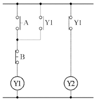

(1) 위의 시퀀스 제어회로에서 출력 $Y_1, Y_2$의 논리식을 구하시오.
[정답]
$$ ① Y_1: $$
$$ ② Y_2: $$

(2) 위의 시퀀스 제어회로를 무접점 회로로 나타내시오.
[정답]

---

## 해설) 논리회로 / 난이도 中

### 정답

(1) 논리식

$$ Y_1 = (Y_1 + A) \cdot B $$

$$ Y_2 = \overline{Y_1} $$

(2) 무접점 회로

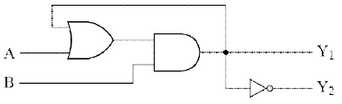

### 부분점수

| 점수 | 세부기준                                                |
| ---- | ------------------------------------------------------- |
| 4점  | 소문항 (1), (2) 총 2개가 모두 맞은 경우 4점 획득        |
| 2점  | 소문항 총 2개 중 정답 1개당 2점 획득, 오류가 있으면 0점 |

### 해설

논리식을 구할 때 유접점 회로의 a접점과 b접점을 구분하고 직렬과 병렬을 구분하여 무접점 논리회로로 표현해야 한다. a접점은 A로 b접점은 $\overline{A}$로 적고, 직렬연결이면 논리곱(AND, •)으로, 병렬연결이면 논리합(OR, +)으로 표현한다.

---

# Q5 다음과 같이 전류계 3대를 가지고 부하전력 및 역률을 측정하려고 한다. 각 전류계의 눈금이 $A_3 = 10[A], A_2 = 4[A], A_1 = 7[A]$일 때 물음에 답하시오. (단, 저항 $R = 25[\Omega]$이다.) [배점: 5점]

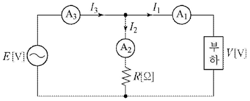

(1) 부하전력 [W]을 계산하시오.

[계산과정]

[정답]

(2) 부하 역률 [%]을 계산하시오.

[계산과정]

[정답]

---

# 단상 및 삼상 전력 측정

## 정답 및 해설

해설: 단순 계산형 / 난이도 下

(1) 부하전력 [W] 계산

[계산과정]

$$ P = \frac{25}{2}(10^2 - 4^2 - 7^2) = 437.5 [W] $$

[정답] 437.5 [W]

(2) 부하역률 계산

[계산과정]

$$ \cos\theta = \frac{10^2 - 4^2 - 7^2}{2 \times 4 \times 7} = 0.625 $$

[정답] 62.5 [%]

## 부분점수

| 점수 | 세부기준                                                        |
| ---- | --------------------------------------------------------------- |
| 5점  | 문항 (1), (2)가 모두 맞은 경우 5점 획득                         |
| 3점  | 문항 (1)의 계산과정과 답안이 모두 맞으면 3점, 오류가 있으면 0점 |
| 2점  | 문항 (2)의 계산과정과 답안이 모두 맞으면 2점, 오류가 있으면 0점 |

## 접근 POINT

단상전력 측정법인 3전류계법을 이용해서 풀이하는 문제로, 또 다른 단상전력 측정법인 3전압계법과 삼상전력 측정법인 2전력계법 공식을 함께 정리해둔다.

## 해설

### 단상전력 측정법

(1) 3전류계법: 전류계 3대로 단상 전력 및 역률을 측정하는 방법이다.

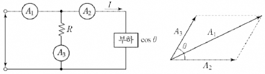

$A_1 = \sqrt{A_2^2 + A_3^2 + 2A_2A_3\cos\theta}$ 이므로 양변을 제곱한다.

$ A_1^2 = A_2^2 + A_3^2 + 2A_2A_3\cos\theta$ 이므로 $\cos\theta$를 구한다.

$ \cos\theta = \frac{A_1^2 - A_2^2 - A_3^2}{2A_2A_3} $가 된다.

이 경우 부하에 걸리는 전력 P는 다음과 같다.

$$ P = VI\cos\theta = RA_3 \times A_2 \times \frac{A_1^2 - A_2^2 - A_3^2}{2A_2A_3} = R\frac{(A_1^2 - A_2^2 - A_3^2)}{2}[W] $$

(2) 3전압계법: 전압계 3대로 단상전력 및 역률을 측정하는 방법이다.

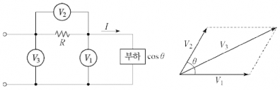

$ V_3 = \sqrt{V_1^2 + V_2^2 + 2V_1V_2\cos\theta}$ 이므로 양변을 제곱한다.

$ V_3^2 = V_1^2 + V_2^2 + 2V_1V_2\cos\theta $이므로 $\cos\theta$를 구한다.

$ \cos\theta = \frac{V_3^2 - V_1^2 - V_2^2}{2V_1V_2} $가 된다.

이 경우 부하에 걸리는 전력 P는 다음과 같다.

$$ P = V_1I\cos\theta = V_1 \times \frac{V_2}{R} \times \frac{V_3^2 - V_1^2 - V_2^2}{2V_1V_2} = \frac{1}{2R}(V_3^2 - V_1^2 - V_2^2)[W] $$

### 삼상전력 측정 (2전력계법)

단상 전력계 2대로 삼상전력과 역률을 측정하는 방법이다. 전력계의 지시값을 $P_1, P_2$라고 한다.

$$ P = P_1 + P_2 [W], P_r = \sqrt{3}(P_1 - P_2) [Var] $$

$$ P_a = 2\sqrt{P_1^2 + P_2^2 - P_1P_2} [VA] $$

$$ \cos\theta = \frac{P_1 + P_2}{2\sqrt{P_1^2 + P_2^2 - P_1P_2}} $$

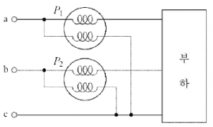

---

# Q6 수전전압 6,600 [V], 가공전선로의 % 임피던스가 58.5 [%]일 때 수전점의 3상 단락 전류가 8,000 [A]인 경우 기준용량을 계산하고 수전용 차단기의 정격차단용량을 다음 표에서 선정하시오. [배점: 6점]

차단기 정격차단용량 [MVA]

| 10  | 20  | 30  | 50  | 75  | 100 | 150 | 250 | 300 | 400 | 500 |
| --- | --- | --- | --- | --- | --- | --- | --- | --- | --- | --- |

(1) 기준용량

[계산과정]

[정답]

(2) 정격차단용량

[계산과정]

[정답]

---

# 정답 해설

해설: 단순 계산형 / 난이도 중

(1) 기준 용량

[계산 과정]

$$ 정격 전류 I_n = I_s \times \%Z = 8,000 \times 58.5\% = 4,680 [A] $$

$$ 용량 P_n = \sqrt{3} \times \text{공칭 전압} \times \text{정격 전류} = \sqrt{3} \times 6,600 [V] \times 4,680 [A] = 53.50 [MVA] $$

[정답] 53.50 [MVA]

(2) 정격 차단 용량

[계산 과정]

$$ 용량 P_s = \sqrt{3} \times \text{정격 전압} \times \text{정격 차단 전류} = \sqrt{3} \times 7,200 [V] \times 8,000 [A] = 99.77 [MVA] $$

※ [표] (99.77 [MVA] 이상), (100 [MVA]) 참고

[정답] 100 [MVA] 선정

## 부분 점수

| 점수 | 세부 기준                                                           |
| ---- | ------------------------------------------------------------------- |
| 6점  | 소문항 (1), (2) 총 2개의 계산 과정과 정답이 모두 맞은 경우 6점 획득 |
| 3점  | 소문항 총 2개 중 계산 과정과 정답이 모두 맞은 1개당 3점 획득        |

## 해설

[차단기 용량]

기준 용량 =$ \sqrt{3} \times \text{공칭 전압} \times \text{정격 전류} $

단락 용량 =$ \sqrt{3} \times \text{공칭 전압} \times \text{단락 전류} = \frac{100}{\%Z} P_n $

차단 용량 =$ \sqrt{3} \times \text{정격 전압} \times \text{정격 차단 전류}$ (여기서, 정격 차단 전류 \ge 단락 전류)

[공칭 전압과 정격 전압의 관계]

- 공칭 전압: 전선로를 대표하는 선간 전압

  (3.3, 6.6, 22, 22.9, 66, 154, 345, 765 [kVA] 등)

- 차단기 정격 전압: 사용상 기준이 되는 전압

| 공칭 전압 [kV] | 3.3 | 6.6 | 22  | 22.9 | 66   | 154 | 345 | 762 |
| -------------- | --- | --- | --- | ---- | ---- | --- | --- | --- |
| 정격 전압 [kV] | 3.6 | 7.2 | 24  | 25.8 | 72.5 | 170 | 362 | 800 |

---

# Q7 3상 3선식 1회선 배전선로의 말단에 늦은 역률 80[%]인 평형 3상의 집중부하가 있다. 변전소 인출구의 전압이 6,600 [V]인 경우 부하의 단자 전압을 6,000 [V] 이하로 떨어뜨리지 않기 위한 부하전력은 몇 [kW]인지 계산하시오. (단, 전선 1가닥당 저항은 1.4 [Ω], 리액턴스는 1.8 [Ω]이고, 기타의 선로정수는 무시한다.) [배점: 4점]

[계산과정]

[정답]

---

해설) 단순 계산형 / 난이도 中

정답

[계산과정]
$e = \frac{P}{V_r}(R + X \tan\theta)$을 변형하면

$$ P = \frac{e V_r}{R + X \tan\theta} = \frac{600 \times 6,000}{1.4 + 1.8 \times \frac{0.6}{0.8}} \times 10^{-3} \approx 1,309.09 [kW] $$

[정답] 1,309.09 [kW]

부분점수

| 점수 | 세부기준                                                     |
| ---- | ------------------------------------------------------------ |
| 4점  | 계산과정과 정답이 모두 맞은 경우 4점 획득, 오류가 있으면 0점 |

해설

3상 전압강하 공식을 이용하여 변형하고 정리해보면 다음과 같다.

$$ e = V_s - V_r = \sqrt{3} I (R \cos\theta + X \sin\theta) = \frac{P}{V_r}(R + X \tan\theta) $$

$$ 부하전류 I = \frac{P}{\sqrt{3} V_r \cos\theta} [A]를 대입한다. $$

$$ e = \sqrt{3} \times \frac{P}{\sqrt{3} V_r \cos\theta} \times (R \cos\theta + X \sin\theta) $$

$$ = \frac{P}{V_r} \left( R + X \frac{\sin\theta}{\cos\theta} \right) = \frac{P}{V_r} (R + X \tan\theta) [V] $$

$$ 부하전력 계산 P = \frac{e V_r}{R + X \tan\theta} $$

---

# Q8 어느 변압기의 2차 정격전압이 2,300 [V], 2차 정격전류가 43.5 [A], 2차 측에서 본 합성저항이 0.66 [Ω], 무부하손이 1,000 [W] 이다. 다음 조건일 때의 효율 [%]을 계산하시오. [배점: 6점]

(1) 전 부하 시 역률 100[%]와 80[%]인 경우

[계산과정]

[정답]

① 역률 100[%]인 경우:

② 역률 80[%]인 경우:

(2) 반 부하 시 역률 100[%]와 80[%]인 경우

[계산과정]

[정답]

① 역률 100[%]인 경우:

② 역률 80[%]인 경우:

---

# 해설) 복합 계산형 / 난이도 中

(1) 전부하 시 역률 100[%]일 때와 80[%]일 때 계산

[계산과정]

전부하 시 역률 100[%]일 때

$$ \eta = \frac{1 \times 2,300 \times 43.5 \times 1}{(1 \times 2,300 \times 43.5 \times 1) + 1,000 + (1^2 \times 43.5^2 \times 0.66)} \times 100 = 97.801 [\%] $$

전부하 시 역률 80[%]일 때

$$ \eta = \frac{1 \times 2,300 \times 43.5 \times 0.8}{(1 \times 2,300 \times 43.5 \times 0.8) + 1,000 + (1^2 \times 43.5^2 \times 0.66)} \times 100 = 97.267 [\%] $$

[정답] ① 97.8[%], ② 97.27[%]

(2) 반 부하 시 역률 100[%]일 때와 80[%]일 때 계산

[계산과정]

반 부하 시 역률 100[%]일 때

$$ \eta = \frac{\frac{1}{2} \times 2,300 \times 43.5 \times 1}{(\frac{1}{2} \times 2,300 \times 43.5 \times 1) + 1,000 + ((\frac{1}{2})^2 \times 43.5^2 \times 0.66)} \times 100 = 97.443 [\%] $$

반 부하 시 역률 80[%]일 때

$$ \eta = \frac{\frac{1}{2} \times 2,300 \times 43.5 \times 0.8}{(\frac{1}{2} \times 2,300 \times 43.5 \times 0.8) + 1,000 + ((\frac{1}{2})^2 \times 43.5^2 \times 0.66)} \times 100 = 96.825 [\%] $$

[정답] ① 97.44[%], ② 96.83[%]

부분점수

| 점수 | 세부기준                                                           |
| ---- | ------------------------------------------------------------------ |
| 6점  | 소문항 (1), (2) 총 2개의 계산과정과 정답이 모두 맞은 경우 6점 획득 |
| 3점  | 소문항 총 2개 중 계산과정과 정답이 모두 맞은 1개당 3점 획득        |

접근 POINT

변압기의 효율은 부하량과 역률에 따라 달라지는 것을 기억해야 한다. 출력 P[W]∝부하량 및 역률, 동손 P[W]∝부하량 관계가 있다.

해설

변압기의 효율

$$ \eta = \frac{\text{출력}}{\text{출력 + 손실}} \times 100 = \frac{\frac{1}{m} V \text{Icos}\theta}{\frac{1}{m} V \text{Icos}\theta + P_i + (\frac{1}{m})^2 P_c} \times 100 [\%] $$

전부하 동손이 $P_c (= P_r)$일 때, \frac{1}{m} 부분부하 시 동손은 $(\frac{1}{m})^2$ 가 되고, 철손은 무부하손이다.

$ \frac{1}{m} $부분부하 시, 변압기 최대효율 조건은 $(\frac{1}{m})^2 P_c = P_i $를 만족할 때이다.

### 응용문제 용량이 50[kVA] 변압기의 철손이 1[kW]이고 전부하 동손이 2[kW]이다. 이 변압기를 최대효율에서 사용하려면 부하를 약 몇 [kVA] 인가하여야 하는지 계산하시오.

변압기의 $\frac{1}{m}$ 부하 시 최대효율의 조건은 무부하손=부하손이다.

$$ P_i = (\frac{1}{m})^2 P_c 에서 \frac{1}{m} = \sqrt{\frac{P_i}{P_c}} = \sqrt{\frac{1}{2}} = 0.707 $$

$$ 부하용량(P_L) = 50 × 0.707 = 35.35 [kVA] $$

---

# Q9 지표면상 10[m] 높이의 수조에 분당 60[m³]의 물을 양수하는 데 사용되는 펌프용 전동기에 3상 전력을 공급하기 위하여 단상 변압기 2대를 V결선하였다. 조건이 다음과 같을 때 각 물음에 답하시오. [배점: 6점]

- 3상 전동기의 역률: 100[%]
- 펌프의 효율: 70[%]
- 동력에 20[%]의 여유를 두는 경우이다.

(1) 펌프용 전동기의 소요동력은 몇 [kW]인지 계산하시오.

[계산과정]

(2) 변압기 1대의 용량은 몇 [kVA]인지 계산하시오.

[계산과정]

---

# 해설) 단순 수식형 / 난이도 中

## 정답

(1) 전동기의 소요동력

[계산과정]

$$ P = \frac{9.8 \times 60}{60} \times 10 \times (1 + 0.2) \div 0.7 = 168 [kW] $$

$$ 또는 P = \frac{60 \times 10 \times (1 + 0.2)}{6.12 \times 0.7} = 168.067 \dots \approx 168.07 [kW] $$

[정답]: 168 [kW] 또는 168.07 [kW]

(2) 변압기 1대의 용량

[계산과정]

$$ P = \frac{168}{\sqrt{3}} = 96.994 \dots \approx 96.99 [kVA] $$

[정답]: 96.99 [kVA]

## 부분점수

| 점수  | 세부기준                                                       |
| ----- | -------------------------------------------------------------- |
| 6~0점 | (1), (2) 각 문제당 계산과정과 정답이 모두 맞은 경우만 3점 부여 |

## 접근 POINT

전동기의 소요동력 산정과 V결선 시의 사용할 수 있는 전력을 물어보는 문제이다.

먼저 전동기 소요동력 구하는 공식을 사용할 때 2가지 종류가 있는데, 주어진 조건에 따라서 어떠한 공식을 사용할지 결정할 수 있거나, 아니면 1개의 공식에서 사용하는 요소가 무엇인지 확실히 이해하고 암기하여 변형하여 사용하는 방법으로 문제를 해결할 수 있다.

또한, 3상 기본 결선방법인 V결선에 대한 이용률을 물어보는 문제가 대부분이지만 이처럼 역으로 변압기의 용량을 물어보는 문제로 바꾸어 출제도 된다.

## 공식 CHECK

$$ P = \frac{9.8Q'HK}{\eta} = \frac{9.8 \times 60}{60} \times \frac{Q \times H \times K}{\eta} = \frac{QHK}{6.12\eta} [kW] $$

- P: 전동기의 용량 [kW]
- Q: 분당 양수량 [m³/min]
- Q': 초당 양수량 [m³/sec]
- H: 양정(낙차) [m]
- η: 펌프의 효율 [%]
  - K: 여유계수 (1.1~1.2 정도) (= 1 + 여유도 [%]/100)

용량 $P_1$인 단상 변압기 2대로 3상 V결선 시 출력: $P_V = \sqrt{3}P_1, P_1 = \frac{P_V}{\sqrt{3}} $

## 해설

문제에서 주어진 조건이 분당 양수량이 주어졌으므로 다음 공식을 사용한다.

$$ P = \frac{QHK}{6.12\eta} = \frac{60 \times 10 \times (1 + 0.2)}{6.12 \times 0.7} = 168.067 \dots \approx 168.07 [kW] $$

또는 기본적인 수식인 아래 공식을 사용하여 초당 양수량으로 계산하여 사용해도 된다.

$$ P = \frac{9.8Q'HK}{\eta} = \frac{9.8 \times 60}{60} \times 10 \times (1 + 0.2) \div 0.7 = 168 [kW] $$

그런데 첫 번째 구한 값과 두 번째 구한 값이 차이가 생긴다.

그 이유는 $\frac{60}{9.8} = 6.122448 \dots \approx 6.12$의 근사값을 사용하였기 때문에 오차가 발생한 것이다. 중력과 관련된 상수인 g ≈ 9.8도 근사값이다.

---

# Q10 아래의 그림과 같은 전력계통이 있다. 각 부분의 % 임피던스는 그림에 보인 대로이며 모두가 10 [MVA]의 기준용량으로 환산된 것이다. 다음 조건에 따라 차단기 a에서의 단락용량 [MVA]을 계산하시오. [배점: 5점]

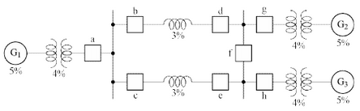

(1) 차단기 a의 바로 우측에서 단락고장이 일어났을 경우

[계산과정]

[정답]

(2) 차단기 a의 바로 좌측에서 단락고장이 일어났을 경우

[계산과정]

[정답]

---

## 정답 해설

해설) 복합 계산형 / 난이도 상

(1) 차단기 a의 바로 우측에서 단락고장이 일어났을 경우

[계산과정]

차단기 a에 흐르는 단락 전류: 발전기 $G_1$측

단락 용량 $P_s = \frac{10[MVA]}{9[\%]} \approx 111.11$ [MVA]

[정답] 111.11 [MVA]

(2) 차단기 a의 바로 좌측에서 단락고장이 일어났을 경우

[계산과정]

차단기 a에 흐르는 단락전류: 발전기 $G_2$와 발전기 $G_3$측

합성 %임피던스 = $\frac{4[\%] + 5[\%]}{2} + \frac{3[\%]}{2} = 6[\%] $

단락용량 $P_s = \frac{100[MVA]}{6[\%]} \approx 166.67 [MVA] $

[정답] 166.67 [MVA]

### 부분점수

| 점수 | 세부기준                                                        |
| ---- | --------------------------------------------------------------- |
| 5점  | 문항 (1), (2)가 모두 맞은 경우 5점 획득                         |
| 2점  | 문항 (1)의 계산과정과 답안이 모두 맞으면 2점, 오류가 있으면 0점 |
| 3점  | 문항 (2)의 계산과정과 답안이 모두 맞으면 3점, 오류가 있으면 0점 |

### 해설

차단기 a의 바로 우측에서 단락고장이 일어났을 경우에 $G_1$에서 공급되는 전류만 차단기 a에 흐르고, $G_2$ 및 $G_3$에서 공급되는 전류는 차단기 a를 통하지 않게 된다.

차단기 a의 바로 좌측에서 단락고장이 일어났을 경우에 $G_2$ 및 $G_3$에서 공급되는 전류는 차단기 a에 흐르고 $G_1$에서 공급되는 전류는 차단기 a를 통하지 않게 된다.

---

# Q11 다음 표를 참고하여 배전선로의 합성 최대전력을 계산하십시오. (단, 부등률은 1.30이다.) [배점: 4점]

| 수용가        | A   | B   | C   | D   |
| ------------- | --- | --- | --- | --- |
| 설비용량 [kW] | 10  | 20  | 30  | 20  |
| 수용률        | 0.8 | 0.8 | 0.6 | 0.6 |

[계산과정]

[정답]

---

해설) 단순 계산형 / 난이도 下

정답

[계산과정]

$$ 합성 최대전력 = \frac{10 \times 0.8 + 20 \times 0.8 + 30 \times 0.6 + 20 \times 0.6}{1.3} \approx 41.54 \text{[kW]} $$

[정답] 41.54[kW]

부분점수

| 점수 | 세부기준                                                     |
| ---- | ------------------------------------------------------------ |
| 4점  | 계산과정과 정답이 모두 맞은 경우 4점 획득, 오류가 있으면 0점 |

해설

[수용률]

$$ 수용률 = \frac{\text{최대수요전력}}{\text{설비용량}} $$

총 부하설비용량에 대한 최대 수요 전력의 비율이다. 수용설비가 동시에 사용되는 정도이다.

[부등률]

$$ 부등률 = \frac{\text{각 부하군의 최대수요전력의 합}}{\text{합성 최대수요전력}} \geq 1 $$

각 부하군의 최대수요전력의 합과 합성 최대수요전력과의 비이다. 최대부하를 나타내는 각 부하의 시간대가 다른 정도를 의미한다.

[부하율]

$$ 부하율 = \frac{\text{평균부하}}{\text{최대부하}} $$

평균부하: 정해진 기간동안 사용된 전력량의 평균이다.

최대부하: 정해진 기간에서의 최대전력이다.

1에 가까울수록 전원설비를 효율적으로 사용함을 의미한다.

---

# Q12 다음 조건을 기준으로 하여 이용하여 영상분, 정상분, 역상분을 계산하시오. [배점: 6점]

상순은 a-b-c이다.

$ V_a = 7.3\angle125^\circ, V_b = 0.4\angle -100^\circ, V_c = 4.4\angle154^\circ $[V]이다.

(1) 영상분 전압 $|V|$을 계산하시오.

[계산과정]

[정답]

(2) 정상분 전압 $|V|$을 계산하시오.

[계산과정]

[정답]

(3) 역상분 전압 $|V|$을 계산하시오.

[계산과정]

[정답]

---

# 정답 해설) 복합 계산형 / 난이도 上

(1) 영상분 전압

[계산과정]

$$ V_0 = \frac{1}{3}(V_a + V_b + V_c) $$

$$ = \frac{1}{3}(7.3\angle 12.5^\circ + 0.4\angle -100^\circ + 4.4\angle 154^\circ) $$

$$ = 1.03 + j1.04 [V] = 1.47\angle 45.11^\circ [V] $$

[정답] $1.47\angle 45.11^\circ $[V]

(2) 정상분 전압

[계산과정]

$$ V_1 = \frac{1}{3}(V_a + aV_b + a^2V_c) $$

$$ = \frac{1}{3}(7.3\angle 12.5^\circ + 1\angle 120^\circ \times 0.4\angle -100^\circ + 1\angle 240^\circ \times 4.4\angle 154^\circ) $$

$$ = 3.72 + j1.39 [V] = 3.97\angle 20.54^\circ [V] $$

[정답] $3.97\angle 20.54^\circ$ [V]

(3) 역상분 전압

[계산과정]

$$ V_2 = \frac{1}{3}(V_a + a^2V_b + aV_c) $$

$$ = \frac{1}{3}(7.3\angle 12.5^\circ + 1\angle 240^\circ \times 0.4\angle -100^\circ + 1\angle 120^\circ \times 4.4\angle 154^\circ) $$

$$ = 2.38 - j0.85 [V] = 2.52\angle -19.7^\circ [V] $$

[정답] $2.52\angle -19.7^\circ$ [V]

부분점수

| 점수 | 세부기준                                                          |
| ---- | ----------------------------------------------------------------- |
| 6점  | 소문항 (1)~(3) 총 3개의 계산과정과 정답이 모두 맞은 경우 6점 획득 |
| 2점  | 소문항 총 3개 중 계산과정과 정답이 모두 맞은 1개당 2점 획득       |

접근 POINT

필기 유형이지만 최근 5년간 2회 출제되었으므로 대칭분의 공식을 정확히 암기하고, 대칭분의 의미도 이해해야 한다.

해설

상전압($V_a, V_b, V_c$)과 영상전압($V_0$), 정상전압($V_1$), 역상전압($V_2$)의 관계 행렬

$$ \begin{pmatrix} V_a \\ V_b \\ V_c \end{pmatrix} = \begin{pmatrix} 1 & 1 & 1 \\ 1 & a^2 & a \\ 1 & a & a^2 \end{pmatrix} \begin{pmatrix} V_0 \\ V_1 \\ V_2 \end{pmatrix}, \begin{pmatrix} V_0 \\ V_1 \\ V_2 \end{pmatrix} = \frac{1}{3}\begin{pmatrix} 1 & 1 & 1 \\ 1 & a^2 & a \\ 1 & a & a^2 \end{pmatrix} \begin{pmatrix} V_a \\ V_b \\ V_c \end{pmatrix} $$

$$ 여기서, 1 + a + a^2 = 0, a^3 = 1, $$

$$ a = 1\angle 120^\circ = -\frac{1}{2} + j\frac{\sqrt{3}}{2}, a^2 = 1\angle 240^\circ = -\frac{1}{2} - j\frac{\sqrt{3}}{2} $$

---

# Q13 다음과 같이 접속된 3상 3선식 고압 수전설비의 변류기 2차 전류가 언제나 4.2[A]이었다. 이때, 수전전력[kW]을 계산하시오. (단, 수전전압은 6,600[V], 변류비는 50/5[A], 역률은 100[%]이다.) [배점: 5점]

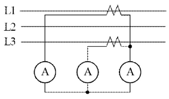

[계산과정]

[정답]

---

# 해설) 단순 계산형 / 난이도 下

정답

[계산과정]

$$ CT 1차전류 I_1 = 4.2 \times \frac{50}{5} = 42 [A] $$

$$ 수전전력 P = \sqrt{3} \times 6600 \times 42 \times 1 \times 10^{-3} = 480.124 [kW] $$

[정답] 480.12 [kW]

부분점수

| 점수 | 세부기준                                  |
| ---- | ----------------------------------------- |
| 4점  | 계산과정과 답이 모두 맞으면 4점 획득      |
| 0점  | 계산과정에 오류가 있거나 정답이 틀린 경우 |

접근 POINT

CT의 가동접속(정상 접속)에 의한 부하전력을 계산하는 문제이다. CT의 결선법에 유의(차동접속을 하면 답에 $\sqrt{3}$배 차이남)하여 1차 전류를 구하고 3상 수전전력을 계산한다.

해설

CT 결선법

① 가동 접속(정상 접속)

- $I_a$는 부하전류이며, $I_b, I_c$는 CT 2차 전류이다.

- $I_b + I_c$는 전류계 지시값으로, CT 2차측 전류와 같은 크기의 값을 나타낸다.

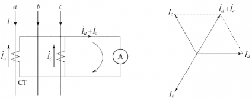

② 차동접속(교차접속)

- $I_c - I_a$는 전류계의 지시값이다.
- 전류계는 CT 2차측 전류($I_b$ 또는 $I_c$)의 $\sqrt{3}$배를 나타낸다.

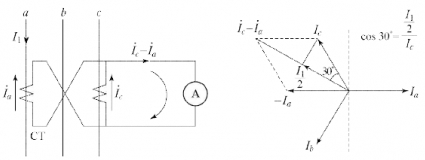

---

# Q14 5,000[kVA]의 변전설비를 가지고 있는 수용가에서 현재 5,000[kVA], 역률 75%의 부하를 공급하고 있다. 다음 물음에 답하시오. [배점: 8점]

(1) 1,000[kVA]의 전력용 콘덴서를 연결했을 경우 개선되는 역률을 계산하시오.

[계산과정]

[정답]

(2) 전력용 콘덴서를 연결한 후 80%의 부하를 추가하여 변압기 전용량까지 사용할 경우 증가시킬 수 있는 유효전력은 몇 [kW]인지 계산하시오.

[계산과정]

[정답]

(3) 이 경우 종합역률[%]을 계산하시오.

[계산과정]

[정답]

---

# 해설) 복합계산형 / 난이도 上

## 정답

(1) 개선되는 역률 계산

[계산과정]

$$ 부하의 유효전력 P = 5,000 \times 0.75 = 3,750[kW] $$

$$ 무효전력 Q = 5,000 \times \sqrt{1 - 0.75^2} = 3,307.189[kVar] $$

1,000[kVA] 콘덴서 설치 후 무효전력

$$ Q' = 3,307.189 - 1,000 = 2,307.189[kVar] $$

$$ 역률 \cos\theta = \frac{3,750}{\sqrt{3,750^2 + 2,307.19^2}} \times 100 = 85.170 [\%] $$

[정답] 85.17[%]

(2) 증가시킬 수 있는 유효전력

[계산과정]

추가 설치할 수 있는 부하를 P[kW]라고 한다.

$$ \sqrt{(3,750 + P)^2 + (2,307.19 + 0.75P)^2} = 5,000 $$

$$ P = 479.454[kW] $$

추가할 수 있는 최대 부하용량은 479.45[kW]이다.

[정답] 479.45[kW]

(3) 종합역률 계산

[계산과정]

$$ 추가 부하 설치 후 유효전력 = 3,750 + 479.45 = 4,229.45[kW] $$

$$ 무효전력 = 2,307.19 + 0.75 \times 479.45 = 2,666.777[kVar] $$

$$ 역률 \cos\theta = \frac{4,229.45}{\sqrt{4,229.45^2 + 2,666.777^2}} \times 100 = 84.589 [\%] $$

[정답] 84.59[%]

## 부분점수

| 점수 | 세부기준                                                        |
| ---- | --------------------------------------------------------------- |
| 8점  | 문항 (1), (2), (3)이 모두 맞은 경우 8점 획득                    |
| 2점  | 문항 (1)의 계산과정과 답안이 모두 맞으면 2점, 오류가 있으면 0점 |
| 3점  | 문항 (2)의 계산과정과 답안이 모두 맞으면 3점, 오류가 있으면 0점 |
| 3점  | 문항 (3)의 계산과정과 답안이 모두 맞으면 3점, 오류가 있으면 0점 |

## 접근 POINT

역률 개선용 콘덴서는 진상 무효전력을 통해 지상 무효전력의 크기를 줄여서 역률을 개선하는 원리이다. 이 문제처럼 추가 부하를 통하여 유효전력 P가 변하는 경우에는 공식 Q = $P(\tan\theta_1 - \tan\theta_2)$를 적용할 수 없음에 유의해야 한다. 이 공식은 유효전력 P가 일정한 조건에서만 적용이 가능하다.

## 해설

유효전력 P = $P_a \times \cos\theta$, 무효전력 Q = $P_a \times \sin\theta $

유효전력을 P, 역률을 $\cos\theta$일 때

피상전력 P_a = \frac{P}{\cos\theta}, 무효전력 Q = $P_a \times \tan\theta = P_a \times \frac{\sin\theta}{\cos\theta} $

## 역률의 개념

교류계통에는 인덕턴스 L, 정전용량 C가 존재하여 전압과 전류 사이에 위상차가 발생하는데 이 때의 위상차에 대한 인수(factor)를 회로의 역률(Power factor)이라 하며 $\cos\theta$로 표현한다.

$$ \cos\theta = \frac{\text{유효전력 [W]}}{\text{피상전력 [VA]}} = \frac{P}{VI} $$

## 역률 개선 원리

수전단에 콘덴서 Q 설치 시 유도성 무효전력을 보상하여 역률각 $\theta_1 \to \theta_2$이 되어 역률이 개선된다.

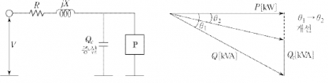

## 설치효과

**(1) 전력 손실의 감소:** 선로전류 감소로 전력손실($I^2R$)이 저감된다.

$$ P_1 = 3I^2R, P_1 \propto \frac{1}{\cos^2\theta} $$

$$ 전력 손실비: \frac{P_1}{P_2} = \frac{I_1^2R}{I_2^2R} = \left(\frac{\cos\theta_2}{\cos\theta_1}\right)^2 $$

$$ 전력손실 감소율: 1 - \left(\frac{\cos\theta_1}{\cos\theta_2}\right)^2 $$

(2) 전압강하의 감소

$$ 전압 강하식: \Delta V = \frac{P}{V_r}(R + X\tan\theta) $$

$$ \frac{\Delta V_1 - \Delta V_2}{P} = \frac{P_r R + P_r \tan\theta_1 \cdot X}{V_r} - \frac{P_r R + P_r \tan\theta_2 \cdot X}{V_r} $$

$$ = \frac{P_r X}{V_r}(\tan\theta_1 - \tan\theta_2) $$

$ [\tan\theta_1 - \tan\theta_2] >$ 0이므로, $\Delta V_1 > \Delta V_2$가 된다.

(3) 설비용량의 여유 증가

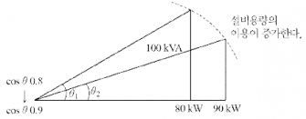

동일한 100[kVA]의 변압기에 대하여 부하 역률이 0.8에서 0.9로 증가하면, 변압기가 공급할 수 있는 유효전력은 80[kW]에서 90[kW]로 증가되어 설비의 여유도가 증가된다.

(4) 전기요금 경감: 역률이 90~95[%]까지일 경우 기본요금이 0.5[%] 할인된다.

---

# Q15 다음 진리표를 보고 물음에 답하시오. [배점: 6점]

| A   | B   | C   | Y₁  | Y₂  |
| --- | --- | --- | --- | --- |
| 0   | 0   | 0   | 0   | 1   |
| 0   | 0   | 1   | 0   | 1   |
| 0   | 1   | 0   | 0   | 1   |
| 0   | 1   | 1   | 0   | 0   |
| 1   | 0   | 0   | 0   | 1   |
| 1   | 0   | 1   | 1   | 1   |
| 1   | 1   | 0   | 1   | 1   |
| 1   | 1   | 1   | 1   | 0   |

(1) 출력 $Y_1, Y_2$의 논리식을 작성하시오.
[계산과정]

[정답]
$$ ① Y_1 = $$
$$ ② Y_2 = $$

(2) (1)에 대하여 유접점 회로와 무접점 회로를 완성하시오.

① 유접점 회로

② 무접점 회로

---

# 정답 해설

(1) 논리식 작성

[계산과정]

$$ Y_1 = \overline{A} \cdot B \cdot \overline{C} + A \cdot \overline{B} \cdot \overline{C} + A \cdot \overline{B} \cdot C $$

$$ = A \cdot (\overline{B} \cdot \overline{C} + \overline{B} \cdot C) \text{ (드모르간 법칙)} = A \cdot (B + C) $$

$$ Y_2 = (\overline{A} \cdot B \cdot \overline{C} + A \cdot \overline{B} \cdot C) (: 여집합) $$

$$ = (B \cdot \overline{C}) (: A + \overline{A} = 1) = B + \overline{C} (: A + \overline{A} = 1) $$

**[정답]** ① $Y_1 = A \cdot (B + C), ② Y_2 = B + \overline{C} $

(2) 유접점 회로와 무접점 회로 완성

[정답]

① 유접점 회로

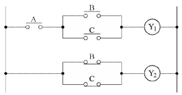

② 무접점 회로

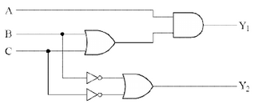

부분점수

| 점수 | 세부기준                                                          |
| ---- | ----------------------------------------------------------------- |
| 6점  | 소문항 (1)~(2) 총 2개의 계산과정과 정답이 모두 맞은 경우 6점 획득 |
| 2점  | 소문항 (1)의 계산과정과 정답이 모두 맞은 경우 2점 획득            |
| 4점  | (2)의 도면작성 2개 중 정답 1개당 2점 획득                         |

---

# Q16 폭이 15[m]인 도로의 양쪽에 20[m] 간격을 두고 대칭 배열로 가로등이 점등되어 있다. 한 등의 전광속은 8,000 [lm], 조명률은 45[\%]일 경우 도로의 조도를 계산하시오. [배점: 5점]

[계산과정]

[정답]

---

해설) 단순 계산형 / 난이도 下

정답

[계산과정]
$$ E = \frac{8,000 \times 0.45}{\frac{1}{2} \times 20 \times 15 \times 1} = 24 [lx] $$

[정답] 24[lx]

부분점수

| 점수 | 세부기준                             |
| ---- | ------------------------------------ |
| 5점  | 계산과정과 답이 모두 맞으면 5점 획득 |
| 0점  | 계산과정과 답에 오류가 있으면 0점    |

접근 POINT

도로 조명 설계를 위하여 FUN=EAD를 적용하여 풀이할 때, 조명의 배열 상태에 유의하여 면적 A를 구한다.

해설

조명 공식 FUN=EAD

F(광속, lm), U(조명률, %), N(등기구 수), E(조도, lx), A(면적), D(감광보상률)

문제의 조건은 도로 양쪽 대칭 배열이므로 면적 A =$ \frac{1}{2}BS$를 적용한다.

---

# Q17 다음 도면은 22.9[kV] 특고압 수전설비의 도면이다. 다음 물음에 각각 답하시오. [배점: 13점]

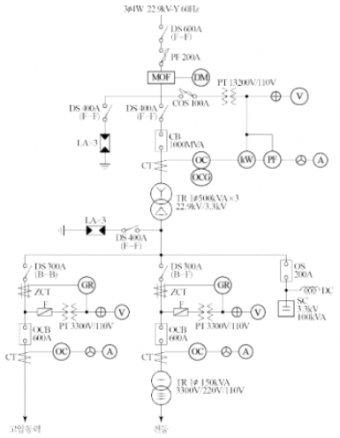

(1) DM의 명칭을 쓰시오.

[정답]

(2) 단로기의 정격전압을 쓰시오.

[정답]

(3) PF의 역할을 쓰시오.

[정답]

(4) SC의 역할을 쓰시오.

[정답]

(5) 22.9[kV] 피뢰기의 정격전압을 쓰시오.

[정답]

(6) ZCT의 역할을 쓰시오.

[정답]

(7) GR의 역할을 쓰시오.

[정답]

(8) CB의 역할을 쓰시오.

[정답]

(9) 1대의 전압계로 3상 전압을 측정하기 위한 기기의 약호를 쓰시오.

[정답]

(10) 1대의 전류계로 3상 전류를 측정하기 위한 기기의 약호를 쓰시오.

[정답]

(11) OS의 명칭이 무엇인지 쓰시오.

[정답]

(12) MOF의 기능을 쓰시오.

[정답]

(13) 3.3[kV]측 차단기에 적힌 전류값 600[A]가 의미하는 것을 쓰시오.

[정답]

---

# 정답

해설) 복합 이론형 / 난이도 中

(1) 최대수요전력량계

(2) 25.8[kV]

(3) 과전류 시 용단되어 기기를 보호한다.

(4) 역률을 개선한다.

(5) 18[kV]

(6) 지락사고 시 영상 전류를 검출한다.

(7) ZCT에서 검출된 영상전류에 의해 차단기 트립코일을 여자시킨다.

(8) 부하전류 개폐, 사고전류 차단

(9) VS

(10) AS

(11) 유입개폐기

(12) 전기계기 또는 측정장치와 함께 사용되는 전류 및 전압의 변성용 기기

(13) 정격차단전류

## 부분점수

| 점수   | 세부기준                                       |
| ------ | ---------------------------------------------- |
| 13~0점 | 소문항 총 13개 중 정답 1개당 부분점수 1점 획득 |

## 해설

도면을 보고 해당 명칭을 묻는 문제로 암기 위주로 접근해야 한다.

---
