# Q1 어떤 기간 중 수용설비의 최대 수요전력 [kW]과 설비용량의 합 [kW]의 비를 나타내는 용어를 무엇이라고 하는지 쓰시오. [배점: 4점]

[정답]

---

# 정답 해설

해설) 단답 암기형 / 난이도 下

## 정답

### 수용률

### 부분점수

| 점수  | 세부기준                         |
| ----- | -------------------------------- |
| 4~0점 | 정답일 경우 4점, 오답일 경우 0점 |

## 해설

(1) 수용률

- 수용률 = $\frac{최대수용전력}{총부하설비용량} $

- 총 부하 설비용량에 대한 최대 수용전력의 비율이다.
- 수용설비가 동시에 사용되는 정도이다.

(2) 부등률

- 부등률 = $\frac{각 부하군의 최대수요전력의 합}{합성 최대수요전력}$ ≥ 1

- 각 부하군의 최대수요전력의 합과 합성 최대수요전력과의 비이다.
- 최대 부하를 나타내는 각 부하의 시간대가 다른 정도를 의미한다.

(3) 부하율

- 부하율 = $\frac{평균수용전력}{최대수용전력} $

- 평균 수용전력: 정해진 기간 동안에 사용된 전력량의 평균이다.
- 최대 수용전력: 정해진 기간에서의 피크 부하일 때 최대로 사용하는 전력이다.
- 1에 가까울수록 전원설비를 효율적으로 사용함을 의미한다.
- 한전 전원 2개를 공급하여 비상시 예비회선으로 전환한다.

---

# Q2 다음은 상용전원과 예비전원을 운전할 경우에 유의하여야 할 사항이다. ( ) 안에 알맞은 내용을 쓰시오. [배점: 4점]

상용전원과 예비전원 사이에는 병렬운전을 하지 않는 것이 원칙이므로 수전용 차단기와 발전용 차단기 사이에는 전기적 또는 기계적 (①)을 시설해야 하며 (②)를 사용해야 한다.

[정답]

①

②

---

# 해설) 단답 암기형 / 난이도 下

정답

1. 인터록(Inter-lock)
2. 자동 전환 개폐기 또는 자동 절체 개폐기 (또는 ATS)

부분점수

| 점수  | 세부기준                                            |
| ----- | --------------------------------------------------- |
| 4~0점 | ①과 ②의 소문항 2개 중 정답 1개당 부분 점수 2점 획득 |

해설

(1) 인터록(Inter-lock)은 동시 투입을 방지하는 역할을 한다.

(2) 자동 전환 개폐기(ATS: Automatic Transfer Switch) → 수용가 부하측

- 비상시에는 전원을 자동으로 전환하여 공급
- 평상시에는 한전 전원을 공급 (일반부하)
- 정전시에는 예비 발전기 가동 (소방부하)

(3) 자동 부하 전환 개폐기(ALTS: Auto Load Transfer Switch) → 한전 인입측

- 정전시 큰 피해가 갈 수 있는 수용 시설(병원, 군사시설) 등에 설치한다.

---

# Q3 다음 각 계전기의 이름을 작성하시오. [배점: 4점]

(1) OCR

(2) OVR

(3) UVR

(4) GR

[정답]

(1)

(2)

(3)

(4)

---

## 단답 암기형 / 난이도 下

정답

(1) 과전류 계전기 (Over Current Relay)
(2) 과전압 계전기 (Over Voltage Relay)
(3) 부족전압 계전기 (Under Voltage Relay)
(4) 지락 계전기 (Ground Relay)

부분점수

| 점수    | 세부기준                                            |
| ------- | --------------------------------------------------- |
| 4점~0점 | (1)~(4) 소문항 4개 중 정답 1개당 부분 점수 1점 획득 |

접근 POINT

계전기의 종류별로 명칭과 약어를 정리하여 암기해야 한다.

해설

- OCR: Over Current Relay (과전류 계전기)
- OVR: Over Voltage Relay (과전압 계전기)
- UVR: Under Voltage Relay (부족전압 계전기)
- GR: Ground Relay (지락 계전기)
- CLR: Current Limiting Relay (한류 계전기)
- DFR: Differential Relay (차동 계전기)
- RCR: Reclosing Relay (재폐로 계전기)
- SR: Short-circuit Relay (단락 계전기)
- THR: Thermal Relay (열동 계전기)
- TR: Temperature Relay (온도 계전기)

---

# Q4 전기설비를 방폭화한 방폭기기의 구조 중 종류를 4가지 쓰시오.[배점: 4점]

[정답]

①

②

③

④

---

# 해설) 서술 암기형/ 난이도 下

## 정답

1. 내압 방폭구조
2. 압력 방폭구조
3. 유입 방폭구조
4. 몰드 방폭구조

## 부분점수

| 점수    | 세부기준                                        |
| ------- | ----------------------------------------------- |
| 4점~0점 | ①~④ 소문항 4개 중 정답 1개당 부분 점수 1점 획득 |

## 해설

[ KS C IEC 60079-0 ] 방폭구조의 종류 및 기호

| 구분              | 기호 |
| ----------------- | ---- |
| 내압 방폭구조     | d    |
| 안전증 방폭구조   | e    |
| 본질안전 방폭구조 | i    |
| 몰드 방폭구조     | m    |
| 유입 방폭구조     | o    |
| 압력 방폭구조     | p    |
| 충전 방폭구조     | q    |
| 특수 방폭구조     | s    |

---

# Q5 다음은 전력계통에 이용되는 리액터에 대한 내용이다. 빈칸에 알맞은 명칭을 쓰시오. [배점: 6점]

| 역할                    | 명칭 |
| ----------------------- | ---- |
| 단락 전류 제한          | ①    |
| 페란티 현상 방지        | ②    |
| 변압기 중성점 아크 소호 | ③    |

[정답]

①

②

③

---

# 해설) 단답 암기형 / 난이도 下

## 정답

1. 한류 리액터
2. 분로(병렬) 리액터
3. 소호 리액터

## 부분점수

| 점수    | 세부기준                                        |
| ------- | ----------------------------------------------- |
| 6점~0점 | ①~③ 소문항 3개 중 정답 1개당 부분 점수 2점 획득 |

## 해설

| 명칭              | 역할                           |
| ----------------- | ------------------------------ |
| 한류 리액터       | 단락 전류 제한                 |
| 분로(병렬) 리액터 | 페란티 현상 방지               |
| 소호 리액터       | 변압기 중성점 아크 소호        |
| 직렬 리액터       | 전력용 콘덴서의 제5고조파 제한 |

---

# Q6 다음은 고압유도전동기의 기동반 단선결선도이다. 다음 각 물음에 답하시오. [배점: 5점]

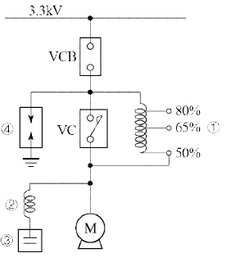

(1) 위 도면의 고압 유도전동기 기동방식을 무엇이라고 하는지 쓰시오.

[정답]

(2) 위 도면의 ①~④의 명칭을 각각 작성하시오.

[정답]

①

②

③

④

---

# 정답 해설

해설) 단답 암기형 / 난이도 下

(1) 리액터 기동법

(2) 도면의 명칭 작성

① 기동용 리액터

② 직렬 리액터

③ 전력용 콘덴서

④ 서지흡수기(SA)

부분점수

| 점수  | 세부기준                                                        |
| ----- | --------------------------------------------------------------- |
| 5~0점 | (1)과 (2)의 소문항 4개 총 5문항 중 정답 1개당 부분점수 1점 획득 |

접근 POINT

유도전동기의 기동법 중 리액터 기동법에 대한 도면을 보고 기동방법 및 부속품의 명칭을 물어보는 문제로 그림에 실마리가 있다.

해설

[형 유도전동기의 리액터 기동법]

전동기의 1차 측에 직렬로 철심이 든 리액터를 설치하고 그 리액턴스 값을 조정하여 전동기에 공급되는 전압을 제어함으로써 기동전류 및 토크를 제어하는 방식이다.

[도면 해석]

공급되는 전력이 3.3[kV]로 고압임을 알 수 있다. 그리고, 오른쪽 코일 그림에 50, 65, 80[%]의 비율이 적혀 있는 것으로 리액턴스 값을 조정한다는 것을 확인할 수 있다.

그림의 모터의 왼편에는 코일과 콘덴서가 붙어 있으며, 콘덴서는 병렬로, 코일은 콘덴서에 직렬로 연결된 모습으로 명칭을 확인할 수 있다. 여기서 주의할 점은 ④의 기호는 피뢰기(LA)와 서지흡수기(SA) 모두를 의미하는데 수변전설비가 아닌 고압 유도전동기의 기동반 단선도이기 때문에 서지흡수기가 된다. 만약에 수변전설비였다면 피뢰기가 맞다.

---

# Q7 다음과 같은 무접점 논리회로에 대응하는 유접점 회로를 그린 후, 논리식으로 표현하시오. [배점: 3점]

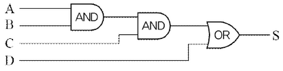

(1) 유접점 회로를 그리시오.

[정답]

(2) 논리식으로 표현하시오.

[정답]

---

# 해설) 논리회로 / 난이도 中

## 정답

(1) 유접점 회로 작성

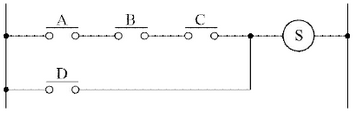

(2) 논리식 표현

$$ 논리식 S = A \cdot B \cdot C + D $$

| 부분점수 | 점수 | 세부기준                                    |
| -------- | ---- | ------------------------------------------- |
|          | 3점  | 소문항 2개 모두 정답인 경우 3점 획득        |
|          | 2점  | 소문항 (1)번 정답인 경우 부분 점수 2점 획득 |
|          | 1점  | 소문항 (2)번 정답인 경우 부분 점수 1점 획득 |

## 해설

A, B, C 직렬에 D의 병렬회로이다.

$$ X = A \cdot B $$

$$ Y = X \cdot C = A \cdot B \cdot C $$

$$ S = Y + D = A \cdot B \cdot C + D $$

---

# Q8 다음 무접점 논리회로를 논리식으로 표현하고, 이에 대응하는 유접점 회로를 그리시오. [배점: 4점]

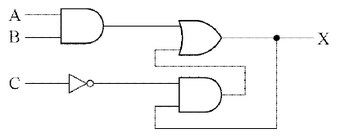

(1) 위의 논리회로를 논리식으로 나타내시오.

[정답]

(2) 위의 논리회로를 유접점 회로로 바꾸어 그리시오.

[정답]

---

## 해설) 논리회로 / 난이도 中

### 정답

(1) 논리식 표현

$$ 논리식 X = A \cdot B + C \cdot X $$

(2) 유접점 회로 작성

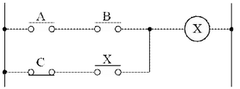

### 부분점수

| 점수 | 세부기준                                    |
| ---- | ------------------------------------------- |
| 4점  | 소문항 2개 모두 정답인 경우 4점 획득        |
| 2점  | 소문항 (1)번 정답인 경우 부분 점수 2점 획득 |
| 2점  | 소문항 (2)번 정답인 경우 부분 점수 2점 획득 |

### 해설

출력이 입력에 사용되어 논리식을 작성할 때 주의해야 하며, NOT 논리회로가 사용되어 유접점 회로를 작성할 때, a접점과 b접점을 구분하여 사용해야 한다.

---

# Q9 그림과 같이 높이 5[m]의 점에 있는 백열전등에서 광도 12,500 [cd]의 빛이 수평거리 7.5 [m]의 점 P에 주어지고 있다. 다음 각 물음에 답하시오. [배점: 4점]

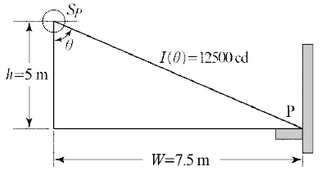

(1) P점에서 수평면 조도를 계산하시오.
[계산과정]

[정답]

(2) P점에서 수직면 조도를 계산하시오.
[계산과정]

[정답]

---

# 해설) 복합 계산형 / 난이도 상

## (1) 수평면 조도 계산

[계산과정]

$$ E_h = \frac{I}{r^2} \cos\theta = \frac{12,500}{(\sqrt{5^2 + 7.5^2})^2} \times \frac{5}{\sqrt{5^2 + 7.5^2}} \approx 84.69 [lx] $$

[정답] 84.69 [lx]

## (2) 수직면 조도 계산

[계산과정]

$$ E_v = \frac{I}{r^2} \sin\theta = \frac{12,500}{(\sqrt{5^2 + 7.5^2})^2} \times \frac{7.5}{\sqrt{5^2 + 7.5^2}} \approx 127.80 [lx] $$

[정답] 127.80 [lx]

## 부분점수

| 점수 | 세부기준                                                      |
| ---- | ------------------------------------------------------------- |
| 4점  | 소문항 2문제 계산과정과 정답이 모두 맞으면 4점 획득           |
| 2점  | 소문항 (1)번 계산과정과 정답이 모두 맞으면 부분 점수 2점 획득 |
| 2점  | 소문항 (2)번 계산과정과 정답이 모두 맞으면 부분 점수 2점 획득 |

## 해설

### [수평면 조도 공식과 변형]

$$ E_h = \frac{I}{r^2} \cos\theta = \frac{I}{(\frac{h}{\cos\theta})^2} \cos\theta = \frac{I}{h^2} \cos^3\theta = \frac{I}{r^3} h (여기서, \cos\theta = \frac{h}{r}, r = \frac{h}{\cos\theta}) $$

### [수직면 조도 공식과 변형]

$$ E_v = \frac{I}{r^2} \sin\theta = \frac{I}{(\frac{w}{\sin\theta})^2} \sin\theta = \frac{I}{w^2} \sin^3\theta = \frac{I}{r^3} w (여기서, \sin\theta = \frac{w}{r}, r = \frac{w}{\sin\theta}) $$

---

# Q10 발전기의 최대출력은 400 [kW]이며, 일 부하율을 40 [%]로 운전하고 있다. 중유의 발열량은 9,600 [kcal/L], 열효율은 36 [%]일 때 하루 동안에 소비되는 연료량 [L]은 얼마인지 계산하시오. [배점: 5점]

[계산과정]

발전기의 출력 = 400 kW × 40% = 160 kW

1kW = 860 kcal/h 이므로, 160 kW = 160 kW × 860 kcal/h = 137600 kcal/h

하루 동안 발생하는 열량 = 137600 kcal/h × 24 h = 3302400 kcal

$$ 소비되는 연료량 = \frac{3302400}{9600 \times 0.36} \approx 958.9 L $$

따라서 하루 동안 소비되는 연료량은 약 959 L이다.

[정답] 959 L

---

## 해설) 단순 계산형 / 난이도 中

정답

[계산과정]

$$ B = \frac{860Pt}{H\eta} = \frac{860 \times 400 \times 24 \times 0.4}{9,600 \times 0.36} = 955.555 \approx 955.56 [L] $$

[정답] 955.56[L]

부분점수

| 점수    | 세부기준                                                 |
| ------- | -------------------------------------------------------- |
| 5점~0점 | 계산과정과 정답이 모두 맞으면 5점 획득 오류가 있으면 0점 |

해설

$$ BH\eta = 860Pt, P = \frac{BH\eta}{860t}, B = \frac{860Pt}{H\eta} $$

- P: 정격출력 [kW]
- B: 연료량 [L]
- H: 발열량 [kcal/L]
- η: 효율
- t: 운전시간 [h]

$$ 부하율 = \frac{평균전력}{최대수요전력}, 평균전력 = 최대수요전력 × 부하율 $$

---

# Q11 3상 송전선로의 5[km] 지점에 1,000[kW], 역률 0.8인 부하가 있을 때, 전력용 콘덴서를 설치하여 역률을 95[%]로 개선하였다. 다음의 경우에 역률 개선 전의 몇 [%] 인지 계산하시오. (단, 1상당 임피던스는 0.3 + j0.4 [Ω/km], 부하의 전압은 6,000 [V]로 일정하다.)

[배점: 10점]

(1) 전압강하를 계산하시오.

[계산과정]

[정답]

(2) 전력손실을 계산하시오.

[계산과정]

[정답]

---

# 정답 해설

(1) 전압강하 계산

[계산과정]

$$ 선로 임피던스 Z = (0.3 + j0.4) \times 5 = 1.5 + j2 [\Omega] $$

역률 개선 전 전압강하 계산

$$ e = \frac{1,000 \times 10^3}{6,000} \times (1.5 + 2 \times \frac{0.6}{0.8}) = 500 [V] $$

역률 개선 후 전압강하 계산

$$ e = \frac{1,000 \times 10^3}{6,000} \times (1.5 + 2 \times \frac{\sqrt{1 - 0.95^2}}{0.95}) = 359.561 [V] $$

역률 개선 전후 전압강하의 비율은 $\frac{359.561}{500} \times 100 = 71.912$ [%]

[정답] 71.91 [%]

(2) 전력손실 계산

[계산과정]

전력손실은 $P_1 = 3I^2R = 3 \left( \frac{P}{\sqrt{3}V \cos \theta} \right)^2 R = \frac{P^2R}{V^2 \cos^2 \theta}$ 로 $\cos^2 \theta$에 반비례한다.

역률 개선 전후 전력손실의 비율은 $\left( \frac{1}{0.95} \right)^2 / \left( \frac{1}{0.8} \right)^2 \times 100$ = 70.914 [%]

[정답] 70.91 [%]

부분점수

| 점수 | 세부기준                                                         |
| ---- | ---------------------------------------------------------------- |
| 10점 | (1), (2)번이 모두 정답인 경우 10점 획득                          |
| 5점  | 문항 (1)의 계산과정과 답이 모두 맞은 경우 5점, 오류가 있으면 0점 |
| 5점  | 문항 (2)의 계산과정과 답이 모두 맞은 경우 5점, 오류가 있으면 0점 |

해설

[병렬 콘덴서(역률 개선용 콘덴서) 설치 효과]

전력 손실의 감소: 선로전류 감소로 전력손실$(I^2R)$이 저감

$P_1 = 3I^2R = \frac{P^2R}{V^2 \cos^2 \theta}, P_1 \propto \frac{1}{\cos^2 \theta}$ (전력손실은 $\cos^2 \theta$에 반비례)

전력 손실비: $\frac{P_2}{P_1} = \frac{I_2^2R}{I_1^2R} = \left( \frac{\cos \theta_1}{\cos \theta_2} \right)^2 $

전력손실 감소율: $1 - \left( \frac{\cos \theta_1}{\cos \theta_2} \right)^2 $

[전압강하의 감소]

전압 강하 $\Delta V = \frac{P_r}{V_r}(R + X \tan \theta)$ 에서

$$ \Delta V_1 - \Delta V_2 = \frac{P_r}{V_r}(R + P_r \tan \theta_1 \cdot X) - \frac{P_r}{V_r}(R + P_r \tan \theta_2 \cdot X) $$

$$ = \frac{P_rX}{V_r} (\tan \theta_1 - \tan \theta_2) $$

$ [\tan \theta_1 - \tan \theta_2]$ > 0이므로, $\Delta V_1 > \Delta V_2$가 된다.

[설비 용량의 여유 증가]

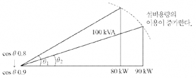

동일한 100[kVA]의 변압기에 대하여 부하 역률이 0.8에서 0.9로 증가하면, 변압기가 공급할 수 있는 유효전력은 80[kW]에서 90[kW]로 증가되어 설비의 여유도가 증가된다.

[전기요금 경감]

역률 90~95[%]까지일 경우 기본요금 0.5[%] 할인된다.

---

# Q12 가로 10[m], 세로 16[m], 천장의 높이 3.85[m], 작업면의 높이 0.85[m], 작업면 조도 300[lx]인 사무실에 천장 직부 형광등 F40×2를 설치하려고 한다. 다음 물음에 답하시오. [배점: 7점]

(1) 이 사무실의 실지수를 계산하시오.

[계산과정]

[정답]

(2) 이 사무실의 천장 반사율 70[%], 벽 반사율 50[%], 바닥 반사율 10[%], 40[W] 형광등 1등의 광속 3,150[lm], 보수율 70[%], 조명률 61[%]로 한다면 이 사무실에 필요한 소요 등기구 수를 계산하시오.

[계산과정]

[정답]

---

# 정답 해설

해설) 복합 계산형 / 난이도 중

(1) 실지수 계산

[계산과정]

$$ 실지수 RI = \frac{XY}{H(X+Y)} = \frac{10 \times 16}{(3.85 - 0.85) \times (10 + 16)} \approx 2.05 $$

[정답] 2.05

(2) 소요 등기구 수 계산

[계산과정]

$$ FUN = EAD (여기서, D = \frac{1}{M}) $$

$$ N = \frac{EAD}{FU} = \frac{300 \times (10 \times 16) \times \frac{1}{0.7}}{(3,150 \times 2) \times 0.61} \approx 17.84 $$

[정답] 18[등]

부분점수

| 점수 | 세부기준                                                         |
| ---- | ---------------------------------------------------------------- |
| 7점  | (1), (2)번이 모두 정답인 경우 7점 획득                           |
| 2점  | 문항 (1)의 계산과정과 답이 모두 맞은 경우 2점, 오류가 있으면 0점 |
| 5점  | 문항 (2)의 계산과정과 답이 모두 맞은 경우 5점, 오류가 있으면 0점 |

해설

H = 천장의 높이(광원의 높이) - 작업면의 높이

감광보상율 $D = \frac{1}{보수율}$ 이고, 소요 등기구 수는 소수로 나올 수는 없으므로 올림하여 18[등]이 답이 된다.

---

# Q13 어떤 부하에 그림과 같이 접속된 전압계, 전류계 및 전력계의 지시가 각각 V = 220[V], I = 25[A], W_1 = 5.6[kW], $W_2$ = 2.4[kW]이다. 이 부하에 대하여 다음 각 물음에 답하시오. [배점: 6점]

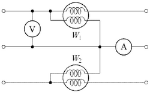

(1) 이 부하의 소비전력은 몇 [kW]인지 계산하시오.
[계산과정]

소비전력은 $W = W_1 - W_2$ 로 계산할 수 있습니다.

$$ W = 5.6[kW] - 2.4[kW] = 3.2[kW] $$

[정답] 3.2 kW

(2) 이 부하의 부하역률은 몇 [%]인지 계산하시오.
[계산과정]

피상전력 S는 다음과 같이 계산됩니다.

$$ S = VI = 220[V] \times 25[A] = 5500[VA] = 5.5[kVA] $$

역률 $\cos \theta$는 다음과 같이 계산됩니다.

$$ \cos \theta = \frac{W}{S} = \frac{3.2[kW]}{5.5[kVA]} \approx 0.5818 $$

퍼센트로 나타내면:

$$ \cos \theta \times 100\% \approx 58.18\% $$

[정답] 약 58.18%

---

# 정답 해설

해설) 복합 계산형 / 난이도 中

(1) 소비전력 계산

[계산과정]

$$ P = W_1 + W_2 = 5.6 + 2.4 = 8 [kW] $$

[정답] 8[kW]

(2) 부하역률 계산

[계산과정]

피상전력 $P_a = \sqrt{3} VI = \sqrt{3} \times 220 \times 25$ [VA]

역률 $\cos\theta = \frac{P}{P_a} = \frac{8 \times 10^3}{\sqrt{3} \times 220 \times 25} \times 100 \approx 83.98$ [%]

[정답] 83.98 [%]

부분점수

| 점수 | 세부기준                                                         |
| ---- | ---------------------------------------------------------------- |
| 6점  | (1), (2)번이 계산과정과 답이 모두 맞은 경우 6점 획득             |
| 2점  | 문항 (1)의 계산과정과 답이 모두 맞은 경우 2점, 오류가 있으면 0점 |
| 4점  | 문항 (2)의 계산과정과 답이 모두 맞은 경우 4점, 오류가 있으면 0점 |

해설

2전력계법

$$ 유효전력 P = W_1 + W_2 $$

$$ 무효전력 Q = \sqrt{3} |W_1 - W_2| $$

$$ 피상전력 P_a = \begin{cases} \sqrt{3} VI & \text{(전압계, 전류계 ○)} \\ 2\sqrt{W_1^2 + W_2^2 - W_1W_2} & \text{(전압계, 전류계 ×)} \end{cases} $$

$$ 역률 \cos\theta = \frac{P}{P_a} $$

---

# Q14 정격전압이 같은 두 변압기가 병렬로 운전 중이다. A 변압기의 정격용량은 20[kVA], %임피던스는 4[%]이고 B 변압기의 정격용량은 75[kVA], %임피던스는 5[%]일 때 다음 각 물음에 답하시오. (단, 변압기 A, B의 내부저항과 누설 리액턴스의 비는 다음 수식과 같다.)

$$ \frac{R_a}{X_a} = \frac{R_b}{X_b} $$

(1) 2차 측의 부하 용량이 60[kVA]일 때 A, B 변압기가 분담하는 전력 [kVA]는 얼마인지 계산하시오.

[계산과정]

[정답]

(2) 2차 측의 부하 용량이 120[kVA]일 때 A, B 변압기가 분담하는 전력 [kVA]는 얼마인지 계산하시오.

[계산과정]

[정답]

(3) 두 변압기가 과부하되지 않는 범위 내에서 2차 측 최대 부하용량 [kVA]는 얼마인지 계산하시오.

[계산과정]

[정답]

---

# 해설) 복합 계산형 / 난이도 中

(1) 부하용량이 60[kVA]일 때 변압기가 분담하는 전력

[계산과정]

$$ \frac{P_A}{P_B} = \frac{A \text{변압기의 용량}}{B \text{변압기의 용량}} \times \frac{\%Z_B}{\%Z_A} = \frac{20k}{75k} \times \frac{5}{4} = \frac{1}{3} , P_B = 3P_A $$

$$ P_A + P_B = P_A + 3P_A = 4P_A = 60[kVA] $$

$$ P_A = 60 \times \frac{1}{4} = 15[kVA], P_B = 60 \times \frac{3}{4} = 45[kVA] $$

[정답] A 변압기: 15[kVA], B 변압기: 45[kVA]

(2) 부하용량이 120[kVA]일 때 변압기가 분담하는 전력

**[계산과정]** $P_A + P_B = 4P_A $= 120 [kVA]

$$ P_A = 120 \times \frac{1}{4} = 30[kVA], P_B = 120 \times \frac{3}{4} = 90[kVA] $$

[정답] A 변압기: 30[kVA], B 변압기: 90[kVA]

(3) 2차측 최대 부하용량

[계산과정]

① A 변압기가 정격 운전일 때

$$ P_A = 20[kVA]일 때, P_B = 3 \times 20 = 60 [kVA] < 75 [kVA] $$

A 변압기가 정격일 때, B 변압기는 정격을 초과하지 않는다.

② B 변압기가 정격 운전일 때

$$ P_B = 75[kVA]일 때, P_A = \frac{75}{3} = 25 [kVA] > 20[kVA] $$

B 변압기가 정격일 때, A 변압기는 정격을 초과한다.

[정답] A 변압기: 20[kVA], B 변압기: 60[kVA]

부분점수

| 점수 | 세부기준                                                        |
| ---- | --------------------------------------------------------------- |
| 6점  | 문항 (1), (2), (3)이 모두 맞은 경우 6점 획득                    |
| 2점  | 문항 (1)의 계산과정과 답안이 모두 맞으면 2점, 오류가 있으면 0점 |
| 2점  | 문항 (2)의 계산과정과 답안이 모두 맞으면 2점, 오류가 있으면 0점 |
| 2점  | 문항 (3)의 계산과정과 답안이 모두 맞으면 2점, 오류가 있으면 0점 |

접근 POINT

변압기 병렬운전 시 각 변압기 분담 부하를 계산하는 문제이다. 변압기 병렬운전은 ① 병렬운전 조건, ② 부하분담 조건이 서술형 문제나 계산 문제로 자주 출제된다. 관련 개념으로 변압기 퍼센트 임피던스(%Z), 임피던스 전압, 임피던스 와트 등의 개념도 함께 공부해야 한다.

해설

변압기 병렬운전 시 부하분담 조건

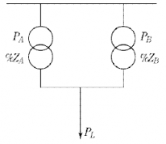

$$ \%Z_A = \frac{P_A Z_A}{10V^2} \to Z_A = \frac{10V^2 \times \%Z_A}{P_A} $$

$$ \%Z_B = \frac{P_B Z_B}{10V^2} \to Z_B = \frac{10V^2 \times \%Z_B}{P_B} $$

$$ A변압기 부하분담의 비 P\_{LA} = \frac{Z_B}{Z_A + Z_B} $$

$$ B변압기 부하분담의 비 P\_{LB} = \frac{Z_A}{Z_A + Z_B} $$

변압기 부하 분담식

$$ \frac{P*{LA}}{P*{LB}} = \frac{Z_B}{Z_A} = \frac{P_A \times \%Z_B}{P_B \times \%Z_A} $$

---

# Q15 어느 고압선로에서 지락고장 검출 및 경보장치를 다음과 같이 시설하였을 때 A선에 지락고장이 발생했다. 다음 물음에 답하시오. (단, 전원이 인가되고 경보벨의 스위치는 닫혀있는 상태이다.) [배점: 6점]

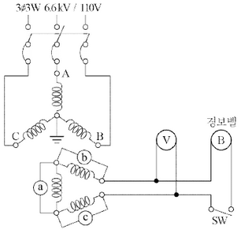

(1) 1차 측 A선의 대지전압이 0[V]인 경우 B, C선의 대지전압 [V]은 각각 얼마인지 계산하시오.

[정답]

① B선의 대지 전압:

② C선의 대지 전압:

(2) 2차 측 전구 ⓐ의 전압이 0[V]인 경우, ⓑ 및 ⓒ 전구의 전압과 전압계 ⑤의 지시전압, 경보벨 ⑥에 걸리는 전압은 각각 몇 [V]인지 계산하시오.

[정답]

① ⓑ 전구의 전압:

② ⓒ 전구의 전압:

③ 전압계 ⑤의 지시전압:

④ 경보벨 ⑥에 걸리는 전압:

---

---

# 해설) 단순계산형 / 난이도 中

## 정답

(1) 1차 측 B, C선의 대지전압 계산

[계산과정]

1선 지락시 지락되지 않은 상은 대지전위가 $\sqrt{3}$배 상승한다.

B선의 대지전압 : $\frac{6600}{\sqrt{3}} \times \sqrt{3} = 6600[V] $

C선의 대지전압 : $\frac{6600}{\sqrt{3}} \times \sqrt{3} = 6600[V] $

[정답] ① B선의 대지전압: 6600 [V], ② C선의 대지전압: 6600 [V]

(2) 전구 ⑥, ⑦의 전압과 전압계 ⑤와 경보벨 ⑧의 지시전압 계산

[계산과정]

전구 ⑥의 전압 : $\frac{110}{\sqrt{3}} \times \sqrt{3} = 110[V] $

전구 ⑦의 전압 : $\frac{110}{\sqrt{3}} \times \sqrt{3} = 110[V] $

전압계 ⑤의 지시전압: $110 \times \sqrt{3} = 190.53[V] $

경보벨 ⑧의 지시전압: $110 \times \sqrt{3} = 190.53[V] $

[정답]

① 전구 ⑥의 전압: 110[V]

② 전구 ⑦의 전압: 110[V]

③ 전압계 ⑤의 지시전압: 190.53 [V]

④ 경보벨 ⑧의 지시전압: 190.53 [V]

## 부분점수

| 점수 | 세부기준                                             |
| ---- | ---------------------------------------------------- |
| 6점  | 문항 (1), (2)의 소문항 6개가 모두 맞은 경우 6점 획득 |
| 2점  | 문항 (1)의 소문항 2개 중 1문제당 1점 획득            |
| 4점  | 문항 (2)의 소문항 4개 중 1문제당 1점 획득            |

## 해설

GPT : 접지형 계기용 변압기

- 용도 : 비접지 선로에서 지락고장 검출
- 동작원리 : 2차측을 오픈델타(Open-△) 결선으로 연결하여 지락사고(영상전압)를 검출
- 동작예시 : (6.6[kV] 비접지 선로에서 A상(∠0°) 지락시)

| 측             | 전압[V]                       | 상     |
| -------------- | ----------------------------- | ------ |
| 1차측          | $6600/\sqrt{3} \rightarrow 0$ | A상    |
|                | $6600 \rightarrow 6600 $      | B, C상 |
| 2차측          | $110/\sqrt{3} \rightarrow 0$  | A상    |
|                | $110 \rightarrow 110 $        | B, C상 |
| 전압계, 경보벨 | $ 0 \rightarrow 190$          |        |

---

# Q16 단상 3선식 110/220 [V]을 채용하고 있는 건물이 있다. 변압기가 설치된 수전실로부터 100[m] 되는 곳에 부하 집계표와 같은 분전반을 시설하고자 한다. 다음 조건과 전선의 허용전류표를 이용하여 물음에 답하시오. (단, 전압변동률 및 전압강하율은 2[%] 이하가 되도록 하며 중성선의 전압강하는 무시한다.) [배점: 7점]

[조건]

- 후강 전선관 공사로 한다.
- 3선 모두 같은 선으로 한다.
- 부하의 수용률은 100[%]로 적용한다.
- 후강 전선관 내 전선의 점유율을 48[%] 이내로 유지한다.

[표 1. 전선의 허용전류]

| 단면적 ($mm^2$) | 허용전류 (A) | 전선관 3본 이하 수용시 (A) | 피복포함 단면적 ($mm^2$) |
| --------------- | ------------ | -------------------------- | ------------------------ |
| 5.5             | 34           | 31                         | 28                       |
| 14              | 61           | 55                         | 66                       |
| 22              | 80           | 72                         | 88                       |
| 38              | 113          | 102                        | 121                      |
| 50              | 133          | 119                        | 161                      |

[표 2. 부하 집계표]

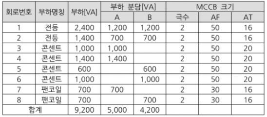

[표 3. 후강전선관 규격]

| G16 | G22 | G28 | G36 | G42 | G54 |
| --- | --- | --- | --- | --- | --- |

**(1) 간선의 공칭단면적 ($mm^2$)을 선정하시오.**

[계산과정]

[정답]

(2) 후강 전선관의 호칭을 표에서 선정하시오.

[계산과정]

[정답]

(3) 설비 불평형률은 몇 [%]인지 계산하시오.

[계산과정]

[정답]

---

# 해설) 순차적 문제 해결형 / 난이도 上

(1) 공칭단면적 계산

[계산과정]

$$ I_A = \frac{5,000}{110} = 45.454 [A], I_B = \frac{4,200}{110} = 38.181 [A] $$

$$ A = \frac{17.8 \times 100 \times 45.454}{1,000 \times 110 \times 0.02} = 36.776 [mm^2] $$

표에서 38[mm²] 선택

[정답] 38[mm²]

(2) 후강 전선관의 호칭

[계산과정]

표1에서 전선 1선의 피복포함 단면적은 121[mm²]이다.

단상 3선식은 전선관에 3가닥이 들어가므로

$$ 3선의 총 단면적 = 121 × 3 = 363[mm²]이고, 이 값이 후강 전선관 내 전선의 점유율 48%이어야 한다. $$

$$ \pi (\frac{d}{2})^2 \times 0.48 = 363 에서 d = \sqrt{\frac{363 \times 4}{\pi \times 0.48}} = 31.03 [mm]로 $$

후강전선관의 규격은 구한 값보다 커야 하므로 G36 선정

[정답] G36 선정

(3) 설비 불평형률 계산

[계산과정]

$$ 설비 불평형률 = \frac{3,100 - 2,300}{\frac{1}{2} \times (5,000 + 4,200)} \times 100 = 17.391 [%] $$

[정답] 17.39[%]

부분점수

| 점수 | 세부기준                                                                    |
| ---- | --------------------------------------------------------------------------- |
| 7점  | (1)~(3)번이 모두 맞은 경우 6점 획득                                         |
| 3점  | 문항 (1)의 계산과정과 답이 맞으면 3점, 계산과정 또는 답에 오류가 있으면 0점 |
| 2점  | 문항 (2)의 계산과정과 답이 맞으면 2점, 계산과정 또는 답에 오류가 있으면 0점 |
| 2점  | 문항 (3)의 계산과정과 답이 맞으면 2점, 계산과정 또는 답에 오류가 있으면 0점 |

접근 POINT

전기 방식에 따른 전압강하 전선 단면적 공식을 적용하는 문제이다. 전압이 두 종류인 단상 3선식과 3상 4선식은 전선의 단면적 계산식에 반드시 상전압을 적용함에 유의한다.

해설

[저압 배선 전압강하 계산식]

$$ \Delta e = \frac{K \times I \times L}{1,000 \times A} [V] $$

K: 전압강하 계수(단상2선식: 35.6, 3상3선식:30.8, 단상3선식, 3상4선식:17.8)

L: 전선 1본의 길이[m], I: 부하전류[A], A: 전선의 단면적[mm²]

전압강하 계산식은 저압 배선에서 사용된다.

송수전 전압차 식$ E_s - E_r = \sqrt{3} I (R \cos \theta + X \sin \theta) $(역률 1)에서

전압강하식$ E_s - E_r = \sqrt{3} I R $이 되며, 연동선의 저항 $R = \rho \frac{l}{A}$ 에서

$ \rho = \frac{1}{58} \times \frac{100}{97} = 0.01777... \cong \frac{17.8}{1,000} [\Omega/mm^2]$ 로 저항은 R $= \frac{17.8L}{1,000A} $이 된다.

최종적으로 전기 방식별로 정리하면 아래와 같다.

| 전기 방식  | 전압강하[V]                 | 전선단면적 [mm²]            |
| ---------- | --------------------------- | --------------------------- |
| 단상 3선식 | $e = \frac{17.8LI}{1,000A}$ | $A = \frac{17.8LI}{1,000e}$ |
| 3상 4선식  | $e = \frac{17.8LI}{1,000A}$ | $A = \frac{17.8LI}{1,000e}$ |
| 단상 2선식 | $e = \frac{35.6LI}{1,000A}$ | $A = \frac{35.6LI}{1,000e}$ |
| 직류 2선식 |                             |                             |
| 3상 3선식  | $e = \frac{30.8LI}{1,000A}$ | $A = \frac{30.8LI}{1,000e}$ |

[유의사항] 3상 4선식 $A = \frac{17.8LI}{1,000e} $에서 e는 항상 상전압(220[V])을 적용.

[단상 3선식의 설비 불평형률]

설비 불평형률 = $\frac{\text{부하설비 용량 [kVA]의 차}}{\text{총 부하설비 용량[kVA]} \times \frac{1}{2}} \times 100$ [%]

---

# Q17 다음 그림은 22.9[kV-Y], 1000[kVA] 이하에 적용할 수 있는 특고압 간이 수전설비 표준결선도이다. 이 결선도를 보고 물음에 답하시오. [배점: 6점]

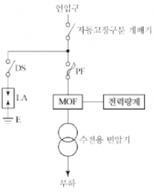

(1) 용량이 300[kVA] 이하인 경우 ASS 대신 사용할 수 있는 것을 쓰시오.

[정답]

(2) 본 도면에서 사용된 시설 중 생략할 수 있는 것을 쓰시오.

[정답]

(3) 22.9[kV-Y]용의 LA는 어떤 장치가 붙어있는 것을 사용해야 하는지 쓰시오.

[정답]

(4) 인입선을 지중선으로 시설하는 경우로서 공동주택 등 사고 시 정전 피해가 큰 수전설비 인입선은 예비선을 포함하여 몇 회선으로 시설하는 것이 바람직한지 쓰시오.

[정답]

(5) 22.9[kV-Y] 지중 인입선에는 어떤 케이블을 사용하여야 하는지 쓰시오.

[정답]

(6) 300[kVA] 이하인 경우 PF대신 COS를 사용할 수 있다. 이것의 비대칭 차단전류 용량은 몇 [kA] 이상의 것을 사용하여야 하는지 쓰시오.

[정답]

---

# 해설) 복합 이론형 / 난이도 중

정답

(1) 기중 부하 개폐기

(2) 피뢰기용 단로기

(3) Disconnector 또는 Isolator

(4) 2회선

(5) CNCV-W, TR-CNCV-W, FR-CNCO-W 중 2개

(6) 10[kA]

부분점수

| 점수 | 세부기준                                 |
| ---- | ---------------------------------------- |
| 6점  | 소문항 (1)~(6)이 모두 맞은 경우 6점 획득 |
| 1점  | 소문항 총 6문항 중 정답 1개당 1점 획득   |

해설

[용량별 사용 가능한 개폐설비]

- 300[kVA] 이하: 기중부하개폐기(IS, 인터럽터 스위치)
- 4000[kVA] 이하: 자동고장구분개폐기(ASS) (단, 대용량 전기로 등의 특수부하는 2000[kVA] 이하)
- 7000[kVA] 초과: 자동선로구분개폐기(Sectionalizer)
- 66[kV] 이상: 선로개폐기(LS)

[Disconnector(DISC)]

피뢰기 자체 고장 시 계통으로 파급되는 것을 방지하기 위해 내부 화약이 폭발하여 강제 분리한다.

---

# Q18 다음 조건과 같은 사무실이 있다. 이 사무실의 평균 조도를 200 [lx] 로 하고자 할 때 다음 물음에 각각 답하시오. [배점: 9점]

[조건]

- 형광등은 40 [W] - 2,500 [lm] 을 사용한다.

* 조명률은 0.6, 감광보상률은 1.2로 한다.
* 기둥은 없는 것으로 한다.
* 간격은 등기구 센터를 기준으로 한다.
* 등기구는 ○으로 표현한다.

(1) 여기에 필요한 형광등 개수를 계산하시오.

[계산과정]

[정답]

(2) 등기구를 아래 답안지에 직접 배치하시오.

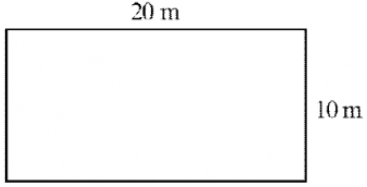

**(3) 다음 그림과 같이 등간의 간격과 최외각에 설치된 등기구와 건물 벽 간의 간격 (A, B, C, D)은 몇 [m] 인지 계산하시오.**

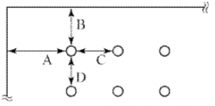

[계산과정]

[정답]

**(4) 만일 주파수 60 [Hz] 에 사용하는 형광방전등을 50 [Hz] 에서 사용한다면 광속과 점등시간은 어떻게 되는지 쓰시오. (단, 증가, 감소, 빠름, 늦음 등으로 표현한다.)**

[정답]

(5) 양호한 전반 조명이라면 등 간격은 등 높이의 몇 배 이하로 해야 하는지 작성하시오.

[정답]

---

---

# 정답 해설

해설: 순차적 문제 해결형 / 난이도 상

(1) 형광등 개수 계산

[계산과정]

$$ N = \frac{20 \times 10 \times 200 \times 1.2}{2500 \times 0.6} = 32 $$

[정답] 32개

(2) 등기구 배치

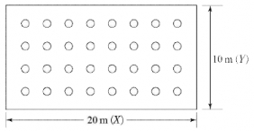

(3) 등기구와 건물 벽 간의 간격

[계산과정]

$$ C, D = \frac{20}{8} = 2.5 [m] $$

$$ A, B = \frac{10}{4} \times \frac{1}{2} = 1.25 [m] $$

[정답] A: 1.25[m], B: 1.25[m], C: 2.5[m], D: 2.5[m]

(4) 광속과 점등시간 변화

[정답] 광속은 증가하고 점등시간은 늦어진다.

(5) 등 높이

[정답] 1.5배

## 부분점수

| 점수 | 세부기준                                         |
| ---- | ------------------------------------------------ |
| 9점  | (1)~(5)번이 모두 맞은 경우 9점 획득              |
| 3점  | (2)번이 맞은 경우 3점 획득                       |
| 3점  | (3)번이 계산과정과 함께 맞은 경우 3점 획득       |
| 3점  | (1), (4), (5)번이 맞은 경우 한 문제당 1점씩 획득 |

## 접근 POINT

종합적인 조명 설계 문제이다. 등기구 수, 배치, 벽 간격, 주파수에 따른 영향 등 흐름을 이해하고 공식은 암기해야 한다.

## 해설

[조명 공식]

FUN = EAD

F(광속, lm), U(조명률, %), N(등기구 수), E(조도, lx), A(면적), D(감광보상률)

등기구와 벽 간격은 등기구 간격의 $\frac{1}{2}$ 로 한다.

[주파수 변화에 따른 광속, 점등시간 변화]

$$ 리액턴스 X_L = 2\pi f Lx $$

따라서 주파수가 감소하면 리액턴스가 감소하여 전류, 광속 증가하고, 주파수의 감소로 주기는 증가하게 되어 $(T \propto \frac{1}{f})$, 점등시간은 늦어진다.

---
