# Q1 그림과 같이 2군 수용가가 각각 1대씩의 변압기를 통해 전력을 공급받고 있습니다. 다음 표를 참고하여 물음에 답하시오. (6점 = 2점 + 2점 + 2점)

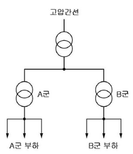

| 부하별        | A      | B      |
| ------------- | ------ | ------ |
| 용량          | 50[kW] | 30[kW] |
| 역률          | 1.0    | 1.0    |
| 수용률        | 0.6    | 0.5    |
| 부등률        | 1.2    | 1.2    |
| 간선간 부등률 | 1.3    |        |

(1) A군의 변압기 용량을 구하시오. (2점)

$$ P_A = 50[kW] \times 0.6 \times 1.2 = 36[kW] $$

(2) B군의 변압기 용량을 구하시오. (2점)

$$ P_B = 30[kW] \times 0.5 \times 1.2 = 18[kW] $$

(3) 간선에 걸리는 최대부하[kW]를 구하시오. (2점)

$$ P\_{total} = (P_A + P_B) \times 1.3 = (36 + 18) \times 1.3 = 68.4[kW] $$

---

# 1번 해설) 단순 계산형 / 난이도 中

## 정답

(1) A군의 변압기 용량 계산

[계산과정]

$$ P_A = \frac{50 \times 0.6}{1.2 \times 1} = 25 \text{ [kVA]} $$

[정답] 25 [kVA]

(2) B군의 변압기 용량 계산

[계산과정]

$$ P_A = \frac{30 \times 0.5}{1.2 \times 1} = 12.5 \text{ [kVA]} $$

[정답] 12.5 [kVA]

(3) 간선에 걸리는 최대부하 [kW] 계산

[계산과정]

$$ P\_{max} = \frac{25 + 12.5}{1.3} \times 1 = 28.846 \dots = 28.85 \text{ [kW]} $$

[정답] 28.85 [kW]

## 부분점수

| 점수  | 세부기준                                                                         |
| ----- | -------------------------------------------------------------------------------- |
| 6~0점 | 총 3개의 소문항 중 계산과정과 답이 맞는 경우 1문제당 2점씩 획득. 오답일 경우 0점 |

## 해설

$$ 변압기의 용량 [kVA] = \frac{\text{부하용량 [kW]} \times \text{수용률}}{\text{부등률} \times \text{역률}} $$
$$ 간선의 최대부하 [kW] = \frac{\text{A군 변압기 용량 [kVA]} + \text{B군 변압기 용량 [kVA]}}{\text{부등률}} \times \text{역률} $$

---

# Q2 3상 380[V], 7.5[kW]의 유도전동기가 역률 80[%]로 운전하고 있다. 여기에 전력용 커패시터를 병렬로 설치하여 역률을 90[%]로 개선하고자 한다. 다음 물음에 답하시오. [7점=3점+4점]

(1) 역률개선용 3상 전력용 콘덴서의 용량을 구하시오. (3점)

(2) 1상당 전력용 커패시터의 정전용량[ $\mu$ F ]를 구하시오.(단, 콘덴서는 Δ결선으로 연결되고, 전원의 주파수는 60[Hz]이다.) (4점)

---

# 2번 해설) 단순 계산형 / 난이도 中

## 정답

(1) 역률 개선용 콘덴서의 용량 계산

[계산과정]

$$ Q_c = 7.5 \times \left( \frac{\sqrt{1 - 0.8^2}}{0.8} - \frac{\sqrt{1 - 0.9^2}}{0.9} \right) = 1.9925 $$

[정답] 1.99 [kVA]

(2) △결선시 1상당 전력용 커패시터의 정전용량 계산

[계산과정]

$$ C\_\Delta = \frac{Q_c}{3 \times 2\pi f V^2} = \frac{1.9925 \times 10^3}{3 \times 2\pi \times 60 \times 380^2} \times 10^6 = 12.2005 \text{ [µF]} $$

[정답] 12.20 [µF]

## 부분점수

| 점수 | 세부기준                                             |
| ---- | ---------------------------------------------------- |
| 7점  | 소문항 2개 중 계산과정과 정답이 모두 맞으면 7점 획득 |
| 3점  | 소문항 (1)의 계산과정과 정답이 모두 맞으면 3점 획득  |
| 4점  | 소문항 (2)의 계산과정과 정답이 모두 맞으면 4점 획득  |
| 0점  | 소문항 2개 모두 계산과정과 정답에 오류가 있는 경우   |

## 해설

역률 개선용 콘덴서 용량 계산식

$$ Q_c = P(\tan\theta_1 - \tan\theta_2) = P \left( \frac{\sin\theta_1}{\cos\theta_1} - \frac{\sin\theta_2}{\cos\theta_2} \right) = P \left( \frac{\sqrt{1 - \cos^2\theta_1}}{\cos\theta_1} - \frac{\sqrt{1 - \cos^2\theta_2}}{\cos\theta_2} \right) $$

콘덴서 3상 접속(커패시터 충전용량 Q = 3ωCE²)

**(1) Y결선:** $Q_Y = 3\omega C_Y E^2 = \omega C_Y V^2 $

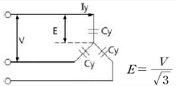

**(2) △결선:** $Q*\Delta = 3\omega C*\Delta E^2 = 3\omega C\_\Delta V^2 $

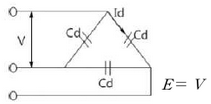

---

# Q3 불평형 3상 교류회로에서 영상분, 정상분, 역상분 전류가 다음과 같을 때, 상의 순서가 a-b-c인 a상, b상, c상의 전류[A]를 각각 구하여라. [6점=2점+2점+2점]

$$ I_0 = 1.8 \angle -159.17^\circ $$
$$ I_1 = 8.95 \angle 1.14^\circ $$
$$ I_2 = 2.5 \angle 96.55^\circ $$

1.
2.
3.

---

# 3번 해설) 복합 계산형 / 난이도 上

## 정답

**(1) $I_a$ 계산**

[계산과정]

$$ I_a = I_o + I_1 + I_2 $$

$$ = 1.8\angle -159.17^\circ + 8.95\angle 1.14^\circ + 2.5\angle 96.55^\circ = 7.267\angle 16.151^\circ $$

**[정답]** $I_a = 7.27\angle 16.15^\circ$ [A]

**(2) $I_b$ 계산**

[계산과정]

$$ I_b = I_o + a^2I_1 + aI_2 $$

$$ = 1.8\angle -159.17^\circ + 1\angle 240^\circ \times 8.95\angle 1.14^\circ + 1\angle 120^\circ \times 2.5\angle 96.55^\circ $$

$$ = 12.787\angle -128.788^\circ $$

**[정답]** $I_b = 12.79\angle -128.79^\circ [A]$

**(3) $I_c$ 계산**

[계산과정]

$$ I_c = I_o + aI_1 + a^2I_2 $$

$$ = 1.8\angle -159.17^\circ + 1\angle 120^\circ \times 8.95\angle 1.14^\circ + 1\angle 240^\circ \times 2.5\angle 96.55^\circ $$

$$ = 7.241\angle 123.691^\circ $$

**[정답]** $I_c = 7.24\angle 123.69^\circ [A]$

## 부분점수

| 점수 | 세부기준                                                   |
| ---- | ---------------------------------------------------------- |
| 6점  | 소문항 3개 중 계산과정과 정답이 모두 맞으면 6점 획득       |
| 4점  | 소문항 3개 중 2개의 계산과정과 정답이 모두 맞으면 4점 획득 |
| 2점  | 소문항 3개 중 1개의 계산과정과 정답이 모두 맞으면 2점 획득 |
| 0점  | 소문항 3개 모두 계산과정이나 정답에 오류가 있으면          |

## 접근 POINT

3상 a상, b상, c상과 영상, 정상, 역상과의 관계를 확인하여 서로 변형하여 계산할 수 있어야 한다.

## 해설

$$ \begin{pmatrix} I_a \\ I_b \\ I_c \end{pmatrix} = \begin{pmatrix} 1 & 1 & 1 \\ 1 & a^2 & a \\ 1 & a & a^2 \end{pmatrix} \begin{pmatrix} I_o \\ I_1 \\ I_2 \end{pmatrix}, \begin{pmatrix} I_o \\ I_1 \\ I_2 \end{pmatrix} = \frac{1}{3} \begin{pmatrix} 1 & 1 & 1 \\ 1 & a & a^2 \\ 1 & a^2 & a \end{pmatrix} \begin{pmatrix} I_a \\ I_b \\ I_c \end{pmatrix} , a = 1\angle 120^\circ, a^2 = 1\angle 240^\circ $$

---

# Q4 다음은 전기설비기술기준의 판단기준과 관련된 문제입니다. 괄호 안에 들어갈 알맞은 말을 쓰시오. [5점=1+1+1+1+1점]

## 저압전로 중의 과전류차단기의 시설

| 형  | 순시트립범위(주택용)                        |
| --- | ------------------------------------------- |
| (①) | 3In 초과 ~ 5In 이하   |
| (②) | 5In 초과 ~ 10In 이하  |
| (③) | 10In 초과 ~ 20In 이하 |

- In: 차단기 정격전류

## 정격전류의 배수(주택용)

| 정격전류의 구분 | 시간  | 부동작 전류 | 동작 전류 |
| --------------- | ----- | ----------- | --------- |
| 63A 이하        | 60분  | (④)배       | (⑤)배     |
| 63A 초과        | 120분 | (④)배       | (⑤)배     |

---

4번 해설) 단답 암기형/ 난이도 下

정답

1. B
2. C
3. D
4. 1.13
5. 1.45

부분점수

| 점수    | 세부기준                                        |
| ------- | ----------------------------------------------- |
| 5점~0점 | ①~⑤ 소문항 5개 중 정답 1개당 부분 점수 1점 획득 |

해설

[전기설비기술기준의 판단기준] 제38조(저압전로 중의 과전류차단기의 시설)

<저압전로에 사용하는 배선차단기(산업용)>

| 정격전류의 구분 | 시간  | 정격전류의 배수 (모든 극에 통전) |
| --------------- | ----- | -------------------------------- | --------- |
|                 |       | 부동작 전류                      | 동작 전류 |
| 63 A 이하       | 60분  | 1.05배                           | 1.3배     |
| 63 A 초과       | 120분 | 1.05배                           | 1.3배     |

<저압전로에 사용하는 배선차단기(주택용)>

| 형  | 순시트립범위          |
| --- | --------------------- |
| B   | 3In 초과 ~ 5In 이하   |
| C   | 5In 초과 ~ 10In 이하  |
| D   | 10In 초과 ~ 20In 이하 |

비고 1. B, C, D : 순시트립전류에 따른 차단기 분류 2. In: 차단기 정격전류

| 정격전류의 구분 | 시간  | 정격전류의 배수(모든 극에 통전) |
| --------------- | ----- | ------------------------------- | --------- |
|                 |       | 부동작 전류                     | 동작 전류 |
| 63 A 이하       | 60분  | 1.13배                          | 1.45배    |
| 63 A 초과       | 120분 | 1.13배                          | 1.45배    |

---

# Q5 $v_i = 220\sqrt{2}\sin(120\pi t)$ [V] 인 미완성 단상 전파 정류회로를 완성하고, 부하측의 직류 평균전압 [V] 과 직류 평균전류 [A] 를 계산하시오. (단, 부하저항은 R = 20 [$\Omega$] 이며, 평활회로가 없는 순수 저항만의 회로이다.) [6점]

(1) 단상 전파 정류회로 완성 (2점)

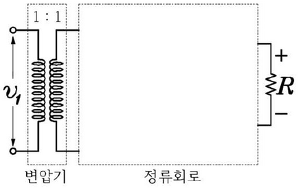

(2) 직류 평균전압 계산 (2점)

(3) 직류 평균전류 계산 (2점)

---

5번 해설) 도면 완성형 + 단순 계산형 / 난이도 中

정답

(1) 단상 전파 정류회로 완성

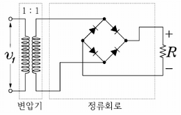

(2) 부하에 걸리는 직류 평균전압 계산

[계산과정]

$$ V\_{av} = 0.9V = 0.9 \times 220 = 198 [V] $$

$$ 또는 V\_{av} = \frac{2}{\pi}V_m = \frac{2}{\pi}220\sqrt{2} = 198.069 \dots \approx 198.07 [V] $$

$$ [정답] V*{ab} = 198 [V] 또는 V*{ab} = 198.07 [V] $$

(3) 부하에 흐르는 직류 평균전류 계산

[계산과정]

$$ I*{av} = \frac{V*{av}}{R} = \frac{198}{20} = 9.90 [A] $$

$$ [정답] I\_{av} = 9.90 [A] $$

부분점수

| 점수 | 세부기준                                                   |
| ---- | ---------------------------------------------------------- |
| 6점  | 소문항 3개 중 계산과정과 정답이 모두 맞은 경우 6점 획득    |
| 4점  | 소문항 3개 중 2개의 계산과정과 정답이 모두 맞으면 4점 획득 |
| 2점  | 소문항 3개 중 1개의 계산과정과 정답이 모두 맞으면 2점 획득 |
| 0점  | 소문항 3개 모두 계산과정이나 정답에 오류가 있으면          |

해설

$$ 순시값: v(t) = V*m \sin(\omega t + \theta), V_m: 최댓값, V*{av}: 평균값, V: 실효값 $$

$$ 관계식: V = \frac{1}{\sqrt{2}}V*m, V_m = \sqrt{2}V, V*{av} = \frac{2}{\pi}V*m = \frac{2}{\pi}V, V = \frac{\pi}{2\sqrt{2}}V*{av} $$

$$ \frac{1}{\sqrt{2}} \approx 0.707, \frac{2\sqrt{2}}{\pi} \approx 0.9, \frac{\pi}{2\sqrt{2}} \approx 1.11 $$

---

# Q6 전기안전관리자의 직무에 관한 고시에서 아래 빈칸에 알맞은 답을 쓰시오.[4점=2점+2점]

전기안전관리자의 직무에 관한 고시에 따라서 전기안전관리자는 수립한 점검을 실시하고, 기록한 서류(전자문서를 포함한다)를 전기설비 설치장소 또는 사업장마다 갖추어 두고, 그 기록서류를 (①) 년간 보존하여야 한다. 또한, 전기안전관리자는 정기검사 시 기록한 서류(전자문서를 포함한다)를 제출하여야 하는데, 전기안전종합정보시스템에 매월 (②) 회 이상 안전관리를 위한 확인·점검 결과 등을 입력한 경우에는 제출하지 아니할 수 있다.

---

# 6번 해설) 단답 암기형 / 난이도 下

정답:

1. 4
2. 1

부분점수:

| 점수  | 세부기준                                      |
| ----- | --------------------------------------------- |
| 4~0점 | 소문항 총 2개 중 정답 1개당 부분점수 2점 획득 |

접근 POINT

전기안전관리자의 직무에 관한 고시에서 점검서류의 보관 년한과 전기안전종합시스템에 매월 입력하게 되면 기록서류를 제출하지 않아도 되는 예외 조항에 대한 문제이다.

해설

[전기안전관리자의 직무에 관한 고시]

제6조(점검에 관한 기록·보존) ① 전기안전관리자는 제3조제2항에 따라 수립한 점검을 실시하고, 다음 각 호의 내용을 기록하여야 한다. 다만, 전기안전관리자와 점검자가 같은 경우 별지 서식(제2호~제8호)의 서명을 생략할 수 있다.

1. 점검자
2. 점검 연월일, 설비명(상호) 및 설비용량
3. 점검 실시 내용(점검항목별 기준치, 측정치 및 그 밖에 점검 활동 내용 등)
4. 점검의 결과
5. 그 밖에 전기설비 안전관리에 관한 의견

② 전기안전관리자는 제1항에 따라 기록한 서류(전자문서를 포함한다)를 전기설비 설치장소 또는 사업장마다 갖추어 두고, 그 기록서류를 4년간 보존하여야 한다.

③ 전기안전관리자는 법 제11조에 따른 정기검사 시 제1항에 따라 기록한 서류(전자문서를 포함한다)를 제출하여야 한다. 다만, 법 제38조에 따른 전기안전종합정보시스템에 매월 1회 이상 안전관리를 위한 확인·점검 결과 등을 입력한 경우에는 제출하지 아니할 수 있다.

---

# Q7 3300/220[V]인 변압기 용량이 각각 250[kVA], 200[kVA]이고, %임피던스 강하가 각각 2.7[%]와 3[%]일 때 그 병렬 합성 용량 [kVA]은? [5점]

문제를 풀기 위한 정보가 부족합니다. 병렬 연결된 변압기의 합성 용량을 구하는 공식이 필요합니다. 일반적으로 병렬 운전되는 변압기의 합성 용량은 단순히 용량을 더하는 것이 아니라, 각 변압기의 임피던스를 고려하여 계산해야 합니다. 더 자세한 정보(예: 각 변압기의 등가회로 정보)가 제공되어야 정확한 계산이 가능합니다.

---

# 7번 해설) 복합 계산형 / 난이도 中

## 정답

[계산과정]

① 풀이 방법 (1)

1.  %임피던스가 작은 변압기 실 사용용량 100[%] 사용 P\*A = 250 [kVA]
2.  %임피던스가 큰 변압기의 실 사용용량 $P_B = 200 \times \frac{2.7}{3} = 180$ [kVA]
3.  병렬 합성용량 P\*{병렬} = $P_A + P_B$ = 250 + 180 = 430 [kVA]

② 풀이 방법 (2)

$$ 변압기의 용량비 m = \frac{P_A}{P_B} = \frac{250}{200} = \frac{5}{4} $$

$$ \frac{P_A}{P_B} = \frac{P_A}{P_B} \times \frac{\%Z_B}{\%Z_A} = m \times \frac{\%Z_B}{\%Z_A} = \frac{5}{4} \times \frac{3}{2.7} = 1.388 \approx 1.39 $$

$$ P_B = \frac{P_A}{1.388} = \frac{250}{1.388} = 180.115 $$

$$ 합성용량 P\_{병렬} = P_A + P_B = 250 + 180.115 = 430.115 \approx 430.12 [kVA] $$

**[정답]** P*{병렬} = 430 [kVA] 또는 P*{병렬} = 430.12 [kVA]

## 부분점수

| 점수 | 세부기준                                  |
| ---- | ----------------------------------------- |
| 5점  | 계산과정과 정답이 모두 맞은 경우 5점 획득 |
| 0점  | 계산과정과 정답에 오류가 있는 경우        |

## 해설

$\frac{P_A}{\%Z_A} \frac{P_A}{P_B} = \frac{\%Z_B}{\%Z_A} \frac{P_A}{P_B}$ 에서 부하 분담비는 $\frac{P_A}{P_B} = \frac{\%Z_B}{\%Z_A} \frac{P_A}{P_B} $이 된다.

(여기서, $P_A, P_B$는 변압기의 정격 용량, $P_A, P_B$는 부하 분담용량, $\%Z_A, \%Z_B$는 퍼센트 임피던스 강하이다.)

부하 분담비는 누설 임피던스에 반비례하고, 변압기의 실제로 %임피던스가 작은 변압기의 용량을 모두 사용하고 %임피던스가 큰 변압기의 용량을 비례적으로 축소하여 사용해야 병렬연결된 변압기에 과부하가 걸리지 않게 된다. 첫 번째 풀이는 과부하가 걸리지 않게 하기 위한 원리를 이해한 상태에서 해석한 방법이다.

## 접근 POINT

변압기 병렬운전 시 각 변압기 분담 부하를 계산하는 문제이다. 변압기 병렬운전은 ① 병렬운전 조건, ② 부하분담 조건이 서술형 문제나 계산 문제로 자주 출제된다. 관련 개념으로 변압기 퍼센트 임피던스(%Z), 임피던스 전압, 임피던스 와트 등의 개념도 함께 공부해야 한다.

## 해설

변압기 병렬운전 시 부하분담 조건

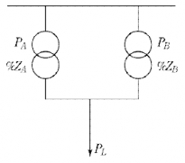

$$ \%Z_A = \frac{P_A Z_A}{10 V^2} \rightarrow Z_A = \frac{10 V^2 \times \%Z_A}{P_A} $$

$$ \%Z_B = \frac{P_B Z_B}{10 V^2} \rightarrow Z_B = \frac{10 V^2 \times \%Z_B}{P_B} $$

$$ A변압기 부하분담의 비 P\_{LA} = \frac{Z_B}{Z_A + Z_B} $$

$$ B변압기 부하분담의 비 P\_{LB} = \frac{Z_A}{Z_A + Z_B} $$

변압기 부하 분담식

$$ \frac{P*{LA}}{P*{LB}} = \frac{Z_B}{Z_A} = \frac{P_A}{P_B} \frac{\%Z_B}{\%Z_A} $$

---

# Q8 4극 3상 유도전동기 37[kW]가 있다. 전선의 길이가 50[m]이며 전압은 380[V]이다. 전압강하를 5[V] 이하로 하기 위해 전선의 굵기 [mm^2]를 계산하시오. (단, 3상 3선식 회로이며 전동기의 전부하 전류는 75[A]이다.)

---

## 8번 해설) 단순 계산형 / 난이도 中

정답

[계산과정]

$$ \frac{30.8 \times 50 \times 75}{1000 \times 5} = 23.10 [mm^2] $$

[정답] 23.10[mm²]

부분점수

| 점수 | 세부기준                                  |
| ---- | ----------------------------------------- |
| 4점  | 계산과정과 정답이 모두 맞은 경우 4점 획득 |
| 0점  | 계산과정과 정답에 오류가 있는 경우        |

해설

[저압 배선 전압강하 계산식]

$$ \Delta e = \frac{K \times I \times L}{1,000 \times A} [V] $$

- K: 전압강하 계수(단상2선식: 35.6, 3상3선식: 30.8, 단상3선식, 3상4선식: 17.8)
- L: 전선 1본의 길이[m]
- I: 부하전류[A]
- A: 전선의 단면적[mm²]

전압강하 계산식은 저압 배선에서 사용된다.

송수전 전압차 식 $E_s - E_r = \sqrt{3}I(Rcos\theta + Xsin\theta)$ (역률 1) 에서

전압강하식 $E_s - E_r = \sqrt{3}IR$ 이 되며, 연동선의 저항 $R = \frac{\rho l}{A}$ 에서

$ \rho = \frac{1}{58} \times \frac{100}{97} = 0.01777... = \frac{17.8}{1,000} [\Omega/mm^2]$ 로 저항은 $R = \frac{17.8L}{1,000A}$ 이 된다.

단상 2선식일 경우 17.8 × 2 = 35.6, 3상 3선식일 경우 $\sqrt{3} \times 17.8 = 30.786 \approx 30.8 $

최종적으로 전기 방식별로 정리하면 아래와 같다.

| 전기 방식  | 전압강하[V]                 | 전선단면적[mm²]             |
| ---------- | --------------------------- | --------------------------- |
| 단상 3선식 | $e = \frac{17.8LI}{1,000A}$ | $A = \frac{17.8LI}{1,000e}$ |
| 3상 4선식  | $e = \frac{17.8LI}{1,000A}$ | $A = \frac{17.8LI}{1,000e}$ |
| 단상 2선식 | $e = \frac{35.6LI}{1,000A}$ | $A = \frac{35.6LI}{1,000e}$ |
| 직류 2선식 | $e = \frac{30.8LI}{1,000A}$ | $A = \frac{30.8LI}{1,000e}$ |
| 3상 3선식  | $e = \frac{30.8LI}{1,000A}$ | $A = \frac{30.8LI}{1,000e}$ |

[유의사항] 3상 4선식 $A = \frac{17.8LI}{1,000e} $에서 e는 항상 상전압(220[V])을 적용.

---

# Q9 유도 전동기 IM을 유도전동기가 있는 현장과 현장에서 조금 떨어진 제어실 어느 쪽에서든지 기동 및 정지가 가능하도록 전자접촉기 MC와 누름버튼 스위치 PBS-ON 및 PBS-OFF용을 사용하여 제어회로를 점선 안에 그리시오.

회로도:

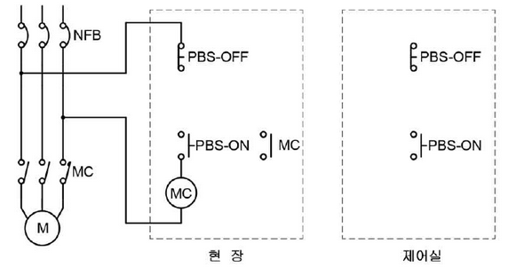

설명: 위 그림은 유도 전동기 제어 회로를 나타냅니다. 현장과 제어실 모두에서 전동기를 제어할 수 있도록 설계되어 있습니다. NFB는 퓨즈 역할을 하며 과전류로부터 회로를 보호합니다. PBS-ON과 PBS-OFF는 각각 기동 및 정지 버튼 스위치이고, MC는 전자접촉기 입니다. 회로는 현장과 제어실 모두에서 전동기의 기동 및 정지를 가능하도록 구성되어 있습니다.

---

# 9번 해설) 도면 완성형 / 난이도 중

## 정답

[정답] 도면 완성

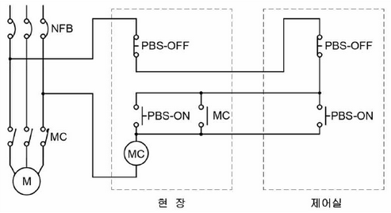

## 부분점수

| 점수 | 세부기준                                 |
| ---- | ---------------------------------------- |
| 5점  | 도면완성이 정답과 일치하는 경우 5점 획득 |
| 0점  | 도면완성에 오류가 있는 경우              |

## 해설

시퀀스회로에 대한 자기유지회로의 모양과 초기화에 대한 개념을 알고 있으면 쉽게 해결할 수 있는 문제이다.

먼저 동작버튼은 현장과 제어실 둘 중에 a접점의 버튼을 어디서 누르든 (1) 자기유지가 되어 동작(1)되어야 하므로 둘 중 하나라도 1이면 1이 되는 OR의 논리관계로써 병렬로 연결하면 된다.

두 번째 정지버튼은 현장과 제어실 둘 중에 b접점의 버튼을 어디서 누르든 자기유지가 풀려 정지하여야 한다. 이 때 자기유지가 풀린다는 것은 전원이 차단된다는 것과 같다. 둘 중 하나라도 끊어지면 (0)이면 정지(0)이 되어야 하므로 AND의 논리관계로써 직렬로 연결하면 된다.

---

# Q10 다음과 같은 평형 3상 회로에 그림과 같이 접속된 전압계의 지시치가 220[V], 전류계의 지시치가 20[A], 전력계의 지시치가 2[kW]이다. 다음 물음에 답하시오. [4점=2점+2점]

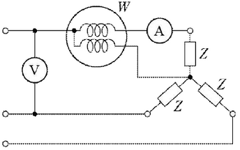

(1) 회로의 소비전력은 몇 [kW]인가? (2점)

(2) 부하의 임피던스 Z를 복소수로 구하시오. (2점)

---

10번 해설) 복합 계산형 / 난이도 中

정답

[계산과정]
(1) 부하에서의 소비전력 계산
[계산과정]
$$ 2 × 3 = 6 [kW] $$
[정답] 6 [kW]

(2) 부하의 임피던스를 계산하여 복소수로 표현
[계산과정]
$$ 저항 R = \frac{2 \times 10^3}{20^2} = 5 [\Omega] , 임피던스 Z = \frac{220/\sqrt{3}}{20} = \frac{11}{\sqrt{3}} [\Omega] $$

$$ 리액턴스 X = \sqrt{(\frac{11}{\sqrt{3}})^2 - 5^2} = 3.92 [\Omega] $$

$$ 임피던스 Z = R + jX = 5 + j3.92 [\Omega] $$

$$ [정답] Z = 5 + j3.92 [\Omega] $$

부분점수

| 점수 | 세부기준                                                 |
| ---- | -------------------------------------------------------- |
| 4점  | 소문항 2개 중 계산과정과 정답이 모두 맞으면 4점 획득     |
| 2점  | 소문항 2개 중 계산과정과 정답이 모두 맞은 1개당 2점 획득 |
| 0점  | 소문항 2개 모두 계산과정과 정답에 오류가 있는 경우       |

해설

소비전력(유효전력)$ P = I^2R [W]$, 저항 $R = \frac{P}{I^2} [\Omega]$

부하에서 소비하는 피상전력 $P_a = I^2Z$ [VA], 상전압 $E_y = \frac{V}{\sqrt{3}} = IZ [V] $

부하의 임피던스 |Z| = $\frac{V}{\sqrt{3}I} = \sqrt{R^2 + X^2}, Z = R + jX, X = \sqrt{Z^2 - R^2} $

---

# Q11 그림과 같은 송전계통 S점에서 3상 단락사고가 발생하였다. 주어진 도면과 조건을 참고하여 다음 각 물음에 답하시오. [14점=3점+3점+3점+3점+2점]

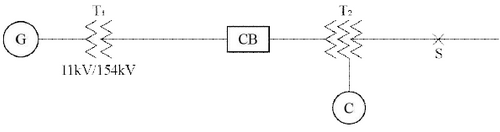

[조건]

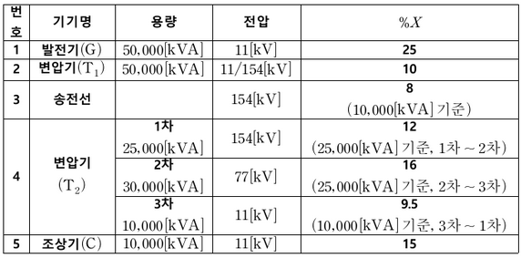

(1) 변압기(T₂)의 각각의 %리액턴스를 기준용량 10 [MVA]로 환산하시오. (3점)

(2) 변압기(T₂)의 1차(P), 2차(T), 3차(S)의 %리액턴스를 계산하시오. (3점)

(3) 발전기에서 고장점까지 10 [MVA] 기준, 합성 %리액턴스를 계산하시오. (3점)

(4) 고장점에서 단락용량은 몇 [MVA]인지 계산하시오. (3점)

---

# 11번 해설) 복합 계산형 / 난이도 上

## 정답

(1) 변압기(T₂ )의 각각의 %리액턴스를 기준용량 10[MVA]로 환산

[계산과정]

1차~2차: $\text{\%}X\_{p-t} = \frac{10}{25} \times 12$ = 4.8 [%]

2차~3차: $\text{\%}X_{t-s} = \frac{10}{25} \times 16$ = 6.4 [%]

- 3차~1차: $\text{\%}X\_{s-p} = \frac{10}{10} \times 9.5$ = 9.5 [%]

[정답]

$$ 1차~2차: \text{\%}X\_{p-t} = 4.8 [\%] $$
$$ 2차~3차: \text{\%}X\_{t-s} = 6.4 [\%] $$
$$ 3차~1차: \text{\%}X\_{s-p} = 9.5 [\%] $$

(2) 변압기(T₂ )의 1차(P), 2차(T), 3차(S)의 %리액턴스 계산

[계산과정]

$$ 1차: \text{\%}X_p = \frac{4.8 + 9.5 - 6.4}{2} = 3.95 [\%] $$
$$ 2차: \text{\%}X_t = \frac{6.4 + 4.8 - 9.5}{2} = 0.85 [\%] $$
$$ 3차: \text{\%}X_s = \frac{6.4 + 9.5 - 4.8}{2} = 5.55 [\%] $$

[정답]

$$ \text{\%}X_p = 3.95 \ [\%], \text{\%}X_t = 0.85 \ [\%], \text{\%}X_s = 5.55 \ [\%] $$

(3) 발전기에서 고장점까지 10[MVA] 기준, 합성 %리액턴스 계산

[계산과정]

① 기준용량 10[MVA] %리액턴스 환산

$$ 발전기: \text{\%}X_G = \frac{10}{50} \times 25 = 5 [\%] $$
$$ 변압기(T₁): \text{\%}X_T = \frac{10}{50} \times 10 = 2 [\%] $$
$$ _ 송전선: \text{\%}X_L = \frac{10}{10} \times 8 = 8 [\%] $$
$$ _ 조상기: \text{\%}X_C = \frac{10}{10} \times 15 = 15 [\%] $$

② 합성 %리액턴스

$$ 발전기~변압기 1차: \text{\%}X_1 = 5 + 2 + 8 + 3.95 = 18.95 [\%] $$
$$ 조상기~변압기 3차: \text{\%}X_3 = 15 + 5.55 = 20.55 [\%] $$
$$ \* 합성: \text{\%}X = \frac{18.95 + 20.55}{2} + 0.85 = 10.71 [\%] $$

[정답] 10.71 [%]

(4) 고장점에서 단락용량 [MVA] 계산

[계산과정]

$$ P_s = \frac{100}{\text{\%}X} P_n = \frac{100}{10.71} \times 10 = 93.37 [MVA] $$

[정답] 93.37 [MVA]

(5) 고장점의 단락전류 [A] 계산

[계산과정]

$ I_s = \frac{100}{\text{\%}X_N} I_N = \frac{100}{10.71} \times \frac{10 \times 10^6}{\sqrt{3} \times 77 \times 10^3} = 700.1 \ [A] $

[정답] 700.1 [A]

## 부분점수

| 점수 | 세부기준                                     |
| ---- | -------------------------------------------- |
| 14점 | (1)~(5)가 모두 맞은 경우 14점 획득           |
| 12점 | (1)~(4)번은 한 문항을 맞을 때마다 3점씩 획득 |
| 2점  | (5)번 문항이 맞은 경우 2점 획득              |

## 해설

$$ \text{\%}Z(\text{기준용량}) = \text{기준용량} \times \frac{\text{\%}Z(\text{자기용량})}{\text{자기용량}} $$
$$ \text{\%}X*p = \frac{\text{\%}X*{s-p} + \text{\%}X*{p-t} - \text{\%}X*{t-s}}{2} $$
$$ \text{\%}X*t = \frac{\text{\%}X*{p-t} + \text{\%}X*{t-s} - \text{\%}X*{s-p}}{2} $$
$$ \text{\%}X*s = \frac{\text{\%}X*{s-p} + \text{\%}X*{t-s} - \text{\%}X*{p-t}}{2} $$

---

# Q12 입력 A, B, C와 출력 Y1, Y2에 대한 진리표를 다음과 같이 나타낼 때, 다음의 각 물음에 답하시오. [6점=2점+2점+2점]

| A   | B   | C   | Y1  | Y2  |
| --- | --- | --- | --- | --- |
| 0   | 0   | 0   | 1   | 1   |
| 0   | 0   | 1   | 0   | 0   |
| 0   | 1   | 0   | 0   | 1   |
| 0   | 1   | 1   | 0   | 1   |
| 1   | 0   | 0   | 1   | 1   |
| 1   | 0   | 1   | 0   | 0   |
| 1   | 1   | 0   | 1   | 1   |
| 1   | 1   | 1   | 0   | 1   |

접속점 표기 방식
| 접속 | 비접속 |
| ------------------------- | ----- |
| 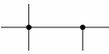 |  |

 

(1) 출력 Y1, Y2에 대한 논리식을 간략화하시오. (2점)

(단, 간략화된 논리식은 최소한의 논리 게이트 및 접점 사용을 고려한다.)

(2) (1)에서 구한 논리식을 무접점 회로로 나타내시오.

(3) (1)에서 구한 논리식을 유접점 회로로 나타내시오. (2점)

(단, a접점, b접점 표기방법에 유의한다.)

접점 표기 방식
| a접점 | b접점 |
| ------------------------- | ----- |
| 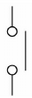 | 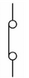 |

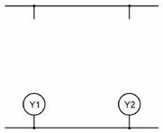

---

12번 해설) 논리회로 + 도면완성형 / 난이도 中

정답

(1) 진리표 출력의 논리식의 간소화

[계산과정]

| Y1에 대한 카르노맵         | Y2에 대한 카르노맵         |
| :------------------------- | :------------------------- |
| 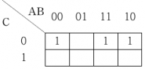 | 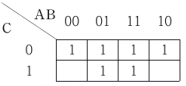 |

$$ Y1 = \overline{A}BC + A\overline{B}C + ABC = AC + BC = C(A + B) $$

$$ Y2 = \overline{A}\overline{B}C + \overline{A}BC + A\overline{B}C + ABC + AB\overline{C} + AB\overline{C} = B + C $$

$$ [정답] Y1 = C(A + B), Y2 = B + C $$

(2) 논리식을 무접점 회로로 변환

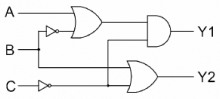

(3) 논리식을 유접점 회로로 변환

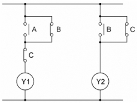

부분점수

| 점수 | 세부기준                                                    |
| :--- | :---------------------------------------------------------- |
| 6점  | 소문항 총 3개 중 계산과정과 정답이 모두 맞은 경우 6점 획득  |
| 4점  | 소문항 총 3개 중 2개가 계산과정과 정답이 맞은 경우 4점 획득 |
| 2점  | 소문항 총 3개 중 1개가 계산과정과 정답이 맞은 경우 2점 획득 |
| 0점  | 계산과정과 정답에 오류가 있으면 0점                         |

해설

진리표의 Y1, Y2의 출력으로 나오는 1인 부분의 논리식을 간소화하는데 부울 대수와 카르노맵 중에서 정해진 방법이 없으므로 구하기 편한 방식을 사용하면 된다. 보통 입력이 3개 이상인 경우는 카르노맵을 사용하는 방법이 편리하다. 또한, 여기서 구해진 논리식을 기반으로 무접점 및 유접점 회로의 변환을 충분히 연습하면 쉽게 해결할 수 있는 문제이다.

(1)에서 Y2의 논리식을 간소화하는 방법은 다음과 같다.

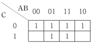

카르노맵에서는 인접한 2개, 4개, 8개를 묶음으로써 1개의 변수를 소거할 수 있다. 여기서는 첫 번째 줄의 4개를 묶으면 2개의 변수인 A와 B가 소거되고 C만 0인 부분이 남기 때문에 C가 되고, 중앙에 4개가 인접하여 위아래로 묶으면 0과 1을 포함하고 있는 A와 C는 소거되고 B만 1인 부분이 남기 때문에 B가 된다. 이 둘을 논리합으로 표현하여 B + C가 된 것이다.

(2)에서 (1)의 논리식을 무접점회로로 표현하기 위하여 논리합은 AND gate로, 논리곱은 OR gate로 표현하며, 논리식에 바(bar)가 씌워져 있으면 NOT gate를 사용하여 표현하면 된다.

(3)에서 (1)의 논리식을 유접점회로로 표현하기 위하여 논리합은 직렬연결로, 논리곱은 병렬연결로 표현하며, 바(bar)가 없으면 a접점(떨어진 접점, 단자의 오른쪽)으로 바(bar)가 있으면 b접점(붙어있는 접점, 단자의 왼쪽)으로 표현하면 된다. 최종 출력은 원 안에 출력변수를 표현하면 된다.

---

# Q13 변류비 50/5인 CT 2개를 그림과 같이 접속할 때, 전류계에 2[A]가 흐른다면, CT 1차 측에 흐르는 전류는 몇 [A]인가? [4점]

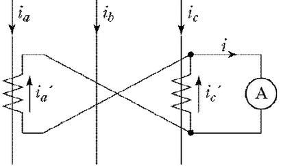

CT의 변류비는 50/5이므로, 1차 전류와 2차 전류의 비는 10:1 입니다. 전류계에 2[A]가 흐르므로, CT 2차 측의 전류 $i'_a + i'_c = 2[A]$ 입니다. 두 CT의 2차 측 전류는 각각 $i'_a와 i'_c$이고, $i'_a = i'_c$ 입니다. 따라서 $2i'_a = 2[A]$ 이므로 $i'_a = i'_c = 1[A]$ 입니다.

CT의 변류비를 이용하여 1차 측 전류를 계산하면, $i_a = i_c = 10 \times i'_a = 10 \times 1 = 10[A]$ 입니다. 따라서 CT 1차 측에 흐르는 총 전류는 $i_a + i_c = 10 + 10 = 20[A]$ 입니다.

답: 20[A]

---

13번 해설) 단순 계산형 / 난이도 中

정답

변류기의 1차 전류 계산

[계산과정]

$$ 2 \times \frac{1}{\sqrt{3}} \times \frac{50}{5} = 11.55 [A] $$

[정답] 11.55 [A]

부분점수

| 점수 | 세부기준                                  |
| ---- | ----------------------------------------- |
| 4점  | 계산과정과 정답이 모두 맞은 경우 4점 획득 |
| 0점  | 계산과정과 정답에 오류가 있는 경우        |

해설

차동(접속) 계전기의 부하전류

$$ I_1 = I_2 \times CT비 = \frac{전류계 지시값}{\sqrt{3}} \times CT비 $$

$$ 전류계 지시값 = \sqrt{3} \times I_1 \times \frac{1}{CT비} $$

---

# Q14 다음 그림은 TN계통의 TN-S 방식의 저압배전선로의 접지계통입니다. 접속점 표기 방식에 유의하여 결선도를 완성하시오.

## 접속점 표기 방식

| 접속                       | 비접속                     |
| -------------------------- | -------------------------- |
| 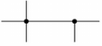 | 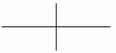 |

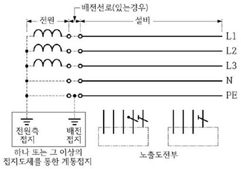

설명: 제공된 그림은 TN-S 방식의 저압배전선로 접지계통을 보여줍니다. "접속점 표기 방식" 그림을 참고하여 전원측 접지와 배전 접지의 접속 여부를 확인하고, 결선도를 완성해야 합니다. 전원측과 배전측의 접지 방식을 정확하게 표현해야 합니다. (그림에 따른 자세한 설명은 그림이 있어야 가능합니다.)

---

# 14번 해설) 도면 완성형 / 난이도 下

정답

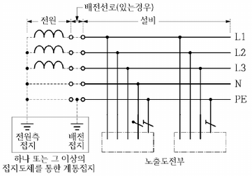

부분점수

| 점수 | 세부기준                                 |
| ---- | ---------------------------------------- |
| 5점  | 도면완성이 정답과 일치하는 경우 5점 획득 |
| 0점  | 도면완성에 오류가 있는 경우              |

해설

KEC 203.2 TN 계통

1. TN-S 계통은 계통 전체에 대해 별도의 중성선 또는 PE 도체를 사용한다. 배전계통에서 PE 도체를 추가로 접지할 수 있다.

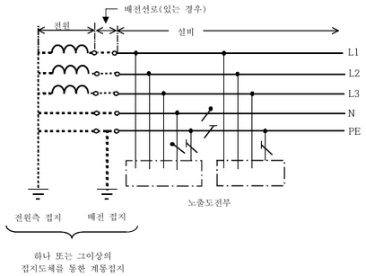

---

# Q15 다음은 피뢰기를 설치하여야 하는 장소를 나열한 것이다. 내용의 빈 칸에 들어갈 말을 적으시오. [5점=1+1+1+1+1점]

고압 및 특고압의 전로 중 다음에 열거하는 곳 또는 이에 근접한 곳에는 피뢰기를 시설하여야 한다.

가. ( ① )의 가공전선 입입구 및 인출구

나. ( ② ) 가공전선로에 접속하는 ( ③ ) 변압기의 고압측 및 특고압측

다. 고압 및 특고압 가공 전선로로부터 공급을 받는 ( ④ )의 인입구

라. 가공 전선로와 ( ⑤ )가 만나는 곳

---

15번 해설) 단답 암기형 / 난이도 下

정답

1. 발전소·변전소 또는 이에 준하는 장소
2. 특고압
3. 배전용
4. 수용장소
5. 지중전선로

부분점수

| 점수    | 세부기준                                        |
| ------- | ----------------------------------------------- |
| 5점~0점 | ①~⑤ 소문항 5개 중 정답 1개당 부분 점수 1점 획득 |

해설

KEC 341.13 피뢰기의 시설

1. 고압 및 특고압의 전로 중 다음에 열거하는 곳 또는 이에 근접한 곳에는 피뢰기를 시설하여야 한다.

   가. 발전소·변전소 또는 이에 준하는 장소의 가공전선 인입구 및 인출구

   나. 특고압 가공전선로에 접속하는 배전용 변압기의 고압측 및 특고압측

   다. 고압 및 특고압 가공전선로로부터 공급을 받는 수용장소의 인입구

   라. 가공전선로와 지중전선로가 접속되는 곳

---

# Q16 설비용량이 10[kW]인 수용가 A, B가 있다. 다음 각 물음에 답하시오.[5점]

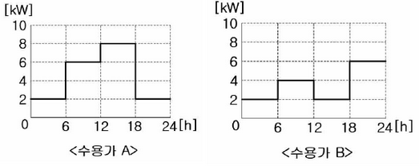

(1) 수용가 A, B의 수용률을 구하시오. (2점=1점+1점)

(2) 수용가 A, B의 부하율을 구하시오. (2점=1점+1점)

(3) 부등률을 구하시오. (1점)

그림: 문제에 제시된 수용가 A와 수용가 B의 수요곡선 그림이 포함되어 있습니다.

---

16번 해설) 단순 계산형 + 복합 계산형 / 난이도 중

정답

(1) 수용가 A와 수용가 B의 수용률 계산

[계산과정]
$$ 수용가 A: 수용률 = \frac{8}{10} \times 100 = 80 [\%] $$
$$ 수용가 B: 수용률 = \frac{6}{10} \times 100 = 60 [\%] $$

[정답] 수용률A = 80[%], 수용률B = 60[%]

(2) 수용가 A와 수용가 B의 부하율 계산

[계산과정]
$$ 수용가 A: 부하율A = \frac{(2+6+8+2) \times 6}{(2+4+2+6) \times 6} \times 100 = 56.25 [\%] $$
$$ 수용가 B: 부하율B = \frac{24}{6} \times 100 = 58.33 [\%] $$

[정답] 부하율A = 56.25 [%], 부하율B = 58.33 [%]

(3) 수용가 A와 수용가 B 사이의 부등률 계산

[계산과정]
$$ 부등률 = \frac{8+6}{10} = 1.4 $$

[정답] 부등률A-B = 1.4

부분점수

| 점수  | 세부기준                                                                                         |
| ----- | ------------------------------------------------------------------------------------------------ |
| 5점   | (1)~(3)번이 계산과정과 정답이 모두 맞은 경우 5점 획득                                            |
| 2~0점 | 문항 (1)의 소문항 총 2개 중 계산과정과 답이 맞은 1개당 1점, 계산과정 또는 답에 오류가 있으면 0점 |
| 2~0점 | 문항 (2)의 소문항 총 2개 중 계산과정과 답이 맞은 1개당 1점, 계산과정 또는 답에 오류가 있으면 0점 |
| 1점   | 문항 (3)의 계산과정과 답이 맞으면 1점, 계산과정 또는 답에 오류가 있으면 0점                      |

해설

(1) 수용률

- 수용률 = 최대수용전력 / 총부하설비용량
- 총 부하 설비용량에 대한 최대 수용전력의 비율이다.
- 수용설비가 동시에 사용되는 정도이다.

(2) 부하율

- 부하율 = 평균수용전력 / 최대수용전력
- 평균 수용전력: 정해진 기간 동안에 사용된 전력량의 평균이다.
- 최대 수용전력: 정해진 기간에서의 피크 부하일 때 최대로 사용하는 전력이다.

(3) 부등률

- 부등률 = 각 부하군의 최대수요전력의 합 / 합성 최대수요전력 ≥ 1
- 각 부하군의 최대수요전력의 합과 합성 최대수요전력과의 비이다.
- 최대 부하를 나타내는 각 부하의 시간대가 다른 정도를 의미한다.

---

# Q17 다음과 같이 점광원으로부터 원뿔 밑면까지의 거리가 4[m]이고, 밑면의 반지름이 3[m]인 원형면이 있다. 이때 평균조도가 100[lx]라면 이 점광원의 평균광도[cd]를 계산하시오. [5점]

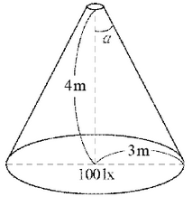

[계산과정]

$$ 점광원으로부터 면까지의 거리: r = 4 m $$
$$ 원형면의 반지름: R = 3 m $$
$$ \* 평균조도: E = 100 lx $$

평균조도 E는 다음과 같이 계산됩니다.

$$ E = \frac{I}{r^2} \times \cos \alpha $$

여기서 I는 광원의 광도, $\alpha$는 광원과 면의 법선 사이의 각도입니다. 원뿔의 밑면에 대한 평균조도는 다음과 같이 표현할 수 있습니다.

$$ E = \frac{I}{r^2} \times \frac{R^2}{r^2} = \frac{I \times R^2}{r^4} $$

주어진 값을 대입하면,

$$ 100 = \frac{I \times 3^2}{4^4} $$

$$ I = \frac{100 \times 4^4}{3^2} = \frac{100 \times 256}{9} = \frac{25600}{9} \approx 2844.44 cd $$

[답] 약 2844.44 cd

---

17번 해설) 단순 계산형 / 난이도 中

정답

점광원이 비추는 원을 이루는 면적에 대한 평균조도를 맞추기 위한 광도 계산

[계산과정]

$$ cos\alpha = \frac{4}{\sqrt{4^2 + 3^2}} = 0.8 $$

$$ I = \frac{100 \times \pi \times 3^2}{2\pi \times (1 - 0.8)} = 2250 \, [cd] $$

$$ **[정답] 광도 I = 2250 \, [cd]** $$

부분점수

| 점수 | 세부기준                                  |
| ---- | ----------------------------------------- |
| 5점  | 계산과정과 정답이 모두 맞은 경우 5점 획득 |
| 0점  | 계산과정과 정답에 오류가 있는 경우        |

해설

[점 광원으로부터 *l* 만큼 떨어진 반지름 *a* 의 원형면의 평균 조도]

(1) 입체각: $\omega = 2\pi(1 - \cos\theta) [sr]$

(2) 광도: $I = \frac{F}{\omega} = \frac{F}{2\pi(1 - \cos\theta)} [cd] $

(3) 조도: E = \frac{F}{A} = \frac{2\pi(1 - \cos\theta)}{\pi r^2} [lx] (여기서, 원의 면적 $A = \pi r^2 \, [m^2]$)

---

# Q18 1선 지락전류가 100[A]이며 35[kV] 이하의 특고압전로가 저압측 전로와 혼촉하고 저압전로의 대지전압이 150[V]를 초과하는 경우에 접지 저항값을 구하시오. (단, 1초를 초과하고 2초 이내에 자동 차단하는 장치가 있다.) [4점]

---

# 18번 해설) 단답 암기형 + 단순 계산형 / 난이도 下

정답: 3[Ω]

변압기 중성점의 접지 저항값 계산

[계산과정]

$$ R_g = \frac{300}{100} = 3[Ω] $$

[정답] 3[Ω]

부분점수

| 점수 | 세부기준                                  |
| ---- | ----------------------------------------- |
| 4점  | 계산과정과 정답이 모두 맞은 경우 4점 획득 |
| 0점  | 계산과정과 정답에 오류가 있는 경우        |

해설

KEC 142.5 변압기 중성점 접지

1. 변압기의 중성점 접지 저항 값은 다음에 의한다.

가. 일반적으로 변압기의 고압·특고압측 전로 1선 지락전류로 150을 나눈 값과 같은 저항 값 이하

나. 변압기의 고압·특고압측 전로 또는 사용전압이 35 kV 이하의 특고압전로가 저압측 전로와 혼촉하고 저압전로의 대지전압이 150 V를 초과하는 경우는 저항 값은 다음에 의한다.

(1) 1초 초과 2초 이내에 고압·특고압 전로를 자동으로 차단하는 장치를 설치할 때는 300을 나눈 값 이하

(2) 1초 이내에 고압·특고압 전로를 자동으로 차단하는 장치를 설치할 때는 600을 나눈 값 이하

2. 전로의 1선 지락전류는 실측값에 의한다. 다만, 실측이 곤란한 경우에는 선로 정수 등으로 계산한 값에 의한다.

**변압기의 중성점 접지 저항값 계산식 :**$ R_g = \frac{150 \text{ or } 300 \text{ or } 600}{I_g} $

---
