# Q1 현장에서 시험용 변압기가 없을 경우 그림과 같이 주상 변압기 2대와 수저항기를 사용하여 변압기의 절연내력 시험을 할 수 있다. 이때 다음 각 물음에 답하시오. 단, 최대 사용 전압 6900[V]의 변압기의 권선을 시험할 경우이며, $E_2/E_1 = 105/6300$ [V] 이다. [8점] (2008년 1회 동일)

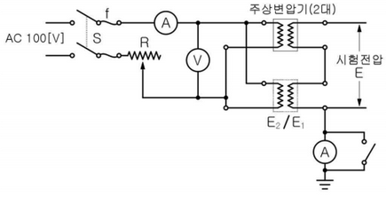

가. 절연내력시험 전압은 몇 [V]이며, 이 시험전압을 몇 분간 가하여 이에 견디어야 하는가? (4점)

(1) 절연내력 시험전압 (3점)

- 계산 :
- 답:

(2) 가하는 시간 (1점):

나. 시험시 전압계 ⑥으로 측정되는 전압은 몇 [V]인가? (3점)

- 계산 :
- 답:

다. 도면에서 오른쪽 하단의 접지되어 있는 전류계는 어떤 용도로 사용되는가? (1점)

- 답:

---

[1번 해설] 단순 계산형 + 단답 암기형 / 난이도 中下

[정답]

가. 절연내력시험 전압은 몇 [V]이며, 이 시험전압을 몇 분간 가하여 이에 견디어야 하는가?

(1) 절연내력 시험전압

[계산과정] V = 6900 $\times$ 1.5 = 10350 [V]

[정답] 10350 [V]

(2) 가하는 시간: 10 [분]

나. 시험시 전압계 ⑤로 측정되는 전압은 몇 [V]인가?

[계산과정] $V = 10350 \times \frac{1}{2} \times \frac{105}{6300} = 86.25 [V] $

[정답] 86.25 [V]

다. 도면에서 오른쪽 하단의 접지되어 있는 전류계는 어떤 용도로 사용되는가?

[정답] 누설 전류의 측정

[부분점수]

| 점수 | 세부기준                                                                  |
| ---- | ------------------------------------------------------------------------- |
| 8점  | 소문항 3개 중 계산과정과 정답이 모두 맞으면 8점 획득                      |
| 3점  | 소문항 가-(1)와 나의 계산과정과 정답이 모두 맞으면 소문항당 각각 3점 획득 |
| 1점  | 소문항 가-(2)와 다의 정답이 맞으면 소문항당 각각 1점 획득                 |
| 0점  | 소문항 3개 모두 계산과정과 정답에 오류가 있는 경우                        |

---

# Q2 다음 빈칸에 알맞은 답을 쓰시오. [3점] (2009년 1회 변형)

단락전류 보호장치는 분기점(○)에 설치해야 한다. 다만, 아래 그림과 같이 분기회로의 단락보호장치 설치점(B)과 분기점(O) 사이에 다른 분기회로 또는 콘센트의 접속이 없고 단락, 화재 및 인체에 대한 위험이 최소화될 경우, 분기회로의 단락 보호장치 P2는 분기점(O)으로부터 (①) m까지 이동하여 설치할 수 있다.

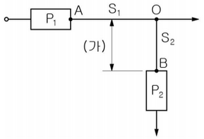

---

[2번 해설] 단답 암기형 / 난이도 下

[정답] ① 3 [m]

[부분점수] 부분 점수 없음

[해설] KEC 212.5.2 단락보호장치의 설치위치

단락전류 보호장치는 분기점(O)에 설치해야 한다. 다만, 아래 그림과 같이 분기회로의 단락보호장치 설치점(B)과 분기점(O) 사이에 다른 분기회로 또는 콘센트의 접속이 없고 단락, 화재 및 인체에 대한 위험이 최소화될 경우, 분기회로의 단락 보호장치 P2는 분기점(O)으로부터 3[m]까지 이동하여 설치할 수 있다.

---

# Q3 연료전지(fuel cell)의 특징 3가지를 쓰시오. [5점] (공사 2012년 4회 동일)

1.
2.
3.
4.

---

[3번 해설] 단답 암기형 / 난이도 下

[정답]
① 발전효율이 높다. (효율이 높고, 용량 조절이 가능)

② 대기 오염물질 배출이 거의 없다. (친환경)

③ 진동이나 소음이 없다.

④ 계속해서 충전이 가능하다.

[부분점수]

| 점수 | 세부기준                        |
| ---- | ------------------------------- |
| 5점  | 정답 3개 모두 맞으면 5점 획득   |
| 4점  | 정답 3개 중 2개 맞으면 4점 획득 |
| 2점  | 정답 3개 중 1개 맞으면 2점 획득 |
| 0점  | 정답 3개 모두 틀리면 0점        |

---

# Q4 소선의 직경이 3.2 [mm]인 37가닥 연선의 외경은 몇 [mm]인지 구하시오. [5점] (2020년 1회 동일)

[계산과정]

[정답]

---

[4번 해설] 단순 계산형 / 난이도 中下

[계산과정] 소선의 총수 N = 3n(n+1) + 1 = 37가닥이므로 층수 n=3이다. 따라서 연선의 바깥지름

$$ D = (2n+1)d = (2 \times 3 + 1) \times 3.2 = 22.4 \text{[mm]} $$

[정답] 22.4[mm]

[부분점수]

| 점수 | 세부기준                               |
| ---- | -------------------------------------- |
| 5점  | 계산과정과 정답이 모두 맞으면 5점 획득 |
| 0점  | 계산과정과 정답에 오류가 있는 경우     |

---

# Q5 다음의 설명에 대한 차단기 트립방식을 빈 칸에 쓰시오. [6점] (신출/산기 20년 2회 소문항 유사)

|                                            |     |
| ------------------------------------------ | --- |
| 가. 고장시 2차전류에 의한 트립방식         |     |
| 나. 고장시 콘덴서 충전전하에 의한 트립방식 |     |
| 다. 고장시 전압의 저하에 의한 트립방식     |     |

---

[5번 해설] 단답 암기형 / 난이도 下

[정답]
가. 과전류 트립방식
나. 콘덴서 트립방식
다. 부족전압 트립방식

[부분점수]

| 점수 | 세부기준                                  |
| ---- | ----------------------------------------- |
| 6점  | 소문항 3개 중 정답이 모두 맞으면 6점 획득 |
| 4점  | 소문항 3개 중 정답이 2개 맞으면 4점 획득  |
| 2점  | 소문항 3개 중 정답이 1개 맞으면 2점 획득  |
| 0점  | 소문항 3개 중 정답이 모두 틀리면 0점      |

[참고] 직류 전압 트립 방식 : 별도로 설치된 축전지 등의 제어용 직류 전원의 에너지에 의하여 트립되는 방식

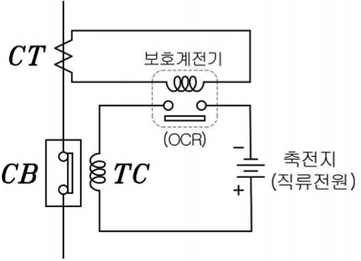

---

# Q6 6600/220[V]인 두 대의 단상 변압기 A, B가 있다. A는 30[kVA]로서 2차로 환산한 저항과 리액턴스의 값은 $r_A = 0.03 [\Omega], x_A = 0.04 [\Omega]$이고, B의 용량은 20[kVA]로서 2차로 환산한 값은 $r_B = 0.03 [\Omega], x_B = 0.06 [\Omega]$이다. 이 두 변압기를 병렬운전해서 40[kVA]의 부하를 건 경우, A기의 분담부하[kVA]는? [6점]

[계산과정]

[정답]

---

[6번 해설] 복합 계산형 / 난이도 上

[계산과정] 분담되는 전력을 $P_a, P_b$, 변압기 용량을 $P_A, P_B$, 각 변압기의 %임피던스를 $\%Z_a, \%Z_b$라 하고 각 변압기 %임피던스는

$$ \%Z*a = \frac{P*{Za}^2}{10V^2} = \frac{30 \times \sqrt{0.03^2 + 0.04^2}}{10 \times 0.22^2} = 3.1, $$

$$ \%Z*b = \frac{P*{Zb}^2}{10V^2} = \frac{20 \times \sqrt{0.03^2 + 0.06^2}}{10 \times 0.22^2} = 2.77 이며 $$

$$ 부하분담비 \frac{P_a}{P_b} = \frac{P_A}{P_B} \times \frac{\%Z_b}{\%Z_a} = \frac{30}{20} \times \frac{2.77}{3.1} = 1.342, $$

$ P_b = \frac{P_a}{1.342} $이고, 2차측 부하$ P_a + P_b = 40[kVA]$이므로

$$ P_a + \frac{P_a}{1.342} = 40[kVA] 따라서, P_a = \frac{40}{1 + \frac{1}{1.342}} = 22.92[kVA] $$

[정답] 22.92[kVA]

[부분점수]

| 점수 | 세부기준                               |
| ---- | -------------------------------------- |
| 6점  | 계산과정과 정답이 모두 맞으면 6점 획득 |
| 0점  | 계산과정과 정답에 오류가 있는 경우     |

---

# Q7 어떤 공장에 220[V], 11[kW]인 3상 유도전동기를 부하설비로 사용하고 있다. 다음 물음에 답하시오. (단, 1일 사용전력량 192 [kWh]이며, 1일의 최대 전력이 12 [kW]이고, 최대전력일 때의 전류값이 34[A]이다.) [6점] (2014년 3회 변형, 답은 동일)

1. 일 부하율은 몇 [%]인가? (3점)

[계산과정]

$$ 일 부하율 = \frac{\text{1일 사용전력량}}{\text{최대 전력} \times 24 \text{시간}} \times 100 [\%] $$

$$ 일 부하율 = \frac{192}{12 \times 24} \times 100 = \frac{192}{288} \times 100 \approx 66.67 [\%] $$

[정답] 66.67 %

2. 최대 공급 전력일 때의 역률은 몇 [%]인가? (3점)

[계산과정]

$ P = \sqrt{3} V_L I_L \cos{\theta}$ 여기서, P는 전력, $V_L$은 선간 전압, $I_L$은 선전류, $\cos{\theta}$는 역률이다.

$$ 주어진 값: P = 12 kW, V_L = 220 V, I_L = 34 A $$

$$ \cos{\theta} = \frac{P}{\sqrt{3} V_L I_L} = \frac{12000}{\sqrt{3} \times 220 \times 34} \approx 0.877 $$

$$ 역률 = \cos{\theta} \times 100 [\%] = 0.877 \times 100 \approx 87.7 [\%] $$

[정답] 87.7 %

---

[7번 해설] 단순 계산형 / 난이도 中

1. 일부하율 계산

[계산과정] $일부하율 = \frac{\text{평균전력}}{\text{최대수용전력}} \times 100 = \frac{192/24}{12} \times 100 = 66.67[\%] $

[정답] 66.67[%]

2. 역률 계산

[계산과정] $\cos\theta = \frac{P}{\sqrt{3}VI} = \frac{12 \times 10^3}{\sqrt{3} \times 220 \times 34} = 0.92623, $

역률[%] = 0.92623 × 100 = 92.62[%]

[정답] 92.62[%]

[부분점수]

| 점수 | 세부기준                                                     |
| ---- | ------------------------------------------------------------ |
| 6점  | 소문항 2개 중 2문항의 계산과정과 정답이 모두 맞으면 6점 획득 |
| 3점  | 소문항 2개 중 1문항의 계산과정과 정답이 모두 맞으면 3점 획득 |
| 0점  | 계산과정과 정답에 오류가 있는 경우                           |

---

# Q8 VCB의 정격차단전류가 24[kA], 정격전압이 170[kV]일 때 차단용량 [MVA]을 선정하시오. [5점] (2018년 3회 필기 전력공학 변형)

차단기 정격 용량 [MVA]

| 5800 | 6600 | 7300 | 9200 | 12000 |
| ---- | ---- | ---- | ---- | ----- |

- 계산 :

- 답 :

---

[8번 해설] 단순 계산형 / 난이도 中

[계산과정]

$$ 차단용량 = \sqrt{3} \times \text{정격전류} \times \text{정격전압} = \sqrt{3} \times 24 \times 170 = 7066.77 \text{ [MVA]} $$

[정답] 7300[MVA] 선정

[부분점수]

| 점수 | 세부기준                               |
| ---- | -------------------------------------- |
| 5점  | 계산과정과 정답이 모두 맞으면 6점 획득 |
| 0점  | 계산과정과 정답에 오류가 있는 경우     |

---

# Q9 3상 부하에 전력을 공급하기 위해 단상 변압기 3대를 이용하여 △결선으로 운전하는 변압기가 있다. 운전하는 도중에 한 대가 고장으로 제어되어 V결선으로 전력을 공급할 때, 출력비와 이용률을 쓰시오. [4점] (기출 기본개념)

1. 출력비 :

2. 이용률 :

---

[9번 해설] 단순 계산형 또는 단답 암기형 / 난이도 下

[정답]

1.  출력비 : 57.74 [%] $\frac{\sqrt{3}P}{3P} = \frac{\sqrt{3}VI}{3VI} = \frac{\sqrt{3}}{3} \times 100 = 57.735 \approx 57.74$ [%]

2.  이용률 : 86.60 [%] $\frac{\sqrt{3}P}{2P} = \frac{\sqrt{3}VI}{2VI} = \frac{\sqrt{3}}{2} \times 100 = 86.602 \approx 86.60$ [%]

[부분점수]

| 점수 | 세부기준                                     |
| ---- | -------------------------------------------- |
| 4점  | 소문항 2개 중 2문항의 정답이 맞으면 4점 획득 |
| 2점  | 소문항 2개 중 1문항의 정답이 맞으면 2점 획득 |
| 0점  | 소문항 2개 모두 정답과 맞지 않는 경우        |

---

# Q10 다음 내용의 빈 칸에 알맞은 말을 적으시오. (212.2.3 중성선의 차단 및 재폐로) [4점] (신출)

[회로의 특성에 따른 요구사항]

중성선을 ( ① ) 및 ( ② )하는 회로의 경우에는 설치하는 개폐기 및 차단기는 ( ① ) 시에는 중성선이 선도체보다 늦게 ( ① ) 되어야 하며, ( ② ) 시에는 선도체와 동시 또는 그 이전에 ( ② ) 되는 것을 설치하여야 한다.

---

## [10번 해설] 단답 암기형 / 난이도 下

[정답]

1. 차단
2. 재폐로

[부분점수]

| 점수 | 세부기준                                     |
| ---- | -------------------------------------------- |
| 4점  | 소문항 2개 중 2문항의 정답이 맞으면 4점 획득 |
| 2점  | 소문항 2개 중 1문항의 정답이 맞으면 2점 획득 |
| 0점  | 소문항 2개 모두 정답과 맞지 않는 경우        |

[해설] KEC 212.2.3 중성선의 차단 및 재폐로

[회로의 특성에 따른 요구사항]

중성선을 차단 및 재폐로하는 회로의 경우에는 설치하는 개폐기 및 차단기는 차단 시에는 중성선이 선도체보다 늦게 차단되어야 하며, 재폐로 시에는 선도체와 동시 또는 그 이전에 재폐로 되는 것을 설치하여야 한다.

---

# Q11 차단기는 아크소호 기능이 있는 개폐기로, 부하전류 뿐만 아니라 고장전류도 개폐할 수 있으며, 소호 매질에 따라 여러 가지로 분류된다. 다음 약호에 대한 차단기의 명칭을 적으시오. [4점] (예) ELB=누전차단기 (기출 기본개념)

1. OCB:

2. ABB:

3. GCB:

4. MBB:

---

[11번 해설] 단답 암기형 / 난이도 下

[정답]

1. OCB: 유입차단기
2. ABB: 공기차단기
3. GCB: 가스차단기
4. MBB: 자기차단기

[부분점수]

| 점수 | 세부기준                                     |
| ---- | -------------------------------------------- |
| 4점  | 소문항 4개 중 4문항의 정답이 맞으면 4점 획득 |
| 3점  | 소문항 4개 중 3문항의 정답이 맞으면 3점 획득 |
| 2점  | 소문항 4개 중 2문항의 정답이 맞으면 2점 획득 |
| 1점  | 소문항 4개 중 1문항의 정답이 맞으면 1점 획득 |
| 0점  | 소문항 4개 모두 정답과 맞지 않는 경우        |

---

# Q12 다음과 같은 논리회로를 이용하여 진리표를 완성하시오. (단, L은 Low이고, H는 High이다.) [5점] (기출변형)

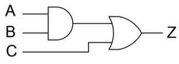

| A   | B   | C   | Z   |
| --- | --- | --- | --- |
| L   | L   | L   |     |
| L   | L   | H   |     |
| L   | H   | L   |     |
| L   | H   | H   |     |
| H   | L   | L   |     |
| H   | L   | H   |     |
| H   | H   | L   |     |
| H   | H   | H   |     |

---

[12번 해설] 단순 계산형+개념 이해형 / 난이도 中下

[정답]

|     | 1   | 2   | 3   | 4   | 5   | 6   | 7   | 8   |
| --- | --- | --- | --- | --- | --- | --- | --- | --- |
| A   | L   | L   | L   | L   | H   | H   | H   | H   |
| B   | L   | L   | H   | H   | L   | L   | H   | H   |
| C   | L   | H   | L   | H   | L   | H   | L   | H   |
| Z   | L   | H   | L   | H   | L   | H   | H   | H   |

[부분점수]

| 점수 | 세부기준                                       |
| ---- | ---------------------------------------------- |
| 5점  | 소문항 8개 중 8문항의 정답이 맞으면 5점 획득   |
| 4점  | 소문항 8개 중 6~7문항의 정답이 맞으면 4점 획득 |
| 3점  | 소문항 8개 중 4~5문항의 정답이 맞으면 3점 획득 |
| 2점  | 소문항 8개 중 2~3문항의 정답이 맞으면 2점 획득 |
| 1점  | 소문항 8개 중 1문항의 정답이 맞으면 1점 획득   |
| 0점  | 소문항 8개 모두 정답과 맞지 않는 경우          |

---

# Q13 동기발전기의 병렬운전 조건을 4가지 쓰시오. [4점] (기출 기본개념)

①

②

③

④

---

# [13번 해설] 단답 암기형 / 난이도 下

[정답]

1. 기전력의 크기가 일치할 것
2. 기전력의 파형이 일치할 것
3. 기전력의 주파수가 일치할 것
4. 기전력의 위상이 일치할 것

[부분점수]

| 점수 | 세부기준                                     |
| ---- | -------------------------------------------- |
| 4점  | 소문항 4개 중 4문항의 정답이 맞으면 4점 획득 |
| 3점  | 소문항 4개 중 3문항의 정답이 맞으면 3점 획득 |
| 2점  | 소문항 4개 중 2문항의 정답이 맞으면 2점 획득 |
| 1점  | 소문항 4개 중 1문항의 정답이 맞으면 1점 획득 |
| 0점  | 소문항 4개 모두 정답과 맞지 않는 경우        |

---

# Q14 아래 그림의 회로에 대해서 각 물음에 답하시오. [5점] (2010년 3회 동일)

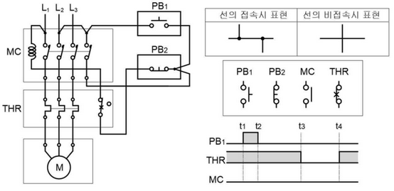

**1. 시퀀스도로 표시하시오. (전선의 접속시 표현과 접점형태를 참고하여, 자기유지를 완성하시오.) (3점)**

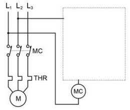

**2. 시간 t_3에 열동 계전기가 작동하고, 시간 $t_4$에서 수동으로 복귀하였다. 이때의 동작을 타임차트로 표시하시오. (2점)**

---

[14번 해설] 개념 이해형+도면 해석 / 난이도 中

[정답]

1.

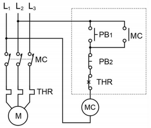

2.

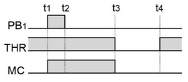

[부분점수]

| 점수 | 세부기준                                         |
| ---- | ------------------------------------------------ |
| 5점  | 소문항 2개 중 2문항의 정답이 맞으면 5점 획득     |
| 3점  | 소문항 2개 중 1)번 문항의 정답이 맞으면 3점 획득 |
| 2점  | 소문항 2개 중 2)번 문항의 정답이 맞으면 2점 획득 |
| 0점  | 소문항 2개 모두 정답과 맞지 않는 경우            |

---

# Q15 도면과 같이 345[kV] 변전소의 단선도와 변전소에 사용되는 주요 제원을 이용하여 다음 각 물음에 답하시오. [13점] (2019년 2회 동일)

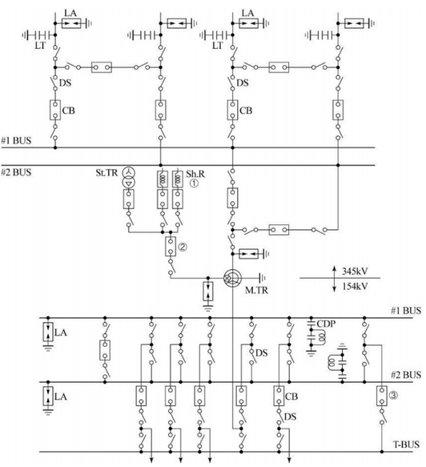

[주변압기]

단권변압기 345[kV]/154[kV]/23[kV] (Y-Y-Δ)

166.7[MVA]x3대≒500[MVA],

OLTC부 %임피던스(500[MVA] 기준): 1차~2차: 10[%]

[차단기]

362[kV] GCB 25[GVA] 4000[A]~2000[A]

170[kV] GCB 15[GVA] 4000[A]~2000[A]

25.8[kV] VCB ( ) [MVA] 2500[A]~1200[A]

[단로기]

362[kV] DS 4000[A]~2000[A]

170[kV] DS 4000[A]~2000[A]

25.8[kV] DS 2500[A]~1200[A]

[분로 리액터]

23[kV] Sh.R 30[MVAR]

[피뢰기]

288[kV] LA 10[kA]

144[kV] LA 10[kA]

21[kV] LA 10[kA]

[주모선]

Al-Tube 200φ

가. 도면의 345[kV]측 모선 방식은 어떤 모선 방식인가? (1점)

[정답]

나. 도면에서 ①번 기기의 설치 목적은 무엇인가? (1점)

[정답]

다. 도면에 주어진 제원을 참조하여 주변압기에 대한 등가 %임피던스($Z_H, Z_M, Z_L$)를 구하고, ②번 23[kV] VCB의 차단용량을 계산하시오. (단, 그림과 같은 임피던스 회로는 100[MVA] 기준이다.) (6점)

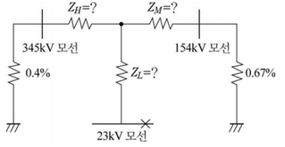

① 등가 %임피던스 ($Z_H, Z_M, Z_L$) (3점)

[계산과정]

[정답]

② 23[kV] VCB 차단용량 (3점)

[계산과정]

[정답]

라. 도면의 345[kV] GCB에 내장된 계전기용 BCT의 오차계급은 C800이다 부담은 몇 [VA]인가? (2점)

[계산과정]

[정답]

마. 도면의 ③번 차단기의 설치 목적을 설명하시오. (1점)

[정답]

바. 도면의 주변압기 1 Bank(단상x3대)을 증설하여 병렬운전시키고자 한다. 이때 병렬운전을 할 수 있는 조건 4가지를 쓰시오. (2점)

[정답]

①

②

③

④

---

## [15번 해설] 단순 암기형+복합 계산형 / 난이도 上

가. **[정답]** 2중 모선 방식

나. **[정답]** 페란티 현상 방지

다.

① 등가 %임피던스 ($Z_H, Z_M, Z_L$)

[계산과정] 500 [MVA] 기준 %임피던스로 변환한다.

1차~2차 $\%Z*{HM} = 10[\%], 2차~3차 \%Z*{ML}$ = 67[%],

1차~3차 $\%Z_{HL}$ = 78[%]

100[MVA] 기준으로 환산한다.

$$ Z*{HM} = 10 \times \frac{100}{500} = 2[\%], Z*{ML} = 67 \times \frac{100}{500} = 13.4[\%], Z\_{HL} = 78 \times \frac{100}{500} = 15.6[\%] $$

등가 임피던스는

$$ \%Z*H = \frac{1}{2}(Z*{HM} + Z*{HL} - Z*{ML}) = \frac{1}{2}(2 + 15.6 - 13.4) = 2.1[\%] $$
$$ \%Z*M = \frac{1}{2}(Z*{HM} + Z*{ML} - Z*{HL}) = \frac{1}{2}(2 + 13.4 - 15.6) = -0.1[\%] $$
$$ \%Z*L = \frac{1}{2}(Z*{ML} + Z*{HL} - Z*{HM}) = \frac{1}{2}(13.4 + 15.6 - 2) = 13.5[\%] $$

**[정답]** $\%Z_H: 2.1[\%], \%Z_M: -0.1[\%], \%Z_L: 13.5[\%] $

② 23[kV] VCB 차단용량

[계산과정] 23[kV] VCB 설치점까지 전체 임피던스를 계산한다.

$$ \%Z = \frac{(2.1 + 0.4) \times (-0.1 + 0.67)}{(2.1 + 0.4) + (-0.1 + 0.67)} + 13.5 = 13.96[%] $$

$$ 차단용량 P_s = \frac{100}{13.96} \times 100 = 716.33[MVA] $$

[정답] 차단용량: 716.33[MVA]

라. 오차 계급이 C800일 때의 부담

[계산과정] 오차 계급이 C800일 때, 임피던스는 8[Ω]이고, (2차에 정격전류 5[A]의 20배 100[A]가 흐를 때의 2차 단자전압이 800[V]가 되므로 임피던스는 8[Ω]이 된다.)

CT 2차 측 전류는 5[A]이다. $I^2Z = 5^2 \times 8 = 200[VA] $

[정답] 200[VA]

마. **[정답]** 모선 절체 또는 모선 점검 시 무정전으로 점검하기 위해 사용한다.

바. 변압기의 병렬운전 조건

[정답]

① 극성이 같을 것

② 1, 2차 정격 전압(권수비)이 같을 것

③ %임피던스 강하가 같을 것

④ 변압기 내부 저항과 리액턴스의 비가 같을 것

[부분점수]

| 점수 | 세부기준                                                       |
| ---- | -------------------------------------------------------------- |
| 13점 | 소문항 6개 중 6문항의 계산과정과 정답이 모두 맞으면 13점 획득  |
| 1점  | 소문항 가, 나, 마의 정답이 맞으면 1개 당 각각 1점 획득         |
| 3점  | 소문항 다 ①, ②의 계산과정과 정답이 모두 맞으면 각각 3점씩 획득 |
| 2점  | 소문항 라의 정답이 맞으면 2점 획득                             |
| 2점  | 소문항 바의 정답 4개 중 4개 맞으면 2점, 2~3개 맞으면 1점 획득  |
| 0점  | 소문항 모두 정답과 맞지 않는 경우                              |

---

# Q16 VCB의 특징을 3가지 쓰시오. [6점] (2019년 1회 동일(변형))

1.
2.
3.

---

## [16번 해설] 단답 암기형 / 난이도 下

[정답]

- 차단 성능이 우수하고, 차단시간이 짧다.
- 소형이며 경량이다.
- 완전 밀봉형으로 소음이 적고, 안전하다.
- 수명이 길고, 보수가 거의 불필요하다.
- 고진공 중에서 전자의 고속도 확산에 의해서 차단한다.

[부분점수]

| 점수 | 세부기준                                  |
| ---- | ----------------------------------------- |
| 6점  | 소문항 3개 중 정답이 모두 맞으면 6점 획득 |
| 4점  | 소문항 3개 중 정답이 2개 맞으면 4점 획득  |
| 2점  | 소문항 3개 중 정답이 1개 맞으면 2점 획득  |
| 0점  | 소문항 3개 중 정답이 모두 틀리면 0점      |

---

# Q17 22.9[kV-Y] 중성선 다중 접지 전선로에 정격전압 13.2[kV], 정격용량 250[kVA]의 단상 변압기 3대를 이용하여 아래 그림과 같이 Y-△ 결선을 하고자 한다. 다음 각 물음에 답하시오. [6점]

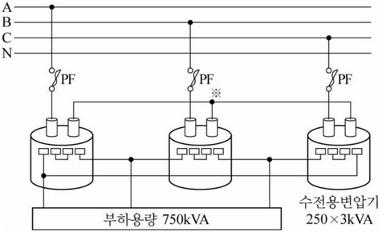

가. 1) 변압기 1차측 Y결선의 중성점을 전로로 N선에 연결해야 하는가? 연결해서는 안되는가? (1점)

[정답]

2. 연결해야 한다면 연결해야 하는 이유를, 연결해서는 안된다면 연결해서는 안되는 이유를 설명하시오. (2점)

[정답]

나. 전력퓨즈의 용량은 몇 [A]인지 선정하시오. (단, 1.25배의 여유를 준다.) (3점)

퓨즈의 정격용량 [A]: 1, 3, 5, 10, 15, 20, 30, 40, 50, 60, 75, 100

[계산과정]

[정답]

---

# 17번 해설

가. [정답]

1. 연결해서는 안된다.
2. 중성점이 전선로 N선에 연결되어 있는 경우, 임의의 한 상 결상 시 나머지 2대의 변압기가 역 V결선되므로 과부하로 인한 소손이 발생할 수 있다.

나. 전력퓨즈의 용량 계산

[계산과정]

$$ 전부하 전류 I = \frac{750}{\sqrt{3} \times 22.9} = 18.91 [A] $$

전부하 전류의 1.25배의 여유를 주어야 하므로,

$$ 퓨즈용량 = 18.91 x 1.25 = 23.64 [A] $$

[정답] 30[A] 퓨즈 선정

[부분점수]

| 점수 | 세부기준                                           |
| ---- | -------------------------------------------------- |
| 6점  | 소문항 2개 중 정답이 모두 맞으면 6점 획득          |
| 1점  | 소문항 가. 1)이 정답이면 1점 획득                  |
| 2점  | 소문항 가. 2)가 정답이면 2점 획득                  |
| 3점  | 소문항 나의 계산과정과 정답이 모두 맞으면 3점 획득 |
| 0점  | 소문항 모두 정답이 아니면 0점                      |

---

# Q18 다음의 전등부하, 전열부하, 동력부하를 사용하고 있는 수용가에 사용되는 변압기의 용량을 선정하시오. [5점] (기출 변형)

| 설비용량 [kW] | 수용률 | 부등률 | 역률 |
| ------------- | ------ | ------ | ---- | --- |
| 전등부하      | 60     | 80     | -    | 95  |
| 전열부하      | 40     | 50     | -    | 90  |
| 동력부하      | 70     | 40     | 1.4  | 90  |

변압기의 표준용량 [kVA]: 50, 75, 100, 150, 200, 300

[계산과정]

[정답]

---

[18번 해설] 복합 계산형 / 난이도 中

[계산과정]

1.  유효전력 $P = 60 \times 0.8 + 40 \times 0.5 + \frac{70 \times 0.4}{1.4} = 88 [kW] $

2.  무효전력$ P_r = 60 \times 0.8 \times \frac{\sqrt{1 - 0.95^2}}{0.95} + 40 \times 0.5 \times \frac{\sqrt{1 - 0.9^2}}{0.9} + \frac{70 \times 0.4}{1.4} \times \frac{\sqrt{1 - 0.9^2}}{0.9} = 39.02 [kVar] $

3.  변압기 용량 $P_a = \sqrt{88^2 + 39.02^2} = 96.26 [kVA] $

[정답] 100[kVA] 선정

[부분점수]

| 점수 | 세부기준                               |
| ---- | -------------------------------------- |
| 5점  | 계산과정과 정답이 모두 맞으면 6점 획득 |
| 0점  | 계산과정과 정답에 오류가 있는 경우     |

---
