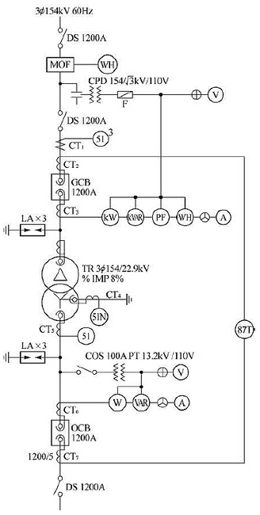
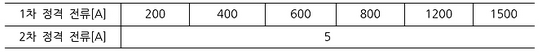
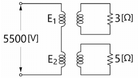
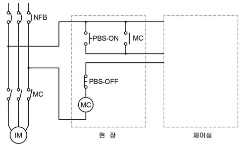
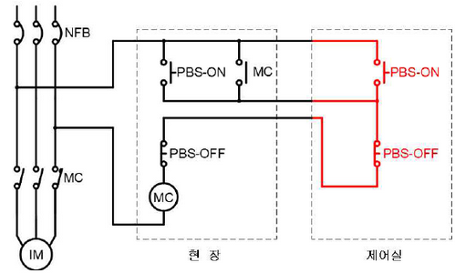
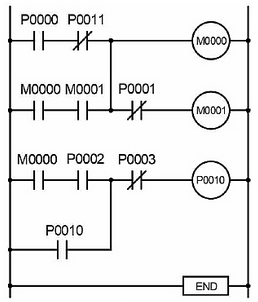
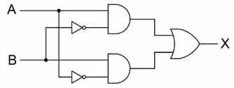
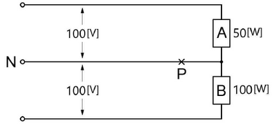

# Q1 도면은 어느 154[kV] 수용가의 수전 설비 단선 결선도의 일부분이다. 주어진 표와 도면을 이용하여 다음 각 물음에 답하시오. [12점]

변압기 정격 용량

|     | 10  | 20  | 30  | 40  | 50  | 75  | 100 |
| --- | --- | --- | --- | --- | --- | --- | --- |

(1) 변압기 2차 부하 설비 용량이 51[MW], 수용률이 70[%], 부하 역률이 90[%]일 때 도면의 변압기 용량은 몇 [MVA]가 되는가? (단, 표준용량을 참고하여 계산하시오.)

계산과정 :
$$ P = 51 MW $$
$$ 수용률 = 70\% $$
$$ 역률 = 90\% $$
$$ S = \frac{P}{수용률 \times 역률} = \frac{51}{0.7 \times 0.9} \approx 81.7 MVA $$
표준용량을 고려하여 80MVA 선정

정답 : 80 MVA

(2) 변압기 1차측 DS의 정격전압은 몇[kV]인가?

정답 : 154 kV

(3) (1)에서 선정한 변압기 용량을 기준으로 $CT_1$의 비는 얼마인지를 계산하고 표에서 선정하시오. (단, 여유율은 1.25로 한다.)

계산과정 :
$$ I = \frac{S}{\sqrt{3}V} = \frac{80 \times 10^6}{\sqrt{3} \times 154 \times 10^3} \approx 284 A $$
$$ I\_{여유율} = 284 A \times 1.25 = 355 A $$
표에서 가장 가까운 값은 400A 이므로 CT의 비는 400A이다.

$$ 정답 : 400/5 $$

(4) OCB의 정격 차단전류가 23[kA]일 때, 이 차단기의 차단용량은 몇 [MVA]인가?

계산과정 :

정답 :

(5) 과전류 계전기의 정격부담이 9[VA] 일 때 이 계전기의 임피던스는 몇 [Ω]인가?

계산과정 :

정답 : (계산 불가능)

(6) $CT_7$ 1차 전류가 600[A] 일 때 $CT_7$의 2차에서 비율 차동 계전기의 단자에 흐르는 전류는 몇 [A] 인가?

계산과정 :

$CT_7$의 2차 정격 전류는 5A 이므로, 600A의 1차 전류는 2차에서 $\frac{5}{600} \times 600 = 5A$ 가 된다.

정답 : 5 A

---

# 1번 해설: 단순 계산형 (난이도: 중)

## 정답

(1)

- **계산과정**: $\frac{51 \times 0.7}{0.9} = 39.67 \text{ [MVA]} $

* **정답**: 40 [MVA] 선정

(2)

- **정답**: 170 [kV]

(3)

**계산과정**: $\frac{40 \times 10^6}{\sqrt{3} \times 154 \times 10^3} = 149.96 \text{ [A]}$

여유율을 적용하면 $149.96 \times 1.25 = 187.45 \text{ [A]}$ 이므로 표에서 200/5 선정

**정답**: 200/5

(4)

- **계산과정**: $\sqrt{3} \times 25.8 \times 23 = 1027.8 \text{ [MVA]} $

* **정답**: 1027.8 [MVA]

(5)

- **계산과정**: $\frac{9}{5^2} = 0.36 \text{ [Ω]}$

* **정답**: 0.36 [Ω]

(6)

- **계산과정**: $600 \times \frac{5}{1200} \times \sqrt{3} = 4.33 \text{ [A]}$

* **정답**: 4.33 [A]

## 부분 점수

| 점수 | 세부 기준                                                     |
| ---- | ------------------------------------------------------------- |
| 12점 | 소문항 6개 계산과정과 정답이 모두 맞으면 12점 획득            |
| 10점 | 소문항 6개 중 5문항의 계산과정과 정답이 모두 맞으면 10점 획득 |
| 8점  | 소문항 6개 중 4문항의 계산과정과 정답이 모두 맞으면 8점 획득  |
| 6점  | 소문항 6개 중 3문항의 계산과정과 정답이 모두 맞으면 6점 획득  |
| 4점  | 소문항 6개 중 2문항의 계산과정과 정답이 모두 맞으면 4점 획득  |
| 2점  | 소문항 6개 중 1문항의 계산과정과 정답이 모두 맞으면 2점 획득  |
| 0점  | 소문항 6개 모두 계산과정과 정답에 오류가 있는 경우            |

---

# Q2 욕실 등 인체가 물에 젖어있는 상태에서 물을 사용하는 장소에 콘센트를 시설하는 경우에 설치해야 하는 인체감전보호용 누전차단기의 정격감도전류와 동작시간은 얼마 이하를 사용하여야 하는가? [4점]

① 정격감도전류 :

② 동작시간 :

---

[2번 해설] 단답 암기형 / 난이도 下

[정답]

① 정격감도전류 : 15[mA] 이하

② 동작시간 : 0.03초 이하

[부분점수]

| 점수 | 세부기준                        |
| ---- | ------------------------------- |
| 4점  | 정답 2개 모두 맞으면 4점 획득   |
| 2점  | 정답 2개 중 1개 맞으면 2점 획득 |
| 0점  | 정답 2개 모두 틀리면 0점        |

---

# Q3 사용 중인 UPS의 2차 측에 단락사고 등이 발생했을 경우 UPS와 고장 회로를 분리하는 방식 3가지를 쓰시오. [5점]

①

②

③

---

[3번 해설] 단답 암기형 / 난이도 下

[정답]

1. 배선용차단기에 의한 방식
2. 속단퓨즈에 의한 방식
3. 반도체차단기에 의한 방식

[부분점수]

| 점수 | 세부기준                        |
| ---- | ------------------------------- |
| 5점  | 정답 3개 모두 맞으면 5점 획득   |
| 3점  | 정답 3개 중 2개 맞으면 3점 획득 |
| 2점  | 정답 3개 중 1개 맞으면 2점 획득 |
| 0점  | 정답 3개 모두 틀리면 0점        |

---

# Q4 빌딩에서 면적당 부하용량이 각각 조명설비 20[VA/m²], 동력설비 35 [VA/m²], 냉방설비 40[VA/m²] 이고, 연면적 70000[m²] 일 때, 이 빌딩에 설치된 변압기의 용량은 몇 [kVA] 인가? [4점]

계산과정 :

총 부하량 = (조명설비 부하용량 + 동력설비 부하용량 + 냉방설비 부하용량) × 연면적
$$ = (20 + 35 + 40) [VA/m²] × 70000 [m²] $$
= 95 [VA/m²] × 70000 [m²]
= 6650000 [VA]
= 6650 [kVA]

정답 : 6650 [kVA]

---

[4번 해설] 단순 계산형 / 난이도 中 (신출)

[정답]

- 계산과정: (20 + 35 + 40) $\times$ 70,000 = 6,650,000 [VA] = 6,650 [kVA]

* 정답 : 6,650 [kVA]

[부분점수]

| 점수 | 세부기준                               |
| ---- | -------------------------------------- |
| 4점  | 계산과정과 정답이 모두 맞으면 4점 획득 |
| 0점  | 계산과정과 정답에 오류가 있는 경우     |

---

# Q5 계약부하 설비에 의한 계약최대 전력을 정하는 경우에 부하설비 용량이 900[kW]인 경우 전력회사와의 계약 최대전력은 몇 [kW]인가? 단, 계약 최대전력 환산표는 다음과 같다. [5점]

| 구분                    | 승률   |
| ----------------------- | ------ |
| 처음 75[kW]에 대하여    | 100[%] |
| 다음 75[kW]에 대하여    | 85[%]  |
| 다음 75[kW]에 대하여    | 75[%]  |
| 다음 75[kW]에 대하여    | 65[%]  |
| 300[kW] 초과분에 대하여 | 60[%]  |

계산과정 :

900 kW 의 계약 최대 전력을 구하기 위해 환산표를 이용합니다.

$$ 처음 75 kW: 75 \times 1.00 = 75 kW $$
$$ 다음 75 kW: 75 \times 0.85 = 63.75 kW $$
$$ 다음 75 kW: 75 \times 0.75 = 56.25 kW $$
$$ 다음 75 kW: 75 \times 0.65 = 48.75 kW $$
$$ \* 나머지 (900 - 300) kW: 600 \times 0.60 = 360 kW $$

$$ 총 계약 최대 전력: 75 + 63.75 + 56.25 + 48.75 + 360 = 603.75 kW $$

정답 : 603.75 kW

---

[5번 해설] 단순 계산형 / 난이도 中

[정답]

- 계산과정 : 계약전력 = $75 + 75 \times 0.85 + 75 \times 0.75 + 75 \times 0.65 + (900 - 300) \times 0.6 = 603.75 [kW] $

* 정답 : 604 [kW]

[부분점수]

| 점수 | 세부기준                               |
| ---- | -------------------------------------- |
| 5점  | 계산과정과 정답이 모두 맞으면 5점 획득 |
| 0점  | 계산과정과 정답에 오류가 있는 경우     |

---

# Q6 다음 주어진 계전기의 약호에 대한 각각의 명칭을 쓰시오. [5점]

| 약호 | 명칭 |
| ---- | ---- |
| OCR  |      |
| GR   |      |
| OPR  |      |
| OVR  |      |
| PWR  |      |

---

# 6번 해설: 단답 암기형 / 난이도 중 (신출)

## [정답]

| 약호 | 명칭          |
| ---- | ------------- |
| OCR  | 과전류 계전기 |
| GR   | 지락 계전기   |
| OPR  | 결상 계전기   |
| OVR  | 과전압 계전기 |
| PWR  | 전력 계전기   |

## [부분점수]

| 점수 | 세부기준                        |
| ---- | ------------------------------- |
| 5점  | 정답 5개 모두 맞으면 5점 획득   |
| 4점  | 정답 5개 중 4개 맞으면 4점 획득 |
| 3점  | 정답 5개 중 3개 맞으면 3점 획득 |
| 2점  | 정답 5개 중 2개 맞으면 2점 획득 |
| 1점  | 정답 5개 중 1개 맞으면 1점 획득 |
| 0점  | 정답 5개 모두 틀리면 0점        |

---

# Q7 연축전지의 정격용량이 200[Ah] 이고, 상시 부하가 10[kW]이며, 표준전압이 100[V]인 부동충전방식 충전기의 2차 전류는 몇 [A] 인지 구하시오 (단, 상시 부하의 역률은 1로 간주한다.) [5점]

계산과정 :

$$ 상시 부하 전력 P = 10kW = 10000W $$
$$ 표준전압 V = 100V $$
$$ 역률 \cos \theta = 1 $$

$$ 부하 전류 I = \frac{P}{V \times \cos \theta} = \frac{10000}{100 \times 1} = 100A $$

정답 : 100A

---

[7번 해설] 단순 계산형 / 난이도 下

[정답]

- 계산과정 : $\frac{200}{10} + \frac{10000}{100} = 120[A] $

* 정답 : 120[A]

[부분점수]

| 점수 | 세부기준                               |
| ---- | -------------------------------------- |
| 5점  | 계산과정과 정답이 모두 맞으면 5점 획득 |
| 0점  | 계산과정과 정답에 오류가 있는 경우     |

---

# Q8 변압비 3500/100[V]인 단권 변압기 2대의 고압측을 그림과 같이 직렬로 5500[V] 전원에 접속하고, 저압측에 각각 3[Ω], 5[Ω]의 저항을 접속하였을 때 고압측의 단자전압 $E_1$과 $E_2$를 구하시오.

계산과정:

정답:

---

[8번 해설] 단순 계산형 / 난이도 中 (신출-필기 변형)

[정답]

$$ 계산과정 : E_1 = \frac{3}{3+5} \times 5500 = 2062.5 [V], E_2 = \frac{5}{3+5} \times 5500 = 3437.5 [V] $$
$$ 정답 : E_1 : 2062.5 [V], E_2 : 3437.5 [V] $$

[부분점수]

| 점수 | 세부기준                                       |
| ---- | ---------------------------------------------- |
| 6점  | 2개 모두 계산과정과 정답이 맞으면 6점 획득     |
| 3점  | 2개 중 1개의 계산과정과 정답이 맞으면 3점 획득 |
| 0점  | 2개 모두 계산과정과 정답이 맞지 않는 경우      |

---

# Q9 전력시설물 공사감리업무 수행지침에서 정하는 전기공사업자가 해당 공사 현장에서 공사업무 수행상 비치하고 기록·보관하여야 하는 서식을 5가지만 쓰시오. [5점]

①

②

③

④

⑤

---

## [9번 해설] 단답 암기형 / 난이도 中

[정답]

1. 하도급 현황
2. 주요인력 및 장비투입 현황
3. 작업계획서
4. 기자재 공급원 승인현황
5. 주간공정계획 및 실적보고서
6. 안전관리비 사용실적 현황
7. 각종 측정 기록표

[부분점수]

| 점수 | 세부기준                        |
| ---- | ------------------------------- |
| 5점  | 정답 5개 모두 맞으면 5점 획득   |
| 4점  | 정답 5개 중 4개 맞으면 4점 획득 |
| 3점  | 정답 5개 중 3개 맞으면 3점 획득 |
| 2점  | 정답 5개 중 2개 맞으면 2점 획득 |
| 1점  | 정답 5개 중 1개 맞으면 1점 획득 |
| 0점  | 정답 5개 모두 틀리면 0점        |

---

# Q10 유도 전동기 IM을 유도전동기가 있는 현장과 현장에서 조금 떨어진 제어실 어느 쪽에서든지 기동 및 정지가 가능하도록 전자접촉기 MC와 누름버튼 스위치 PBS-ON용 및 PBS-OFF용을 사용하여 제어회로를 점선안에 그리시오. [5점]

---

# [10번 해설] 도면 작성 / 난이도 中

## [정답]

## [부분점수]

| 점수 | 세부기준                |
| ---- | ----------------------- |
| 5점  | 정답이 맞으면 5점 획득  |
| 0점  | 정답에 오류가 있는 경우 |

---

# Q11 다음은 PLC 래더 다이어그램에 의한 프로그램이다. 아래의 명령어를 활용하여 각 차례에 알맞은 내용으로 프로그램을 완성하시오. [8점]

| 명령어 | 기능        |
| ------ | ----------- |
| S      | 시작        |
| A      | AND         |
| O      | OR          |
| SN     | 시작(부정)  |
| AN     | AND(부정)   |
| ON     | OR(부정)    |
| AS     | 그룹간 직렬 |
| OS     | 그룹간 병렬 |
| W      | 출력        |
| END    | 종료        |

[프로그램]

| STEP | 명령어 | 번지  | STEP | 명령어 | 번지  |
| ---- | ------ | ----- | ---- | ------ | ----- |
| 0    | S      | P0000 | 7    | W      | M0001 |
| 1    | AN     | P0011 | 8    |        |       |
| 2    | ①      | ②     | 9    | A      | P0002 |
| 3    | A      | M0001 | 10   | ⑦      | P0010 |
| 4    | ③      | -     | 11   | AN     | P0003 |
| 5    | ④      | M0000 | 12   | W      | P0010 |
| 6    | AN     | P0001 | 13   | ⑧      | -     |

---

# [11번 해설] PLC / 난이도 中上 (기출변형)

## [정답]

| ①   | ②     | ③   | ④   | ⑤   | ⑥     | ⑦   | ⑧   |
| --- | ----- | --- | --- | --- | ----- | --- | --- |
| S   | M0000 | OS  | W   | S   | M0000 | O   | END |

| STEP | 명령어 | 번지  | STEP | 명령어 | 번지  |
| ---- | ------ | ----- | ---- | ------ | ----- |
| 0    | S      | P0000 | 7    | W      | M0001 |
| 1    | AN     | P0011 | 8    | S      | M0000 |
| 2    | S      | M0000 | 9    | A      | P0002 |
| 3    | A      | M0001 | 10   | O      | P0010 |
| 4    | OS     | -     | 11   | AN     | P0003 |
| 5    | W      | M0000 | 12   | W      | P0010 |
| 6    | AN     | P0001 | 13   | END    | -     |

## [부분점수]

| 점수  | 세부기준                                |
| ----- | --------------------------------------- |
| 8점   | 소문항 8개 정답이 모두 맞으면 8점 획득  |
| 1~7점 | 소문항 8개 중 1문항당 1점씩 획득        |
| 0점   | 소문항 8개 모두 정답에 오류가 있는 경우 |

---

# Q12 저압전로 중의 전동기 보호용 과전류보호장치의 시설에서 과부하 보호장치, 단락보호전용 차단기 및 단락보호전용 퓨즈는 「전기용품 및 생활용품 안전관리법」에 적용을 받는 것 이외에는 한국산업표준(이하 "KS"라 한다)에 적합하여야 하며, 단락보호전용 aM 퓨즈의 용단 및 동작 특성은 다음에 따라 시설하여야 한다. 빈 칸에 알맞은 값을 쓰시오. [4점]

| 정격전류의 배수 | 용단시간    | 동작시간    |
| --------------- | ----------- | ----------- |
| 4배             | (1) 초 이내 | -           |
| 6.3배           | -           | (2) 초 이내 |
| 8배             | 0.5초 이내  | -           |
| 10배            | (3) 초 이내 | -           |
| 12.5배          | -           | 0.5초 이내  |
| 19배            | -           | (4) 초 이내 |

---

[12번 해설] KEC / 난이도 中上(신출)

[정답] 212.6.3 저압전로 중의 전동기 보호용 과전류보호장치의 시설

| ①   | ②   | ③   | ④   |
| --- | --- | --- | --- |
| 60  | 60  | 0.2 | 0.1 |

[부분점수]

| 점수  | 세부기준                                |
| ----- | --------------------------------------- |
| 4점   | 소문항 4개 정답이 모두 맞으면 4점 획득  |
| 1~3점 | 소문항 4개 중 1문항당 1점씩 획득        |
| 0점   | 소문항 4개 모두 정답에 오류가 있는 경우 |

---

# Q13 사용전압이 220[V], 소비전력 1000[W]인 조명의 광속이 2000[lm]일 때, 전등효율을 구하시오. (단, 단위를 반드시 쓰시오.) [5점]

계산과정 :

전등효율은 다음과 같이 계산됩니다.

$$ 전등효율 = \frac{광속}{소비전력} = \frac{2000[lm]}{1000[W]} = 2[lm/W] $$

정답 : 2[lm/W]

---

[13번 해설] 단순 계산형 / 난이도 中 (신출)

[정답]

- 계산과정 : 전등 효율$ \eta = \frac{F}{P} = \frac{2000}{1000} = 2[lm/W]$

* 정답 : 2[lm/W]

[부분점수]

| 점수 | 세부기준                           |
| ---- | ---------------------------------- |
| 5점  | 계산과정과 정답이 맞으면 5점 획득  |
| 0점  | 계산과정과 정답에 오류가 있는 경우 |

---

# Q14 그림과 같은 논리회로의 명칭을 쓰고 논리표를 완성하시오. [6점]

(1) 논리회로의 명칭 : XOR(배타적 논리합)

(2) 논리식 : $X = A \oplus B = A\overline{B} + \overline{A}B$

(3) 진리표 :

| A   | B   | X   |
| --- | --- | --- |
| 0   | 0   | 0   |
| 0   | 1   | 1   |
| 1   | 0   | 1   |
| 1   | 1   | 0   |

---

# 14번 해설: 논리회로 (난이도: 중)

## 정답

(1) 논리회로의 명칭: 배타적 논리합 회로, XOR, ex-OR

**(2) 논리식**: $X = AB + \overline{A} \overline{B}$

(3) 진리표

| A   | B   | X   |
| --- | --- | --- |
| 0   | 0   | 0   |
| 0   | 1   | 1   |
| 1   | 0   | 1   |
| 1   | 1   | 0   |

## 부분점수

| 점수 | 세부기준                                  |
| ---- | ----------------------------------------- |
| 6점  | 소문항 3개 중 정답이 모두 맞으면 6점 획득 |
| 4점  | 소문항 3개 중 정답이 2개 맞으면 4점 획득  |
| 2점  | 소문항 3개 중 정답이 1개 맞으면 2점 획득  |
| 0점  | 소문항 3개 중 정답이 모두 틀리면 0점      |

 

---

# Q15 양수량 18[m³/min], 양정 25[m]의 양수 펌프용 전동기의 소요 전력[kW]을 구하시오. (단, 펌프의 효율은 82[%]로 하고, 여유 계수는 1.1로 한다.) [5점]

계산과정 :

정답 :

---

[15번 해설] 단순 계산형 / 난이도 下

[정답]

- 계산과정 : $\frac{18 \times 25}{6.12 \times 0.82} \times 1.1 = 98.64 \text{ [kW]}$

* 정답 : 98.64 [kW]

[부분점수]

| 점수 | 세부기준                |
| ---- | ----------------------- |
| 5점  | 정답이 맞으면 5점 획득  |
| 0점  | 정답에 오류가 있는 경우 |

---

# Q16 다음 빈 칸에 알맞은 것을 쓰시오. [6점]

[상주 감시를 하지 아니하는 변전소의 시설]

변전소(이에 준하는 곳으로서 (① \text{[kV]} 를 초과하는 특고압의 전기를 변성하기 위한 것을 포함한다. 이하 같다)의 운전에 필요한 지식 및 기능을 가진 자(이하 "기술원"이라고 한다)가 그 변전소에 상주하여 감시를 하지 아니하는 변전소는 다음에 따라 시설하는 경우에 한한다.

가. 사용전압은 (② \text{[kV]} 이하의 변압기를 시설하는 변전소로서 기술원이 수시로 순회하거나 그 변전소를 원격감시제어하는 제어소에서 상시 감시하는 경우

---

[16번 해설] KEC / 난이도 中 (신출)

[정답] KEC 351.9 상주 감시를 하지 아니하는 변전소의 시설

| ①   | ②   |
| --- | --- |
| 50  | 170 |

[부분점수]

| 점수 | 세부기준                                 |
| ---- | ---------------------------------------- |
| 6점  | 소문항 2개 정답이 모두 맞으면 6점 획득   |
| 3점  | 소문항 2개 중 정답이 1개 맞으면 3점 획득 |
| 0점  | 소문항 2개 정답이 모두 틀리면 0점        |

---

# Q17 그림과 같은 단상 3선식 회로에서 중성선이 X점에서 단선되었다면 부하 A 및 부하 B의 단자 전압은 몇 [V]인가? [5점]

(1) 부하 A의 단자 전압

- 계산과정 : 단선으로 인해 중성점 전위가 변화합니다. 부하 A와 부하 B의 합성 임피던스를 계산하여 전압강하를 구해야 합니다. 단, 문제에서 부하의 임피던스 정보가 없으므로 정확한 계산은 불가능합니다. 단상 3선식 회로에서 중성선 단선 시, 부하의 전압은 공급전압의 크기와 부하의 임피던스, 그리고 다른 부하의 영향을 받아 변화합니다. 더 자세한 정보가 필요합니다.

- 정답 : (계산 불가 - 부하 임피던스 정보 부족)

(2) 부하 B의 단자 전압

- 계산과정 : 마찬가지로 부하 B의 전압 또한 중성선 단선의 영향을 받아 변화하며, 부하 A와 B의 임피던스 정보 없이는 정확한 계산이 불가능합니다.

- 정답 : (계산 불가 - 부하 임피던스 정보 부족)

**참고:** 문제에서 부하 A와 B의 임피던스(저항) 값이 주어지지 않았으므로, 단순히 100[V]라고 답할 수 없습니다. 중성선 단선은 회로의 전압 분배를 크게 바꿉니다. 부하의 임피던스가 주어진다면, 전압 분배 법칙 (V*A = V*{총} $\times \frac{Z*A}{Z_A + Z_B}, V_B = V*{총} \times \frac{Z*B}{Z_A + Z_B}$)을 이용하여 계산할 수 있습니다. 여기서 V\*{총}은 선간 전압, $Z_A$와 $Z_B$는 각 부하의 임피던스입니다. 하지만 현재 정보만으로는 정확한 값을 구할 수 없습니다.

---

# 17번 해설] 복합 계산장 / 나이토 中

## [장답]

(1) 부하 A의 단자 전압

- 계산과정 :

$$ 부하 A의 저항 R_A = \frac{100^2}{50} = 200 [\Omega], 부하 B의 저항 R_B = \frac{100^2}{100} = 100 [\Omega] $$

$$ 부하 A의 단자전압 V_A = \frac{200}{100 + 200} \times 200[V] = 133.33 [V] $$

- 정답 : 133.33[V]

(2) 부하 B의 단자 전압

- 계산과정 :

$$ 부하 B의 단자전압 V_B = \frac{100}{100 + 200} \times 200[V] = 66.67 [V] $$

- 정답 : 66.67[V]

## [부분점수]

| 점수 | 세부기준                                                     |
| ---- | ------------------------------------------------------------ |
| 5점  | 소문항 2개 중 2문항의 계산과정과 정답이 모두 맞으면 5점 획득 |
| 3점  | 소문항 (1)의 계산과정과 정답이 모두 맞으면 3점 획득          |
| 2점  | 소문항 (2)의 계산과정과 정답이 모두 맞으면 2점 획득          |
| 0점  | 계산과정과 정답에 오류가 있는 경우                           |

---

# Q18 어느 전력계통에서 보호장치를 통해 흐를 수 있는 예상 고장전류가 10000[A], 자동차단을 위한 보호장치의 동작시간이 0.2초이며, 보호도체, 절연, 기타 부위의 재질 및 초기온도와 최종온도에 따라 정해지는 계수가 143일 때 이 계통의 보호도체 단면적 [$mm^2$]을 선정하시오. (단, 접지도체는 GV전선을 사용하고 표준 굵기[$mm^2$]는 6, 10, 16, 25, 35, 50, 70중에서 선정한다.) [5점]

- 계산과정 :
- 정답 :

---

[18번 해설] 단순 계산형 / 난이도 中

[정답] KEC 142.3.2 보호도체

- 계산과정 : $\frac{\sqrt{I^2t}}{k} = \frac{\sqrt{10000^2 \times 0.2}}{143} = 31.27 [mm^2] \rightarrow 35[mm^2] $선정

* 정답 : 35[mm²] 선정

[부분점수]

| 점수 | 세부기준                |
| ---- | ----------------------- |
| 5점  | 정답이 맞으면 5점 획득  |
| 0점  | 정답에 오류가 있는 경우 |

---
