# Q1 송전단 전압이 6,600[V]인 3상 선로에서 수전단 전압을 6,300[V]로 유지하고자 한다. 부하전력 2,000[kW], 역률 0.8, 배전선로의 길이 3[km]이며, 선로의 리액턴스를 무시한다면 이에 적당한 경동선의 굵기 [mm²]를 선정하시오. [5점]

| 전선의 공칭 단면적 [mm²] |

| 10  | 16  | 25  | 35  | 50  | 70  | 95  | 125 |
| --- | --- | --- | --- | --- | --- | --- | --- |

ㆍ계산과정 :

정답 :

---

# [해설] 계산형 / 난이도 中 (변형)

## [정답]

### 계산과정 :

① 부하전류 $I = \frac{P}{\sqrt{3}V\cos\theta} = \frac{2000 \times 10^3}{\sqrt{3} \times 6300 \times 0.8} = 229.11 [A]$

선로의 리액턴스를 무시하면 선로의 역률은 1로 계산하며, 약산식을 적용 가능함

$$ A = \frac{30.8LI}{1000e} = \frac{30.8 \times 3000 \times 229.11}{1000 \times 300} = 70.57 [mm^2] $$

정답 : 95[mm²] 선정

## [부분점수]

| 점수 | 세부기준                               |
| ---- | -------------------------------------- |
| 5점  | 계산과정과 정답이 모두 맞으면 5점 획득 |
| 0점  | 계산과정과 정답에 오류가 있는 경우     |

()

---

# Q2 다음 기기의 명칭을 쓰시오. [4점]

(1) 가공선로에 설치하여 부하측에 지락, 단락 등의 고장이 발생하면 고장 전류를 감지하여 차단하고 일정 시간 후 자동으로 재투입한다. 다시 차단기를 투입했는데도 여전히 고장이 해소가 안 되어있으면 다시 차단기를 트립 시켜 고장구간을 분리하여 선로의 영구사고를 줄이고 고장 범위를 최소화한다.

(2) 보안상 책임 분계점에서 보수 점검 시 전로를 개폐하기 위하여 시설하는 것으로 반드시 무부하 상태에서 개방하여야 한다. 근래에는 ASS를 사용하며, 66[kV] 이상의 경우에는 이를 사용한다.

| (1) | (2) |
| --- | --- |
|     |     |

---

# 해설: 단답 암기형 / 난이도 下 (변형+기출)

## 정답

(1) 리클로저(재폐로 차단기)

(2) 선로 개폐기

## 부분점수

| 점수 | 세부기준                        |
| ---- | ------------------------------- |
| 4점  | 정답 2개 모두 맞으면 4점 획득   |
| 2점  | 정답 2개 중 1개 맞으면 2점 획득 |
| 0점  | 정답 2개 모두 틀리면 0점        |

---

# Q3 다음의 논리식과 등가인 유접점 시퀀스 회로를 완성하시오. (단, 각 접점의 식별 문자를 표기하고, 선의 접속 및 미접속에 대한 예시를 참고하여 작성하시오.) [4점]

- 논리식$ L = (X + \overline{Y} + Z) \cdot (\overline{X} + Y + \overline{Z}) $

* 유접점 시퀀스 회로

| 선의 접속시 표현           | 선의 비접속시 표현         |
| -------------------------- | -------------------------- |
| 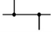 | 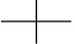 |

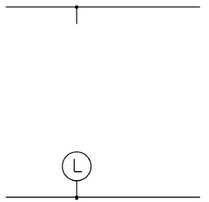

[해설] 시퀀스 / 난이도 下 (변형)

[정답]

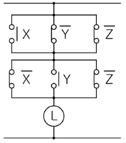

[부분점수]

| 점수 | 세부기준                        |
| ---- | ------------------------------- |
| 4점  | 시퀀스도가 모두 맞으면 4점 획득 |
| 0점  | 시퀀스도에 오류가 있으면 0점    |

---

# Q4 연동선을 사용한 코일의 저항이 0℃에서 4000Ω이었다. 이 코일에 전류를 흘렸더니 그 온도가 상승하여 코일의 저항이 4500Ω으로 되었다고 한다. 이 때 연동선의 온도를 구하시오. [5점]

ㆍ계산과정 :

ㆍ정답:

---

## [해설] 계산형 / 난이도 中 (기출)

[정답]

- 계산과정 : $0[^{\circ}C]$에서 열동선의 온도계수 $a_o = \frac{1}{234.5}$

$$ R_t = [1 + a_o(T-t)]R_o $$

$$ \therefore 4500 = [1 + \frac{1}{234.5}(T-0)] \times 4000 $$

$$ \therefore T = (\frac{4500}{4000} - 1) \times 234.5 = 29.31[^{\circ}C] $$

- 정답 : $29.31[^{\circ}C] $

[부분점수]

| 점수 | 세부기준                               |
| ---- | -------------------------------------- |
| 5점  | 계산과정과 정답이 모두 맞으면 5점 획득 |
| 0점  | 계산과정과 정답에 오류가 있는 경우     |

---

# Q5 한국전기설비 규정에서 정하는 다음의 각 용어에 대한 정의이다. 다음 빈 칸에 알맞은 단어를 적으시오. [4점]

PEN 도체(Protective earthing conductor and neutral conductor)
( ① )회로에서 ( ② ) 겸용 보호 도체를 말한다

PEL 도체(Protective earthing conductor and a line conductor)
( ③ )회로에서 ( ④ ) 겸용 보호 도체를 말한다.

|      | ①   | ②   | ③   | ④   |
| ---- | --- | --- | --- | --- |
| 정답 |     |     |     |     |

---

# 해설] 단순 암기형 / 난이도 下 (변형)

## [정답]

PEN 도체(Protective earthing conductor and neutral conductor)

① (교류)회로에서 ② (중성선) 겸용 보호 도체를 말한다.

PEL 도체(Protective earthing conductor and a line conductor)

③ (직류)회로에서 ④ (선도체) 겸용 보호 도체를 말한다.

## [부분점수]

| 점수 | 세부기준                             |
| ---- | ------------------------------------ |
| 4점  | 소문항 4개 모두 정답이면 4점 획득    |
| 1점  | 소문항 4개 중 정답 1개 당 1점씩 획득 |

---

# Q6 중성점 직접 접지 방식의 장점 및 단점을 3가지씩 쓰시오. [6점]

1. 장점

①

②

③

2. 단점

①

②

③

---

# 해설: 단답 암기형 / 난이도 下 (기출)

## 정답

### 1) 장점

1. 송전선 및 기기의 절연 레벨이 경감된다.
2. 고장 구간의 검출을 위한 보호계전기의 동작이 확실해진다.
3. 피뢰기의 동작 책무가 경감된다.
4. 단절연이 가능하므로 기기의 중량 및 가격이 싸진다.

### 2) 단점

1. 송전선으로부터 통신선에의 유도장해가 발생한다.
2. 차단기가 대전류를 차단할 기회가 많아진다.
3. 계통의 안정도가 나빠진다.
4. 지락 전류가 커서 기기에 주는 충격이 크다.

## 부분점수

| 점수 | 세부기준                             |
| ---- | ------------------------------------ |
| 6점  | 소문항 6개 모두 정답이면 6점 획득    |
| 1점  | 소문항 6개 중 정답 1개 당 1점씩 획득 |

---

# Q7 그림과 같이 환상 직류 배전 선로에서 각 구간의 왕복 저항은 0.1[Ω], 급전점 A의 전압은 100[V], 부하점 B, D의 부하전류는 각각 30[A], 50[A]라 할 때 부하점 B의 전압은 몇 [V]인가? [5점]

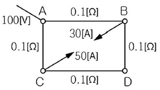

계산과정 :

정답 :

---

## [해설] 단순 계산형 / 난이도 中 (변형)

### [정답]

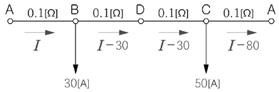

- 계산과정:

위 그림과 같이 전류 방향을 가정하면 폐회로 내의 전압강하의 합은 0이므로

$$ 0.1I + (0.1 + 0.1)(I - 30) + 0.1(I - 80) = 0 $$

$$ 0.4I = 14 $$

$$ I = \frac{14}{0.4} = 35 [A] $$

부하점 B의 전압 $V_B = V_A - IR = 100 - 35 \times 0.1 = 96.5 [V] $

- **정답:** 96.5 [V]

### [부분점수]

| 점수 | 세부기준                               |
| ---- | -------------------------------------- |
| 5점  | 계산과정과 정답이 모두 맞으면 5점 획득 |
| 0점  | 계산과정과 정답에 오류가 있는 경우     |

---

# Q8 개폐기 중에서 다음 기호(심벌)가 의미하는 것은 무엇인지 모두 쓰시오. [5점]

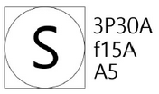

3P30A, f15A, A5

① 3P30A :

② f15A :

③ A5 :

---

## [해설] 단순 계산형 / 난이도 下 (변형)

[정답]

① 3P30A : 3극 30[A] 개폐기

② f15A : 퓨즈 정격 15[A]

③ A5 : 정격전류 5[A] 전류계 붙이

[부분점수]

| 점수 | 세부기준                               |
| ---- | -------------------------------------- |
| 5점  | 소문항 3개 모두 정답이면 5점 획득      |
| 2점  | 소문항 ①, ② 1개 정답일 경우 2점씩 획득 |
| 1점  | 소문항 ③이 정답일 경우 1점 획득        |
| 0점  | 모두 오답일 경우                       |

---

# Q9 가로 10m, 세로 16m, 천정 높이 3.85m, 작업면 높이 0.85m인 사무실에 천장 직부 형광등 F40 × 2를 설치하고자 한다. 다음 물음에 답하시오.

(1) F40 × 2의 그림 기호를 그리시오.

(2) 이 사무실의 실지수는 얼마인가?

- 계산과정 :

- 답: (계산 결과를 입력해야 함)

(3) 이 사무실의 작업면 조도를 300 lx, 천장 반사율 70%, 벽 반사율 50%, 바닥 반사율 10%, 40W 형광등(F40 × 2)의 광속 3150 lm, 보수율 70%, 조명률을 60%로 한다면 이 사무실에 필요한 소요되는 등기구 (F40 × 2) 수는 몇 개인가?

- 계산과정 :

$$ 사무실 면적 = 10m × 16m = 160 m^2 $$

$$ 필요 광속 = \frac{조도 \times 면적}{조명률 \times 보수율 \times (천장 반사율 + 벽 반사율 + 바닥 반사율)} $$

$$ 필요 광속 = \frac{300 \times 160}{0.6 \times 0.7 \times (0.7 + 0.5 + 0.1)} = \frac{48000}{0.6 \times 0.7 \times 1.3} \approx 92772.73 lm $$

$$ 필요한 등기구 수 = \frac{필요 광속}{1개 등기구 광속} = \frac{92772.73}{3150} \approx 29.45 $$

따라서, 30개의 F40 × 2 등기구가 필요하다.

- 답: 30개

---

# [해설] 작도 + 단순 계산형 / 난이도 中 (변형)

## [정답]

(1) F40 × 2의 그림 기호

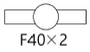

(2) 계산과정 : $실지수(R_l) = \frac{XY}{H(X+Y)} = \frac{10 \times 16}{(3.85 - 0.85) \times (10 + 16)} = 2.05$

- 정답 : 2.05

(3) 계산과정 : $N = \frac{EAD}{FU} = \frac{300 \times 10 \times 16}{3150 \times 0.6 \times 0.7} = 36.28[등]$

- 정답 : 37[등]

## [부분점수]

| 점수 | 세부기준                                                 |
| ---- | -------------------------------------------------------- |
| 7점  | 소문항 3개가 모두 정답이면 7점 획득                      |
| 3점  | 소문항 (3)번의 계산과정과 정답이 모두 맞은 경우 3점 획득 |
| 2점  | 소문항 (2)번의 계산과정과 정답이 모두 맞은 경우 2점 획득 |
| 2점  | 소문항 (1)번이 정답인 경우 2점 획득                      |

---

# Q10 고휘도 방전 램프의 종류를 3가지만 쓰시오. [5점]

①

②

③

---

## [해설] 도면 작성 / 난이도 中 (기출)

[정답]

1. 고압 수은 램프
2. 고압 나트륨 램프
3. 메탈 헬라이드 램프

[부분점수]

| 점수 | 세부기준                          |
| ---- | --------------------------------- |
| 5점  | 답 3개가 모두 맞으면 5점 획득     |
| 3점  | 답 3개 중 2개가 정답이면 3점 획득 |
| 1점  | 답 3개 중 1개가 정답이면 1점 획득 |
| 0점  | 정답에 오류가 있는 경우           |

---

# Q11 그림과 같이 Y결선된 평형 부하에 전압을 측정할 때 전압계의 지시값이 $V_p$ = 150[V], $V_l$ = 220[V]로 나타났다. 다음 각 물음에 답하시오. (단, 부하측에 인가된 전압은 각 상 평형 전압이고 기본파와 제3고조파분 전압만이 포함되어 있다.) [5점]

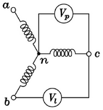

**(1) 제3고조파 전압($V_3$)을 구하시오.**

- 계산과정 :

- 답:

(2) 전압의 왜형률(%)을 구하시오.

- 계산과정 :

- 답:

---

[해설] 단순 계산형 / 난이도 中(기출)

[정답]

(1) · 계산과정: 상전압 V_p에는 기본파와 제3고조파 전압만 존재하므로

$V_p = \sqrt{V_1^2 + V_3^2}, 150 = \sqrt{V_1^2 + V_3^2}$ …… ①

선간 전압 $V_2$에는 제3고조파분이 존재하지 않으므로

$$ V_2 = \sqrt{3} V_1, 220 = \sqrt{3} V_1 …… ② $$

식 ①, ②에서 $V_1 = \frac{220}{\sqrt{3}} = 127.02 [V]$

$$ \therefore V_3 = \sqrt{150^2 - V_1^2} = \sqrt{150^2 - 127.02^2} = 79.79 [V] $$

정답: 79.79[V]

(2)

계산과정

$$ 왜형률 = \frac{\text{전고조파의 실효값}}{\text{기본파의 실효값}} = \frac{V_3}{V_1} = \frac{79.79}{127.02} = 0.6282 = 62.82 [\%] $$

정답 : 62.82[%]

[부분점수]

| 점수 | 세부기준                                                 |
| ---- | -------------------------------------------------------- |
| 5점  | 소문항 (1), (2)의 계산과정과 정답이 모두 맞으면 5점 획득 |
| 3점  | 소문항 (1)의 계산과정과 정답이 모두 맞으면 3점 획득      |
| 2점  | 소문항 (2)의 계산과정과 정답이 모두 맞으면 2점 획득      |
| 0점  | 소문항 2개의 계산과정과 정답에 오류가 있는 경우          |

---

# Q12 3상 3선식 3000[V], 200[kVA]의 배전선로 전압을 3100[V]로 승압하기 위하여 단상 변압기 3대를 그림과 같이 접속하였다. 이 변압기의 1, 2차 전압과 용량을 구하시오. (단, 변압기 손실은 무시한다.) [5점]

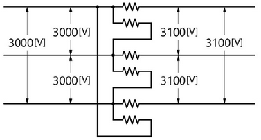

(1) 변압기 1, 2차 전압 [V]

- 계산과정 :
  - 3상 3선식 3000V 시스템에서 단상 변압기를 이용하여 3100V로 승압하는 경우, 각 변압기의 2차측 전압은 3100V가 된다. 각 변압기의 1차측 전압은 3000V이다. Y결선이므로, 선간전압은 상전압의 $\sqrt{3}$배이다.
- 답: 1차 전압: 3000[V], 2차 전압: 3100[V]

(2) 변압기 용량 [kVA]

- 계산과정 :
  - 전체 시스템의 용량은 200kVA 이고, 3개의 단상 변압기를 사용하므로, 각 변압기의 용량은 전체 용량의 1/3이 된다.
- 정답: 200/3[kVA] ≈ 66.67[kVA]

---

# [해설] 단순 계산형 / 난이도 中(기출)

## [정답]

(1)

$$ V_2 = -\frac{V_1}{2} + \sqrt{\frac{V_1^2}{3} - \frac{V_1^2}{12}} = -\frac{3000}{2} + \sqrt{\frac{3100^2}{3} - \frac{3000^2}{12}} = 66.31 [V] $$

- 정답: 변압기 1차 전압: 3000[V], 변압기 2차 전압: 66.31[V]

(2)

$$ 자기 용량 = \frac{3V_2}{\sqrt{3}V_1} \times 부하 용량 = \frac{3 \times 66.31}{\sqrt{3} \times 3100} \times 200 = 7.41 [kVA] $$

- 정답: 7.41[kVA]

## [부분점수]

| 점수 | 세부기준                                            |
| ---- | --------------------------------------------------- |
| 5점  | 소문항 2개의 계산과정과 정답이 모두 맞으면 5점 획득 |
| 3점  | 소문항 (1)의 계산과정과 정답이 모두 맞으면 3점 획득 |
| 2점  | 소문항 (2)의 계산과정과 정답이 모두 맞으면 2점 획득 |
| 0점  | 계산과정과 정답에 오류가 있는 경우                  |

---

# Q13 특고압 전로에 피뢰기 접지 공사를 실시한 후, 접지저항을 보조 접지극 2개(a와 b)를 시설하여 측정하였더니 본 접지와 보조 접지극 a 사이의 저항은 86[Ω], 보조 접지극 a와 보조 접지극 b 사이의 저항은 156[Ω], 보조 접지극 b와 본 접지 사이의 저항은 80[Ω]이었다. 이 때 다음 각 물음에 답하시오. [6점]

(1) 피뢰기의 접지 저항값을 구하시오.

- 계산과정 : (설명 필요)
- 정답 : (계산 결과)

(2) 다음 보기를 참고하여 맞는 것을 빈칸에 작성하시오.

| 종류 | 설명                                                                                     |
| ---- | ---------------------------------------------------------------------------------------- |
| (가) | 계통, 설비 또는 기기의 한 점과 접지극 사이의 도전성 경로 또는 그 경로의 일부가 되는 도체 |
| (나) | 감전에 대한 보호를 목적으로 기기의 한 점 또는 여러 점을 접지하는 것                      |
| (다) | 기기나 계통을 개별적 또는 공통으로 접지하기 위하여 필요한 접속 및 장치로 구성된 설비     |

---

# 해설: 단순 계산형 / 난이도 下 (기출+변형)

## 정답

**(1) 계산과정:** 접지 저항값 $R_E = \frac{1}{2}(86 + 80 - 156) = 5 [\Omega]$

- **정답**: 5[Ω]

(2) 정답: KEC 112 용어 정의

| 종류             | 설명                                                                                     |
| ---------------- | ---------------------------------------------------------------------------------------- |
| (가) 접지 도체   | 계통, 설비 또는 기기의 한 점과 접지극 사이의 도전성 경로 또는 그 경로의 일부가 되는 도체 |
| (나) 보호 접지   | 감전에 대한 보호를 목적으로 기기의 한 점 또는 여러 점을 접지하는 것                      |
| (다) 접지 시스템 | 기기나 계통을 개별적 또는 공통으로 접지하기 위하여 필요한 접속 및 장치로 구성된 설비     |

## 부분점수

| 점수 | 세부기준                                            |
| ---- | --------------------------------------------------- |
| 6점  | 소문항 (1), (2) 모두 정답이면 6점 획득              |
| 3점  | 소문항 (1)의 계산과정과 정답이 모두 맞으면 3점 획득 |
| 3점  | 소문항 (2)의 분류 3개 중 1개당 1점씩 획득           |

---

# Q14 그림과 같은 배선평면도와 주어진 조건을 이용하여 다음 각 물음에 답하시오. [12점]

[조건]

- 사용하는 전선은 모두 NR 4.0[$mm^2$]이다.

* 박스는 모두 4각 박스를 사용하며, 기구 1개에 박스 1개를 사용한다. 2개 연등인 경우에는 각 1개씩을 사용하는 것으로 한다.
* 전선관은 콘크리트 매입 후강 금속관이다.
* 층고는 3[m]이고, 분전반의 설치 높이는 1.5[m]이다.
* 3로 스위치 이외의 스위치는 단극 스위치를 사용하며, 2개를 나란히 사용한 개소는 2개소이다.

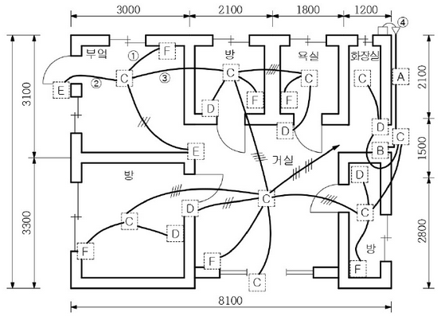

A: 적산전력계(전력량계), B: 분전반(전등용), C: 백열전등, D: 덤블러 스위치, E: 덤블러 스위치(3로 스위치), F: 15[A] 콘센트

(1) 점선으로 표시된 위치(A~F)에 기구를 배치하여 배선평면도를 완성하려고 한다. 해당되는 기구의 그림기호를 그리시오.

| A                          | B                          | C                          | D                          | E                          | F                          |
| -------------------------- | -------------------------- | -------------------------- | -------------------------- | -------------------------- | -------------------------- |
| 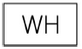 |  |  |  |  |  |

(2) 배선 평면도의 ①~③의 배선 가닥수는 몇 가닥인가?

①

②

③

(3) 도면의 ④에 대한 그림 기호의 명칭은 무엇인가?

(4) 본 배선 평면도에 소요되는 4각 박스와 부싱은 몇 개인가?(단, 자재의 규격은 구분하지 않고 개수만 산정한다.)

---

---

# 해설: 배선도 / 난이도 중 (기출)

## 정답

(1)

| A                          | B                          | C                          | D                          | E                          | F                          |
| -------------------------- | -------------------------- | -------------------------- | -------------------------- | -------------------------- | -------------------------- |
|  |  |  |  |  |  |

(2) ① 2가닥 ② 3가닥 ③ 4가닥

(3) 케이블 헤드

(4) 4각 박스 25개, 부싱 46개

## 부분점수

| 점수 | 세부기준                                       |
| ---- | ---------------------------------------------- |
| 12점 | 소문항 4개가 모두 정답이면 12점 획득           |
| 6점  | 소문항 (1)의 분류 6개 중 정답 개당 1점씩 획득  |
| 3점  | 소문항 (2)의 분류 3개 중 정답 1개당 1점씩 획득 |
| 2점  | 소문항 (4)의 분류 2개 중 정답 1개당 1점씩 획득 |
| 1점  | 소문항 (3)이 정답이면 1점                      |

---

# Q15 다음 그림은 선로에 변류기 3대를 접속시키고 그 잔류 회로에 지락계전기(DG)를 삽입시킨 것이다. 변압기 2차측의 선로 전압은 66[kV]이고, 중성점에 300[Ω]의 저항접지로 하였으며, 변류기의 변류비는 300/5이다. 송전 전력 20,000[kW], 역률 0.8(지상)이고, a상에 완전 지락 사고가 발생하였다고 할 때 다음 각 물음에 답하시오. [6점]

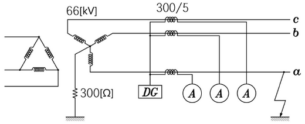

(1) 지락계전기(DG)에 흐르는 전류는 몇 [A]인가?

계산과정 :

정답 :

(2) a상 전류계 A에 흐르는 전류는 몇 [A]인가?

계산과정 :

정답 :

(3) b상 전류계 B에 흐르는 전류는 몇 [A]인가?

계산과정 :

정답 :

(4) c상 전류계 C에 흐르는 전류는 몇 [A]인가?

계산과정 :

정답 :

---

# [해설] 단순 계산형 / 난이도 中 (기출)

## [정답]

(1)

**계산과정**: $I_g = \frac{V/\sqrt{3}}{R} = \frac{66000}{\sqrt{3} \times 300} = 127.02 [A] $

**지락 계전기 DG에 흐르는 전류**: $I\_{DG} = 127.02 \times \frac{5}{300} = 2.12 [A] $

- **정답**: 2.12 [A]

(2)

**계산과정**: 전류계 A에는 부하 전류와 지락 전류의 합이 흐르므로
$$ I_a = \sqrt{ \frac{20000}{\sqrt{3} \times 66 \times 0.8} \times (0.8 - j0.6) + \left( \frac{66 \times 10^3}{\sqrt{3} \times 300} \right)^2 } = 329.24 [A] $$
$$ A = 329.24 \times \frac{5}{300} = 5.49 [A] $$

- **정답**: 5.49 [A]

(3)

- **계산과정**: 전류계 B에는 부하 전류가 흐르므로
  $$ I_b = \frac{20000}{\sqrt{3} \times 66 \times 0.8} = 218.69 [A] $$
$$ B = 218.69 \times \frac{5}{300} = 3.64 [A] $$
- **정답**: 3.64 [A]

(4)

- **계산과정**: 전류계 C에도 부하 전류가 흐르므로
  $$ I_c = \frac{20000}{\sqrt{3} \times 66 \times 0.8} = 218.69 [A] $$
$$ C = 218.69 \times \frac{5}{300} = 3.64 [A] $$
- **정답**: 3.64 [A]

## [부분점수]

| 점수 | 세부기준                                                 |
| ---- | -------------------------------------------------------- |
| 6점  | 소문항 4개의 계산과정과 답이 모두 맞으면 6점 획득        |
| 2점  | 소문항 (2), (3)의 계산과정과 답이 모두 맞으면 2점씩 획득 |
| 1점  | 소문항 (1), (4)의 계산과정과 답이 모두 맞으면 1점씩 획득 |
| 0점  | 계산과정과 답에 모두 오류가 있는 경우                    |

---

# Q16 전력계통에서 단락 용량의 경감대책을 3가지만 쓰시오. [6점]

①

②

③

---

[해설] 단답 암기형 / 난이도 中 (기출)

[정답]

1. 고 임피던스 기기를 채택
2. 모선 계통을 분리 운용
3. 한류 리액터를 설치
   그 외
4. 계통 전압의 격상
5. 직류 연계
6. 고장 전류 제한기 사용

[부분점수]

| 점수 | 세부기준                            |
| ---- | ----------------------------------- |
| 6점  | 소문항 3개 모두 정답이면 6점 획득   |
| 2점  | 소문항 3개 중 정답 1개당 2점씩 획득 |
| 0점  | 답에 모두 오류가 있는 경우          |

---

# Q17 다음의 PLC 프로그램을 보고, 래더 다이어그램을 완성하시오. [5점]

| a접점                      | b접점                      | 출력                       |
| -------------------------- | -------------------------- | -------------------------- |
| 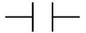 | 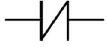 | 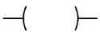 |

| 차례 | 명령    | 번지 |
| ---- | ------- | ---- |
| 0    | STR     | P00  |
| 1    | OR      | P01  |
| 2    | STR NOT | P02  |
| 3    | OR      | P03  |
| 4    | AND STR | -    |
| 5    | AND NOT | P04  |
| 6    | OUT     | P10  |

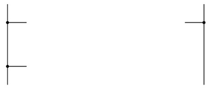

---

## [해설] 복합 계산형 / 난이도 下 (기출)

### [정답]

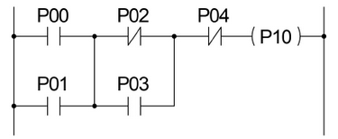

### [부분점수]

| 점수 | 세부기준                          |
| ---- | --------------------------------- |
| 5점  | PLC 회로도가 정답인 경우 5점 획득 |
| 0점  | PLC 회로도에 오류가 있는 경우     |

---

# Q18 그림과 같이 A 변전소에서 B 변전소로 1회선 송전을 하고 있다. 이 경우 B 변전소의 (b) 차단기의 차단 용량을 구하시오. 단, 계통의 %임피던스는 10[MVA]를 기준으로 그림에 표시한 것으로 한다. [5점]

<차단기의 정격 용량>

| 차단용량 [MVA] | 50  | 100 | 200 | 300 | 500 | 750 |
| -------------- | --- | --- | --- | --- | --- | --- |

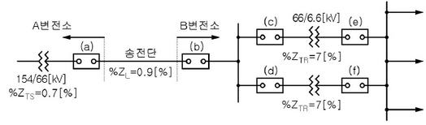

· 계산과정 :

정답 :

---

[해설] 단순 계산형 / 난이도 중 (변형)

[정답]

- 계산과정 :

  ① 고장점까지의 %임피던스
  $$ \%Z = \%Z\_{TS} + \%Z_L = 0.7 + 0.9 = 1.6 [\%] $$

② 단락 용량 $P_s = \frac{100}{\%Z} \times P_n = \frac{100}{1.6} \times 10 = 625 [MVA]$

차단기의 차단 용량은 단락 용량보다 커야 하므로 표에서 750[MVA] 선정

- 정답 : 750[MVA] 선정

[부분점수]

| 점수 | 세부기준                               |
| ---- | -------------------------------------- |
| 5점  | 계산과정과 정답이 모두 맞으면 5점 획득 |
| 0점  | 계산과정과 정답에 오류가 있는 경우     |

---
