# Q1 그림과 같은 전자 릴레이 회로를 미완성 다이오드 매트릭스 회로에 다이오드를 추가시켜 다이오드 매트릭스로 바꾸어 그리시오. [8점]

[전자 릴레이 회로]

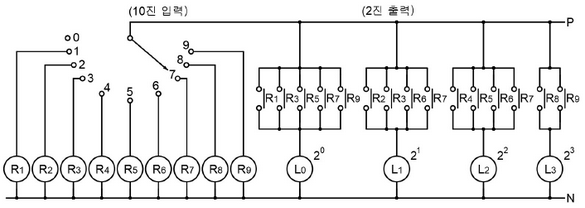

[다이오드 매트릭스]

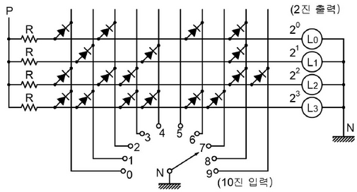

---

## [해설] 작도형 / 난이도 중 (기출)

[정답]

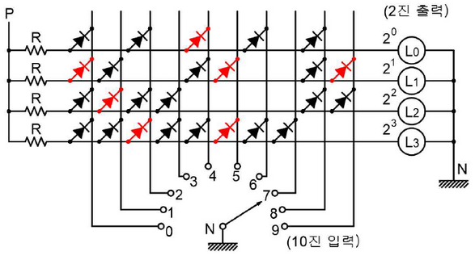

[부분점수]

| 점수 | 세부기준                              |
| ---- | ------------------------------------- |
| 8점  | 전체가 맞으면 8점                     |
| 2점  | $L_0, L_1, L_2, L_3$ 각각 1개당 2점씩 |

---

# Q2 그림과 같은 부하에 전력을 공급하기 위한 변압기 용량은 몇 [kVA]로 하여야 하는지 변압기 표준용량에서 선정하시오. (단, 종합부하의 역률은 85[%], 각 부하군 간의 부등률은 1.3이며, 변압기는 최대부하의 20[%] 정도의 여유도를 갖는 용량으로 하고, 변압기 표준용량 [kVA]은 100, 200, 300, 400, 500이다.) [5점]

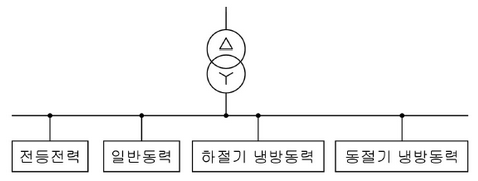

| 부하명   | 전등부하 | 일반동력 | 하절기 냉방동력 | 동절기 냉방동력 |
| -------- | -------- | -------- | --------------- | --------------- |
| 설비용량 | 120[kW]  | 230[kW]  | 130[kW]         | 70[kW]          |
| 수용률   | 70[%]    | 60[%]    | 70[%]           | 65[%]           |

• 계산과정

답

---

# 해설] 계산형 / 난이도 中 (변형)

## [정답]

- 계산과정:

* 전등전력부하 = $120 \times 0.7 = 84 [kW] $
* 일반동력부하 = $230 \times 0.6 = 138 [kW] $
* 하절기 냉방동력부하 = $130 \times 0.7 = 91 [kW] $
* 동절기 난방동력부하 = $70 \times 0.65 = 45.5 [kW] $
* 따라서, 변압기 용량 $= \frac{84 + 138 + 91}{0.85 \times 1.3} \times 1.2 = 339.909 [kVA] $

- 답: 400[kVA] 선정

## [부분점수]

| 점수 | 세부기준                               |
| ---- | -------------------------------------- |
| 5점  | 계산과정과 정답이 모두 맞으면 5점 획득 |
| 0점  | 계산과정과 정답에 오류가 있으면 0점    |

---

# Q3 동작 시 아크를 발생하는 고압용 개폐기, 차단기, 피뢰기 등은 목재의 벽 또는 천장 기타의 가연성 물체로부터 몇 [m] 이상 떼어놓아야 하는가? [3점]

()

---

# 단답 암기형 - 아크를 발생하는 기구의 시설

[정답]

KEC 341.7 아크를 발생하는 기구의 시설

고압용 또는 특고압용의 개폐기·차단기·피뢰기 기타 이와 유사한 기구(이하 이 조에서 “기구 등”이라 한다)로서 동작 시에 아크가 생기는 것은 목재의 벽 또는 천장 기타의 가연성 물체로부터 표 341.7-1에서 정한 값 이상 이격하여 시설하여야 한다.

| **기구 등의 구분** | **이격거리**                                                                                                                                                  |
| ------------------ | ------------------------------------------------------------------------------------------------------------------------------------------------------------- |
| 고압용의 것        | 1[m] 이상                                                                                                                                                     |
| 특고압용의 것      | 2[m] 이상 (사용전압이 35[kV] 이하의 특고압용의 기구 등으로서 동작할 때에 생기는 아크의 방향과 길이를 화재가 발생할 우려가 없도록 제한하는 경우에는 1[m] 이상) |

[부분점수]

| 점수 | 세부기준               |
| ---- | ---------------------- |
| 3점  | 정답이 맞으면 3점 획득 |

---

# Q4 발전기에는 다음의 경우에 자동적으로 이를 전로로부터 차단하는 장치를 시설하여야 한다. 빈칸에 알맞은 것을 답란에 쓰시오. [5점]

1. 발전기에 과전류나 과전압이 생긴 경우

2. 용량이 (①) [kVA] 이상의 발전기를 구동하는 수차의 압유 장치의 유압 또는 전동기의 가이드 밴 제어장치, 전동식 니이들 제어장치 또는 전동식 디플렉터 제어장치의 전원 전압이 현저히 저하한 경우 $$

3. 용량이 (②) [kVA] 이상의 발전기를 구동하는 풍차의 압유 장치의 유압, 압축 공기장치의 공기압 또는 전동식 브레이드 제어장치의 전원 전압이 현저히 저하한 경우 $$

4. 용량이 (③) [kVA] 이상인 수차 발전기의 스러스트 베어링의 온도가 현저히 상승한 경우 $$

5. 용량이 (④) [kVA] 이상인 발전기의 내부에 고장이 생긴 경우 $$

6. 정격출력이 (⑤) [kW]를 초과하는 증기터빈은 그 스러스트 베어링이 현저하게 마모되거나 그의 온도가 현저히 상승한 경우

| ①   | ②   | ③   | ④   | ⑤   |
| --- | --- | --- | --- | --- |
|     |     |     |     |     |

(표에 )

---

# 해설] 단답 암기형 / 난이도 中(신출)

## [정답]

| ①   | ②   | ③     | ④      | ⑤      |
| --- | --- | ----- | ------ | ------ |
| 500 | 100 | 2,000 | 10,000 | 10,000 |

## KEC 351.3 발전기 등의 보호장치

1. 발전기에는 다음의 경우에 자동적으로 이를 전로로부터 차단하는 장치를 시설하여야 한다.

가. 발전기에 과전류나 과전압이 생긴 경우

나. 용량이 500 [kVA] 이상의 발전기를 구동하는 수차의 압유 장치의 유압 또는 전동식 가이드밴 제어장치, 전동식 니이들 제어장치 또는 전동식 디플렉터 제어장치의 전원전압이 현저히 저하한 경우

다. 용량이 100 [kVA] 이상의 발전기를 구동하는 풍차(風車)의 압유장치의 유압, 압축 공기장치의 공기압 또는 전동식 브레이드 제어장치의 전원전압이 현저히 저하한 경우

라. 용량이 2,000 [kVA] 이상인 수차 발전기의 스러스트 베어링의 온도가 현저히 상승한 경우

마. 용량이 10,000 [kVA] 이상인 발전기의 내부에 고장이 생긴 경우

바. 정격출력이 10,000 [kW]를 초과하는 증기터빈은 그 스러스트 베어링이 현저하게 마모되거나 그의 온도가 현저히 상승한 경우

## [부분점수]

| 점수 | 세부기준                               |
| ---- | -------------------------------------- |
| 5점  | 소문항 총 5개가 모두 정답이면 5점 획득 |
| 1점  | 소문항 총 5개 중 1개당 1점씩 획득      |

---

# Q5 다음의 절연내력 시험 전압을 구하여 답란에 쓰시오. [6점]

| 공칭전압 | 최대전압[V]             | 절연내력 시험전압[V] |
| -------- | ----------------------- | -------------------- |
| 6600     | 6900 (비접지)           | ①                    |
| 13200    | 13800 (중성점 다중접지) | ②                    |
| 22900    | 24000 (중성점 다중접지) | ③                    |

---

# [해설] 단순 계산형 / 난이도 下 (기출)

## [정답]

| 공칭전압 | 최대전압 [V]            | 절연내력 시험전압 [V] |
| -------- | ----------------------- | --------------------- |
| 6600     | 6900 (비접지)           | ① 10350               |
| 13200    | 13800 (중성점 다중접지) | ② 12696               |
| 22900    | 24000 (중성점 다중접지) | ③ 22080               |

## [참고]

① 6900 $\times$ 1.5 = 10350 [V]

② 13800 $\times$ 0.92 = 12696 [V]

③ 24000 $\times$ 0.92 = 22080 [V]

## [부분점수]

| 점수 | 세부기준                                    |
| ---- | ------------------------------------------- |
| 6점  | 소문항 총 3개의 정답이 모두 맞으면 6점 획득 |
| 2점  | 소문항 총 3개 중 정답 1개당 2점씩 획득      |

---

# Q6 다음의 그림에서 공급점에서 전력을 공급하여 중간 지점의 부하 역률은 0.8(지상), 말단 지점의 부하 역률은 0.6(지상)일 때 다음 질문에 답하시오. (단, 기타 선로 정수 및 주어지지 않은 조건은 무시한다.) [6점]

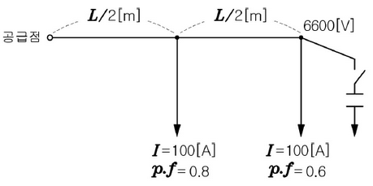

**(1) 공급점에서의 역률을 0.9(지상)로 개선하기 위해 필요한 콘덴서의 용량 $Q_c$[kVA]를 구하시오.**

- 계산과정

- 답

**(2) 선로의 전력손실이 최소 되기 위한 콘덴서의 용량 $Q_c$[kVA]를 구하시오. (단, 말단의 전압은 6600[V]로 일정하고, 저항은 r[Ω/m]이다.)**

- 계산과정

- 답

---

## [해설] 계산형 / 난이도 上 (신출)

(1)

[정답]

- 계산과정

$$ P\_{중간} = \sqrt{3} \times 6600 \times 100 \times 0.8 \times 10^{-3} = 914.522 \text{ [kW]} $$

$$ Q\_{중간} = 914.522 \times \left( \frac{4}{3} \times \frac{\sqrt{1 - 0.9^2}}{0.9} \right) = 242.968 \text{ [kVA]} $$

$$ P\_{말단} = \sqrt{3} \times 6600 \times 100 \times 0.6 \times 10^{-3} = 685.892 \text{ [kW]} $$

$$ Q\_{말단} = 685.892 \times \left( \frac{4}{3} \times \frac{\sqrt{1 - 0.9^2}}{0.9} \right) = 582.330 \text{ [kVA]} $$

$$ Q*c = Q*{중간} + Q\_{말단} = 242.968 + 582.330 = 825.298 \approx 825.30 \text{ [kVA]} $$

- **답**: 825.30 [kVA]

(2)

[정답]

- 계산과정

$$ P*1 = 3I_1^2R + 3I_2^2R = 3 \left( \frac{L}{2} \times r \right) \left( I*{1}^2 + I\_{2}^2 \right) $$

$$ = 3 \left( \frac{L}{2} \times r \right) \left\{ \left( \sqrt{(80+60)^2 + (60+80-I_L)^2} \right)^2 + \left( \sqrt{(60)^2 + (80-I_L)^2} \right)^2 \right\} $$

공급전류와 말단 전류의 값이 최소가 되도록

$2I_L^2 - 440I_L + (140^2 + 80^2)$의 미분이 0이 되는 값을 구하여

최소 전류 $I_L$의 값을 구하면 $I_L = 110 \text{ [A]}$

$$ Q\_{c, 최소손실} = \sqrt{3} \times 6600 \times 110 \times 10^{-3} = 1257.468 \approx 1257.47 \text{ [kVA]} $$

- **답**: 1257.47 [kVA]

[부분점수]

| 점수 | 세부기준                                              |
| ---- | ----------------------------------------------------- |
| 6점  | 소문항 2개의 계산과정과 정답이 모두 맞으면 6점 획득   |
| 3점  | 소문항의 계산과정과 정답이 모두 맞는 1개당 3점씩 획득 |

---

# Q7 다음은 전력시설물 공사감리업무 수행지침과 관련된 사항이다. 빈칸에 알맞은 내용을 답란에 쓰시오. [5점]

감리원은 설계도서 등에 대하여 공사계약문서 상호 간의 모순되는 사항, 현장 실정과의 부합여부 등 현장 시공을 주안으로 하여 해당 공사 시작 전에 검토하여야 하며 검토내용에는 다음 각 호의 사항 등이 포함되어야 한다.

1. 현장조건에 부합 여부
2. 시공의 (①) 여부
3. 다른 사업 또는 다른 공정과의 상호부합 여부
4. (②), 설계설명서, 기술계산서, (③) 등의 내용에 대한 상호일치 여부
5. (④), 오류 등 불명확한 부분의 존재여부
6. 발주자가 제공한 (⑤) 와 공사업자가 제출한 산출내역서의 수량일치 여부
7. 시공 상의 예상 문제점 및 대책 등

| ①   | ②   | ③   | ④   | ⑤   |
| --- | --- | --- | --- | --- |
|     |     |     |     |     |

---

[해설] 단순 암기형 / 난이도 下 (기출)

[정답]

| ①         | ②        | ③          | ④               | ⑤           |
| --------- | -------- | ---------- | --------------- | ----------- |
| 실제 가능 | 설계도면 | 산출내역서 | 설계도서의 누락 | 물량 내역서 |

[부분점수]

| 점수 | 세부기준                                    |
| ---- | ------------------------------------------- |
| 5점  | 소문항 총 5개의 정답이 모두 맞으면 5점 획득 |
| 1점  | 소문항 총 5개 중 정답 1개당 1점씩 획득      |

---

# Q8 다음은 컴퓨터 등의 중요한 부하에 대한 무정전 전원공급을 위한 그림입니다. "①~⑤"에 적당한 전기 시설물의 명칭을 쓰시오. [5점]

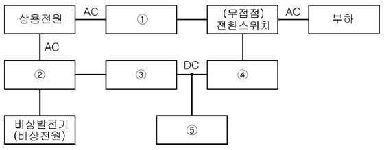

| 번호 | 명칭 |
| ---- | ---- |
| ①    |      |
| ②    |      |
| ③    |      |
| ④    |      |
| ⑤    |      |

---

# [해설] 단순 암기형 / 난이도 下 (기출)

## [정답]

| ①                    | ②                          | ③               | ④      | ⑤      |
| -------------------- | -------------------------- | --------------- | ------ | ------ |
| 자동전압조정기 (AVR) | 전환스위치 (절체용 개폐기) | 정류기 (컨버터) | 인버터 | 축전지 |

## [부분점수]

| 점수 | 세부기준                                    |
| ---- | ------------------------------------------- |
| 5점  | 소문항 총 5개의 정답이 모두 맞으면 5점 획득 |
| 1점  | 소문항 총 5개 중 정답 1개당 1점씩 획득      |

---

# Q9 다음의 그림은 TN 계통의 TN-C-S 방식의 저압 배전선로의 접지계통이다. 결선도를 완성하시오. [4점]

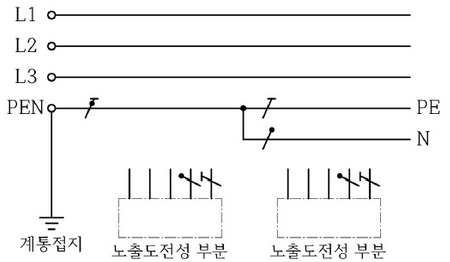

---

## [해설] 작도형 / 난이도 下 (기출)

### [정답]

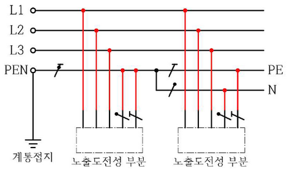

### [부분점수]

| 점수 | 세부기준                                |
| ---- | --------------------------------------- |
| 4점  | 도면 작도가 정답과 모두 맞으면 4점 획득 |
| 0점  | 도면 작도에 오류가 있으면 0점           |

---

# Q10 한국전기설비규정에 따른 지중전선로를 시설할 때 다음 빈 칸에 대하여 쓰시오.[6점]

1. 지중 전선로는 전선에 케이블을 사용하고 또한 ( ① )·암거식(暗渠式) 또는 ( ② )에 의하여 시설하여야 한다.

2. 지중 전선로를 ( ① ) 또는 암거식에 의하여 시설하는 경우에는 다음에 따라야 한다.

가. ( ① )에 의하여 시설하는 경우에는 매설 깊이를 ( ③ )[m] 이상으로 하되, 매설 깊이가 충분하지 못한 장소에는 견고하고 차량 기타 중량물의 압력에 견디는 것을 사용할 것. 다만 중량물의 압력을 받을 우려가 없는 곳은 0.6[m] 이상으로 한다.

| ①   | ②   | ③   |
| --- | --- | --- |
|     |     |     |

---

[해설] 단답 암기형 / 난이도 下 (신출)

[정답]

| ①      | ②          | ③   |
| ------ | ---------- | --- |
| 관로식 | 직접매설식 | 1   |

[부분점수]

| 점수 | 세부기준                                    |
| ---- | ------------------------------------------- |
| 6점  | 소문항 총 3개의 정답이 모두 맞으면 6점 획득 |
| 2점  | 소문항 총 3개 중 정답 1개 당 2점 획득       |

---

# Q11 그림은 통상적인 단락, 지락 보호에 쓰이는 방식으로서 주보호와 후비보호의 기능을 지니고 있다. 도면을 보고 다음 각 물음에 답하시오. [14점]

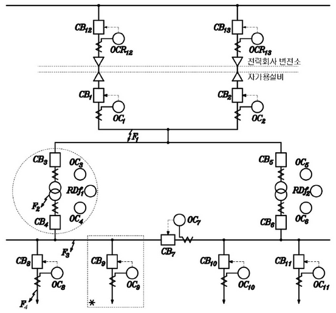

**(1) 사고점이 $F_1, F_2, F_3, F_4$라고 할 때, 주 보호와 후비 보호에 대한 다음 표의 빈칸을 채우시오.**

| 사고점 | 주 보호                             | 후비 보호                           |
| ------ | ----------------------------------- | ----------------------------------- |
| $F_1$  | $OC_1$ + $CB_1$ And $OC_2$ + $CB_2$ | $OC_1$ + $CB_1$ And $OC_2$ + $CB_2$ |
| $F_2$  | $OC_3$ + $CB_3$ And $OC_4$ + $CB_4$ | $OC_3$ + $CB_3$ And $OC_6$ + $CB_6$ |
| $F_3$  | $OC_4$ + $CB_4$ And $OC_7$ + $CB_7$ | $OC_4$ + $CB_4$ And $OC_7$ + $CB_7$ |
| $F_4$  | $OC_5$ + $CB_5$                     | $OC_8$ + $CB_8$                     |

(2) 그림은 도면의 \*표 부분을 좀 더 상세하게 나타낸 도면이다. 각 부분 ①~④에 대한 명칭을 쓰고, 보호 기능 구성상 ⑤~⑦의 부분을 검출부, 판정부, 동작부로 나누어 표현하시오.

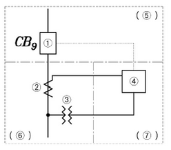

| 부분 | 명칭 |
| ---- | ---- |
| ①    |      |
| ②    |      |
| ③    |      |
| ④    |      |
| ⑤    |      |
| ⑥    |      |
| ⑦    |      |

**(3) 답란의 그림 $F_2$사고와 관련된 검출부, 판정부, 동작부의 도면을 완성하시오. 단, 질문 "(2)"의 도면을 참고하시오.**

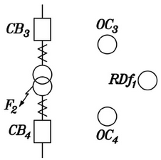

---

# [해설] 단답형+작도형 / 난이도 中 (기출)

## [정답]

(1)

| ①                                         | ②                                     |
| ----------------------------------------- | ------------------------------------- |
| $OC*{12} + CB*{12} And OC*{13} + CB*{13}$ | $RDf_1 + OC_4 + CB_4 And OC_3 + CB_3$ |

(2)

| ①           | ②      | ③             | ④             | ⑤      | ⑥      | ⑦      |
| ----------- | ------ | ------------- | ------------- | ------ | ------ | ------ |
| 교류 차단기 | 변류기 | 계기용 변압기 | 과전류 계전기 | 동작부 | 검출부 | 판정부 |

(3)

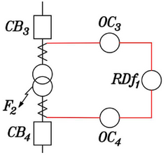

(부분점수)

| 점수  | 세부기준                                            |
| ----- | --------------------------------------------------- |
| 14점  | 중문항 총 3개 정답이 모두 맞으면 14점 획득          |
| 4~0점 | 중문항 (1)번의 소문항 2개 중 정답 1개 당 2점씩 획득 |
| 7~0점 | 중문항 (2)번의 소문항 7개 중 정답 1개 당 1점씩 획득 |
| 3점   | 중문항 (3)번이 정답인 경우 3점 획득                 |

---

# Q12 한류형 퓨즈의 단점 4가지를 쓰시오. [4점]

-
-
-
-

# 해설: 단순 암기형 / 난이도 下 (기출)

## 정답

- 재투입이 불가능하다.
- 비보호 영역이 있다.
- 최소 차단전류 영역이 있다.
- 차단 시 과전압이 발생한다.

이 외에,

- 비보호 영역이 있어 사용 중에 열화 동작에 의해 결상 우려가 있다.
- 고 임피던스 접지계통의 지락 보호는 불가하다.
- 동작 시간 - 전류 특성을 계전기처럼 마음대로 조정이 불가능하다.
- 과도전류에 용단되기 쉽고, 결상을 일으킬 염려가 있다.

## 부분점수

| 점수 | 세부기준                                    |
| ---- | ------------------------------------------- |
| 4점  | 소문항 총 4개의 정답이 모두 맞으면 4점 획득 |
| 1점  | 소문항 총 4개 중 정답 1개당 1점씩 획득      |

---

# Q13 수전 방식 중 스폰네트워크방식의 특징 3가지를 쓰시오. [6점]

(답안 작성 공간)

---

## [해설] 단순 암기형 / 난이도 下 (기출)

[정답]

- 무정전 전력공급이 가능하므로 공급 신뢰도가 높다.
- 전압 변동률이 낮다.
- 전압변동률이 적고, 플리커 현상이 적다.

이 외에

- 기기 이용률이 향상된다.
- 부하 증가에 대한 적응성이 좋다.
- 변전소의 수를 줄일 수 있다.
- 인축의 접지 사고가 증가한다.
- 고장 시 고장 전류가 역류한다

[부분점수]

| 점수 | 세부기준                                    |
| ---- | ------------------------------------------- |
| 6점  | 소문항 총 3개의 정답이 모두 맞으면 6점 획득 |
| 2점  | 소문항 총 3개 중 정답 1개 당 2점 획득       |

---

# Q14 방폭구조 종류 4가지를 쓰시오. [4점]

(답변 공간)

---

# [해설] 단순 암기형 / 난이도 下 (기출)

## [정답]

- 내압 방폭구조
- 유입 방폭구조
- 압력 방폭구조
- 안전증 방폭구조

이 외에,

- 본질안전 방폭구조
- 특수 방폭구조
- 비점화 방폭구조
- 몰드 방폭구조
- 충전 방폭구조

## [부분점수]

| 점수 | 세부기준                            |
| ---- | ----------------------------------- |
| 4점  | 소문항 4개가 모두 정답이면 4점 획득 |
| 1점  | 소문항 4개 중 정답 1개 당 1점 획득  |

---

# Q15 140[kV]의 송전선이 있다. 이 송전선의 4단자 정수는 $A = 0.9, B = j380, C = j0.5 \times 10^{-3}, D = 0.9$이고, 무부하시 송전단에 154[kV]를 인가하였을 때 다음 각 물음에 답하시오. [7점]

(1) 수전단 전압 [kV] 및 송전단 전류 [A]를 구하시오

① 수전단 전압

- 계산과정 : (공간부족으로 계산과정 생략)
- 정답 : (공간부족으로 정답 생략)

② 송전단 전류

- 계산과정 : (공간부족으로 계산과정 생략)
- 정답 : (공간부족으로 정답 생략)

(2) 수전단 전압은 140[kV]로 유지하려고 한다. 이때 수전단에서 필요로 하는 조상설비용량은 몇 [kVA]인지 구하시오.

- 계산과정 : (공간부족으로 계산과정 생략)
- 정답 : (공간부족으로 정답 생략)

---

## [해설] 계산형 / 난이도 中 (변형)

[정답]

(1)

① 수전단 전압

- 계산과정 : 송전단의 선간전압 $V_s = AV_r + \sqrt{3}BI_r$이고, 무부하 시 ($I_r$ = 0)이므로, 수전단 전압
  $$ V_r = \frac{V_s}{A} = \frac{154}{0.9} = 171.11 [kV] $$

* 정답: 171.11 [kV]

② 송전단 전류

- 계산과정 : 송전단 전류 $I_s = C\frac{V_r}{\sqrt{3}} + DI_r$이고, 무부하 시 ($I_r$ = 0)이므로
  $$ I_s = C\frac{V_r}{\sqrt{3}} = j0.5 \times 10^{-3} \times \frac{171.11 \times 10^3}{\sqrt{3}} = j49.395 [A] $$

* 정답: j49.4 [A]

(2)

- 계산과정 : 수전단 전압을 140 [kV]로 유지하기 위해 설치한 조상기의 전류를 $I_c$ 라고 하면 $V_r = AV_s + \sqrt{3}BI_c$ 에서
  $$ I_c = \frac{V_s - AV_r}{\sqrt{3}B} = \frac{154 \times 10^3 - 0.9 \times 140 \times 10^3}{\sqrt{3} \times j380} = -j42.54 [A] $$

따라서 수전단에서 필요로 하는 조상설비용량 Q는
$$ Q = \sqrt{3}V_r I_c \times 10^{-3} = \sqrt{3} \times 140 \times 10^3 \times 42.54 \times 10^{-3} = 10315.40 [kVA] $$

- 정답: 10315.40 [kVA]

[부분점수]

| 점수  | 세부기준                                                              |
| ----- | --------------------------------------------------------------------- |
| 7점   | 중문항 2개의 계산과정과 정답이 모두 맞으면 7점 획득                   |
| 4~2점 | 중문항 (1)의 소문항 2개 중 계산과정과 정답이 맞는 경우 1개당 2점 획득 |
| 3점   | 중문항 (2)의 계산과정과 정답이 맞으면 3점 획득                        |

---

# Q16 송전단 전압이 3300 [V]인 변전소로부터 5.8 [km] 떨어진 곳에 있는 역률 0.9(지상) 500 [kW]의 3상 동력 부하에 대하여 지중 송전선을 설치하여 전력을 공급하고자 한다. 케이블의 허용전류(또는 안전전류) 범위 내에서 전압강하가 10%를 초과하지 않도록 심선의 굵기를 결정하시오. 단, 케이블의 허용 전류는 다음 표와 같으며 도체(동선)의 고유저항은 $\frac{1}{55} [\Omega \cdot mm^2 / m]$ 로 하고 케이블의 정전 용량 및 리액턴스 등은 무시한다. [5점]

| 심선의 굵기 [mm²] | 16  | 25  | 35  | 50  | 60  | 95  | 120 | 150 |
| ----------------- | --- | --- | --- | --- | --- | --- | --- | --- |
| 허용 전류 [A]     | 50  | 70  | 90  | 100 | 110 | 140 | 180 | 200 |

계산과정 :

정답 :

---

## [해설] 계산형 / 난이도 中 (기출)

[정답]

- 계산과정:

① 전압 강하율 $\epsilon = \frac{V_S - V_R}{V_R} \times 100[\%] = 10[\%] $이므로,

$$ V_R = \frac{V_S}{1 + \epsilon} = \frac{3300}{1 + 0.1} = 3000 [V] $$

② $\epsilon = V_S - V_R = 3300 - 3000 = \sqrt{3} I R \cos\theta + X \sin\theta$

$$ I = \frac{P}{\sqrt{3} V_R \cos\theta} = \frac{500 \times 10^3}{\sqrt{3} \times 3000 \times 0.9} = 106.92 [A] $$

조건에서 리액턴스를 무시하면 $\epsilon = \sqrt{3} I R \cos\theta 에서 R = \frac{\epsilon}{\sqrt{3} I \cos\theta}$ 가 된다.

$$ \therefore R = \frac{300}{\sqrt{3} \times 106.92 \times 0.9} = 1.8 [\Omega] $$

③ $R = \rho \frac{l}{A} 에서 A = \rho \frac{l}{R} $이므로 $A = \frac{1}{55} \times \frac{5800}{1.8} = 58.59 [mm^2]$

- 정답 : 60[$mm^2$] 선정

[부분점수]

| 점수 | 세부기준                                 |
| ---- | ---------------------------------------- |
| 6점  | 소문항 2개 정답이 모두 맞으면 6점 획득   |
| 3점  | 소문항 2개 중 정답이 1개 맞으면 3점 획득 |
| 0점  | 소문항 2개 정답이 모두 틀리면 0점        |

---

# Q17 다음 그림 기호에 대한 명칭과 그 기능을 쓰시오. [3점]

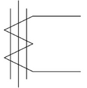

- 명칭 :

- 기능 :

---

## [해설] 단순 암기형 / 난이도 下 (변형)

[정답]

- **명칭**: 영상 변류기
- **기능**: 지락 사고 시 영상 전류를 검출한다.

[부분점수]

| 점수 | 세부기준                                 |
| ---- | ---------------------------------------- |
| 3점  | 소문항 2개의 정답이 모두 맞으면 3점 획득 |
| 2점  | 소문항 중 기능이 정답이면 2점 획득       |
| 1점  | 소문항 중 명칭이 정답이면 1점 획득       |

---

# Q18 한류저항기 설치목적 2가지를 쓰시오. [4점]

-
-

# 해설: 단순 암기형 / 난이도 中 (변형)

## [정답]

- 계전기를 동작시키는 데 필요한 유효전류를 발생
- 오픈델타 회로의 각 상전압 중의 제3고조파 억제

## 이 외에

- 중성점 불안정 등 비접지 회로의 이상 현상 억제
- 계전기 구종에 필요한 지락전류의 제한

## [부분점수]

| 점수 | 세부기준                                 |
| ---- | ---------------------------------------- |
| 4점  | 소문항 2개의 정답이 모두 맞으면 4점 획득 |
| 2점  | 소문항 2개 중 정답 1개 당 2점씩 획득     |

---
